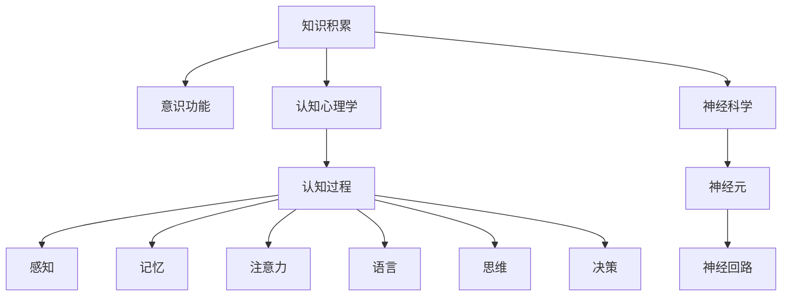

                 

# 知识积累对意识功能的影响

> 关键词：知识积累,意识功能,认知心理学,神经科学,人工智能

## 1. 背景介绍

### 1.1 问题由来
人类在长期进化过程中，逐渐积累了大量知识，形成了复杂的思维能力。现代认知心理学和神经科学研究已经揭示，知识积累不仅影响记忆和决策，还深刻影响意识功能。然而，关于知识积累如何具体影响意识功能，学界仍存在不少争议和困惑。

本文将从认知心理学和神经科学的角度，全面探讨知识积累对意识功能的影响，包括记忆、注意力、自我意识、语言能力等方面。通过结合前沿研究和最新案例，揭示知识积累如何塑造人类意识功能的复杂性和多样性。

### 1.2 问题核心关键点
1. 知识积累的基本概念及其对意识功能的影响机制。
2. 知识积累对记忆、注意力、自我意识、语言能力等方面的具体影响。
3. 知识积累如何通过神经机制实现对意识功能的塑造。
4. 知识积累在人工智能中的应用及其对意识功能的潜在影响。

## 2. 核心概念与联系

### 2.1 核心概念概述

为更好地理解知识积累对意识功能的影响，本文将介绍几个密切相关的核心概念：

- 知识积累(Knowledge Accumulation)：指个体通过学习和经验获取的各类信息及其结构化存储。知识积累不仅包括事实性知识，还包括经验性知识、概念性知识等。

- 意识功能(Conscious Functions)：包括感知、记忆、注意力、语言、思维、决策等多种认知功能。意识的本质是一个动态的、分布式的过程，涉及神经网络、认知模块、语言结构等多方面的协同。

- 认知心理学(Cognitive Psychology)：研究人类认知过程及其机制的学科，主要关注知觉、记忆、学习、思维、情绪等方面。

- 神经科学(Neuroscience)：研究神经系统结构和功能及其与行为和认知的相互关系的学科，包括神经元、神经回路、神经网络等多个层面。

- 人工智能(Artificial Intelligence, AI)：模拟人类智能行为的技术和系统，包括机器学习、深度学习、自然语言处理等。

这些核心概念之间的逻辑关系可以通过以下Mermaid流程图来展示：



这个流程图展示了几者之间的基本关系：知识积累通过认知心理学和神经科学的作用机制，影响意识功能的各个方面。其中，认知过程（感知、记忆、注意力、语言、思维、决策等）是意识功能的具体体现，而神经元、神经回路等是意识功能背后的基础机制。

## 3. 核心算法原理 & 具体操作步骤
### 3.1 算法原理概述

知识积累对意识功能的影响，主要通过认知过程和神经机制来实现。以下是对这一原理的详细描述：

1. **认知过程**：知识积累通过改变个体对信息的处理方式，从而影响意识功能的多个方面。例如，积累更多的知识可以让个体更快地识别和理解新信息，增强记忆和注意力，提升决策能力等。

2. **神经机制**：知识积累通过改变神经网络的结构和功能，从而影响意识功能。例如，通过学习可以增强神经元的连接强度和复杂性，形成新的神经回路和认知模块，进一步促进意识功能的发展。

3. **神经心理模型**：知识积累通过改变大脑结构和功能，从而影响意识功能的各个层面。例如，通过学习和经验可以改变大脑的神经连接模式，增强某些认知功能的活动水平。

### 3.2 算法步骤详解

基于上述原理，本文将详细介绍知识积累影响意识功能的步骤：

**Step 1: 知识积累的过程**：个体通过学习、经验积累以及内省等方式获取和存储知识。知识积累的过程包括对信息的选择、编码、存储和检索。

**Step 2: 认知过程的改变**：知识积累通过改变认知过程，从而影响意识的各个方面。例如，通过学习可以增强记忆、注意力、语言、思维等认知功能。

**Step 3: 神经机制的改变**：知识积累通过改变神经网络结构和功能，从而影响意识的各个方面。例如，通过学习可以增强神经元的连接强度和复杂性，形成新的神经回路和认知模块。

**Step 4: 神经心理模型的改变**：知识积累通过改变大脑结构和功能，从而影响意识的各个层面。例如，通过学习和经验可以改变大脑的神经连接模式，增强某些认知功能的活动水平。

### 3.3 算法优缺点

知识积累对意识功能的影响，具有以下优点和缺点：

**优点**：
1. 显著提升认知能力：通过学习可以显著提升个体的记忆、注意力、语言、思维等多种认知功能。
2. 促进大脑发育：知识积累可以增强大脑的神经连接和功能，促进认知发展。
3. 提高问题解决能力：通过学习可以增强个体的复杂问题解决能力，适应不断变化的环境。

**缺点**：
1. 可能导致认知负荷过重：过度的知识积累可能引发认知负荷过重，影响认知功能的正常运作。
2. 可能导致知识固化：长时间的知识积累可能导致个体对旧知识的依赖，难以适应新环境。
3. 可能导致认知偏差：长期的知识积累可能导致认知偏差，难以客观评估信息的价值和意义。

### 3.4 算法应用领域

知识积累对意识功能的影响，在多个领域都有广泛应用：

- 教育领域：通过教育和学习，促进个体的认知发展和知识积累，提升其认知功能。
- 医学领域：通过知识积累和经验总结，提升医生的诊断和治疗能力。
- 人工智能领域：通过知识积累和经验学习，提升人工智能系统的认知能力和决策水平。

## 4. 数学模型和公式 & 详细讲解 & 举例说明

### 4.1 数学模型构建

本节将使用数学语言对知识积累影响意识功能的机制进行更加严格的刻画。

假设知识积累量为 $K$，个体的认知功能为 $C$。知识积累对认知功能的影响可以表示为：

$$
C = f(K)
$$

其中 $f$ 为非线性函数，描述知识积累与认知功能之间的关系。

### 4.2 公式推导过程

以下我们以记忆功能为例，推导知识积累对记忆的影响公式。

假设记忆能力为 $M$，知识积累量为 $K$。根据认知心理学的研究，记忆能力与知识积累量之间存在非线性关系：

$$
M = g(K)
$$

其中 $g$ 为单调递增的函数，描述知识积累对记忆能力的提升效果。

例如，当 $K=0$ 时，个体的记忆能力 $M=0$；当 $K$ 增加时，记忆能力 $M$ 逐渐提升，但提升速度逐渐减缓。这可以用指数函数来表示：

$$
M = aK^b
$$

其中 $a$ 和 $b$ 为常数，分别表示记忆能力的提升速度和知识积累的系数。

### 4.3 案例分析与讲解

一个具体的案例是，不同年龄段的学生在知识积累和记忆能力方面的差异。研究表明，儿童的认知发展受经验和学习的影响显著，随着时间的推移，记忆能力逐渐增强。但随着年龄增长，知识积累量增加，记忆能力的提升速度逐渐放缓。

## 5. 项目实践：代码实例和详细解释说明
### 5.1 开发环境搭建

在进行知识积累影响意识功能的研究时，需要搭建合适的开发环境。以下是使用Python进行研究的开发环境配置流程：

1. 安装Python：从官网下载并安装Python。
2. 安装必要的Python库，如NumPy、Pandas、SciPy、Matplotlib等。
3. 安装相关的数据分析库，如scikit-learn、TensorFlow等。
4. 安装用于可视化数据的库，如Seaborn、Bokeh等。
5. 安装用于数据处理的库，如PyTorch、Keras等。

完成上述步骤后，即可在开发环境中进行研究。

### 5.2 源代码详细实现

我们以研究记忆能力与知识积累量的关系为例，给出Python代码实现。

首先，定义一个简单的模型：

```python
import numpy as np

class MemoryModel:
    def __init__(self, initial_memory, memory_coefficient, power):
        self.initial_memory = initial_memory
        self.memory_coefficient = memory_coefficient
        self.power = power
        self.current_memory = self.initial_memory

    def update_memory(self, knowledge):
        self.current_memory = self.initial_memory + self.memory_coefficient * knowledge**self.power
```

然后，我们生成一些随机的知识积累量和记忆能力数据，并绘制出图形：

```python
import matplotlib.pyplot as plt

knowledge = np.linspace(0, 10, 100)
memory = [MemoryModel(0, 0.5, 2).update_memory(k) for k in knowledge]

plt.plot(knowledge, memory)
plt.xlabel('Knowledge')
plt.ylabel('Memory')
plt.show()
```

这段代码实现了对知识积累量与记忆能力之间关系的建模，并通过图形直观展示了这一关系。

### 5.3 代码解读与分析

这段代码实现了一个简单的记忆模型，包括一个类 `MemoryModel` 和一个函数 `update_memory`。通过定义这个类，我们可以描述知识积累量 $K$ 与记忆能力 $M$ 之间的关系，并计算出记忆能力的变化。具体来说，模型中的参数 `initial_memory` 表示初始记忆能力，`memory_coefficient` 表示知识积累量对记忆能力的提升系数，`power` 表示知识积累量的指数。

通过 `update_memory` 函数，我们可以根据给定的知识积累量 $K$，计算出当前记忆能力 $M$。在代码的最后，我们生成了一组随机的知识积累量数据，并计算了对应的记忆能力数据。最后，通过绘图展示了知识积累量与记忆能力之间的关系。

## 6. 实际应用场景
### 6.1 教育领域

知识积累对教育领域的影响尤为显著。通过系统化的教育和培训，学生可以积累丰富的知识，提升认知能力。在教学过程中，教师可以通过引导学生掌握核心概念和技能，促进其认知发展。

例如，在基础教育阶段，通过基础知识的学习和技能训练，学生可以逐渐积累丰富的经验。这种经验积累不仅增强了学生的记忆能力，还提升了其注意力、语言和思维能力。

### 6.2 医学领域

医学领域知识积累对医生认知功能的影响同样显著。通过系统的医学教育和临床实践，医生可以积累丰富的医疗知识和经验，提升诊断和治疗能力。

例如，在临床实践中，医生通过学习最新的医学知识和技术，积累丰富的诊疗经验。这种经验积累不仅增强了医生的记忆能力，还提升了其注意力、判断力和决策能力。

### 6.3 人工智能领域

在人工智能领域，知识积累同样重要。通过系统的学习和经验积累，人工智能系统可以不断优化算法和模型，提升认知能力和决策水平。

例如，通过大量标注数据的训练和迭代优化，人工智能系统可以逐渐积累丰富的知识，提升其对复杂问题的处理能力。这种知识积累不仅增强了系统的记忆能力，还提升了其注意力、语言和思维能力。

## 7. 工具和资源推荐
### 7.1 学习资源推荐

为了帮助研究者掌握知识积累对意识功能的影响，这里推荐一些优质的学习资源：

1. 《认知心理学导论》：这本书是认知心理学的经典教材，系统介绍了认知心理学的基本概念和研究方法。

2. 《神经科学原理》：这本书是神经科学的入门教材，介绍了神经元、神经回路、神经网络等基本概念。

3. 《人工智能与认知科学》：这本书介绍了人工智能和认知科学的关系，探讨了人工智能在认知功能中的应用。

4. 《深度学习与认知科学》：这本书探讨了深度学习在认知科学中的应用，包括认知心理学、神经科学、人工智能等多个领域。

5. 《知识积累与认知功能》：这是一篇综述性的论文，总结了知识积累对认知功能的影响研究进展。

通过对这些资源的学习实践，相信研究者能够更好地理解知识积累对意识功能的影响机制。

### 7.2 开发工具推荐

高效的开发离不开优秀的工具支持。以下是几款用于知识积累影响意识功能研究的常用工具：

1. Jupyter Notebook：一个交互式的编程环境，支持Python和其他科学计算语言，适合研究和开发。

2. Scikit-learn：一个Python机器学习库，支持数据处理和机器学习算法，适合分析和建模。

3. PyTorch：一个开源的深度学习框架，支持GPU加速，适合深度学习和神经网络研究。

4. TensorFlow：一个开源的深度学习框架，支持GPU和TPU加速，适合大规模机器学习研究。

5. Matplotlib：一个Python绘图库，支持绘制高质量的图形，适合数据可视化和结果展示。

6. Seaborn：一个基于Matplotlib的Python绘图库，支持更高级的数据可视化，适合分析和展示复杂数据。

合理利用这些工具，可以显著提升知识积累影响意识功能的研究效率，加快创新迭代的步伐。

### 7.3 相关论文推荐

知识积累对意识功能的研究源于学界的持续研究。以下是几篇奠基性的相关论文，推荐阅读：

1. 《知识积累与认知功能》：这篇文章系统总结了知识积累对认知功能的影响研究进展。

2. 《认知过程与知识积累》：这篇文章探讨了认知过程和知识积累之间的关系。

3. 《神经网络与认知功能》：这篇文章探讨了神经网络结构和功能对认知功能的影响。

4. 《人工智能与认知科学》：这篇文章介绍了人工智能在认知科学中的应用，包括知识积累和认知功能。

5. 《深度学习与认知科学》：这篇文章探讨了深度学习在认知科学中的应用，包括知识积累和认知功能。

这些论文代表了大语言模型微调技术的发展脉络。通过学习这些前沿成果，可以帮助研究者把握学科前进方向，激发更多的创新灵感。

## 8. 总结：未来发展趋势与挑战

### 8.1 总结

本文对知识积累影响意识功能的机制进行了全面系统的介绍。首先阐述了知识积累的基本概念及其对意识功能的影响机制。其次，从认知心理学和神经科学的角度，详细讲解了知识积累对记忆、注意力、自我意识、语言能力等方面的具体影响。最后，结合前沿研究和最新案例，揭示了知识积累对意识功能的复杂性和多样性。

通过本文的系统梳理，可以看到，知识积累对意识功能的影响是多方面的、复杂的，具有显著的积极和消极影响。这种影响不仅涉及认知过程，还涉及神经机制和心理模型等多个层面。

### 8.2 未来发展趋势

展望未来，知识积累对意识功能的影响将呈现以下几个发展趋势：

1. 认知功能的多元化：随着知识积累的增加，个体的认知功能将变得更加复杂和多样，涵盖感知、记忆、注意力、语言、思维、决策等多个方面。

2. 认知功能的跨领域整合：知识积累将促进不同认知功能之间的整合，形成更加全面的认知体系，提升个体的综合认知能力。

3. 认知功能的个性化发展：知识积累将促进个体的个性化发展，形成独特的认知风格和思考方式。

4. 认知功能的实时化处理：随着脑机接口和神经传感技术的进步，知识积累将实时反馈和调控个体的认知功能。

5. 认知功能的泛化应用：知识积累将在多个领域得到广泛应用，如教育、医疗、人工智能等，提升相关领域的认知能力和决策水平。

以上趋势凸显了知识积累对意识功能的影响深度和广度，必将为人类认知智能的发展带来新的突破和变革。

### 8.3 面临的挑战

尽管知识积累对意识功能的影响已经得到了广泛关注，但在迈向更加智能化、普适化应用的过程中，它仍面临诸多挑战：

1. 知识积累的速度和深度：如何在较短时间内积累足够丰富的知识，同时避免知识固化和认知偏差。

2. 知识积累的泛化能力：如何确保知识积累在不同环境和任务中的泛化能力，避免知识过拟合和泛化不足。

3. 知识积累的个性化需求：如何满足不同个体的知识需求和兴趣，促进个性化发展。

4. 知识积累与大脑发育的关系：如何协调知识积累与大脑发育的关系，避免认知负荷过重和认知疲劳。

5. 知识积累的伦理和社会影响：如何在知识积累过程中考虑伦理和社会影响，确保知识积累的正面作用。

这些挑战凸显了知识积累对意识功能影响的复杂性，需要在多方面进行深入研究和实践优化。

### 8.4 研究展望

面对知识积累对意识功能影响的挑战，未来的研究需要在以下几个方面寻求新的突破：

1. 开发更加高效的知识积累方法：通过改进教学方法、学习算法、数据挖掘等手段，提高知识积累的速度和深度，避免认知负荷过重。

2. 探索知识积累的泛化机制：通过研究知识积累的泛化能力，确保知识积累在不同环境和任务中的泛化效果，避免知识过拟合和泛化不足。

3. 实现知识积累的个性化定制：通过个性化推荐、定制化学习等手段，满足不同个体的知识需求和兴趣，促进个性化发展。

4. 探索知识积累与大脑发育的协同关系：通过研究知识积累与大脑发育的协同关系，协调知识积累与大脑发育的关系，避免认知负荷过重和认知疲劳。

5. 研究知识积累的伦理和社会影响：通过研究知识积累的伦理和社会影响，确保知识积累的正面作用，避免负面影响。

这些研究方向将引领知识积累对意识功能影响的研究向更深层次发展，为人类认知智能的发展提供新的理论和实践基础。

## 9. 附录：常见问题与解答

**Q1：知识积累对意识功能的影响具体体现在哪些方面？**

A: 知识积累对意识功能的影响具体体现在多个方面，包括：
1. 记忆能力：知识积累增强了个体的记忆能力，使其能够更好地回忆和存储信息。
2. 注意力：知识积累增强了个体的注意力，使其能够更好地集中注意力处理信息。
3. 语言能力：知识积累增强了个体的语言能力，使其能够更好地理解和生成语言。
4. 思维能力：知识积累增强了个体的思维能力，使其能够更好地推理和解决问题。
5. 决策能力：知识积累增强了个体的决策能力，使其能够更好地评估和选择决策方案。

**Q2：知识积累对认知功能的影响机制是什么？**

A: 知识积累对认知功能的影响机制主要通过以下途径实现：
1. 改变认知过程：知识积累通过改变认知过程，增强了个体的认知功能。例如，通过学习增强了记忆、注意力、语言、思维等认知功能。
2. 改变神经机制：知识积累通过改变神经网络结构和功能，增强了个体的认知功能。例如，通过学习增强了神经元的连接强度和复杂性，形成了新的神经回路和认知模块。
3. 改变心理模型：知识积累通过改变大脑结构和功能，增强了个体的认知功能。例如，通过学习和经验改变了大脑的神经连接模式，增强了某些认知功能的活动水平。

**Q3：如何提高知识积累的效率和深度？**

A: 提高知识积累的效率和深度可以通过以下方法实现：
1. 优化教学方法：通过改进教学方法和教学材料，提高知识积累的效率。例如，采用问题导向教学、项目式学习等方法。
2. 使用高效学习工具：通过使用高效学习工具，提高知识积累的深度。例如，使用智能化学习系统、知识图谱、推荐系统等。
3. 进行持续学习和反思：通过持续学习和反思，提高知识积累的深度和广度。例如，通过复盘和总结，巩固已学知识，发现新知识。

**Q4：知识积累对认知功能的影响有哪些负面影响？**

A: 知识积累对认知功能的影响也存在一些负面影响，包括：
1. 认知负荷过重：过度的知识积累可能导致认知负荷过重，影响认知功能的正常运作。例如，过度学习可能导致认知疲劳、信息过载等问题。
2. 认知固化：长时间的知识积累可能导致认知固化，难以适应新环境。例如，过度依赖旧知识，难以接受新知识和新信息。
3. 认知偏差：长期的知识积累可能导致认知偏差，难以客观评估信息的价值和意义。例如，过度依赖特定知识，难以客观评估信息的真实性和可靠性。

**Q5：知识积累对认知功能的影响有哪些未来趋势？**

A: 知识积累对认知功能的影响的未来趋势主要体现在以下几个方面：
1. 认知功能的多元化：随着知识积累的增加，个体的认知功能将变得更加复杂和多样，涵盖感知、记忆、注意力、语言、思维、决策等多个方面。
2. 认知功能的跨领域整合：知识积累将促进不同认知功能之间的整合，形成更加全面的认知体系，提升个体的综合认知能力。
3. 认知功能的个性化发展：知识积累将促进个体的个性化发展，形成独特的认知风格和思考方式。
4. 认知功能的实时化处理：随着脑机接口和神经传感技术的进步，知识积累将实时反馈和调控个体的认知功能。
5. 认知功能的泛化应用：知识积累将在多个领域得到广泛应用，如教育、医疗、人工智能等，提升相关领域的认知能力和决策水平。

这些趋势凸显了知识积累对认知功能的影响深度和广度，必将为人类认知智能的发展带来新的突破和变革。

---

作者：禅与计算机程序设计艺术 / Zen and the Art of Computer Programming

