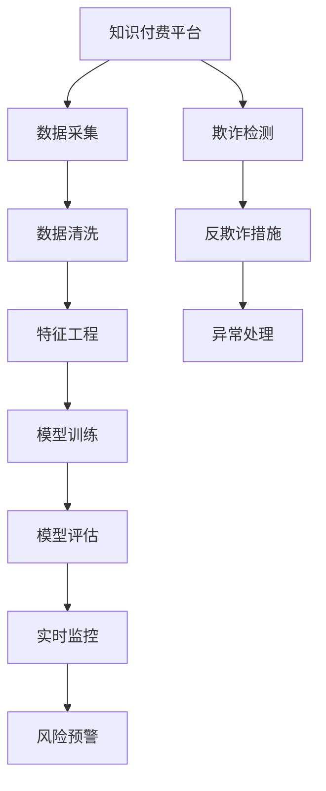

                 

# 知识经济下知识付费的大数据风控与反欺诈

> 关键词：知识经济,知识付费,大数据,风控,反欺诈

## 1. 背景介绍

### 1.1 问题由来

随着知识经济的兴起，知识付费成为一种新的经济模式。用户通过付费订阅获得专业内容，知识和信息的价值得到广泛认可。然而，这种模式也面临着诸多挑战，其中数据安全、欺诈行为等问题成为制约其健康发展的瓶颈。

在大数据背景下，如何利用先进的数据分析技术，构建稳健的风险控制和反欺诈系统，保障用户权益，提升知识付费平台的价值，成为亟待解决的重要问题。本文聚焦于大数据风控和反欺诈技术的原理与应用实践，探讨了基于监督学习的微调方法在知识付费场景下的应用，以期为知识付费平台的运营者提供系统化的解决方案。

### 1.2 问题核心关键点

知识付费平台面临的风险主要有两种：

- **风险因素**：包括用户行为异常、支付异常、内容侵权等。这些问题可以归结为数据采集、分析和建模等多个环节。
- **欺诈行为**：如虚假支付、盗号、刷单等，涉及用户身份验证、交易监控等多个方面。

本研究将围绕数据采集、清洗、特征工程、模型构建与评估、实时监控与防范等核心环节，详细阐述如何构建高效的数据风控与反欺诈系统。

### 1.3 问题研究意义

构建高效的知识付费风控与反欺诈系统，对于平台运营者具有重要意义：

- 提升用户体验：确保用户数据安全，防范欺诈行为，增强用户信任，减少流失率。
- 保障平台收益：通过有效风控，降低交易纠纷，提升用户付费意愿，增加平台收入。
- 优化资源配置：实时监控系统运行情况，及时调整策略，提升系统效率和资源利用率。
- 推动平台发展：保障平台运营合规，提高用户满意度，吸引更多用户加入，推动平台持续发展。

本文系统介绍大数据风控与反欺诈技术，帮助知识付费平台构建安全、高效、智能的风险监控系统。

## 2. 核心概念与联系

### 2.1 核心概念概述

为更好地理解基于监督学习的微调方法在知识付费风控与反欺诈中的应用，本节将介绍几个密切相关的核心概念：

- **知识付费平台**：以订阅制、会员制等为核心的付费模式，提供专业内容、知识服务，用户需支付相应费用。
- **数据风控**：利用数据分析技术，识别和防范数据中的异常行为，保障系统稳定运行。
- **反欺诈**：识别并防范欺诈行为，保护用户资产，维护交易安全。
- **监督学习**：在标注数据上训练模型，使其具有分类、回归、聚类等能力，常用于识别异常行为和欺诈行为。
- **微调(Fine-tuning)**：在预训练模型基础上，使用少量标注数据进行参数更新，提升模型性能。

这些核心概念之间的逻辑关系可以通过以下Mermaid流程图来展示：



这个流程图展示了从数据采集、清洗、特征工程、模型训练、评估、实时监控到风险预警和反欺诈措施的流程。

## 3. 核心算法原理 & 具体操作步骤
### 3.1 算法原理概述

基于监督学习的微调方法，在大数据风控与反欺诈领域具有广泛应用。其核心思想是：使用历史交易数据和用户行为数据，训练模型进行异常行为检测和欺诈识别，同时在实际应用中不断迭代优化，提升模型的泛化能力和检测精度。

形式化地，假设原始数据集为 $D=\{(x_i,y_i)\}_{i=1}^N$，其中 $x_i$ 为特征向量，$y_i$ 为标注标签（异常/正常、欺诈/正常等）。微调的优化目标是最小化模型在测试集上的误差，即找到最优参数：

$$
\theta^* = \mathop{\arg\min}_{\theta} \mathcal{L}(M_{\theta},D)
$$

其中 $\mathcal{L}$ 为损失函数，用于衡量模型预测与真实标签之间的差异。常见的损失函数包括交叉熵损失、均方误差损失等。

### 3.2 算法步骤详解

基于监督学习的大数据风控与反欺诈微调方法，一般包括以下几个关键步骤：

**Step 1: 准备数据集**
- 收集历史交易数据和用户行为数据，划分为训练集、验证集和测试集。
- 对数据进行预处理，包括缺失值填充、归一化、特征编码等。

**Step 2: 数据特征工程**
- 设计合适的特征，包括用户基本信息、交易金额、行为模式等。
- 进行特征选择和降维，避免维度灾难。
- 引入时间序列分析等方法，提取行为趋势和异常变化。

**Step 3: 构建模型**
- 选择合适的模型，如逻辑回归、支持向量机、随机森林、神经网络等。
- 设计损失函数和优化器，如交叉熵损失、Adam、SGD等。
- 训练模型，设置超参数，如学习率、批大小、迭代轮数等。

**Step 4: 模型评估与优化**
- 在验证集上评估模型性能，如准确率、召回率、F1分数等。
- 根据评估结果，调整模型参数和超参数，避免过拟合。
- 使用网格搜索、随机搜索等方法优化模型性能。

**Step 5: 实时监控与防范**
- 部署模型到生产环境，实时监控用户行为和交易数据。
- 设置预警阈值，自动识别异常行为和欺诈行为。
- 提供风险提示和干预措施，如冻结账户、联系客服等。

### 3.3 算法优缺点

基于监督学习的微调方法具有以下优点：

- **高效性**：利用历史数据进行训练，可以在较短时间内构建高精度的模型。
- **可解释性**：模型决策过程可解释，便于调试和优化。
- **适用性广**：适用于多种风控与反欺诈任务，如异常检测、欺诈识别、交易监控等。

同时，该方法也存在一些局限性：

- **数据依赖**：模型依赖标注数据，标注成本高。
- **泛化能力**：模型泛化能力有限，难以适应新场景。
- **数据隐私**：可能泄露用户隐私信息，需严格遵守数据保护法规。

尽管存在这些局限性，但监督学习仍是当前风控与反欺诈领域的主流方法，适用于标注数据充足的场景。

### 3.4 算法应用领域

基于监督学习的大数据风控与反欺诈方法，在多个领域均有应用：

- **电商交易**：监控异常交易行为，防范欺诈和盗号。
- **金融交易**：识别虚假支付和信用卡欺诈行为。
- **社交网络**：防范虚假账号和恶意攻击。
- **移动支付**：监控异常支付行为，防范诈骗和盗号。
- **游戏支付**：识别作弊行为和账号盗用。
- **保险理赔**：识别欺诈申请和异常索赔。

以上领域中，微调方法已经成为风控与反欺诈的重要手段，保障了平台的稳定运行和用户权益。

## 4. 数学模型和公式 & 详细讲解 & 举例说明
### 4.1 数学模型构建

本节将使用数学语言对基于监督学习的大数据风控与反欺诈微调过程进行严格刻画。

假设原始数据集为 $D=\{(x_i,y_i)\}_{i=1}^N$，其中 $x_i$ 为特征向量，$y_i$ 为标注标签。定义模型 $M_{\theta}$ 在数据集 $D$ 上的损失函数为：

$$
\mathcal{L}(\theta) = \frac{1}{N} \sum_{i=1}^N \ell(M_{\theta}(x_i),y_i)
$$

其中 $\ell$ 为损失函数，常见的有交叉熵损失：

$$
\ell(M_{\theta}(x_i),y_i) = -[y_i \log M_{\theta}(x_i) + (1-y_i) \log(1-M_{\theta}(x_i))]
$$

通过最小化损失函数，得到最优参数：

$$
\theta^* = \mathop{\arg\min}_{\theta} \mathcal{L}(\theta)
$$

### 4.2 公式推导过程

以逻辑回归为例，推导模型的训练过程。

假设模型 $M_{\theta}$ 的输出为 $p_i = \sigma(\theta^T x_i)$，其中 $\sigma$ 为sigmoid函数。则交叉熵损失为：

$$
\ell(M_{\theta}(x_i),y_i) = -y_i \log p_i - (1-y_i) \log(1-p_i)
$$

最小化损失函数得：

$$
\theta^* = \mathop{\arg\min}_{\theta} -\frac{1}{N} \sum_{i=1}^N y_i \log p_i + (1-y_i) \log(1-p_i)
$$

利用梯度下降算法，求解得：

$$
\frac{\partial \mathcal{L}(\theta)}{\partial \theta_k} = -\frac{1}{N} \sum_{i=1}^N (\frac{y_i}{p_i} - \frac{1-y_i}{1-p_i})x_{ik}
$$

### 4.3 案例分析与讲解

以电商平台交易数据为例，推导异常检测模型。

假设交易数据集 $D=\{(x_i,y_i)\}_{i=1}^N$，其中 $x_i$ 包含用户ID、交易金额、交易时间等特征，$y_i \in \{0,1\}$ 为是否异常。构建逻辑回归模型 $M_{\theta}$，定义损失函数：

$$
\mathcal{L}(\theta) = -\frac{1}{N} \sum_{i=1}^N [y_i \log M_{\theta}(x_i) + (1-y_i) \log(1-M_{\theta}(x_i))]
$$

通过梯度下降算法求解最优参数 $\theta^*$。在实际应用中，将模型部署到生产环境，实时监控用户行为，当模型预测为异常时，自动触发风险预警。

## 5. 项目实践：代码实例和详细解释说明
### 5.1 开发环境搭建

在进行风控与反欺诈项目实践前，我们需要准备好开发环境。以下是使用Python进行Scikit-learn开发的配置流程：

1. 安装Anaconda：从官网下载并安装Anaconda，用于创建独立的Python环境。

2. 创建并激活虚拟环境：
```bash
conda create -n sklearn-env python=3.8 
conda activate sklearn-env
```

3. 安装Scikit-learn：
```bash
conda install scikit-learn
```

4. 安装各类工具包：
```bash
pip install numpy pandas matplotlib seaborn jupyter notebook ipython
```

完成上述步骤后，即可在`sklearn-env`环境中开始风控与反欺诈项目实践。

### 5.2 源代码详细实现

这里以电商交易异常检测为例，给出使用Scikit-learn库构建逻辑回归模型的代码实现。

首先，定义数据处理函数：

```python
import pandas as pd
from sklearn.model_selection import train_test_split
from sklearn.preprocessing import StandardScaler
from sklearn.linear_model import LogisticRegression
from sklearn.metrics import roc_auc_score, roc_curve

def load_data(path):
    data = pd.read_csv(path)
    features = data.drop('label', axis=1)
    labels = data['label']
    return features, labels

def train_model(X_train, y_train, X_test, y_test):
    model = LogisticRegression()
    model.fit(X_train, y_train)
    return model

def evaluate_model(model, X_test, y_test):
    y_pred = model.predict_proba(X_test)[:, 1]
    roc_auc = roc_auc_score(y_test, y_pred)
    fpr, tpr, _ = roc_curve(y_test, y_pred)
    return roc_auc, fpr, tpr
```

然后，构建和评估模型：

```python
features, labels = load_data('data.csv')
X_train, X_test, y_train, y_test = train_test_split(features, labels, test_size=0.2, random_state=42)

scaler = StandardScaler()
X_train = scaler.fit_transform(X_train)
X_test = scaler.transform(X_test)

model = train_model(X_train, y_train, X_test, y_test)
roc_auc, fpr, tpr = evaluate_model(model, X_test, y_test)

print(f'ROC-AUC: {roc_auc:.3f}')
print(f'FPR at 90% TPR: {fpr[90]}')
print(f'TPR at 90% FPR: {tpr[90]}')
```

最后，训练并评估模型：

```python
model = LogisticRegression(max_iter=1000, solver='lbfgs')
model.fit(X_train, y_train)
y_pred = model.predict_proba(X_test)[:, 1]
roc_auc = roc_auc_score(y_test, y_pred)

print(f'ROC-AUC: {roc_auc:.3f}')
```

以上就是使用Scikit-learn库对电商交易异常检测进行建模的完整代码实现。可以看到，借助Scikit-learn库，构建和评估模型变得相对简洁高效。

### 5.3 代码解读与分析

让我们再详细解读一下关键代码的实现细节：

**load_data函数**：
- 定义了数据读取和特征标签分离的函数，方便后续处理。

**train_model函数**：
- 创建并训练逻辑回归模型，返回训练好的模型。

**evaluate_model函数**：
- 评估模型性能，计算AUC值和ROC曲线。

**main函数**：
- 加载数据、数据标准化、模型训练和评估。

在实际应用中，还需要考虑更多的优化策略，如模型调参、特征工程、模型集成等，以进一步提升模型性能。

## 6. 实际应用场景
### 6.1 电商交易异常检测

在电商平台上，用户行为和交易数据丰富多样，异常检测成为保障交易安全的重要环节。电商平台可以通过用户行为、交易金额、交易时间等多个维度，构建逻辑回归、决策树、随机森林等模型，实时监控交易数据，防范欺诈和盗号行为。

具体而言，电商平台可以采集用户行为数据，包括点击率、浏览时间、购买频率等，并将交易数据与行为数据结合，构建综合特征向量。通过对历史数据进行标注，训练异常检测模型，实时监测交易行为，当模型预测为异常时，自动触发风险预警，并采取冻结账户、联系客服等措施，及时处理异常交易。

### 6.2 金融交易反欺诈

金融领域数据量庞大，交易频率高，反欺诈任务尤为复杂。金融机构可以通过收集用户的账户信息、交易记录、设备信息等，构建多维度特征，训练机器学习模型，实时监控交易行为，防范信用卡欺诈、虚假支付等风险。

具体而言，金融机构可以构建基于SVM、神经网络的反欺诈模型，通过K-means等聚类算法对用户进行分组，发现异常行为。同时，引入时间序列分析等方法，识别交易趋势和异常变化，提高反欺诈模型的泛化能力和鲁棒性。

### 6.3 社交网络防骗

社交网络平台用户众多，数据量庞大，防范虚假账号和恶意攻击是平台运营的重要环节。社交平台可以通过用户行为、好友关系、社交网络结构等特征，训练异常检测和欺诈识别模型，实时监控用户行为，防范恶意攻击和钓鱼攻击。

具体而言，社交平台可以构建基于随机森林、深度神经网络等模型的异常检测系统，实时监控用户行为和好友关系，当模型预测为异常时，自动触发风险预警，并采取封禁账号、联系客服等措施，及时处理恶意行为。

### 6.4 未来应用展望

随着大数据技术和人工智能技术的不断发展，基于监督学习的风控与反欺诈方法将得到更广泛的应用，为各个领域带来新的机遇。

- **智能医疗**：利用用户健康数据，构建风控模型，防范医疗欺诈行为。
- **教育培训**：通过学习行为数据，构建学习效果评估模型，防范学术不端和作弊行为。
- **公共安全**：利用实时数据，构建异常检测和风险预警系统，防范恐怖袭击和犯罪行为。
- **智慧城市**：利用城市物联网数据，构建交通违规检测和欺诈预警系统，保障城市安全。

未来，随着数据量的增加和模型的进步，风控与反欺诈技术将变得更加智能和高效，为社会稳定和经济发展提供有力保障。

## 7. 工具和资源推荐
### 7.1 学习资源推荐

为了帮助开发者系统掌握大数据风控与反欺诈的理论基础和实践技巧，这里推荐一些优质的学习资源：

1. 《机器学习实战》系列书籍：全面介绍了机器学习的基本概念、算法和应用，适合入门学习。
2. Coursera《机器学习》课程：由斯坦福大学Andrew Ng教授主讲，涵盖机器学习的基本原理和算法，适合进阶学习。
3. Kaggle：数据科学竞赛平台，提供大量公开数据集和竞赛，帮助开发者实践机器学习算法。
4. GitHub：开源代码托管平台，提供丰富的机器学习库和工具，方便开发者快速上手。
5. Scikit-learn官方文档：Scikit-learn库的官方文档，提供了详细的API和实例代码，是学习Scikit-learn的必备资料。

通过对这些资源的学习实践，相信你一定能够快速掌握大数据风控与反欺诈的精髓，并用于解决实际的NLP问题。

### 7.2 开发工具推荐

高效的开发离不开优秀的工具支持。以下是几款用于大数据风控与反欺诈开发的常用工具：

1. Jupyter Notebook：交互式编程环境，方便数据处理和模型调试。
2. Pandas：数据处理库，提供了高效的数据读取、清洗、转换功能。
3. Scikit-learn：机器学习库，提供了丰富的算法和工具，方便模型构建和评估。
4. TensorFlow：深度学习框架，提供了丰富的模型和工具，方便模型训练和优化。
5. Keras：高级神经网络库，提供了简单易用的API，方便模型构建和训练。
6. Matplotlib：数据可视化库，方便绘制数据分布、ROC曲线等。

合理利用这些工具，可以显著提升大数据风控与反欺诈任务的开发效率，加快创新迭代的步伐。

### 7.3 相关论文推荐

大数据风控与反欺诈技术的发展源于学界的持续研究。以下是几篇奠基性的相关论文，推荐阅读：

1. Anomaly Detection in Industrial Systems with Multi-Modal Features（工业系统多模态特征异常检测）：提出了基于多模态数据的异常检测方法，提升了模型的泛化能力和鲁棒性。
2. Datasets for Learning Phishing and Malware Detection Models（学习钓鱼和恶意软件检测模型的数据集）：提供了大规模数据集，用于训练和评估反欺诈模型。
3. Interpretable Deep Learning in the Face of Adversarial Samples（对抗样本下的可解释深度学习）：提出了对抗样本防御方法，提升了模型的可解释性和鲁棒性。
4. Real-Time Outlier Detection in Big Data Streams（大数据流中的实时异常检测）：提出了实时异常检测算法，提高了模型的实时性和高效性。
5. Explainable Artificial Intelligence in Fraud Detection（欺诈检测中的可解释人工智能）：探讨了可解释性在欺诈检测中的重要性，提供了多方面的可解释方法。

这些论文代表了大数据风控与反欺诈技术的发展脉络。通过学习这些前沿成果，可以帮助研究者把握学科前进方向，激发更多的创新灵感。

## 8. 总结：未来发展趋势与挑战
### 8.1 总结

本文对大数据风控与反欺诈方法进行了全面系统的介绍。首先阐述了大数据风控与反欺诈技术的研究背景和意义，明确了微调在保障系统稳定运行、防范欺诈行为方面的独特价值。其次，从原理到实践，详细讲解了监督微调的数学原理和关键步骤，给出了风控与反欺诈任务开发的完整代码实例。同时，本文还广泛探讨了风控与反欺诈方法在电商交易、金融交易、社交网络等多个领域的应用前景，展示了微调范式的巨大潜力。此外，本文精选了风控与反欺诈技术的各类学习资源，力求为开发者提供全方位的技术指引。

通过本文的系统梳理，可以看到，基于监督学习的风控与反欺诈方法在大数据背景下得到了广泛应用，成为保障各领域应用系统稳定运行的重要手段。未来，随着数据的持续增长和模型的不断进步，风控与反欺诈技术将变得更加智能和高效，为各行业的数字化转型升级提供有力保障。

### 8.2 未来发展趋势

展望未来，大数据风控与反欺诈技术将呈现以下几个发展趋势：

1. **数据规模持续增大**：随着数据采集和存储技术的不断进步，数据规模将持续增长，带来更丰富的特征和更全面的用户画像。
2. **模型复杂度提升**：深度学习、神经网络等复杂模型将成为风控与反欺诈的主流技术，提升模型的预测能力和泛化能力。
3. **多模态数据融合**：利用图像、语音、文本等多模态数据，构建综合特征向量，提升模型的识别精度和鲁棒性。
4. **实时性要求更高**：数据实时采集和处理的需求将更加迫切，要求风控系统具备更高的实时性。
5. **联邦学习**：利用联邦学习技术，保护用户隐私，实现跨平台数据共享和模型合作。
6. **隐私保护**：随着数据隐私保护法规的不断完善，如何保护用户隐私，防止数据泄露，将成为重要的研究方向。

以上趋势凸显了大数据风控与反欺诈技术的广阔前景。这些方向的探索发展，必将进一步提升系统的性能和应用范围，为各领域带来更加安全和高效的服务。

### 8.3 面临的挑战

尽管大数据风控与反欺诈技术已经取得了瞩目成就，但在迈向更加智能化、普适化应用的过程中，它仍面临诸多挑战：

1. **数据质量问题**：数据采集、清洗、标注等环节可能存在问题，影响模型性能。
2. **模型复杂性**：深度学习模型虽然精度高，但训练复杂，调参困难，容易过拟合。
3. **隐私保护**：数据隐私保护法规越来越严格，如何在保障隐私的同时进行模型训练和应用，是一大难题。
4. **实时性要求高**：实时数据处理对系统架构和计算资源提出了更高的要求。
5. **安全防护**：模型可能面临对抗攻击和逆向工程，如何提升模型鲁棒性，是一大挑战。
6. **可解释性**：模型决策过程复杂，难以解释，影响用户信任。

正视风控与反欺诈面临的这些挑战，积极应对并寻求突破，将是大数据风控与反欺诈技术走向成熟的必由之路。相信随着学界和产业界的共同努力，这些挑战终将一一被克服，大数据风控与反欺诈技术必将在构建安全、高效、智能的风控系统方面发挥更大的作用。

### 8.4 研究展望

面对大数据风控与反欺诈所面临的挑战，未来的研究需要在以下几个方面寻求新的突破：

1. **无监督和半监督学习**：摆脱对大规模标注数据的依赖，利用自监督学习、主动学习等方法，最大化数据利用率。
2. **模型可解释性**：引入可解释性技术，如LIME、SHAP等，提升模型的可解释性和透明度。
3. **联邦学习**：利用联邦学习技术，保护用户隐私，实现跨平台数据共享和模型合作。
4. **多模态融合**：利用图像、语音、文本等多模态数据，构建综合特征向量，提升模型的识别精度和鲁棒性。
5. **对抗攻击防御**：引入对抗攻击技术，如生成对抗网络（GAN）等，提升模型的鲁棒性和安全性。
6. **隐私保护**：引入差分隐私技术，保护用户隐私，防止数据泄露。

这些研究方向将推动大数据风控与反欺诈技术的不断进步，为构建更加智能、安全的系统提供有力支撑。

## 9. 附录：常见问题与解答

**Q1: 如何构建风控与反欺诈系统？**

A: 构建风控与反欺诈系统需要以下步骤：
1. 数据采集：收集用户行为、交易记录、设备信息等数据。
2. 数据清洗：处理缺失值、异常值等，保证数据质量。
3. 特征工程：设计合适的特征，如用户ID、交易金额、行为模式等。
4. 模型构建：选择适当的模型，如逻辑回归、随机森林、神经网络等，进行训练和评估。
5. 实时监控：部署模型到生产环境，实时监控用户行为和交易数据。
6. 风险预警：设置预警阈值，自动识别异常行为和欺诈行为。
7. 干预措施：根据预警结果，采取冻结账户、联系客服等措施。

**Q2: 如何选择合适的损失函数？**

A: 选择合适的损失函数需要考虑任务类型和数据特点。常见损失函数包括交叉熵损失、均方误差损失、对数损失等。例如，异常检测任务通常使用F1分数、AUC等评价指标，而反欺诈任务可以使用精确率、召回率等指标。在实际应用中，可以通过交叉验证等方法选择合适的损失函数和评价指标。

**Q3: 如何处理特征缺失和异常值？**

A: 处理特征缺失和异常值可以通过以下方法：
1. 缺失值处理：使用均值、中位数、插值等方法填补缺失值。
2. 异常值检测：使用箱线图、z-score等方法检测和处理异常值。
3. 特征选择：通过特征选择方法（如Lasso、随机森林等），去除冗余和噪声特征，提升模型性能。
4. 数据增强：通过数据增强技术（如回译、近义替换等），丰富训练集多样性，提升模型泛化能力。

**Q4: 如何评估模型性能？**

A: 评估模型性能通常使用以下指标：
1. 精确率（Precision）：预测为正例中真实为正例的比例。
2. 召回率（Recall）：真实为正例中被预测为正例的比例。
3. F1分数（F1-score）：精确率和召回率的调和平均值。
4. AUC（Area Under Curve）：ROC曲线下的面积，用于衡量模型的分类性能。
5. ROC曲线（Receiver Operating Characteristic Curve）：绘制预测概率和真实标签的关系曲线，用于评估模型的性能。

这些指标可以结合实际应用场景，选择合适的评估方法，帮助调整模型参数和优化模型性能。

**Q5: 如何构建多模态风控系统？**

A: 构建多模态风控系统需要以下步骤：
1. 数据采集：收集图像、语音、文本等多模态数据。
2. 数据融合：将不同模态的数据进行融合，构建综合特征向量。
3. 模型构建：选择适当的模型，如深度神经网络、卷积神经网络等，进行训练和评估。
4. 特征提取：利用多模态特征提取技术，如卷积、池化、注意力机制等，提取高层次的特征。
5. 模型融合：通过集成不同模型的预测结果，提升模型的鲁棒性和泛化能力。
6. 实时监控：部署模型到生产环境，实时监控用户行为和交易数据。
7. 风险预警：设置预警阈值，自动识别异常行为和欺诈行为。
8. 干预措施：根据预警结果，采取冻结账户、联系客服等措施。

多模态风控系统能够利用多源数据，提升模型的识别精度和鲁棒性，为各领域带来更加安全和高效的服务。

