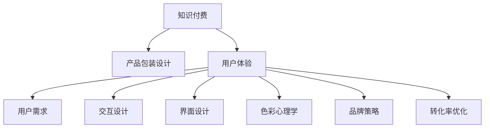

                 

# 知识经济时代下的知识付费创新产品包装设计

> 关键词：知识付费, 产品包装设计, 用户需求, 用户体验, 交互设计, 界面设计, 色彩心理学, 视觉设计, 品牌策略, 转化率优化

## 1. 背景介绍

### 1.1 问题由来
随着知识经济时代的到来，信息过载成为了一个不可忽视的问题。人们不再满足于简单的文字阅读，而更希望获得更为深入、系统、互动的学习体验。因此，知识付费平台应运而生，逐渐成为了知识分享的重要渠道。而为了提升知识付费产品的吸引力和转化率，产品包装设计成为了一个至关重要的环节。

### 1.2 问题核心关键点
知识付费产品包装设计需要从用户体验、交互设计、界面设计等多个角度出发，综合考虑用户需求、视觉设计、品牌策略等因素，最终形成一个吸引用户、提升转化率的完整产品体系。

## 2. 核心概念与联系

### 2.1 核心概念概述

为更好地理解知识付费产品的包装设计，本节将介绍几个密切相关的核心概念：

- 知识付费：通过付费方式获取优质知识内容的学习方式，包括在线课程、文章、音频、视频等形式。
- 产品包装设计：包括视觉设计、界面设计、交互设计等多个层面，旨在提升产品的吸引力和易用性，增强用户的购买和付费意愿。
- 用户体验：用户在使用产品过程中产生的整体感受和体验，直接影响用户满意度和转化率。
- 用户需求：用户在购买和使用知识付费产品时的期望和需求，包括内容质量、学习效率、互动体验等。
- 交互设计：涉及用户与产品之间的互动方式和路径，旨在简化操作、优化流程，提升使用体验。
- 界面设计：界面是用户与产品交互的重要媒介，好的界面设计能有效地传达信息、引导操作。
- 色彩心理学：通过色彩运用来影响用户的情绪、行为和偏好，是视觉设计中重要的元素之一。
- 品牌策略：塑造和传达品牌形象、价值和理念，增强品牌认知度和用户忠诚度。
- 转化率优化：通过优化用户体验、提升页面转换率，增加用户的购买和付费行为。

这些核心概念之间的逻辑关系可以通过以下Mermaid流程图来展示：



这个流程图展示了大语言模型的核心概念及其之间的关系：

1. 知识付费通过产品包装设计向用户提供优质内容。
2. 用户体验直接影响用户对产品的满意度和粘性。
3. 用户需求引导产品设计，满足用户期望和需求。
4. 交互设计简化操作，提升用户互动体验。
5. 界面设计通过美观、易用的界面吸引用户注意。
6. 色彩心理学利用色彩来影响用户情绪和行为。
7. 品牌策略塑造品牌形象，增强品牌认知。
8. 转化率优化提升页面转换率，增加用户付费行为。

这些概念共同构成了知识付费产品包装设计的理论基础，使其能够更好地满足用户需求，提升用户体验，增加用户粘性和付费意愿。

## 3. 核心算法原理 & 具体操作步骤

### 3.1 算法原理概述

知识付费产品包装设计的核心在于通过视觉、交互、品牌等多方面的设计，提升用户的整体体验和满意度。其核心算法原理包括以下几个方面：

1. **用户需求分析**：通过用户调研、数据分析等方式，明确用户对知识付费产品的具体需求和期望，如内容形式、学习效率、互动性等。
2. **界面与视觉设计**：利用色彩心理学、设计原则等方法，设计出简洁、美观、易用的界面，吸引用户注意力。
3. **交互设计优化**：简化用户操作路径，增加用户与产品之间的互动性，提高使用便捷性。
4. **品牌策略执行**：通过一致的视觉风格、品牌语调等方式，传达品牌形象和价值观，增强用户对品牌的认知和信任。
5. **转化率优化策略**：通过用户行为分析、A/B测试等方法，优化页面设计、流程路径，提升用户的购买和付费转化率。

### 3.2 算法步骤详解

基于上述算法原理，知识付费产品包装设计的具体操作步骤如下：

**Step 1: 用户需求分析**
- 进行用户调研，收集用户对知识付费产品的期望和需求。
- 分析用户数据，了解用户行为和偏好，明确用户的痛点和期望。
- 根据调研和分析结果，制定用户需求报告，指导后续设计。

**Step 2: 界面与视觉设计**
- 设计简洁、美观、易用的界面，利用色彩心理学、设计原则等方法提升用户体验。
- 选择符合品牌调性的色彩、字体、图标等视觉元素，增强品牌认知。
- 通过原型设计、用户测试等方式，验证界面的易用性和吸引力。

**Step 3: 交互设计优化**
- 简化用户操作路径，减少操作步骤，提高操作效率。
- 增加用户与产品之间的互动性，如通过弹窗、提示等方式引导用户完成操作。
- 优化界面元素，如按钮、表单等，提升操作便捷性和直观性。

**Step 4: 品牌策略执行**
- 制定一致的品牌视觉风格和语调，增强品牌认知和用户信任。
- 利用社交媒体、广告等方式，推广品牌形象和价值主张。
- 通过一致的视觉和文字信息，传达品牌故事和理念。

**Step 5: 转化率优化策略**
- 分析用户行为数据，识别用户流失点和瓶颈，优化用户体验。
- 通过A/B测试、多版本测试等方式，验证不同设计方案的效果。
- 优化页面转换路径，提升用户的购买和付费转化率。

### 3.3 算法优缺点

知识付费产品包装设计的算法具有以下优点：
1. 提升用户体验：通过简洁美观的界面和易用的交互，提升用户的使用体验和满意度。
2. 增加用户粘性：良好的品牌策略和视觉设计，增强用户对品牌的认同和信任，提高用户粘性。
3. 提升转化率：通过优化用户路径和界面设计，增加用户的购买和付费转化率。
4. 降低开发成本：通过用户调研和数据分析，明确用户需求和期望，减少开发过程中的反复修改。

同时，该方法也存在一定的局限性：
1. 对设计能力要求高：需要设计师具备良好的设计能力和审美水平，才能设计出吸引用户的界面和视觉。
2. 数据依赖性强：需要大量的用户数据进行分析和测试，才能制定出符合用户需求的设计方案。
3. 难以适应多样性：需要综合考虑不同用户的需求和期望，设计出统一且多样化的产品包装。
4. 易受市场变化影响：市场需求和用户偏好可能会发生变化，设计方案需要不断迭代和调整。

尽管存在这些局限性，但就目前而言，知识付费产品包装设计的算法仍是提升用户体验、增加用户粘性、提升转化率的重要手段。

### 3.4 算法应用领域

知识付费产品包装设计在多个领域得到了广泛的应用，例如：

- 在线课程平台：通过界面设计、交互优化等方式，提升课程学习的便捷性和吸引力。
- 知识博客和文章：通过视觉设计、品牌策略等方式，增强内容的市场传播和用户订阅。
- 知识音频和视频：通过界面设计、品牌策略等方式，提升内容的吸引力和用户付费意愿。
- 知识问答和社区：通过界面设计、品牌策略等方式，增强用户互动和社区粘性。
- 知识直播和课程回放：通过界面设计、品牌策略等方式，提升直播的互动性和课程回放的便捷性。

除了上述这些经典应用外，知识付费产品包装设计也被创新性地应用到更多场景中，如知识会员制、知识电商、知识游戏等，为知识付费市场带来了新的增长点。

## 4. 数学模型和公式 & 详细讲解 & 举例说明

### 4.1 数学模型构建

本节将使用数学语言对知识付费产品包装设计过程进行更加严格的刻画。

记知识付费产品的转化率为 $C$，用户满意度为 $S$，品牌认知度为 $B$，用户粘性为 $L$。则知识付费产品包装设计的目标为最大化这些指标：

$$
\max_{D} C + S + B + L
$$

其中 $D$ 为产品包装设计策略，包括界面设计、视觉设计、交互设计、品牌策略、转化率优化等多个方面。

### 4.2 公式推导过程

以下我们以用户满意度 $S$ 为例，推导其数学模型及公式。

假设用户满意度 $S$ 由以下因素决定：

1. 界面美观度 $A$：界面设计的美观程度直接影响用户的使用体验。
2. 操作便捷度 $E$：界面和交互设计的便捷程度决定了用户的操作效率。
3. 视觉吸引力 $V$：色彩心理学和视觉设计等因素对用户的吸引力。
4. 品牌一致性 $C$：品牌策略的一致性和传递效果对用户信任度的影响。

则用户满意度的数学模型为：

$$
S = f(A, E, V, C)
$$

其中 $f$ 为非线性函数，表示各因素对用户满意度的影响。

### 4.3 案例分析与讲解

以下以某知识付费平台的界面设计为例，展示其具体的数学模型和公式推导过程：

假设某知识付费平台的界面设计策略 $D$ 由以下因素决定：

1. 界面美观度 $A = 0.8$
2. 操作便捷度 $E = 0.7$
3. 视觉吸引力 $V = 0.9$
4. 品牌一致性 $C = 0.6$

则用户满意度的数学模型为：

$$
S = f(0.8, 0.7, 0.9, 0.6)
$$

通过实际的用户调研和反馈，可以验证上述数学模型的准确性，并通过A/B测试等方式进一步优化各因素的权重，提升用户满意度。

## 5. 项目实践：代码实例和详细解释说明

### 5.1 开发环境搭建

在进行知识付费产品包装设计实践前，我们需要准备好开发环境。以下是使用Python进行Django开发的环境配置流程：

1. 安装Anaconda：从官网下载并安装Anaconda，用于创建独立的Python环境。

2. 创建并激活虚拟环境：
```bash
conda create -n python-env python=3.8 
conda activate python-env
```

3. 安装Django：从官网获取对应的安装命令。例如：
```bash
pip install django
```

4. 安装各类工具包：
```bash
pip install numpy pandas scikit-learn matplotlib tqdm jupyter notebook ipython
```

完成上述步骤后，即可在`python-env`环境中开始知识付费产品包装设计的实践。

### 5.2 源代码详细实现

我们先设计一个简单的知识付费产品页面，包含课程介绍、价格、购买按钮等元素。代码如下：

```python
from django import forms
from django.shortcuts import render
from django.http import HttpResponse

def home(request):
    courses = [
        {'name': 'Python入门', 'price': 199, 'description': '适合零基础学习者'},
        {'name': '机器学习实战', 'price': 299, 'description': '实战项目为主'},
        {'name': '数据分析与数据可视化', 'price': 279, 'description': '实用技能讲解'},
    ]
    return render(request, 'home.html', {'courses': courses})
```

在`home.html`模板文件中，添加以下代码：

```html
<!DOCTYPE html>
<html>
<head>
    <title>知识付费产品包装设计</title>
</head>
<body>
    <h1>知识付费平台</h1>
    <ul>
        
            <li>
                <h2>{{ course.name }}</h2>
                <p>{{ course.description }}</p>
                <p>价格：{{ course.price }}</p>
                <a href="#">购买</a>
            </li>
        
    </ul>
</body>
</html>
```

### 5.3 代码解读与分析

让我们再详细解读一下关键代码的实现细节：

**home函数**：
- 定义了一个`courses`列表，包含课程名称、价格和简介等信息。
- 使用`render`函数将课程列表渲染到`home.html`模板中。

**home.html模板**：
- 通过``循环遍历`courses`列表，显示每个课程的详细信息。
- 通过`<a href="#">购买</a>`链接，引导用户完成购买操作。

以上代码展示了知识付费产品包装设计的基本流程：通过界面设计，展示课程信息，并引导用户完成购买操作。在实际开发中，还需要考虑更多细节，如用户登录、购物车管理、支付系统等，以提升用户体验和转化率。

## 6. 实际应用场景

### 6.1 知识付费平台

知识付费平台是知识付费产品包装设计的主要应用场景。通过优化产品界面、提升用户互动性、强化品牌形象等手段，可以显著提升用户满意度和转化率。

在技术实现上，可以通过Django等框架搭建知识付费平台，利用前端技术如HTML、CSS、JavaScript等设计出简洁美观的界面，并通过后端代码实现用户管理、课程管理、支付等核心功能。

### 6.2 知识社区和问答

知识社区和问答平台也是知识付费产品包装设计的常见应用场景。通过优化用户互动界面、增加内容推荐、强化社区氛围等手段，可以提升用户粘性和参与度。

在技术实现上，可以利用Django等框架搭建知识社区平台，利用前端技术如React、Vue等设计出高效易用的用户界面，并通过后端代码实现用户管理、内容推荐、社区互动等核心功能。

### 6.3 知识直播和课程回放

知识直播和课程回放平台也是知识付费产品包装设计的典型应用场景。通过优化直播界面、增加互动功能、强化课程回放便捷性等手段，可以提升用户观看体验和满意度。

在技术实现上，可以利用Django等框架搭建知识直播平台，利用前端技术如HTML、CSS、JavaScript等设计出简洁美观的界面，并通过后端代码实现直播管理、互动功能、课程回放等核心功能。

### 6.4 未来应用展望

随着知识付费市场的不断发展，知识付费产品包装设计也将呈现以下几个趋势：

1. 个性化推荐：通过大数据分析，推荐符合用户兴趣和需求的知识内容，提升用户体验和满意度。
2. 实时互动：通过Websocket等技术，实现实时互动和沟通，增加用户参与度和粘性。
3. 多模态融合：结合文字、视频、音频等多种形式，提升内容的吸引力和互动性。
4. 社交化功能：增加用户之间的互动和分享功能，增强社区粘性和传播效果。
5. 移动端优化：针对移动端用户，优化界面设计和交互方式，提升移动端的用户体验。
6. 多渠道支持：支持PC、手机、平板等多种设备，提供全面、一致的用户体验。

这些趋势凸显了知识付费产品包装设计的广阔前景。这些方向的探索发展，必将进一步提升知识付费产品的市场竞争力和用户满意度。

## 7. 工具和资源推荐

### 7.1 学习资源推荐

为了帮助开发者系统掌握知识付费产品包装设计的理论基础和实践技巧，这里推荐一些优质的学习资源：

1. 《知识付费产品包装设计》系列博文：由知识付费技术专家撰写，深入浅出地介绍了知识付费产品包装设计的原理、方法和实践案例。

2. 《用户体验设计》课程：来自知名设计学校的课程，涵盖用户调研、界面设计、交互设计等多个方面的知识，适合初学者和进阶学习者。

3. 《品牌策略与执行》书籍：系统介绍品牌策略的制定和执行方法，帮助设计师掌握品牌设计的核心要领。

4. 《网页设计与开发》书籍：详细介绍HTML、CSS、JavaScript等前端技术，适合Web开发和UI设计的学习者。

5. 《色彩心理学》书籍：从心理学角度介绍色彩运用的方法和技巧，帮助设计师提升视觉设计的水平。

通过对这些资源的学习实践，相信你一定能够快速掌握知识付费产品包装设计的精髓，并用于解决实际的NLP问题。

### 7.2 开发工具推荐

高效的开发离不开优秀的工具支持。以下是几款用于知识付费产品包装开发的常用工具：

1. Django：基于Python的开源Web框架，提供强大的开发工具和插件，适合构建复杂的知识付费平台。

2. React：由Facebook开发的JavaScript库，用于构建高效的Web用户界面，适合实现实时互动和复杂界面。

3. Vue：由Google开发的JavaScript框架，用于构建响应式Web应用，适合快速开发和迭代。

4. Websocket：用于实现实时通信和互动的协议，适合实现知识直播和互动功能。

5. Bootstrap：由Twitter开发的CSS框架，提供丰富的组件和样式，适合快速构建美观的用户界面。

6. Figma：云端设计工具，提供协作和原型设计功能，适合设计师进行用户界面设计。

合理利用这些工具，可以显著提升知识付费产品包装设计的开发效率，加快创新迭代的步伐。

### 7.3 相关论文推荐

知识付费产品包装设计在诸多领域都得到了广泛的研究和应用。以下是几篇奠基性的相关论文，推荐阅读：

1. "The Role of User Experience in Knowledge Sharing Platforms"（知识共享平台的用户体验角色）：探讨了用户体验在知识共享平台中的重要性，以及如何通过界面设计和交互优化提升用户体验。

2. "Designing for Conversion: A Study of Conversion Rates in Online Learning Platforms"（在线学习平台转化率的设计研究）：通过对多个在线学习平台的用户行为进行分析，提出了提升转化率的策略和方法。

3. "Color Psychology and Design"（色彩心理学与设计）：从心理学角度讨论了色彩对用户行为和偏好的影响，以及如何通过色彩设计提升用户满意度和转化率。

4. "Brand Strategy and Execution"（品牌策略与执行）：介绍品牌策略的制定和执行方法，帮助设计师理解品牌设计的重要性和具体执行步骤。

5. "Interactive Design Patterns for Knowledge Sharing Platforms"（知识共享平台交互设计模式）：介绍了多种交互设计模式，帮助设计师提升用户互动性和平台使用体验。

这些论文代表了大语言模型微调技术的发展脉络。通过学习这些前沿成果，可以帮助研究者把握学科前进方向，激发更多的创新灵感。

## 8. 总结：未来发展趋势与挑战

### 8.1 总结

本文对知识付费产品包装设计方法进行了全面系统的介绍。首先阐述了知识付费产品和用户需求的关系，明确了产品包装设计在提升用户体验、增加用户粘性、提高转化率方面的独特价值。其次，从原理到实践，详细讲解了知识付费产品包装设计的数学模型和关键步骤，给出了知识付费产品包装设计的完整代码实例。同时，本文还广泛探讨了知识付费产品包装设计在知识付费平台、知识社区、知识直播等诸多行业领域的应用前景，展示了知识付费产品包装设计的巨大潜力。此外，本文精选了知识付费产品包装设计的各类学习资源，力求为读者提供全方位的技术指引。

通过本文的系统梳理，可以看到，知识付费产品包装设计正在成为知识付费行业的重要范式，极大地提升了知识付费产品的吸引力和转化率，为知识付费市场带来了新的增长点。未来，伴随知识付费市场的进一步发展，知识付费产品包装设计必将持续演进，进一步提升用户满意度和转化率，推动知识付费行业的创新和进步。

### 8.2 未来发展趋势

展望未来，知识付费产品包装设计将呈现以下几个发展趋势：

1. 个性化推荐：通过大数据分析，推荐符合用户兴趣和需求的知识内容，提升用户体验和满意度。
2. 实时互动：通过Websocket等技术，实现实时互动和沟通，增加用户参与度和粘性。
3. 多模态融合：结合文字、视频、音频等多种形式，提升内容的吸引力和互动性。
4. 社交化功能：增加用户之间的互动和分享功能，增强社区粘性和传播效果。
5. 移动端优化：针对移动端用户，优化界面设计和交互方式，提升移动端的用户体验。
6. 多渠道支持：支持PC、手机、平板等多种设备，提供全面、一致的用户体验。

这些趋势凸显了知识付费产品包装设计的广阔前景。这些方向的探索发展，必将进一步提升知识付费产品的市场竞争力和用户满意度。

### 8.3 面临的挑战

尽管知识付费产品包装设计已经取得了瞩目成就，但在迈向更加智能化、普适化应用的过程中，它仍面临着诸多挑战：

1. 数据依赖性强：需要大量的用户数据进行分析和测试，才能制定出符合用户需求的设计方案。
2. 用户需求多样：不同用户对知识付费产品的需求和期望差异较大，设计方案需要兼顾多样性。
3. 技术壁垒高：涉及前端开发、后端开发、交互设计等多个方面，需要综合技术能力。
4. 设计成本高：设计和测试环节需要大量的时间和资源投入，难以快速迭代。

尽管存在这些挑战，但就目前而言，知识付费产品包装设计的算法仍是提升用户体验、增加用户粘性、提高转化率的重要手段。

### 8.4 研究展望

面对知识付费产品包装设计所面临的种种挑战，未来的研究需要在以下几个方面寻求新的突破：

1. 数据驱动设计：通过大数据分析，实现更精准的用户需求分析和设计优化。
2. 多学科融合：结合心理学、社会学、行为学等多学科知识，提升设计方案的科学性和有效性。
3. 自动化设计工具：开发自动化设计工具，提升设计效率和可复用性。
4. 用户体验测试：增加用户测试环节，通过用户反馈优化设计方案。
5. 持续改进：基于用户反馈和市场变化，持续改进设计方案，提升用户满意度和转化率。

这些研究方向的探索，必将引领知识付费产品包装设计迈向更高的台阶，为构建安全、可靠、可解释、可控的智能系统铺平道路。面向未来，知识付费产品包装设计还需要与其他人工智能技术进行更深入的融合，如自然语言处理、知识图谱等，多路径协同发力，共同推动知识付费行业的创新和进步。只有勇于创新、敢于突破，才能不断拓展知识付费产品的边界，让知识付费技术更好地造福人类社会。

## 9. 附录：常见问题与解答

**Q1：知识付费产品包装设计是否适用于所有产品？**

A: 知识付费产品包装设计主要应用于知识内容相关的产品，如在线课程、知识社区、知识问答等。对于其他类型的应用，需要结合具体需求进行调整和优化。

**Q2：如何进行用户需求分析？**

A: 用户需求分析通常包括以下步骤：
1. 用户调研：通过问卷调查、用户访谈等方式，收集用户对知识付费产品的期望和需求。
2. 数据分析：利用数据分析工具，分析用户行为和偏好，找出用户痛点和期望。
3. 用户画像：根据调研和分析结果，制定用户画像，指导后续设计。

**Q3：如何进行界面设计？**

A: 界面设计通常包括以下步骤：
1. 设计原则：选择符合用户需求和品牌形象的设计原则，如简洁性、一致性、可读性等。
2. 原型设计：利用设计工具如Sketch、Figma等，设计出初步的用户界面。
3. 用户测试：通过用户测试，收集用户反馈，优化界面设计。

**Q4：如何进行交互设计？**

A: 交互设计通常包括以下步骤：
1. 用户调研：通过用户调研，了解用户的操作习惯和痛点。
2. 流程图设计：绘制用户操作流程图，优化操作路径和方式。
3. 原型设计：利用原型工具如Axure、Sketch等，设计出交互原型。
4. 用户测试：通过用户测试，收集用户反馈，优化交互设计。

**Q5：如何进行品牌策略执行？**

A: 品牌策略执行通常包括以下步骤：
1. 品牌调研：分析品牌历史和定位，明确品牌形象和价值主张。
2. 品牌设计：通过设计工具如Photoshop、Illustrator等，设计品牌元素，如Logo、字体、颜色等。
3. 品牌传播：通过品牌传播渠道如社交媒体、广告等，推广品牌形象和价值主张。

通过对这些问题的解答，相信你一定能够更好地理解知识付费产品包装设计的核心概念和操作流程，用于解决实际的NLP问题。

---

作者：禅与计算机程序设计艺术 / Zen and the Art of Computer Programming

