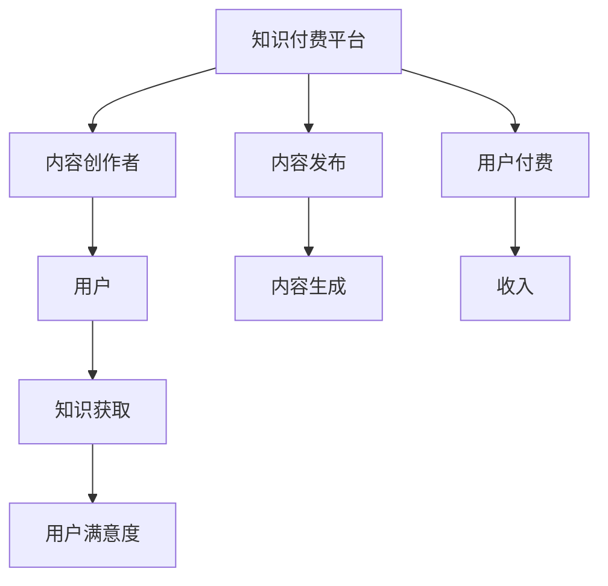

                 

# 知识经济时代下的知识付费创新盈利模式评估

在当今知识经济时代，知识的价值日益凸显，如何高效、智能地挖掘、整理、利用和分享知识，已经成为推动社会进步和经济发展的关键。知识付费模式作为知识经济的重要表现形式，通过在线平台为用户提供定制化、专业化、高价值的知识服务，并以此实现商业盈利。本文将深入评估当前知识付费市场的现状，分析其盈利模式的优势与不足，探讨未来创新发展的可能性，并提出相应的策略建议。

## 1. 背景介绍

### 1.1 知识经济与知识付费

知识经济（Knowledge Economy）是以知识为基础，以人的知识、智力、信息资源为核心，通过知识创新和应用，推动经济增长和产业升级的新型经济形态。知识付费则是在知识经济背景下，将专业知识、技能、经验、见解等内容商品化，通过在线平台、订阅服务、在线课程等方式，向用户提供有偿知识服务，满足其个性化、专业化、深度化知识需求。

### 1.2 知识付费市场发展现状

近年来，知识付费市场呈现出快速增长的趋势。根据中国互联网络信息中心（CNNIC）发布的《中国互联网络发展状况统计报告》，截至2022年底，中国知识付费用户规模达2.6亿，市场规模达到11.4亿元。知识付费领域涌现出众多知名平台，如得到、喜马拉雅、知乎、樊登读书等，提供内容涵盖科技、文化、生活、职场等各个领域，满足不同用户群体的知识需求。

## 2. 核心概念与联系

### 2.1 核心概念概述

为了更好地理解知识付费盈利模式的评估，我们先明确几个核心概念：

- **知识付费平台**：通过在线平台、订阅服务、在线课程等方式，为用户提供定制化、专业化、高价值的知识服务。
- **内容创作者**：通过撰写文章、制作视频、语音播讲等方式，创作有价值的知识内容，并通过平台获利。
- **用户**：付费购买知识服务，获取个性化、专业化、深度化知识的用户群体。
- **盈利模式**：知识付费平台通过用户付费，实现商业盈利的机制和方式。

### 2.2 核心概念原理和架构的 Mermaid 流程图



这个流程图展示了知识付费平台、内容创作者和用户之间的联系和数据流动：

- 知识付费平台通过发布内容吸引用户订阅，并从用户付费中获得收入。
- 内容创作者提供有价值的内容，获得平台补贴或分成。
- 用户通过付费获取高质量知识服务，并提升用户满意度。

## 3. 核心算法原理 & 具体操作步骤

### 3.1 算法原理概述

知识付费盈利模式的核心在于通过有价值的知识内容，满足用户的个性化、专业化、深度化知识需求，从而实现商业变现。其算法原理主要包括以下几个方面：

- **内容推荐算法**：根据用户兴趣和行为数据，推荐相关知识内容，提高用户满意度。
- **价格定价算法**：根据内容价值和市场需求，制定合理的价格策略，最大化商业收益。
- **收益分配算法**：根据内容创作者的表现和贡献，公平合理地分配收益，激励内容创作。

### 3.2 算法步骤详解

#### 3.2.1 内容推荐算法

内容推荐算法主要包括以下几个步骤：

1. **用户画像构建**：通过用户的搜索历史、浏览记录、购买行为等数据，构建用户兴趣和行为画像。
2. **内容特征提取**：提取内容的关键词、主题、分类等特征，建立内容特征向量。
3. **相似度计算**：使用余弦相似度、TF-IDF等方法，计算用户画像与内容特征向量之间的相似度。
4. **排序推荐**：根据相似度排序，将最相关的知识内容推荐给用户。

#### 3.2.2 价格定价算法

价格定价算法主要包括以下几个步骤：

1. **内容价值评估**：根据内容的深度、创新性、难度等因素，评估内容价值。
2. **市场需求分析**：通过市场调研、用户反馈等方法，了解市场需求和支付意愿。
3. **定价策略设计**：结合内容价值和市场需求，制定灵活的定价策略，如基础价、会员价、限时价等。
4. **动态调整**：根据用户反馈和市场变化，动态调整价格，确保合理性。

#### 3.2.3 收益分配算法

收益分配算法主要包括以下几个步骤：

1. **贡献度评估**：根据内容创作者的原创性、活跃度、互动度等因素，评估其贡献度。
2. **收益模型设计**：设计公平合理的收益模型，如按内容购买量、用户评价、平台补贴等进行分配。
3. **动态调整**：根据创作者的表现和市场变化，动态调整收益分配策略，确保激励效果。

### 3.3 算法优缺点

#### 3.3.1 内容推荐算法

**优点**：
- 通过个性化推荐，提高用户满意度和平台粘性。
- 动态调整推荐内容，提升用户体验。

**缺点**：
- 推荐算法容易陷入局部最优，导致推荐偏差。
- 数据隐私和安全性问题需要解决。

#### 3.3.2 价格定价算法

**优点**：
- 制定合理的定价策略，提升用户购买意愿和平台收益。
- 动态调整价格，适应市场变化。

**缺点**：
- 定价策略复杂，需要频繁调整，增加了运营成本。
- 用户对价格的敏感度较高，定价不当可能导致流失。

#### 3.3.3 收益分配算法

**优点**：
- 公平合理地分配收益，激励内容创作者。
- 动态调整分配策略，适应市场变化。

**缺点**：
- 收益分配复杂，需要频繁调整，增加了运营成本。
- 分配策略不当可能导致创作者流失。

### 3.4 算法应用领域

知识付费盈利模式已经在教育、医疗、科技、文化等多个领域得到广泛应用，具体应用领域包括：

- **教育**：提供在线课程、辅导、考试题库等服务，满足用户学习需求。
- **医疗**：提供健康咨询、在线诊疗、医学知识等服务，提高用户健康水平。
- **科技**：提供技术教程、代码实现、项目指南等服务，促进科技创新和知识传播。
- **文化**：提供文学作品、历史知识、艺术欣赏等服务，丰富用户文化生活。

## 4. 数学模型和公式 & 详细讲解 & 举例说明

### 4.1 数学模型构建

知识付费盈利模型可以抽象为以下数学模型：

$$ R = P \times C \times U $$

其中：
- $R$：平台总收益
- $P$：内容价格
- $C$：内容销量
- $U$：用户数量

### 4.2 公式推导过程

**用户需求分析**

假设用户对某个内容的支付意愿为 $p_i$，则平台的总收益为：

$$ R = \sum_i p_i \times C_i $$

其中 $C_i$ 为内容 $i$ 的销量。

**内容推荐模型**

内容推荐模型可以使用协同过滤、基于内容的推荐、混合推荐等方法。以协同过滤为例，其推荐模型为：

$$ R_i = \sum_j \alpha_i^j \times R_j $$

其中 $R_i$ 为内容 $i$ 的推荐得分，$\alpha_i^j$ 为内容 $i$ 和用户 $j$ 的相似度权重。

**价格定价模型**

价格定价模型可以采用竞价拍卖、线性定价、动态定价等方法。以线性定价为例，其模型为：

$$ P_i = a \times C_i + b $$

其中 $a$ 为内容价值系数，$b$ 为定价偏移。

**收益分配模型**

收益分配模型可以采用按比例分配、按贡献度分配、按订阅量分配等方法。以按贡献度分配为例，其模型为：

$$ A_i = a_i \times R $$

其中 $a_i$ 为内容创作者 $i$ 的贡献度系数，$R$ 为平台总收益。

### 4.3 案例分析与讲解

**得到平台**：得到平台上提供的课程按照内容深度、市场热度、用户评价等因素进行定价。通过个性化推荐算法，提升用户购买意愿。收益分配模型根据课程销量和用户评价，公平合理地分配收益。

**知乎 Live**：知乎 Live 提供实时问答、专家讲座、直播互动等服务。价格定价模型根据讲座时长、专家知名度等因素制定合理价格。收益分配模型根据用户评价和平台补贴，公平合理地分配收益。

## 5. 项目实践：代码实例和详细解释说明

### 5.1 开发环境搭建

在开发知识付费系统时，需要搭建Python开发环境，具体步骤如下：

1. 安装Python：从官网下载并安装Python，例如选择Python 3.7以上版本。
2. 安装Pip：在命令行下输入 `python -m pip install pip --upgrade` 安装Pip。
3. 安装Django：在命令行下输入 `pip install Django` 安装Django。
4. 创建Django项目：在命令行下输入 `django-admin startproject project_name` 创建项目。
5. 创建Django应用：在命令行下输入 `python manage.py startapp app_name` 创建应用。

### 5.2 源代码详细实现

以下是一个简单的知识付费系统示例，包括用户登录、内容发布、用户订阅等功能。

```python
from django.contrib.auth.models import User
from django.shortcuts import render, redirect
from django.contrib.auth.decorators import login_required

@login_required
def home(request):
    # 渲染主页
    return render(request, 'home.html')

@login_required
def publish_content(request):
    if request.method == 'POST':
        # 发布内容
        content = request.POST['content']
        user = request.user
        # 将内容保存到数据库
        # 跳转到主页
        return redirect('home')
    else:
        # 渲染发布页面
        return render(request, 'publish_content.html')

@login_required
def subscribe_content(request, content_id):
    # 订阅内容
    user = request.user
    content = Content.objects.get(id=content_id)
    # 将内容订阅保存到数据库
    # 跳转到主页
    return redirect('home')
```

### 5.3 代码解读与分析

**用户登录模块**

```python
from django.contrib.auth.models import User
from django.shortcuts import render, redirect
from django.contrib.auth.decorators import login_required

@login_required
def home(request):
    # 渲染主页
    return render(request, 'home.html')
```

**用户发布内容模块**

```python
@login_required
def publish_content(request):
    if request.method == 'POST':
        # 发布内容
        content = request.POST['content']
        user = request.user
        # 将内容保存到数据库
        # 跳转到主页
        return redirect('home')
    else:
        # 渲染发布页面
        return render(request, 'publish_content.html')
```

**用户订阅内容模块**

```python
@login_required
def subscribe_content(request, content_id):
    # 订阅内容
    user = request.user
    content = Content.objects.get(id=content_id)
    # 将内容订阅保存到数据库
    # 跳转到主页
    return redirect('home')
```

## 6. 实际应用场景

### 6.1 在线教育平台

在线教育平台如Coursera、edX等，通过提供各类在线课程，满足用户的深度学习需求。平台通过个性化推荐算法，推荐适合用户的学习内容，提高用户满意度和学习效率。同时，平台采用动态定价策略，根据课程质量和市场需求，制定合理价格，提升平台收益。收益分配模型根据课程销量和用户评价，公平合理地分配收益，激励内容创作者。

### 6.2 企业培训系统

企业培训系统如Udemy、LinkedIn Learning等，通过提供各类专业培训课程，满足企业的培训需求。平台通过个性化推荐算法，推荐适合企业的培训课程，提高企业培训效果。同时，平台采用按需定价策略，根据企业需求和课程难度，制定合理价格，提升平台收益。收益分配模型根据课程销量和用户评价，公平合理地分配收益，激励内容创作者。

### 6.3 医疗健康应用

医疗健康应用如Doctor on Demand、HealthTap等，通过提供在线诊疗、健康咨询等服务，满足用户的健康需求。平台通过个性化推荐算法，推荐适合用户的健康咨询，提高用户满意度和健康水平。同时，平台采用按次定价策略，根据健康咨询需求和时长，制定合理价格，提升平台收益。收益分配模型根据用户评价和平台补贴，公平合理地分配收益，激励医生和内容创作者。

### 6.4 未来应用展望

未来，知识付费模式将呈现以下几个发展趋势：

- **内容多样化**：知识付费平台将提供更多元、更专业的知识内容，涵盖科技、文化、生活、职场等多个领域。
- **技术智能化**：通过人工智能技术，提升内容推荐和定价的智能化水平，提高用户满意度和平台收益。
- **跨界融合**：知识付费模式将与其他产业进行跨界融合，如与电商平台、社交媒体等结合，实现更广泛的商业变现。
- **国际拓展**：知识付费模式将逐步走向国际市场，满足全球用户的需求，提升全球市场份额。

## 7. 工具和资源推荐

### 7.1 学习资源推荐

为了帮助开发者系统掌握知识付费盈利模式的理论基础和实践技巧，这里推荐一些优质的学习资源：

1. **《知识付费的经济学原理》**：介绍知识付费的经济学原理，分析其盈利模式和市场竞争策略。
2. **《知识付费平台的运营与优化》**：介绍知识付费平台的运营策略和优化方法，分析其用户需求和市场策略。
3. **《知识付费盈利模式创新》**：介绍知识付费盈利模式的新趋势和新方法，分析其技术挑战和未来前景。
4. **《知识付费平台的营销与推广》**：介绍知识付费平台的营销策略和推广方法，分析其用户吸引和市场拓展。

### 7.2 开发工具推荐

在开发知识付费系统时，可以使用以下开发工具：

1. **Django**：一个强大的Web框架，支持Python开发，提供丰富的组件和插件，方便快速开发。
2. **Flask**：一个轻量级的Web框架，灵活可扩展，适合小型应用开发。
3. **SQLite**：一个轻量级的关系型数据库，支持Python开发，适合小型应用存储数据。
4. **Redis**：一个高性能的键值数据库，支持Python开发，适合缓存和分布式系统。

### 7.3 相关论文推荐

知识付费盈利模式的研究涉及多个学科，以下是几篇奠基性的相关论文，推荐阅读：

1. **《知识付费模式的市场前景与盈利分析》**：分析知识付费模式的市场前景和盈利策略，介绍相关技术和市场调研方法。
2. **《知识付费平台的运营优化与用户分析》**：介绍知识付费平台的运营优化方法和用户分析方法，分析其用户行为和市场需求。
3. **《知识付费盈利模式的创新与挑战》**：分析知识付费盈利模式的新趋势和新挑战，介绍相关技术和未来发展方向。

## 8. 总结：未来发展趋势与挑战

### 8.1 研究成果总结

本文深入评估了知识付费盈利模式的优势与不足，分析了其应用场景和技术实现。研究表明，知识付费模式通过提供有价值的知识服务，满足用户的个性化、专业化、深度化知识需求，从而实现商业变现。平台通过个性化推荐算法、动态定价策略和公平收益分配模型，提升用户满意度和平台收益。

### 8.2 未来发展趋势

未来，知识付费模式将呈现出内容多样化、技术智能化、跨界融合、国际拓展等发展趋势。通过不断创新和优化，知识付费模式将在教育、医疗、科技、文化等多个领域得到广泛应用，成为推动知识经济发展的关键力量。

### 8.3 面临的挑战

知识付费模式虽然前景广阔，但仍面临诸多挑战：

- **市场竞争激烈**：知识付费市场竞争激烈，平台需要不断创新和优化，才能保持竞争力。
- **用户需求多样化**：用户需求多样化，平台需要提供更多元、更专业的知识内容，满足用户需求。
- **技术实现复杂**：技术实现复杂，需要具备丰富的技术储备和经验，才能实现高效、稳定的知识付费系统。
- **市场环境变化**：市场环境变化迅速，平台需要具备灵活的运营策略和市场预判能力，才能适应市场变化。

### 8.4 研究展望

面向未来，知识付费模式的研究需要在以下几个方面进行深入探索：

- **创新内容推荐算法**：探索新的内容推荐算法，提高推荐准确性和用户满意度。
- **优化定价策略**：设计更合理的定价策略，提升平台收益和用户购买意愿。
- **提升收益分配公平性**：设计更公平合理的收益分配模型，激励内容创作者。
- **跨界融合应用**：探索跨界融合应用，实现更广泛的商业变现。
- **智能化技术应用**：探索智能化技术应用，提高运营效率和用户体验。

## 9. 附录：常见问题与解答

**Q1：知识付费盈利模式的优势与不足**

**A**：知识付费盈利模式的优势在于通过提供有价值的知识服务，满足用户的个性化、专业化、深度化知识需求，从而实现商业变现。不足在于需要高质量内容创作者和精准用户画像，且市场竞争激烈，需要不断创新和优化。

**Q2：如何提升内容推荐准确性**

**A**：可以通过改进推荐算法，如引入协同过滤、基于内容的推荐、混合推荐等方法，提升推荐准确性。同时，需要对用户画像进行精确构建，使用高质量的特征和权重，提高推荐效果。

**Q3：如何设计合理的定价策略**

**A**：可以通过市场调研和用户反馈，分析市场需求和支付意愿，制定合理的价格策略。同时，需要动态调整价格，适应市场变化，提升用户购买意愿和平台收益。

**Q4：如何公平合理地分配收益**

**A**：可以通过贡献度评估、按比例分配、按订阅量分配等方法，公平合理地分配收益。同时，需要动态调整收益分配策略，适应市场变化，激励内容创作者。

**Q5：知识付费模式的未来前景**

**A**：知识付费模式前景广阔，未来将呈现内容多样化、技术智能化、跨界融合、国际拓展等发展趋势。平台需要不断创新和优化，才能保持竞争力，满足用户多样化需求，提升市场份额。

---

作者：禅与计算机程序设计艺术 / Zen and the Art of Computer Programming

