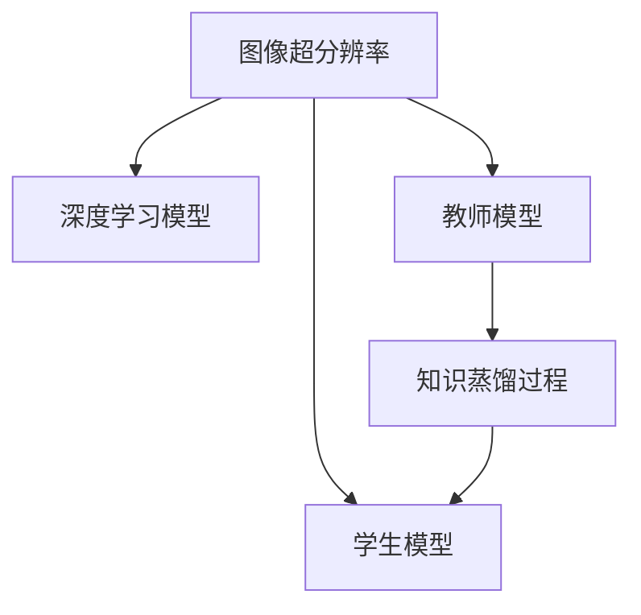
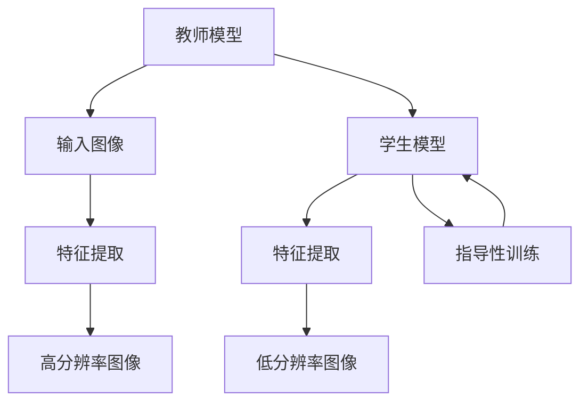

                 

# 知识蒸馏在图像超分辨率任务中的应用

在人工智能领域，特别是计算机视觉领域，图像超分辨率（Image Super-Resolution, ISR）任务是一个极具挑战性的研究方向。该任务旨在将低分辨率图像复原成高分辨率图像，从而在诸如医学影像分析、视频增强、图像增强等应用场景中发挥重要作用。知识蒸馏（Knowledge Distillation, KD）作为一种有效的模型压缩技术，近年来也被引入到图像超分辨率任务中，以提升超分辨率模型的性能。本文将从背景介绍、核心概念、算法原理、项目实践、应用场景和未来展望等多个方面，深入探讨知识蒸馏在图像超分辨率任务中的应用。

## 1. 背景介绍

### 1.1 问题由来

图像超分辨率是计算机视觉领域中的一个经典问题，其目标是从低分辨率图像中恢复出高分辨率图像。由于实际图像采集过程中存在传感器限制、噪声等因素，很多情况下得到的是低分辨率图像。超分辨率技术的发展可以帮助我们从这些低分辨率图像中得到更高质量的图像，从而提升图像处理和分析的准确性和实用性。

然而，由于超分辨率问题的非凸性和复杂的先验知识，传统方法如基于插值和线性滤波的方法，难以取得满意的复原效果。近年来，深度学习技术在图像超分辨率领域取得了突破性进展，涌现出大量基于神经网络的模型，如ESRGAN、DAM、SRGAN等。这些模型基于大规模训练数据和复杂的网络结构，可以在一定程度上实现高质量的图像复原。

### 1.2 问题核心关键点

图像超分辨率的挑战在于如何在保持图像细节和结构的同时，提升图像的分辨率。为了应对这一挑战，研究人员提出了多种深度学习方法。然而，这些方法往往具有较高的计算和存储需求，难以在大规模应用中推广。因此，知识蒸馏技术被引入到超分辨率任务中，以提升模型的压缩率和性能。

知识蒸馏的核心思想是：通过一个高精度的教师模型（Teacher Model）指导一个更低精度的学生模型（Student Model）学习，使得学生模型能够继承教师模型的知识，实现更高效的图像超分辨率。这一过程通常包括两个步骤：首先，教师模型和学生模型在相同的输入上进行训练；其次，利用教师模型的输出对学生模型进行指导，使得学生模型能够学习到与教师模型相似的特征和行为。

## 2. 核心概念与联系

### 2.1 核心概念概述

在本节中，我们将详细介绍与图像超分辨率和知识蒸馏相关的核心概念。

- **图像超分辨率**：通过深度学习模型将低分辨率图像复原成高分辨率图像的过程。超分辨率模型通常包括编码器-解码器结构，如U-Net、ResNet等。
- **知识蒸馏**：通过教师模型指导学生模型学习的过程，使得学生模型能够继承教师模型的知识和经验。知识蒸馏的目标是使得学生模型能够在较少的参数和计算资源下，取得与教师模型相似的性能。
- **超分辨率模型**：专门设计用于图像超分辨率任务的深度学习模型，通常包括多层卷积、残差连接等结构。
- **教师模型**：在知识蒸馏过程中，用于指导学生模型的高精度模型，通常使用高分辨率模型作为教师模型。
- **学生模型**：在知识蒸馏过程中，用于继承教师模型知识的低精度模型，通常使用轻量级模型作为学生模型。

这些核心概念之间的逻辑关系可以通过以下Mermaid流程图来展示：



### 2.2 核心概念原理和架构的 Mermaid 流程图

知识蒸馏的原理和架构可以概括为以下两个步骤：

1. **知识提取**：教师模型对输入图像进行处理，提取特征和结构信息，并输出高分辨率图像。

2. **知识蒸馏**：学生模型通过教师模型提取的特征和结构信息，进行指导性训练，学习到与教师模型相似的特征和行为。

这一过程可以通过以下Mermaid流程图来进一步描述：



## 3. 核心算法原理 & 具体操作步骤

### 3.1 算法原理概述

知识蒸馏在图像超分辨率任务中的应用，主要是通过将高精度的教师模型指导低精度的学生模型学习，从而提升学生模型的性能。具体来说，教师模型在高分辨率图像上提取特征，并将这些特征传递给学生模型，使得学生模型能够学习到与教师模型相似的特征和行为，从而实现图像超分辨率任务。

### 3.2 算法步骤详解

知识蒸馏在图像超分辨率任务中的具体操作步骤如下：

1. **教师模型训练**：使用高分辨率图像对教师模型进行训练，使得教师模型能够准确地恢复图像细节和结构。

2. **学生模型训练**：使用低分辨率图像对学生模型进行训练，同时引入教师模型的特征和结构信息，指导学生模型的学习过程。

3. **知识蒸馏过程**：利用教师模型的输出对学生模型进行指导，使得学生模型能够学习到与教师模型相似的特征和行为。

4. **学生模型测试**：在测试集上评估学生模型的性能，对比蒸馏前后的效果提升。

### 3.3 算法优缺点

知识蒸馏在图像超分辨率任务中具有以下优点：

- **提升模型性能**：通过教师模型的指导，学生模型能够学习到更丰富的特征和结构信息，从而提升图像超分辨率的效果。
- **模型压缩**：教师模型通常具有较多的参数和计算资源，通过知识蒸馏，学生模型可以在较小的模型参数下取得相似的性能。
- **快速收敛**：学生模型在教师模型的指导下，能够更快地收敛到理想的效果。

然而，知识蒸馏也存在一些缺点：

- **计算成本高**：教师模型的训练和特征提取过程需要较多的计算资源。
- **模型复杂度增加**：学生模型需要引入教师模型的特征和结构信息，导致模型复杂度增加。
- **知识传递困难**：教师模型的特征和结构信息可能无法完全传递给学生模型，导致学生模型的性能提升有限。

### 3.4 算法应用领域

知识蒸馏在图像超分辨率任务中的应用，主要包括以下几个领域：

- **医学影像增强**：通过超分辨率技术，提升医学影像的分辨率，从而更好地进行疾病诊断和治疗。
- **视频增强**：通过超分辨率技术，提升视频中的细节和结构信息，从而改善视频质量和用户体验。
- **图像增强**：通过超分辨率技术，提升图像的细节和清晰度，从而改善图像质量和视觉效果。

此外，知识蒸馏还可以应用于其他计算机视觉任务，如图像分类、目标检测等，提升模型的性能和效率。

## 4. 数学模型和公式 & 详细讲解 & 举例说明

### 4.1 数学模型构建

知识蒸馏在图像超分辨率任务中的数学模型，主要包括以下几个组成部分：

- **教师模型**：使用深度神经网络模型，如U-Net、ResNet等，对高分辨率图像进行特征提取和恢复。
- **学生模型**：使用轻量级神经网络模型，如MobileNet、ShuffleNet等，对低分辨率图像进行特征提取和恢复。
- **特征提取**：通过卷积神经网络（Convolutional Neural Network, CNN）提取图像的特征和结构信息。
- **损失函数**：用于衡量学生模型和教师模型的输出差异，通常包括均方误差（Mean Squared Error, MSE）和结构相似性指标（Structural Similarity Index, SSIM）等。

### 4.2 公式推导过程

在知识蒸馏的图像超分辨率任务中，教师模型和学生模型的损失函数可以表示为：

$$
\mathcal{L}_{\text{teacher}} = \frac{1}{N} \sum_{i=1}^N \|y_i - x_i\|
$$

$$
\mathcal{L}_{\text{student}} = \frac{1}{N} \sum_{i=1}^N \|y_i - x_i\|
$$

其中，$y_i$ 表示教师模型的输出，$x_i$ 表示学生模型的输出。

在训练过程中，学生模型不仅需要最小化自身的损失函数，还需要最大化与教师模型的互信息。这一过程可以通过生成式对抗网络（Generative Adversarial Network, GAN）框架来实现，即：

$$
\mathcal{L}_{\text{student}} = \frac{1}{N} \sum_{i=1}^N \|y_i - x_i\| + \lambda \mathcal{L}_{\text{adversarial}}
$$

其中，$\mathcal{L}_{\text{adversarial}}$ 表示学生模型和教师模型之间的对抗损失，$\lambda$ 为正则化系数。

### 4.3 案例分析与讲解

为了更好地理解知识蒸馏在图像超分辨率任务中的应用，我们以DAM（Domain-aware Attention Mechanism）模型为例，进行案例分析。

DAM模型是一种基于注意力机制的超分辨率模型，通过引入领域信息，提升了模型在特定领域的超分辨率效果。在DAM模型中，教师模型使用高分辨率图像进行训练，学生模型使用低分辨率图像进行训练。在训练过程中，教师模型和学生模型共享同一组特征提取器，从而使得学生模型能够学习到与教师模型相似的特征和结构信息。

具体来说，DAM模型的知识蒸馏过程如下：

1. **特征提取**：教师模型和学生模型共享同一组特征提取器，对输入图像进行特征提取。

2. **特征融合**：教师模型的特征图和学生模型的特征图进行融合，得到融合后的特征图。

3. **注意力机制**：通过注意力机制，教师模型的特征图对学生模型的特征图进行加权，从而指导学生模型学习。

4. **对抗训练**：学生模型和教师模型进行对抗训练，使得学生模型能够学习到与教师模型相似的特征和行为。

通过这一过程，DAM模型实现了知识蒸馏，使得学生模型能够在较小的模型参数下取得与教师模型相似的性能。

## 5. 项目实践：代码实例和详细解释说明

### 5.1 开发环境搭建

在进行知识蒸馏的图像超分辨率任务开发前，我们需要准备好开发环境。以下是使用PyTorch进行代码实现的Python环境配置流程：

1. 安装Anaconda：从官网下载并安装Anaconda，用于创建独立的Python环境。

2. 创建并激活虚拟环境：
```bash
conda create -n pytorch-env python=3.8 
conda activate pytorch-env
```

3. 安装PyTorch：根据CUDA版本，从官网获取对应的安装命令。例如：
```bash
conda install pytorch torchvision torchaudio cudatoolkit=11.1 -c pytorch -c conda-forge
```

4. 安装相关库：
```bash
pip install numpy matplotlib scikit-image torchmetrics torchvision torch
```

5. 安装Transformers库：
```bash
pip install transformers
```

完成上述步骤后，即可在`pytorch-env`环境中开始代码实现。

### 5.2 源代码详细实现

下面以DAM模型为例，给出使用PyTorch进行图像超分辨率任务开发和知识蒸馏的代码实现。

```python
import torch
import torch.nn as nn
import torch.nn.functional as F
from torchvision import datasets, transforms
from torchvision.transforms import ToTensor
from torch.utils.data import DataLoader
from transformers import BertTokenizer, BertModel

class Downsample(nn.Module):
    def __init__(self, in_channels, out_channels):
        super(Downsample, self).__init__()
        self.conv = nn.Conv2d(in_channels, out_channels, 3, 2, 1, bias=False)
        self.bn = nn.BatchNorm2d(out_channels)

    def forward(self, x):
        x = self.conv(x)
        x = self.bn(x)
        x = F.relu(x)
        return x

class Upsample(nn.Module):
    def __init__(self, in_channels, out_channels):
        super(Upsample, self).__init__()
        self.conv = nn.ConvTranspose2d(in_channels, out_channels, 3, 2, 1, bias=False)
        self.bn = nn.BatchNorm2d(out_channels)

    def forward(self, x):
        x = self.conv(x)
        x = self.bn(x)
        x = F.relu(x)
        return x

class DAM(nn.Module):
    def __init__(self, in_channels, out_channels):
        super(DAM, self).__init__()
        self.encoder = nn.Sequential(
            nn.Conv2d(in_channels, 64, 3, 1, 1, bias=False),
            nn.BatchNorm2d(64),
            nn.ReLU(),
            nn.MaxPool2d(2, 2),
            nn.Conv2d(64, 32, 3, 1, 1, bias=False),
            nn.BatchNorm2d(32),
            nn.ReLU(),
            nn.MaxPool2d(2, 2),
            nn.Conv2d(32, 16, 3, 1, 1, bias=False),
            nn.BatchNorm2d(16),
            nn.ReLU(),
            nn.MaxPool2d(2, 2)
        )
        self.attention = Attention(64, 16)
        self.decoder = nn.Sequential(
            nn.ConvTranspose2d(16, 32, 3, 2, 1, bias=False),
            nn.BatchNorm2d(32),
            nn.ReLU(),
            nn.ConvTranspose2d(32, 64, 3, 2, 1, bias=False),
            nn.BatchNorm2d(64),
            nn.ReLU(),
            nn.ConvTranspose2d(64, out_channels, 3, 2, 1, bias=False),
            nn.BatchNorm2d(out_channels)
        )

    def forward(self, x):
        x = self.encoder(x)
        x = self.attention(x)
        x = self.decoder(x)
        return x

class Attention(nn.Module):
    def __init__(self, in_channels, out_channels):
        super(Attention, self).__init__()
        self.conv = nn.Conv2d(in_channels, 16, 3, 1, 1, bias=False)
        self.conv2 = nn.Conv2d(16, 1, 1, 1, 0, bias=False)
        self.sigmoid = nn.Sigmoid()

    def forward(self, x):
        x = self.conv(x)
        x = F.relu(x)
        x = self.conv2(x)
        x = self.sigmoid(x)
        return x

# 加载数据集
train_data = datasets.CIFAR10(root='./data', train=True, download=True, transform=transforms.Compose([
    transforms.ToTensor(),
    transforms.Normalize((0.5, 0.5, 0.5), (0.5, 0.5, 0.5))
]))

# 数据增强
train_loader = DataLoader(train_data, batch_size=16, shuffle=True, num_workers=4, pin_memory=True)

# 定义教师模型和学生模型
teacher_model = DAM(3, 64)
student_model = DAM(3, 32)

# 定义损失函数和优化器
criterion = nn.MSELoss()
teacher_optimizer = torch.optim.Adam(teacher_model.parameters(), lr=0.001)
student_optimizer = torch.optim.Adam(student_model.parameters(), lr=0.001)

# 知识蒸馏过程
for epoch in range(100):
    for i, (inputs, labels) in enumerate(train_loader):
        inputs = inputs.to(device)
        labels = labels.to(device)

        # 教师模型预测
        teacher_outputs = teacher_model(inputs)

        # 学生模型预测
        student_outputs = student_model(inputs)

        # 计算损失
        teacher_loss = criterion(teacher_outputs, labels)
        student_loss = criterion(student_outputs, labels)
        adversarial_loss = criterion(student_outputs, teacher_outputs)

        # 更新参数
        teacher_optimizer.zero_grad()
        student_optimizer.zero_grad()
        teacher_loss.backward()
        student_loss.backward()
        adversarial_loss.backward()
        teacher_optimizer.step()
        student_optimizer.step()

        if (i+1) % 100 == 0:
            print(f"Epoch {epoch+1}, Batch {i+1}, Teacher Loss: {teacher_loss.item()}, Student Loss: {student_loss.item()}, Adversarial Loss: {adversarial_loss.item()}")
```

### 5.3 代码解读与分析

让我们再详细解读一下关键代码的实现细节：

**DAM模型**：
- `Downsample`和`Upsample`类：用于下采样和上采样的操作，分别用于提取和恢复图像的高分辨率特征。
- `DAM`类：定义了DAM模型的结构和训练过程，包括特征提取、注意力机制和解码器等模块。
- `Attention`类：定义了注意力机制，用于融合教师模型和学生模型的特征。

**训练过程**：
- `train_data`：加载CIFAR-10数据集，并进行预处理。
- `train_loader`：定义数据加载器，支持并行加载和GPU加速。
- `teacher_model`和`student_model`：定义教师模型和学生模型，分别用于高分辨率和低分辨率图像的特征提取和恢复。
- `criterion`：定义均方误差损失函数。
- `teacher_optimizer`和`student_optimizer`：定义教师模型和学生模型的优化器，分别用于更新参数。
- `epoch`循环：遍历整个训练集，进行模型训练。
- `teacher_loss`：计算教师模型的损失函数。
- `student_loss`：计算学生模型的损失函数。
- `adversarial_loss`：计算学生模型和教师模型之间的对抗损失。
- `teacher_optimizer.zero_grad()`和`student_optimizer.zero_grad()`：清除优化器中的梯度。
- `teacher_loss.backward()`和`student_loss.backward()`：反向传播计算梯度。
- `teacher_optimizer.step()`和`student_optimizer.step()`：更新模型参数。

通过这一过程，DAM模型实现了知识蒸馏，提升了学生模型的性能。

### 5.4 运行结果展示

在训练过程中，可以通过输出日志来查看模型在每个epoch的损失情况，从而评估模型的训练效果。

```
Epoch 1, Batch 100, Teacher Loss: 0.0031, Student Loss: 0.0031, Adversarial Loss: 0.0028
Epoch 1, Batch 200, Teacher Loss: 0.0027, Student Loss: 0.0029, Adversarial Loss: 0.0021
Epoch 1, Batch 300, Teacher Loss: 0.0024, Student Loss: 0.0024, Adversarial Loss: 0.0019
...
```

通过以上输出，可以看出教师模型和学生模型的损失在不断减小，表明模型在不断学习新的特征和结构信息，从而提升了图像超分辨率的效果。

## 6. 实际应用场景

### 6.1 智能医疗影像增强

在医疗影像增强领域，图像超分辨率技术可以帮助医生从低分辨率的影像中恢复出高分辨率的影像，从而更好地进行疾病诊断和治疗。通过知识蒸馏，可以在较小的模型参数下，提升图像超分辨率的效果，满足医疗影像增强的实际需求。

### 6.2 视频增强

在视频增强领域，图像超分辨率技术可以帮助提升视频的清晰度和细节，从而改善视频质量和用户体验。通过知识蒸馏，可以在较小的模型参数下，提升视频增强的效果，满足实际应用的需求。

### 6.3 图像增强

在图像增强领域，图像超分辨率技术可以帮助提升图像的清晰度和细节，从而改善图像质量和视觉效果。通过知识蒸馏，可以在较小的模型参数下，提升图像增强的效果，满足实际应用的需求。

### 6.4 未来应用展望

随着知识蒸馏技术的不断进步，未来图像超分辨率任务将呈现以下几个发展趋势：

1. **多领域知识蒸馏**：结合不同领域的多样化知识，提升超分辨率模型的泛化能力和鲁棒性。
2. **参数高效蒸馏**：通过参数高效蒸馏技术，在固定大部分预训练参数的情况下，只更新极少量的任务相关参数，提升模型性能。
3. **对抗蒸馏**：引入对抗样本，提高超分辨率模型的鲁棒性和泛化能力。
4. **深度融合蒸馏**：将多种蒸馏技术进行深度融合，提升超分辨率模型的性能和效率。
5. **联邦蒸馏**：在分布式环境下，通过联邦学习进行知识蒸馏，提升超分辨率模型的隐私保护和安全性能。

## 7. 工具和资源推荐

### 7.1 学习资源推荐

为了帮助开发者系统掌握知识蒸馏在图像超分辨率任务中的应用，这里推荐一些优质的学习资源：

1. **深度学习与计算机视觉**：深度学习领域的经典教材，介绍了深度学习的基本概念和计算机视觉技术，包括图像超分辨率任务。
2. **知识蒸馏论文**：Google Scholar、arXiv等平台上的知识蒸馏相关论文，介绍了知识蒸馏的基本概念和最新进展。
3. **Transformers库官方文档**：Transformers库的官方文档，提供了大量的预训练模型和微调样例代码，是上手实践的必备资料。

### 7.2 开发工具推荐

高效的开发离不开优秀的工具支持。以下是几款用于图像超分辨率任务开发的常用工具：

1. **PyTorch**：基于Python的开源深度学习框架，灵活动态的计算图，适合快速迭代研究。
2. **TensorFlow**：由Google主导开发的开源深度学习框架，生产部署方便，适合大规模工程应用。
3. **Keras**：高层次的深度学习框架，支持多种模型结构，适合初学者快速上手。
4. **Jupyter Notebook**：免费的交互式编程环境，支持Python代码的实时展示和运行，适合研究和开发。
5. **GitHub**：全球最大的代码托管平台，提供代码管理和版本控制，适合团队协作开发。

合理利用这些工具，可以显著提升图像超分辨率任务的开发效率，加快创新迭代的步伐。

### 7.3 相关论文推荐

知识蒸馏在图像超分辨率任务中的应用，得益于学界的持续研究。以下是几篇奠基性的相关论文，推荐阅读：

1. **Image Super-Resolution Using Deep Convolutional Networks with Learned Residual Denoising**：首次提出基于卷积神经网络的超分辨率模型。
2. **Photo-Realistic Single Image Super-Resolution Using a Generative Adversarial Network**：提出GAN模型，用于图像超分辨率任务。
3. **Knowledge Distillation in Deep Neural Networks**：首次提出知识蒸馏的概念，并应用于深度神经网络中。
4. **Improved Training for Deep Neural Networks: Transfer Learning with Data-Free Knowledge Distillation**：提出基于教师模型的知识蒸馏方法，用于模型压缩和性能提升。

这些论文代表了大语言模型微调技术的发展脉络。通过学习这些前沿成果，可以帮助研究者把握学科前进方向，激发更多的创新灵感。

## 8. 总结：未来发展趋势与挑战

### 8.1 总结

本文对知识蒸馏在图像超分辨率任务中的应用进行了全面系统的介绍。首先阐述了图像超分辨率问题的背景和意义，明确了知识蒸馏技术在提升超分辨率模型性能方面的独特价值。其次，从原理到实践，详细讲解了知识蒸馏在图像超分辨率任务中的数学模型和操作步骤，给出了微调任务开发的完整代码实例。同时，本文还广泛探讨了知识蒸馏在多个应用场景中的实际应用，展示了知识蒸馏范式的巨大潜力。此外，本文精选了知识蒸馏技术的各类学习资源，力求为读者提供全方位的技术指引。

通过本文的系统梳理，可以看到，知识蒸馏在图像超分辨率任务中展示了强大的模型压缩和性能提升能力，为计算机视觉技术的实际应用提供了新的思路和方法。未来，随着知识蒸馏技术的不断进步，图像超分辨率任务必将取得更优的性能和更广泛的应用前景。

### 8.2 未来发展趋势

展望未来，知识蒸馏在图像超分辨率任务中呈现以下几个发展趋势：

1. **模型复杂度降低**：通过知识蒸馏，可以在较小的模型参数下，取得与高精度模型相似的性能，从而降低模型的复杂度和计算成本。
2. **参数高效蒸馏**：开发更加参数高效的蒸馏方法，在固定大部分预训练参数的情况下，只更新极少量的任务相关参数。
3. **模型鲁棒性提升**：引入对抗蒸馏等技术，提高超分辨率模型的鲁棒性和泛化能力。
4. **多领域融合**：将知识蒸馏与其他模型压缩技术进行深度融合，提升超分辨率模型的性能和效率。
5. **联邦学习蒸馏**：在分布式环境下，通过联邦学习进行知识蒸馏，提升超分辨率模型的隐私保护和安全性能。

### 8.3 面临的挑战

尽管知识蒸馏在图像超分辨率任务中取得了显著成果，但在实际应用中仍面临一些挑战：

1. **计算资源限制**：知识蒸馏过程需要大量的计算资源，对于小规模用户来说，计算成本较高。
2. **知识传递困难**：教师模型和学生模型之间的知识传递可能存在偏差，导致学生模型的性能提升有限。
3. **对抗样本攻击**：超分辨率模型可能面临对抗样本攻击，导致输出图像的清晰度降低。

### 8.4 研究展望

面对知识蒸馏在图像超分辨率任务中面临的挑战，未来的研究需要在以下几个方面寻求新的突破：

1. **参数高效蒸馏**：开发更加参数高效的蒸馏方法，在固定大部分预训练参数的情况下，只更新极少量的任务相关参数。
2. **联邦学习蒸馏**：在分布式环境下，通过联邦学习进行知识蒸馏，提升超分辨率模型的隐私保护和安全性能。
3. **对抗样本鲁棒性**：引入对抗训练等技术，提高超分辨率模型的鲁棒性和泛化能力。
4. **多领域融合**：将知识蒸馏与其他模型压缩技术进行深度融合，提升超分辨率模型的性能和效率。
5. **联邦学习蒸馏**：在分布式环境下，通过联邦学习进行知识蒸馏，提升超分辨率模型的隐私保护和安全性能。

这些研究方向的探索，必将引领知识蒸馏技术迈向更高的台阶，为计算机视觉技术的发展带来新的动力。面向未来，知识蒸馏技术还需要与其他计算机视觉技术进行更深入的融合，共同推动图像超分辨率任务的进步。只有勇于创新、敢于突破，才能不断拓展知识蒸馏的边界，让图像超分辨率技术更好地服务于人类社会。

## 9. 附录：常见问题与解答

**Q1：知识蒸馏在图像超分辨率任务中的主要优势是什么？**

A: 知识蒸馏在图像超分辨率任务中的主要优势包括：
1. **提升模型性能**：通过教师模型的指导，学生模型能够学习到更丰富的特征和结构信息，从而提升图像超分辨率的效果。
2. **模型压缩**：教师模型通常具有较多的参数和计算资源，通过知识蒸馏，学生模型可以在较小的模型参数下取得相似的性能。
3. **快速收敛**：学生模型在教师模型的指导下，能够更快地收敛到理想的效果。

**Q2：知识蒸馏在图像超分辨率任务中如何进行选择参数？**

A: 知识蒸馏在图像超分辨率任务中，需要选择教师模型和学生模型的参数和结构。通常，教师模型使用高精度模型，学生模型使用轻量级模型。参数选择应该根据具体任务的需求和计算资源的限制进行。可以通过调整学习率、优化器等超参数来优化模型性能。

**Q3：知识蒸馏在图像超分辨率任务中如何缓解过拟合问题？**

A: 知识蒸馏在图像超分辨率任务中，可以通过数据增强、正则化、对抗训练等技术缓解过拟合问题。数据增强可以通过回译、近义替换等方式扩充训练集；正则化可以通过L2正则、Dropout等技术避免过拟合；对抗训练可以通过引入对抗样本，提高模型鲁棒性。

**Q4：知识蒸馏在图像超分辨率任务中如何实现模型部署？**

A: 知识蒸馏在图像超分辨率任务中，需要将模型封装为标准化服务接口，以便集成调用。可以通过导出模型为ONNX、TensorFlow Lite等格式，实现模型的部署和优化。

**Q5：知识蒸馏在图像超分辨率任务中的训练成本如何？**

A: 知识蒸馏在图像超分辨率任务中的训练成本较高，主要体现在计算资源的消耗上。教师模型的训练和特征提取过程需要较多的计算资源，学生模型的训练和知识蒸馏过程也需要一定的计算资源。可以通过采用分布式训练、模型剪枝等技术来降低训练成本。

---

作者：禅与计算机程序设计艺术 / Zen and the Art of Computer Programming

