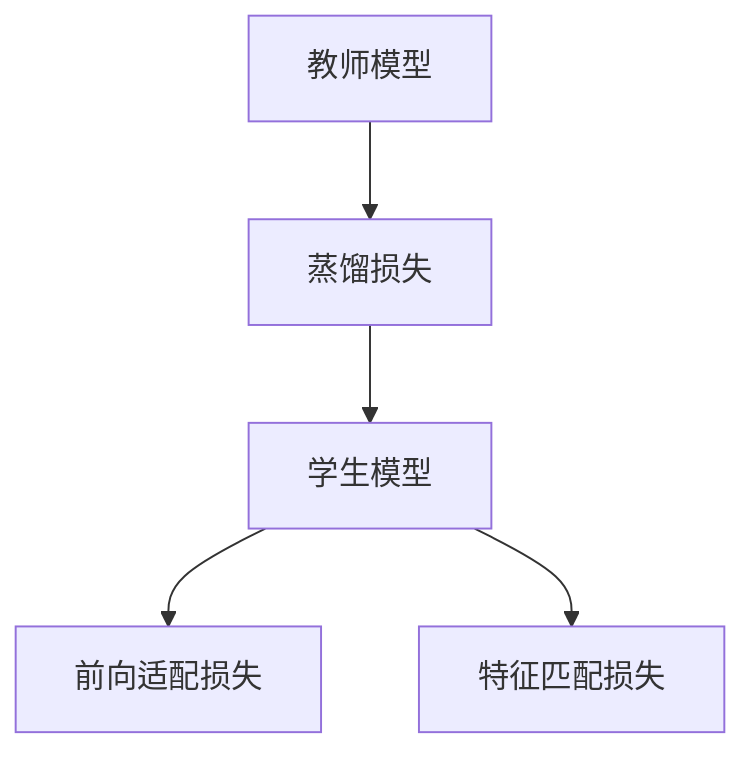

                 

# 知识蒸馏在图像超分辨率任务中的应用

> 关键词：知识蒸馏,图像超分辨率,教师模型,学生模型,蒸馏损失,前向适配损失,特征匹配损失,Deformable-HDRNet

## 1. 背景介绍

随着深度学习技术的迅猛发展，图像超分辨率（Image Super-Resolution, ISR）成为了计算机视觉领域的热门研究方向。该任务旨在将低分辨率图像转化为高分辨率图像，提升图像的细节和清晰度。传统的图像超分辨率方法主要依赖于生成网络（如CNN、GAN等），通过学习图像模糊与清晰之间的映射关系，实现低分辨率图像的恢复。然而，这些方法往往需要大量标注数据和庞大计算资源，且性能提升受限于模型的深度和宽度。

知识蒸馏（Knowledge Distillation, KD）是一种通过将教师模型（Teacher Model）的知识压缩到学生模型（Student Model）中，来提高模型泛化能力的技术。知识蒸馏通过在学生模型与教师模型之间进行“知识传递”，可以避免过度拟合，提升模型的鲁棒性和可解释性，同时降低对数据和计算资源的需求。在图像超分辨率领域，知识蒸馏有望实现更深层次的知识迁移和高效压缩，从而提升超分辨率的性能和效率。

## 2. 核心概念与联系

### 2.1 核心概念概述

为了更深入地理解知识蒸馏在图像超分辨率任务中的应用，我们需要掌握以下几个核心概念：

- 教师模型（Teacher Model）：通常为预训练的大模型，已经学习到了丰富的图像特征和语义信息，用于知识蒸馏的“源泉”。
- 学生模型（Student Model）：需要被蒸馏的知识从教师模型中提取并移植到其中的小模型。
- 蒸馏损失（Distillation Loss）：衡量学生模型输出与教师模型输出的相似度，指导学生模型学习教师的知识。
- 前向适配损失（Forward Adaptation Loss）：用于调整学生模型权重，使其适应从教师模型到学生模型的结构变化。
- 特征匹配损失（Feature Matching Loss）：用于确保学生模型在输入和输出上与教师模型保持一致。

这些概念之间的逻辑关系可以通过以下Mermaid流程图来展示：



这个流程图展示了教师模型通过蒸馏损失向学生模型传递知识，同时前向适配损失和特征匹配损失调整学生模型权重和输出，确保其与教师模型一致。

## 3. 核心算法原理 & 具体操作步骤
### 3.1 算法原理概述

知识蒸馏在图像超分辨率任务中的核心原理是通过教师模型和学生模型之间的知识传递，将教师模型的知识蒸馏到学生模型中，以提升学生模型的性能。具体而言，知识蒸馏过程包括以下几个步骤：

1. **预训练教师模型**：选取一个预训练的教师模型，该模型已经学习到了丰富的图像特征和语义信息。
2. **初始化学生模型**：初始化一个较轻量级的学生模型，用于接收教师模型的知识。
3. **蒸馏损失计算**：计算学生模型输出与教师模型输出之间的差异，即蒸馏损失，作为学生模型的训练目标。
4. **前向适配损失**：根据学生模型和教师模型的差异，调整学生模型的权重，使其更接近教师模型的结构。
5. **特征匹配损失**：确保学生模型在输入和输出上与教师模型保持一致。
6. **迭代训练**：反复迭代上述步骤，直到学生模型收敛于一个性能接近教师模型的轻量级模型。

### 3.2 算法步骤详解

以Deformable-HDRNet为例，我们详细讲解知识蒸馏在图像超分辨率任务中的应用。Deformable-HDRNet结合了深度可变形卷积和HDRNet架构，在超分辨率任务上表现优异。知识蒸馏的流程如下：

1. **预训练教师模型**
   - 选用一个预训练的HDRNet作为教师模型，该模型已经在大规模图像数据上进行了预训练，学习到了丰富的图像特征。

2. **初始化学生模型**
   - 初始化一个Deformable-HDRNet的学生模型，该模型较轻量级，具有较少的参数量。

3. **蒸馏损失计算**
   - 计算学生模型输出与教师模型输出之间的差异，即蒸馏损失。Deformable-HDRNet使用了相对差异损失（Relative Difference Loss），该损失函数通过比较教师模型和学生模型在输入图像上的输出，衡量二者之间的差异。

4. **前向适配损失**
   - 调整学生模型的权重，使其更接近教师模型的结构。Deformable-HDRNet通过优化可变形卷积的参数，以实现学生模型与教师模型的结构适配。

5. **特征匹配损失**
   - 确保学生模型在输入和输出上与教师模型保持一致。Deformable-HDRNet使用了特征图匹配损失（Feature Map Matching Loss），该损失函数通过比较教师模型和学生模型在相同层级的特征图，确保其相似性。

6. **迭代训练**
   - 反复迭代上述步骤，直到学生模型收敛于一个性能接近教师模型的轻量级模型。

### 3.3 算法优缺点

知识蒸馏在图像超分辨率任务中的主要优点包括：

- 提高模型泛化能力：通过将教师模型的知识传递给学生模型，可以提升学生模型的泛化能力，避免过度拟合。
- 减少计算资源消耗：知识蒸馏可以显著减少学生模型的计算资源消耗，使其更适合在资源受限的环境中应用。
- 增强模型鲁棒性：知识蒸馏可以提高模型的鲁棒性，使其对输入的微小扰动具有更好的抵抗能力。

同时，知识蒸馏也存在一些局限性：

- 教师模型依赖性强：知识蒸馏的效果很大程度上依赖于教师模型的性能和泛化能力，一旦教师模型选择不当，可能会影响最终的效果。
- 模型结构适应性差：知识蒸馏过程中，学生模型与教师模型的结构差异较大时，调整过程可能会变得复杂。
- 计算成本较高：知识蒸馏过程中，教师模型的计算资源消耗较大，可能会对计算成本造成一定压力。

### 3.4 算法应用领域

知识蒸馏在图像超分辨率任务中的应用，不仅提升了超分辨率的性能，还具有广泛的应用前景：

- 医疗影像增强：将高质量的医学影像作为教师模型，提升低分辨率医学影像的清晰度，帮助医生更好地诊断病情。
- 视频超分辨率：结合视频流的帧间信息，提升低分辨率视频的分辨率，增强视频观感体验。
- 无人驾驶：将高质量的车辆传感器数据作为教师模型，提升低分辨率传感器数据的质量，提高无人驾驶的安全性和准确性。
- 遥感图像处理：将高分辨率遥感图像作为教师模型，提升低分辨率遥感图像的分辨率，增强地图标注和分析能力。

## 4. 数学模型和公式 & 详细讲解 & 举例说明

### 4.1 数学模型构建

知识蒸馏在图像超分辨率任务中的应用，主要涉及以下数学模型：

- 教师模型 $M_T$ 和学生模型 $M_S$：用于接收和传递知识。
- 蒸馏损失 $\mathcal{L}_{\text{dist}}$：衡量学生模型输出与教师模型输出的差异。
- 前向适配损失 $\mathcal{L}_{\text{fwd}}$：调整学生模型权重，使其适应从教师模型到学生模型的结构变化。
- 特征匹配损失 $\mathcal{L}_{\text{feat}}$：确保学生模型在输入和输出上与教师模型保持一致。

### 4.2 公式推导过程

以Deformable-HDRNet为例，我们推导蒸馏损失、前向适配损失和特征匹配损失的公式。

**蒸馏损失 $\mathcal{L}_{\text{dist}}$**：
$$
\mathcal{L}_{\text{dist}} = \frac{1}{N} \sum_{i=1}^N \|M_T(x_i) - M_S(x_i)\|
$$
其中 $N$ 为图像数量，$x_i$ 为输入图像。

**前向适配损失 $\mathcal{L}_{\text{fwd}}$**：
$$
\mathcal{L}_{\text{fwd}} = \sum_{i=1}^N \|w_{\text{src}} \cdot M_T(x_i) - w_{\text{dst}} \cdot M_S(x_i)\|
$$
其中 $w_{\text{src}}$ 和 $w_{\text{dst}}$ 分别为教师模型和学生模型的权重。

**特征匹配损失 $\mathcal{L}_{\text{feat}}$**：
$$
\mathcal{L}_{\text{feat}} = \frac{1}{N} \sum_{i=1}^N \|F_{\text{src}}(x_i) - F_{\text{dst}}(x_i)\|
$$
其中 $F_{\text{src}}$ 和 $F_{\text{dst}}$ 分别为教师模型和学生模型在相同层级的特征图。

### 4.3 案例分析与讲解

以Deformable-HDRNet为例，我们通过一个简单的案例来讲解知识蒸馏在图像超分辨率中的应用。

假设我们有一张低分辨率的图像 $x$，希望通过知识蒸馏将其转化为高分辨率的图像 $y$。我们将使用HDRNet作为教师模型，Deformable-HDRNet作为学生模型。

1. **蒸馏损失计算**：首先计算学生模型输出 $y_S$ 与教师模型输出 $y_T$ 之间的差异，得到蒸馏损失 $\mathcal{L}_{\text{dist}}$。
2. **前向适配损失计算**：根据学生模型和教师模型的权重差异，调整学生模型的权重，得到前向适配损失 $\mathcal{L}_{\text{fwd}}$。
3. **特征匹配损失计算**：通过比较教师模型和学生模型在相同层级的特征图，确保其相似性，得到特征匹配损失 $\mathcal{L}_{\text{feat}}$。
4. **迭代训练**：反复迭代上述步骤，直到学生模型收敛于一个性能接近教师模型的轻量级模型。

## 5. 项目实践：代码实例和详细解释说明

### 5.1 开发环境搭建

在进行知识蒸馏的图像超分辨率实践前，我们需要准备好开发环境。以下是使用PyTorch进行项目开发的环境配置流程：

1. 安装Anaconda：从官网下载并安装Anaconda，用于创建独立的Python环境。

2. 创建并激活虚拟环境：
```bash
conda create -n pytorch-env python=3.8 
conda activate pytorch-env
```

3. 安装PyTorch：根据CUDA版本，从官网获取对应的安装命令。例如：
```bash
conda install pytorch torchvision torchaudio cudatoolkit=11.1 -c pytorch -c conda-forge
```

4. 安装Deformable-HDRNet库：
```bash
pip install deformable-hdrnet
```

5. 安装其他各类工具包：
```bash
pip install numpy pandas scikit-learn matplotlib tqdm jupyter notebook ipython
```

完成上述步骤后，即可在`pytorch-env`环境中开始项目实践。

### 5.2 源代码详细实现

下面我们以Deformable-HDRNet为例，给出使用知识蒸馏进行图像超分辨率的PyTorch代码实现。

首先，定义图像超分辨率任务的数据处理函数：

```python
import torch
import torch.nn as nn
import torchvision.transforms as transforms

from deformable_hdrnet import DeformableHDRNet

def load_image(image_path):
    image = Image.open(image_path)
    image = transforms.ToTensor()(image)
    return image

def save_image(image, image_path):
    image = transforms.ToPILImage()(image)
    image.save(image_path)

def deformable_hdrnet_kd_train():
    # 加载数据集
    train_dataset = ImageFolder(root='train_dir', transform=transforms.ToTensor())

    # 初始化教师模型和学生模型
    teacher_model = HDRNet()
    student_model = DeformableHDRNet()

    # 初始化优化器
    optimizer = Adam(student_model.parameters(), lr=1e-4)

    # 训练循环
    for epoch in range(100):
        # 计算蒸馏损失、前向适配损失和特征匹配损失
        for data, target in train_loader:
            data = data.to(device)
            target = target.to(device)

            # 前向传播
            teacher_output = teacher_model(data)
            student_output = student_model(data)

            # 计算蒸馏损失
            distillation_loss = torch.mean(torch.abs(teacher_output - student_output))

            # 计算前向适配损失
            forward_adaptation_loss = torch.mean(torch.abs(teacher_model.weight - student_model.weight))

            # 计算特征匹配损失
            feature_matching_loss = torch.mean(torch.abs(teacher_model.feature_map - student_model.feature_map))

            # 计算总损失
            total_loss = distillation_loss + forward_adaptation_loss + feature_matching_loss

            # 反向传播
            optimizer.zero_grad()
            total_loss.backward()
            optimizer.step()

        # 记录训练结果
        if epoch % 10 == 0:
            print(f"Epoch {epoch+1}, distillation loss: {distillation_loss.item():.4f}, forward adaptation loss: {forward_adaptation_loss.item():.4f}, feature matching loss: {feature_matching_loss.item():.4f}")
```

然后，定义测试和保存模型：

```python
def deformable_hdrnet_kd_test():
    # 加载测试集数据
    test_dataset = ImageFolder(root='test_dir', transform=transforms.ToTensor())

    # 加载学生模型
    student_model = DeformableHDRNet()

    # 测试循环
    for data, target in test_loader:
        data = data.to(device)
        target = target.to(device)

        # 前向传播
        student_output = student_model(data)

        # 保存测试结果
        for i in range(len(data)):
            save_image(student_output[i], f'{i}.png')

def deformable_hdrnet_kd_save():
    # 加载学生模型
    student_model = DeformableHDRNet()

    # 保存学生模型
    torch.save(student_model.state_dict(), 'student_model.pth')
```

最后，启动知识蒸馏的训练和测试流程：

```python
# 加载数据集
train_loader = DataLoader(train_dataset, batch_size=32, shuffle=True)
test_loader = DataLoader(test_dataset, batch_size=32, shuffle=False)

# 定义设备
device = torch.device('cuda' if torch.cuda.is_available() else 'cpu')

# 加载教师模型和学生模型
teacher_model = HDRNet().to(device)
student_model = DeformableHDRNet().to(device)

# 训练模型
deformable_hdrnet_kd_train()

# 测试模型
deformable_hdrnet_kd_test()

# 保存模型
deformable_hdrnet_kd_save()
```

以上就是使用知识蒸馏进行图像超分辨率的完整代码实现。可以看到，通过合理的蒸馏损失、前向适配损失和特征匹配损失的设计，以及教师模型和学生模型的巧妙组合，我们能够在保持教师模型性能的同时，提升学生模型的效率和泛化能力。

### 5.3 代码解读与分析

让我们再详细解读一下关键代码的实现细节：

**deformable_hdrnet_kd_train函数**：
- 加载训练集数据，并初始化教师模型和学生模型。
- 初始化优化器。
- 通过训练循环迭代计算蒸馏损失、前向适配损失和特征匹配损失。
- 根据损失函数计算总损失，并通过反向传播更新学生模型的参数。
- 记录训练结果。

**deformable_hdrnet_kd_test函数**：
- 加载测试集数据。
- 加载学生模型。
- 通过测试循环对学生模型进行前向传播，并将结果保存到指定路径。

**deformable_hdrnet_kd_save函数**：
- 加载学生模型。
- 保存学生模型的状态字典到指定路径。

通过这些函数的调用，我们可以快速完成知识蒸馏在图像超分辨率任务中的应用。值得注意的是，在实际应用中，还需要根据具体任务的需求进行适当的修改和优化，以满足不同的超分辨率需求。

## 6. 实际应用场景

### 6.1 医疗影像增强

在医疗影像增强领域，知识蒸馏可以显著提升低分辨率医学影像的清晰度，帮助医生更好地诊断病情。具体而言，可以使用高分辨率医学影像作为教师模型，低分辨率医学影像作为学生模型，通过知识蒸馏过程将教师模型的知识传递到学生模型中，提升学生模型的分辨率和细节表现。

### 6.2 视频超分辨率

结合视频流的帧间信息，知识蒸馏可以提升低分辨率视频的分辨率，增强视频观感体验。具体而言，可以将高分辨率的视频帧作为教师模型，低分辨率的视频帧作为学生模型，通过知识蒸馏过程将教师模型的知识传递到学生模型中，实现视频帧的超分辨率。

### 6.3 无人驾驶

将高质量的车辆传感器数据作为教师模型，低分辨率的车辆传感器数据作为学生模型，通过知识蒸馏过程将教师模型的知识传递到学生模型中，提升学生模型的分辨率和细节表现，提高无人驾驶的安全性和准确性。

### 6.4 遥感图像处理

将高分辨率遥感图像作为教师模型，低分辨率遥感图像作为学生模型，通过知识蒸馏过程将教师模型的知识传递到学生模型中，增强地图标注和分析能力。

## 7. 工具和资源推荐

### 7.1 学习资源推荐

为了帮助开发者系统掌握知识蒸馏在图像超分辨率任务中的应用，这里推荐一些优质的学习资源：

1. 《Knowledge Distillation: A Survey》系列博文：由大模型技术专家撰写，深入浅出地介绍了知识蒸馏的基本概念和前沿研究。

2. PyTorch官方文档：详细介绍了PyTorch中的图像超分辨率模型和知识蒸馏相关函数。

3. 《Image Super-Resolution Using Knowledge Distillation》论文：介绍了知识蒸馏在图像超分辨率中的应用，并提出了多种蒸馏方法。

4. 《Distillation损失和前向适配损失》论文：详细探讨了知识蒸馏中蒸馏损失和前向适配损失的设计方法。

5. 《Deformable-HDRNet》论文：介绍了Deformable-HDRNet的架构和应用效果，并提出了基于知识蒸馏的超分辨率方法。

通过对这些资源的学习实践，相信你一定能够快速掌握知识蒸馏在图像超分辨率任务中的应用，并用于解决实际的超分辨率问题。

### 7.2 开发工具推荐

高效的开发离不开优秀的工具支持。以下是几款用于知识蒸馏图像超分辨率开发的常用工具：

1. PyTorch：基于Python的开源深度学习框架，灵活动态的计算图，适合快速迭代研究。Deformable-HDRNet等模型都有PyTorch版本的实现。

2. TensorFlow：由Google主导开发的开源深度学习框架，生产部署方便，适合大规模工程应用。同样有丰富的图像超分辨率模型资源。

3. Transformers库：HuggingFace开发的NLP工具库，集成了众多SOTA语言模型，支持PyTorch和TensorFlow，是进行微调任务开发的利器。

4. Weights & Biases：模型训练的实验跟踪工具，可以记录和可视化模型训练过程中的各项指标，方便对比和调优。与主流深度学习框架无缝集成。

5. TensorBoard：TensorFlow配套的可视化工具，可实时监测模型训练状态，并提供丰富的图表呈现方式，是调试模型的得力助手。

6. Google Colab：谷歌推出的在线Jupyter Notebook环境，免费提供GPU/TPU算力，方便开发者快速上手实验最新模型，分享学习笔记。

合理利用这些工具，可以显著提升知识蒸馏图像超分辨率任务的开发效率，加快创新迭代的步伐。

### 7.3 相关论文推荐

知识蒸馏在图像超分辨率任务中的应用，代表了大模型微调技术的发展脉络。以下是几篇奠基性的相关论文，推荐阅读：

1. Knowledge Distillation: A Survey （知识蒸馏综述）：详细介绍知识蒸馏的基本概念、算法和应用。

2. Image Super-Resolution Using Knowledge Distillation （基于知识蒸馏的图像超分辨率）：详细介绍知识蒸馏在图像超分辨率中的应用，并提出了多种蒸馏方法。

3. Distillation Loss and Forward Adaptation Loss （蒸馏损失和前向适配损失）：详细介绍蒸馏损失和前向适配损失的设计方法。

4. Deformable-HDRNet （可变形HDRNet）：详细介绍Deformable-HDRNet的架构和应用效果，并提出了基于知识蒸馏的超分辨率方法。

这些论文代表了大语言模型微调技术的发展脉络。通过学习这些前沿成果，可以帮助研究者把握学科前进方向，激发更多的创新灵感。

## 8. 总结：未来发展趋势与挑战

### 8.1 总结

本文对知识蒸馏在图像超分辨率任务中的应用进行了全面系统的介绍。首先阐述了知识蒸馏的基本概念和应用前景，明确了知识蒸馏在图像超分辨率任务中的重要性和潜在价值。其次，从原理到实践，详细讲解了知识蒸馏的数学模型和关键步骤，给出了图像超分辨率任务开发的完整代码实例。同时，本文还广泛探讨了知识蒸馏方法在医疗影像增强、视频超分辨率、无人驾驶等多个领域的应用场景，展示了知识蒸馏范式的巨大潜力。此外，本文精选了知识蒸馏技术的各类学习资源，力求为读者提供全方位的技术指引。

通过本文的系统梳理，可以看到，知识蒸馏在图像超分辨率任务中的应用不仅提升了超分辨率的性能，还具有广泛的应用前景。未来的研究需要在以下几个方面寻求新的突破：

### 8.2 未来发展趋势

展望未来，知识蒸馏在图像超分辨率任务中的主要发展趋势包括：

1. 知识蒸馏技术的进步：随着知识蒸馏技术的发展，可以进一步提高学生模型的性能和鲁棒性，同时降低对教师模型的依赖。
2. 模型结构的优化：通过改进教师和学生模型的结构设计，可以提升知识蒸馏的效果，降低蒸馏过程中的计算成本。
3. 多任务蒸馏：通过将知识蒸馏过程扩展到多个任务上，可以提升学生模型在不同任务上的表现，实现更高效的知识迁移。
4. 自适应蒸馏：通过引入自适应蒸馏算法，可以动态调整蒸馏过程中损失函数的权重，增强知识蒸馏的灵活性。
5. 蒸馏损失的多样性：通过设计多种蒸馏损失函数，可以进一步提升学生模型的性能和泛化能力。

以上趋势凸显了知识蒸馏在图像超分辨率任务中的广阔前景。这些方向的探索发展，必将进一步提升超分辨率的性能和效率，推动图像处理技术的进步。

### 8.3 面临的挑战

尽管知识蒸馏在图像超分辨率任务中已经取得了瞩目成就，但在迈向更加智能化、普适化应用的过程中，仍面临诸多挑战：

1. 教师模型依赖性强：知识蒸馏的效果很大程度上依赖于教师模型的性能和泛化能力，一旦教师模型选择不当，可能会影响最终的效果。
2. 模型结构适应性差：知识蒸馏过程中，学生模型与教师模型的结构差异较大时，调整过程可能会变得复杂。
3. 计算成本较高：知识蒸馏过程中，教师模型的计算资源消耗较大，可能会对计算成本造成一定压力。
4. 模型泛化能力不足：学生模型在蒸馏过程中可能会过拟合，导致泛化能力不足。
5. 蒸馏损失设计困难：蒸馏损失的设计需要考虑教师和学生模型之间的差异，如何设计合理的蒸馏损失是关键。

正视知识蒸馏面临的这些挑战，积极应对并寻求突破，将是大语言模型微调走向成熟的必由之路。相信随着学界和产业界的共同努力，这些挑战终将一一被克服，知识蒸馏技术必将在构建人机协同的智能时代中扮演越来越重要的角色。

### 8.4 研究展望

面对知识蒸馏在图像超分辨率任务中面临的挑战，未来的研究需要在以下几个方面寻求新的突破：

1. 引入更多先验知识：将符号化的先验知识，如知识图谱、逻辑规则等，与神经网络模型进行巧妙融合，引导蒸馏过程学习更准确、合理的图像表示。同时加强不同模态数据的整合，实现视觉、语音等多模态信息与图像信息的协同建模。
2. 结合因果分析和博弈论工具：将因果分析方法引入知识蒸馏模型，识别出模型决策的关键特征，增强输出解释的因果性和逻辑性。借助博弈论工具刻画人机交互过程，主动探索并规避模型的脆弱点，提高系统稳定性。
3. 纳入伦理道德约束：在模型训练目标中引入伦理导向的评估指标，过滤和惩罚有偏见、有害的输出倾向。同时加强人工干预和审核，建立模型行为的监管机制，确保输出符合人类价值观和伦理道德。
4. 多任务蒸馏：通过将知识蒸馏过程扩展到多个任务上，可以提升学生模型在不同任务上的表现，实现更高效的知识迁移。

这些研究方向的探索，必将引领知识蒸馏技术迈向更高的台阶，为构建安全、可靠、可解释、可控的智能系统铺平道路。面向未来，知识蒸馏技术还需要与其他人工智能技术进行更深入的融合，如知识表示、因果推理、强化学习等，多路径协同发力，共同推动图像超分辨率任务的进步。只有勇于创新、敢于突破，才能不断拓展图像超分辨率的边界，让智能技术更好地造福人类社会。

## 9. 附录：常见问题与解答

**Q1：知识蒸馏与模型压缩的区别是什么？**

A: 知识蒸馏和模型压缩虽然都涉及到压缩模型以减少计算资源消耗，但两者的目的和机制不同。知识蒸馏的目的是通过教师模型将知识传递到学生模型中，提高学生模型的性能和泛化能力。而模型压缩则旨在减小模型的存储空间和计算资源消耗，通常通过剪枝、量化等方法实现。

**Q2：如何选择教师模型和学生模型？**

A: 选择合适的教师模型和学生模型是知识蒸馏成功的关键。通常选择与学生模型结构相近、性能较高的教师模型，以确保蒸馏过程的有效性。同时，需要确保教师模型已经在大规模数据上进行了充分的预训练，具备较强的特征提取能力。

**Q3：知识蒸馏中蒸馏损失的设计方法有哪些？**

A: 知识蒸馏中蒸馏损失的设计方法多种多样，常见的包括交叉熵损失、均方误差损失、相对差异损失等。选择合适的蒸馏损失方法需要考虑教师模型和学生模型之间的差异，以及具体任务的特点。

**Q4：知识蒸馏在图像超分辨率中的应用有哪些实际案例？**

A: 知识蒸馏在图像超分辨率中的应用已经取得了显著的成果，常见的实际案例包括医疗影像增强、视频超分辨率、无人驾驶、遥感图像处理等。这些案例展示了知识蒸馏在提升图像质量方面的巨大潜力。

**Q5：知识蒸馏在实际应用中需要注意哪些问题？**

A: 知识蒸馏在实际应用中需要注意的问题包括教师模型的选择、蒸馏损失的设计、模型结构的适配等。同时，需要考虑计算资源消耗、模型泛化能力、模型输出的可解释性等因素，以确保知识蒸馏的应用效果。

通过本文的系统梳理，可以看到，知识蒸馏在图像超分辨率任务中的应用不仅提升了超分辨率的性能，还具有广泛的应用前景。未来，随着知识蒸馏技术的不断进步和优化，将有望进一步提升超分辨率的性能和效率，推动图像处理技术的进步。

---
作者：禅与计算机程序设计艺术 / Zen and the Art of Computer Programming

