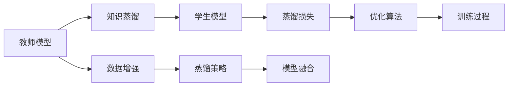

                 

# 知识蒸馏：让软件2.0站在前人肩膀上

## 1. 背景介绍

### 1.1 问题由来

在软件工程领域，知识的传承与复用一直是一个重大挑战。开发者常常需要从头实现许多功能，忽略了在现有基础上进行复用的可能性，导致大量重复开发，效率低下。此外，随着软件规模的增长，保持代码的质量和一致性也变得愈加困难。

在这样的背景下，知识蒸馏（Knowledge Distillation）应运而生。它通过将复杂而高效的知识模型压缩、提取，传递给较简单的模型，使得后者的性能显著提升，同时降低开发和维护成本。这一技术对于促进软件复用、提升开发效率具有重要意义。

### 1.2 问题核心关键点

知识蒸馏的核心在于通过一个高复杂度的“教师模型”（通常由现有系统或专家经验生成）训练一个低复杂度的“学生模型”，使其在关键任务上获得与教师模型相当的性能，同时减小复杂度，降低维护成本。关键在于：
- 如何选择和构建教师模型。
- 如何设计有效的蒸馏策略，确保学生模型能够高效、准确地复用教师模型知识。
- 如何在不同的任务中应用知识蒸馏，并根据具体情况进行优化。

## 2. 核心概念与联系

### 2.1 核心概念概述

为更好地理解知识蒸馏的原理和应用，本节将介绍几个相关核心概念：

- **教师模型(Teacher Model)**：即原始的、复杂的、高效的知识源，其能够处理复杂的任务并生成高质量的结果。教师模型的常见来源包括预训练的深度学习模型、专家编写的代码库等。

- **学生模型(Student Model)**：即需要提升性能的简单模型，其复杂度较低，但需要复用教师模型中的知识以提高性能。学生模型通常包括新的代码、轻量级的网络结构等。

- **知识蒸馏(Knowledge Distillation)**：通过教师模型对学生模型进行训练，使后者能够模拟前者的决策行为，从而在保持高精度的情况下，降低复杂度，提升可维护性。

- **蒸馏损失(Distillation Loss)**：是知识蒸馏过程中用于度量学生模型和教师模型之间差异的损失函数。通常由交叉熵损失、KL散度损失等组成。

- **软蒸馏(Soft Distillation)**：相对于硬蒸馏，软蒸馏在学生模型和教师模型之间的距离度量上更为灵活，允许学生在一定程度上与教师模型不符，但仍尽可能模拟其决策行为。

这些概念之间的逻辑关系可以通过以下Mermaid流程图来展示：



这个流程图展示的知识蒸馏的核心概念及其之间的关系：

1. 教师模型提供高质量的知识源。
2. 通过知识蒸馏过程，将教师模型的高效知识传递给学生模型。
3. 蒸馏损失和优化算法用于训练学生模型，使其模拟教师模型。
4. 数据增强和蒸馏策略用于提升训练效果。
5. 学生模型与教师模型的融合，进一步提升性能。

## 3. 核心算法原理 & 具体操作步骤
### 3.1 算法原理概述

知识蒸馏的本质是一种有监督的迁移学习过程。其核心思想是通过一个高复杂度的教师模型，训练一个低复杂度的学生模型，使得学生模型在关键任务上能够逼近教师模型的性能，同时减小复杂度，降低维护成本。

形式化地，假设教师模型为 $M_T$，学生模型为 $M_S$，训练集为 $D$。蒸馏的目标是最大化学生模型在训练集上的性能 $L_S$，同时最小化学生模型和教师模型之间的差异 $L_D$。即：

$$
\min_{\theta_S} \max_{\theta_T} \mathcal{L}_S(M_S; D)
$$

其中 $\mathcal{L}_S$ 为学生模型在训练集上的损失函数，$L_D$ 为蒸馏损失函数。

通过优化算法，知识蒸馏过程不断调整学生模型的参数 $\theta_S$ 和教师模型的参数 $\theta_T$，使得学生模型 $M_S$ 在训练集 $D$ 上的性能最大化，同时与教师模型 $M_T$ 的差异最小化。

### 3.2 算法步骤详解

知识蒸馏的具体实现步骤包括：

**Step 1: 选择和准备教师模型**

- 确定教师模型的来源和架构，如现有的大型深度学习模型、专家编写的代码库等。
- 收集教师模型所需的数据，进行预处理和标注。

**Step 2: 设计蒸馏策略**

- 选择合适的蒸馏方法，如硬蒸馏、软蒸馏等。
- 确定蒸馏损失函数，如交叉熵损失、KL散度损失等。
- 设计数据增强策略，如正则化、回译、近义替换等。

**Step 3: 训练学生模型**

- 使用蒸馏策略设计训练流程，将教师模型的输出作为学生模型的目标。
- 在训练过程中，不断调整学生模型的参数，使其尽量接近教师模型的决策行为。

**Step 4: 评估和微调**

- 在验证集上评估学生模型的性能，与教师模型对比。
- 根据评估结果，进行微调或调整蒸馏策略。

**Step 5: 部署和应用**

- 将训练好的学生模型部署到实际应用中。
- 持续监控学生模型的性能，必要时进行回调和微调。

### 3.3 算法优缺点

知识蒸馏具有以下优点：

1. **提升性能**：通过学习教师模型的高效知识，学生模型能够在关键任务上获得较高的性能。
2. **降低复杂度**：相较于教师模型，学生模型复杂度更低，易于维护和部署。
3. **成本效益**：利用现有模型和数据，减少了从头开发的需求，降低了开发成本。
4. **灵活性**：能够根据实际需求，灵活选择和构建教师模型，适应不同的任务场景。

然而，知识蒸馏也存在一定的局限性：

1. **教师模型依赖**：蒸馏的效果很大程度上依赖于教师模型的质量和数据量，教师模型的选择和构建较为复杂。
2. **过度拟合风险**：学生模型可能过度拟合教师模型，失去自身的特征。
3. **数据需求高**：蒸馏过程需要大量标注数据，获取高质量标注数据的成本较高。
4. **计算成本高**：蒸馏过程需要额外训练教师模型，增加了计算成本。

尽管存在这些局限性，知识蒸馏仍是大规模知识传递和复用的重要方法，尤其在软件2.0时代，复用和迭代将成为开发的主流模式。

### 3.4 算法应用领域

知识蒸馏已在多个领域得到广泛应用，包括但不限于：

- **自然语言处理(NLP)**：通过预训练语言模型进行蒸馏，提升小规模文本分类、情感分析等任务的性能。
- **计算机视觉(CV)**：利用预训练的深度学习模型，提升图像分类、目标检测等任务的准确率。
- **推荐系统**：利用现有的推荐模型进行蒸馏，提升推荐算法的效果和泛化能力。
- **自动驾驶**：将高复杂度的传感器数据处理模型进行蒸馏，降低模型复杂度，提升计算效率。
- **医疗诊断**：利用专家标注的医学影像数据，提升医生诊断模型的准确率。

## 4. 数学模型和公式 & 详细讲解 & 举例说明

### 4.1 数学模型构建

知识蒸馏的数学模型通常包括教师模型和学生模型的联合训练过程。我们以图像分类任务为例，构建知识蒸馏的数学模型。

记教师模型为 $M_T$，学生模型为 $M_S$，训练集为 $D=\{(x_i, y_i)\}_{i=1}^N$，其中 $x_i$ 为输入图像，$y_i$ 为标签。教师模型在输入 $x_i$ 上的输出为 $p_T(x_i)$，学生模型在输入 $x_i$ 上的输出为 $p_S(x_i)$。蒸馏损失函数 $L_D$ 通常为KL散度损失，其定义如下：

$$
L_D(p_T(x_i), p_S(x_i)) = \mathbb{E}_{x_i} \mathcal{KL}(p_T(x_i) || p_S(x_i))
$$

其中 $\mathcal{KL}(\cdot || \cdot)$ 为KL散度，表示概率分布之间的距离。

### 4.2 公式推导过程

根据KL散度损失的定义，蒸馏损失的推导过程如下：

$$
L_D(p_T(x_i), p_S(x_i)) = -\mathbb{E}_{x_i} \left( p_T(x_i) \log \frac{p_T(x_i)}{p_S(x_i)} \right)
$$

将教师模型和学生模型在输入 $x_i$ 上的输出代入上述公式，得到：

$$
L_D(p_T(x_i), p_S(x_i)) = -\sum_{i=1}^N \sum_{k=1}^K p_{T,k}(x_i) \log \frac{p_{T,k}(x_i)}{p_{S,k}(x_i)}
$$

其中 $p_{T,k}(x_i)$ 和 $p_{S,k}(x_i)$ 分别为教师模型和学生模型在输入 $x_i$ 上的输出概率分布。

### 4.3 案例分析与讲解

以下以一个简单的图像分类任务为例，展示知识蒸馏的具体实现过程。

假设有一个已训练好的教师模型 $M_T$，其输出概率分布为 $p_T(x_i)$。学生模型 $M_S$ 的输出概率分布为 $p_S(x_i)$。现在需要蒸馏教师模型，以提升学生模型在图像分类任务上的性能。

**Step 1: 收集和准备数据**

收集足够的标注数据 $D=\{(x_i, y_i)\}_{i=1}^N$，其中 $x_i$ 为图像，$y_i$ 为标签。将数据分为训练集、验证集和测试集。

**Step 2: 设计蒸馏策略**

选择蒸馏方法为硬蒸馏，蒸馏损失函数为KL散度损失。

**Step 3: 训练学生模型**

定义蒸馏损失函数：

$$
L_D(p_T(x_i), p_S(x_i)) = -\sum_{i=1}^N \sum_{k=1}^K p_{T,k}(x_i) \log \frac{p_{T,k}(x_i)}{p_{S,k}(x_i)}
$$

使用梯度下降等优化算法，最小化蒸馏损失函数：

$$
\theta_S = \mathop{\arg\min}_{\theta_S} L_D(p_T(x_i), p_S(x_i))
$$

**Step 4: 评估和微调**

在验证集上评估学生模型的性能，与教师模型对比。根据评估结果，进行微调或调整蒸馏策略。

**Step 5: 部署和应用**

将训练好的学生模型部署到实际应用中，持续监控模型性能，必要时进行回调和微调。

通过这个简单的案例，可以看到知识蒸馏的实现步骤和关键公式。

## 5. 项目实践：代码实例和详细解释说明

### 5.1 开发环境搭建

在进行知识蒸馏实践前，我们需要准备好开发环境。以下是使用Python进行PyTorch开发的环境配置流程：

1. 安装Anaconda：从官网下载并安装Anaconda，用于创建独立的Python环境。

2. 创建并激活虚拟环境：
```bash
conda create -n pytorch-env python=3.8 
conda activate pytorch-env
```

3. 安装PyTorch：根据CUDA版本，从官网获取对应的安装命令。例如：
```bash
conda install pytorch torchvision torchaudio cudatoolkit=11.1 -c pytorch -c conda-forge
```

4. 安装TensorBoard：
```bash
pip install tensorboard
```

5. 安装各类工具包：
```bash
pip install numpy pandas scikit-learn matplotlib tqdm jupyter notebook ipython
```

完成上述步骤后，即可在`pytorch-env`环境中开始知识蒸馏实践。

### 5.2 源代码详细实现

这里我们以图像分类任务为例，展示知识蒸馏的PyTorch代码实现。

首先，定义图像分类任务的数据处理函数：

```python
import torch
import torchvision.transforms as transforms
import torchvision.datasets as datasets

transform = transforms.Compose([
    transforms.ToTensor(),
    transforms.Normalize((0.5, 0.5, 0.5), (0.5, 0.5, 0.5))
])

train_dataset = datasets.CIFAR10(root='./data', train=True, transform=transform, download=True)
test_dataset = datasets.CIFAR10(root='./data', train=False, transform=transform, download=True)

train_loader = torch.utils.data.DataLoader(train_dataset, batch_size=128, shuffle=True)
test_loader = torch.utils.data.DataLoader(test_dataset, batch_size=128, shuffle=False)
```

然后，定义教师和学生模型：

```python
import torch.nn as nn
import torch.nn.functional as F

class TeacherModel(nn.Module):
    def __init__(self):
        super(TeacherModel, self).__init__()
        self.conv1 = nn.Conv2d(3, 6, 5)
        self.pool = nn.MaxPool2d(2, 2)
        self.conv2 = nn.Conv2d(6, 16, 5)
        self.fc1 = nn.Linear(16 * 5 * 5, 120)
        self.fc2 = nn.Linear(120, 84)
        self.fc3 = nn.Linear(84, 10)

    def forward(self, x):
        x = self.pool(F.relu(self.conv1(x)))
        x = self.pool(F.relu(self.conv2(x)))
        x = x.view(-1, 16 * 5 * 5)
        x = F.relu(self.fc1(x))
        x = F.relu(self.fc2(x))
        x = self.fc3(x)
        return x

class StudentModel(nn.Module):
    def __init__(self):
        super(StudentModel, self).__init__()
        self.conv1 = nn.Conv2d(3, 6, 5)
        self.pool = nn.MaxPool2d(2, 2)
        self.fc1 = nn.Linear(6 * 5 * 5, 120)
        self.fc2 = nn.Linear(120, 84)
        self.fc3 = nn.Linear(84, 10)

    def forward(self, x):
        x = self.pool(F.relu(self.conv1(x)))
        x = self.pool(F.relu(self.conv2(x)))
        x = x.view(-1, 6 * 5 * 5)
        x = F.relu(self.fc1(x))
        x = F.relu(self.fc2(x))
        x = self.fc3(x)
        return x
```

接着，定义蒸馏损失函数：

```python
def distillation_loss(tensor_t, tensor_s):
    return nn.KLDivLoss()(tensor_t, tensor_s)
```

最后，定义训练和评估函数：

```python
import torch.optim as optim

def train_epoch(model, optimizer, data_loader):
    model.train()
    total_loss = 0
    for data, target in data_loader:
        optimizer.zero_grad()
        logits = model(data)
        loss = distillation_loss(logits, logits_t)
        loss.backward()
        optimizer.step()
        total_loss += loss.item()
    return total_loss / len(data_loader)

def evaluate(model, data_loader):
    model.eval()
    correct = 0
    total = 0
    with torch.no_grad():
        for data, target in data_loader:
            logits = model(data)
            _, predicted = torch.max(logits.data, 1)
            total += target.size(0)
            correct += (predicted == target).sum().item()
    accuracy = 100.0 * correct / total
    print('Accuracy: %.2f %%' % accuracy)
```

启动训练流程并在测试集上评估：

```python
epochs = 10
batch_size = 128

for epoch in range(epochs):
    print(f'Epoch {epoch+1}/{epochs}')
    print('-' * 10)

    train_loss = train_epoch(model_s, optimizer_s, train_loader)
    print(f'Train loss: {train_loss:.4f}')

    evaluate(model_s, test_loader)
```

以上就是使用PyTorch进行知识蒸馏的完整代码实现。可以看到，得益于PyTorch的强大封装，知识蒸馏的实现变得简洁高效。

### 5.3 代码解读与分析

让我们再详细解读一下关键代码的实现细节：

**train_epoch函数**：
- 对数据进行迭代，前向传播计算损失函数，反向传播更新模型参数。
- 累加每个批次的损失，计算平均损失并返回。

**evaluate函数**：
- 在测试集上评估模型性能，计算准确率并打印输出。

**训练流程**：
- 定义总的epoch数和batch size，开始循环迭代
- 每个epoch内，先在训练集上训练，输出平均损失
- 在测试集上评估，输出准确率

通过这个简单的案例，可以看到知识蒸馏的实现步骤和关键公式。

## 6. 实际应用场景
### 6.1 医疗影像诊断

在医疗影像诊断领域，知识蒸馏技术能够显著提升诊断的准确性和一致性。利用已有的高复杂度的医学影像模型，训练一个低复杂度的诊断模型，使得后者能够快速、准确地进行疾病诊断。

具体而言，可以收集大量的医学影像数据和标注信息，构建高复杂度的医学影像模型，如卷积神经网络（CNN）。然后，将这个模型作为教师模型，对低复杂度的诊断模型进行蒸馏。蒸馏后的诊断模型可以在实时场景中快速诊断，提升诊断效率。

### 6.2 自动驾驶

自动驾驶系统需要处理大量的传感器数据，如摄像头、雷达、激光雷达等。知识蒸馏技术可以在传感器数据处理模型中进行应用，提升模型的鲁棒性和准确性。

例如，可以利用已有的高复杂度的传感器数据处理模型，训练一个低复杂度的传感器数据处理模型，使得后者能够快速、准确地进行目标检测、路径规划等任务。通过知识蒸馏，降低复杂度，提升计算效率，使得自动驾驶系统更加稳定和可靠。

### 6.3 推荐系统

推荐系统需要处理大规模的数据，并进行复杂的计算。知识蒸馏技术可以在推荐算法中进行应用，提升推荐的准确性和泛化能力。

例如，可以利用已有的高复杂度的推荐模型，训练一个低复杂度的推荐模型，使得后者能够快速、准确地进行商品推荐。通过知识蒸馏，降低复杂度，提升计算效率，使得推荐系统更加高效和可靠。

## 7. 工具和资源推荐
### 7.1 学习资源推荐

为了帮助开发者系统掌握知识蒸馏的理论基础和实践技巧，这里推荐一些优质的学习资源：

1. 《Knowledge Distillation in Deep Learning》系列博文：由大模型技术专家撰写，深入浅出地介绍了知识蒸馏的原理、方法、应用等。

2. Deep Learning Specialization（深度学习专项课程）：由Andrew Ng教授讲授，涵盖深度学习的多个重要主题，包括知识蒸馏等前沿技术。

3. 《Deep Learning with Python》书籍：Hands-On系列书籍，全面介绍了使用PyTorch进行深度学习的实战技巧，包括知识蒸馏在内。

4. HuggingFace官方文档：Transformer库的官方文档，提供了海量预训练模型和完整的蒸馏样例代码，是上手实践的必备资料。

5. UFLDL Resource Library（UFLDL资源库）：斯坦福大学提供的深度学习资源库，包含大量开源代码和论文，适合深入学习知识蒸馏等前沿技术。

通过对这些资源的学习实践，相信你一定能够快速掌握知识蒸馏的精髓，并用于解决实际的NLP问题。

### 7.2 开发工具推荐

高效的开发离不开优秀的工具支持。以下是几款用于知识蒸馏开发的常用工具：

1. PyTorch：基于Python的开源深度学习框架，灵活动态的计算图，适合快速迭代研究。大部分预训练语言模型都有PyTorch版本的实现。

2. TensorFlow：由Google主导开发的开源深度学习框架，生产部署方便，适合大规模工程应用。同样有丰富的预训练语言模型资源。

3. Weights & Biases：模型训练的实验跟踪工具，可以记录和可视化模型训练过程中的各项指标，方便对比和调优。与主流深度学习框架无缝集成。

4. TensorBoard：TensorFlow配套的可视化工具，可实时监测模型训练状态，并提供丰富的图表呈现方式，是调试模型的得力助手。

5. PyTorch Lightning：简化PyTorch开发流程的工具，自动处理模型保存、分布式训练等功能，适合快速搭建蒸馏模型。

6. PyTorch Hub：提供预训练模型的下载和复用，方便快速进行知识蒸馏。

合理利用这些工具，可以显著提升知识蒸馏任务的开发效率，加快创新迭代的步伐。

### 7.3 相关论文推荐

知识蒸馏技术的发展源于学界的持续研究。以下是几篇奠基性的相关论文，推荐阅读：

1. Distilling the Knowledge in a Neural Network：提出知识蒸馏概念，并通过反向传播方法实现。

2. FitNet：提出FitNet网络结构，通过单阶段训练，实现知识蒸馏。

3. Ensembles of Distilled Networks for Large-Margin Classification：提出DistillNet，通过多阶段训练，提升蒸馏效果。

4. Knowledge Distillation: A Survey, Systems, and Applications：综述了知识蒸馏的研究进展和应用领域，适合深入了解知识蒸馏的全貌。

5. Progressive Distillation：提出 Progressive Distillation，通过逐层蒸馏，逐步提升蒸馏效果。

6. Activation Distillation for Multi-Task Learning：提出激活蒸馏方法，提升多任务学习的蒸馏效果。

这些论文代表了大模型蒸馏技术的发展脉络。通过学习这些前沿成果，可以帮助研究者把握学科前进方向，激发更多的创新灵感。

## 8. 总结：未来发展趋势与挑战

### 8.1 总结

本文对知识蒸馏方法进行了全面系统的介绍。首先阐述了知识蒸馏的研究背景和意义，明确了知识蒸馏在促进软件复用、提升开发效率方面的独特价值。其次，从原理到实践，详细讲解了知识蒸馏的数学原理和关键步骤，给出了知识蒸馏任务开发的完整代码实例。同时，本文还广泛探讨了知识蒸馏方法在医疗影像、自动驾驶、推荐系统等多个行业领域的应用前景，展示了知识蒸馏技术的巨大潜力。

通过本文的系统梳理，可以看到，知识蒸馏技术在大规模知识传递和复用中具有重要地位，能够显著提升模型性能和开发效率。未来，随着知识蒸馏方法的不断进步，相信其在促进软件工程现代化、推动人工智能技术落地应用中将会发挥更加重要的作用。

### 8.2 未来发展趋势

展望未来，知识蒸馏技术将呈现以下几个发展趋势：

1. **知识复用的多样化**：知识蒸馏将不仅限于深度学习模型，还将扩展到知识图谱、规则库等知识表示形式，形成更加多样化的知识复用方式。

2. **零样本学习与自适应学习**：知识蒸馏将与自监督学习、少样本学习等方法结合，提升模型在未见过的数据上的表现。

3. **混合蒸馏和多模态蒸馏**：知识蒸馏将与多模态学习、混合学习等方法结合，提升模型在不同数据模态上的性能。

4. **主动学习与增量学习**：知识蒸馏将与主动学习、增量学习等方法结合，提升模型在数据不断增长的情况下的性能。

5. **自适应蒸馏策略**：知识蒸馏将与自适应学习策略结合，根据任务的复杂度、数据量等因素，动态调整蒸馏策略，提升蒸馏效果。

6. **分布式蒸馏**：知识蒸馏将与分布式训练结合，提升大规模知识蒸馏的效率和效果。

这些趋势凸显了知识蒸馏技术的广阔前景。这些方向的探索发展，必将进一步提升知识蒸馏技术在知识复用和模型训练中的应用效果，为软件开发和人工智能技术的普及推广提供新的动力。

### 8.3 面临的挑战

尽管知识蒸馏技术已经取得了瞩目成就，但在迈向更加智能化、普适化应用的过程中，它仍面临着诸多挑战：

1. **教师模型的选择与构建**：知识蒸馏的效果很大程度上依赖于教师模型的质量和数据量，教师模型的选择和构建较为复杂。

2. **计算资源的消耗**：知识蒸馏过程需要额外训练教师模型，增加了计算成本。

3. **知识传递的效率**：知识蒸馏过程中，教师模型的知识传递效率和质量如何保证，仍是一个待解决的问题。

4. **模型的泛化能力**：蒸馏后的学生模型在未见过的数据上的泛化能力如何保证，仍是一个挑战。

5. **数据需求高**：蒸馏过程需要大量标注数据，获取高质量标注数据的成本较高。

6. **模型的复杂度调整**：如何通过知识蒸馏将模型复杂度调整到最优，仍是一个未解决的问题。

7. **模型的可解释性**：知识蒸馏过程往往使得模型变得更加复杂，模型的可解释性如何保证，仍是一个待解决的问题。

这些挑战需要在未来的研究中得到解决，才能更好地推广和应用知识蒸馏技术。

### 8.4 研究展望

面对知识蒸馏面临的挑战，未来的研究需要在以下几个方面寻求新的突破：

1. **无监督知识蒸馏**：利用自监督学习、主动学习等无监督方法，减少对标注数据的依赖，提高知识蒸馏的效率和效果。

2. **混合蒸馏方法**：结合多种蒸馏方法，如参数蒸馏、激活蒸馏等，提升蒸馏效果。

3. **多模态知识蒸馏**：结合视觉、语音、文本等多种模态，提升知识蒸馏的效果和泛化能力。

4. **自适应蒸馏策略**：根据任务复杂度和数据量等因素，动态调整蒸馏策略，提升蒸馏效果。

5. **增量式蒸馏**：结合增量学习、主动学习等方法，提升知识蒸馏过程的效率和效果。

6. **分布式蒸馏**：结合分布式训练，提升大规模知识蒸馏的效率和效果。

7. **自适应蒸馏策略**：结合自适应学习策略，提升蒸馏过程的灵活性和适应性。

这些研究方向的探索，必将引领知识蒸馏技术迈向更高的台阶，为知识复用和模型训练提供新的解决方案。面向未来，知识蒸馏技术还需要与其他人工智能技术进行更深入的融合，如知识图谱、多模态学习、强化学习等，多路径协同发力，共同推动人工智能技术的发展和应用。只有勇于创新、敢于突破，才能不断拓展知识蒸馏技术的边界，让智能技术更好地造福人类社会。

## 9. 附录：常见问题与解答

**Q1：知识蒸馏是否适用于所有模型和任务？**

A: 知识蒸馏适用于大多数模型和任务，尤其是那些数据量较小、计算资源有限的情况。但对于一些特定领域的任务，如医学、法律等，仅仅依靠通用语料预训练的模型可能难以很好地适应。此时需要在特定领域语料上进一步预训练，再进行蒸馏，才能获得理想效果。此外，对于一些需要时效性、个性化很强的任务，如对话、推荐等，蒸馏方法也需要针对性的改进优化。

**Q2：知识蒸馏对教师模型的依赖程度高吗？**

A: 知识蒸馏的效果很大程度上依赖于教师模型的质量和数据量。教师模型的选择和构建较为复杂，需要花费大量时间和精力。但同时，教师模型的存在也是知识蒸馏的核心优势，它能够高效地传递知识，提升学生模型的性能。因此，教师模型的选择和构建是知识蒸馏成功与否的关键。

**Q3：知识蒸馏是否会引入额外的计算成本？**

A: 知识蒸馏确实需要额外训练教师模型，增加了计算成本。但对于一些复杂度较高的任务，通过知识蒸馏可以显著提升学生模型的性能，从而减少实际应用中的计算成本。因此，知识蒸馏在许多情况下仍然是一个值得投资的方法。

**Q4：知识蒸馏是否会降低学生模型的泛化能力？**

A: 知识蒸馏在一定程度上可能会降低学生模型的泛化能力，特别是在教师模型过拟合的情况下。但通过合理的蒸馏策略和正则化方法，可以最大限度地保留学生模型的泛化能力。例如，使用soft蒸馏方法，允许学生模型在一定程度上与教师模型不符，但仍尽可能模拟其决策行为，可以在保持高精度的同时，提升泛化能力。

**Q5：知识蒸馏在实际应用中如何实现？**

A: 知识蒸馏的实现需要以下步骤：
1. 收集和准备数据，选择教师模型。
2. 设计蒸馏策略，包括蒸馏方法、蒸馏损失函数等。
3. 训练学生模型，最小化蒸馏损失。
4. 评估和微调学生模型，确保性能。
5. 部署和应用学生模型。

知识蒸馏的实现需要结合具体的任务和数据特点，灵活调整蒸馏策略和参数设置。在实践中，开发者需要不断迭代和优化模型、数据和算法，方能得到理想的效果。

---

作者：禅与计算机程序设计艺术 / Zen and the Art of Computer Programming

