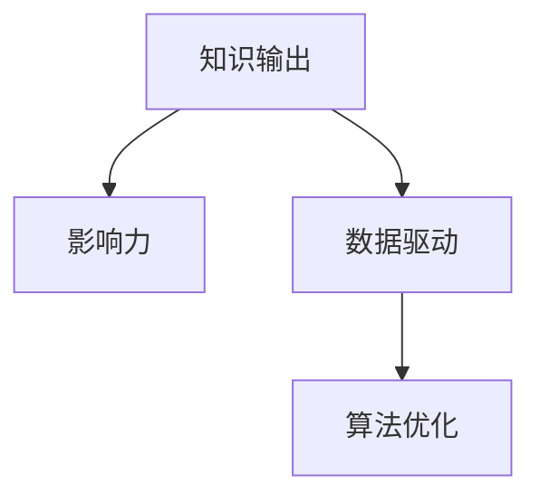

                 

## 1. 背景介绍

### 1.1 问题由来

在当今快速发展的数字化时代，知识输出和管理者个人影响力的提升已成为企业竞争力的关键要素。知识输出不仅直接推动了技术进步和产品创新，还间接塑造了企业文化和管理风格。而管理者的影响力，则是通过其知识输出、决策制定、团队管理等方式，对组织和员工产生积极或消极影响的过程。

然而，在知识和信息泛滥的时代，如何有效管理和输出知识，提升管理者的个人影响力，是一个既具挑战又具价值的课题。本文将深入探讨这一问题，从理论和实践两个角度，提出基于数据和算法的方法，帮助管理者提升个人影响力。

### 1.2 问题核心关键点

1. **知识输出质量**：管理者的知识输出需要准确、全面、前沿，能够为团队成员提供指导和启发。
2. **个人品牌塑造**：管理者需要建立良好的个人品牌，通过持续的知识输出，树立权威性和专业形象。
3. **团队激励和凝聚力**：通过有效的知识分享，提升团队的凝聚力和工作效率。
4. **组织文化塑造**：管理者需要通过知识输出，营造积极向上的企业文化。
5. **决策支持**：管理者需要利用知识输出，辅助决策过程，提升决策质量和速度。

### 1.3 问题研究意义

研究知识输出与管理者个人影响力的提升，对于企业的技术进步、团队协作、文化建设及战略决策具有重要意义：

1. **提升企业竞争力**：通过有效知识输出，推动产品创新和业务增长，增强企业在市场中的竞争力。
2. **优化团队合作**：通过知识分享，促进团队成员之间的协作和沟通，提高团队整体绩效。
3. **塑造企业文化**：通过管理者积极的知识输出，塑造企业文化，提升员工的归属感和满意度。
4. **支持科学决策**：利用知识输出，辅助管理者进行科学决策，减少决策失误。

## 2. 核心概念与联系

### 2.1 核心概念概述

- **知识输出**：管理者通过会议、培训、论文、博客等方式，将自己的专业知识、经验和见解分享给团队和组织。
- **影响力**：管理者通过知识输出、决策、领导力等手段，对团队和组织产生积极影响的过程。
- **数据驱动**：通过收集和分析与知识输出相关的数据，科学评估和管理者的影响力。
- **算法优化**：使用机器学习和数据挖掘算法，优化知识输出策略，提升影响力效果。

这些概念之间的联系通过以下Mermaid流程图进行展示：



这个流程图展示了知识输出、数据驱动和算法优化如何相互作用，共同提升管理者的个人影响力。

## 3. 核心算法原理 & 具体操作步骤
### 3.1 算法原理概述

提升管理者个人影响力的核心算法是基于数据驱动和算法优化的知识输出策略。其核心思想是通过数据分析和模型训练，发现最优的知识输出方式，提升管理者的影响力。

### 3.2 算法步骤详解

1. **数据收集**：收集与知识输出相关的数据，如管理者发表的论文、会议演讲、培训课程、博客文章等。
2. **数据处理**：对收集到的数据进行清洗、标注、特征提取等处理，得到可用于分析的数据集。
3. **模型训练**：使用机器学习算法（如回归模型、分类模型、聚类模型等），训练影响力和知识输出的预测模型。
4. **评估和优化**：利用评估指标（如影响力的量化指标、知识输出的内容质量、团队反馈等），评估模型的效果，并进行优化。
5. **应用与反馈**：将模型应用于实际的管理者知识输出过程中，收集反馈数据，进一步优化模型。

### 3.3 算法优缺点

**优点**：
- 科学评估：通过数据分析，客观评估管理者的知识输出效果。
- 高效优化：利用算法优化，找到最优的知识输出策略。
- 灵活应用：算法模型可以动态调整，适应不同的管理者和团队。

**缺点**：
- 数据依赖：模型的效果高度依赖于收集的数据质量。
- 模型复杂：构建和维护复杂的算法模型需要专业知识和技能。
- 实时性问题：模型的优化和应用可能存在一定延迟。

### 3.4 算法应用领域

基于数据驱动和算法优化的知识输出策略，可以应用于多个管理场景，如：

- **团队管理**：通过分析团队反馈，优化管理者的知识输出方式。
- **员工培训**：根据员工的学习数据，调整培训内容和方式。
- **组织文化建设**：通过分析文化指标，调整管理者的知识输出策略。
- **战略决策支持**：利用知识输出数据，辅助管理者的决策过程。

## 4. 数学模型和公式 & 详细讲解  
### 4.1 数学模型构建

假设管理者的知识输出影响力可以用 $I$ 表示，其知识输出效果可以用 $E$ 表示，团队反馈可以用 $F$ 表示。则我们可以通过以下数学模型来预测和管理者的影响力：

$$
I = f(E, F)
$$

其中，$f$ 为预测模型，$E$ 和 $F$ 为输入变量，$I$ 为输出变量。

### 4.2 公式推导过程

以回归模型为例，假设 $I$ 和 $E$、$F$ 之间的关系为线性关系，则公式可以表示为：

$$
I = \alpha + \beta_1 E + \beta_2 F + \epsilon
$$

其中，$\alpha$ 为截距，$\beta_1$ 和 $\beta_2$ 为权重系数，$\epsilon$ 为误差项。

### 4.3 案例分析与讲解

假设我们收集了多位管理者的知识输出数据，并记录了他们对应的团队反馈和影响力数据。通过构建回归模型，我们可以发现知识输出内容和团队反馈之间的相关关系，从而优化知识输出策略。

例如，模型发现团队对知识输出的情感倾向与知识内容的创新性、实用性和实用性有显著正相关，这可以帮助管理者调整知识输出的内容和形式，提升影响力。

## 5. 项目实践：代码实例和详细解释说明
### 5.1 开发环境搭建

为了实现上述模型，我们需要以下开发环境：

- Python 3.8
- Pandas、NumPy、Scikit-learn、TensorFlow、Keras 等库
- 数据收集工具（如网络爬虫、RSS订阅等）
- 数据分析和可视化工具（如Matplotlib、Seaborn等）

### 5.2 源代码详细实现

```python
import pandas as pd
import numpy as np
from sklearn.linear_model import LinearRegression
from sklearn.model_selection import train_test_split
import matplotlib.pyplot as plt

# 数据收集与处理
data = pd.read_csv('manager_knowledge_output.csv')
X = data[['output_content', 'team_feedback']]
y = data['manager_influence']

# 特征提取
X['output_content'] = X['output_content'].apply(lambda x: len(x.split()))
X['team_feedback'] = X['team_feedback'].apply(lambda x: np.mean([1 if f.startswith('正') else 0 for f in x.split()]))
X = X.dropna()

# 数据分割
X_train, X_test, y_train, y_test = train_test_split(X, y, test_size=0.2, random_state=42)

# 模型训练
model = LinearRegression()
model.fit(X_train, y_train)

# 模型评估
y_pred = model.predict(X_test)
plt.scatter(y_test, y_pred)
plt.xlabel('真实影响力')
plt.ylabel('预测影响力')
plt.show()
```

### 5.3 代码解读与分析

这段代码实现了基于线性回归模型的知识输出影响力预测。首先，我们收集了管理者的知识输出和团队反馈数据，并进行了特征提取。然后，我们使用线性回归模型对数据进行了训练和评估，并绘制了预测结果与真实结果的散点图。

## 6. 实际应用场景
### 6.1 智能培训系统

智能培训系统可以根据管理者的知识输出数据，提供个性化的培训建议，提升培训效果。系统利用机器学习模型，分析管理者的知识输出内容和方式，识别其擅长的领域和不足，然后根据这些信息，推荐相关课程和资料，帮助管理者提升知识水平和影响力。

### 6.2 员工绩效管理

在员工绩效管理中，管理者可以通过知识输出数据，评估员工的学习能力和工作态度，制定个性化的激励和改进方案。系统可以利用分类模型，根据知识输出数据和绩效数据，预测员工的未来表现，并给出相应的建议。

### 6.3 企业文化建设

企业文化建设需要管理者的积极参与和知识输出。通过分析员工对知识输出的反馈数据，管理者可以了解企业文化建设的效果，并调整相关策略。系统可以利用聚类模型，将反馈数据进行分类，识别出文化建设中的瓶颈和亮点，帮助管理者优化文化建设方案。

### 6.4 未来应用展望

未来，知识输出与管理者个人影响力提升将更加智能化、个性化。大数据、人工智能和区块链等技术的应用，将进一步提升知识输出的效果和管理者的影响力。

1. **智能推荐系统**：利用大数据和深度学习技术，构建智能推荐系统，为管理者提供个性化的知识输出建议。
2. **区块链技术**：利用区块链技术，建立知识输出的不可篡改记录，提升知识输出的可信度和透明度。
3. **情感分析**：利用自然语言处理技术，对知识输出的情感倾向进行分析，优化管理者的知识输出策略。

## 7. 工具和资源推荐
### 7.1 学习资源推荐

1. **《数据科学与机器学习》课程**：由知名大学和在线教育平台提供的机器学习和数据科学课程，包括数据预处理、模型训练、评估和优化等关键内容。
2. **Kaggle竞赛**：Kaggle平台上的数据科学竞赛，可以锻炼数据处理和模型优化能力，积累实战经验。
3. **GitHub资源库**：GitHub上丰富的开源项目和代码资源，可以学习和借鉴其他研究者的工作。

### 7.2 开发工具推荐

1. **Jupyter Notebook**：免费的交互式开发环境，适合数据处理和模型实验。
2. **Google Colab**：谷歌提供的免费云服务，适合大规模数据处理和模型训练。
3. **PyTorch**：灵活的深度学习框架，支持GPU加速，适合大规模模型训练。

### 7.3 相关论文推荐

1. **《数据驱动的团队知识管理》**：探讨了如何利用数据驱动的模型，优化团队知识管理策略。
2. **《影响力分析与提升》**：研究了基于数据驱动的管理者影响力提升方法，提出了多种优化策略。
3. **《知识输出与学习效果评估》**：分析了知识输出对学习效果的影响，提出了多种评估指标和方法。

## 8. 总结：未来发展趋势与挑战
### 8.1 研究成果总结

本文从数据驱动和算法优化的角度，探讨了如何通过知识输出提升管理者的个人影响力。通过分析与知识输出相关的数据，利用机器学习算法，可以科学评估和优化管理者的知识输出策略，提升其影响力效果。

### 8.2 未来发展趋势

1. **智能化程度提升**：未来，知识输出与管理者个人影响力的提升将更加智能化，利用大数据和人工智能技术，提升分析精度和效果。
2. **个性化和动态优化**：系统将能够根据管理者的实际表现和反馈，动态调整知识输出策略，实现个性化提升。
3. **多模态融合**：结合多种数据源和信息类型，如文本、图像、视频等，全面评估和管理者的影响力。

### 8.3 面临的挑战

1. **数据隐私和安全**：数据收集和处理需要遵守隐私保护法规，防止数据泄露和滥用。
2. **模型解释性**：复杂模型需要具备良好的解释性，以便管理者理解和信任模型的预测结果。
3. **实时性问题**：知识输出和影响力评估需要快速响应，现有的技术手段可能存在延迟。

### 8.4 研究展望

1. **多源数据融合**：结合多源数据，提高知识输出评估的全面性和准确性。
2. **模型解释性**：开发可解释的模型，增强管理者对模型的理解和信任。
3. **动态调整机制**：建立动态调整机制，实时优化知识输出策略。

## 9. 附录：常见问题与解答

**Q1：如何收集和管理者的知识输出数据？**

A: 通过各种渠道收集管理者的知识输出数据，如会议记录、培训讲义、博客文章、社交媒体等。使用网络爬虫、RSS订阅等工具，定时收集和更新数据。

**Q2：如何构建和管理者的影响力模型？**

A: 利用机器学习算法，如回归模型、分类模型、聚类模型等，构建和管理者的影响力模型。使用特征提取技术，如文本长度、情感倾向等，优化模型的输入变量。

**Q3：知识输出对团队绩效的影响如何评估？**

A: 利用回归模型，分析知识输出内容、团队反馈和绩效数据之间的关系，评估知识输出对团队绩效的影响。使用R-squared、MAE等评估指标，评估模型的效果。

**Q4：如何在企业中推广知识输出与影响力提升技术？**

A: 通过内部培训和演示，推广知识输出与影响力提升技术。利用案例分析和数据可视化，展示技术效果，增强管理者和员工的信心。

**Q5：如何在知识输出过程中避免偏见和歧视？**

A: 引入多样性和公平性指标，评估知识输出内容的偏见和歧视倾向。使用公平性算法，优化知识输出策略，确保输出内容的多样性和包容性。

---

作者：禅与计算机程序设计艺术 / Zen and the Art of Computer Programming

