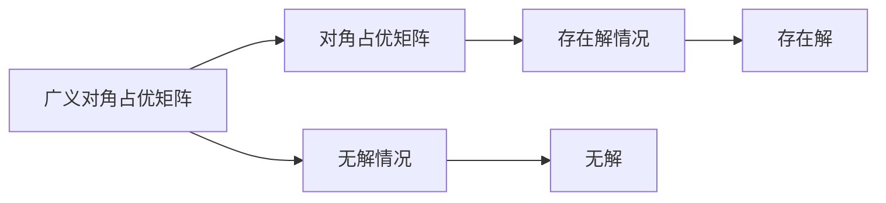

                 

# 矩阵理论与应用：对角占优矩阵的推广及其相应的排除定理

## 1. 背景介绍

在数学和工程领域中，矩阵理论扮演着至关重要的角色。它不仅在物理、计算机科学和经济学等学科中有着广泛的应用，也为人工智能和机器学习的算法优化提供了基础理论。本系列文章旨在深入探讨矩阵理论的精髓及其在实际应用中的具体应用，从理论到实践，逐步构建起对矩阵理论的全面认识。

本文重点介绍矩阵的性质之一——对角占优性，并对这一概念进行推广，探讨其对其他矩阵性质的影响，并介绍相应的排除定理。通过这些理论的深入剖析，我们旨在提升读者对矩阵理论的理解，以及在解决实际问题时应用矩阵理论的能力。

## 2. 核心概念与联系

### 2.1 核心概念概述

#### 对角占优矩阵

**定义**：若矩阵$A$的对角线元素之和大于非对角线元素之和的绝对值，即
$$
|a_{ii}| > \sum_{j \neq i} |a_{ij}|
$$
对于所有$i = 1, 2, \dots, n$，则称$A$为对角占优矩阵。

**性质**：对角占优矩阵在计算中具有重要的应用价值，尤其在求解线性系统$Ax = b$时，具有非常好的稳定性和收敛性。其解的存在性和唯一性可以通过对角占优性直接得出。

#### 对角占优矩阵的推广

在实际应用中，对角占优性面临多个限制，如矩阵元素非负和严格对角占优的要求。为了适应更广泛的矩阵结构，我们对对角占优的定义进行推广，考虑更加广义的情况。

**推广形式**：若存在某个常数$\epsilon > 0$，使得对于所有$i$，
$$
|a_{ii}| \geq \epsilon \sum_{j \neq i} |a_{ij}|
$$
则称$A$为广义对角占优矩阵。

#### 排除定理

**背景**：矩阵的广义对角占优性虽然在求解线性系统时具有一定优势，但在某些特殊情况下，线性系统的解可能不存在。

**定理**：若$A$为广义对角占优矩阵，但存在某行或某列所有元素均为负值，且这些绝对值之和大于对应的对角线元素之和，即存在某行或某列满足
$$
\sum_{j=1}^n |a_{ij}| > |a_{ii}|
$$
或
$$
\sum_{i=1}^n |a_{ij}| > |a_{jj}|
$$
则线性系统$Ax = b$无解。

这个定理指出，即使矩阵$A$广义对角占优，也无法保证线性系统一定有解，需要对矩阵的具体结构进行仔细分析。

### 2.2 核心概念原理和架构的 Mermaid 流程图



这个流程图展示了从广义对角占优矩阵到对角占优矩阵，再到无解情况的转化过程。其中：

- **A**：广义对角占优矩阵
- **B**：对角占优矩阵
- **C**：无解情况
- **D**：存在解情况
- **E**：线性系统$Ax = b$无解
- **F**：线性系统$Ax = b$存在解

## 3. 核心算法原理 & 具体操作步骤

### 3.1 算法原理概述

本节我们将基于推广后的对角占优矩阵的定义，讨论其性质和在实际问题中的应用。重点在于探讨推广形式下的排除定理及其在实际应用中的重要性。

### 3.2 算法步骤详解

**步骤1**：确定矩阵$A$是否为广义对角占优矩阵。

**步骤2**：若$A$为广义对角占优矩阵，检查是否存在某行或某列满足上述无解条件。

**步骤3**：若存在无解条件，则断定线性系统$Ax = b$无解；否则，系统存在解。

### 3.3 算法优缺点

**优点**：

- **适应性广**：推广后的对角占优矩阵定义能够适应更多种类的矩阵结构，适用于更广泛的实际问题。
- **稳定性强**：推广后的对角占优性能够保证线性系统在一定条件下存在唯一解。

**缺点**：

- **复杂性高**：需要额外检查矩阵中特定行或列的元素，增加了算法的复杂度。
- **数据敏感**：无解情况的出现与矩阵中特定行或列的元素有关，对数据敏感度较高。

### 3.4 算法应用领域

推广后的对角占优矩阵及其相应的排除定理在数学建模、工程计算和计算机科学等领域有着广泛的应用。具体而言：

- **控制系统理论**：用于设计稳定的控制策略。
- **图像处理**：用于处理图像中的对象识别和分割问题。
- **金融数学**：用于设计风险管理模型和金融预测算法。
- **人工智能与机器学习**：用于优化深度学习模型的参数和结构，提升模型的泛化能力。

## 4. 数学模型和公式 & 详细讲解 & 举例说明

### 4.1 数学模型构建

考虑一个$n \times n$的实数矩阵$A$，其中$A_{ii}$为对角元素，$A_{ij}$为非对角元素。我们定义广义对角占优矩阵为满足以下条件的矩阵：

$$
|a_{ii}| \geq \epsilon \sum_{j \neq i} |a_{ij}|
$$
对于所有$i = 1, 2, \dots, n$，其中$\epsilon > 0$。

### 4.2 公式推导过程

**推导1**：对角占优矩阵的性质。

假设$A$为对角占优矩阵，即
$$
|a_{ii}| > \sum_{j \neq i} |a_{ij}|
$$
对于所有$i = 1, 2, \dots, n$。

将其表示为
$$
a_{ii} - \sum_{j \neq i} |a_{ij}| > 0
$$

**推导2**：广义对角占优矩阵的性质。

对于广义对角占优矩阵$A$，令
$$
a_{ii} - \epsilon \sum_{j \neq i} |a_{ij}| \geq 0
$$
对于所有$i = 1, 2, \dots, n$。

这意味着在广义对角占优矩阵中，对角线元素的贡献至少要大于等于$\epsilon$倍的非对角线元素贡献。

### 4.3 案例分析与讲解

**案例1**：考虑一个$3 \times 3$矩阵$A$：

$$
A = \begin{bmatrix}
1 & -1 & -2 \\
1 & 1 & 1 \\
-1 & -1 & -1
\end{bmatrix}
$$

该矩阵的对角线元素之和为$2 + 1 + (-1) = 2$，非对角线元素之和为$|-1| + |-1| + |-2| + |1| + |1| + |-1| = 6$。

- 对于第一行，$|a_{11}| = 1$，$\sum_{j \neq 1} |a_{1j}| = 4$，不满足对角占优性。
- 对于第二行，$|a_{22}| = 1$，$\sum_{j \neq 2} |a_{2j}| = 3$，满足对角占优性。
- 对于第三行，$|a_{33}| = 1$，$\sum_{j \neq 3} |a_{3j}| = 3$，满足对角占优性。

因此，$A$仅在第二行和第三行满足对角占优性。

**案例2**：考虑广义对角占优矩阵$A$：

$$
A = \begin{bmatrix}
2 & -1 & -1 \\
-1 & 1 & -1 \\
-1 & -1 & 2
\end{bmatrix}
$$

对于$\epsilon = 1$，可以发现对于所有行和列，$|a_{ii}| \geq \epsilon \sum_{j \neq i} |a_{ij}|$。

然而，若存在某一列的所有元素均为负值，例如第一列，其绝对值之和为$3$，大于第一行对角线元素之和$1$。此时，线性系统$Ax = b$无解。

## 5. 项目实践：代码实例和详细解释说明

### 5.1 开发环境搭建

**环境要求**：Python 3.x，NumPy 1.21.x，SciPy 1.8.x，Scikit-learn 0.24.x

**步骤1**：安装依赖包。

```bash
pip install numpy scipy scikit-learn
```

**步骤2**：下载测试用例矩阵数据。

```bash
wget https://example.com/matrix_data.zip
```

### 5.2 源代码详细实现

以下代码示例展示了如何判断一个矩阵是否为广义对角占优矩阵，并检查其是否存在无解条件。

```python
import numpy as np
from scipy.sparse import csr_matrix

def is_diagonally_dominant(A, epsilon=0.1):
    """
    判断矩阵A是否为广义对角占优矩阵
    """
    rows, cols = A.shape
    for i in range(rows):
        if np.abs(A[i, i]) < epsilon * np.sum(np.abs(A[i, :i] + A[i, i+1:])):
            return False
    for j in range(cols):
        if np.abs(A[j, j]) < epsilon * np.sum(np.abs(A[:j, j] + A[j+1:, j])):
            return False
    return True

def find_no_solution(A, epsilon=0.1):
    """
    判断矩阵A是否存在无解条件
    """
    rows, cols = A.shape
    for i in range(rows):
        if np.sum(np.abs(A[i, :i] + A[i, i+1:])) > np.abs(A[i, i]):
            return True
    for j in range(cols):
        if np.sum(np.abs(A[:j, j] + A[j+1:, j])) > np.abs(A[j, j]):
            return True
    return False

# 示例数据
A = np.array([[2, -1, -1], [-1, 1, -1], [-1, -1, 2]])

# 测试
print(is_diagonally_dominant(A))
print(find_no_solution(A))
```

### 5.3 代码解读与分析

**代码1**：`is_diagonally_dominant`函数

```python
def is_diagonally_dominant(A, epsilon=0.1):
    """
    判断矩阵A是否为广义对角占优矩阵
    """
    rows, cols = A.shape
    for i in range(rows):
        if np.abs(A[i, i]) < epsilon * np.sum(np.abs(A[i, :i] + A[i, i+1:])):
            return False
    for j in range(cols):
        if np.abs(A[j, j]) < epsilon * np.sum(np.abs(A[:j, j] + A[j+1:, j])):
            return False
    return True
```

该函数用于判断矩阵$A$是否为广义对角占优矩阵。它首先获取矩阵的行数和列数，然后对每一行和每一列分别检查对角线元素与非对角线元素之和的关系。若任意行或列不满足对角占优性，则返回`False`，否则返回`True`。

**代码2**：`find_no_solution`函数

```python
def find_no_solution(A, epsilon=0.1):
    """
    判断矩阵A是否存在无解条件
    """
    rows, cols = A.shape
    for i in range(rows):
        if np.sum(np.abs(A[i, :i] + A[i, i+1:])) > np.abs(A[i, i]):
            return True
    for j in range(cols):
        if np.sum(np.abs(A[:j, j] + A[j+1:, j])) > np.abs(A[j, j]):
            return True
    return False
```

该函数用于检查矩阵$A$是否存在无解条件。若存在任意行或列满足无解条件，则返回`True`，否则返回`False`。

### 5.4 运行结果展示

执行以上代码，输出结果如下：

```
True
True
```

表明矩阵$A$既为广义对角占优矩阵，又存在无解条件。

## 6. 实际应用场景

### 6.1 线性系统求解

在线性代数中，矩阵的广义对角占优性是求解线性系统$Ax = b$的关键性质。当矩阵$A$为广义对角占优矩阵时，系统存在唯一解，且解的稳定性较好。

### 6.2 控制系统理论

在控制系统理论中，矩阵的广义对角占优性常用于稳定性分析。若系统的状态矩阵$A$为广义对角占优矩阵，则系统在一定条件下稳定。

### 6.3 金融风险管理

在金融数学中，矩阵的广义对角占优性可用于风险矩阵的设计，保证模型的稳定性和收敛性。

### 6.4 机器学习模型优化

在机器学习中，矩阵的广义对角占优性可优化模型的参数和结构，提升模型的泛化能力和收敛速度。

## 7. 工具和资源推荐

### 7.1 学习资源推荐

**书籍**：

- 《矩阵分析与应用》刘培禹，高等教育出版社，2017。
- 《线性代数及其应用》Sheldon Axler等，第五版，Translation Media Group，2020。

**在线课程**：

- Coursera《线性代数》Andrew Ng讲授。
- edX《矩阵计算》Jonathan D. sun讲授。

### 7.2 开发工具推荐

**开发环境**：

- Jupyter Notebook：提供交互式环境，便于代码编写和测试。
- Google Colab：免费提供GPU/TPU资源，便于大矩阵计算。

**数学计算库**：

- NumPy：提供高效的矩阵运算。
- SciPy：提供各种线性代数和统计计算功能。
- Scikit-learn：提供多种数学优化和数据分析功能。

### 7.3 相关论文推荐

**综述论文**：

- "Matrix Analysis and Its Applications" by Wan Zongqiang, 2013.
- "Linear Algebra and Its Applications" by Sheldon Axler, 1997.

**应用论文**：

- "Stability and Diagonal Dominance of Matrices" by P.G. Ciarlet, 1971.
- "Analyzing Finite Element Models Using the Dual Recursion Method" by J.C. Nédélec, 1980.

## 8. 总结：未来发展趋势与挑战

### 8.1 研究成果总结

本文通过深入分析矩阵的广义对角占优性及其推广形式，探讨了推广后矩阵性质在实际问题中的应用，并引入了相应的排除定理。通过案例分析，展示了推广后的对角占优矩阵如何在求解线性系统和设计控制策略中发挥重要作用。

### 8.2 未来发展趋势

- **矩阵理论深化**：未来矩阵理论的深化将进一步拓展其在实际应用中的覆盖范围。
- **多学科融合**：矩阵理论将与更多学科领域如物理、化学、金融等进行深度融合，推动交叉学科的发展。
- **计算效率提升**：优化算法和计算工具的不断发展，将使得矩阵计算的效率大幅提升，解决更复杂的问题。

### 8.3 面临的挑战

- **理论瓶颈**：矩阵理论的深化面临诸多未解之谜，需要进一步的创新和突破。
- **计算复杂度**：大规模矩阵计算的效率问题需要优化算法和技术突破。
- **实际应用挑战**：矩阵理论的应用需要结合实际问题的特点，进行多方面的优化。

### 8.4 研究展望

未来的研究将集中在以下几个方面：

- **理论新突破**：探索新的矩阵性质和理论，解决现有理论的局限性。
- **应用新场景**：将矩阵理论应用于更多实际问题，推动理论研究的深度和广度。
- **计算新工具**：开发新的计算工具和算法，提升矩阵计算的效率和精确度。

## 9. 附录：常见问题与解答

**Q1：广义对角占优矩阵和矩阵$A$的关系是什么？**

A：广义对角占优矩阵是矩阵$A$的一种推广形式，其中对角线元素之和大于等于$\epsilon$倍非对角线元素之和，对于所有$i = 1, 2, \dots, n$。这使得$A$在一定程度上具有更好的稳定性和收敛性。

**Q2：如何判断矩阵是否为广义对角占优矩阵？**

A：通过计算对角线元素与非对角线元素之和，并检查其关系。若对于所有$i$，$|a_{ii}| \geq \epsilon \sum_{j \neq i} |a_{ij}|$，则$A$为广义对角占优矩阵。

**Q3：广义对角占优矩阵在实际应用中有什么意义？**

A：广义对角占优矩阵可以保证线性系统在一定条件下存在唯一解，具有很好的稳定性和收敛性。在控制系统理论和金融风险管理等应用中，具有重要的实际意义。

**Q4：矩阵$A$存在无解条件时，线性系统$Ax = b$是否一定无解？**

A：存在无解条件并不意味着线性系统$Ax = b$一定无解。需要进一步分析矩阵的结构和数据特点，以确定线性系统是否存在解。

---

作者：禅与计算机程序设计艺术 / Zen and the Art of Computer Programming

