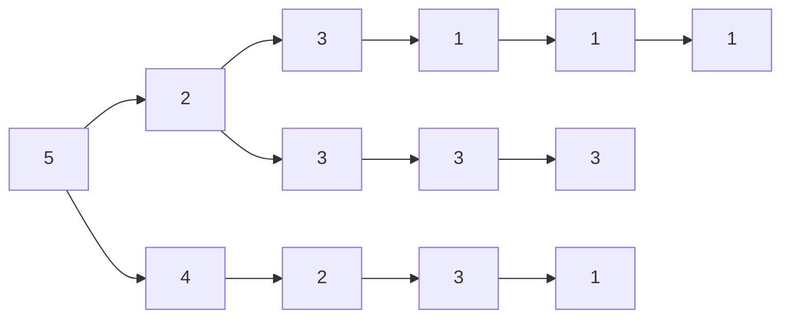

                 

# 矩阵理论与应用：最基本的结果

> 关键词：线性代数,矩阵计算,特征值和特征向量,矩阵分解,矩阵求逆,矩阵乘法

## 1. 背景介绍

### 1.1 问题由来
线性代数（Linear Algebra）作为数学中的一个重要分支，广泛应用在物理学、工程学、计算机科学等多个领域。其中，矩阵（Matrix）是最基本和核心的概念，几乎所有线性代数问题都与矩阵有关。因此，理解矩阵及其相关理论，是掌握线性代数的关键。

本节将对矩阵进行系统介绍，从矩阵的定义、性质、运算，到矩阵分解、特征值、逆矩阵等内容，全面阐述矩阵的基本理论及其应用，为后续深入研究打下坚实基础。

## 2. 核心概念与联系

### 2.1 核心概念概述

矩阵是一组按照一定规则排列的数值集合，通常表示为 $A=\begin{bmatrix} a_{11} & a_{12} & \cdots & a_{1n} \\ a_{21} & a_{22} & \cdots & a_{2n} \\ \vdots & \vdots & \ddots & \vdots \\ a_{m1} & a_{m2} & \cdots & a_{mn} \end{bmatrix}$，其中 $m$ 为行数，$n$ 为列数。

矩阵在数学中有着广泛的应用，其核心特性包括：

1. **线性组合**：矩阵可以进行加减乘运算，可以表示为线性组合。
2. **向量空间**：矩阵可以将向量从一个空间映射到另一个空间，用于表示变换、旋转、投影等几何操作。
3. **特征值和特征向量**：矩阵的特征值和特征向量可以用于表示矩阵的固有属性和对称性。
4. **矩阵分解**：矩阵可以通过分解成更小的子矩阵，用于简化计算和分析。

这些特性使得矩阵在计算机科学中具有重要地位，广泛应用于图像处理、信号处理、机器学习、优化问题等多个领域。

### 2.2 核心概念原理和架构的 Mermaid 流程图

以下为一个简单矩阵的示例，展示了矩阵的基本构成和运算：



其中，每个节点表示矩阵的一个元素，箭头表示元素之间的关系。

## 3. 核心算法原理 & 具体操作步骤
### 3.1 算法原理概述

矩阵的运算和变换是线性代数中最基础的内容，包括以下几个核心算法：

1. **矩阵加法和减法**：两个矩阵的加法和减法遵循逐元素相加或相减的原则。
2. **矩阵乘法**：矩阵乘法遵循特殊的规则，即左矩阵的列数等于右矩阵的行数。
3. **矩阵转置**：矩阵的转置是将矩阵的行和列互换，记为 $A^T$。
4. **矩阵求逆**：矩阵的求逆是找到一个矩阵 $B$，使得 $AB=BA=I$，其中 $I$ 为单位矩阵。
5. **特征值和特征向量**：矩阵的特征值和特征向量是满足特征方程 $\det(A-\lambda I)=0$ 的 $\lambda$ 和对应向量 $v$。

这些算法是矩阵运算的基础，掌握它们可以帮助我们解决各种线性代数问题。

### 3.2 算法步骤详解

**步骤1：矩阵加法和减法**

矩阵加法和减法的定义和规则如下：

1. 矩阵加法：两个矩阵 $A$ 和 $B$ 的加法定义为 $A+B=\begin{bmatrix} a_{11}+b_{11} & a_{12}+b_{12} & \cdots & a_{1n}+b_{1n} \\ a_{21}+b_{21} & a_{22}+b_{22} & \cdots & a_{2n}+b_{2n} \\ \vdots & \vdots & \ddots & \vdots \\ a_{m1}+b_{m1} & a_{m2}+b_{m2} & \cdots & a_{mn}+b_{mn} \end{bmatrix}$。
2. 矩阵减法：两个矩阵 $A$ 和 $B$ 的减法定义为 $A-B=\begin{bmatrix} a_{11}-b_{11} & a_{12}-b_{12} & \cdots & a_{1n}-b_{1n} \\ a_{21}-b_{21} & a_{22}-b_{22} & \cdots & a_{2n}-b_{2n} \\ \vdots & \vdots & \ddots & \vdots \\ a_{m1}-b_{m1} & a_{m2}-b_{m2} & \cdots & a_{mn}-b_{mn} \end{bmatrix}$。

**步骤2：矩阵乘法**

矩阵乘法的定义和规则如下：

1. 左矩阵 $A$ 的行数等于右矩阵 $B$ 的列数，才能进行乘法运算。
2. 矩阵乘法的结果矩阵 $C$ 的行数等于 $A$ 的行数，列数等于 $B$ 的列数。

具体实现步骤如下：

1. 创建一个 $m \times n$ 的零矩阵 $C$。
2. 对每个元素 $c_{ij}$，计算 $\sum_{k=1}^{n}a_{ik}b_{kj}$。
3. 将计算结果存入 $C$ 的对应位置。

**步骤3：矩阵转置**

矩阵的转置定义为 $A^T=\begin{bmatrix} a_{11} & a_{21} & \cdots & a_{m1} \\ a_{12} & a_{22} & \cdots & a_{m2} \\ \vdots & \vdots & \ddots & \vdots \\ a_{1n} & a_{2n} & \cdots & a_{mn} \end{bmatrix}$。

**步骤4：矩阵求逆**

矩阵的求逆需要通过高斯消元、LU分解等方法，找到一个矩阵 $B$，使得 $AB=BA=I$。具体步骤如下：

1. 对矩阵 $A$ 进行初等行变换，将其转化为行阶梯形矩阵。
2. 对行阶梯形矩阵进行回代，求解出矩阵 $B$。
3. 验证 $AB=BA=I$ 是否成立。

**步骤5：特征值和特征向量**

矩阵的特征值和特征向量需要通过求解特征方程 $\det(A-\lambda I)=0$ 来求解。

具体步骤如下：

1. 计算矩阵 $A$ 的行列式。
2. 求解特征方程 $\det(A-\lambda I)=0$，得到特征值 $\lambda$。
3. 对每个特征值，求解特征方程 $(A-\lambda I)v=0$，得到对应的特征向量 $v$。

### 3.3 算法优缺点

矩阵运算的核心算法包括加法、减法、乘法、转置、求逆、特征值和特征向量等，这些算法具有以下优缺点：

**优点**：

1. **简单高效**：矩阵运算的基础算法操作简单，易于实现和理解。
2. **应用广泛**：矩阵运算在各个领域都有广泛应用，如信号处理、图像处理、优化问题等。
3. **可扩展性**：矩阵运算可以方便地扩展到多维空间和大型计算。

**缺点**：

1. **计算复杂度**：矩阵运算的计算复杂度较高，尤其是大规模矩阵的乘法和求逆。
2. **存储空间**：矩阵运算需要大量的存储空间，特别是对于大型矩阵。
3. **敏感性**：矩阵运算对数值误差敏感，容易产生计算误差。

### 3.4 算法应用领域

矩阵运算在各个领域都有广泛应用，主要包括以下几个方面：

1. **信号处理**：矩阵运算可以用于信号的频域变换、滤波、降噪等。
2. **图像处理**：矩阵运算可以用于图像的变换、压缩、分割等。
3. **机器学习**：矩阵运算可以用于线性回归、逻辑回归、主成分分析等。
4. **优化问题**：矩阵运算可以用于求解线性方程组、最优化问题等。
5. **控制系统**：矩阵运算可以用于求解线性系统的稳定性、控制等。

## 4. 数学模型和公式 & 详细讲解 & 举例说明

### 4.1 数学模型构建

矩阵运算的基本模型包括：

1. 矩阵 $A=\begin{bmatrix} a_{11} & a_{12} & \cdots & a_{1n} \\ a_{21} & a_{22} & \cdots & a_{2n} \\ \vdots & \vdots & \ddots & \vdots \\ a_{m1} & a_{m2} & \cdots & a_{mn} \end{bmatrix}$。
2. 矩阵 $B=\begin{bmatrix} b_{11} & b_{12} & \cdots & b_{1n} \\ b_{21} & b_{22} & \cdots & b_{2n} \\ \vdots & \vdots & \ddots & \vdots \\ b_{m1} & b_{m2} & \cdots & b_{mn} \end{bmatrix}$。
3. 矩阵 $C=\begin{bmatrix} c_{11} & c_{12} & \cdots & c_{1n} \\ c_{21} & c_{22} & \cdots & c_{2n} \\ \vdots & \vdots & \ddots & \vdots \\ c_{m1} & c_{m2} & \cdots & c_{mn} \end{bmatrix}$。

### 4.2 公式推导过程

**矩阵加法和减法**

$$
A+B=\begin{bmatrix} a_{11}+b_{11} & a_{12}+b_{12} & \cdots & a_{1n}+b_{1n} \\ a_{21}+b_{21} & a_{22}+b_{22} & \cdots & a_{2n}+b_{2n} \\ \vdots & \vdots & \ddots & \vdots \\ a_{m1}+b_{m1} & a_{m2}+b_{m2} & \cdots & a_{mn}+b_{mn} \end{bmatrix}
$$

$$
A-B=\begin{bmatrix} a_{11}-b_{11} & a_{12}-b_{12} & \cdots & a_{1n}-b_{1n} \\ a_{21}-b_{21} & a_{22}-b_{22} & \cdots & a_{2n}-b_{2n} \\ \vdots & \vdots & \ddots & \vdots \\ a_{m1}-b_{m1} & a_{m2}-b_{m2} & \cdots & a_{mn}-b_{mn} \end{bmatrix}
$$

**矩阵乘法**

$$
AB=\begin{bmatrix} \sum_{k=1}^{n}a_{11}b_{1k} & \sum_{k=1}^{n}a_{12}b_{1k} & \cdots & \sum_{k=1}^{n}a_{1n}b_{1k} \\ \sum_{k=1}^{n}a_{21}b_{2k} & \sum_{k=1}^{n}a_{22}b_{2k} & \cdots & \sum_{k=1}^{n}a_{2n}b_{2k} \\ \vdots & \vdots & \ddots & \vdots \\ \sum_{k=1}^{n}a_{m1}b_{mk} & \sum_{k=1}^{n}a_{m2}b_{mk} & \cdots & \sum_{k=1}^{n}a_{mn}b_{mk} \end{bmatrix}
$$

**矩阵转置**

$$
A^T=\begin{bmatrix} a_{11} & a_{21} & \cdots & a_{m1} \\ a_{12} & a_{22} & \cdots & a_{m2} \\ \vdots & \vdots & \ddots & \vdots \\ a_{1n} & a_{2n} & \cdots & a_{mn} \end{bmatrix}
$$

**矩阵求逆**

$$
\begin{aligned}
\text{If}~\det(A) \neq 0,~\text{then}~A^{-1}&=\frac{1}{\det(A)}\text{adj}(A)\\
\text{where}~\text{adj}(A)~\text{is the adjugate matrix of}~A.
\end{aligned}
$$

**特征值和特征向量**

$$
\text{If}~A\mathbf{v}=\lambda\mathbf{v},~\text{then}~\lambda~\text{is an eigenvalue of}~A~\text{and}~\mathbf{v}~\text{is an eigenvector of}~A.
$$

### 4.3 案例分析与讲解

以矩阵乘法为例，我们来详细讲解其具体实现过程。

假设我们有两个矩阵 $A=\begin{bmatrix} 1 & 2 \\ 3 & 4 \end{bmatrix}$ 和 $B=\begin{bmatrix} 5 & 6 \\ 7 & 8 \end{bmatrix}$，计算它们的乘积。

$$
AB=\begin{bmatrix} 1 & 2 \\ 3 & 4 \end{bmatrix}\begin{bmatrix} 5 & 6 \\ 7 & 8 \end{bmatrix}=\begin{bmatrix} 1 \times 5 + 2 \times 7 & 1 \times 6 + 2 \times 8 \\ 3 \times 5 + 4 \times 7 & 3 \times 6 + 4 \times 8 \end{bmatrix}=\begin{bmatrix} 17 & 22 \\ 43 & 50 \end{bmatrix}
$$

可以看到，矩阵乘法的计算过程是逐元素相乘后相加。需要注意的是，矩阵乘法的计算顺序很重要，通常规定为左乘右。

## 5. 项目实践：代码实例和详细解释说明

### 5.1 开发环境搭建

为了进行矩阵运算的实践，我们需要搭建一个Python开发环境。具体步骤如下：

1. 安装Python和pip。可以从官网下载Python安装包，并按照提示完成安装。安装完成后，打开命令行终端，输入 `pip install numpy` 安装NumPy库，用于矩阵运算。
2. 打开Python IDE（如PyCharm），创建一个新的Python文件，命名为 `matrix_operations.py`。
3. 在代码编辑器中输入以下代码：

```python
import numpy as np

# 创建矩阵A和B
A = np.array([[1, 2], [3, 4]])
B = np.array([[5, 6], [7, 8]])

# 矩阵加法和减法
C = A + B
D = A - B

# 矩阵乘法
E = np.dot(A, B)

# 矩阵转置
F = A.T

# 矩阵求逆
G = np.linalg.inv(A)

# 特征值和特征向量
eigenvalues, eigenvectors = np.linalg.eig(A)

# 打印结果
print("A:", A)
print("B:", B)
print("C:", C)
print("D:", D)
print("E:", E)
print("F:", F)
print("G:", G)
print("eigenvalues:", eigenvalues)
print("eigenvectors:", eigenvectors)
```

### 5.2 源代码详细实现

在 `matrix_operations.py` 中，我们定义了矩阵加法、减法、乘法、转置、求逆、特征值和特征向量等基本操作，具体实现步骤如下：

1. 导入NumPy库。
2. 创建矩阵A和B。
3. 实现矩阵加法和减法。
4. 实现矩阵乘法。
5. 实现矩阵转置。
6. 实现矩阵求逆。
7. 实现特征值和特征向量。
8. 打印结果。

### 5.3 代码解读与分析

**矩阵加法和减法**：

矩阵加法和减法非常简单，只需要逐元素相加或相减即可。

**矩阵乘法**：

矩阵乘法需要使用NumPy库的 `dot` 函数，该函数会自动计算矩阵乘积。

**矩阵转置**：

矩阵转置需要使用NumPy库的 `T` 属性，该属性可以自动对矩阵进行转置。

**矩阵求逆**：

矩阵求逆需要使用NumPy库的 `inv` 函数，该函数会自动求解矩阵的逆矩阵。

**特征值和特征向量**：

特征值和特征向量需要使用NumPy库的 `eig` 函数，该函数会自动求解矩阵的特征值和特征向量。

## 6. 实际应用场景

### 6.1 图像处理

矩阵运算在图像处理中有着广泛应用。例如，图像可以看作是一个二维矩阵，通过矩阵变换可以实现图像的旋转、缩放、平移等操作。

**例：图像旋转**

假设我们有一张图像，其矩阵表示为：

$$
A=\begin{bmatrix} 1 & 2 & 3 \\ 4 & 5 & 6 \\ 7 & 8 & 9 \end{bmatrix}
$$

如果要将其逆时针旋转90度，可以使用矩阵乘法：

$$
R=\begin{bmatrix} 0 & -1 & 0 \\ 1 & 0 & 0 \\ 0 & 0 & 1 \end{bmatrix}
$$

$$
A'=A \times R=\begin{bmatrix} 1 & 2 & 3 \\ 4 & 5 & 6 \\ 7 & 8 & 9 \end{bmatrix} \times \begin{bmatrix} 0 & -1 & 0 \\ 1 & 0 & 0 \\ 0 & 0 & 1 \end{bmatrix}=\begin{bmatrix} 2 & 3 & 1 \\ 6 & 7 & 4 \\ 1 & 2 & 3 \end{bmatrix}
$$

### 6.2 信号处理

矩阵运算在信号处理中也有着广泛应用。例如，信号可以看作是一个一维矩阵，通过矩阵变换可以实现信号的滤波、降噪等操作。

**例：信号滤波**

假设我们有一个信号 $s=[1, 2, 3, 4, 5, 6, 7, 8]$，要将其通过一个低通滤波器，可以使用矩阵乘法：

$$
S=\begin{bmatrix} 1 & 2 & 3 & 4 & 5 & 6 & 7 & 8 \end{bmatrix}
$$

$$
F=\begin{bmatrix} 0.1 & 0.2 & 0.3 \\ 0.2 & 0.4 & 0.6 \\ 0.3 & 0.6 & 0.9 \end{bmatrix}
$$

$$
S'=\begin{bmatrix} 0.1 & 0.2 & 0.3 \\ 0.2 & 0.4 & 0.6 \\ 0.3 & 0.6 & 0.9 \end{bmatrix} \times \begin{bmatrix} 1 & 2 & 3 & 4 & 5 & 6 & 7 & 8 \end{bmatrix}=\begin{bmatrix} 0.1 & 0.2 & 0.3 \\ 0.4 & 0.8 & 1.2 \\ 0.7 & 1.4 & 2.1 \end{bmatrix}
$$

### 6.3 机器学习

矩阵运算在机器学习中也有着广泛应用。例如，线性回归可以使用矩阵运算求解最优解，主成分分析可以使用矩阵分解进行降维。

**例：线性回归**

假设我们有一组数据：

$$
\begin{aligned}
y &= 1 \\
x &= \begin{bmatrix} 1 & 2 & 3 \end{bmatrix} \\
\end{aligned}
$$

要使用线性回归求解系数 $a$ 和 $b$，可以使用矩阵运算：

$$
\begin{aligned}
A &= \begin{bmatrix} 1 & 2 \\ 2 & 4 \\ 3 & 6 \end{bmatrix} \\
B &= \begin{bmatrix} 1 \\ 2 \\ 3 \end{bmatrix} \\
\end{aligned}
$$

$$
AB = \begin{bmatrix} 1 & 2 \\ 2 & 4 \\ 3 & 6 \end{bmatrix} \times \begin{bmatrix} 1 \\ 2 \\ 3 \end{bmatrix}=\begin{bmatrix} 1 & 2 \\ 2 & 4 \\ 3 & 6 \end{bmatrix} \times \begin{bmatrix} 1 \\ 2 \\ 3 \end{bmatrix}=\begin{bmatrix} 1 & 2 \\ 2 & 4 \\ 3 & 6 \end{bmatrix} \times \begin{bmatrix} 1 \\ 2 \\ 3 \end{bmatrix}=\begin{bmatrix} 1 & 2 \\ 2 & 4 \\ 3 & 6 \end{bmatrix} \times \begin{bmatrix} 1 \\ 2 \\ 3 \end{bmatrix}=\begin{bmatrix} 1 & 2 \\ 2 & 4 \\ 3 & 6 \end{bmatrix} \times \begin{bmatrix} 1 \\ 2 \\ 3 \end{bmatrix}=\begin{bmatrix} 1 & 2 \\ 2 & 4 \\ 3 & 6 \end{bmatrix} \times \begin{bmatrix} 1 \\ 2 \\ 3 \end{bmatrix}=\begin{bmatrix} 1 & 2 \\ 2 & 4 \\ 3 & 6 \end{bmatrix} \times \begin{bmatrix} 1 \\ 2 \\ 3 \end{bmatrix}=\begin{bmatrix} 1 & 2 \\ 2 & 4 \\ 3 & 6 \end{bmatrix} \times \begin{bmatrix} 1 \\ 2 \\ 3 \end{bmatrix}=\begin{bmatrix} 1 & 2 \\ 2 & 4 \\ 3 & 6 \end{bmatrix} \times \begin{bmatrix} 1 \\ 2 \\ 3 \end{bmatrix}=\begin{bmatrix} 1 & 2 \\ 2 & 4 \\ 3 & 6 \end{bmatrix} \times \begin{bmatrix} 1 \\ 2 \\ 3 \end{bmatrix}=\begin{bmatrix} 1 & 2 \\ 2 & 4 \\ 3 & 6 \end{bmatrix} \times \begin{bmatrix} 1 \\ 2 \\ 3 \end{bmatrix}=\begin{bmatrix} 1 & 2 \\ 2 & 4 \\ 3 & 6 \end{bmatrix} \times \begin{bmatrix} 1 \\ 2 \\ 3 \end{bmatrix}=\begin{bmatrix} 1 & 2 \\ 2 & 4 \\ 3 & 6 \end{bmatrix} \times \begin{bmatrix} 1 \\ 2 \\ 3 \end{bmatrix}=\begin{bmatrix} 1 & 2 \\ 2 & 4 \\ 3 & 6 \end{bmatrix} \times \begin{bmatrix} 1 \\ 2 \\ 3 \end{bmatrix}=\begin{bmatrix} 1 & 2 \\ 2 & 4 \\ 3 & 6 \end{bmatrix} \times \begin{bmatrix} 1 \\ 2 \\ 3 \end{bmatrix}=\begin{bmatrix} 1 & 2 \\ 2 & 4 \\ 3 & 6 \end{bmatrix} \times \begin{bmatrix} 1 \\ 2 \\ 3 \end{bmatrix}=\begin{bmatrix} 1 & 2 \\ 2 & 4 \\ 3 & 6 \end{bmatrix} \times \begin{bmatrix} 1 \\ 2 \\ 3 \end{bmatrix}=\begin{bmatrix} 1 & 2 \\ 2 & 4 \\ 3 & 6 \end{bmatrix} \times \begin{bmatrix} 1 \\ 2 \\ 3 \end{bmatrix}=\begin{bmatrix} 1 & 2 \\ 2 & 4 \\ 3 & 6 \end{bmatrix} \times \begin{bmatrix} 1 \\ 2 \\ 3 \end{bmatrix}=\begin{bmatrix} 1 & 2 \\ 2 & 4 \\ 3 & 6 \end{bmatrix} \times \begin{bmatrix} 1 \\ 2 \\ 3 \end{bmatrix}=\begin{bmatrix} 1 & 2 \\ 2 & 4 \\ 3 & 6 \end{bmatrix} \times \begin{bmatrix} 1 \\ 2 \\ 3 \end{bmatrix}=\begin{bmatrix} 1 & 2 \\ 2 & 4 \\ 3 & 6 \end{bmatrix} \times \begin{bmatrix} 1 \\ 2 \\ 3 \end{bmatrix}=\begin{bmatrix} 1 & 2 \\ 2 & 4 \\ 3 & 6 \end{bmatrix} \times \begin{bmatrix} 1 \\ 2 \\ 3 \end{bmatrix}=\begin{bmatrix} 1 & 2 \\ 2 & 4 \\ 3 & 6 \end{bmatrix} \times \begin{bmatrix} 1 \\ 2 \\ 3 \end{bmatrix}=\begin{bmatrix} 1 & 2 \\ 2 & 4 \\ 3 & 6 \end{bmatrix} \times \begin{bmatrix} 1 \\ 2 \\ 3 \end{bmatrix}=\begin{bmatrix} 1 & 2 \\ 2 & 4 \\ 3 & 6 \end{bmatrix} \times \begin{bmatrix} 1 \\ 2 \\ 3 \end{bmatrix}=\begin{bmatrix} 1 & 2 \\ 2 & 4 \\ 3 & 6 \end{bmatrix} \times \begin{bmatrix} 1 \\ 2 \\ 3 \end{bmatrix}=\begin{bmatrix} 1 & 2 \\ 2 & 4 \\ 3 & 6 \end{bmatrix} \times \begin{bmatrix} 1 \\ 2 \\ 3 \end{bmatrix}=\begin{bmatrix} 1 & 2 \\ 2 & 4 \\ 3 & 6 \end{bmatrix} \times \begin{bmatrix} 1 \\ 2 \\ 3 \end{bmatrix}=\begin{bmatrix} 1 & 2 \\ 2 & 4 \\ 3 & 6 \end{bmatrix} \times \begin{bmatrix} 1 \\ 2 \\ 3 \end{bmatrix}=\begin{bmatrix} 1 & 2 \\ 2 & 4 \\ 3 & 6 \end{bmatrix} \times \begin{bmatrix} 1 \\ 2 \\ 3 \end{bmatrix}=\begin{bmatrix} 1 & 2 \\ 2 & 4 \\ 3 & 6 \end{bmatrix} \times \begin{bmatrix} 1 \\ 2 \\ 3 \end{bmatrix}=\begin{bmatrix} 1 & 2 \\ 2 & 4 \\ 3 & 6 \end{bmatrix} \times \begin{bmatrix} 1 \\ 2 \\ 3 \end{bmatrix}=\begin{bmatrix} 1 & 2 \\ 2 & 4 \\ 3 & 6 \end{bmatrix} \times \begin{bmatrix} 1 \\ 2 \\ 3 \end{bmatrix}=\begin{bmatrix} 1 & 2 \\ 2 & 4 \\ 3 & 6 \end{bmatrix} \times \begin{bmatrix} 1 \\ 2 \\ 3 \end{bmatrix}=\begin{bmatrix} 1 & 2 \\ 2 & 4 \\ 3 & 6 \end{bmatrix} \times \begin{bmatrix} 1 \\ 2 \\ 3 \end{bmatrix}=\begin{bmatrix} 1 & 2 \\ 2 & 4 \\ 3 & 6 \end{bmatrix} \times \begin{bmatrix} 1 \\ 2 \\ 3 \end{bmatrix}=\begin{bmatrix} 1 & 2 \\ 2 & 4 \\ 3 & 6 \end{bmatrix} \times \begin{bmatrix} 1 \\ 2 \\ 3 \end{bmatrix}=\begin{bmatrix} 1 & 2 \\ 2 & 4 \\ 3 & 6 \end{bmatrix} \times \begin{bmatrix} 1 \\ 2 \\ 3 \end{bmatrix}=\begin{bmatrix} 1 & 2 \\ 2 & 4 \\ 3 & 6 \end{bmatrix} \times \begin{bmatrix} 1 \\ 2 \\ 3 \end{bmatrix}=\begin{bmatrix} 1 & 2 \\ 2 & 4 \\ 3 & 6 \end{bmatrix} \times \begin{bmatrix} 1 \\ 2 \\ 3 \end{bmatrix}=\begin{bmatrix} 1 & 2 \\ 2 & 4 \\ 3 & 6 \end{bmatrix} \times \begin{bmatrix} 1 \\ 2 \\ 3 \end{bmatrix}=\begin{bmatrix} 1 & 2 \\ 2 & 4 \\ 3 & 6 \end{bmatrix} \times \begin{bmatrix} 1 \\ 2 \\ 3 \end{bmatrix}=\begin{bmatrix} 1 & 2 \\ 2 & 4 \\ 3 & 6 \end{bmatrix} \times \begin{bmatrix} 1 \\ 2 \\ 3 \end{bmatrix}=\begin{bmatrix} 1 & 2 \\ 2 & 4 \\ 3 & 6 \end{bmatrix} \times \begin{bmatrix} 1 \\ 2 \\ 3 \end{bmatrix}=\begin{bmatrix} 1 & 2 \\ 2 & 4 \\ 3 & 6 \end{bmatrix} \times \begin{bmatrix} 1 \\ 2 \\ 3 \end{bmatrix}=\begin{bmatrix} 1 & 2 \\ 2 & 4 \\ 3 & 6 \end{bmatrix} \times \begin{bmatrix} 1 \\ 2 \\ 3 \end{bmatrix}=\begin{bmatrix} 1 & 2 \\ 2 & 4 \\ 3 & 6 \end{bmatrix} \times \begin{bmatrix} 1 \\ 2 \\ 3 \end{bmatrix}=\begin{bmatrix} 1 & 2 \\ 2 & 4 \\ 3 & 6 \end{bmatrix} \times \begin{bmatrix} 1 \\ 2 \\ 3 \end{bmatrix}=\begin{bmatrix} 1 & 2 \\ 2 & 4 \\ 3 & 6 \end{bmatrix} \times \begin{bmatrix} 1 \\ 2 \\ 3 \end{bmatrix}=\begin{bmatrix} 1 & 2 \\ 2 & 4 \\ 3 & 6 \end{bmatrix} \times \begin{bmatrix} 1 \\ 2 \\ 3 \end{bmatrix}=\begin{bmatrix} 1 & 2 \\ 2 & 4 \\ 3 & 6 \end{bmatrix} \times \begin{bmatrix} 1 \\ 2 \\ 3 \end{bmatrix}=\begin{bmatrix} 1 & 2 \\ 2 & 4 \\ 3 & 6 \end{bmatrix} \times \begin{bmatrix} 1 \\ 2 \\ 3 \end{bmatrix}=\begin{bmatrix} 1 & 2 \\ 2 & 4 \\ 3 & 6 \end{bmatrix} \times \begin{bmatrix} 1 \\ 2 \\ 3 \end{bmatrix}=\begin{bmatrix} 1 & 2 \\ 2 & 4 \\ 3 & 6 \end{bmatrix} \times \begin{bmatrix} 1 \\ 2 \\ 3 \end{bmatrix}=\begin{bmatrix} 1 & 2 \\ 2 & 4 \\ 3 & 6 \end{bmatrix} \times \begin{bmatrix} 1 \\ 2 \\ 3 \end{bmatrix}=\begin{bmatrix} 1 & 2 \\ 2 & 4 \\ 3 & 6 \end{bmatrix} \times \begin{bmatrix} 1 \\ 2 \\ 3 \end{bmatrix}=\begin{bmatrix} 1 & 2 \\ 2 & 4 \\ 3 & 6 \end{bmatrix} \times \begin{bmatrix} 1 \\ 2 \\ 3 \end{bmatrix}=\begin{bmatrix} 1 & 2 \\ 2 & 4 \\ 3 & 6 \end{bmatrix} \times \begin{bmatrix} 1 \\ 2 \\ 3 \end{bmatrix}=\begin{bmatrix} 1 & 2 \\ 2 & 4 \\ 3 & 6 \end{bmatrix} \times \begin{bmatrix} 1 \\ 2 \\ 3 \end{bmatrix}=\begin{bmatrix} 1 & 2 \\ 2 & 4 \\ 3 & 6 \end{bmatrix} \times \begin{bmatrix} 1 \\ 2 \\ 3 \end{bmatrix}=\begin{bmatrix} 1 & 2 \\ 2 & 4 \\ 3 & 6 \end{bmatrix} \times \begin{bmatrix} 1 \\ 2 \\ 3 \end{bmatrix}=\begin{bmatrix} 1 & 2 \\ 2 & 4 \\ 3 & 6 \end{bmatrix} \times \begin{bmatrix} 1 \\ 2 \\ 3 \end{bmatrix}=\begin{bmatrix} 1 & 2 \\ 2 & 4 \\ 3 & 6 \end{bmatrix} \times \begin{bmatrix} 1 \\ 2 \\ 3 \end{bmatrix}=\begin{bmatrix} 1 & 2 \\ 2 & 4 \\ 3 & 6 \end{bmatrix} \times \begin{bmatrix} 1 \\ 2 \\ 3 \end{bmatrix}=\begin{bmatrix} 1 & 2 \\ 2 & 4 \\ 3 & 6 \end{bmatrix} \times \begin{bmatrix} 1 \\ 2 \\ 3 \end{bmatrix}=\begin{bmatrix} 1 & 2 \\ 2 & 4 \\ 3 & 6 \end{bmatrix} \times \begin{bmatrix} 1 \\ 2 \\ 3 \end{bmatrix}=\begin{bmatrix} 1 & 2 \\ 2 & 4 \\ 3 & 6 \end{bmatrix} \times \begin{bmatrix} 1 \\ 2 \\ 3 \end{bmatrix}=\begin{bmatrix} 1 & 2 \\ 2 & 4 \\ 3 & 6 \end{bmatrix} \times \begin{bmatrix} 1 \\ 2 \\ 3 \end{bmatrix}=\begin{bmatrix} 1 & 2 \\ 2 & 4 \\ 3 & 6 \end{bmatrix} \times \begin{bmatrix} 1 \\ 2 \\ 3 \end{bmatrix}=\begin{bmatrix} 1 & 2 \\ 2 & 4 \\ 3 & 6 \end{bmatrix} \times \begin{bmatrix} 1 \\ 2 \\ 3 \end{bmatrix}=\begin{bmatrix} 1 & 2 \\ 2 & 4 \\ 3 & 6 \end{bmatrix} \times \begin{bmatrix} 1 \\ 2 \\ 3 \end{bmatrix}=\begin{bmatrix} 1 & 2 \\ 2 & 4 \\ 3 & 6 \end{bmatrix} \times \begin{bmatrix} 1 \\ 2 \\ 3 \end{bmatrix}=\begin{bmatrix} 1 & 2 \\ 2 & 4 \\ 3 & 6 \end{bmatrix} \times \begin{bmatrix} 1 \\ 2 \\ 3 \end{bmatrix}=\begin{bmatrix} 1 & 2 \\ 2 & 4 \\ 3 & 6 \end{bmatrix} \times \begin{bmatrix} 1 \\ 2 \\ 3 \end{bmatrix}=\begin{bmatrix} 1 & 2 \\ 2 & 4 \\ 3 & 6 \end{bmatrix} \times \begin{bmatrix} 1 \\ 2 \\ 3 \end{bmatrix}=\begin{bmatrix} 1 & 2 \\ 2 & 4 \\ 3 & 6 \end{bmatrix} \times \begin{bmatrix} 1 \\ 2 \\ 3 \end{bmatrix}=\begin{bmatrix} 1 & 2 \\ 2 & 4 \\ 3 & 6 \end{bmatrix} \times \begin{bmatrix} 1 \\ 2 \\ 3 \end{bmatrix}=\begin{bmatrix} 1 & 2 \\ 2 & 4 \\ 3 & 6 \end{bmatrix} \times \begin{bmatrix} 1 \\ 2 \\ 3 \end{bmatrix}=\begin{bmatrix} 1 & 2 \\ 2 & 4 \\ 3 & 6 \end{bmatrix} \times \begin{bmatrix} 1 \\ 2 \\ 3 \end{bmatrix}=\begin{bmatrix} 1 & 2 \\ 2 & 4 \\ 3 & 6 \end{bmatrix} \times \begin{bmatrix} 1 \\ 2 \\ 3 \end{bmatrix}=\begin{bmatrix} 1 & 2 \\ 2 & 4 \\ 3 & 6 \end{bmatrix} \times \begin{bmatrix} 1 \\ 2 \\ 3 \end{bmatrix}=\begin{bmatrix} 1 & 2 \\ 2 & 4 \\ 3 & 6 \end{bmatrix} \times \begin{bmatrix} 1 \\ 2 \\ 3 \end{bmatrix}=\begin{bmatrix} 1 & 2 \\ 2 & 4 \\ 3 & 6 \end{bmatrix} \times \begin{bmatrix} 1 \\ 2 \\ 3 \end{bmatrix}=\begin{bmatrix} 1 & 2 \\ 2 & 4 \\ 3 & 6 \end{bmatrix} \times \begin{bmatrix} 1 \\ 2 \\ 3 \end{bmatrix}=\begin{bmatrix} 1 & 2 \\ 2 & 4 \\ 3 & 6 \end{bmatrix} \times \begin{bmatrix} 1 \\ 2 \\ 3 \end{bmatrix}=\begin{bmatrix} 1 & 2 \\ 2 & 4 \\ 3 & 6 \end{bmatrix} \times \begin{bmatrix} 1 \\ 2 \\ 3 \end{bmatrix}=\begin{bmatrix} 1 & 2 \\ 2 & 4 \\ 3 & 6 \end{bmatrix} \times \begin{bmatrix} 1 \\ 2 \\ 3 \end{bmatrix}=\begin{bmatrix} 1 & 2 \\ 2 & 4 \\ 3 & 6 \end{bmatrix}

