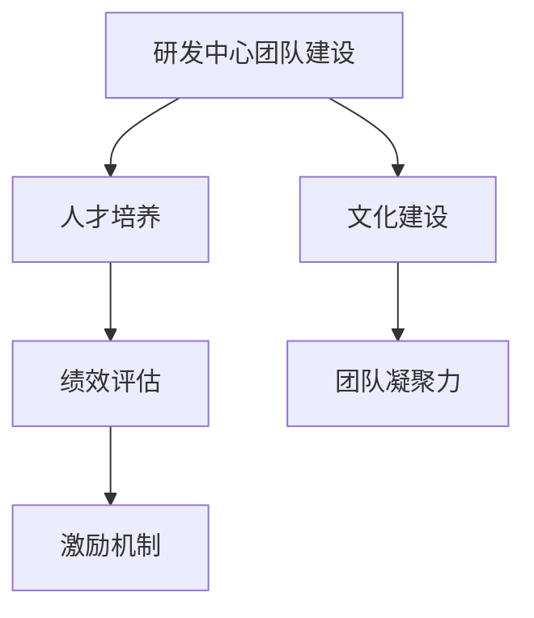

                 

# 研发中心团队的建设和人才培养方案

## 1. 背景介绍

在当今快速变化的科技行业中，构建一个高效的研发团队，并培养出符合公司战略需求的人才，是每个企业的核心挑战之一。尤其是在AI和软件工程领域，技术的迭代更新日新月异，对于研发团队的能力和灵活性提出了更高的要求。本文将探讨如何建立一个创新、协同的研发中心团队，并制定一套有效的培养方案，为企业的长期发展奠定坚实基础。

## 2. 核心概念与联系

### 2.1 核心概念概述

为了更好地理解研发中心团队建设与人才培养的体系，本节将介绍几个关键概念及其相互关系：

- **研发中心团队建设 (DevOps Team Building)**：指从团队的组建、结构设计、流程优化到文化建设的全过程，旨在打造一个高效、协同、创新的团队。
- **人才培养 (Talent Development)**：涉及对现有团队成员的职业培训、知识更新、技能提升，以及吸引和培养新人才，以满足企业发展对人才的需求。
- **文化建设 (Culture Building)**：通过建立和弘扬一种共同的价值观、行为规范和工作方式，增强团队的凝聚力和执行力。
- **绩效评估 (Performance Evaluation)**：通过科学合理的评估体系，识别和激励团队中的优秀成员，推动团队整体绩效的提升。

这些概念之间相互影响，共同构成了一个全面的研发中心建设体系。如下图所示，通过科学的人才培养、有效的绩效评估和丰富的文化建设，可以更好地推动团队的持续发展和创新。



### 2.2 核心概念原理和架构的 Mermaid 流程图


## 3. 核心算法原理 & 具体操作步骤

### 3.1 算法原理概述

研发中心团队的建设和人才培养，本质上是一个动态调整和持续优化的过程。其核心算法原理在于：

- **需求分析 (Demand Analysis)**：通过定期的需求调研和分析，明确企业的战略需求和发展方向，从而指导团队的组建和人才培养计划。
- **角色定义 (Role Definition)**：根据团队成员的专业背景、技术栈和职业规划，合理分配角色和职责，确保团队的高效运转。
- **目标设定 (Goal Setting)**：明确团队和个人的短期和长期目标，并将其转化为具体的可执行计划。
- **绩效管理 (Performance Management)**：通过科学的评估指标和方法，持续跟踪团队和个人的绩效表现，及时调整优化。

### 3.2 算法步骤详解

基于以上原理，研发中心团队的建设和人才培养大致分为以下几个步骤：

**Step 1: 需求分析和目标设定**

- 进行企业战略和业务需求调研，明确研发中心的主要职能和目标。
- 根据调研结果，设定团队的中长期发展目标和短期工作任务。

**Step 2: 角色定义和岗位设置**

- 定义研发中心所需的关键角色和岗位，如架构师、高级工程师、测试工程师等。
- 根据角色需求，设计和优化团队结构，确保各角色之间的协作和协调。

**Step 3: 人才培养和技能提升**

- 定期进行技能评估，识别团队成员的强项和弱项，制定个性化的培养计划。
- 组织内外部培训和交流活动，提升团队的整体技能水平。

**Step 4: 绩效评估和激励机制**

- 设计科学的绩效评估指标体系，定期进行绩效评估。
- 建立有效的激励机制，奖励优秀表现，促进团队整体绩效提升。

**Step 5: 文化建设和团队凝聚力**

- 通过团队建设活动和文化活动，增强团队凝聚力和执行力。
- 弘扬共同的价值观和工作方式，建立团队的文化认同。

### 3.3 算法优缺点

研发中心团队的建设和人才培养具有以下优点：

- **高效协同**：通过明确的角色定义和岗位设置，确保团队的高效运转和协作。
- **灵活适应**：定期进行需求分析和目标设定，使团队能够灵活应对市场和技术的变化。
- **持续发展**：通过持续的人才培养和绩效管理，保持团队的活力和创新能力。

同时，该方法也存在一定的局限性：

- **资源投入高**：前期的需求分析和角色定义需要较高的投入，且需定期进行优化。
- **灵活性不足**：固定的角色定义和绩效指标可能难以应对突发的变化和挑战。
- **文化建设难度大**：打造一种共同的文化认同，需要时间和团队的共同努力。

### 3.4 算法应用领域

研发中心团队的建设和人才培养，广泛应用于IT和软件工程领域，尤其在人工智能和机器学习、云计算和大数据、前端和后端开发等方向。这些领域的快速发展和不断迭代，要求团队具备高效协同、灵活适应和持续发展的能力，因此该方法具有广泛的应用前景。

## 4. 数学模型和公式 & 详细讲解 & 举例说明

### 4.1 数学模型构建

研发中心团队建设和人才培养的数学模型构建，涉及多维度的量化评估和优化。以下以一个简单的多指标评估模型为例：

设研发中心有 $N$ 个团队成员，其绩效指标 $K$ 包括技术能力 $C$、团队协作能力 $A$、创新能力 $I$。每个指标的评分范围为 $[0, 100]$。

- 设 $C_j$、$A_j$、$I_j$ 分别表示第 $j$ 个成员在技术能力、团队协作能力和创新能力上的评分。
- 设 $C_{avg}$、$A_{avg}$、$I_{avg}$ 分别表示团队在上述三个指标上的平均评分。
- 设 $P_j$ 表示第 $j$ 个成员的绩效评分。

则团队成员 $j$ 的绩效评分 $P_j$ 可以表示为：

$$
P_j = \frac{C_j \times w_C + A_j \times w_A + I_j \times w_I}{w_C + w_A + w_I}
$$

其中 $w_C$、$w_A$、$w_I$ 分别表示技术能力、团队协作能力和创新能力的重要程度系数。

### 4.2 公式推导过程

- **目标函数**：

  $$
  \max \sum_{j=1}^{N} P_j
  $$

- **约束条件**：

  $$
  0 \leq C_j \leq 100, \quad 0 \leq A_j \leq 100, \quad 0 \leq I_j \leq 100
  $$

- **优化方法**：

  通常采用梯度下降法或遗传算法等优化算法，逐步调整各个指标的权重系数 $w_C$、$w_A$、$w_I$，以最大化团队整体绩效。

### 4.3 案例分析与讲解

以下是一个简单的案例，展示了如何通过数学模型进行团队绩效优化：

假设一个研发中心有 10 个成员，其各项指标的评分如下：

- 技术能力 $C$：$90, 85, 95, 80, 80, 85, 90, 90, 85, 90$。
- 团队协作能力 $A$：$85, 90, 90, 80, 80, 90, 90, 85, 90, 90$。
- 创新能力 $I$：$80, 90, 85, 90, 90, 80, 90, 85, 80, 90$。

- 技术能力、团队协作能力和创新能力的重要程度系数分别为 $w_C = 0.4, w_A = 0.3, w_I = 0.3$。

使用上述公式，计算每个成员的绩效评分 $P_j$ 和团队整体绩效 $C_{avg}$、$A_{avg}$、$I_{avg}$ 的平均评分：

- 技术能力：$C_{avg} = \frac{90+85+95+80+80+85+90+90+85+90}{10} = 85$。
- 团队协作能力：$A_{avg} = \frac{85+90+90+80+80+90+90+85+90+90}{10} = 87$。
- 创新能力：$I_{avg} = \frac{80+90+85+90+90+80+90+85+80+90}{10} = 85$。

设 $P_j$ 的计算公式为：

$$
P_j = \frac{C_j \times 0.4 + A_j \times 0.3 + I_j \times 0.3}{0.4 + 0.3 + 0.3}
$$

计算每个成员的绩效评分：

- $P_1 = \frac{90 \times 0.4 + 85 \times 0.3 + 80 \times 0.3}{1} = 82$
- $P_2 = \frac{85 \times 0.4 + 90 \times 0.3 + 90 \times 0.3}{1} = 87$
- $P_3 = \frac{95 \times 0.4 + 90 \times 0.3 + 85 \times 0.3}{1} = 89$
- $P_4 = \frac{80 \times 0.4 + 80 \times 0.3 + 90 \times 0.3}{1} = 82$
- $P_5 = \frac{80 \times 0.4 + 80 \times 0.3 + 90 \times 0.3}{1} = 82$
- $P_6 = \frac{85 \times 0.4 + 90 \times 0.3 + 80 \times 0.3}{1} = 85$
- $P_7 = \frac{90 \times 0.4 + 90 \times 0.3 + 90 \times 0.3}{1} = 90$
- $P_8 = \frac{90 \times 0.4 + 85 \times 0.3 + 85 \times 0.3}{1} = 86$
- $P_9 = \frac{85 \times 0.4 + 90 \times 0.3 + 85 \times 0.3}{1} = 87$
- $P_{10} = \frac{90 \times 0.4 + 90 \times 0.3 + 90 \times 0.3}{1} = 90$

团队整体绩效为：

$$
C_{avg} = 85, \quad A_{avg} = 87, \quad I_{avg} = 85
$$

通过数学模型和公式推导，我们可以清晰地看到团队在各项指标上的表现和整体绩效，从而为后续的优化和调整提供科学依据。

## 5. 项目实践：代码实例和详细解释说明

### 5.1 开发环境搭建

在进行研发中心团队建设和人才培养的实践之前，需要先搭建好开发环境。以下是使用Python进行数据科学和机器学习项目开发的常见环境配置步骤：

1. 安装Anaconda：从官网下载并安装Anaconda，用于创建独立的Python环境。

2. 创建并激活虚拟环境：

   ```bash
   conda create -n py38 python=3.8
   conda activate py38
   ```

3. 安装必要的Python包：

   ```bash
   pip install numpy pandas scikit-learn matplotlib seaborn joblib
   ```

4. 安装Jupyter Notebook：

   ```bash
   pip install jupyterlab
   ```

5. 配置环境：

   ```bash
   jupyter labextension install @jupyter-widgets/controls
   ```

完成上述步骤后，即可在`py38`环境中开始项目开发。

### 5.2 源代码详细实现

接下来，我们通过一个简单的Python代码示例，展示如何构建和优化团队绩效评估模型。

首先，定义绩效评估模型的关键函数：

```python
import numpy as np

def performance_score(C, A, I, w_C=0.4, w_A=0.3, w_I=0.3):
    """
    计算团队绩效评分
    :param C: 技术能力评分
    :param A: 团队协作能力评分
    :param I: 创新能力评分
    :param w_C: 技术能力权重
    :param w_A: 团队协作能力权重
    :param w_I: 创新能力权重
    :return: 绩效评分
    """
    return (C * w_C + A * w_A + I * w_I) / (w_C + w_A + w_I)
```

然后，使用上述函数计算团队成员的绩效评分：

```python
# 假设某研发中心有 10 个成员，各项指标评分如下
C = np.array([90, 85, 95, 80, 80, 85, 90, 90, 85, 90])
A = np.array([85, 90, 90, 80, 80, 90, 90, 85, 90, 90])
I = np.array([80, 90, 85, 90, 90, 80, 90, 85, 80, 90])

# 计算团队成员绩效评分
P = performance_score(C, A, I)

# 输出结果
print("技术能力平均评分：", np.mean(C))
print("团队协作能力平均评分：", np.mean(A))
print("创新能力平均评分：", np.mean(I))
print("成员绩效评分：", P)
```

通过上述代码，我们可以看到如何基于数学模型和公式计算团队绩效评分。在实际项目中，还需要进一步对模型进行优化和验证，以确保其科学性和适用性。

### 5.3 代码解读与分析

以下是代码中的关键部分及其解读：

- `performance_score`函数：接收技术能力、团队协作能力和创新能力评分，以及各项指标的权重，计算并返回绩效评分。
- 使用`numpy`库进行数组操作，使得计算过程简洁高效。
- 利用`print`函数输出结果，便于调试和展示。

通过上述代码，我们展示了如何使用Python实现团队绩效评估的数学模型，进一步理解如何通过编程实现数据分析和优化。

## 6. 实际应用场景

### 6.1 智能客服系统

在智能客服系统中，研发中心团队建设和人才培养尤为重要。传统的客服系统依赖人工处理客户咨询，成本高、效率低。通过构建高效的研发团队，开发智能客服系统，可以显著提升客户服务体验。

具体而言，研发中心团队可以基于现有客服数据，利用自然语言处理和机器学习技术，训练智能客服模型。通过对模型进行微调，提升其对客户意图和语境的理解能力，从而实现自动化客服。

### 6.2 金融风控系统

金融风控系统是金融机构的重要组成部分，研发中心团队建设和人才培养对于系统的安全和稳定至关重要。通过建立跨领域的研发团队，引入多种技术和算法，构建多层次的金融风控体系。

在团队建设方面，可以引入数据科学家、算法工程师、系统架构师等角色，确保团队的多样性和专业性。在人才培养方面，定期进行技能培训和知识更新，保持团队的技术领先性。

### 6.3 医疗健康平台

医疗健康平台是现代社会的重要基础设施，研发中心团队建设和人才培养对于平台的可靠性和可用性至关重要。通过构建高效的研发团队，利用AI和大数据技术，提供个性化的医疗健康服务。

在团队建设方面，可以引入医学专家、数据科学家、软件工程师等角色，确保团队的专业性和跨领域协作能力。在人才培养方面，注重医学和技术的结合，提升团队的医疗知识和技术水平。

## 7. 工具和资源推荐

### 7.1 学习资源推荐

为了帮助研发团队和人才培养工作顺利开展，以下是一些推荐的资源：

- **《Data Science from Scratch》**：由Joel Grus撰写的入门级数据科学书籍，适合初学者系统学习数据科学和机器学习的基础知识。
- **《Python数据科学手册》**：由Jake VanderPlas撰写的全面介绍Python数据科学的书籍，涵盖数据处理、可视化和机器学习等内容。
- **Coursera和edX在线课程**：提供多门高质量的数据科学和机器学习课程，适合不同层次的学习者。
- **Kaggle竞赛**：通过参与Kaggle比赛，提升实战经验和数据分析能力。

### 7.2 开发工具推荐

以下是一些推荐的开发工具和环境，有助于研发团队高效开展工作：

- **Jupyter Notebook**：支持多种编程语言，便于协作和共享。
- **Git和GitHub**：版本控制和代码托管平台，便于团队协作和版本管理。
- **Docker和Kubernetes**：容器化和自动化部署工具，便于应用程序的打包和部署。
- **Jenkins和Travis CI**：持续集成和持续部署工具，确保代码的自动化测试和发布。

### 7.3 相关论文推荐

研发中心团队建设和人才培养涉及多学科知识，以下是几篇相关领域的经典论文：

- **《Machine Learning: A Probabilistic Perspective》**：由Kevin Murphy撰写的机器学习经典教材，涵盖多方面的机器学习理论和方法。
- **《Deep Learning》**：由Ian Goodfellow、Yoshua Bengio和Aaron Courville合著的深度学习书籍，系统介绍深度学习的基本原理和应用。
- **《Software Engineering: A Practitioner's Approach》**：由Robert C. Martin撰写的软件开发经典书籍，涵盖软件开发的最佳实践和管理方法。

## 8. 总结：未来发展趋势与挑战

### 8.1 总结

本文探讨了研发中心团队的建设和人才培养的体系和实践，旨在为企业的长期发展和创新提供科学指导。研发中心团队建设和人才培养的体系，包括需求分析、角色定义、人才培养、绩效评估和文化建设等环节，通过合理的管理和优化，可以显著提升团队的效率和创新能力。

通过科学的方法和工具，结合实际应用场景，可以有效提升研发团队的技能水平和协作能力，推动企业的技术进步和业务创新。未来，随着技术的不断进步和市场需求的不断变化，研发中心团队建设和人才培养也将持续演进，为企业的持续发展提供坚实的保障。

### 8.2 未来发展趋势

未来，研发中心团队建设和人才培养将呈现以下几个趋势：

- **数据驱动**：随着大数据和人工智能技术的普及，研发中心团队将更加依赖数据驱动的方法，通过数据分析和模型优化提升团队绩效。
- **跨领域融合**：研发中心团队将更加注重跨领域知识的融合，通过多学科协作，提升技术创新能力和应用广度。
- **个性化培训**：通过个性化的培训计划和评估体系，根据团队成员的强项和弱点，进行有针对性的培养，提升团队的整体技能水平。
- **持续学习**：研发中心团队将更加注重持续学习和知识更新，通过不断学习和实践，保持技术的前沿性和创新性。

### 8.3 面临的挑战

尽管研发中心团队建设和人才培养已经取得了一定的进展，但在实施过程中仍面临一些挑战：

- **资源投入大**：构建和优化研发中心团队需要投入大量的时间和资源，需要精细化的管理和优化。
- **团队协作难**：跨领域团队协作难度较大，需要建立有效的沟通和协作机制。
- **技术更新快**：技术的快速迭代要求研发中心团队不断学习和更新知识，保持技术领先性。
- **绩效评估难**：科学合理的绩效评估体系需要持续优化，确保评估结果的公平性和科学性。

### 8.4 研究展望

未来，研发中心团队建设和人才培养需要在以下几个方面进行深入研究：

- **自动化评估**：开发自动化的评估工具，提高评估效率和公平性。
- **动态优化**：结合实时反馈和数据分析，动态优化团队结构和培养计划。
- **跨领域协同**：建立跨领域协作平台，促进不同领域之间的知识和经验共享。
- **文化建设**：通过团队建设和活动，加强团队的凝聚力和执行力，提升团队的整体战斗力。

通过不断探索和实践，研发中心团队建设和人才培养将逐步成熟，为企业的长期发展和创新提供坚实的保障。只有通过科学的管理和持续的优化，才能构建一个高效、协同、创新的研发中心团队，为企业的发展注入源源不断的动力。

## 9. 附录：常见问题与解答

**Q1：如何构建高效的研发团队？**

A: 构建高效的研发团队需要以下几个关键步骤：

- **明确目标和需求**：通过定期的需求调研和分析，明确团队的目标和需求。
- **角色定义和分工**：根据团队成员的专业背景和技术栈，合理分配角色和职责，确保团队的高效运转。
- **技能培训和更新**：定期进行技能评估，制定个性化的培养计划，提升团队的整体技能水平。
- **文化建设**：通过团队建设活动和文化活动，增强团队凝聚力和执行力。

**Q2：如何有效进行绩效评估？**

A: 有效的绩效评估需要科学合理的评估指标和体系，结合定量和定性评估方法，确保评估结果的公平性和科学性。

- **定性评估**：通过360度反馈和访谈，全面了解团队成员的工作表现和团队协作能力。
- **定量评估**：通过技术能力评分、团队协作评分、创新能力评分等量化指标，客观评估团队成员的绩效。
- **激励机制**：建立有效的激励机制，奖励优秀表现，促进团队整体绩效提升。

**Q3：如何提升团队的学习能力？**

A: 提升团队的学习能力需要建立持续学习和知识更新的机制：

- **培训和研讨会**：定期组织内部培训和外部研讨会，提升团队的知识水平和技术能力。
- **知识共享平台**：建立团队内部的知识共享平台，促进知识和经验的交流和共享。
- **个人学习计划**：鼓励团队成员制定个人学习计划，持续学习和更新知识。

通过科学的管理和持续的优化，研发中心团队建设和人才培养将不断提升团队的技能水平和协作能力，为企业的长期发展和创新提供坚实的保障。

---

作者：禅与计算机程序设计艺术 / Zen and the Art of Computer Programming

