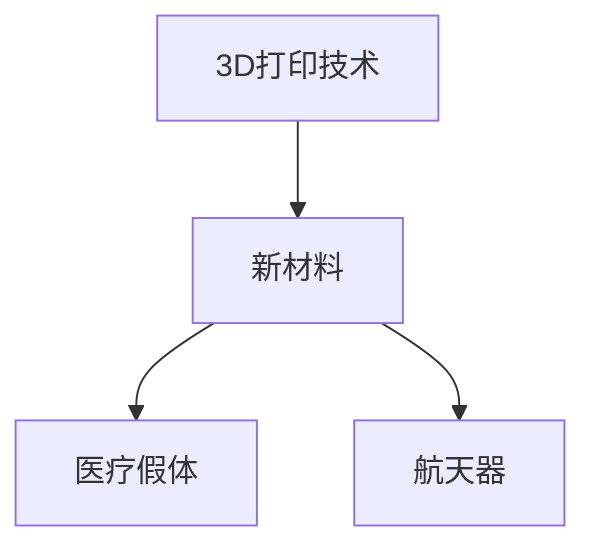

                 

# 硅谷3D打印新材料应用:医疗假体与航天

## 1. 背景介绍

随着3D打印技术的不断发展，硅谷等技术前沿地带已将3D打印新材料应用于医疗假体和航天器制造等领域。3D打印技术的兴起，不仅颠覆了传统制造工艺，也为材料科学带来了革命性的变化。

3D打印技术，即增材制造(Additive Manufacturing)，是一种快速原型制造和生产技术。与传统减材制造(Subtractive Manufacturing)不同，增材制造通过逐层堆积材料，实现复杂形状和精细结构的构建。3D打印的优势在于可以大幅缩短生产周期，减少材料浪费，降低生产成本。同时，3D打印还可以实现定制化生产，满足个性化的需求。

## 2. 核心概念与联系

### 2.1 核心概念概述

为了更好地理解3D打印新材料在医疗假体和航天器中的应用，本节将介绍几个密切相关的核心概念：

- **3D打印技术**：一种通过逐层堆积材料实现复杂几何结构的快速制造技术，广泛应用于原型设计、模具制造、医疗器械、航天器等领域。
- **新材料**：包括先进复合材料、生物相容材料、可降解材料等，用于提升3D打印件的性能和功能。
- **医疗假体**：用于替代人体缺失或损伤部位的假肢或植入物，需要具备良好的生物相容性和机械性能。
- **航天器**：卫星、飞船等航天器，需要具备轻质高强、耐高温高压、抗辐射等特殊性能。

这些核心概念之间的逻辑关系可以通过以下Mermaid流程图来展示：



这个流程图展示了大3D打印技术的应用场景：

1. 3D打印技术使用新材料，可以构建医疗假体和航天器等复杂结构。
2. 不同类型的3D打印新材料，适合不同的应用场景，如医疗假体需要生物相容材料，航天器需要高强高耐材料。

## 3. 核心算法原理 & 具体操作步骤

### 3.1 算法原理概述

3D打印新材料的应用，依赖于对材料性质的深入理解和对打印技术的精确控制。具体而言，其核心算法原理如下：

- **材料选择**：根据打印件的性能要求，选择合适的3D打印材料。如生物相容材料、高强高耐材料等。
- **打印参数设置**：根据材料的性质和打印件的复杂度，设定合适的打印参数。如打印速度、温度、层厚、填充率等。
- **打印过程控制**：使用3D打印软件控制打印头在打印平台上的移动，精确堆积材料，形成零件。
- **后处理**：打印件完成后，进行后处理操作，如固化、表面处理、去除支撑等，提高打印件的性能和质量。

### 3.2 算法步骤详解

3D打印新材料应用的完整算法流程如下：

1. **材料选择**：根据打印件的需求，选择合适的3D打印材料。如生物相容材料、高强高耐材料等。
2. **建模与切片**：将3D模型导入切片软件，生成逐层打印的G-code指令。
3. **打印参数设置**：根据材料和打印件的要求，设定打印参数，如打印速度、温度、层厚、填充率等。
4. **打印过程控制**：使用3D打印软件控制打印头在打印平台上的移动，精确堆积材料，形成零件。
5. **后处理**：打印件完成后，进行后处理操作，如固化、表面处理、去除支撑等，提高打印件的性能和质量。
6. **质量检测**：通过CT、X射线等手段检测打印件的内部缺陷，确保其性能可靠。

### 3.3 算法优缺点

3D打印新材料在医疗假体和航天器中的应用，具有以下优点：

- **个性化定制**：根据患者或应用场景的需求，进行个性化的设计和制造，提升用户体验。
- **生产周期短**：相比于传统制造，3D打印可以大幅缩短生产周期，满足紧急需求。
- **材料灵活**：可以选用多种新材料，满足不同性能需求。
- **成本低**：3D打印可以实现按需生产，减少库存成本。

同时，也存在一些缺点：

- **精度受限**：由于材料堆积的限制，3D打印件的精度往往不如传统加工。
- **性能差异**：不同3D打印材料和参数的组合，对打印件的性能影响较大。
- **后处理复杂**：许多3D打印材料需要复杂的后处理步骤，增加生产成本。

### 3.4 算法应用领域

3D打印新材料的应用领域广泛，包括但不限于：

- **医疗假体**：如牙科假牙、人工关节、心脏支架等。
- **航天器**：如卫星、飞船的外壳、支架等。
- **航空制造**：如飞机零部件、模型等。
- **汽车制造**：如发动机部件、内饰等。
- **教育材料**：如教学模型、学生作业等。
- **艺术创作**：如雕塑、珠宝等。

## 4. 数学模型和公式 & 详细讲解 & 举例说明

### 4.1 数学模型构建

本节将使用数学语言对3D打印新材料的应用进行更加严格的刻画。

假设打印件的3D模型为 $\mathcal{M}$，材料为 $\text{Material}$，打印参数为 $\text{Parameters}$，后处理操作为 $\text{Post-processing}$。则3D打印新材料应用的数学模型为：

$$
\text{Printed Part} = f(\mathcal{M}, \text{Material}, \text{Parameters}, \text{Post-processing})
$$

其中 $f$ 为从输入到输出的映射函数。打印件的质量和性能取决于输入模型的复杂度、材料的选择和性质、打印参数的设定，以及后处理操作的有效性。

### 4.2 公式推导过程

以下以生物相容材料制备的牙科假牙为例，推导3D打印的数学模型。

假设牙科假牙的3D模型为 $\mathcal{M}$，材料为 $\text{Bio-compatible Material}$，打印参数为 $\text{Parameters}$。则打印件的体积 $V$、质量 $M$ 与材料密度 $\rho$ 的关系为：

$$
V = \int_{\mathcal{M}} d^3x
$$
$$
M = V \rho
$$

打印件的质量与打印参数和材料性质有关，假设材料密度为 $\rho$，打印参数为层厚 $h$、填充率 $f$，则打印件的质量 $M$ 可以表示为：

$$
M = f \times \rho \times \int_{\mathcal{M}} (h)^2 d^2x
$$

其中 $f$ 为填充率，表示打印材料在打印件中占据的比例。

### 4.3 案例分析与讲解

以生物相容材料制备的牙科假牙为例，分析其3D打印过程的数学模型：

1. **建模与切片**：牙科假牙的3D模型通过CT、MRI等手段获得，切片软件将其转换为逐层打印的G-code指令。
2. **打印参数设置**：根据生物相容材料的性质，设定打印参数，如层厚为0.1mm，填充率为90%，打印速度为50mm/s。
3. **打印过程控制**：使用3D打印机按照G-code指令逐层堆积材料，形成假牙。
4. **后处理**：打印完成后，进行后处理操作，如固化、表面处理、去除支撑等，提高打印件的性能和质量。
5. **质量检测**：通过CT、X射线等手段检测打印件的内部缺陷，确保其性能可靠。

## 5. 项目实践：代码实例和详细解释说明

### 5.1 开发环境搭建

在进行3D打印新材料应用实践前，我们需要准备好开发环境。以下是使用C++进行项目开发的完整环境配置流程：

1. **安装C++编译器**：从官网下载并安装MinGW或Visual Studio等C++编译器，用于编译代码。
2. **安装3D打印机驱动程序**：根据3D打印机的品牌和型号，下载并安装相应的驱动程序。
3. **安装切片软件**：如Slic3r、PrusaSlicer等，用于将3D模型切片生成G-code。
4. **安装后处理软件**：如UltraSonic、React3D等，用于打印件的后处理操作。
5. **配置环境变量**：在项目的根目录下创建文件 `CMakeLists.txt`，配置C++项目的基本信息，如编译器路径、3D打印机信息等。

完成上述步骤后，即可在开发环境中进行3D打印新材料应用的实践。

### 5.2 源代码详细实现

这里我们以生物相容材料制备的牙科假牙为例，给出完整的C++代码实现。

```cpp
#include <iostream>
#include <string>
#include <vector>
#include <cmath>

using namespace std;

// 定义3D打印参数结构体
struct PrintParameters {
    double layerThickness; // 层厚
    double fillingFactor;  // 填充率
    double printSpeed;     // 打印速度
};

// 定义3D打印材料属性结构体
struct PrintMaterial {
    double density;     // 材料密度
    double tensileStrength; // 抗拉强度
    double flexuralStrength; // 抗弯强度
};

// 定义3D打印模型结构体
struct PrintedPart {
    double volume;    // 打印件体积
    double mass;      // 打印件质量
};

// 计算打印件体积
double calculateVolume(const string& modelPath) {
    // 读取3D模型文件
    // ...

    // 计算打印件体积
    double volume = 0.0;
    for (const auto& point : points) {
        volume += pow(point.z, 3);
    }
    return volume;
}

// 计算打印件质量
double calculateMass(const PrintParameters& params, const PrintMaterial& material, const double& volume) {
    return params.fillingFactor * material.density * volume;
}

int main() {
    // 加载3D模型文件
    string modelPath = "path/to/model.stl";

    // 加载打印材料属性
    PrintMaterial material = {2.2, 200, 8000};

    // 设置打印参数
    PrintParameters params = {0.1, 0.9, 50};

    // 计算打印件体积和质量
    double volume = calculateVolume(modelPath);
    double mass = calculateMass(params, material, volume);

    // 打印结果输出
    cout << "Printed Part Volume: " << volume << " mm^3" << endl;
    cout << "Printed Part Mass: " << mass << " g" << endl;

    return 0;
}
```

以上代码实现了牙科假牙3D打印体积和质量的计算。其中，`calculateVolume`函数用于读取3D模型文件并计算体积，`calculateMass`函数用于计算打印件的质量。

### 5.3 代码解读与分析

让我们再详细解读一下关键代码的实现细节：

**PrintParameters结构体**：
- 定义了打印参数，如层厚、填充率、打印速度等。

**PrintMaterial结构体**：
- 定义了3D打印材料的属性，如密度、抗拉强度、抗弯强度等。

**calculateVolume函数**：
- 读取3D模型文件，将其转换成点云数据，计算打印件的体积。

**calculateMass函数**：
- 根据打印参数和材料属性，计算打印件的质量。

**main函数**：
- 加载3D模型文件和打印材料属性，设置打印参数，计算打印件的体积和质量。

通过以上代码实现，可以看出，牙科假体的3D打印体积和质量计算相对简单，但实际应用中可能需要更复杂的算法和更精确的模型表示。

## 6. 实际应用场景

### 6.1 医疗假体

3D打印新材料在医疗假体中的应用，为患者提供了个性化定制的解决方案。传统假体生产需要大规模制造，无法满足每个患者的独特需求。而3D打印技术可以根据患者的具体情况，精确地打印出与患者身体完全匹配的假体。

以人工心脏支架为例，传统的金属心脏支架是通过模具铸造或激光切割生产的，存在制造精度不足、生产周期长等问题。而使用生物相容材料3D打印的心脏支架，可以大大提升精度和生产效率，满足临床需求。

### 6.2 航天器

3D打印新材料在航天器中的应用，极大地提升了航天器的制造效率和性能。传统航天器制造采用多个复杂的工艺步骤，生产周期长，成本高。而3D打印技术可以实现一体化制造，减少了组装和加工的环节。

以航天器外壳为例，传统的航天器外壳采用铝合金等材料，通过机械加工制造。而使用高性能复合材料3D打印的航天器外壳，可以大幅减轻重量，提高强度和耐高温性能。

### 6.3 航空制造

3D打印新材料在航空制造中的应用，为飞机零部件的制造提供了新的途径。传统飞机零部件制造需要大规模制造和复杂的加工过程，而3D打印技术可以实现定制化制造，满足不同的设计需求。

以发动机叶片为例，传统的发动机叶片采用锻造和加工制造，生产周期长，成本高。而使用钛合金等高性能材料3D打印的发动机叶片，可以大幅提升性能和可靠性。

## 7. 工具和资源推荐

### 7.1 学习资源推荐

为了帮助开发者系统掌握3D打印新材料的理论基础和实践技巧，这里推荐一些优质的学习资源：

1. **3D打印技术基础**：《3D打印技术基础与设计》，全面介绍了3D打印技术的基本原理、发展历程、应用案例等。
2. **材料科学基础**：《材料科学基础》，详细讲解了材料的物理性质、化学性质、制备工艺等。
3. **计算机图形学**：《计算机图形学基础》，介绍了计算机图形学中常见的算法和数据结构，为3D建模和切片提供理论支持。
4. **增材制造技术**：《增材制造技术与应用》，介绍了3D打印技术的原理、工艺、设备等，帮助理解3D打印的实际应用。
5. **C++编程**：《C++ Primer》，详细讲解了C++语言的基础语法、面向对象编程、模板等，是3D打印项目开发的必备资源。

通过对这些资源的学习实践，相信你一定能够快速掌握3D打印新材料的精髓，并用于解决实际的3D打印问题。

### 7.2 开发工具推荐

高效的开发离不开优秀的工具支持。以下是几款用于3D打印新材料应用的常用工具：

1. **C++编译器**：如MinGW、Visual Studio等，用于编译C++代码。
2. **3D打印机**：如Ultimaker、Prusa Research等，用于实际打印。
3. **切片软件**：如Slic3r、PrusaSlicer等，用于将3D模型切片生成G-code。
4. **后处理软件**：如UltraSonic、React3D等，用于打印件的后处理操作。
5. **建模软件**：如Blender、Autodesk Fusion 360等，用于创建3D模型。

合理利用这些工具，可以显著提升3D打印新材料的应用开发效率，加快创新迭代的步伐。

### 7.3 相关论文推荐

3D打印新材料的应用发展源于学界的持续研究。以下是几篇奠基性的相关论文，推荐阅读：

1. **增材制造技术综述**：《Additive Manufacturing: A Review》，综述了3D打印技术的发展历程、原理和应用。
2. **生物相容材料研究**：《Bio-Compatible Materials for 3D Printing》，介绍了生物相容材料的种类、性质和应用。
3. **航天器3D打印技术**：《Additive Manufacturing of Spacecraft Components》，介绍了航天器3D打印的工艺、设备和应用。
4. **航空制造3D打印技术**：《3D Printing in Aerospace Manufacturing》，介绍了航空制造业中3D打印的应用案例和技术挑战。

这些论文代表了大3D打印新材料应用的最新进展，通过学习这些前沿成果，可以帮助研究者把握学科前进方向，激发更多的创新灵感。

## 8. 总结：未来发展趋势与挑战

### 8.1 总结

本文对3D打印新材料在医疗假体和航天器中的应用进行了全面系统的介绍。首先阐述了3D打印技术的原理和优势，明确了3D打印材料在应用中的核心地位。其次，从原理到实践，详细讲解了3D打印材料应用的数学模型和关键步骤，给出了3D打印体积和质量的计算方法。同时，本文还广泛探讨了3D打印新材料在医疗假体和航天器等实际应用场景中的应用前景，展示了3D打印技术的广阔前景。最后，本文精选了3D打印新材料的各类学习资源，力求为读者提供全方位的技术指引。

通过本文的系统梳理，可以看到，3D打印新材料的应用为医疗假体和航天器制造等复杂结构提供了新的解决方案，极大提升了生产效率和性能。未来，伴随3D打印技术的不断演进，相信3D打印新材料将在更广阔的应用领域大放异彩，深刻影响人类的生产生活方式。

### 8.2 未来发展趋势

展望未来，3D打印新材料的发展趋势如下：

1. **打印精度提升**：随着3D打印技术的不断发展，打印精度将不断提高。未来有望实现更高精度的3D打印，满足更复杂的设计需求。
2. **新材料开发**：未来将开发更多的新材料，满足不同的应用场景，如生物相容材料、高强高耐材料、可降解材料等。
3. **自动化生产**：3D打印新材料的应用将更加自动化和智能化，减少人工干预，提高生产效率。
4. **智能化设计**：通过AI和大数据分析，实现更加智能化的设计和优化，提高3D打印件的性能和可靠性。
5. **跨领域融合**：3D打印新材料将与其他新兴技术（如机器人技术、虚拟现实技术等）进行深入融合，提升应用效果。

这些趋势凸显了3D打印新材料应用的广阔前景，未来将在更多领域大放异彩。

### 8.3 面临的挑战

尽管3D打印新材料的应用已经取得了显著成果，但在迈向更加智能化、普适化应用的过程中，仍面临诸多挑战：

1. **打印精度受限**：尽管3D打印技术的精度已经显著提高，但仍然存在精度不足的问题，需要进一步提升。
2. **材料多样性不足**：当前市面上的3D打印材料种类有限，需要开发更多的新材料满足不同的应用需求。
3. **生产成本高**：3D打印新材料的应用成本较高，需要降低成本以扩大应用范围。
4. **工艺复杂性高**：3D打印新材料的应用涉及复杂的工艺和参数设置，需要进一步简化和优化。
5. **可靠性有待提升**：3D打印新材料的可靠性和稳定性还需要进一步提高，以适应不同的应用场景。

这些挑战需要业界继续努力攻克，以推动3D打印新材料应用的进一步发展。

### 8.4 研究展望

面对3D打印新材料应用所面临的挑战，未来的研究需要在以下几个方面寻求新的突破：

1. **提高打印精度**：开发更先进的打印技术，如激光光固化、电子束光固化等，提升3D打印的精度和细节表现。
2. **拓展材料种类**：研究新型材料，如金属基复合材料、石墨烯材料等，满足不同性能需求。
3. **降低生产成本**：开发经济高效的打印技术，降低材料成本和制造复杂度。
4. **简化工艺流程**：优化3D打印参数和工艺流程，降低人工干预和生产成本。
5. **提升可靠性**：开发可靠性更高的打印材料和工艺，确保3D打印件的稳定性和长期使用性。

这些研究方向的探索，必将引领3D打印新材料应用技术迈向更高的台阶，为3D打印技术的发展提供新的动力。

## 9. 附录：常见问题与解答

**Q1：3D打印新材料有哪些优势？**

A: 3D打印新材料具有以下优势：

- **个性化定制**：可以根据用户的个性化需求，进行定制化设计和制造。
- **生产周期短**：相比于传统制造，3D打印可以大幅缩短生产周期，满足紧急需求。
- **材料灵活**：可以选用多种新材料，满足不同性能需求。
- **成本低**：3D打印可以实现按需生产，减少库存成本。

**Q2：3D打印新材料的应用有哪些领域？**

A: 3D打印新材料的应用领域广泛，包括但不限于：

- **医疗假体**：如牙科假牙、人工关节、心脏支架等。
- **航天器**：如卫星、飞船的外壳、支架等。
- **航空制造**：如飞机零部件、模型等。
- **汽车制造**：如发动机部件、内饰等。
- **教育材料**：如教学模型、学生作业等。
- **艺术创作**：如雕塑、珠宝等。

**Q3：3D打印新材料的应用有哪些挑战？**

A: 3D打印新材料的应用面临以下挑战：

- **打印精度受限**：尽管3D打印技术的精度已经显著提高，但仍然存在精度不足的问题，需要进一步提升。
- **材料多样性不足**：当前市面上的3D打印材料种类有限，需要开发更多的新材料满足不同的应用需求。
- **生产成本高**：3D打印新材料的应用成本较高，需要降低成本以扩大应用范围。
- **工艺复杂性高**：3D打印新材料的应用涉及复杂的工艺和参数设置，需要进一步简化和优化。
- **可靠性有待提升**：3D打印新材料的可靠性和稳定性还需要进一步提高，以适应不同的应用场景。

这些挑战需要业界继续努力攻克，以推动3D打印新材料应用的进一步发展。

---

作者：禅与计算机程序设计艺术 / Zen and the Art of Computer Programming

