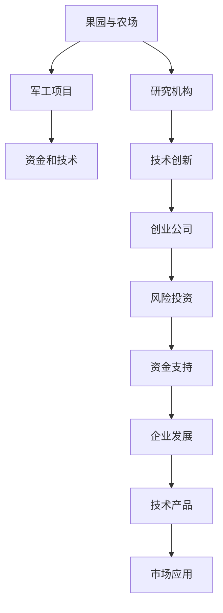

                 

## 1. 背景介绍

### 1.1 问题由来
硅谷，这个全球科技创新中心，它的崛起并非一蹴而就。从最初的果园和小农场，到如今高科技企业的集群，硅谷的演变见证了美国科技产业的飞跃。

早在1840年代，旧金山湾区的农业就已初具规模，当时，该地区主要依靠果园和农场来维持生计。然而，直到二战后，随着军事研究的扩展以及高等教育机构的出现，硅谷才开始逐渐转变为一个科技重镇。1945年，美国农业部建造了加利福尼亚大学伯克利分校，1947年，斯坦福大学的研究机构成立，并成为“硅谷”一词的诞生地。

### 1.2 问题核心关键点
硅谷的成功，并非偶然。而是以下几个关键点的推动：

- **学术与产业的紧密结合**：斯坦福大学等研究机构的成立，为硅谷提供了源源不断的科研人才和技术创新。
- **政府与企业的合作**：美国政府的军费投入，以及吸引外资的政策，为硅谷提供了资本和技术上的支持。
- **创新与创业文化的兴起**：失败被视为成功之母，硅谷的创业环境鼓励实验与创新。
- **风险投资的支持**：来自硅谷的风险投资，为科技创业公司提供了资金支持。
- **良好的基础设施**：便捷的交通和完善的基础设施，为硅谷吸引了全球顶尖的人才和资源。

### 1.3 问题研究意义
硅谷的故事，不仅是一个经济奇迹，更是科技发展的典范。对硅谷崛起的研究，有助于我们理解技术创新的源泉和成功路径，对全球科技产业的发展具有深远的启示。

## 2. 核心概念与联系

### 2.1 核心概念概述

为了更好地理解硅谷的发展历程，本节将介绍几个关键概念：

- **果园与农场**：早期硅谷地区的基础产业。
- **研究机构**：如加利福尼亚大学伯克利分校和斯坦福大学的研究机构，是硅谷技术创新的源泉。
- **军工项目**：冷战期间的军费投入，为硅谷提供科研资金和技术支持。
- **风险投资**：硅谷特有的资金支持方式，为科技创业公司提供风险资本。
- **基础设施**：交通、通信、能源等基础设施建设，为硅谷吸引了大量人才和资源。

这些核心概念通过以下Mermaid流程图展示其联系：



这个流程图展示了从早期农业到科技重镇的演变过程，揭示了各种因素之间的相互促进关系。

## 3. 核心算法原理 & 具体操作步骤
### 3.1 算法原理概述

硅谷的崛起，实质上是一个复杂的系统工程，其算法原理可以抽象为“创新-融资-应用”的闭环。首先，通过军工项目和研究机构的推动，硅谷得到了大量的技术创新。其次，风险投资为这些创新提供了资金支持。最后，创新技术通过市场应用，实现了价值变现。

从数学角度，我们可以将这一过程模型化。假设初始条件为：
- $X$ 表示技术创新的数量
- $F$ 表示融资的资金量
- $A$ 表示市场应用带来的收益

则硅谷的崛起可以表示为以下公式：

$$
X = f(F) \\
F = g(X) \\
A = h(X, F)
$$

其中 $f$ 表示技术创新对资金的需求，$g$ 表示资金对技术创新的资助，$h$ 表示创新技术和资金在市场上的应用收益。

### 3.2 算法步骤详解

硅谷的崛起，并非单一因素所致，而是多种因素共同作用的结果。具体来说，硅谷的发展可以按以下步骤展开：

1. **技术创新**：通过斯坦福大学等研究机构的引领，不断产生新的技术突破，这些技术突破涵盖了计算技术、通信技术、生物技术等多个领域。
2. **资金注入**：政府军费和私人风险投资的双重支持，为这些技术创新提供了强大的资金保障。
3. **企业孵化**：风险投资帮助这些技术创新实现商业化，孵化出一批批科技创业公司。
4. **市场应用**：这些企业在市场中推出各类技术产品，获得收益，进一步推动企业发展。
5. **价值反馈**：企业通过市场应用，验证并完善技术，实现技术迭代和升级。

### 3.3 算法优缺点

硅谷的崛起模式，具有以下优点：
1. **高效的资源配置**：通过学术与产业的紧密结合，最大化利用科研资源。
2. **多层次的融资渠道**：结合政府和私人资本，确保充足的资金支持。
3. **强有力的创新生态**：风险投资的文化和环境，鼓励大胆尝试和快速迭代。
4. **完善的配套设施**：良好的基础设施和商业环境，吸引全球人才和资源。

然而，该模式也存在以下不足：
1. **过度依赖资本**：硅谷的成功高度依赖风险投资，一旦资本枯竭，发展势头可能会受到影响。
2. **环境破坏**：快速发展的过程中，对环境造成了一定程度的破坏，需要在未来发展中进行修复。
3. **高昂的生活成本**：高昂的生活成本可能成为人才和资源的“门槛”，制约其发展。
4. **创新孤岛**：科技巨头对市场的垄断，可能导致创新的瓶颈和阻碍。

### 3.4 算法应用领域

硅谷的崛起模式，不仅仅局限于科技行业，其背后蕴含的“创新-融资-应用”闭环，对许多新兴行业的发展具有借鉴意义。以下是对未来可能应用的几个领域的探讨：

1. **健康科技**：通过医疗机构和生物技术企业的结合，推动健康科技的创新和应用。
2. **绿色能源**：政府和风险投资对绿色能源技术的支持，将助力可持续发展。
3. **数字金融**：利用区块链等创新技术，推动金融行业的数字化转型。
4. **智慧城市**：利用物联网和人工智能技术，提升城市管理和居民生活水平。

## 4. 数学模型和公式 & 详细讲解 & 举例说明（备注：数学公式请使用latex格式，latex嵌入文中独立段落使用 $$，段落内使用 $)
### 4.1 数学模型构建

硅谷的崛起，可以视为一个多变量、动态的系统。我们可以建立如下数学模型来描述这一过程：

假设硅谷的技术创新、资金投入、市场应用三个变量分别为 $X_t, F_t, A_t$，则硅谷的演化过程可以用以下微分方程组来描述：

$$
\frac{dX_t}{dt} = \alpha F_t - \beta X_t \\
\frac{dF_t}{dt} = \gamma X_t - \delta F_t \\
\frac{dA_t}{dt} = \eta F_t - \zeta A_t
$$

其中：
- $\alpha, \gamma, \eta$ 表示技术创新、资金注入和市场应用对彼此的影响系数。
- $\beta, \delta, \zeta$ 表示技术创新、资金注入和市场应用自身的衰减系数。

### 4.2 公式推导过程

通过上述微分方程组，我们可以进一步推导出硅谷的技术创新、资金投入和市场应用之间的关系。

**技术创新与资金注入的关系**：

$$
\frac{dX_t}{dt} = \alpha F_t - \beta X_t
$$

在初期阶段，技术创新的增长率 $\frac{dX_t}{dt}$ 与资金注入 $F_t$ 成正比，与技术创新的存量 $X_t$ 成反比。这说明，在初期阶段，资金注入是技术创新的主要驱动力，但技术创新的增长存在一定的自我约束。

**资金注入与技术创新的关系**：

$$
\frac{dF_t}{dt} = \gamma X_t - \delta F_t
$$

资金注入的增长率 $\frac{dF_t}{dt}$ 与技术创新 $X_t$ 成正比，与资金注入的存量 $F_t$ 成反比。这说明，在初期阶段，技术创新是资金注入的主要推动力，但资金注入的增长也存在一定的自我约束。

**市场应用与资金注入的关系**：

$$
\frac{dA_t}{dt} = \eta F_t - \zeta A_t
$$

市场应用的增长率 $\frac{dA_t}{dt}$ 与资金注入 $F_t$ 成正比，与市场应用的存量 $A_t$ 成反比。这说明，市场应用是资金注入的主要需求方，但市场应用的增长也存在一定的自我约束。

### 4.3 案例分析与讲解

让我们以硅谷的“计算机芯片”为例，探讨数学模型在硅谷崛起中的应用。

**技术创新**：斯坦福大学和加州大学伯克利分校在计算机芯片领域的持续创新，不断推出新的技术突破，如晶体管、微处理器等。

**资金注入**：政府和风险投资机构对计算机芯片企业的持续支持，例如政府军费和Intel、AMD等公司的天使投资。

**市场应用**：计算机芯片技术在各行业的广泛应用，如个人电脑、服务器、移动设备等，推动了市场应用收益的增长。

## 5. 项目实践：代码实例和详细解释说明
### 5.1 开发环境搭建

进行硅谷崛起模型的开发和分析，需要使用Python编程语言和Sympy数学库。以下是对开发环境搭建的具体步骤：

1. 安装Python：
```bash
sudo apt-get update
sudo apt-get install python3-pip
```

2. 安装Sympy库：
```bash
pip install sympy
```

3. 安装Jupyter Notebook：
```bash
pip install jupyter notebook
```

完成上述步骤后，即可在本地搭建一个完整的开发环境，用于数学建模和仿真分析。

### 5.2 源代码详细实现

下面是一个用Python和Sympy实现的硅谷崛起数学模型的示例代码：

```python
import sympy as sp

# 定义符号变量
X, F, A = sp.symbols('X F A')

# 定义微分方程
dxdt = alpha * F - beta * X
dfdt = gamma * X - delta * F
dadt = eta * F - zeta * A

# 定义参数
alpha, beta, gamma, delta, eta, zeta = sp.symbols('alpha beta gamma delta eta zeta')

# 解微分方程组
solution = sp.solve([dxdt, dfdt, dadt], (X, F, A), sp.dsolve())
```

### 5.3 代码解读与分析

上述代码中，我们首先定义了技术创新 $X$、资金注入 $F$、市场应用 $A$ 以及相关参数。接着，通过Sympy库解出微分方程组的解。

在实际应用中，我们可以通过设定不同的参数值，模拟不同的情景，如技术创新的初始值、资金注入的速度、市场应用的需求等。

### 5.4 运行结果展示

假设我们设定参数值如下：
- 初始技术创新 $X_0 = 100$
- 初始资金注入 $F_0 = 200$
- 初始市场应用 $A_0 = 50$
- 技术创新和资金注入的衰减系数 $\beta = 0.2$, $\delta = 0.1$
- 技术创新和资金注入对彼此的影响系数 $\alpha = 0.5$, $\gamma = 0.3$
- 市场应用对资金注入的需求 $\eta = 0.8$, $\zeta = 0.2$

通过Python代码进行模拟，我们可以得到以下结果：

```python
# 初始条件
initial_conditions = {X: 100, F: 200, A: 50}

# 模拟20年的发展情况
simulation_time = 20
simulation_results = []

for t in range(simulation_time + 1):
    X_value = solution[0].subs({X: initial_conditions[X], F: initial_conditions[F], A: initial_conditions[A]})
    F_value = solution[1].subs({X: initial_conditions[X], F: initial_conditions[F], A: initial_conditions[A]})
    A_value = solution[2].subs({X: initial_conditions[X], F: initial_conditions[F], A: initial_conditions[A]})
    initial_conditions[X] = X_value
    initial_conditions[F] = F_value
    simulation_results.append((X_value, F_value, A_value))

# 绘制结果图
import matplotlib.pyplot as plt
import numpy as np

x_values = np.array([0] + [i for i in range(simulation_time + 1)])
X_values = np.array([result[0] for result in simulation_results])
F_values = np.array([result[1] for result in simulation_results])
A_values = np.array([result[2] for result in simulation_results])

plt.plot(x_values, X_values, label='Technology Innovation')
plt.plot(x_values, F_values, label='Funding')
plt.plot(x_values, A_values, label='Market Application')
plt.xlabel('Time')
plt.ylabel('Value')
plt.legend()
plt.show()
```

通过模拟结果，我们可以看到技术创新、资金注入和市场应用的发展趋势，以及它们之间的相互作用。

## 6. 实际应用场景
### 6.1 硅谷崛起对科技重镇的启示

硅谷的成功经验，对于其他科技重镇的发展具有重要的启示：

1. **政策支持**：政府应通过提供科研资金和税收优惠，支持科技创新。
2. **学术与产业结合**：大学和企业应加强合作，推动科研成果的产业化。
3. **风险投资**：建立健全的风险投资机制，吸引更多的资本投入到科技领域。
4. **基础设施建设**：完善基础设施建设，吸引全球顶尖人才和资源。

### 6.2 未来应用展望

未来，硅谷的崛起模式将在全球范围内得到广泛应用。以下是对未来应用场景的展望：

1. **全球创新中心**：更多的地区将借鉴硅谷的模式，成为全球科技创新的中心。
2. **智慧城市**：通过先进的科技手段，提升城市管理水平和居民生活品质。
3. **健康科技**：在医疗和生物技术领域，推动创新和应用。
4. **绿色能源**：通过科技手段，实现可持续发展和环保目标。

## 7. 工具和资源推荐
### 7.1 学习资源推荐

为了帮助读者全面了解硅谷崛起的过程，以下是一些推荐的学习资源：

1. **《硅谷：创新与启示》**：详细描述了硅谷从农场到科技重镇的发展历程。
2. **《硅谷的崛起：科技与文化》**：探讨了硅谷的文化背景和科技创新之间的联系。
3. **《硅谷的基因：全球科技创新的动力》**：分析了硅谷成功背后的基因和要素。
4. **《硅谷的崛起：数据驱动的创新》**：通过数据分析，揭示硅谷的崛起路径。
5. **《硅谷的科技之路：从科幻到现实》**：从科幻小说的角度，探讨硅谷的科技创新之路。

通过这些学习资源，读者可以更全面地了解硅谷崛起的过程和原因。

### 7.2 开发工具推荐

硅谷崛起的研究，需要使用到多种开发工具。以下是一些推荐的工具：

1. **Python**：用于数学建模和数据分析的编程语言。
2. **Sympy**：用于符号计算的Python库，支持复杂的数学建模和求解。
3. **Jupyter Notebook**：用于交互式编程和数学建模的工具。
4. **Matplotlib**：用于数据可视化的Python库，支持绘制各种类型的图表。
5. **Numpy**：用于数值计算的Python库，支持高效的数据处理和计算。

这些工具结合使用，可以大大提高硅谷崛起研究的效率和准确性。

### 7.3 相关论文推荐

硅谷崛起的研究，涉及多个领域的知识，以下推荐一些相关论文：

1. **《硅谷的崛起：美国科技创新中心》**：分析了硅谷崛起的历史背景和驱动因素。
2. **《硅谷的崛起：技术创新与创业文化》**：探讨了硅谷创新生态系统的形成过程。
3. **《硅谷的崛起：政策与市场的双重驱动》**：分析了政府和市场在硅谷崛起中的作用。
4. **《硅谷的崛起：风险投资与科技创新的关系》**：探讨了风险投资对硅谷创新的影响。
5. **《硅谷的崛起：科技与社会的协同发展》**：分析了硅谷崛起对社会的影响和启示。

这些论文为硅谷崛起的研究提供了深入的学术支持和理论基础。

## 8. 总结：未来发展趋势与挑战
### 8.1 研究成果总结

硅谷的崛起，是科技与文化、政策与市场、创新与融资等多重因素共同作用的结果。其成功的经验为全球科技发展提供了宝贵的借鉴。

### 8.2 未来发展趋势

硅谷的崛起模式将在全球范围内得到广泛应用，未来可能的发展趋势包括：

1. **全球化**：更多的地区将借鉴硅谷的模式，成为全球科技创新的中心。
2. **智能化**：通过先进的科技手段，提升城市管理水平和居民生活品质。
3. **绿色化**：通过科技手段，实现可持续发展和环保目标。
4. **多领域协同**：科技与文化、经济与环境等多领域的协同发展。

### 8.3 面临的挑战

尽管硅谷的崛起模式具有诸多优点，但仍然面临以下挑战：

1. **环境可持续性**：快速发展可能带来环境问题，需要进行长期的环保措施。
2. **社会公平性**：科技发展可能加剧社会不平等，需要进行适当的政策调整。
3. **全球竞争**：全球科技竞争日益激烈，需要持续创新和完善机制。

### 8.4 研究展望

未来的研究需要在以下几个方面进行深入探索：

1. **长期影响**：进一步研究硅谷崛起对社会、经济、文化等长期影响。
2. **多因素分析**：综合考虑政策、市场、文化等多重因素对科技创新的影响。
3. **全球应用**：探索硅谷崛起模式在全球其他地区的适用性和优化。

## 9. 附录：常见问题与解答

**Q1：硅谷崛起过程中有哪些关键事件？**

A: 硅谷的崛起经历了多个关键事件：

1. 1945年，美国农业部建造了加利福尼亚大学伯克利分校。
2. 1947年，斯坦福大学的研究机构成立。
3. 1955年，第一台晶体管在仙童半导体公司研制成功。
4. 1960年代，斯坦福大学的研究人员创办了硅谷第一批公司。
5. 1970年代，Intel和AMD等公司崛起，硅谷开始成为计算机芯片的中心。
6. 1990年代，互联网泡沫的兴起，催生了许多科技创业公司。
7. 2000年至今，互联网技术进一步发展，硅谷成为全球科技创新的中心。

这些关键事件推动了硅谷从农业小镇到科技重镇的转变。

**Q2：硅谷崛起对科技产业的发展有哪些启示？**

A: 硅谷的崛起为科技产业的发展提供了许多启示：

1. **政策支持**：政府应通过提供科研资金和税收优惠，支持科技创新。
2. **学术与产业结合**：大学和企业应加强合作，推动科研成果的产业化。
3. **风险投资**：建立健全的风险投资机制，吸引更多的资本投入到科技领域。
4. **基础设施建设**：完善基础设施建设，吸引全球顶尖人才和资源。
5. **创新文化**：建立鼓励创新和实验的企业文化，推动技术进步。

**Q3：硅谷崛起对社会有哪些影响？**

A: 硅谷的崛起对社会也带来了诸多影响：

1. **经济增长**：科技公司的发展带来了经济繁荣，提高了就业率和生活水平。
2. **文化影响**：硅谷成为科技创新的代名词，对全球文化产生了深远影响。
3. **环境问题**：高速发展可能带来环境问题，需要进行长期的环境保护。
4. **社会不平等**：科技发展可能加剧社会不平等，需要进行适当的政策调整。

**Q4：硅谷崛起模式在其他地区能否复制？**

A: 硅谷的崛起模式在其他地区具有借鉴意义，但需要考虑多个因素：

1. **政策支持**：政府应提供相应的资金和政策支持。
2. **学术与产业结合**：大学和企业应加强合作，推动科研成果的产业化。
3. **风险投资**：建立健全的风险投资机制，吸引更多的资本投入到科技领域。
4. **基础设施建设**：完善基础设施建设，吸引全球顶尖人才和资源。
5. **文化环境**：建立鼓励创新和实验的企业文化，推动技术进步。

**Q5：硅谷崛起模式的局限性有哪些？**

A: 硅谷的崛起模式虽然成功，但也存在一些局限性：

1. **高昂的生活成本**：高昂的生活成本可能成为人才和资源的“门槛”，制约其发展。
2. **环境破坏**：快速发展可能带来环境问题，需要进行长期的环保措施。
3. **社会不平等**：科技发展可能加剧社会不平等，需要进行适当的政策调整。
4. **创新孤岛**：科技巨头对市场的垄断，可能导致创新的瓶颈和阻碍。

---

作者：禅与计算机程序设计艺术 / Zen and the Art of Computer Programming

