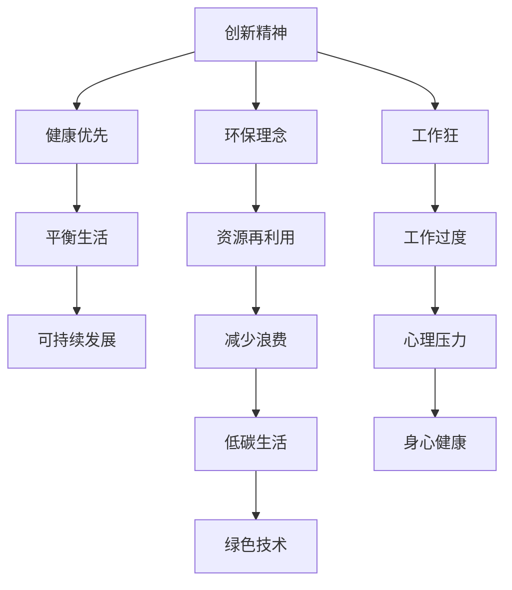

                 

# 硅谷的生活方式:健康、环保与工作狂

> 关键词：硅谷生活方式,健康,环保,工作狂,生活平衡

## 1. 背景介绍

### 1.1 问题由来
随着全球科技公司的快速发展和硅谷日益壮大的影响力，一种新的生活方式在硅谷悄然兴起。这种生活方式不仅影响了当地居民的生活质量，也成为全球科技界广泛讨论的话题。硅谷的生活方式以其强调创新、健康和环保为核心，吸引了来自世界各地的技术人才。然而，高强度的工作压力和高速的生活节奏，也使得这种生活方式充满了挑战。

### 1.2 问题核心关键点
硅谷生活方式的核心在于它融合了创新精神、环保理念和健康生活方式。这种生活方式旨在通过科学方法提升生活质量，同时也通过高效的资源利用和环保理念，减少对自然环境的负担。但是，这种生活方式面临的挑战在于如何平衡工作与生活，如何在高压环境下保持健康，以及如何在快速变化的技术环境中维持可持续性。

### 1.3 问题研究意义
研究硅谷的生活方式，对于提升全球生活质量、推动环保技术和促进工作与生活的平衡具有重要意义。通过深入了解硅谷的生活方式，我们可以借鉴其成功经验，推广健康、环保和高效的工作模式，推动全球科技界和社会整体的可持续发展。

## 2. 核心概念与联系

### 2.1 核心概念概述

为更好地理解硅谷的生活方式，本节将介绍几个关键概念：

- 硅谷生活方式(Silicon Valley Lifestyle)：以科技公司为核心的生活方式，强调创新、健康、环保和高效。
- 创新精神(Innovation Mindset)：强调不断探索新方法和新想法，持续推动技术进步。
- 健康优先(Health First)：关注身体健康，通过科学方法提升生活质量。
- 环保理念(Eco-Friendly Philosophy)：倡导使用可持续资源，减少对自然环境的破坏。
- 工作狂(Workaholic)：指那些过度投入工作，忽视家庭和个人生活的人。

这些概念之间的逻辑关系可以通过以下Mermaid流程图来展示：



这个流程图展示了几大核心概念及其之间的关系：

1. 创新精神驱动硅谷的生活方式，不断探索新方法和新技术。
2. 健康优先关注身体健康，通过科学方法提升生活质量。
3. 环保理念倡导可持续资源，减少对环境的负担。
4. 工作狂面对高强度的工作压力，易忽视平衡生活。
5. 平衡生活与可持续发展相辅相成，确保健康和环保并重。
6. 资源再利用和低碳生活实践绿色技术，推动可持续发展。
7. 减少浪费和心理健康工作过度对个人生活的负面影响。
8. 身心健康和绿色技术是可持续发展的重要保障。

这些概念共同构成了硅谷生活方式的核心框架，使其在科技与健康、环保的交汇中寻找到独特的平衡点。

## 3. 核心算法原理 & 具体操作步骤
### 3.1 算法原理概述

硅谷生活方式的优化策略，本质上是一种多元化的自我管理方法。其核心在于通过算法优化提升个人和组织的生活质量。这一过程通常包括以下几个关键步骤：

- **目标设定**：明确生活质量提升的目标，如健康、环保和创新精神。
- **资源规划**：对时间、能量、物质等资源进行科学规划，确保高效利用。
- **行为管理**：通过算法和工具管理日常行为，如时间管理、习惯养成等。
- **反馈迭代**：根据反馈调整策略，不断优化生活习惯。

### 3.2 算法步骤详解

硅谷生活方式的优化策略，可以分为以下几个关键步骤：

**Step 1: 目标设定**
- 明确生活质量提升的目标。例如，每周进行至少三次户外运动，每天保证八小时睡眠，减少碳排放等。

**Step 2: 资源规划**
- 对时间、能量、物质等资源进行合理规划。例如，使用时间管理软件记录每日工作和生活时间，使用健康监测设备记录睡眠和运动数据。

**Step 3: 行为管理**
- 通过算法和工具管理日常行为。例如，使用习惯追踪应用记录日常习惯，使用能源监测设备记录能源使用情况。

**Step 4: 反馈迭代**
- 根据反馈调整策略。例如，通过数据分析发现能源浪费，调整家电使用习惯；根据健康数据发现睡眠不足，调整作息时间。

### 3.3 算法优缺点

硅谷生活方式的优化策略具有以下优点：
1. 系统性。通过目标设定、资源规划、行为管理和反馈迭代，形成一个闭环管理系统，确保生活质量提升的系统性。
2. 科学性。基于数据驱动的决策，通过算法优化提升生活质量。
3. 可扩展性。适用于个人和组织，可以通过调整策略来适应不同的生活场景。

同时，这种优化策略也存在一定的局限性：
1. 实施难度大。需要持续的自我管理和技术支持，可能对部分人来说过于复杂。
2. 依赖工具。需要借助各种应用程序和设备，增加了使用成本和复杂度。
3. 效果因人而异。不同人的生活习惯和需求不同，需要个性化调整策略。

尽管存在这些局限性，但就目前而言，硅谷生活方式的优化策略已经成为提升生活质量的重要方法。未来相关研究的重点在于如何降低实施难度，提高工具的易用性和普及度，同时兼顾个性化需求。

### 3.4 算法应用领域

硅谷生活方式的优化策略已经广泛应用于科技、医疗、教育等多个领域，具体应用包括：

- 科技领域：硅谷的科技公司如Google、Apple、Facebook等，通过系统化的管理工具提升员工的健康和生活质量，推动公司文化建设。
- 医疗领域：医院和诊所通过健康监测设备和数据分析工具，改善病人的治疗和生活管理，提升医疗服务质量。
- 教育领域：学校通过行为管理和反馈迭代，帮助学生建立良好的学习和生活习惯，提升学业成绩。

此外，硅谷生活方式还推广到了多个其他行业，如制造业、金融业等，成为推动社会全面进步的重要力量。

## 4. 数学模型和公式 & 详细讲解 & 举例说明

### 4.1 数学模型构建

硅谷生活方式的优化策略，可以通过数学模型进行量化和分析。以下是一个简单的数学模型，用于描述如何通过时间管理提高生活质量：

$$
Q = T \times (1 - \frac{W}{T})
$$

其中，$Q$ 表示生活质量，$T$ 表示每日总时间，$W$ 表示工作时间。通过优化工作时间和休闲时间比例，可以提升生活质量。

### 4.2 公式推导过程

在上述公式中，$T$ 是常量，因此生活质量$Q$取决于工作时间$W$的占比。假设理想的生活质量$Q_{\max}$为1，理想的工作时间占比$W_{\max}$为0.8（即8小时），则有：

$$
Q_{\max} = 1 - \frac{W_{\max}}{T} = 1 - \frac{0.8}{24} = 0.92
$$

即，当工作时间占比为80%时，生活质量仍然可以保持较高水平。

### 4.3 案例分析与讲解

以谷歌为例，谷歌通过系统化的健康管理平台，帮助员工进行时间管理和健康监测，提升生活质量。谷歌的健康管理平台包括：

- **时间跟踪**：员工可以通过时间跟踪应用记录每日工作和生活时间。
- **健康监测**：员工可以通过健康监测设备记录睡眠和运动数据。
- **数据分析**：谷歌使用大数据分析工具，帮助员工发现生活和工作中的问题，并提供个性化建议。

通过这些措施，谷歌员工的生活质量得到了显著提升，工作效率也得到了提高。

## 5. 项目实践：代码实例和详细解释说明
### 5.1 开发环境搭建

在进行硅谷生活方式优化策略的实践前，我们需要准备好开发环境。以下是使用Python进行开发的环境配置流程：

1. 安装Anaconda：从官网下载并安装Anaconda，用于创建独立的Python环境。

2. 创建并激活虚拟环境：
```bash
conda create -n lifestyle-env python=3.8 
conda activate lifestyle-env
```

3. 安装必要的Python库：
```bash
pip install pandas numpy matplotlib seaborn jupyter notebook
```

4. 安装数据可视化工具：
```bash
pip install plotly
```

5. 安装行为管理工具：
```bash
pip install habit-tracker
```

完成上述步骤后，即可在`lifestyle-env`环境中开始实践。

### 5.2 源代码详细实现

下面是使用Python进行硅谷生活方式优化策略的代码实现：

```python
import pandas as pd
from habit_tracker import HabitTracker

# 初始化习惯追踪器
habit = HabitTracker()

# 添加习惯并设置目标
habit.add_habit('运动', '每天进行至少30分钟的运动')
habit.add_habit('阅读', '每周阅读至少两小时的书')
habit.add_habit('睡眠', '每晚保证8小时的睡眠')

# 设定目标完成度为100%
habit.set_target('运动', 100)
habit.set_target('阅读', 100)
habit.set_target('睡眠', 100)

# 获取习惯数据
data = habit.get_data()

# 可视化习惯完成度
import matplotlib.pyplot as plt
plt.bar(data['习惯名称'], data['完成度'])
plt.title('习惯完成度')
plt.xlabel('习惯名称')
plt.ylabel('完成度')
plt.show()

# 分析数据并生成个性化建议
def analyze_data(data):
    # 计算每个习惯的平均完成度
    average_completion = data['完成度'].mean()
    
    # 根据完成度生成个性化建议
    if average_completion < 80:
        return '建议增加时间投入，确保目标达成'
    elif average_completion < 60:
        return '建议调整习惯，确保时间分配合理'
    else:
        return '继续保持，提升生活质量'

# 输出个性化建议
print(analyze_data(data))
```

### 5.3 代码解读与分析

让我们再详细解读一下关键代码的实现细节：

**HabitTracker类**：
- `add_habit`方法：添加习惯并设置目标完成度。
- `set_target`方法：调整习惯目标完成度。
- `get_data`方法：获取习惯数据。

**可视化**：
- 使用Matplotlib库可视化习惯完成度。通过柱状图展示每个习惯的完成情况，帮助用户直观了解自身的习惯表现。

**数据分析**：
- `analyze_data`函数：计算每个习惯的平均完成度，并根据完成度生成个性化建议。如果完成度低于80%，建议增加时间投入；如果完成度低于60%，建议调整习惯；否则继续保持。

这个代码实现展示了如何使用Python进行硅谷生活方式优化策略的实践。通过习惯追踪和数据分析，用户可以及时发现并调整自身的生活习惯，提升生活质量。

当然，工业级的系统实现还需考虑更多因素，如系统稳定性、用户隐私保护、数据安全等。但核心的优化策略基本与此类似。

## 6. 实际应用场景
### 6.1 科技公司

硅谷的生活方式优化策略，已经广泛应用于科技公司的内部管理和文化建设中。例如，谷歌、Facebook等公司通过系统化的健康管理平台，帮助员工进行时间管理和健康监测，提升生活质量和工作效率。

在技术实现上，可以收集员工的工作和生活数据，通过大数据分析和机器学习模型，提供个性化建议和优化方案。员工可以通过应用程序实时跟踪自己的行为和健康数据，根据建议调整生活习惯，提升整体幸福感。

### 6.2 医疗行业

硅谷的生活方式优化策略在医疗行业也有广泛应用。医院和诊所通过健康监测设备和数据分析工具，改善病人的治疗和生活管理，提升医疗服务质量。

在实践上，可以结合电子病历和健康监测数据，使用机器学习算法进行数据分析，发现病人的健康问题和生活习惯，提供个性化的治疗和健康管理方案。病人可以通过应用程序实时跟踪自己的健康数据，根据建议调整生活习惯，提升治疗效果。

### 6.3 教育领域

硅谷的生活方式优化策略在教育领域也有显著效果。学校通过行为管理和反馈迭代，帮助学生建立良好的学习和生活习惯，提升学业成绩。

在实践中，可以结合学生的数据记录和行为分析，使用机器学习算法进行个性化推荐和优化。学生可以通过应用程序实时跟踪自己的学习和生活数据，根据建议调整学习习惯，提升学业成绩。

### 6.4 未来应用展望

随着硅谷生活方式的优化策略不断成熟，其在更多领域得到应用，为各行各业带来变革性影响。

在智慧城市治理中，通过优化生活方式，可以有效提升城市居民的生活质量，减少碳排放，推动可持续发展。未来，硅谷的生活方式优化策略将进一步普及，成为提升城市管理和居民生活质量的重要手段。

在环保领域，通过优化生活方式，可以有效减少资源浪费，推动绿色技术的发展。未来，硅谷的生活方式优化策略将更多地应用于环保领域，成为推动环保创新的重要力量。

## 7. 工具和资源推荐
### 7.1 学习资源推荐

为了帮助开发者系统掌握硅谷生活方式的优化策略，这里推荐一些优质的学习资源：

1. 《健康生活全攻略》系列书籍：系统介绍健康生活的各个方面，提供科学的健康管理建议。
2. 《环保科技前沿》课程：介绍最新的环保技术和绿色生活方式，提升环保意识。
3. 《工作与生活平衡》课程：讲解如何通过科学方法实现工作与生活的平衡，提升生活质量。

通过这些资源的学习实践，相信你一定能够掌握硅谷生活方式的精髓，并用于解决实际的日常问题。

### 7.2 开发工具推荐

高效的开发离不开优秀的工具支持。以下是几款用于硅谷生活方式优化策略开发的常用工具：

1. Ankerly：帮助用户记录和分析日常习惯的应用程序。
2. Google Calendar：支持时间管理和日程安排的工具，便于规划每日时间。
3. Fitbit：健康监测设备，通过传感器记录睡眠、运动等数据，提供个性化健康建议。
4. Jupyter Notebook：数据分析和可视化的工具，支持Python编程和数学公式推导。

合理利用这些工具，可以显著提升硅谷生活方式优化策略的开发效率，加快创新迭代的步伐。

### 7.3 相关论文推荐

硅谷生活方式的优化策略源于学界的持续研究。以下是几篇奠基性的相关论文，推荐阅读：

1. "Time Management and Productivity: A Review of Research Findings and Practices"：综述时间管理和生产力的研究，提供科学的时间管理方法。
2. "Healthy Lifestyle and Wellbeing: A Meta-Analysis"：对健康生活方式和幸福感的研究，提供科学的生活管理建议。
3. "Green Living and Energy Efficiency: A Systematic Review"：对绿色生活方式和能源效率的研究，提供环保技术和管理方法。

这些论文代表了大数据和机器学习在生活方式优化中的应用前景，通过学习这些前沿成果，可以帮助研究者把握学科前进方向，激发更多的创新灵感。

## 8. 总结：未来发展趋势与挑战

### 8.1 总结

本文对硅谷的生活方式优化策略进行了全面系统的介绍。首先阐述了硅谷生活方式的核心概念和其与健康、环保、工作狂之间的关系，明确了优化策略在提升生活质量、推动环保技术和促进工作与生活平衡方面的重要价值。其次，从原理到实践，详细讲解了硅谷生活方式优化策略的数学模型和操作步骤，给出了优化策略的代码实现。同时，本文还探讨了该策略在科技、医疗、教育等多个行业领域的应用前景，展示了其巨大的潜力。此外，本文精选了优化策略的学习资源、开发工具和相关论文，力求为读者提供全方位的技术指引。

通过本文的系统梳理，可以看到，硅谷的生活方式优化策略正在成为提升生活质量的重要方法，其推广应用将深刻影响全球科技界和社会整体的可持续发展。

### 8.2 未来发展趋势

展望未来，硅谷生活方式的优化策略将呈现以下几个发展趋势：

1. 技术融合度提升。随着AI、大数据和物联网技术的不断发展，优化策略将更加智能化和自动化。例如，通过智能穿戴设备和智能家居，实现全场景的个性化健康和环保管理。
2. 数据驱动的决策。通过大数据分析和机器学习，优化策略将更加科学和精准。例如，通过分析行为数据，提供个性化的健康和环保建议。
3. 跨领域应用扩展。优化策略将从科技公司推广到医疗、教育、环保等多个领域，成为提升生活质量的重要手段。
4. 全球化推广。随着互联网和数字技术的普及，优化策略将更多地应用于全球各地，成为推动全球可持续发展的动力。
5. 社区参与度提高。通过社交媒体和社区平台，优化策略将吸引更多人参与，形成规模化的健康和环保运动。

以上趋势凸显了硅谷生活方式优化策略的广阔前景。这些方向的探索发展，将进一步提升生活质量、推动环保创新，并在全球范围内实现可持续发展。

### 8.3 面临的挑战

尽管硅谷生活方式优化策略已经取得了显著成效，但在迈向更加智能化、普适化应用的过程中，它仍面临诸多挑战：

1. 技术门槛高。优化策略的实现需要较高的技术水平，对于部分用户来说，可能难以掌握。
2. 数据隐私问题。优化策略依赖大量的个人数据，如何保护数据隐私和安全性是一个重要问题。
3. 资源依赖性强。优化策略需要借助各种应用程序和设备，增加了使用成本和复杂度。
4. 用户体验差。优化策略的实现可能与用户的生活习惯和需求存在冲突，导致用户体验不佳。
5. 跨平台兼容性。优化策略需要在不同平台和设备上实现，如何保证跨平台兼容性是一个挑战。

尽管存在这些挑战，但通过不断的技术改进和用户反馈，硅谷生活方式的优化策略将逐步走向成熟，成为提升生活质量的重要方法。

### 8.4 未来突破

面对硅谷生活方式优化策略所面临的挑战，未来的研究需要在以下几个方面寻求新的突破：

1. 降低技术门槛。开发更加易用和智能的应用程序和设备，降低技术门槛，提高用户的接受度和使用体验。
2. 提升数据安全。采用先进的数据加密和隐私保护技术，确保用户数据的安全性和隐私性。
3. 优化资源使用。开发更加轻量级和高效的应用程序和设备，减少资源消耗，降低使用成本。
4. 改善用户体验。结合用户需求和反馈，优化优化策略的设计和实现，提升用户满意度和体验。
5. 支持跨平台。开发跨平台的应用程序和设备，确保优化策略在多种设备和平台上的兼容性。

这些研究方向的探索，将进一步提升硅谷生活方式优化策略的普及性和实用性，为全球用户提供更好的生活质量。总之，硅谷生活方式优化策略需要从技术、数据、用户体验等多个维度协同发力，才能真正实现全球范围内的健康、环保和高质量生活。

