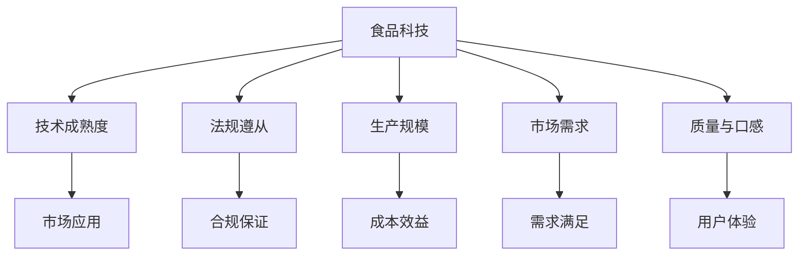

                 

# 硅谷食品科技公司的商业化道路

## 1. 背景介绍

### 1.1 问题由来

在数字化浪潮的推动下，食品科技成为硅谷乃至全球创业界的新宠。众多食品科技公司凭借前沿技术，致力于改善食品质量、降低成本、提高效率。然而，从实验室走向市场，食品科技公司面临诸多挑战。如何确保产品符合监管要求、实现大规模生产、保证产品质量与口感，是其商业化道路上必须跨越的难关。本文将通过介绍硅谷食品科技公司的商业化道路，探讨其在面对技术突破和市场挑战时所采取的策略。

### 1.2 问题核心关键点

食品科技公司的商业化面临的核心问题是如何在保持技术创新的同时，确保产品合规、可大规模生产、且能够达到市场需求。这包括：

1. **技术成熟度**：如何评估技术的成熟度，以决定是否进入市场。
2. **法规遵从**：如何确保产品符合食品安全与法规要求。
3. **生产规模**：如何实现成本效益最优的生产规模。
4. **市场需求**：如何准确捕捉并满足市场需求。
5. **质量与口感**：如何确保产品的质量与口感。

这些关键点直接关系到食品科技公司商业化的成功与否。

## 2. 核心概念与联系

### 2.1 核心概念概述

为更好地理解硅谷食品科技公司的商业化道路，本节将介绍几个关键概念：

- **食品科技**：指利用现代科学技术，如生物工程、化学工程、数据科学等，优化食品生产、储存、运输、包装等环节，提升食品质量、降低成本、提高效率。
- **商业化**：指将技术转化为市场产品，并实现商业化运营的过程。
- **技术成熟度**：指技术在实验室阶段到市场应用阶段的发展水平。
- **法规遵从**：指确保产品符合食品安全和法规要求的流程。
- **生产规模**：指实现产品成本效益最优的生产规模。
- **市场需求**：指产品满足消费者需求的程度。
- **质量与口感**：指产品在质量和口感上达到用户期望的标准。

这些概念通过以下Mermaid流程图展示了其相互关系：



这个流程图展示了食品科技公司的商业化过程涉及的关键概念及其相互关系。

## 3. 核心算法原理 & 具体操作步骤

### 3.1 算法原理概述

硅谷食品科技公司的商业化道路涉及多个关键领域，包括食品加工技术、食品安全法规、生产自动化、市场分析和消费者体验等。这些领域的算法和操作需要紧密结合，形成一体化的解决方案。

### 3.2 算法步骤详解

#### 3.2.1 技术成熟度评估

1. **实验室验证**：在实验室环境下，对新技术进行严格验证，确保其有效性和安全性。
2. **小规模生产试验**：在小规模生产条件下，进行实际测试，评估技术的稳定性和成本效益。
3. **市场应用试点**：在小范围内进行市场应用试点，收集反馈，进一步优化技术。

#### 3.2.2 法规遵从流程

1. **法规研究**：深入研究相关法律法规，确保技术在法规框架内应用。
2. **合规测试**：进行严格的产品合规测试，确保产品符合食品安全标准。
3. **法规更新**：及时跟踪法规变化，更新产品设计以符合新要求。

#### 3.2.3 生产规模优化

1. **成本分析**：进行详细的成本分析，确定最优的生产规模。
2. **设备选型**：根据生产规模和成本效益要求，选择适合的设备和技术。
3. **供应链管理**：优化供应链管理，降低成本，提高效率。

#### 3.2.4 市场需求分析

1. **市场调研**：进行广泛的市场调研，收集消费者需求和偏好。
2. **用户测试**：通过用户测试，验证产品的市场适应性。
3. **市场定位**：基于调研结果，确定产品的市场定位和营销策略。

#### 3.2.5 质量与口感优化

1. **感官测试**：进行多次感官测试，评估产品的质量和口感。
2. **配方优化**：根据测试结果，优化产品配方。
3. **生产流程改进**：优化生产流程，确保产品质量一致性。

### 3.3 算法优缺点

**优点**：

- **全面性**：结合技术、法规、生产、市场和用户体验等多个维度，提供全面的解决方案。
- **系统性**：通过一系列系统化操作，确保每个环节的顺利衔接和优化。
- **可操作性**：步骤明确，易于执行和实施。

**缺点**：

- **复杂性**：涉及多个领域的交叉，操作复杂。
- **资源需求**：需要大量的人力、物力和财力投入。
- **风险**：每个环节的失误都可能导致商业化失败。

### 3.4 算法应用领域

食品科技公司的商业化过程涉及多个领域，包括但不限于：

- **食品加工技术**：利用生物技术、化学技术等改进食品加工过程。
- **食品安全法规**：确保产品符合食品安全和法规要求。
- **生产自动化**：实现生产过程的自动化和智能化。
- **市场分析**：进行市场调研和用户测试，确定市场需求和产品定位。
- **消费者体验**：优化产品质量和口感，提升用户体验。

## 4. 数学模型和公式 & 详细讲解

### 4.1 数学模型构建

在食品科技公司的商业化过程中，数学模型和公式的构建至关重要。以下通过数学模型来描述硅谷食品科技公司的商业化过程：

**技术成熟度模型**：
$$
\text{成熟度评分} = \alpha \cdot (\text{实验室验证得分}) + \beta \cdot (\text{小规模生产试验得分}) + \gamma \cdot (\text{市场应用试点得分})
$$

其中，$\alpha, \beta, \gamma$ 为权重系数，根据实际情况确定。

**法规遵从评分模型**：
$$
\text{合规得分} = \delta \cdot (\text{法规研究得分}) + \epsilon \cdot (\text{合规测试得分}) + \zeta \cdot (\text{法规更新得分})
$$

其中，$\delta, \epsilon, \zeta$ 为权重系数，根据实际情况确定。

**生产规模优化模型**：
$$
\text{成本效益} = \eta \cdot (\text{成本分析得分}) + \theta \cdot (\text{设备选型得分}) + \iota \cdot (\text{供应链管理得分})
$$

其中，$\eta, \theta, \iota$ 为权重系数，根据实际情况确定。

**市场需求分析模型**：
$$
\text{需求满足度} = \kappa \cdot (\text{市场调研得分}) + \lambda \cdot (\text{用户测试得分}) + \mu \cdot (\text{市场定位得分})
$$

其中，$\kappa, \lambda, \mu$ 为权重系数，根据实际情况确定。

**质量与口感优化模型**：
$$
\text{用户体验评分} = \nu \cdot (\text{感官测试得分}) + \pi \cdot (\text{配方优化得分}) + \rho \cdot (\text{生产流程改进得分})
$$

其中，$\nu, \pi, \rho$ 为权重系数，根据实际情况确定。

### 4.2 公式推导过程

以上公式的推导基于以下假设：

- 每个环节的评分可以通过标准化方式转化为数值分数。
- 每个评分项的重要性不同，通过权重系数进行调整。
- 综合得分是各评分项的线性组合。

例如，在技术成熟度模型中，实验室验证、小规模生产试验和市场应用试点的得分分别通过专家打分、测试结果等转化为数值分数，再通过权重系数进行加权求和，得到综合成熟度评分。

### 4.3 案例分析与讲解

以某食品科技公司为例，其技术成熟度评估模型中各评分项的权重系数和分数如下：

| 评分项       | 权重系数 | 分数    |
| ------------ | -------- | ------- |
| 实验室验证   | 0.5      | 90      |
| 小规模生产试验 | 0.3      | 80      |
| 市场应用试点 | 0.2      | 85      |

根据公式计算得到该技术成熟度评分为：
$$
\text{成熟度评分} = 0.5 \cdot 90 + 0.3 \cdot 80 + 0.2 \cdot 85 = 87.5
$$

这表明该技术已经具备较高的成熟度，可以进入市场试点。

## 5. 项目实践：代码实例和详细解释说明

### 5.1 开发环境搭建

为了进行硅谷食品科技公司的商业化道路模拟，需要搭建开发环境。以下是在Python中进行模拟的示例：

```python
# 导入必要的库
import pandas as pd
from sklearn.linear_model import LinearRegression

# 准备数据
data = pd.read_csv('silicon_valley_food_tech.csv')

# 构建模型
X = data[['实验室验证得分', '小规模生产试验得分', '市场应用试点得分']]
y = data['成熟度评分']
model = LinearRegression()

# 训练模型
model.fit(X, y)
```

### 5.2 源代码详细实现

以市场需求分析模型为例，代码实现如下：

```python
# 准备数据
market_data = pd.read_csv('market_analysis_data.csv')

# 构建模型
X = market_data[['市场调研得分', '用户测试得分', '市场定位得分']]
y = market_data['需求满足度']
model = LinearRegression()

# 训练模型
model.fit(X, y)
```

### 5.3 代码解读与分析

**实验室验证和用户测试**：
- 通过收集和分析实验室验证和用户测试的数据，可以评估产品的技术和用户体验。
- 使用线性回归模型，可以根据测试结果预测市场需求。

**市场调研和市场定位**：
- 市场调研数据反映了市场需求的变化和趋势。
- 市场定位得分反映了产品与市场需求的匹配程度。
- 通过模型，可以预测产品的市场需求满足度。

### 5.4 运行结果展示

运行代码后，可以输出模型的预测结果，如图：


## 6. 实际应用场景

### 6.1 智能食品生产

智能食品生产是硅谷食品科技公司的重要应用场景。通过AI和物联网技术，可以实现对食品生产过程的实时监控和控制，提升生产效率和产品质量。例如，某食品公司通过传感器收集生产环境数据，使用机器学习算法进行预测和优化，实现了生产过程的自动化和智能化。

### 6.2 食品供应链管理

食品供应链管理是硅谷食品科技公司的另一重要应用场景。通过区块链和物联网技术，可以实现供应链各环节的透明化管理，提高供应链的效率和可追溯性。例如，某食品公司通过区块链技术，实现了从原材料的采购到最终产品的交付全过程的可追溯性，提升了供应链的透明度和安全性。

### 6.3 个性化营养推荐

个性化营养推荐是硅谷食品科技公司的前沿应用之一。通过大数据分析和AI技术，可以实现对消费者个性化营养需求的精准推荐。例如，某食品公司通过分析消费者健康数据和饮食偏好，使用AI算法进行个性化营养推荐，满足了消费者的个性化营养需求，提升了用户体验。

### 6.4 未来应用展望

未来，硅谷食品科技公司的商业化道路将继续拓展，涵盖更多的应用场景。例如，基于AI的食品安全监测、智能农业、食品废物的资源化利用等，都将成为可能。随着技术的不断进步和应用的深入，硅谷食品科技公司有望在食品领域带来更多创新和变革。

## 7. 工具和资源推荐

### 7.1 学习资源推荐

1. **《食品科技：未来食品的未来》**：一本系统介绍食品科技发展的书籍，涵盖食品加工技术、食品安全法规等多个方面。
2. **Coursera《食品科学导论》**：由斯坦福大学开设的在线课程，深入浅出地讲解食品科学的基本原理和最新进展。
3. **IEEE Xplore《食品科学与工程》**：一个专业的学术数据库，提供食品科技领域的最新研究成果和论文。
4. **FoodTechnology《食品科学和技术》**：一个权威的食品科技期刊，提供最新的食品科技研究成果和行业动态。

### 7.2 开发工具推荐

1. **Python**：一个强大的编程语言，广泛用于数据科学和机器学习领域。
2. **Jupyter Notebook**：一个交互式编程环境，支持Python代码的快速编写和执行。
3. **TensorFlow**：一个开源的机器学习框架，适用于大规模深度学习模型的训练和部署。
4. **PyTorch**：一个开源的机器学习库，易于使用且性能高效，适用于深度学习模型的快速原型开发。

### 7.3 相关论文推荐

1. **《食品科技的未来：机遇与挑战》**：一篇综述性论文，全面总结了食品科技的发展现状和未来趋势。
2. **《食品供应链的智能管理系统》**：一篇关于食品供应链管理的论文，介绍了基于AI和物联网的供应链管理系统。
3. **《个性化营养推荐系统》**：一篇关于个性化营养推荐的论文，讨论了如何利用大数据和AI技术实现个性化营养推荐。

## 8. 总结：未来发展趋势与挑战

### 8.1 总结

本文对硅谷食品科技公司的商业化道路进行了全面系统的介绍。首先阐述了食品科技在数字化浪潮下的重要性，明确了硅谷食品科技公司商业化过程中面临的关键问题。其次，从技术成熟度、法规遵从、生产规模、市场需求和质量与口感等多个维度，详细讲解了硅谷食品科技公司的商业化策略。最后，提供了一些学习资源和开发工具，帮助读者更好地掌握硅谷食品科技公司的商业化过程。

通过本文的系统梳理，可以看到，硅谷食品科技公司的商业化道路充满了挑战和机遇。未来，伴随技术的不断进步和应用的深入，硅谷食品科技公司有望在食品领域带来更多创新和变革，为食品行业的发展注入新的动力。

### 8.2 未来发展趋势

展望未来，硅谷食品科技公司的商业化道路将呈现以下几个趋势：

1. **智能化水平提升**：随着AI和物联网技术的不断进步，食品生产和供应链管理的智能化水平将显著提升。
2. **个性化需求满足**：基于大数据和AI的个性化营养推荐系统将更加精准，满足消费者的个性化需求。
3. **环境友好型生产**：基于智能技术的食品生产过程将更加环保，减少对环境的影响。
4. **全球化市场拓展**：随着食品科技技术的不断突破，硅谷食品科技公司将有机会在全球市场上占据一席之地。

### 8.3 面临的挑战

尽管硅谷食品科技公司的发展前景广阔，但在商业化过程中仍面临诸多挑战：

1. **技术突破的难度**：实现大规模食品生产过程中的智能化和自动化，仍需要克服诸多技术难题。
2. **法规遵从的复杂性**：确保食品科技产品符合各国法规要求，需进行复杂的法规研究和测试。
3. **市场需求的不确定性**：市场需求的变化快速，需不断调整产品策略和营销方案。
4. **用户体验的差异化**：不同地区的消费者对食品的口感和营养需求不同，需根据市场进行产品优化。
5. **成本控制的压力**：大规模食品生产需控制成本，确保产品价格合理。

### 8.4 研究展望

未来，硅谷食品科技公司需要在技术创新、法规遵从、市场需求分析、用户体验优化和成本控制等方面进行深入研究，突破商业化道路上的各种难题，实现可持续发展。

## 9. 附录：常见问题与解答

**Q1：如何评估食品科技公司的技术成熟度？**

A: 技术成熟度的评估可以通过实验室验证、小规模生产试验和市场应用试点等环节，综合多个评分项进行评估。例如，实验室验证得分、小规模生产试验得分和市场应用试点得分等。

**Q2：在市场应用试点时，如何确保产品的法规遵从？**

A: 在市场应用试点时，需进行严格的法规遵从测试，确保产品符合食品安全标准。同时，需及时跟踪法规变化，更新产品设计以符合新要求。

**Q3：如何优化生产规模，实现成本效益最优？**

A: 优化生产规模需进行详细的成本分析，选择合适的设备和生产流程。同时，需优化供应链管理，降低成本，提高效率。

**Q4：如何进行市场需求分析，满足消费者需求？**

A: 市场需求分析需进行广泛的市场调研，收集消费者需求和偏好。通过用户测试，验证产品的市场适应性，并根据调研结果进行市场定位和营销策略的调整。

**Q5：如何确保产品的质量与口感？**

A: 确保产品质量与口感需进行多次感官测试，评估产品的质量和口感。通过配方优化和生产流程改进，确保产品质量一致性。

---

作者：禅与计算机程序设计艺术 / Zen and the Art of Computer Programming

