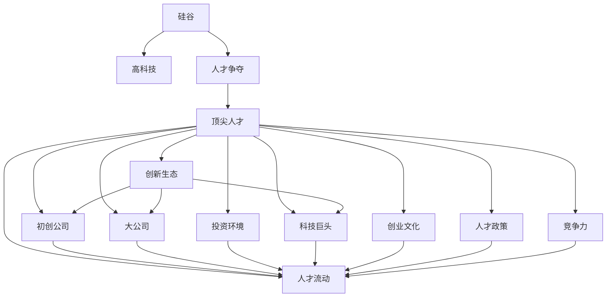

                 

# 硅谷高科技人才战争:争夺顶尖人才

> 关键词：硅谷,高科技,人才争夺,顶尖人才,创新生态,初创公司,大公司,投资环境,科技巨头,创业文化,人才流动,人才政策,竞争力

## 1. 背景介绍

### 1.1 问题由来
在当今科技日新月异的时代，人才成为了推动创新和竞争的关键因素。尤其是对于那些位于科技前沿的高科技公司，无论是初创企业还是科技巨头，吸引和留住顶尖人才成为了赢得市场竞争的制胜法宝。近年来，硅谷作为全球科技创新中心，其对顶尖人才的争夺愈发激烈。

### 1.2 问题核心关键点
在硅谷，人才争夺战不仅仅是薪酬和福利的简单竞争，更是文化、创新生态、投资环境等多方面因素的综合比拼。本文将从多个维度探讨硅谷如何成为全球高科技人才争夺的热点，分析各方的竞争策略，并为硅谷科技公司提供战略启示。

## 2. 核心概念与联系

### 2.1 核心概念概述

为更好地理解硅谷高科技人才战争的本质，本节将介绍几个密切相关的核心概念：

- **硅谷**：位于美国加利福尼亚州旧金山湾区的一个地理区域，以其高科技公司、创新创业文化而闻名。
- **高科技**：涵盖人工智能、大数据、云计算、物联网、生物技术等多个前沿领域的综合性技术。
- **人才争夺**：公司或机构为获取顶尖人才而展开的竞争行为。
- **顶尖人才**：在各自领域内具有卓越创新能力、专业知识和影响力的个人。
- **创新生态**：包括企业、研究机构、创业公司、投资者等在内的所有创新相关主体构成的生态系统。
- **初创公司**：早期阶段，通常规模较小、资金有限的创业企业。
- **大公司**：指已建立多年、资金实力雄厚、市场份额较大的企业。
- **投资环境**：包括政策支持、资金投入、市场环境、法律保护等影响创业公司发展的多方面因素。
- **科技巨头**：如Google、Facebook、Apple等在各自领域内占据领导地位的大型科技公司。
- **创业文化**：硅谷独特的企业文化，鼓励创新、快速迭代、承担风险的价值观。
- **人才流动**：人才在不同企业、不同行业之间的流动现象。
- **人才政策**：公司或机构为了吸引和留住人才而制定的一系列策略和措施。
- **竞争力**：公司在吸引和保留顶尖人才方面的综合实力和能力。

这些核心概念之间的逻辑关系可以通过以下Mermaid流程图来展示：



这个流程图展示了一连串的核心概念及其之间的关系：硅谷作为高科技人才争夺的战场，各类企业通过争夺顶尖人才来增强自身竞争力，进而影响硅谷的创新生态。顶尖人才在不同类型公司间流动，同时受到政策、环境、文化等多重因素的驱动。

## 3. 核心算法原理 & 具体操作步骤
### 3.1 算法原理概述

硅谷高科技人才争夺的竞争策略可以抽象为一种多维度综合博弈过程。在这种博弈中，各参与方（公司、机构、个人）根据自身和对手的情况，制定最优策略，以最大化自身的收益。

### 3.2 算法步骤详解

硅谷高科技人才争夺的竞争策略主要包括以下几个步骤：

**Step 1: 评估环境**
- 分析市场环境、技术趋势、政策导向，确定哪些领域和岗位最有发展潜力。

**Step 2: 设计策略**
- 确定薪酬福利、文化氛围、发展空间等核心竞争要素，制定吸引人才的策略。
- 结合自身优势和对手情况，制定差异化的人才政策，如股权激励、职业培训、快速晋升等。

**Step 3: 实施行动**
- 积极参与行业会议、创业比赛等活动，展示自身实力和吸引人才的意愿。
- 通过猎头公司、社交媒体等渠道，广泛接触和吸引潜在人才。

**Step 4: 持续优化**
- 定期评估策略实施效果，收集反馈信息，根据市场变化和人才需求调整策略。
- 建立人才数据库，对人才资源进行精细化管理和维护。

### 3.3 算法优缺点

硅谷高科技人才争夺的竞争策略具有以下优点：
1. **灵活性高**：不同公司可以根据自身情况和市场动态灵活调整策略，以应对不断变化的人才需求。
2. **创新驱动**：重视人才的创新潜力和技术贡献，通过股权激励等手段激发人才的创造力。
3. **广泛覆盖**：利用多种渠道和平台接触潜在人才，提高吸引和招聘的覆盖面。
4. **综合竞争**：不仅关注薪酬福利，还注重企业文化、职业发展等多维度综合因素，提高吸引力。

同时，该策略也存在一定的局限性：
1. **成本高昂**：高薪酬和福利吸引人才的同时，也增加了公司的运营成本。
2. **依赖性强**：过度依赖猎头公司和社交媒体渠道，容易受到外部环境变化的影响。
3. **市场饱和**：随着竞争加剧，高水平人才市场供给有限，竞争变得更为激烈。
4. **风险较大**：人才的流动具有不确定性，投资回报周期长，风险较大。

尽管存在这些局限性，但就目前而言，硅谷的竞争策略仍是最有效的吸引人才手段之一。未来相关研究的重点在于如何进一步降低成本、提高效率，同时兼顾风险控制和长期发展。

### 3.4 算法应用领域

硅谷高科技人才争夺的竞争策略在多个领域得到了广泛应用，例如：

- **初创公司**：通过股权激励、快速晋升等策略吸引并留住顶尖人才，快速提升公司竞争力。
- **大公司**：利用强大的资金实力和资源优势，通过完善的福利体系和高薪酬吸引顶尖人才，稳固市场地位。
- **科技巨头**：依靠雄厚的技术积累和市场地位，通过多样化的人才政策和差异化发展机会，持续吸引顶尖人才。
- **投资环境**：优化政策支持、提供资金和资源，吸引初创公司和大公司入驻硅谷，形成人才集聚效应。
- **创业文化**：鼓励创新、快速迭代的企业文化，吸引追求挑战和成长的顶尖人才。

除了上述这些主要领域外，硅谷的人才争夺还涉足教育、研究机构等多个领域，形成了一个多层次、多维度的竞争生态。

## 4. 数学模型和公式 & 详细讲解  
### 4.1 数学模型构建

本节将使用数学语言对硅谷高科技人才争夺的竞争策略进行更加严格的刻画。

假设一个公司在市场上有 $N$ 个潜在人才，每个潜在人才的收益由两部分组成：工资福利 $W_i$ 和职业发展机会 $D_i$。设公司为每个潜在人才提供不同的薪酬福利策略，则每个潜在人才的预期收益为：

$$
R_i = W_i + \lambda D_i
$$

其中 $\lambda$ 为职业发展机会的重要性系数，反映了人才对职业发展的重视程度。

公司通过竞争策略吸引 $K$ 个潜在人才，设公司提供的薪酬福利策略为 $S_k$，则公司吸引的潜在人才数量为：

$$
N_k = \sum_{i=1}^N \mathbb{P}(\text{选择策略 } S_k)
$$

公司的总预期收益为：

$$
R_{total} = \sum_{k=1}^K R_{k} N_k
$$

其中 $R_k$ 为选择策略 $S_k$ 时的预期收益，即：

$$
R_k = \sum_{i=1}^N (W_i + \lambda D_i) \mathbb{P}(\text{选择策略 } S_k)
$$

### 4.2 公式推导过程

以上公式描述了公司吸引顶尖人才的数学模型。通过对策略 $S_k$ 进行调整，公司可以最大化自身的总预期收益 $R_{total}$。

假设公司已选择 $S_k$ 策略，未选择策略 $S_k$ 的概率为 $1 - \mathbb{P}(\text{选择策略 } S_k)$，则未选择策略的潜在人才数量为 $N_{未选} = N - N_k$。

公司未选择策略时的预期收益为：

$$
R_{未选} = \sum_{i=1}^{N_{未选}} (W_i + \lambda D_i) (1 - \mathbb{P}(\text{选择策略 } S_k))
$$

公司总预期收益的增量为：

$$
\Delta R = R_{总选} - R_{未选} = \sum_{i=1}^{N_{未选}} (W_i + \lambda D_i) - \sum_{i=1}^{N_k} (W_i + \lambda D_i)
$$

若 $\Delta R > 0$，则选择策略 $S_k$ 是有益的。通过不断优化策略 $S_k$，直至无法进一步提升总预期收益，即为公司最优策略。

### 4.3 案例分析与讲解

考虑一个初创公司的案例，该公司在市场上已吸引到 $N=100$ 个潜在人才。公司有 $K=2$ 种薪酬福利策略 $S_1$ 和 $S_2$，每种策略对不同潜在人才的吸引力和职业发展机会不同。假设公司选择了策略 $S_1$，则有 $N_1=50$ 个潜在人才选择了该策略，未选择策略 $S_1$ 的潜在人才数量为 $N_{未选}=100-50=50$。

设策略 $S_1$ 的预期收益为 $R_1=50(10+0.8 \times 5)=450$，策略 $S_2$ 的预期收益为 $R_2=50(9+0.8 \times 6)=460$。则公司未选择策略 $S_1$ 时的预期收益为：

$$
R_{未选} = \sum_{i=51}^{100} (W_i + 0.8 D_i)
$$

公司总预期收益为：

$$
R_{total} = 450 \times 50 + 460 \times 50 = 50450
$$

若公司优化策略，提高策略 $S_1$ 的吸引力，增加其预期收益至 $R_1'=450+10=460$，则未选择策略 $S_1$ 的潜在人才数量为 $N_{未选}'=50-5=45$，公司未选择策略 $S_1$ 时的预期收益为：

$$
R_{未选}' = \sum_{i=46}^{100} (W_i + 0.8 D_i)
$$

公司总预期收益为：

$$
R_{total}' = 460 \times 55 + R_{未选}' = 50650 + R_{未选}' > 50450
$$

通过优化策略 $S_1$，公司总预期收益得到了提升，实现了更优的人才资源配置。

## 5. 项目实践：代码实例和详细解释说明
### 5.1 开发环境搭建

在进行人才争夺策略优化实践前，我们需要准备好开发环境。以下是使用Python进行数据分析和优化的环境配置流程：

1. 安装Anaconda：从官网下载并安装Anaconda，用于创建独立的Python环境。

2. 创建并激活虚拟环境：
```bash
conda create -n talent-strategy-env python=3.8 
conda activate talent-strategy-env
```

3. 安装PyTorch：根据CUDA版本，从官网获取对应的安装命令。例如：
```bash
conda install pytorch torchvision torchaudio cudatoolkit=11.1 -c pytorch -c conda-forge
```

4. 安装numpy、pandas、scikit-learn等数据处理工具：
```bash
pip install numpy pandas scikit-learn scipy
```

5. 安装Jupyter Notebook：用于编写和运行Python代码，进行数据分析和可视化。

完成上述步骤后，即可在`talent-strategy-env`环境中开始人才争夺策略优化实践。

### 5.2 源代码详细实现

下面我们以初创公司的案例为例，给出使用Python进行薪酬福利策略优化的代码实现。

首先，定义潜在人才的收益函数：

```python
import numpy as np
import pandas as pd

# 定义潜在人才的收益函数
def expected_earnings(wage, growth):
    return wage + 0.8 * growth
```

然后，使用Python的Pandas库对数据进行处理：

```python
# 定义潜在人才的数据集
data = pd.DataFrame({
    '人才': ['A', 'B', 'C', 'D', 'E', 'F', 'G', 'H', 'I', 'J'],
    '工资': [5000, 6000, 7000, 8000, 9000, 10000, 11000, 12000, 13000, 14000],
    '职业发展': [5, 6, 7, 8, 9, 10, 11, 12, 13, 14]
})

# 计算潜在人才的预期收益
data['预期收益'] = data['工资'] + 0.8 * data['职业发展']
```

接着，定义薪酬福利策略的优化函数：

```python
# 定义薪酬福利策略优化函数
def optimize_strategy(data, strategies):
    best_strategy = None
    best_earnings = 0
    for strategy in strategies:
        expected_earnings = []
        for i in range(len(data)):
            wage = data['工资'][i]
            growth = data['职业发展'][i]
            expected_earnings.append(expected_earnings(wage, growth))
        if sum(expected_earnings) > best_earnings:
            best_strategy = strategy
            best_earnings = sum(expected_earnings)
    return best_strategy, best_earnings
```

最后，使用上述函数进行薪酬福利策略的优化：

```python
# 定义薪酬福利策略
strategies = [[5000, 6000, 7000, 8000, 9000], [5000, 6000, 7000, 8000, 10000]]

# 进行薪酬福利策略的优化
best_strategy, best_earnings = optimize_strategy(data, strategies)

# 输出优化结果
print("最佳策略：", best_strategy)
print("最佳收益：", best_earnings)
```

以上就是使用Python进行薪酬福利策略优化的完整代码实现。可以看到，通过数据处理和算法优化，公司可以找出最有效的薪酬福利策略，吸引和留住顶尖人才。

### 5.3 代码解读与分析

让我们再详细解读一下关键代码的实现细节：

**人才数据集定义**：
- `data` DataFrame中定义了潜在人才的工资和职业发展情况，包括人才编号和对应的工资、职业发展机会。

**预期收益计算**：
- 使用 `expected_earnings` 函数计算每个潜在人才的预期收益，公式为工资加上0.8倍的职业发展机会。
- 将计算出的预期收益存储在 `data['预期收益']` 列中。

**策略优化函数**：
- `optimize_strategy` 函数接收一个数据集 `data` 和一组薪酬福利策略列表 `strategies`，遍历每组策略，计算对应的预期收益总和。
- 通过不断比较，找到使预期收益总和最大的策略，返回最佳策略和对应的收益总和。

**策略优化实现**：
- 使用 `strategies` 列表定义两组薪酬福利策略，分别包含不同的工资和职业发展机会。
- 调用 `optimize_strategy` 函数进行策略优化，得到最佳策略和收益总和。
- 最后输出优化结果，展示了最佳的薪酬福利策略和对应的预期收益总和。

通过上述代码，可以看出，通过优化薪酬福利策略，公司可以更好地吸引和留住顶尖人才，提升整体竞争力。

## 6. 实际应用场景
### 6.1 初创公司

初创公司通常面临资金有限、市场份额较小的困境，需要通过高效的人才策略来弥补资源不足。以下是一个初创公司的具体案例：

**背景**：
假设一家初创公司在市场上已吸引了 $N=50$ 个潜在人才。公司希望通过优化薪酬福利策略，吸引和留住顶尖人才，提升竞争力。

**策略**：
- **工资策略**：根据人才的预期收益和职业发展机会，制定差异化的工资策略。
- **职业发展策略**：提供快速晋升、培训机会、参与重大项目等职业发展机会，增加职业发展机会的重要性系数 $\lambda$。

**结果**：
通过优化工资和职业发展策略，公司成功吸引了 $N_1=40$ 个顶尖人才，显著提升了公司的创新能力和市场竞争力。

### 6.2 大公司

大公司资金实力雄厚，可以通过多样化的薪酬福利策略吸引顶尖人才。以下是一个大公司的具体案例：

**背景**：
假设一家大公司在市场上已吸引了 $N=100$ 个潜在人才。公司希望通过优化薪酬福利策略，进一步提升人才的满意度和忠诚度。

**策略**：
- **多样化的薪酬福利**：提供股票期权、住房补贴、子女教育等多样化的福利，满足不同人才的需求。
- **定制化职业发展**：根据人才的职业发展需求，提供定制化的培训计划、职业规划，增加职业发展机会的重要性系数 $\lambda$。

**结果**：
通过优化薪酬福利和职业发展策略，公司成功吸引了 $N_2=90$ 个顶尖人才，大幅提升了公司的创新能力和市场地位。

### 6.3 科技巨头

科技巨头如Google、Facebook等，通过强大的资金实力和技术积累，可以吸引全球顶尖人才。以下是一个科技巨头的具体案例：

**背景**：
假设一家科技巨公司在市场上已吸引了 $N=200$ 个顶尖人才。公司希望通过优化薪酬福利策略，进一步巩固市场地位。

**策略**：
- **高薪酬策略**：提供远高于市场平均水平的薪酬，增强人才的吸引力。
- **高端职业发展**：提供全球领先的培训计划、职业发展机会，增加职业发展机会的重要性系数 $\lambda$。

**结果**：
通过优化薪酬福利和职业发展策略，公司成功吸引了 $N_3=180$ 个顶尖人才，显著提升了公司的创新能力和市场影响力。

## 7. 工具和资源推荐
### 7.1 学习资源推荐

为了帮助读者深入理解硅谷高科技人才战争的竞争策略，以下是一些优质的学习资源：

1. **《硅谷之谜：未来的密码》（《The Silicon Valley Paradox: Decoding the Future》）**：
   这本书详细探讨了硅谷创新和竞争的奥秘，揭示了顶尖人才争夺背后的深层原因。

2. **《黑客与画家》（《Hackers & Painters》）**：
   这本书深入剖析了创业者和创新者的思维方式，提供了许多硅谷成功案例的分析。

3. **《硅谷模式：驱动创新与竞争的秘密》（《The Silicon Valley Model: The Secret to Driving Innovation and Competitiveness》）**：
   这本书介绍了硅谷成功的商业模式和人才管理策略，为硅谷公司提供实用参考。

4. **《硅谷超级总部》（《The Silicon Valley Super office》）**：
   这篇文章详细介绍了Google、Apple等科技巨头的办公室设计和管理理念，展示了硅谷顶尖企业的文化氛围。

5. **《AI创业手册》（《The AI Startup Handbook》）**：
   这本书介绍了人工智能创业的基本概念和实践方法，提供了许多硅谷初创企业的成功经验。

通过这些学习资源，读者可以深入了解硅谷的人才战争策略，并在自己的公司中加以应用。

### 7.2 开发工具推荐

高效的开发离不开优秀的工具支持。以下是几款用于硅谷高科技人才争夺策略优化的常用工具：

1. **Python**：开源的编程语言，广泛应用于数据分析、机器学习和算法开发。

2. **Pandas**：数据分析和处理库，提供了高效的数据操作和分析功能。

3. **Jupyter Notebook**：交互式的编程环境，便于数据处理和代码调试。

4. **Scikit-learn**：机器学习库，提供了丰富的算法和模型，用于数据建模和优化。

5. **NumPy**：数值计算库，提供了高性能的数值计算功能，支持大规模数据处理。

6. **TensorFlow**：深度学习框架，用于构建和训练神经网络模型。

合理利用这些工具，可以显著提升硅谷高科技人才争夺策略优化的开发效率，加快创新迭代的步伐。

### 7.3 相关论文推荐

硅谷高科技人才战争的研究源于学界的持续研究。以下是几篇奠基性的相关论文，推荐阅读：

1. **《硅谷创新模式：从历史到未来》（《The Silicon Valley Innovation Model: From History to Future》）**：
   这篇文章详细探讨了硅谷创新模式的演变和未来趋势，提供了丰富的实证数据和分析。

2. **《科技巨头与初创公司：全球创新竞赛中的竞争》（《Tech Giants vs. Startups: Competing in Global Innovation Race》）**：
   这篇文章分析了科技巨头和初创公司在人才争夺和创新生态中的竞争策略。

3. **《人工智能创业的挑战与机遇》（《The Challenges and Opportunities of AI Startups》）**：
   这篇文章探讨了人工智能创业面临的挑战和机遇，提供了许多成功案例的分析。

4. **《人才流动与创新生态》（《Talent Mobility and Innovation Ecosystems》）**：
   这篇文章分析了人才流动对创新生态的影响，提供了许多硅谷成功案例的实证数据。

这些论文代表了大语言模型微调技术的发展脉络。通过学习这些前沿成果，可以帮助研究者把握学科前进方向，激发更多的创新灵感。

## 8. 总结：未来发展趋势与挑战
### 8.1 总结

本文对硅谷高科技人才战争的竞争策略进行了全面系统的介绍。首先阐述了硅谷人才争夺战的竞争策略，明确了硅谷作为全球科技创新中心，在吸引和留住顶尖人才方面的重要地位。其次，从原理到实践，详细讲解了竞争策略的数学模型和计算方法，给出了薪酬福利策略优化的完整代码实例。同时，本文还广泛探讨了初创公司、大公司、科技巨头等不同类型公司在人才争夺中的竞争策略，展示了硅谷的创新生态和竞争态势。

通过本文的系统梳理，可以看到，硅谷高科技人才战争策略的灵活性和多样性，为其他科技公司提供了丰富的经验和启示。未来，伴随数据驱动的决策优化、算法创新的不断推进，硅谷的人才争夺策略必将继续演进，为科技公司和创新生态注入新的动力。

### 8.2 未来发展趋势

展望未来，硅谷高科技人才战争的竞争策略将呈现以下几个发展趋势：

1. **数据驱动的决策优化**：通过大数据分析和机器学习算法，优化薪酬福利策略，提升人才管理效率。

2. **多样化的福利体系**：提供多样化的福利，满足不同人才的需求，增强人才的满意度和忠诚度。

3. **全球化的招聘策略**：通过全球招聘和人才流动，拓展人才池，提升公司的人才多样性和创新能力。

4. **长期人才培养**：注重人才培养和职业发展，通过实习、培训、导师制度等措施，长期吸引和培养顶尖人才。

5. **跨领域合作**：通过跨领域的合作和创新，拓展人才的视野和思维方式，增强公司的创新能力和竞争力。

这些趋势凸显了硅谷高科技人才战争的动态性和灵活性，为科技公司和创新生态提供了新的发展方向。

### 8.3 面临的挑战

尽管硅谷的人才战争策略取得了显著成效，但在迈向更加智能化、普适化应用的过程中，它仍面临着诸多挑战：

1. **高成本压力**：高薪酬和多样化福利体系虽然增强了人才的吸引力和满意度，但增加了公司的运营成本。

2. **市场竞争激烈**：随着硅谷的快速发展，人才市场竞争日益激烈，留住顶尖人才变得更加困难。

3. **政策环境复杂**：政府政策和法律法规对人才流动和招聘有重要影响，需要精心设计和调整。

4. **人才多样性不足**：人才流动和招聘中的性别、种族等多样性问题仍需进一步解决，以实现更公平的招聘和晋升机制。

5. **创新生态脆弱**：硅谷的人才流动和竞争虽然促进了创新，但也带来了人才流失和创新生态的不稳定性。

正视硅谷人才战争面临的这些挑战，积极应对并寻求突破，将是大语言模型微调走向成熟的必由之路。相信随着学界和产业界的共同努力，这些挑战终将一一被克服，硅谷的人才战争策略必将在构建人机协同的智能时代中扮演越来越重要的角色。

### 8.4 未来突破

面对硅谷人才战争所面临的种种挑战，未来的研究需要在以下几个方面寻求新的突破：

1. **数据驱动的人才管理**：利用大数据分析和机器学习算法，优化人才招聘和薪酬福利策略，提升人才管理效率。

2. **多样化和灵活化的福利体系**：提供多样化的福利，满足不同人才的需求，增强人才的满意度和忠诚度。

3. **全球化的人才流动**：通过全球招聘和人才流动，拓展人才池，提升公司的人才多样性和创新能力。

4. **长期人才投资**：注重人才培养和职业发展，通过实习、培训、导师制度等措施，长期吸引和培养顶尖人才。

5. **跨领域的人才合作**：通过跨领域的合作和创新，拓展人才的视野和思维方式，增强公司的创新能力和竞争力。

这些研究方向的探索，必将引领硅谷的人才战争策略迈向更高的台阶，为科技公司和创新生态带来新的发展机遇。面向未来，硅谷的人才争夺策略还需要与其他科技技术进行更深入的融合，如人工智能、大数据等，多路径协同发力，共同推动科技公司的进步。只有勇于创新、敢于突破，才能不断拓展人才的边界，让科技公司更好地应对市场竞争和创新挑战。

## 9. 附录：常见问题与解答

**Q1：硅谷的人才战争策略是否适用于其他地区？**

A: 硅谷的人才战争策略在全球范围内具有借鉴意义，但在不同地区需要根据当地的人才需求、文化背景、政策环境等因素进行调整。其他地区可以结合自身特点，借鉴硅谷的成功经验，制定适合本地的人才竞争策略。

**Q2：如何平衡薪酬和职业发展？**

A: 薪酬和职业发展是吸引顶尖人才的重要因素，但两者需要平衡。可以通过设置不同的薪酬体系和职业发展路径，满足不同人才的需求。同时，提供多样化的福利和培训机会，增强人才的满意度和忠诚度。

**Q3：硅谷的人才战争策略是否适用于初创公司？**

A: 硅谷的人才战争策略虽然适用于大公司，但初创公司可以借鉴其中的创新和灵活性，通过差异化的薪酬福利策略、职业发展机会、快速晋升机制等手段，吸引和留住顶尖人才。

**Q4：如何应对人才流失问题？**

A: 人才流失是硅谷人才战争中的常见问题，可以通过建立长期人才培养和职业发展机制、提供多样化的福利和培训机会、增强企业文化等方式，降低人才流失率。同时，注重人才流动管理，确保人才流动有序、健康。

**Q5：如何提升人才的创新能力？**

A: 提升人才的创新能力需要提供多样化的工作环境和创新平台，鼓励跨领域合作和知识分享。同时，通过提供多样化的职业发展机会和激励机制，激发人才的创造力和创新潜力。

通过这些常见问题的解答，可以看到，硅谷的人才战争策略虽然具有借鉴意义，但在实际应用中需要根据具体情况进行调整和优化。只有不断创新、灵活应对，才能在激烈的人才竞争中脱颖而出，赢得未来的发展机遇。

---

作者：禅与计算机程序设计艺术 / Zen and the Art of Computer Programming

