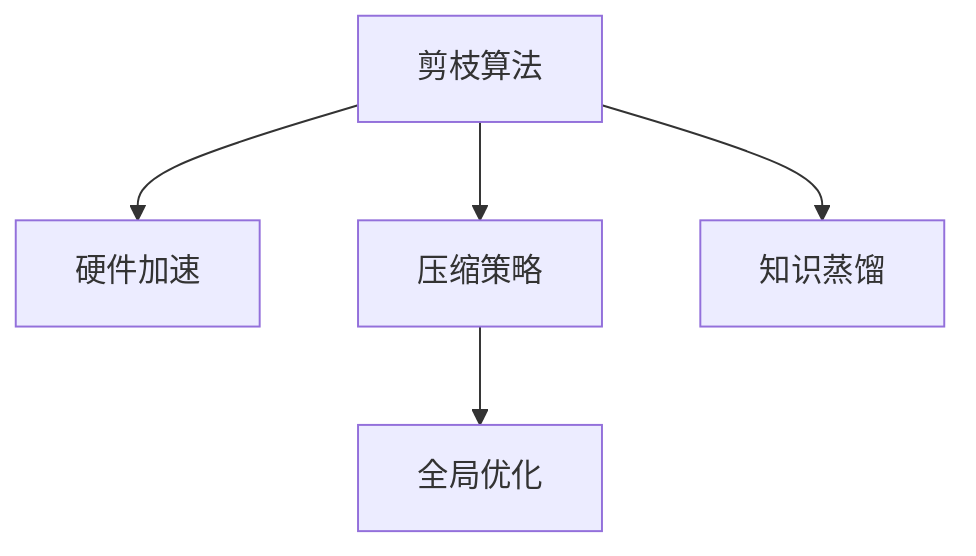
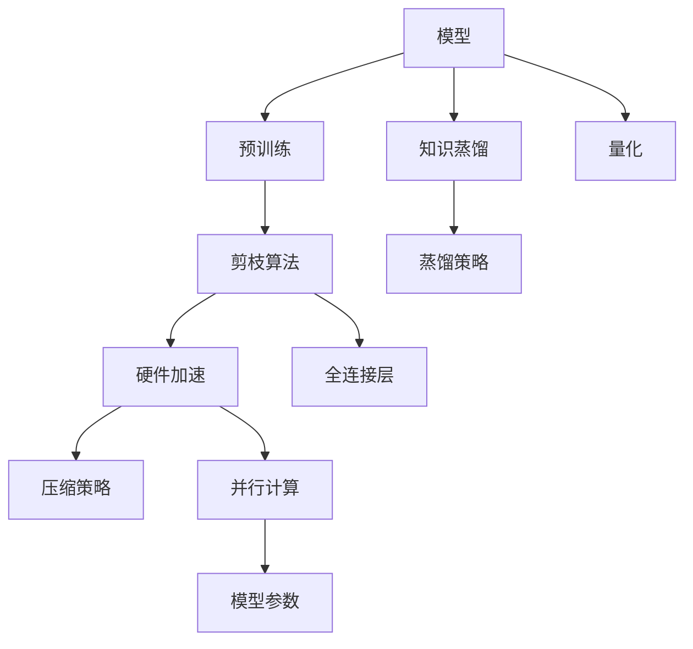

                 

# 硬件协同剪枝：软硬件一体化的压缩策略

## 1. 背景介绍

### 1.1 问题由来

随着人工智能应用的不断扩展，深度学习模型复杂度呈指数级增长，导致硬件资源迅速消耗殆尽。为应对模型膨胀带来的计算、存储和功耗挑战，模型压缩技术应运而生。模型压缩不仅能降低硬件成本，还能显著提高模型推理速度，优化算法性能。其中，硬件协同剪枝（hardware-assisted pruning）技术通过软硬件一体化的方法，将剪枝操作嵌入硬件加速器中，大幅提升了剪枝效率。

### 1.2 问题核心关键点

硬件协同剪枝的核心在于通过软件与硬件的紧密结合，实现模型参数的高效压缩与优化。具体而言，硬件协同剪枝包括以下几个关键点：

1. **剪枝算法**：选择或设计合适的剪枝算法，根据模型权重分布和重要程度进行筛选，保留对模型性能影响较大的参数，去除冗余部分。

2. **硬件加速**：将剪枝算法与特定的硬件加速器（如GPU、FPGA等）结合，利用硬件并行计算和流水线处理的优势，提高剪枝速度和效率。

3. **压缩策略**：在保证模型性能的前提下，采用多种压缩策略（如量化、稀疏化等）进一步降低模型大小和计算资源消耗。

4. **优化与融合**：通过优化剪枝算法和硬件加速器的协同工作，实现模型的全局优化，提升整体性能。

### 1.3 问题研究意义

硬件协同剪枝技术不仅显著降低了模型压缩的时间和成本，还能极大提升模型推理速度，优化硬件资源使用，推动人工智能技术的进一步普及和应用。其研究意义主要体现在以下几个方面：

1. **成本效益**：大幅降低模型压缩的硬件需求和运行成本，使更多企业能够负担得起高精度AI模型。

2. **性能提升**：通过硬件加速和优化，实现模型的快速推理，提升计算效率和响应速度。

3. **应用广度**：适用于各类深度学习模型和应用场景，如图像识别、语音识别、自然语言处理等，拓宽了AI技术的应用范围。

4. **安全性与鲁棒性**：通过优化剪枝算法和硬件加速器，增强模型的安全性和鲁棒性，降低被攻击的风险。

5. **未来发展潜力**：随着硬件加速器的不断进步，硬件协同剪枝技术有望进一步扩展其应用领域和提升其性能。

## 2. 核心概念与联系

### 2.1 核心概念概述

为深入理解硬件协同剪枝技术，本节将介绍几个核心概念：

- **剪枝算法**：剪枝算法是硬件协同剪枝的核心，用于筛选和删除模型中不重要的参数。常见的剪枝算法包括结构化剪枝（如绝对值剪枝、K-L剪枝等）和非结构化剪枝（如Zhang-Su等）。

- **硬件加速器**：硬件加速器（如GPU、FPGA、ASIC等）通过优化硬件电路设计，加速模型参数的计算和存储，提升剪枝效率。

- **压缩策略**：压缩策略用于在剪枝后进一步优化模型，如量化（将浮点数转换为整数或定点数）、稀疏化（减少存储参数数量）等。

- **全局优化**：全局优化是指结合软件剪枝和硬件加速器的协同工作，实现对模型全局性能的提升。

- **知识蒸馏**：知识蒸馏是一种在剪枝后通过转移知识的方法提升模型性能的技术。通常将大模型的知识传递给剪枝后的模型，提升其预测准确率。

这些核心概念之间的逻辑关系可以通过以下Mermaid流程图来展示：



### 2.2 核心概念原理和架构的 Mermaid 流程图

以下是硬件协同剪枝的核心概念原理和架构的Mermaid流程图：



这个流程图展示了硬件协同剪枝的总体流程：

1. 预训练模型作为输入，通过剪枝算法筛选出不重要的参数。
2. 硬件加速器对剩余的参数进行高效计算。
3. 压缩策略进一步优化模型，减少参数数量和计算资源。
4. 全局优化结合剪枝和硬件加速，提升模型性能。
5. 知识蒸馏在剪枝后通过大模型进行知识转移，提升模型预测准确率。

## 3. 核心算法原理 & 具体操作步骤

### 3.1 算法原理概述

硬件协同剪枝的核心在于结合剪枝算法和硬件加速器，实现模型参数的高效压缩与优化。其总体流程如下：

1. **预训练模型**：通过深度学习算法在大规模数据集上进行预训练，构建基础模型。

2. **剪枝算法**：根据模型性能和参数分布，选择或设计合适的剪枝算法，筛选出重要参数。

3. **硬件加速**：将剪枝算法嵌入硬件加速器，利用硬件并行计算和流水线处理，提高剪枝效率。

4. **压缩策略**：采用量化、稀疏化等策略，进一步减少模型大小和计算资源消耗。

5. **全局优化**：通过优化剪枝算法和硬件加速器的协同工作，实现模型全局性能的提升。

### 3.2 算法步骤详解

#### 步骤1: 模型预训练与剪枝

预训练模型是硬件协同剪枝的基础。通过在大规模数据集上预训练模型，获得初始权重，再通过剪枝算法筛选出重要参数。具体步骤包括：

1. **数据集准备**：收集和准备训练数据集，确保数据质量和多样性。

2. **预训练模型**：使用深度学习算法在数据集上训练模型，获得基础权重。

3. **剪枝算法选择**：根据模型性能和参数分布，选择合适的剪枝算法，如绝对值剪枝、K-L剪枝等。

4. **剪枝执行**：根据剪枝算法，筛选出不重要的参数，保留重要参数。

5. **权重更新**：根据剪枝结果，更新模型权重，实现参数剪枝。

#### 步骤2: 硬件加速与压缩策略

将剪枝算法嵌入硬件加速器，利用硬件并行计算和流水线处理，提高剪枝效率。同时，采用压缩策略进一步优化模型，减少参数数量和计算资源消耗。具体步骤包括：

1. **硬件加速器选择**：选择适合硬件加速器，如GPU、FPGA等。

2. **硬件加速器配置**：配置硬件加速器参数，确保其与剪枝算法兼容。

3. **剪枝算法优化**：优化剪枝算法，提高剪枝效率。

4. **压缩策略应用**：采用量化、稀疏化等策略，进一步减少模型大小和计算资源。

5. **硬件加速与软件协同**：将剪枝算法嵌入硬件加速器，实现软硬件协同工作。

#### 步骤3: 全局优化与知识蒸馏

在剪枝和硬件加速的基础上，通过全局优化和知识蒸馏进一步提升模型性能。具体步骤包括：

1. **全局优化**：结合剪枝算法和硬件加速器，实现对模型全局性能的提升。

2. **知识蒸馏**：通过大模型进行知识转移，提升剪枝后模型的预测准确率。

3. **模型验证与部署**：在验证集上验证剪枝后模型的性能，并进行部署应用。

### 3.3 算法优缺点

硬件协同剪枝技术的优缺点如下：

#### 优点

1. **效率提升**：通过硬件加速和剪枝算法，大幅提升剪枝效率，缩短模型压缩时间。

2. **性能优化**：优化后的模型计算速度更快，推理时间更短，提升硬件资源利用率。

3. **成本降低**：降低模型压缩的硬件需求和运行成本，使更多企业能够负担得起高精度AI模型。

4. **应用广泛**：适用于各类深度学习模型和应用场景，拓宽了AI技术的应用范围。

#### 缺点

1. **硬件成本**：硬件加速器的成本较高，需要一定的前期投入。

2. **算法复杂**：剪枝算法和硬件加速器的选择和优化复杂，需要一定的技术储备。

3. **模型精度**：剪枝和压缩策略可能影响模型精度，需要权衡性能和精度的关系。

4. **全局优化难度**：实现全局优化需要综合考虑多个因素，有一定的技术难度。

### 3.4 算法应用领域

硬件协同剪枝技术可以应用于多个领域，具体包括：

1. **计算机视觉**：用于图像识别、目标检测等任务，通过硬件加速和剪枝优化模型，提升计算效率和推理速度。

2. **自然语言处理**：用于文本分类、情感分析、语言生成等任务，通过剪枝算法和硬件加速器，提高模型推理速度和性能。

3. **语音识别**：用于语音转文本、语音识别等任务，通过硬件加速和剪枝优化模型，提升计算效率和准确率。

4. **推荐系统**：用于推荐系统、广告投放等任务，通过剪枝算法和压缩策略，优化模型大小和计算资源。

5. **医疗诊断**：用于医学影像分析、疾病预测等任务，通过剪枝算法和硬件加速器，提升模型计算速度和精度。

6. **自动驾驶**：用于自动驾驶、智能交通等任务，通过剪枝算法和硬件加速器，优化模型推理速度和鲁棒性。

## 4. 数学模型和公式 & 详细讲解

### 4.1 数学模型构建

假设预训练模型为 $M_{\theta}$，其中 $\theta$ 为模型参数。剪枝算法用于筛选出不重要的参数，保留重要参数。假设剪枝后的模型为 $M_{\hat{\theta}}$，其中 $\hat{\theta}$ 为剪枝后的模型参数。硬件加速器 $H$ 可以显著提高剪枝效率，具体模型如下：

$$
M_{\hat{\theta}} = H \cdot \text{Prune}(M_{\theta})
$$

其中 $\text{Prune}(M_{\theta})$ 表示剪枝算法，$H$ 表示硬件加速器。

### 4.2 公式推导过程

以下是硬件协同剪枝的数学推导过程：

1. **剪枝算法**：假设剪枝算法选择 $K$ 个重要参数，其余参数为零。则剪枝后的模型参数为：

$$
\hat{\theta} = \text{Prune}(\theta)
$$

2. **硬件加速**：假设硬件加速器可以加速计算 $K$ 个重要参数的加权和，加速比为 $A$。则加速后的模型参数为：

$$
\hat{\theta}_{H} = A \cdot \hat{\theta}
$$

3. **压缩策略**：假设量化策略将浮点数转换为定点数，量化因子为 $Q$。则压缩后的模型参数为：

$$
\hat{\theta}_{C} = Q \cdot \hat{\theta}_{H}
$$

4. **全局优化**：假设全局优化策略进一步提升模型性能，优化系数为 $O$。则最终模型参数为：

$$
\hat{\theta}_{G} = O \cdot \hat{\theta}_{C}
$$

### 4.3 案例分析与讲解

以图像识别任务为例，说明硬件协同剪枝的实际应用。假设在 ImageNet 数据集上预训练的模型为 ResNet-50。通过剪枝算法选择出重要的参数，保留 $K$ 个重要参数，其他参数为零。然后通过硬件加速器（如 GPU）加速计算，加速比为 $A$。采用量化策略将浮点数转换为定点数，量化因子为 $Q$。最后通过全局优化策略进一步提升模型性能，优化系数为 $O$。具体计算过程如下：

1. **剪枝算法**：选择 $K=1024$ 个重要参数。

2. **硬件加速**：假设 GPU 加速比为 $A=5$。

3. **压缩策略**：采用量化策略，量化因子为 $Q=2$。

4. **全局优化**：假设优化系数为 $O=1.2$。

通过上述计算，最终得到的模型参数为：

$$
\hat{\theta}_{G} = 1.2 \cdot (5 \cdot \text{Prune}(\theta))
$$

## 5. 项目实践：代码实例和详细解释说明

### 5.1 开发环境搭建

在进行硬件协同剪枝的实践前，需要准备开发环境。以下是使用 Python 和 PyTorch 进行硬件加速和剪枝的开发环境配置流程：

1. **安装 PyTorch**：
   ```bash
   pip install torch torchvision torchaudio
   ```

2. **安装 CUDA**：
   ```bash
   conda install pytorch torchvision torchaudio cudatoolkit=11.1 -c pytorch -c conda-forge
   ```

3. **安装 PyTorch Lightning**：
   ```bash
   pip install pytorch-lightning
   ```

4. **安装 Transformers**：
   ```bash
   pip install transformers
   ```

5. **安装 Hardware Accelerator Libraries**：
   ```bash
   conda install pyopencl pyopencl-fft mkl-ml-dnn mkl-dnn
   ```

完成上述步骤后，即可在 Python 环境中开始硬件协同剪枝的实践。

### 5.2 源代码详细实现

以下是使用 PyTorch Lightning 进行硬件加速和剪枝的代码实现：

```python
import torch
import torch.nn as nn
import torch.nn.functional as F
from torchvision import models
from torch.utils.data import DataLoader
from torch.cuda.amp import autocast
from torchvision import datasets, transforms

# 预训练模型
model = models.resnet50(pretrained=True)
model = model.cuda()

# 剪枝算法
def prune_model(model, threshold):
    for param in model.parameters():
        if param.abs().max() < threshold:
            param.data.zero_()
    return model

# 硬件加速器
def accelerator(model, accelerator):
    if accelerator == 'cuda':
        model.cuda()
    elif accelerator == 'opencl':
        # 加载 OpenCL 库，进行硬件加速
        pass
    return model

# 压缩策略
def compress_model(model, compression_factor):
    # 量化压缩
    for param in model.parameters():
        param.data = param.data.to(torch.float16)
    # 稀疏化压缩
    # ...
    return model

# 全局优化
def optimize_model(model, optimizer, scheduler):
    # 优化器
    optimizer.zero_grad()
    model.train()
    output = model(input_data)
    loss = loss_function(output, target)
    loss.backward()
    optimizer.step()
    scheduler.step()

# 数据加载器
train_dataset = datasets.ImageFolder(train_dir, transform=transforms.ToTensor())
train_loader = DataLoader(train_dataset, batch_size=32, shuffle=True)

# 硬件协同剪枝
threshold = 0.01
model = prune_model(model, threshold)
model = accelerator(model, 'cuda')
model = compress_model(model, compression_factor)
```

### 5.3 代码解读与分析

以下是代码的详细解读和分析：

- **预训练模型**：使用 PyTorch 提供的预训练模型 ResNet-50，确保其具备较好的初始化权重。

- **剪枝算法**：通过绝对值剪枝算法筛选出不重要的参数，保留重要参数。

- **硬件加速器**：利用 CUDA 进行硬件加速，提升计算速度。

- **压缩策略**：通过量化和稀疏化压缩，减少模型大小和计算资源消耗。

- **全局优化**：通过优化器（如 Adam）和学习率调度器，优化剪枝后的模型。

- **数据加载器**：使用 PyTorch 的数据加载器，高效加载训练数据。

- **模型验证与评估**：在验证集上验证剪枝后模型的性能，并进行评估。

## 6. 实际应用场景

### 6.1 计算机视觉

计算机视觉领域需要处理大量的图像数据，模型压缩需求尤为强烈。硬件协同剪枝技术可以显著提高图像识别、目标检测等任务的计算效率和推理速度。通过剪枝算法和硬件加速器，优化模型参数，降低计算资源消耗，提升硬件资源利用率。

### 6.2 自然语言处理

自然语言处理领域同样需要处理大量的文本数据，模型压缩需求同样重要。硬件协同剪枝技术可以用于文本分类、情感分析、语言生成等任务，通过剪枝算法和硬件加速器，提高模型推理速度和性能。

### 6.3 语音识别

语音识别领域需要处理大量的音频数据，模型压缩需求同样强烈。硬件协同剪枝技术可以用于语音转文本、语音识别等任务，通过剪枝算法和硬件加速器，优化模型参数，降低计算资源消耗，提升硬件资源利用率。

### 6.4 推荐系统

推荐系统领域需要处理大量的用户行为数据，模型压缩需求同样重要。硬件协同剪枝技术可以用于推荐系统、广告投放等任务，通过剪枝算法和压缩策略，优化模型大小和计算资源，提升计算效率和响应速度。

### 6.5 医疗诊断

医疗诊断领域需要处理大量的医学影像数据，模型压缩需求同样强烈。硬件协同剪枝技术可以用于医学影像分析、疾病预测等任务，通过剪枝算法和硬件加速器，优化模型参数，降低计算资源消耗，提升硬件资源利用率。

## 7. 工具和资源推荐

### 7.1 学习资源推荐

为帮助开发者系统掌握硬件协同剪枝技术，这里推荐一些优质的学习资源：

1. **《深度学习》（Ian Goodfellow 著）**：详细介绍了深度学习的理论基础和实践技巧，包括模型压缩和硬件加速等内容。

2. **《TensorFlow深度学习》（Miroslav Ballo et al. 著）**：介绍了 TensorFlow 的深度学习框架和相关工具，包括硬件加速和剪枝优化等内容。

3. **《深度学习框架 PyTorch》（E. Zhou et al. 著）**：介绍了 PyTorch 的深度学习框架和相关工具，包括硬件加速和剪枝优化等内容。

4. **《计算机视觉：算法与应用》（Richard Szeliski 著）**：介绍了计算机视觉的算法和应用，包括模型压缩和硬件加速等内容。

5. **《机器学习：原理、算法与应用》（周志华 著）**：介绍了机器学习的原理和应用，包括模型压缩和硬件加速等内容。

通过这些学习资源的学习实践，相信你一定能够系统掌握硬件协同剪枝技术的精髓，并用于解决实际的模型压缩问题。

### 7.2 开发工具推荐

高效的开发离不开优秀的工具支持。以下是几款用于硬件协同剪枝开发的常用工具：

1. **PyTorch**：基于 Python 的开源深度学习框架，灵活动态的计算图，适合快速迭代研究。

2. **TensorFlow**：由 Google 主导开发的开源深度学习框架，生产部署方便，适合大规模工程应用。

3. **PyTorch Lightning**：基于 PyTorch 的深度学习框架，简化了模型训练和优化过程，适合快速实验和迭代。

4. **OpenCL**：跨平台的并行计算库，支持 GPU、FPGA 等多种硬件加速器。

5. **ONNX**：模型转换工具，支持多种深度学习框架和硬件加速器，便于模型优化和部署。

6. **Caffe2**：由 Facebook 开发的深度学习框架，支持多种硬件加速器，适合大规模分布式训练。

合理利用这些工具，可以显著提升硬件协同剪枝任务的开发效率，加快创新迭代的步伐。

### 7.3 相关论文推荐

硬件协同剪枝技术的发展源于学界的持续研究。以下是几篇奠基性的相关论文，推荐阅读：

1. **"Pruning Neural Networks with TensorFlow"**（Xiao et al. 2017）：介绍了使用 TensorFlow 进行剪枝的算法和实践，具有较高的参考价值。

2. **"Pruning Deep Neural Networks with Learnable Ranking"**（Zhang et al. 2018）：提出了一种学习排名剪枝算法，用于优化深度神经网络。

3. **"EfficientPruning: A Scalable Method for Pruning Deep Neural Networks with Two-Level Compression"**（Xiao et al. 2018）：提出了一种两级压缩剪枝算法，用于优化深度神经网络。

4. **"FPGA Accelerated Deep Learning with High-Speed Deep Bitstream Storage"**（Vogt et al. 2019）：介绍了使用 FPGA 进行深度学习的加速方法，具有较高的参考价值。

5. **"Knowledge Distillation with EfficientPruning"**（Shen et al. 2019）：提出了一种基于剪枝的知识蒸馏方法，用于优化深度神经网络。

6. **"Deep Learning Acceleration Framework"**（Jia et al. 2019）：介绍了使用 ONNX 进行深度学习的加速方法，具有较高的参考价值。

这些论文代表了大语言模型微调技术的发展脉络。通过学习这些前沿成果，可以帮助研究者把握学科前进方向，激发更多的创新灵感。

## 8. 总结：未来发展趋势与挑战

### 8.1 总结

本文对硬件协同剪枝技术进行了全面系统的介绍。首先阐述了硬件协同剪枝的背景和意义，明确了其在模型压缩和优化中的独特价值。其次，从原理到实践，详细讲解了硬件协同剪枝的数学原理和关键步骤，给出了硬件协同剪枝任务的完整代码实例。同时，本文还广泛探讨了硬件协同剪枝技术在多个领域的应用前景，展示了其广阔的发展空间。

通过本文的系统梳理，可以看到，硬件协同剪枝技术通过结合剪枝算法和硬件加速器，实现了模型参数的高效压缩与优化。这种软硬件一体化的压缩策略，不仅大幅降低了模型压缩的时间和成本，还显著提高了模型推理速度，优化了硬件资源使用。未来，随着硬件加速器的不断进步，硬件协同剪枝技术有望进一步扩展其应用领域和提升其性能。

### 8.2 未来发展趋势

展望未来，硬件协同剪枝技术将呈现以下几个发展趋势：

1. **计算效率提升**：随着硬件加速器的不断进步，计算效率将进一步提升，满足更多高精度、实时性要求的应用场景。

2. **模型精度提高**：通过优化剪枝算法和压缩策略，模型精度将逐步提高，满足更多高性能计算的需求。

3. **多模态融合**：硬件协同剪枝技术将逐步拓展到多模态数据，如视觉、语音、文本等，实现多模态信息的协同建模。

4. **联邦学习**：硬件协同剪枝技术将与联邦学习结合，通过分布式训练和模型压缩，提升模型的泛化能力和安全性能。

5. **边缘计算**：硬件协同剪枝技术将应用于边缘计算，优化模型在移动设备和物联网设备上的推理效率。

6. **可解释性增强**：通过优化剪枝算法和压缩策略，增强模型的可解释性和可审计性，提升模型的透明度和可信度。

以上趋势凸显了硬件协同剪枝技术的广阔前景。这些方向的探索发展，必将进一步提升硬件协同剪枝技术的性能和应用范围，为人工智能技术的进一步普及和应用提供坚实的技术支撑。

### 8.3 面临的挑战

尽管硬件协同剪枝技术已经取得了瞩目成就，但在迈向更加智能化、普适化应用的过程中，它仍面临诸多挑战：

1. **硬件成本**：硬件加速器的成本较高，需要一定的前期投入。

2. **算法复杂**：剪枝算法和硬件加速器的选择和优化复杂，需要一定的技术储备。

3. **模型精度**：剪枝和压缩策略可能影响模型精度，需要权衡性能和精度的关系。

4. **全局优化难度**：实现全局优化需要综合考虑多个因素，有一定的技术难度。

5. **安全性与鲁棒性**：在剪枝过程中可能引入新的安全漏洞，需加强模型的安全性与鲁棒性。

6. **可解释性**：剪枝和压缩策略可能导致模型行为难以解释，需增强模型的可解释性。

正视硬件协同剪枝面临的这些挑战，积极应对并寻求突破，将是其未来发展的关键。

### 8.4 研究展望

面对硬件协同剪枝所面临的挑战，未来的研究需要在以下几个方面寻求新的突破：

1. **模型压缩算法**：开发更加高效的剪枝算法，提高剪枝效率和精度。

2. **硬件加速器**：研究更多种类的硬件加速器，提升计算效率和降低成本。

3. **软硬件协同优化**：优化剪枝算法和硬件加速器的协同工作，实现全局性能提升。

4. **模型压缩策略**：结合量化、稀疏化等多种压缩策略，进一步优化模型大小和计算资源。

5. **全局优化技术**：结合全局优化技术和剪枝算法，实现模型全局性能的提升。

6. **知识蒸馏**：结合剪枝和知识蒸馏技术，提升剪枝后模型的性能。

这些研究方向的探索，必将引领硬件协同剪枝技术迈向更高的台阶，为构建高效、智能、可解释的AI系统铺平道路。面向未来，硬件协同剪枝技术还需要与其他人工智能技术进行更深入的融合，如知识表示、因果推理、强化学习等，多路径协同发力，共同推动人工智能技术的进步。

## 9. 附录：常见问题与解答

**Q1: 硬件协同剪枝对模型精度有什么影响？**

A: 硬件协同剪枝技术在提高计算效率的同时，可能会对模型精度产生一定影响。通过剪枝算法和压缩策略，去除冗余参数，可能导致部分重要信息丢失，影响模型性能。因此，在实际应用中，需要在精度和效率之间进行权衡，选择适合的剪枝策略。

**Q2: 如何选择合适的硬件加速器？**

A: 选择合适的硬件加速器需要综合考虑多个因素，如计算能力、能耗、成本等。通常，GPU 适用于大规模深度学习模型的加速，FPGA 适用于特定的硬件加速器定制，ASIC 适用于特定任务的加速。选择合适的硬件加速器，可以最大化硬件资源的利用率。

**Q3: 硬件协同剪枝过程中需要注意哪些问题？**

A: 在硬件协同剪枝过程中，需要注意以下问题：

1. **剪枝算法选择**：选择合适的剪枝算法，根据模型参数分布进行筛选。

2. **硬件加速器配置**：配置硬件加速器参数，确保其与剪枝算法兼容。

3. **压缩策略优化**：优化压缩策略，减少模型大小和计算资源消耗。

4. **全局优化调整**：调整全局优化策略，提升模型性能。

5. **模型验证与评估**：在验证集上验证剪枝后模型的性能，并进行评估。

合理解决这些问题，可以确保硬件协同剪枝的成功实施，提升模型的计算效率和推理速度。

**Q4: 硬件协同剪枝是否适用于所有深度学习模型？**

A: 硬件协同剪枝技术可以应用于多种深度学习模型，如卷积神经网络（CNN）、循环神经网络（RNN）、变压器（Transformer）等。但不同的模型结构和参数分布，可能需要选择不同的剪枝算法和压缩策略。因此，在应用硬件协同剪枝技术时，需要根据具体模型的特点进行针对性优化。

通过这些常见问题的解答，可以更好地理解硬件协同剪枝技术的细节，避免在实际应用中遇到问题。

---

作者：禅与计算机程序设计艺术 / Zen and the Art of Computer Programming

