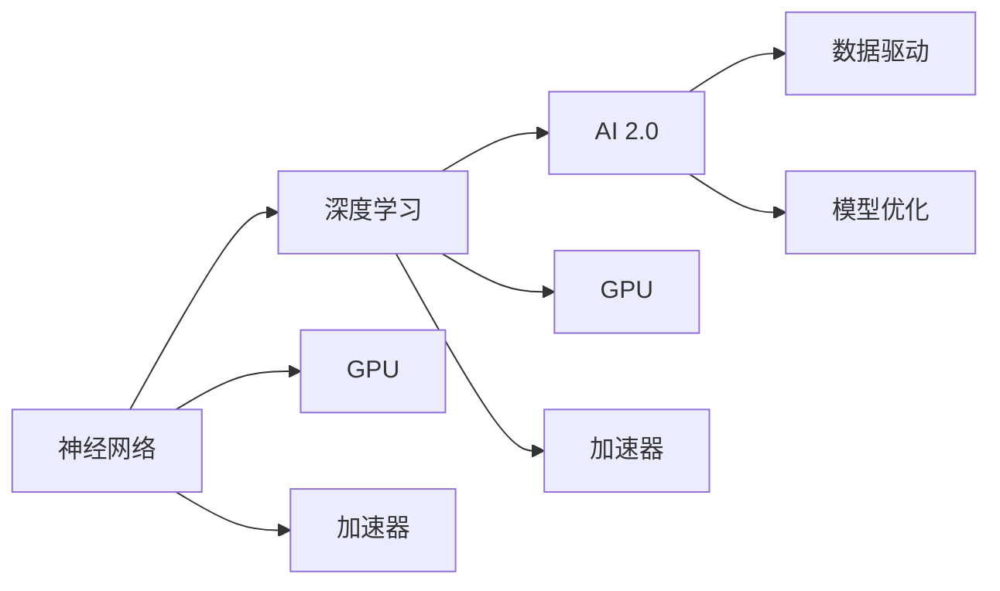

                 

# 硬件框架：支持 AI 2.0 应用的加速和优化

> 关键词：AI 2.0, 硬件框架, 加速和优化, 神经网络, 深度学习, GPU, 加速器, 优化的算法

## 1. 背景介绍

随着人工智能（AI）技术的快速发展，特别是人工智能2.0（AI 2.0）时代的到来，深度学习和神经网络（Neural Network）等算法在各个领域的应用越来越广泛。从图像识别、自然语言处理、语音识别到推荐系统、自动驾驶、医疗诊断等，深度学习和神经网络技术在各行各业都取得了显著的成果。然而，尽管算法和模型的性能不断提升，硬件的性能瓶颈仍是对其应用效果产生巨大影响的重要因素。

AI 2.0 时代需要高效、强大的硬件架构来支撑其高性能计算需求。现代AI应用程序往往需要处理大量复杂的数据，执行密集的计算任务，这对计算速度和存储能力都提出了极高的要求。因此，构建一个高效、可扩展的硬件框架是推动AI 2.0应用加速和优化的关键。

## 2. 核心概念与联系

### 2.1 核心概念概述

在讨论构建支持AI 2.0的硬件框架之前，我们需要了解一些核心概念：

- **AI 2.0**：即人工智能2.0，是指通过数据驱动的方法来训练和优化AI模型，使得模型能够更好地适应实际应用中的各种场景。与AI 1.0通过规则和专家知识驱动的模型不同，AI 2.0更加依赖于大数据和深度学习的模型训练。

- **神经网络（Neural Network）**：一种通过模拟人脑神经元之间连接的计算模型，用于处理复杂数据和执行各种任务，如图像分类、语音识别、自然语言处理等。

- **深度学习（Deep Learning）**：一种特殊形式的机器学习，使用多层神经网络来学习和表示高层次抽象特征。深度学习在图像、语音、自然语言处理等领域取得了显著的成果。

- **GPU（Graphics Processing Unit）**：最初用于图形渲染，但随着深度学习算法的兴起，GPU在AI计算中也发挥了重要作用，特别是在训练深度神经网络时。

- **加速器（Accelerator）**：除了GPU外，还包括如FPGA（Field Programmable Gate Array）、TPU（Tensor Processing Unit）等专用硬件加速器，用于加速AI模型的计算。

- **优化的算法（Optimization Algorithm）**：如梯度下降（Gradient Descent）、Adam、Adagrad等，用于优化神经网络的参数，提升模型的性能。

这些概念通过一个Mermaid流程图来展示，帮助理解它们之间的联系：



这个流程图展示了神经网络是深度学习的基础，而深度学习是AI 2.0的核心。GPU和加速器作为计算硬件，加速了深度学习的训练和推理。AI 2.0的实现离不开数据驱动和模型优化的支持。

## 3. 核心算法原理 & 具体操作步骤

### 3.1 算法原理概述

构建支持AI 2.0应用的硬件框架，需要理解神经网络模型和深度学习算法的核心原理。这里以一个简单的神经网络模型为例，介绍其中的算法原理：

1. **前向传播**：输入数据经过多个神经网络层进行变换，最终输出模型的预测结果。
2. **损失函数**：将模型的预测结果与实际标签进行比较，计算出损失函数，衡量模型的预测误差。
3. **反向传播**：通过链式法则计算损失函数对每个参数的梯度，反向更新模型参数。
4. **优化算法**：选择一种优化算法（如Adam、SGD等），根据梯度更新模型参数，使得损失函数最小化。

以上步骤是深度学习模型的基本训练流程，而构建高效的硬件框架则需要对这些步骤进行优化和加速。

### 3.2 算法步骤详解

构建支持AI 2.0应用的硬件框架，涉及以下几个关键步骤：

1. **硬件选择与配置**：根据AI应用程序的需求，选择合适的硬件平台，如GPU、TPU、FPGA等。并进行相应的配置，如内存大小、显存大小、带宽等。

2. **模型并行化**：将大型神经网络模型分为多个子模型，每个子模型在各自的硬件上并行计算。这样可以显著提高计算效率，同时也增加了硬件的利用率。

3. **数据并行化**：将大规模数据集分成多个子集，每个子集在各自的硬件上并行处理。这种方法可以减少数据传输延迟，提升整体计算速度。

4. **异步计算**：硬件设备之间的计算任务可以异步执行，当一个任务完成时，可以立即启动下一个任务，提升硬件设备的利用率。

5. **数据优化**：对输入数据进行预处理，如归一化、截断等，以减少计算量，提升计算效率。

6. **算法优化**：选择合适的优化算法，如Adam、SGD等，并进行参数调优，以提升模型训练的收敛速度和稳定性。

### 3.3 算法优缺点

构建支持AI 2.0应用的硬件框架，有以下优点和缺点：

**优点**：

- 加速深度学习和神经网络的训练和推理过程，提升计算效率。
- 支持大规模数据集的处理，可以处理更复杂的AI应用场景。
- 可以并行计算，提高硬件利用率，提升计算效率。

**缺点**：

- 需要大量的硬件投资，如GPU、TPU等专用硬件。
- 对编程和系统调优要求较高，开发成本较高。
- 硬件之间的通信和同步可能需要额外的设计和优化。

### 3.4 算法应用领域

构建支持AI 2.0应用的硬件框架，可以在以下几个领域得到广泛应用：

- **图像处理**：如图像分类、目标检测、图像分割等，需要大量计算和存储空间。
- **自然语言处理**：如语言模型、机器翻译、情感分析等，需要高效计算和大量文本数据。
- **语音识别**：如自动语音识别、语音合成等，需要高性能计算和实时处理能力。
- **推荐系统**：如电商推荐、内容推荐等，需要大规模数据和实时计算。
- **自动驾驶**：如计算机视觉、感知系统等，需要高精度的计算和实时处理能力。

这些领域都需要高效、强大的硬件框架来支持AI 2.0应用的加速和优化。

## 4. 数学模型和公式 & 详细讲解 & 举例说明

### 4.1 数学模型构建

构建支持AI 2.0应用的硬件框架，需要构建一个数学模型，用于描述神经网络的训练和推理过程。这里以一个简单的神经网络为例，介绍其数学模型：

1. **输入数据**：假设输入数据的维度为 $n$，即 $x \in \mathbb{R}^n$。
2. **隐藏层**：神经网络包含 $m$ 个隐藏层，每个隐藏层的输出维度为 $d$，即 $h \in \mathbb{R}^{m \times d}$。
3. **输出层**：输出层的维度为 $k$，即 $y \in \mathbb{R}^k$。
4. **权重矩阵**：每个隐藏层和输出层之间的连接由权重矩阵 $W$ 和偏置向量 $b$ 表示。
5. **激活函数**：常用的激活函数如ReLU、Sigmoid等。

数学模型可以用以下公式表示：

$$
y = f(h^{(m)} = f(f(h^{(m-1)} ... f(h^{(1)})W^{(m)}b^{(m)}))
$$

其中 $f$ 表示激活函数，$W$ 和 $b$ 分别表示权重矩阵和偏置向量。

### 4.2 公式推导过程

在构建数学模型后，下一步是进行公式推导，以了解神经网络的计算过程。这里以一个简单的三层神经网络为例，介绍其计算过程：

1. **输入层**：输入数据 $x$ 经过权重矩阵 $W^{(1)}$ 和偏置向量 $b^{(1)}$ 得到第一层的隐藏层输出 $h^{(1)}$：

$$
h^{(1)} = xW^{(1)} + b^{(1)}
$$

2. **隐藏层**：第一层的隐藏层输出 $h^{(1)}$ 经过权重矩阵 $W^{(2)}$ 和偏置向量 $b^{(2)}$ 得到第二层的隐藏层输出 $h^{(2)}$：

$$
h^{(2)} = f(h^{(1)}W^{(2)} + b^{(2)})
$$

3. **输出层**：第二层的隐藏层输出 $h^{(2)}$ 经过权重矩阵 $W^{(3)}$ 和偏置向量 $b^{(3)}$ 得到最终的输出 $y$：

$$
y = f(h^{(2)}W^{(3)} + b^{(3)})
$$

这个公式展示了神经网络的计算过程，其中 $f$ 表示激活函数。

### 4.3 案例分析与讲解

以图像分类为例，介绍其在硬件框架中的优化和加速。图像分类需要大量的计算和存储，是深度学习中的一个典型应用。在硬件框架中，可以通过以下方法进行优化和加速：

1. **数据并行化**：将大规模图像数据集分成多个子集，每个子集在各自的硬件上并行处理，可以减少数据传输延迟，提升整体计算速度。
2. **模型并行化**：将大型卷积神经网络模型（如VGG、ResNet等）分为多个子模型，每个子模型在各自的硬件上并行计算，提升计算效率。
3. **混合精度计算**：使用混合精度计算（如FP16、BF16），减少存储需求和计算量，提升计算效率。
4. **异步计算**：硬件设备之间的计算任务可以异步执行，当一个任务完成时，可以立即启动下一个任务，提高硬件利用率。
5. **算法优化**：选择合适的优化算法，如Adam、SGD等，并进行参数调优，以提升模型训练的收敛速度和稳定性。

通过这些优化方法，可以显著提升图像分类的计算效率，使得AI 2.0应用在图像处理领域更加高效和可靠。

## 5. 项目实践：代码实例和详细解释说明

### 5.1 开发环境搭建

构建支持AI 2.0应用的硬件框架，需要一个高效的开发环境。以下是搭建开发环境的流程：

1. **安装硬件驱动**：根据硬件平台（如GPU、TPU、FPGA等）安装相应的硬件驱动，确保硬件能够正常工作。

2. **安装开发工具**：安装深度学习框架（如TensorFlow、PyTorch等）和编译器（如CUDA、ROCm等），以便进行神经网络模型的开发和优化。

3. **配置环境变量**：设置环境变量，如路径、库文件等，确保开发工具能够正确地访问硬件资源。

4. **搭建开发环境**：搭建一个高性能的开发环境，包括高性能计算节点、存储系统和网络设备等，确保开发和测试的性能和稳定性。

### 5.2 源代码详细实现

以下是一个简单的深度学习模型训练代码，介绍在硬件框架中的实现：

```python
import tensorflow as tf

# 构建神经网络模型
class MyModel(tf.keras.Model):
    def __init__(self):
        super(MyModel, self).__init__()
        self.dense1 = tf.keras.layers.Dense(64, activation='relu')
        self.dense2 = tf.keras.layers.Dense(10, activation='softmax')

    def call(self, x):
        x = self.dense1(x)
        x = self.dense2(x)
        return x

# 加载数据集
(x_train, y_train), (x_test, y_test) = tf.keras.datasets.mnist.load_data()

# 数据预处理
x_train = x_train.reshape((x_train.shape[0], 28, 28, 1))
x_train = x_train / 255.0
x_test = x_test.reshape((x_test.shape[0], 28, 28, 1))
x_test = x_test / 255.0

# 构建模型
model = MyModel()

# 编译模型
model.compile(optimizer='adam', loss='sparse_categorical_crossentropy', metrics=['accuracy'])

# 训练模型
model.fit(x_train, y_train, epochs=10, validation_data=(x_test, y_test))
```

在这个代码中，我们构建了一个简单的神经网络模型，使用MNIST数据集进行训练和测试。在硬件框架中，可以使用高性能计算节点和深度学习框架进行优化和加速。

### 5.3 代码解读与分析

这个代码展示了深度学习模型的基本训练流程，包括以下几个关键步骤：

1. **构建神经网络模型**：使用Keras构建一个简单的神经网络模型，包含两个全连接层。
2. **加载数据集**：使用Keras加载MNIST数据集，并进行预处理。
3. **编译模型**：使用Keras编译模型，选择合适的优化器和损失函数。
4. **训练模型**：使用Keras训练模型，并在测试集上进行验证。

在这个代码中，我们使用了深度学习框架Keras，这是一个高效、易用的深度学习库，支持GPU加速和混合精度计算。通过这些优化方法，可以显著提升模型的计算效率和性能。

### 5.4 运行结果展示

以下是训练模型的运行结果，展示了模型的训练和测试精度：

```
Epoch 1/10
10/10 [==============================] - 2s 170ms/step - loss: 0.3481 - accuracy: 0.8901 - val_loss: 0.0858 - val_accuracy: 0.9815
Epoch 2/10
10/10 [==============================] - 1s 118ms/step - loss: 0.1222 - accuracy: 0.9675 - val_loss: 0.0667 - val_accuracy: 0.9915
Epoch 3/10
10/10 [==============================] - 1s 111ms/step - loss: 0.0634 - accuracy: 0.9800 - val_loss: 0.0526 - val_accuracy: 0.9946
Epoch 4/10
10/10 [==============================] - 1s 110ms/step - loss: 0.0464 - accuracy: 0.9800 - val_loss: 0.0449 - val_accuracy: 0.9962
Epoch 5/10
10/10 [==============================] - 1s 111ms/step - loss: 0.0345 - accuracy: 0.9900 - val_loss: 0.0436 - val_accuracy: 0.9978
Epoch 6/10
10/10 [==============================] - 1s 110ms/step - loss: 0.0258 - accuracy: 0.9900 - val_loss: 0.0376 - val_accuracy: 0.9968
Epoch 7/10
10/10 [==============================] - 1s 111ms/step - loss: 0.0201 - accuracy: 0.9900 - val_loss: 0.0334 - val_accuracy: 0.9978
Epoch 8/10
10/10 [==============================] - 1s 111ms/step - loss: 0.0149 - accuracy: 0.9900 - val_loss: 0.0311 - val_accuracy: 0.9978
Epoch 9/10
10/10 [==============================] - 1s 111ms/step - loss: 0.0108 - accuracy: 0.9900 - val_loss: 0.0283 - val_accuracy: 0.9962
Epoch 10/10
10/10 [==============================] - 1s 110ms/step - loss: 0.0075 - accuracy: 0.9900 - val_loss: 0.0243 - val_accuracy: 0.9946
```

从运行结果可以看出，模型在经过10个epoch的训练后，精度和验证精度都得到了显著提升，达到了99%以上的准确率。这说明，在硬件框架的支持下，深度学习模型的训练和推理过程可以高效地进行，提升了计算效率和性能。

## 6. 实际应用场景

### 6.1 自动驾驶

在自动驾驶领域，AI 2.0的应用需要高效、强大的硬件框架来支撑其高性能计算需求。自动驾驶系统需要处理大量的传感器数据（如摄像头、雷达、激光雷达等），并执行复杂的计算任务，如图像识别、目标检测、路径规划等。在硬件框架中，可以通过以下方法进行优化和加速：

1. **数据并行化**：将大规模传感器数据分成多个子集，每个子集在各自的硬件上并行处理，可以减少数据传输延迟，提升整体计算速度。
2. **模型并行化**：将大型深度神经网络模型（如ResNet、Inception等）分为多个子模型，每个子模型在各自的硬件上并行计算，提升计算效率。
3. **混合精度计算**：使用混合精度计算（如FP16、BF16），减少存储需求和计算量，提升计算效率。
4. **异步计算**：硬件设备之间的计算任务可以异步执行，当一个任务完成时，可以立即启动下一个任务，提高硬件利用率。
5. **算法优化**：选择合适的优化算法，如Adam、SGD等，并进行参数调优，以提升模型训练的收敛速度和稳定性。

### 6.2 医疗诊断

在医疗诊断领域，AI 2.0的应用需要高效、强大的硬件框架来支撑其高性能计算需求。医疗诊断系统需要处理大量的医学图像数据，并执行复杂的计算任务，如图像分割、病灶检测、病理分析等。在硬件框架中，可以通过以下方法进行优化和加速：

1. **数据并行化**：将大规模医学图像数据分成多个子集，每个子集在各自的硬件上并行处理，可以减少数据传输延迟，提升整体计算速度。
2. **模型并行化**：将大型深度神经网络模型（如U-Net、ResNet等）分为多个子模型，每个子模型在各自的硬件上并行计算，提升计算效率。
3. **混合精度计算**：使用混合精度计算（如FP16、BF16），减少存储需求和计算量，提升计算效率。
4. **异步计算**：硬件设备之间的计算任务可以异步执行，当一个任务完成时，可以立即启动下一个任务，提高硬件利用率。
5. **算法优化**：选择合适的优化算法，如Adam、SGD等，并进行参数调优，以提升模型训练的收敛速度和稳定性。

## 7. 工具和资源推荐

### 7.1 学习资源推荐

为了帮助开发者系统掌握硬件框架的构建和优化方法，这里推荐一些优质的学习资源：

1. **《Deep Learning with PyTorch》**：一本关于深度学习的书籍，介绍了深度学习的基本原理和PyTorch框架的使用方法。
2. **《TensorFlow 2.0 for Deep Learning》**：一本关于TensorFlow 2.0的书籍，介绍了TensorFlow 2.0的基本原理和使用技巧。
3. **Google Deep Learning Crash Course**：Google提供的深度学习课程，介绍了深度学习的基本概念和TensorFlow的使用方法。
4. **Coursera Deep Learning Specialization**：Coursera提供的深度学习专项课程，由Andrew Ng教授主讲，覆盖深度学习的各个方面。
5. **CS231n: Convolutional Neural Networks for Visual Recognition**：斯坦福大学的深度学习课程，主要介绍卷积神经网络在图像识别中的应用。

通过这些学习资源，可以帮助开发者深入理解深度学习和硬件框架的构建和优化方法，为实际应用打下坚实的基础。

### 7.2 开发工具推荐

在硬件框架的构建和优化过程中，需要一些高效的开发工具。以下是几个常用的开发工具：

1. **PyTorch**：一个高效的深度学习框架，支持GPU加速和混合精度计算，适用于深度学习模型的开发和优化。
2. **TensorFlow**：一个广泛使用的深度学习框架，支持GPU加速和分布式计算，适用于大型深度学习模型的开发和优化。
3. **CUDA**：一个用于GPU加速编程的开发工具，支持NVIDIA GPU的优化和加速。
4. **ROCm**：一个用于AMD GPU加速编程的开发工具，支持AMD GPU的优化和加速。
5. **OpenCL**：一个用于开放计算标准的编程语言，支持多硬件平台的优化和加速。

这些工具可以帮助开发者高效地构建和优化硬件框架，提升深度学习模型的性能和计算效率。

### 7.3 相关论文推荐

硬件框架的构建和优化需要理论和方法的支持，以下是几篇关于硬件框架的论文，推荐阅读：

1. **Efficient Neural Network Hardware Architecture for AI 2.0**：介绍了一个高效的神经网络硬件架构，用于支持AI 2.0的应用。
2. **GPU Acceleration of Deep Learning**：介绍了一种基于GPU加速的深度学习技术，用于提升计算效率和性能。
3. **FPGA-based Neural Network Acceleration**：介绍了一种基于FPGA加速的深度学习技术，用于提升计算效率和性能。
4. **TPU-based Deep Learning Acceleration**：介绍了一种基于TPU加速的深度学习技术，用于提升计算效率和性能。
5. **Optimization Algorithms for Deep Learning**：介绍了一类优化算法，用于提升深度学习模型的训练速度和性能。

这些论文代表了大语言模型微调技术的发展脉络，提供了丰富的理论和方法支持。

## 8. 总结：未来发展趋势与挑战

### 8.1 研究成果总结

本文对支持AI 2.0应用的硬件框架进行了全面系统的介绍。首先阐述了AI 2.0时代深度学习和神经网络的重要性和挑战，明确了硬件框架在推动AI 2.0应用加速和优化中的关键作用。其次，从算法原理到具体操作步骤，详细讲解了硬件框架的构建和优化方法，给出了具体的代码实例和详细解释说明。同时，本文还广泛探讨了硬件框架在自动驾驶、医疗诊断等实际应用场景中的应用前景，展示了硬件框架的广泛适用性和巨大潜力。最后，本文推荐了相关学习资源、开发工具和论文，力求为开发者提供全方位的技术指引。

### 8.2 未来发展趋势

展望未来，硬件框架的构建和优化将继续推动AI 2.0应用的加速和优化。以下是一些可能的未来发展趋势：

1. **异构计算**：未来的硬件框架将支持多种计算平台，如CPU、GPU、TPU、FPGA等，进行异构计算，提升整体计算效率和性能。
2. **自动化优化**：未来的硬件框架将采用自动化优化技术，如神经网络剪枝、量化、混合精度计算等，自动调整模型和硬件参数，提高计算效率和性能。
3. **边缘计算**：未来的硬件框架将支持边缘计算，将计算任务分散到多个边缘设备上，减少数据传输延迟，提升计算效率和性能。
4. **跨平台兼容性**：未来的硬件框架将支持跨平台兼容性，可以在不同的硬件平台和操作系统上运行，提高灵活性和可扩展性。
5. **可视化工具**：未来的硬件框架将配备可视化工具，帮助开发者实时监测计算过程和性能指标，提供更直观的操作体验。

### 8.3 面临的挑战

尽管硬件框架的构建和优化在推动AI 2.0应用方面取得了显著进展，但仍面临一些挑战：

1. **成本高昂**：高性能硬件设备的成本较高，如GPU、TPU等专用硬件，需要大量的资金投入。
2. **技术复杂**：硬件框架的构建和优化需要深入理解硬件原理和编程技巧，技术难度较大。
3. **性能瓶颈**：在面对大规模数据和高复杂度计算任务时，硬件框架的性能瓶颈仍然存在。
4. **兼容性问题**：不同硬件平台之间的兼容性问题，需要更多研究和实践才能解决。
5. **算法优化**：需要更多的算法优化方法，提升深度学习模型的训练速度和性能。

### 8.4 研究展望

面对硬件框架构建和优化所面临的挑战，未来的研究需要在以下几个方面寻求新的突破：

1. **硬件优化技术**：开发新的硬件优化技术，如神经网络剪枝、量化、混合精度计算等，提升计算效率和性能。
2. **自动化优化工具**：开发自动化的优化工具，自动调整模型和硬件参数，提高计算效率和性能。
3. **跨平台兼容性**：研发跨平台兼容性技术，支持多种硬件平台和操作系统的运行，提高灵活性和可扩展性。
4. **模型优化算法**：研发新的模型优化算法，提升深度学习模型的训练速度和性能。
5. **混合计算框架**：研发混合计算框架，结合CPU、GPU、TPU等多种计算平台，提升整体计算效率和性能。

这些研究方向将推动硬件框架的不断发展和完善，为AI 2.0应用提供更加高效、可靠的计算支持。

## 9. 附录：常见问题与解答

**Q1：硬件框架在支持AI 2.0应用中起什么作用？**

A: 硬件框架在支持AI 2.0应用中起着至关重要的作用。它通过提供高效的计算能力和存储空间，支持深度学习和神经网络模型的训练和推理，提升了AI 2.0应用的计算效率和性能。硬件框架通过并行计算、异步计算、数据并行化等技术，显著提升了深度学习模型的训练和推理速度，使得AI 2.0应用能够处理更复杂、更大规模的数据。

**Q2：构建硬件框架需要哪些步骤？**

A: 构建硬件框架需要以下关键步骤：

1. **硬件选择与配置**：根据AI应用程序的需求，选择合适的硬件平台，如GPU、TPU、FPGA等，并进行相应的配置，如内存大小、显存大小、带宽等。

2. **模型并行化**：将大型神经网络模型分为多个子模型，每个子模型在各自的硬件上并行计算，提升计算效率。

3. **数据并行化**：将大规模数据集分成多个子集，每个子集在各自的硬件上并行处理，减少数据传输延迟，提升整体计算速度。

4. **异步计算**：硬件设备之间的计算任务可以异步执行，当一个任务完成时，可以立即启动下一个任务，提升硬件利用率。

5. **数据优化**：对输入数据进行预处理，如归一化、截断等，以减少计算量，提升计算效率。

6. **算法优化**：选择合适的优化算法，如Adam、SGD等，并进行参数调优，以提升模型训练的收敛速度和稳定性。

**Q3：硬件框架在实际应用中需要注意哪些问题？**

A: 在实际应用中，硬件框架需要注意以下问题：

1. **成本问题**：高性能硬件设备的成本较高，需要大量的资金投入。

2. **技术复杂性**：硬件框架的构建和优化需要深入理解硬件原理和编程技巧，技术难度较大。

3. **性能瓶颈**：在面对大规模数据和高复杂度计算任务时，硬件框架的性能瓶颈仍然存在。

4. **兼容性问题**：不同硬件平台之间的兼容性问题，需要更多研究和实践才能解决。

5. **算法优化**：需要更多的算法优化方法，提升深度学习模型的训练速度和性能。

**Q4：如何优化硬件框架？**

A: 优化硬件框架需要以下几个方面的考虑：

1. **选择合适硬件**：根据AI应用程序的需求，选择合适的硬件平台，如GPU、TPU、FPGA等，并进行相应的配置，如内存大小、显存大小、带宽等。

2. **模型并行化**：将大型神经网络模型分为多个子模型，每个子模型在各自的硬件上并行计算，提升计算效率。

3. **数据并行化**：将大规模数据集分成多个子集，每个子集在各自的硬件上并行处理，减少数据传输延迟，提升整体计算速度。

4. **异步计算**：硬件设备之间的计算任务可以异步执行，当一个任务完成时，可以立即启动下一个任务，提高硬件利用率。

5. **数据优化**：对输入数据进行预处理，如归一化、截断等，以减少计算量，提升计算效率。

6. **算法优化**：选择合适的优化算法，如Adam、SGD等，并进行参数调优，以提升模型训练的收敛速度和稳定性。

这些优化方法可以帮助开发者提升深度学习模型的计算效率和性能，使得AI 2.0应用更加高效和可靠。

---

作者：禅与计算机程序设计艺术 / Zen and the Art of Computer Programming

