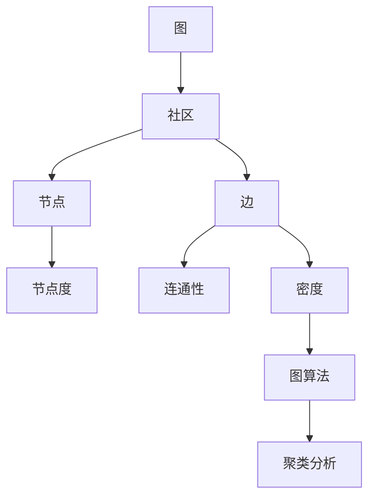

                 

# 社区发现 原理与代码实例讲解

> 关键词：社区发现, 图论, 无监督学习, 图算法, 聚类分析, 社区结构, 节点关系

## 1. 背景介绍

### 1.1 问题由来

社区发现（Community Detection）是图论领域中的一个重要问题，它旨在从图数据中识别出具有某种特定属性或关系的节点子集，即所谓的“社区”。社区发现应用广泛，包括社交网络分析、网络安全、推荐系统、生物信息学等。

随着互联网的发展和数据的爆炸性增长，如何高效地从大规模图数据中识别出社区结构成为了一个重要的研究方向。社区发现算法在学术界和工业界得到了广泛关注和应用。

### 1.2 问题核心关键点

社区发现的核心关键点包括：

- **图数据结构**：社区发现算法通常应用于图数据上，如图网络、社交网络、生物网络等。图由节点和边组成，节点表示实体，边表示节点之间的关系。

- **社区定义**：社区定义了哪些节点属于同一社区。常见的社区定义方法包括密度、连通性、相似度等。

- **算法原理**：社区发现算法可以分为基于聚合（Aggregative）和基于划分（Partitition）的两类方法。聚合算法如基于密度的算法，划分算法如基于图分割的算法。

- **计算效率**：社区发现算法需要在大规模数据上进行计算，计算效率是一个重要的考量因素。

- **应用领域**：社区发现算法在社交网络分析、推荐系统、网络安全、生物信息学等众多领域都有重要应用。

## 2. 核心概念与联系

### 2.1 核心概念概述

为更好地理解社区发现算法，本节将介绍几个关键概念：

- **图**：图是一种由节点和边组成的结构，用于表示实体及其相互关系。在社区发现中，图表示社交网络、信息网络等。

- **社区**：社区是图中的一个子集，其中的节点具有某种特定的属性或关系。社区的节点之间连接紧密，与其他社区的节点连接较少。

- **节点度（Degree）**：节点的度表示与其直接相连的边的数量。

- **连通性（Connectivity）**：图的一种性质，表示节点之间的连接是否紧密。

- **密度（Density）**：社区内节点之间连接的数量与可能连接的数量之比。

- **图算法**：用于处理图数据的算法，包括社区发现算法、路径算法、流算法等。

- **聚类分析（Clustering Analysis）**：将相似的节点归为一类，从而发现数据中的群组或子集。

### 2.2 核心概念原理和架构的 Mermaid 流程图



这个流程图展示了社区发现的关键概念和算法之间的关系：

1. 图是社区发现的基础数据结构。
2. 社区是图中的一个子集，其中的节点具有某种特定的属性或关系。
3. 节点度和连通性是社区的衡量指标。
4. 密度是社区内节点之间连接的密度。
5. 图算法用于处理图数据，包括社区发现算法。
6. 聚类分析将相似的节点归为一类，用于发现社区。

## 3. 核心算法原理 & 具体操作步骤

### 3.1 算法原理概述

社区发现算法可以分为基于聚合和基于划分的两类。基于聚合的算法如Louvain算法，基于划分的算法如GN算法、L-Cut算法等。

**基于聚合的算法**：

基于聚合的算法通过反复迭代，从局部社区逐渐合并到更大的社区。常见的算法包括Louvain算法、Multi-Layer Louvain算法、Spectral Bisection算法等。

**基于划分的算法**：

基于划分的算法通过反复迭代，逐步将节点划分为不同的社区。常见的算法包括GN算法、L-Cut算法、Markov Clustering算法等。

### 3.2 算法步骤详解

#### 3.2.1 基于聚合的算法

**Louvain算法**：

Louvain算法通过不断合并局部社区，逐步构建出整个图的最优社区结构。其步骤如下：

1. **局部优化**：对每个节点，找到与它连接最紧密的邻居节点，构建局部社区。
2. **全局优化**：通过模块度（Modularity）衡量当前社区结构的优劣，选择最优的局部社区进行合并。
3. **迭代更新**：重复1和2，直到没有新的社区可以合并为止。

#### 3.2.2 基于划分的算法

**GN算法**：

GN算法通过贪心策略逐步划分节点。其步骤如下：

1. **初始化社区**：每个节点初始为一个社区。
2. **贪心划分**：对于每个节点，找到与其连接度最大的邻居节点，划分到该节点的社区中。
3. **迭代更新**：重复2，直到所有节点都被划分到某个社区为止。

#### 3.2.3 算法优缺点

**Louvain算法**：

- **优点**：算法简单高效，适合大规模数据集，模块度衡量指标科学。
- **缺点**：对于非连通图，模块度的计算复杂度高，可能会导致计算开销大。

**GN算法**：

- **优点**：算法简单，计算效率高，适用于稀疏图。
- **缺点**：贪心策略可能导致局部最优解，模块度衡量指标不够准确。

### 3.3 算法应用领域

社区发现算法在多个领域都有广泛应用，例如：

- **社交网络分析**：通过社区发现算法，可以识别出社交网络中的核心群体、关键人物等。
- **推荐系统**：通过社区发现算法，可以发现用户之间的兴趣相似性，提升推荐效果。
- **网络安全**：通过社区发现算法，可以识别出攻击者、恶意代码等。
- **生物信息学**：通过社区发现算法，可以发现蛋白质、基因等生物网络中的模块。

## 4. 数学模型和公式 & 详细讲解 & 举例说明

### 4.1 数学模型构建

社区发现算法通常基于图论中的图模型，如无向图、有向图等。以无向图为例，数学模型构建如下：

- **节点集合**：$V=\{v_1,v_2,...,v_n\}$，表示图中的节点。
- **边集合**：$E=\{e_{i,j}\}$，表示节点之间的连接关系。
- **邻接矩阵**：$A \in \{0,1\}^{n \times n}$，其中$A_{i,j}=1$表示节点$i$和节点$j$之间有一条边，$A_{i,j}=0$表示节点$i$和节点$j$之间没有边。

### 4.2 公式推导过程

#### 4.2.1 基于聚合的算法

以Louvain算法为例，其核心思想是通过不断合并局部社区，构建最优的社区结构。模块度（Modularity）是衡量社区结构优劣的重要指标。

模块度的定义如下：

$$
Q = \sum_{C \in \mathcal{C}} \left( \frac{e_{C} - \langle k_C \rangle e_C}{m_{C}} - \langle k \rangle \sum_{v \in C} \frac{k_{v}}{m_{v}} \right)
$$

其中，$C$是社区，$\mathcal{C}$是所有社区的集合，$e_{C}$是社区$C$内的边数，$\langle k_C \rangle$是社区$C$的平均度，$m_{C}$是社区$C$的边数，$\langle k \rangle$是整个图的平均度。

Louvain算法的步骤可表示如下：

1. **局部优化**：对每个节点，找到与其连接最紧密的邻居节点，构建局部社区。
2. **全局优化**：计算当前社区结构的模块度$Q$，选择最优的局部社区进行合并。
3. **迭代更新**：重复1和2，直到没有新的社区可以合并为止。

#### 4.2.2 基于划分的算法

以GN算法为例，其核心思想是通过贪心策略逐步划分节点。

GN算法的步骤可表示如下：

1. **初始化社区**：每个节点初始为一个社区。
2. **贪心划分**：对于每个节点，找到与其连接度最大的邻居节点，划分到该节点的社区中。
3. **迭代更新**：重复2，直到所有节点都被划分到某个社区为止。

### 4.3 案例分析与讲解

以社交网络数据为例，假设有一个包含1000个节点和5000条边的社交网络图，节点表示用户，边表示用户之间的连接关系。使用Louvain算法进行社区发现，步骤如下：

1. **局部优化**：对每个节点，找到与其连接最紧密的邻居节点，构建局部社区。
2. **全局优化**：计算当前社区结构的模块度$Q$，选择最优的局部社区进行合并。
3. **迭代更新**：重复1和2，直到没有新的社区可以合并为止。

假设第一次迭代后，得到了两个社区，分别为{1,2,3,4}和{5,6,7,8,9}。计算这两个社区的模块度，选择模块度更高的社区进行合并，得到社区{1,2,3,4,5,6,7,8,9}。

## 5. 项目实践：代码实例和详细解释说明

### 5.1 开发环境搭建

在进行社区发现算法实践前，我们需要准备好开发环境。以下是使用Python进行社区发现算法开发的常见环境配置流程：

1. 安装Anaconda：从官网下载并安装Anaconda，用于创建独立的Python环境。

2. 创建并激活虚拟环境：
```bash
conda create -n community-env python=3.8 
conda activate community-env
```

3. 安装必要的Python包：
```bash
pip install networkx matplotlib scikit-learn numpy pandas 
```

4. 安装社区发现算法相关的Python包：
```bash
pip install igraph pygraphviz pydot pydotplus networkx-algorithms 
```

完成上述步骤后，即可在`community-env`环境中开始社区发现算法实践。

### 5.2 源代码详细实现

下面以Louvain算法为例，给出使用Python进行社区发现算法的代码实现。

首先，导入所需的Python包：

```python
import networkx as nx
import igraph
import matplotlib.pyplot as plt
import numpy as np
import pandas as pd
```

然后，定义Louvain算法的核心函数：

```python
def louvain_greedy_graph(graph, resolution=0.1):
    """
    Greedy Louvain algorithm for graph community detection.
    """
    # Initialize the partition
    partition = {v: {v} for v in graph.nodes()}
    
    # While there are new modules to be discovered
    while True:
        # Calculate the modularity score
        modularity = 0
        for v in graph.nodes():
            v_partition = partition[v]
            v_degree = graph.degree(v)
            for u in v_partition:
                u_partition = partition[u]
                u_degree = graph.degree(u)
                for w in u_partition:
                    w_partition = partition[w]
                    if v != u and v != w and u != w:
                        edge_in_module = (u in v_partition or v in u_partition or w in v_partition or v in w_partition)
                        edge_outside_module = (u not in v_partition and v not in u_partition and w not in v_partition and v not in w_partition)
                        if edge_in_module and edge_outside_module:
                            modularity += 1 / (2 * graph.number_of_edges())
        
        # Find the largest module and merge it into a new partition
        largest_module = None
        max_modularity = -np.inf
        for v in graph.nodes():
            v_partition = partition[v]
            v_degree = graph.degree(v)
            for u in v_partition:
                u_partition = partition[u]
                u_degree = graph.degree(u)
                for w in u_partition:
                    w_partition = partition[w]
                    if v != u and v != w and u != w and edge_in_module and edge_outside_module:
                        current_partition = v_partition.union(u_partition).union(w_partition)
                        current_degree = v_degree + u_degree + w_degree
                        current_modularity = modularity + 1 / (2 * current_degree)
                        if current_modularity > max_modularity:
                            largest_module = current_partition
                            max_modularity = current_modularity
        
        if largest_module is None:
            break
        
        # Merge the largest module into the partition
        for v in largest_module:
            partition[v] = largest_module
        
    return partition
```

接着，定义一个示例社交网络图：

```python
G = nx.Graph()
G.add_edges_from([(1, 2), (1, 3), (2, 3), (2, 4), (3, 4), (4, 5), (4, 6), (5, 6)])
```

最后，运行Louvain算法并可视化社区结构：

```python
partition = louvain_greedy_graph(G, resolution=0.1)

# Draw the graph with the communities
pos = nx.spring_layout(G)
nx.draw(G, pos, node_color='red' if node in partition[0] else 'blue', node_size=300, alpha=0.5, with_labels=True, font_size=10)
plt.title('Louvain Community Detection')
plt.show()
```

以上是使用Python进行Louvain算法社区发现的完整代码实现。可以看到，使用NetworkX库可以方便地构建和操作图数据，而Louvain算法的核心部分可以通过简单的循环迭代来实现。

### 5.3 代码解读与分析

让我们再详细解读一下关键代码的实现细节：

**Louvain算法函数**：

- `partition`：社区划分的初始状态，每个节点都属于自己的社区。
- `modularity`：模块度衡量指标，用于衡量当前社区结构的优劣。
- `largest_module`：当前社区中最大的模块，即模块度最高的社区。
- `max_modularity`：当前社区结构的最大模块度。
- `current_partition`：当前模块的社区划分。
- `current_degree`：当前模块的节点度。
- `current_modularity`：当前模块的模块度。

**示例社交网络图**：

- 使用NetworkX库创建图数据，并添加边表示节点之间的关系。

**运行Louvain算法**：

- 通过迭代计算模块度，找到最大的模块并合并。
- 重复这个过程，直到没有新的社区可以合并为止。

## 6. 实际应用场景

### 6.1 社交网络分析

社区发现算法在社交网络分析中有着广泛的应用。例如，Facebook等社交平台使用社区发现算法来识别出具有相似兴趣和行为的用户群体，从而推送更加个性化的内容。

### 6.2 推荐系统

推荐系统通常使用用户-物品的评分矩阵，通过社区发现算法找到具有相似兴趣的用户群体，从而提升推荐效果。例如，Amazon使用社区发现算法来识别出具有相似购物习惯的用户，向这些用户推荐相似的产品。

### 6.3 网络安全

社区发现算法可以用于识别出恶意代码或攻击者的活动轨迹，从而帮助安全专家快速响应和处理安全事件。例如，Nest Labs使用社区发现算法来识别出安全威胁，从而保护公司的网络安全。

### 6.4 未来应用展望

社区发现算法将在更多的领域得到应用，其应用前景包括：

- **金融分析**：通过社区发现算法，可以识别出具有相似交易行为的用户群体，从而发现潜在的金融欺诈行为。
- **医疗诊断**：通过社区发现算法，可以识别出具有相似症状的患者群体，从而提供个性化的医疗诊断和治疗方案。
- **环境监测**：通过社区发现算法，可以识别出具有相似行为的环境监测设备，从而提升环境监测的准确性和效率。

未来，社区发现算法将在更多领域中发挥重要作用，为人类社会的各个方面提供有力的支持和保障。

## 7. 工具和资源推荐

### 7.1 学习资源推荐

为了帮助开发者系统掌握社区发现算法，这里推荐一些优质的学习资源：

1. **《图论及其应用》**：一本经典的图论教材，涵盖了图论的基本概念和算法。

2. **Coursera《图算法》课程**：由Stanford大学开设的课程，介绍了图算法的基本概念和算法实现。

3. **Kaggle社区**：Kaggle社区中有许多社区发现算法的竞赛和项目，可以学习到实际应用中的算法实现。

4. **Github社区**：Github上有许多社区发现算法的开源项目和代码实现，可以学习到实际应用中的算法实现。

5. **igraph和NetworkX库的官方文档**：igraph和NetworkX库的官方文档提供了丰富的算法实现和代码示例，是学习社区发现算法的必备资料。

### 7.2 开发工具推荐

常用的社区发现算法开发工具包括：

1. **igraph**：一个用于图论计算的Python库，提供了丰富的图算法实现。

2. **NetworkX**：一个用于图数据处理的Python库，提供了丰富的图数据处理和算法实现。

3. **Pydot**：一个用于图形可视化的Python库，可以用于可视化社区发现算法的结果。

4. **Pygraphviz**：一个用于图形可视化的Python库，可以用于可视化社区发现算法的结果。

5. **Jupyter Notebook**：一个用于数据科学和算法开发的交互式Python环境，可以用于编写和运行社区发现算法的代码。

### 7.3 相关论文推荐

社区发现算法的研究历史悠久，以下是几篇奠基性的相关论文，推荐阅读：

1. **《Graph Community Detection and Localization》**：该论文介绍了社区发现算法的基本概念和算法实现。

2. **《A Survey of Algorithms for Detecting Communities in Networks》**：该论文综述了社区发现算法的研究进展和应用场景。

3. **《Node Clustering Based on Information Theory and Efficient K-Means Clustering Algorithms》**：该论文介绍了基于信息论的社区发现算法。

4. **《A Fast Modularity Maximization Algorithm for Community Detection》**：该论文介绍了基于模块度优化的社区发现算法。

5. **《A Dendrogram for Visualizing Community Structures in Large Graphs》**：该论文介绍了可视化社区结构的方法。

这些论文代表了大规模图数据处理和社区发现算法的最新研究成果，通过学习这些前沿成果，可以帮助研究者把握学科前进方向，激发更多的创新灵感。

## 8. 总结：未来发展趋势与挑战

### 8.1 研究成果总结

社区发现算法在学术界和工业界得到了广泛关注和应用。其研究成果涵盖了图论、网络科学、数据挖掘、机器学习等多个领域。未来，社区发现算法将在更多的领域得到应用，为人类社会的各个方面提供有力的支持和保障。

### 8.2 未来发展趋势

社区发现算法将呈现以下几个发展趋势：

1. **大规模图数据处理**：未来社区发现算法将处理更大规模的图数据，如何提高算法在大规模数据上的效率和准确性，将是重要的研究方向。

2. **分布式计算**：未来社区发现算法将采用分布式计算技术，在大规模集群上运行，从而提高计算效率。

3. **多模态数据融合**：未来社区发现算法将融合多模态数据，如文本、图像、音频等，从而更全面地理解和建模社区结构。

4. **跨领域应用**：未来社区发现算法将在更多领域得到应用，如金融、医疗、环境监测等。

5. **实时计算**：未来社区发现算法将实现实时计算，从而支持实时社区发现和分析。

6. **深度学习融合**：未来社区发现算法将与深度学习技术相结合，提高算法的性能和准确性。

### 8.3 面临的挑战

社区发现算法虽然取得了许多成果，但仍面临诸多挑战：

1. **计算效率**：社区发现算法在大规模图数据上的计算效率是一个重要的挑战，需要进一步优化算法的计算复杂度。

2. **社区质量**：社区发现算法需要找到高质量的社区结构，但如何衡量社区质量、避免过度划分等，仍然是一个重要的研究课题。

3. **数据质量和噪声**：社区发现算法需要高质量的图数据，但如何处理噪声、缺失数据等，仍然是一个重要的研究课题。

4. **算法复杂度**：社区发现算法需要在大规模图数据上进行计算，如何降低算法复杂度，提高算法的可扩展性，仍然是一个重要的研究课题。

5. **模型可解释性**：社区发现算法需要解释其内部工作机制和决策逻辑，如何提高模型的可解释性，仍然是一个重要的研究课题。

### 8.4 研究展望

未来社区发现算法的研究方向包括：

1. **基于深度学习的社区发现算法**：将深度学习技术与社区发现算法相结合，提高算法的性能和准确性。

2. **基于分布式计算的社区发现算法**：采用分布式计算技术，在大规模集群上运行社区发现算法，提高计算效率。

3. **基于多模态数据的社区发现算法**：融合多模态数据，如文本、图像、音频等，更全面地理解和建模社区结构。

4. **基于实时计算的社区发现算法**：实现实时计算，支持实时社区发现和分析。

5. **基于强化学习的社区发现算法**：引入强化学习思想，优化社区发现算法的参数和策略。

6. **基于图神经网络的社区发现算法**：将图神经网络技术与社区发现算法相结合，提高算法的性能和准确性。

这些研究方向将进一步推动社区发现算法的发展，为社区发现算法的实际应用提供更多的可能性。

## 9. 附录：常见问题与解答

**Q1：社区发现算法的计算复杂度如何？**

A: 社区发现算法的计算复杂度取决于算法的实现方式和图数据的规模。基于聚合的算法如Louvain算法的时间复杂度为$O(E \cdot N^2)$，其中$E$是边的数量，$N$是节点的数量。基于划分的算法如GN算法的时间复杂度为$O(E \cdot N \cdot \log N)$。在实际应用中，需要根据图数据规模选择合适的算法。

**Q2：社区发现算法如何处理图数据中的噪声和缺失数据？**

A: 社区发现算法对图数据中的噪声和缺失数据较为敏感，需要通过预处理和滤波等技术进行清洗和处理。常见的处理方法包括：

1. 去除噪声节点和边：去除图数据中的噪声节点和边，避免对社区结构的影响。

2. 数据补全：使用图嵌入等技术，对缺失数据进行补全，提高社区发现的准确性。

3. 数据过滤：过滤掉质量较低的图数据，保留高质量的数据，提高社区发现的准确性。

**Q3：社区发现算法如何评估社区质量？**

A: 社区发现算法的社区质量评估指标包括：

1. 模块度（Modularity）：衡量社区结构的质量，模块度越高，社区结构越稳定。

2. 密度（Density）：衡量社区内部的连接密度，密度越高，社区内部的连接越紧密。

3. 平均连通性（Average Connectivity）：衡量社区内部的连通性，平均连通性越高，社区内部的连通性越好。

4. 连通性差异（Connectivity Variance）：衡量社区内部和社区之间的连通性差异，连通性差异越小，社区结构越稳定。

**Q4：社区发现算法如何应用于推荐系统？**

A: 社区发现算法在推荐系统中的应用主要通过以下步骤：

1. 构建用户-物品评分矩阵：将用户对物品的评分数据构建为用户-物品评分矩阵。

2. 进行社区发现：使用社区发现算法，将具有相似评分的用户划分为不同的社区。

3. 计算社区评分：计算每个社区的评分平均值，得到社区的评分向量。

4. 计算用户评分：将用户所属的社区评分向量与用户评分向量进行线性加权，得到用户评分向量。

5. 推荐物品：根据用户评分向量，推荐用户可能感兴趣的物品。

**Q5：社区发现算法如何应用于金融分析？**

A: 社区发现算法在金融分析中的应用主要通过以下步骤：

1. 构建交易图：将金融交易数据构建为交易图，节点表示交易，边表示交易关系。

2. 进行社区发现：使用社区发现算法，将具有相似交易行为的交易节点划分为不同的社区。

3. 识别潜在的欺诈行为：识别社区中的异常交易节点，将其标记为潜在的欺诈行为。

4. 分析社区结构：分析社区结构，发现潜在的金融风险和欺诈行为。

通过社区发现算法，可以识别出具有相似交易行为的交易节点，从而发现潜在的欺诈行为和金融风险。

---

作者：禅与计算机程序设计艺术 / Zen and the Art of Computer Programming

