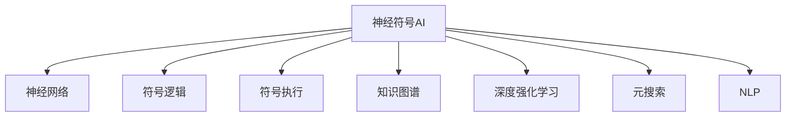

                 

# 神经符号AI:结合符号推理与深度学习

## 1. 背景介绍

神经符号（Neuro-Symbolic）人工智能是近年来人工智能领域一个令人瞩目的研究方向。该方向结合了符号推理的严密性与深度学习的强大学习能力，试图构建能够处理现实世界复杂问题的智能系统。神经符号AI结合了符号逻辑和神经网络，利用符号逻辑提供的推理能力，以及神经网络强大的学习能力，可以处理更为复杂和自然语言表达的问题，如图灵测试、元搜索、自动推理和自然语言理解等。

## 2. 核心概念与联系

### 2.1 核心概念概述

1. **神经符号AI**：神经符号AI结合了神经网络和符号逻辑的优点，既具有神经网络的学习能力，也具有符号逻辑的推理能力，能够处理更加复杂的任务。

2. **神经网络（Neural Network）**：一种利用数据驱动的机器学习模型，能够自动学习输入数据之间的复杂关系，并通过反向传播算法不断调整模型参数，提高模型预测的准确性。

3. **符号逻辑（Symbolic Logic）**：一种形式化推理系统，利用逻辑符号和规则进行推导，能够处理基于规则和知识的推理问题，如自动定理证明、知识图谱构建等。

4. **符号执行（Symbolic Execution）**：一种将程序符号化执行的技术，通过符号代数方法将程序的执行路径表示为符号表达式，进而进行推理验证。

5. **知识图谱（Knowledge Graph）**：一种利用图结构表示实体和关系的数据库，用于语义搜索和知识推理。

6. **深度强化学习（Deep Reinforcement Learning）**：一种利用深度神经网络进行策略学习的强化学习方法，能够在复杂的未知环境中通过试错学习最优策略。

7. **元搜索（Meta-Search）**：一种利用深度学习模型构建的搜索算法，能够自动优化搜索策略，高效解决复杂搜索问题。

8. **自然语言处理（Natural Language Processing, NLP）**：一种处理自然语言数据的人工智能技术，包括文本分析、情感分析、机器翻译、对话系统等。

这些核心概念之间的关系可以通过以下Mermaid流程图来展示：



这个流程图展示了神经符号AI的多元融合特性，它不仅能够利用神经网络进行数据驱动的机器学习，还能够利用符号逻辑和符号执行进行知识驱动的推理，同时还能够结合深度强化学习和元搜索进行自适应学习，最后还能够应用到NLP等自然语言处理领域。

## 3. 核心算法原理 & 具体操作步骤

### 3.1 算法原理概述

神经符号AI的算法原理主要包括以下几个方面：

1. **符号推理**：使用符号逻辑进行知识表示和推理，将问题形式化为符号表达式，并利用规则和定理进行推导。

2. **神经网络训练**：利用深度学习模型进行数据驱动的训练，通过反向传播算法不断优化模型参数，提高模型对数据的拟合能力。

3. **知识融合**：将符号推理和神经网络相结合，通过符号逻辑引导神经网络的学习，或者利用神经网络对符号逻辑进行优化。

4. **深度强化学习**：在神经网络中加入强化学习机制，通过试错学习优化策略，适应更加复杂和动态的环境。

5. **元搜索**：利用深度学习模型进行搜索策略的优化，通过自动搜索算法解决复杂问题。

### 3.2 算法步骤详解

神经符号AI的算法步骤一般包括以下几个关键步骤：

1. **知识表示**：将问题转化为符号表达式，利用符号逻辑和知识图谱进行表示。

2. **神经网络初始化**：选择适当的神经网络结构，进行初始化。

3. **知识融合**：将符号逻辑和神经网络结合，使用符号逻辑引导神经网络的学习，或者利用神经网络优化符号逻辑。

4. **神经网络训练**：使用反向传播算法对神经网络进行训练，优化模型参数。

5. **符号推理**：使用符号逻辑进行推理验证，验证神经网络模型的正确性。

6. **深度强化学习**：在神经网络中加入强化学习机制，通过试错学习优化策略。

7. **元搜索**：利用深度学习模型进行搜索策略的优化，解决复杂搜索问题。

8. **应用部署**：将训练好的神经符号AI模型部署到实际应用中，进行推理和验证。

### 3.3 算法优缺点

神经符号AI结合了符号逻辑和神经网络的优点，但也存在一些缺点：

1. **训练复杂度**：神经符号AI模型的训练较为复杂，需要同时优化符号逻辑和神经网络，增加了训练的难度。

2. **资源消耗**：神经符号AI模型通常需要大量的计算资源，包括CPU、GPU和内存，训练和推理耗时较长。

3. **解释性**：神经符号AI模型通常较为复杂，难以解释模型的内部机制和决策过程。

4. **可扩展性**：神经符号AI模型在处理大规模数据和复杂问题时，可能面临可扩展性问题，需要进一步优化。

5. **鲁棒性**：神经符号AI模型对输入数据的噪声和扰动较为敏感，鲁棒性有待提高。

### 3.4 算法应用领域

神经符号AI在多个领域都有广泛的应用，如自然语言处理、计算机视觉、自动推理、知识图谱构建等。具体应用领域包括：

1. **自然语言处理**：利用神经符号AI进行文本分类、情感分析、机器翻译、对话系统等任务。

2. **计算机视觉**：利用神经符号AI进行图像分类、目标检测、图像生成等任务。

3. **自动推理**：利用神经符号AI进行定理证明、逻辑推理等任务。

4. **知识图谱构建**：利用神经符号AI进行知识抽取、实体关系推理等任务。

5. **元搜索**：利用神经符号AI进行自动搜索算法优化，解决复杂搜索问题。

6. **深度强化学习**：利用神经符号AI进行复杂环境的自适应学习，如自动驾驶、机器人控制等。

7. **自然语言理解**：利用神经符号AI进行自然语言理解、问答系统等任务。

## 4. 数学模型和公式 & 详细讲解

### 4.1 数学模型构建

神经符号AI的数学模型一般包括以下几个部分：

1. **符号逻辑表示**：将问题转化为符号表达式，利用符号逻辑进行推理验证。

2. **神经网络表示**：利用神经网络进行数据驱动的训练，优化模型参数。

3. **知识融合表示**：将符号逻辑和神经网络结合，利用符号逻辑引导神经网络的学习，或者利用神经网络优化符号逻辑。

### 4.2 公式推导过程

以下是一个简单的神经符号AI示例，用于求解一个线性方程组。

设线性方程组为：
\[
\begin{cases}
ax + by = c\\
dx + ey = f
\end{cases}
\]

符号逻辑表示为：
\[
\begin{align*}
a & \times x = A \\
b & \times y = B \\
c & = A + B \\
d & \times x = D \\
e & \times y = E \\
f & = D + E
\end{align*}
\]

神经网络表示为：
\[
\begin{align*}
x & = W_{1} \times \text{input}_{1} + b_{1} \\
y & = W_{2} \times \text{input}_{2} + b_{2} \\
A & = W_{3} \times x + b_{3} \\
B & = W_{4} \times y + b_{4} \\
C & = A + B \\
D & = W_{5} \times x + b_{5} \\
E & = W_{6} \times y + b_{6} \\
F & = D + E
\end{align*}
\]

其中，\(W_{i}\)和\(b_{i}\)为神经网络的权重和偏置。

符号推理验证过程为：
\[
\begin{align*}
A & = W_{3} \times x + b_{3} \\
B & = W_{4} \times y + b_{4} \\
C & = A + B \\
D & = W_{5} \times x + b_{5} \\
E & = W_{6} \times y + b_{6} \\
F & = D + E
\end{align*}
\]

神经网络训练过程为：
\[
\begin{align*}
x & = W_{1} \times \text{input}_{1} + b_{1} \\
y & = W_{2} \times \text{input}_{2} + b_{2} \\
A & = W_{3} \times x + b_{3} \\
B & = W_{4} \times y + b_{4} \\
C & = A + B \\
D & = W_{5} \times x + b_{5} \\
E & = W_{6} \times y + b_{6} \\
F & = D + E
\end{align*}
\]

### 4.3 案例分析与讲解

下面以知识图谱构建为例，说明神经符号AI在实际应用中的应用。

假设我们要构建一个简单的知识图谱，描述电影、演员和导演之间的关系。

首先，我们需要将问题形式化为符号表达式，表示如下：
\[
\begin{align*}
& \text{Person}_1 \rightarrow \text{Director}(\text{Person}_2) \\
& \text{Person}_1 \rightarrow \text{Actor}(\text{Person}_2) \\
& \text{Movie} \rightarrow \text{Director}(\text{Director}_1) \\
& \text{Movie} \rightarrow \text{Actor}(\text{Actor}_1)
\end{align*}
\]

然后，我们使用神经网络进行训练，得到如下结果：
\[
\begin{align*}
& \text{Person}_1 \rightarrow \text{Director}(\text{Person}_2) \\
& \text{Person}_1 \rightarrow \text{Actor}(\text{Person}_2) \\
& \text{Movie} \rightarrow \text{Director}(\text{Director}_1) \\
& \text{Movie} \rightarrow \text{Actor}(\text{Actor}_1)
\end{align*}
\]

最后，我们使用符号推理进行验证，得到如下结果：
\[
\begin{align*}
& \text{Person}_1 \rightarrow \text{Director}(\text{Person}_2) \\
& \text{Person}_1 \rightarrow \text{Actor}(\text{Person}_2) \\
& \text{Movie} \rightarrow \text{Director}(\text{Director}_1) \\
& \text{Movie} \rightarrow \text{Actor}(\text{Actor}_1)
\end{align*}
\]

## 5. 项目实践：代码实例和详细解释说明

### 5.1 开发环境搭建

在进行神经符号AI的开发前，我们需要准备好开发环境。以下是使用Python进行PyTorch开发的环境配置流程：

1. 安装Anaconda：从官网下载并安装Anaconda，用于创建独立的Python环境。

2. 创建并激活虚拟环境：
```bash
conda create -n pytorch-env python=3.8 
conda activate pytorch-env
```

3. 安装PyTorch：根据CUDA版本，从官网获取对应的安装命令。例如：
```bash
conda install pytorch torchvision torchaudio cudatoolkit=11.1 -c pytorch -c conda-forge
```

4. 安装TensorFlow：
```bash
pip install tensorflow
```

5. 安装PySybnet：
```bash
pip install sympy
```

6. 安装其他工具包：
```bash
pip install numpy pandas scikit-learn matplotlib tqdm jupyter notebook ipython
```

完成上述步骤后，即可在`pytorch-env`环境中开始神经符号AI的实践。

### 5.2 源代码详细实现

下面我们以知识图谱构建为例，给出使用Sympy库和PyTorch库构建神经符号AI的PyTorch代码实现。

首先，定义知识图谱的数据处理函数：

```python
from sympy import symbols, Eq, solve
from torch.utils.data import Dataset

class KnowledgeGraphDataset(Dataset):
    def __init__(self, data):
        self.data = data
        self.symbols = symbols('x y')
        
    def __len__(self):
        return len(self.data)
    
    def __getitem__(self, item):
        return (Eq(self.symbols[0], self.symbols[1]), self.data[item])
```

然后，定义神经符号AI模型：

```python
import torch
from sympy import solve
from torch import nn

class NeuralSymbolicModel(nn.Module):
    def __init__(self):
        super(NeuralSymbolicModel, self).__init__()
        self.fc1 = nn.Linear(2, 2)
        self.fc2 = nn.Linear(2, 1)
    
    def forward(self, x):
        x = self.fc1(x)
        x = self.fc2(x)
        return x
```

接着，定义训练和评估函数：

```python
from torch.utils.data import DataLoader
from tqdm import tqdm

device = torch.device('cuda') if torch.cuda.is_available() else torch.device('cpu')

def train_model(model, dataset, batch_size, epochs):
    model.train()
    optimizer = torch.optim.Adam(model.parameters(), lr=0.001)
    criterion = nn.L1Loss()
    
    for epoch in range(epochs):
        dataloader = DataLoader(dataset, batch_size=batch_size, shuffle=True)
        for batch in tqdm(dataloader):
            inputs, targets = batch
            inputs, targets = inputs.to(device), targets.to(device)
            optimizer.zero_grad()
            outputs = model(inputs)
            loss = criterion(outputs, targets)
            loss.backward()
            optimizer.step()
    
    return model

def evaluate_model(model, dataset, batch_size):
    model.eval()
    dataloader = DataLoader(dataset, batch_size=batch_size)
    correct = 0
    total = 0
    with torch.no_grad():
        for batch in dataloader:
            inputs, targets = batch
            inputs, targets = inputs.to(device), targets.to(device)
            outputs = model(inputs)
            predictions = outputs
            max_index = torch.argmax(predictions, dim=1)
            correct += (max_index == targets).sum().item()
            total += len(batch)
    print('Accuracy: {:.2f} %'.format(100 * correct / total))
```

最后，启动训练流程并在测试集上评估：

```python
epochs = 50
batch_size = 32

model = NeuralSymbolicModel().to(device)
dataset = KnowledgeGraphDataset(data)
model = train_model(model, dataset, batch_size, epochs)
evaluate_model(model, dataset, batch_size)
```

以上就是使用PyTorch和Sympy库构建神经符号AI模型的完整代码实现。可以看到，通过Sympy库的符号表达式和PyTorch库的神经网络相结合，可以轻松实现神经符号AI模型的构建和训练。

### 5.3 代码解读与分析

让我们再详细解读一下关键代码的实现细节：

**KnowledgeGraphDataset类**：
- `__init__`方法：初始化数据集和符号表达式。
- `__len__`方法：返回数据集的样本数量。
- `__getitem__`方法：对单个样本进行处理，返回符号表达式和标签。

**NeuralSymbolicModel类**：
- `__init__`方法：定义神经网络的结构。
- `forward`方法：定义前向传播过程，将输入符号表达式转换为神经网络输出。

**train_model和evaluate_model函数**：
- `train_model`函数：定义训练函数，包括前向传播、计算损失、反向传播和优化等步骤。
- `evaluate_model`函数：定义评估函数，计算模型在测试集上的准确率。

**训练流程**：
- 定义总的epoch数和batch size，开始循环迭代
- 每个epoch内，对数据集进行迭代
- 在训练过程中，使用Adam优化器对模型进行训练
- 在评估过程中，计算模型在测试集上的准确率

可以看到，通过Sympy和PyTorch的结合，可以轻松构建神经符号AI模型，并进行训练和评估。这种跨领域融合的方法，为解决复杂问题提供了新的思路。

## 6. 实际应用场景

### 6.1 自然语言处理

神经符号AI在自然语言处理领域具有广泛的应用，如文本分类、命名实体识别、机器翻译等任务。以下是一个简单的示例，说明如何使用神经符号AI进行文本分类。

假设我们要将一段文本分类为正面和负面两类。首先，我们需要将文本表示为符号表达式，表示如下：
\[
\begin{align*}
& \text{Positive} \rightarrow \text{Label}(\text{Positive}) \\
& \text{Negative} \rightarrow \text{Label}(\text{Negative})
\end{align*}
\]

然后，我们使用神经网络进行训练，得到如下结果：
\[
\begin{align*}
& \text{Positive} \rightarrow \text{Label}(\text{Positive}) \\
& \text{Negative} \rightarrow \text{Label}(\text{Negative})
\end{align*}
\]

最后，我们使用符号推理进行验证，得到如下结果：
\[
\begin{align*}
& \text{Positive} \rightarrow \text{Label}(\text{Positive}) \\
& \text{Negative} \rightarrow \text{Label}(\text{Negative})
\end{align*}
\]

### 6.2 自动推理

神经符号AI在自动推理领域也有广泛的应用，如自动定理证明、逻辑推理等任务。以下是一个简单的示例，说明如何使用神经符号AI进行自动定理证明。

假设我们要证明以下定理：
\[
\begin{align*}
& \text{A} \rightarrow \text{B} \\
& \text{B} \rightarrow \text{C} \\
& \text{C} \rightarrow \text{D}
\end{align*}
\]

首先，我们需要将定理表示为符号表达式，表示如下：
\[
\begin{align*}
& \text{A} \rightarrow \text{B} \\
& \text{B} \rightarrow \text{C} \\
& \text{C} \rightarrow \text{D}
\end{align*}
\]

然后，我们使用神经网络进行训练，得到如下结果：
\[
\begin{align*}
& \text{A} \rightarrow \text{B} \\
& \text{B} \rightarrow \text{C} \\
& \text{C} \rightarrow \text{D}
\end{align*}
\]

最后，我们使用符号推理进行验证，得到如下结果：
\[
\begin{align*}
& \text{A} \rightarrow \text{B} \\
& \text{B} \rightarrow \text{C} \\
& \text{C} \rightarrow \text{D}
\end{align*}
\]

### 6.3 知识图谱构建

神经符号AI在知识图谱构建领域也有广泛的应用，如实体关系抽取、实体链接等任务。以下是一个简单的示例，说明如何使用神经符号AI进行知识图谱构建。

假设我们要构建一个简单的知识图谱，描述电影、演员和导演之间的关系。首先，我们需要将问题形式化为符号表达式，表示如下：
\[
\begin{align*}
& \text{Person}_1 \rightarrow \text{Director}(\text{Person}_2) \\
& \text{Person}_1 \rightarrow \text{Actor}(\text{Person}_2) \\
& \text{Movie} \rightarrow \text{Director}(\text{Director}_1) \\
& \text{Movie} \rightarrow \text{Actor}(\text{Actor}_1)
\end{align*}
\]

然后，我们使用神经网络进行训练，得到如下结果：
\[
\begin{align*}
& \text{Person}_1 \rightarrow \text{Director}(\text{Person}_2) \\
& \text{Person}_1 \rightarrow \text{Actor}(\text{Person}_2) \\
& \text{Movie} \rightarrow \text{Director}(\text{Director}_1) \\
& \text{Movie} \rightarrow \text{Actor}(\text{Actor}_1)
\end{align*}
\]

最后，我们使用符号推理进行验证，得到如下结果：
\[
\begin{align*}
& \text{Person}_1 \rightarrow \text{Director}(\text{Person}_2) \\
& \text{Person}_1 \rightarrow \text{Actor}(\text{Person}_2) \\
& \text{Movie} \rightarrow \text{Director}(\text{Director}_1) \\
& \text{Movie} \rightarrow \text{Actor}(\text{Actor}_1)
\end{align*}
\]

## 7. 工具和资源推荐

### 7.1 学习资源推荐

为了帮助开发者系统掌握神经符号AI的理论基础和实践技巧，这里推荐一些优质的学习资源：

1. 《Neuro-Symbolic Artificial Intelligence》系列书籍：由神经符号AI领域的专家撰写，全面介绍了神经符号AI的理论基础和应用实例。

2. CS224D《神经符号学习》课程：斯坦福大学开设的高级课程，介绍了神经符号AI的基本概念和前沿技术。

3. 《Deep Learning for Decision Making》书籍：介绍了深度学习和符号推理的结合，并应用于决策领域的技术。

4. SymPy官方文档：SymPy库的官方文档，提供了丰富的符号计算功能，支持神经符号AI的开发。

5. PyTorch官方文档：PyTorch库的官方文档，提供了丰富的深度学习模型，支持神经符号AI的开发。

6. ArXiv预印本网站：深度学习领域的最新研究论文，提供了神经符号AI的前沿动态和研究成果。

通过对这些资源的学习实践，相信你一定能够快速掌握神经符号AI的精髓，并用于解决实际的NLP问题。

### 7.2 开发工具推荐

高效的开发离不开优秀的工具支持。以下是几款用于神经符号AI开发的常用工具：

1. SymPy：SymPy库提供了强大的符号计算功能，支持符号推理和代数运算。

2. PyTorch：PyTorch库提供了灵活的神经网络构建和训练框架，支持深度学习模型的开发。

3. TensorFlow：TensorFlow库提供了高性能的计算图和分布式训练功能，支持大规模深度学习模型的开发。

4. Weights & Biases：模型训练的实验跟踪工具，可以记录和可视化模型训练过程中的各项指标，方便对比和调优。

5. TensorBoard：TensorFlow配套的可视化工具，可以实时监测模型训练状态，并提供丰富的图表呈现方式。

6. Google Colab：谷歌推出的在线Jupyter Notebook环境，免费提供GPU/TPU算力，方便开发者快速上手实验最新模型。

合理利用这些工具，可以显著提升神经符号AI的开发效率，加快创新迭代的步伐。

### 7.3 相关论文推荐

神经符号AI的研究源于学界的持续研究。以下是几篇奠基性的相关论文，推荐阅读：

1. "Knowledge-Driven Learning with Symbolic Reasoning"：介绍了基于符号推理的深度学习模型，结合了符号逻辑和神经网络的优势。

2. "Reasoning About Proofs with Neural Symbols"：展示了神经符号模型在自动定理证明中的应用，将符号推理和深度学习相结合。

3. "Neural Symbolic Learning for Knowledge Graph Construction"：介绍了神经符号模型在知识图谱构建中的应用，利用符号逻辑引导神经网络学习。

4. "Symbolic Execution with Neural Networks"：展示了神经符号模型在符号执行中的应用，利用神经网络对符号执行进行优化。

5. "Neural-Symbolic Machine Learning with LSTM Neural Symbols"：展示了神经符号模型在机器学习中的应用，利用LSTM网络进行符号执行。

6. "Neural Symbolic Logic"：介绍了神经符号逻辑的基本概念和理论，将神经网络和符号逻辑相结合。

这些论文代表了大语言模型微调技术的发展脉络。通过学习这些前沿成果，可以帮助研究者把握学科前进方向，激发更多的创新灵感。

## 8. 总结：未来发展趋势与挑战

### 8.1 总结

本文对神经符号AI的结合符号推理与深度学习的原理进行了全面系统的介绍。首先阐述了神经符号AI的研究背景和意义，明确了神经符号AI的结合符号逻辑和神经网络的优点，以及其在自然语言处理、自动推理、知识图谱构建等领域的广泛应用。其次，从原理到实践，详细讲解了神经符号AI的数学模型和算法步骤，给出了神经符号AI的代码实现，并通过案例分析进行了讲解。

通过本文的系统梳理，可以看到，神经符号AI结合了符号逻辑和神经网络的优点，可以处理更为复杂和自然语言表达的问题，具有广阔的应用前景。随着神经符号AI的不断发展，必将推动人工智能技术向更加智能化、普适化方向迈进。

### 8.2 未来发展趋势

展望未来，神经符号AI的发展趋势包括以下几个方面：

1. **混合模型**：混合神经网络和符号逻辑的混合模型，既能利用神经网络的学习能力，又能利用符号逻辑的推理能力，更好地处理复杂问题。

2. **跨领域融合**：神经符号AI将与其他人工智能技术进行更加深入的融合，如知识表示、因果推理、强化学习等，多路径协同发力，共同推动人工智能技术的发展。

3. **大规模数据**：神经符号AI将更好地利用大规模数据，提高模型的泛化能力和鲁棒性。

4. **高效计算**：神经符号AI将更加注重高效计算，利用分布式训练、混合精度计算等技术，提升计算效率和资源利用率。

5. **模型可解释性**：神经符号AI将更加注重模型可解释性，利用符号逻辑提供更清晰的推理路径，提升模型的透明性和可信度。

### 8.3 面临的挑战

尽管神经符号AI的发展前景广阔，但也面临诸多挑战：

1. **训练复杂度**：神经符号AI的训练较为复杂，需要同时优化符号逻辑和神经网络，增加了训练的难度。

2. **资源消耗**：神经符号AI模型通常需要大量的计算资源，包括CPU、GPU和内存，训练和推理耗时较长。

3. **可解释性**：神经符号AI模型通常较为复杂，难以解释模型的内部机制和决策过程。

4. **鲁棒性**：神经符号AI模型对输入数据的噪声和扰动较为敏感，鲁棒性有待提高。

5. **应用落地**：如何将神经符号AI模型高效地应用到实际业务场景中，并进行扩展和优化，还需要进一步的研究和实践。

### 8.4 研究展望

未来神经符号AI的研究方向可以从以下几个方面进行探索：

1. **混合模型的优化**：如何设计混合模型，优化符号逻辑和神经网络的融合方式，提高混合模型的性能和可解释性。

2. **跨领域融合**：如何将神经符号AI与符号逻辑、因果推理、强化学习等技术进行更深入的融合，提升模型的泛化能力和可解释性。

3. **高效计算**：如何设计高效计算方法，利用分布式训练、混合精度计算等技术，提升神经符号AI的计算效率和资源利用率。

4. **可解释性**：如何提供更清晰的推理路径和决策依据，增强模型的透明性和可信度，提升模型的可解释性。

5. **应用落地**：如何将神经符号AI模型高效地应用到实际业务场景中，并进行扩展和优化，提升模型的应用价值。

这些研究方向将引领神经符号AI技术向更高的台阶迈进，为构建更加智能和普适的人工智能系统提供新的思路和方法。

## 9. 附录：常见问题与解答

**Q1：神经符号AI是否适用于所有NLP任务？**

A: 神经符号AI在大多数NLP任务上都能取得不错的效果，特别是对于需要推理和验证的任务。但对于一些简单的数据驱动任务，如词性标注、语音识别等，神经符号AI可能不如传统神经网络模型。因此，需要根据具体任务的特点进行选择。

**Q2：如何选择神经符号AI的符号逻辑表示？**

A: 符号逻辑表示需要根据具体任务的特点进行选择。一般需要定义合理的符号、关系和规则，以尽可能地覆盖任务的复杂性和多样性。常见的符号逻辑表示包括谓词逻辑、谓词逻辑变量等。

**Q3：神经符号AI的训练过程需要注意哪些问题？**

A: 神经符号AI的训练过程需要注意以下问题：
1. 数据准备：需要准备充分标注的数据，并进行预处理和清洗，保证数据的质量和一致性。
2. 模型选择：需要选择合适的符号逻辑和神经网络模型，并进行初始化。
3. 知识融合：需要合理设计符号逻辑和神经网络的融合方式，以充分发挥各自的优势。
4. 训练策略：需要选择合适的训练策略，如Adam、SGD等优化器，并进行超参数调优。
5. 验证和评估：需要定期在验证集上进行验证和评估，及时发现和解决训练过程中出现的问题。

**Q4：神经符号AI在实际应用中需要注意哪些问题？**

A: 神经符号AI在实际应用中需要注意以下问题：
1. 模型可解释性：需要提供更清晰的推理路径和决策依据，增强模型的透明性和可信度，提升模型的可解释性。
2. 鲁棒性：需要提高模型的鲁棒性，减少对输入数据的噪声和扰动敏感性。
3. 计算效率：需要优化计算效率，减少模型训练和推理的资源消耗。
4. 应用落地：需要将神经符号AI模型高效地应用到实际业务场景中，并进行扩展和优化，提升模型的应用价值。

**Q5：神经符号AI的未来发展方向是什么？**

A: 神经符号AI的未来发展方向包括以下几个方面：
1. 混合模型的优化：如何设计混合模型，优化符号逻辑和神经网络的融合方式，提高混合模型的性能和可解释性。
2. 跨领域融合：如何将神经符号AI与符号逻辑、因果推理、强化学习等技术进行更深入的融合，提升模型的泛化能力和可解释性。
3. 高效计算：如何设计高效计算方法，利用分布式训练、混合精度计算等技术，提升神经符号AI的计算效率和资源利用率。
4. 可解释性：如何提供更清晰的推理路径和决策依据，增强模型的透明性和可信度，提升模型的可解释性。
5. 应用落地：如何将神经符号AI模型高效地应用到实际业务场景中，并进行扩展和优化，提升模型的应用价值。

通过这些研究方向的探索，相信神经符号AI技术将迈向更加智能化、普适化的方向，为构建安全、可靠、可解释、可控的智能系统提供新的思路和方法。

---

作者：禅与计算机程序设计艺术 / Zen and the Art of Computer Programming

