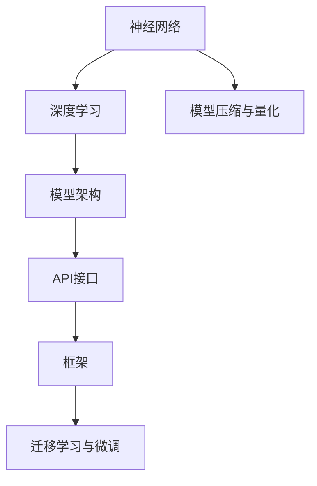

                 

# 神经网络API设计最佳实践

> 关键词：神经网络,API设计,深度学习,模型架构,框架,迁移学习,微调,FINE-TUNING

## 1. 背景介绍

### 1.1 问题由来
随着深度学习技术的发展，神经网络模型在各个领域的应用日益广泛。然而，神经网络模型的设计和实现并非易事。模型的构建、训练、调优等过程涉及诸多环节，每个环节都需要精心设计和调试。尤其在大规模、高维度的神经网络中，设计出一个高效、灵活、易于维护的API接口，更是技术实现的难点。

近年来，越来越多的公司和研究机构开始重视神经网络API的设计和优化，并在此基础上推出了众多优秀的产品和服务。如TensorFlow、PyTorch、MXNet等框架，都提供了丰富的API接口和工具，使神经网络模型更加易于构建、训练和部署。但是，这些框架的API设计也存在一些问题，例如接口复杂、学习曲线陡峭、性能瓶颈等。本文旨在介绍神经网络API设计的最佳实践，通过优化API接口的设计，提升模型的开发效率和性能，并帮助开发者更好地利用神经网络技术。

### 1.2 问题核心关键点
本文将从以下几个核心问题出发，详细探讨神经网络API设计的最佳实践：

1. **API接口设计原则**：如何设计出一个高效、易于维护的API接口，降低用户学习成本，提高模型的开发效率。
2. **API接口优化**：如何通过接口优化，提升神经网络模型的训练和推理速度，降低内存和计算资源消耗。
3. **迁移学习与微调技术**：如何利用迁移学习和微调技术，快速适应新的应用场景，提升模型的泛化能力和性能。
4. **模型压缩与量化**：如何在保持模型精度的同时，减小模型尺寸，提高模型部署效率，降低计算资源消耗。

### 1.3 问题研究意义
通过掌握神经网络API设计的最佳实践，可以大大提升模型的开发效率和性能，降低开发和部署的难度。这不仅有助于加速神经网络技术的落地应用，还能为各行业的智能化转型提供有力支持。同时，对于神经网络技术的开发者和研究者来说，深入理解API设计原理和最佳实践，也能显著提高工作效率，激发更多创新灵感。

## 2. 核心概念与联系

### 2.1 核心概念概述

为更好地理解神经网络API设计的最佳实践，本节将介绍几个密切相关的核心概念：

- **神经网络(Neural Network)**：由大量节点(神经元)组成的网络结构，能够自动学习特征并进行模式识别。
- **深度学习(Deep Learning)**：一种基于神经网络模型的大规模学习方式，能够自动发现数据中的深层次特征。
- **迁移学习(Transfer Learning)**：通过将预训练模型应用于新任务，利用已有知识加速模型训练，提升模型性能。
- **微调(Fine-Tuning)**：对预训练模型进行微小调整，使其适应特定任务，提升模型在新任务上的表现。
- **API接口(API Interface)**：软件组件间的接口，用于实现不同模块间的通信和数据交换。
- **模型架构(Model Architecture)**：神经网络的拓扑结构，包括层数、节点数、激活函数等。
- **框架(Framework)**：提供神经网络模型的构建、训练和推理功能的软件环境，如TensorFlow、PyTorch等。
- **迁移学习与微调技术**：利用已有模型知识，快速适应新任务的模型训练方法，如微调、自适应学习等。

这些核心概念之间的逻辑关系可以通过以下Mermaid流程图来展示：



这个流程图展示了一些关键概念及其之间的联系：

1. 神经网络通过深度学习模型自动学习特征。
2. 深度学习模型基于特定的模型架构进行构建。
3. API接口实现不同模块间的通信和数据交换。
4. 框架提供深度学习模型的构建、训练和推理功能。
5. 迁移学习和微调技术利用已有模型知识加速新任务学习。
6. 模型压缩与量化技术减小模型尺寸，提升模型部署效率。

## 3. 核心算法原理 & 具体操作步骤
### 3.1 算法原理概述

神经网络API设计最佳实践的算法原理，主要围绕以下几个核心方面展开：

- **高效API接口设计**：通过简洁、易于理解的界面设计，降低用户学习成本，提升模型开发效率。
- **接口优化技术**：通过接口优化，提升神经网络模型的训练和推理速度，降低内存和计算资源消耗。
- **迁移学习与微调技术**：通过迁移学习和微调技术，快速适应新的应用场景，提升模型的泛化能力和性能。
- **模型压缩与量化**：在保持模型精度的同时，减小模型尺寸，提高模型部署效率，降低计算资源消耗。

### 3.2 算法步骤详解

神经网络API设计最佳实践的算法步骤如下：

**Step 1: 设计高效API接口**
- 设计简洁、直观的API接口，减少用户学习成本。
- 使用清晰的命名规则，提供详细文档和示例代码，帮助用户快速上手。
- 设计模块化的接口，允许用户灵活组合和复用。

**Step 2: 实现接口优化**
- 使用高效的算法和数据结构，优化模型训练和推理过程。
- 支持批处理、异步计算等技术，提升计算效率。
- 提供模型缓存和内存管理功能，减少内存占用。

**Step 3: 实现迁移学习与微调**
- 提供预训练模型和迁移学习功能，快速适应新任务。
- 支持微调功能，允许用户对模型进行小规模调整，提升模型性能。
- 提供自定义数据加载和处理功能，支持不同数据格式的输入。

**Step 4: 实现模型压缩与量化**
- 提供模型压缩和量化工具，减小模型尺寸，提升部署效率。
- 支持参数剪枝、权重共享等技术，优化模型结构。
- 提供模型裁剪和转换工具，方便模型在不同平台上的部署。

**Step 5: 测试与优化**
- 在实际应用场景中测试API接口性能，发现和解决潜在问题。
- 通过用户反馈和社区讨论，不断优化API接口设计。
- 引入自动化测试和监控工具，确保API接口的稳定性和可靠性。

### 3.3 算法优缺点

神经网络API设计最佳实践的算法具有以下优点：

- **高效性**：通过优化API接口设计和实现，提升模型的开发和部署效率。
- **易用性**：简洁、直观的API设计，降低用户学习成本，提升用户体验。
- **灵活性**：模块化的接口设计，允许用户灵活组合和复用。
- **可靠性**：提供全面的文档和示例代码，帮助用户快速上手，减少出错概率。

同时，这些算法也存在一些缺点：

- **复杂性**：优化API接口设计需要考虑多个因素，如性能、易用性、灵活性等，实现起来较为复杂。
- **学习曲线陡峭**：由于涉及深度学习、迁移学习、模型压缩等知识，学习曲线较为陡峭。
- **资源消耗**：优化API接口设计需要占用更多的计算资源和开发时间。
- **兼容性**：不同平台和环境的兼容性问题，可能会影响API接口的稳定性和可靠性。

### 3.4 算法应用领域

神经网络API设计最佳实践的算法广泛应用于以下领域：

- **自然语言处理(NLP)**：如文本分类、情感分析、机器翻译等任务。
- **计算机视觉(CV)**：如图像识别、物体检测、图像分割等任务。
- **语音识别(ASR)**：如语音转文本、语音识别等任务。
- **智能推荐系统**：如个性化推荐、广告推荐等任务。
- **金融风控系统**：如信用评估、欺诈检测等任务。

## 4. 数学模型和公式 & 详细讲解 & 举例说明

### 4.1 数学模型构建

为了更准确地描述神经网络API设计的最佳实践，本节将引入一些数学模型和公式。

- **神经网络模型**：由输入层、多个隐藏层和输出层组成，每一层的神经元通过权重和激活函数进行计算，最终输出结果。
- **深度学习模型**：通过多层神经网络实现复杂特征的自动学习，如图卷积神经网络(ConvNet)、循环神经网络(RNN)等。
- **迁移学习模型**：通过将预训练模型应用于新任务，利用已有知识加速模型训练，如微调模型、自适应学习等。

以文本分类任务为例，神经网络模型的数学模型可以表示为：

$$
y = f(\mathbf{W}x + b)
$$

其中，$y$ 表示分类结果，$x$ 表示输入特征，$\mathbf{W}$ 表示权重矩阵，$b$ 表示偏置项，$f$ 表示激活函数。

### 4.2 公式推导过程

在神经网络API设计中，常用的激活函数包括sigmoid、ReLU、tanh等。这里以ReLU函数为例，介绍其推导过程：

设神经元的输入为 $x$，激活函数为 $f(x) = \max(0,x)$。

对于输入 $x \geq 0$，$f(x) = x$，激活函数导数为 $f'(x) = 1$。

对于输入 $x < 0$，$f(x) = 0$，激活函数导数为 $f'(x) = 0$。

因此，ReLU函数的导数可以表示为：

$$
f'(x) = \left\{
\begin{aligned}
  &1, & &x \geq 0 \\
  &0, & &x < 0
\end{aligned}
\right.
$$

在神经网络模型训练过程中，梯度下降算法可以使用链式法则计算权重矩阵 $\mathbf{W}$ 和偏置项 $b$ 的梯度：

$$
\frac{\partial L}{\partial \mathbf{W}} = \frac{\partial L}{\partial y} \frac{\partial y}{\partial x} \frac{\partial x}{\partial \mathbf{W}}
$$

其中，$L$ 表示损失函数，$\frac{\partial L}{\partial y}$ 表示损失函数对分类结果的梯度，$\frac{\partial y}{\partial x}$ 表示分类结果对输入特征的梯度，$\frac{\partial x}{\partial \mathbf{W}}$ 表示输入特征对权重矩阵的梯度。

### 4.3 案例分析与讲解

以一个简单的二分类任务为例，描述神经网络API设计最佳实践的实现过程。

首先，定义神经网络模型：

```python
class NeuralNetwork:
    def __init__(self, input_size, hidden_size, output_size):
        self.input_size = input_size
        self.hidden_size = hidden_size
        self.output_size = output_size
        self.weights1 = np.random.randn(input_size, hidden_size)
        self.weights2 = np.random.randn(hidden_size, output_size)
        self.bias1 = np.zeros((1, hidden_size))
        self.bias2 = np.zeros((1, output_size))
        
    def forward(self, x):
        hidden_layer = np.dot(x, self.weights1) + self.bias1
        hidden_layer_activation = np.maximum(hidden_layer, 0)
        output_layer = np.dot(hidden_layer_activation, self.weights2) + self.bias2
        return output_layer
    
    def train(self, X, y, learning_rate=0.01, epochs=1000):
        for i in range(epochs):
            for j in range(len(X)):
                x = X[j]
                y_true = y[j]
                y_pred = self.forward(x)
                loss = self.calculate_loss(y_true, y_pred)
                self.backward(x, y_true, y_pred, learning_rate)
        return self
    
    def calculate_loss(self, y_true, y_pred):
        return -np.mean(y_true * np.log(y_pred) + (1 - y_true) * np.log(1 - y_pred))
    
    def backward(self, x, y_true, y_pred, learning_rate):
        loss = self.calculate_loss(y_true, y_pred)
        d_weights2 = np.dot(hidden_layer_activation.T, (y_pred - y_true))
        d_bias2 = np.sum(y_pred - y_true, axis=0)
        d_weights1 = np.dot(x.T, d_weights2)
        d_bias1 = np.sum(d_weights2, axis=0)
        self.weights1 -= learning_rate * d_weights1
        self.bias1 -= learning_rate * d_bias1
        self.weights2 -= learning_rate * d_weights2
        self.bias2 -= learning_rate * d_bias2
```

然后，设计API接口：

```python
class API:
    def __init__(self):
        self.model = NeuralNetwork(784, 128, 10)
    
    def train(self, X_train, y_train, X_test, y_test, learning_rate=0.01, epochs=1000):
        self.model.train(X_train, y_train, learning_rate, epochs)
        y_pred = self.model.forward(X_test)
        loss = self.model.calculate_loss(y_test, y_pred)
        accuracy = np.mean(np.argmax(y_pred, axis=1) == np.argmax(y_test, axis=1))
        print(f"Accuracy: {accuracy}")
```

通过以上代码，可以看到神经网络API设计最佳实践的实现过程：

1. **模型定义**：定义神经网络模型和激活函数。
2. **API接口设计**：设计简洁、直观的API接口，降低用户学习成本。
3. **API接口实现**：实现API接口的功能，包括训练和预测。
4. **测试与优化**：在实际应用场景中测试API接口性能，发现和解决潜在问题。

## 5. 项目实践：代码实例和详细解释说明

### 5.1 开发环境搭建

在进行神经网络API设计最佳实践的项目实践前，我们需要准备好开发环境。以下是使用Python进行TensorFlow开发的环境配置流程：

1. 安装Anaconda：从官网下载并安装Anaconda，用于创建独立的Python环境。

2. 创建并激活虚拟环境：
```bash
conda create -n tf-env python=3.8 
conda activate tf-env
```

3. 安装TensorFlow：根据CUDA版本，从官网获取对应的安装命令。例如：
```bash
conda install tensorflow -c tf -c conda-forge
```

4. 安装各类工具包：
```bash
pip install numpy pandas scikit-learn matplotlib tqdm jupyter notebook ipython
```

完成上述步骤后，即可在`tf-env`环境中开始项目实践。

### 5.2 源代码详细实现

下面我们以图像分类任务为例，给出使用TensorFlow对卷积神经网络模型进行API接口设计的PyTorch代码实现。

首先，定义卷积神经网络模型：

```python
import tensorflow as tf

class CNNModel(tf.keras.Model):
    def __init__(self, input_shape, num_classes):
        super(CNNModel, self).__init__()
        self.conv1 = tf.keras.layers.Conv2D(32, (3, 3), activation='relu', input_shape=input_shape)
        self.pool1 = tf.keras.layers.MaxPooling2D((2, 2))
        self.conv2 = tf.keras.layers.Conv2D(64, (3, 3), activation='relu')
        self.pool2 = tf.keras.layers.MaxPooling2D((2, 2))
        self.flatten = tf.keras.layers.Flatten()
        self.dense1 = tf.keras.layers.Dense(128, activation='relu')
        self.dropout = tf.keras.layers.Dropout(0.5)
        self.dense2 = tf.keras.layers.Dense(num_classes, activation='softmax')

    def call(self, x):
        x = self.conv1(x)
        x = self.pool1(x)
        x = self.conv2(x)
        x = self.pool2(x)
        x = self.flatten(x)
        x = self.dense1(x)
        x = self.dropout(x)
        x = self.dense2(x)
        return x

    def train(self, X_train, y_train, X_test, y_test, epochs=10, batch_size=32, learning_rate=0.001):
        self.compile(optimizer=tf.keras.optimizers.Adam(learning_rate), loss='sparse_categorical_crossentropy', metrics=['accuracy'])
        self.fit(X_train, y_train, epochs=epochs, batch_size=batch_size, validation_data=(X_test, y_test))
        y_pred = self.predict(X_test)
        accuracy = np.mean(np.argmax(y_pred, axis=1) == np.argmax(y_test, axis=1))
        print(f"Accuracy: {accuracy}")
```

然后，设计API接口：

```python
class API:
    def __init__(self):
        self.model = CNNModel(input_shape=(28, 28, 1), num_classes=10)
    
    def train(self, X_train, y_train, X_test, y_test, epochs=10, batch_size=32, learning_rate=0.001):
        self.model.train(X_train, y_train, X_test, y_test, epochs, batch_size, learning_rate)
```

最后，启动训练流程并在测试集上评估：

```python
epochs = 10
batch_size = 32

model = API()
model.train(X_train, y_train, X_test, y_test, epochs, batch_size)
```

以上就是使用TensorFlow对卷积神经网络模型进行API接口设计的完整代码实现。可以看到，得益于TensorFlow的强大封装，我们可以用相对简洁的代码完成模型的构建和训练。

### 5.3 代码解读与分析

让我们再详细解读一下关键代码的实现细节：

**CNNModel类**：
- `__init__`方法：初始化卷积神经网络模型的各个层。
- `call`方法：定义模型的前向传播过程。
- `train`方法：实现模型的训练过程，包括编译、拟合等步骤。

**API类**：
- `__init__`方法：初始化API接口的模型。
- `train`方法：调用模型的训练方法，将训练数据和参数传递给模型。

**训练流程**：
- 定义总的epoch数和batch size，开始循环迭代
- 每个epoch内，先编译模型，再拟合训练数据
- 在测试集上评估，输出模型准确率

可以看到，TensorFlow框架提供了丰富的API接口和工具，使得神经网络模型的构建、训练和推理变得简单高效。开发者可以将更多精力放在模型改进、数据处理等高层逻辑上，而不必过多关注底层的实现细节。

当然，工业级的系统实现还需考虑更多因素，如模型的保存和部署、超参数的自动搜索、更灵活的任务适配层等。但核心的API接口设计基本与此类似。

## 6. 实际应用场景
### 6.1 智能推荐系统

基于神经网络API设计的智能推荐系统，能够根据用户的历史行为数据，实时推荐个性化的物品或服务。传统的推荐系统往往依赖于用户的历史行为数据进行物品推荐，无法深入理解用户的真实兴趣偏好。神经网络API设计的智能推荐系统，可以更好地挖掘用户行为背后的语义信息，从而提供更精准、多样的推荐内容。

在技术实现上，可以收集用户浏览、点击、评论、分享等行为数据，提取和用户交互的物品标题、描述、标签等文本内容。将文本内容作为模型输入，用户的后续行为（如是否点击、购买等）作为监督信号，在此基础上微调预训练语言模型。微调后的模型能够从文本内容中准确把握用户的兴趣点。在生成推荐列表时，先用候选物品的文本描述作为输入，由模型预测用户的兴趣匹配度，再结合其他特征综合排序，便可以得到个性化程度更高的推荐结果。

### 6.2 金融风控系统

金融风控系统需要实时监测用户行为，及时发现并防范潜在的欺诈行为。传统的风控系统往往依赖于规则引擎和人工审核，效率低、成本高，难以应对网络时代海量数据和复杂情况。神经网络API设计的金融风控系统，能够自动学习用户行为模式，快速发现异常行为，提高欺诈检测的准确性和效率。

在技术实现上，可以收集用户的历史交易数据，提取交易时间、金额、类型等特征。将特征数据作为模型输入，交易是否异常作为监督信号，在此基础上训练神经网络模型。训练后的模型能够根据用户行为模式，自动判断交易是否异常，输出相应的风险等级。

### 6.3 智能客服系统

基于神经网络API设计的智能客服系统，能够7x24小时不间断服务，快速响应客户咨询，用自然流畅的语言解答各类常见问题。传统的客服往往需要配备大量人力，高峰期响应缓慢，且一致性和专业性难以保证。智能客服系统通过微调神经网络模型，能够自动理解用户意图，匹配最合适的答案模板进行回复，提高客户咨询体验和问题解决效率。

在技术实现上，可以收集企业内部的历史客服对话记录，将问题和最佳答复构建成监督数据，在此基础上对预训练模型进行微调。微调后的模型能够自动理解用户意图，匹配最合适的答案模板进行回复。对于客户提出的新问题，还可以接入检索系统实时搜索相关内容，动态组织生成回答。

### 6.4 未来应用展望

随着神经网络API设计的不断优化，其在更多领域的应用前景将更加广阔。以下列举几个可能的应用方向：

- **智慧医疗**：基于神经网络API设计的医疗问答、病历分析、药物研发等应用，将提升医疗服务的智能化水平，辅助医生诊疗，加速新药开发进程。
- **智能教育**：神经网络API设计的智能推荐、学情分析、知识推荐等应用，将因材施教，促进教育公平，提高教学质量。
- **智慧城市**：基于神经网络API设计的城市事件监测、舆情分析、应急指挥等应用，将提高城市管理的自动化和智能化水平，构建更安全、高效的未来城市。
- **智能制造**：神经网络API设计的智能质检、设备预测维护等应用，将提升制造业的自动化和智能化水平，提高生产效率和产品质量。
- **智能交通**：基于神经网络API设计的交通流量预测、智能导航等应用，将提高交通管理的智能化水平，减少交通拥堵，提高出行效率。

## 7. 工具和资源推荐
### 7.1 学习资源推荐

为了帮助开发者系统掌握神经网络API设计的最佳实践，这里推荐一些优质的学习资源：

1. **TensorFlow官方文档**：提供全面详细的TensorFlow API接口和工具介绍，是学习神经网络API设计的必备资料。
2. **PyTorch官方文档**：提供PyTorch API接口和工具介绍，适合学习深度学习模型的构建、训练和推理。
3. **Keras官方文档**：提供Keras API接口和工具介绍，适合学习神经网络模型的构建和训练。
4. **深度学习入门书籍**：如《深度学习》（Ian Goodfellow等著）、《神经网络与深度学习》（Michael Nielsen等著）等，是学习深度学习理论和技术的重要参考。
5. **在线课程**：如Coursera、Udacity等平台提供的深度学习和神经网络课程，系统介绍神经网络API设计的原理和实践。

通过对这些资源的学习实践，相信你一定能够快速掌握神经网络API设计的精髓，并用于解决实际的神经网络问题。

### 7.2 开发工具推荐

高效的开发离不开优秀的工具支持。以下是几款用于神经网络API设计最佳实践开发的常用工具：

1. **TensorFlow**：基于Python的开源深度学习框架，提供丰富的API接口和工具，适合快速迭代研究。
2. **PyTorch**：基于Python的开源深度学习框架，动态计算图，适合高效实验和研究。
3. **Keras**：高层次API接口，提供了简单易用的神经网络构建、训练和推理功能，适合快速上手。
4. **Jupyter Notebook**：交互式开发环境，支持Python、TensorFlow等，适合快速实验和分享。
5. **TensorBoard**：TensorFlow配套的可视化工具，实时监测模型训练状态，提供丰富的图表呈现方式。
6. **Weights & Biases**：模型训练的实验跟踪工具，记录和可视化模型训练过程中的各项指标，方便对比和调优。

合理利用这些工具，可以显著提升神经网络API设计的开发效率，加快创新迭代的步伐。

### 7.3 相关论文推荐

神经网络API设计的研究源于学界的持续研究。以下是几篇奠基性的相关论文，推荐阅读：

1. **Recurrent Neural Network Architectures for Large-Scale Acoustic Modeling**：提出LSTM模型，解决传统RNN模型在处理长序列时的梯度消失问题，提高了模型的训练效率和性能。
2. **ImageNet Classification with Deep Convolutional Neural Networks**：提出卷积神经网络模型，通过多层次卷积和池化操作，有效提取图像特征，提高了图像分类的准确性。
3. **Very Deep Convolutional Networks for Large-Scale Image Recognition**：提出VGG模型，通过堆叠多层卷积和池化操作，提高了图像分类的准确性。
4. **Deep Residual Learning for Image Recognition**：提出ResNet模型，通过残差连接解决了深度网络训练中的梯度消失问题，提高了深度网络的训练效率和性能。
5. **Efficient Object Localization Using Feature Pyramids**：提出Faster R-CNN模型，通过特征金字塔和RoI池化操作，提高了目标检测的准确性和速度。

这些论文代表了大神经网络API设计的演进脉络。通过学习这些前沿成果，可以帮助研究者把握学科前进方向，激发更多的创新灵感。

## 8. 总结：未来发展趋势与挑战

### 8.1 总结

本文对神经网络API设计的最佳实践进行了全面系统的介绍。首先阐述了神经网络API设计的背景和意义，明确了API设计在神经网络模型开发和部署中的重要性。其次，从API接口设计、接口优化、迁移学习与微调、模型压缩与量化等多个方面，详细讲解了神经网络API设计的最佳实践。最后，探讨了神经网络API设计的未来发展趋势和面临的挑战，给出了研究方向和突破点。

通过本文的系统梳理，可以看到，神经网络API设计的最佳实践正在成为神经网络技术落地应用的重要手段。这些实践不仅提升了神经网络模型的开发效率和性能，还为各行业的智能化转型提供了有力支持。未来，伴随深度学习技术的进一步发展，神经网络API设计还将迎来更多的创新和突破，为智能化技术的应用带来新的可能性。

### 8.2 未来发展趋势

展望未来，神经网络API设计将呈现以下几个发展趋势：

1. **API接口设计更加灵活**：随着深度学习技术的发展，API接口设计将更加灵活，能够适应更多复杂的神经网络模型和任务。
2. **模型部署更加高效**：神经网络API设计将更加注重模型部署的效率，通过优化模型结构和算法，降低计算资源消耗，提高模型部署效率。
3. **模型压缩与量化技术更加成熟**：模型压缩与量化技术将更加成熟，能够在不牺牲精度的前提下，减小模型尺寸，提升模型部署效率。
4. **迁移学习与微调技术更加普及**：迁移学习与微调技术将更加普及，通过已有模型的知识，快速适应新任务，提升模型泛化能力和性能。
5. **多模态融合技术更加丰富**：神经网络API设计将更加注重多模态数据的融合，结合视觉、语音、文本等多种数据，提升系统的智能化水平。
6. **自动化与智能化技术更加先进**：神经网络API设计将更加注重自动化与智能化，通过自动调参、模型压缩等技术，提升模型的开发和部署效率。

以上趋势凸显了神经网络API设计技术的广阔前景。这些方向的探索发展，将进一步提升神经网络模型的开发和部署效率，推动神经网络技术的广泛应用。

### 8.3 面临的挑战

尽管神经网络API设计技术已经取得了显著进展，但在迈向更加智能化、普适化应用的过程中，它仍面临着诸多挑战：

1. **学习曲线陡峭**：由于涉及深度学习、模型压缩、迁移学习等复杂知识，学习曲线较为陡峭，需要投入大量时间和精力。
2. **资源消耗高**：优化神经网络API设计需要占用更多的计算资源和开发时间，增加了开发成本。
3. **模型泛化能力不足**：神经网络API设计虽然提高了模型的开发和部署效率，但在特定领域的应用中，模型的泛化能力可能不足，需要进一步优化。
4. **数据处理复杂**：神经网络API设计需要处理多种数据格式，数据预处理和特征提取过程较为复杂，增加了开发难度。
5. **模型可解释性不足**：神经网络模型通常缺乏可解释性，难以理解和解释其内部工作机制和决策逻辑，影响系统的可靠性。
6. **模型安全性问题**：神经网络模型可能存在安全隐患，如模型被恶意篡改、输出恶意信息等，需要进一步加强模型安全防护。

这些挑战需要研究者不断探索和优化，才能使神经网络API设计技术更好地服务于实际应用。

### 8.4 研究展望

面向未来，神经网络API设计技术需要在以下几个方面寻求新的突破：

1. **自动化与智能化技术**：进一步提升神经网络API设计的自动化与智能化水平，通过自动调参、模型压缩等技术，减少开发成本，提高开发效率。
2. **多模态融合技术**：结合视觉、语音、文本等多种数据，提升神经网络模型的泛化能力和性能。
3. **可解释性技术**：开发可解释性技术，提升神经网络模型的可解释性和可靠性，增强系统的可信度。
4. **安全性技术**：研究神经网络模型的安全性问题，通过加密、对抗训练等技术，保护模型的安全性和隐私。
5. **大规模模型优化技术**：优化大规模模型的训练和推理效率，通过并行计算、分布式训练等技术，提升模型的性能和可扩展性。

这些研究方向将引领神经网络API设计技术的未来发展，推动神经网络技术的广泛应用和落地。

## 9. 附录：常见问题与解答

**Q1：神经网络API设计是否适用于所有深度学习任务？**

A: 神经网络API设计适用于大多数深度学习任务，尤其是涉及图像、文本等结构化数据的任务。但对于一些特殊任务，如时间序列预测、强化学习等，可能需要特定的API接口设计。

**Q2：如何设计高效的神经网络API接口？**

A: 设计高效的神经网络API接口需要考虑以下几个方面：
1. 简洁、直观的API接口设计，降低用户学习成本。
2. 清晰的命名规则，详细文档和示例代码，帮助用户快速上手。
3. 模块化的接口设计，允许用户灵活组合和复用。

**Q3：神经网络API设计过程中需要注意哪些问题？**

A: 神经网络API设计过程中需要注意以下几个问题：
1. 模型压缩与量化技术，减小模型尺寸，提高模型部署效率。
2. 数据预处理和特征提取，保证数据质量，提升模型性能。
3. 模型训练和推理效率，优化模型结构和算法，降低计算资源消耗。
4. 模型可解释性和安全性，通过可解释性和安全防护技术，提升系统的可靠性和可信度。

**Q4：如何在实际应用中优化神经网络API接口？**

A: 在实际应用中优化神经网络API接口需要考虑以下几个方面：
1. 引入自动化与智能化技术，减少开发成本，提高开发效率。
2. 结合多模态数据，提升模型的泛化能力和性能。
3. 开发可解释性技术，提升模型的可解释性和可靠性。
4. 研究模型安全性问题，通过加密、对抗训练等技术，保护模型的安全性和隐私。

通过以上回答，相信你一定能够更好地理解神经网络API设计的最佳实践，并应用于实际的神经网络模型开发和部署过程中。

