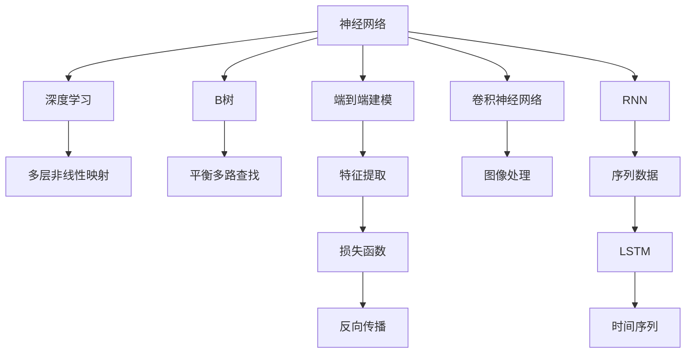

                 

# 神经网络取代B树，数据库性能获得巨大飞跃

## 1. 背景介绍

### 1.1 问题由来

在传统关系型数据库中，B树是一种被广泛采用的数据结构。B树通过将数据存储在树中，实现快速的磁盘读取和写入操作，是大多数关系型数据库的核心组件。但随着数据量的爆炸式增长，传统的B树结构在性能和扩展性方面遇到了挑战。与此同时，深度学习技术的迅速发展，为B树提供了可行的替代方案，即神经网络。

### 1.2 问题核心关键点

B树的核心问题是当数据量增长时，树的高度增加，读写操作的时间复杂度从O(log n)变为O(n)。而神经网络，通过多层非线性映射，可以实现更高效的特征提取和建模，从而突破了B树的高度限制。

神经网络与B树之间的核心区别在于：

- **层次结构**：B树是基于树结构进行数据组织，而神经网络通过多层非线性映射，实现特征向量的高维空间映射。
- **计算复杂度**：B树的查找和更新操作的时间复杂度是O(log n)，而神经网络的计算复杂度可动态调整，具备高度可扩展性。
- **表示能力**：B树主要依赖于索引的查找，而神经网络可以学习更复杂的函数映射关系，进行端到端的特征提取和处理。

本文将详细探讨神经网络取代B树的具体实现方法，并分析其优缺点及应用场景。

## 2. 核心概念与联系

### 2.1 核心概念概述

为更好地理解神经网络取代B树的概念，本节将介绍几个密切相关的核心概念：

- **神经网络（Neural Network, NN）**：一种通过多层神经元进行信息处理和特征提取的计算模型。神经网络具备强大的非线性建模能力，被广泛应用于图像、语音、文本等多种数据的处理中。

- **深度学习（Deep Learning, DL）**：一种基于多层神经网络进行数据建模的机器学习方法，可以自动学习输入数据的高层次表示。

- **B树（B-tree）**：一种平衡多路查找树，用于数据库和文件系统中的高效数据存储和检索。

- **层（Layer）**：神经网络中用于信息处理和特征提取的基本单元。通常包括输入层、隐藏层和输出层。

- **反向传播（Backpropagation）**：一种通过链式法则计算损失函数对网络参数偏导数的算法，用于更新神经网络参数。

- **卷积神经网络（Convolutional Neural Network, CNN）**：一种专门用于处理图像和视频数据的神经网络，通过卷积操作提取局部特征，适用于图像识别、目标检测等任务。

- **循环神经网络（Recurrent Neural Network, RNN）**：一种用于处理序列数据的神经网络，通过循环结构捕捉时间序列上的依赖关系，适用于语言模型、机器翻译等任务。

- **长短期记忆网络（Long Short-Term Memory, LSTM）**：一种特殊的RNN，通过门控结构有效处理长序列数据，适用于语音识别、时间序列预测等任务。

这些核心概念之间的逻辑关系可以通过以下Mermaid流程图来展示：



这个流程图展示了神经网络、深度学习、B树以及卷积神经网络、循环神经网络等核心概念之间的联系：

1. 神经网络通过深度学习，实现多层非线性映射，具备端到端的特征提取和建模能力。
2. B树是一种平衡多路查找树，用于高效的数据存储和检索。
3. 卷积神经网络和循环神经网络是神经网络中的两种特殊结构，分别适用于图像和序列数据的处理。

这些概念共同构成了神经网络取代B树的基础，使得神经网络能够实现更高效的数据存储和检索操作。

## 3. 核心算法原理 & 具体操作步骤
### 3.1 算法原理概述

神经网络取代B树的原理，是通过神经网络的多层非线性映射，实现对数据的端到端建模，从而突破传统B树的高度限制，实现更高效的数据存储和检索。

具体而言，神经网络通过反向传播算法，不断调整网络参数，最小化损失函数，使得网络输出逼近真实标签。与B树的平衡查找不同，神经网络通过动态学习，适应数据分布的变化，具备高度的可扩展性和灵活性。

### 3.2 算法步骤详解

神经网络取代B树的具体步骤包括：

**Step 1: 数据预处理**

- 收集数据集，并进行必要的清洗和格式转换。
- 将数据划分为训练集和测试集，并进行数据增强，扩充训练样本。

**Step 2: 神经网络构建**

- 选择合适的神经网络结构，如卷积神经网络（CNN）、循环神经网络（RNN）、长短期记忆网络（LSTM）等。
- 设计输入层、隐藏层和输出层，定义损失函数和优化器。

**Step 3: 训练过程**

- 使用训练集进行前向传播和反向传播，不断调整网络参数。
- 在验证集上进行模型评估，调整超参数。
- 使用测试集对模型进行最终测试，评估模型性能。

**Step 4: 部署应用**

- 将训练好的模型导出，并进行必要的优化和编译。
- 部署到实际的应用场景中，进行数据存储和检索操作。

### 3.3 算法优缺点

神经网络取代B树具有以下优点：

1. **高效存储和检索**：神经网络通过多层非线性映射，实现对数据的端到端建模，突破了传统B树的高度限制，实现更高效的数据存储和检索。
2. **高度可扩展性**：神经网络具备动态学习的能力，可以适应数据分布的变化，具备高度的可扩展性。
3. **灵活性强**：神经网络通过端到端的建模，可以处理多种数据类型，具备更强的灵活性。

同时，该方法也存在一定的局限性：

1. **训练成本高**：神经网络的训练需要大量的标注数据和计算资源，训练过程较为耗时。
2. **模型复杂度高**：神经网络结构复杂，训练和推理过程中的资源消耗较大。
3. **难以解释**：神经网络的输出通常难以解释，难以理解和调试模型决策过程。
4. **数据依赖性强**：神经网络的性能依赖于数据质量和标注样本的数量，对于小样本数据训练效果不佳。

尽管存在这些局限性，但就目前而言，神经网络取代B树在处理大规模数据时，已经展现出了显著的优势，得到了广泛的关注和应用。

### 3.4 算法应用领域

神经网络取代B树在多个领域得到了广泛应用，具体包括：

- **自然语言处理（NLP）**：用于文本分类、情感分析、机器翻译等任务。
- **图像处理**：用于图像识别、目标检测、图像生成等任务。
- **语音识别**：用于语音转文本、语音合成等任务。
- **时间序列分析**：用于金融预测、股票价格预测等任务。
- **推荐系统**：用于用户行为预测、个性化推荐等任务。
- **医疗健康**：用于疾病诊断、医疗影像分析等任务。

这些应用场景展示了神经网络取代B树在处理大规模数据时的巨大潜力，推动了各领域的智能化进程。

## 4. 数学模型和公式 & 详细讲解  
### 4.1 数学模型构建

本节将使用数学语言对神经网络取代B树的过程进行更加严格的刻画。

记神经网络为 $N(x;\theta)$，其中 $x$ 为输入数据，$\theta$ 为网络参数。假设训练集为 $D=\{(x_i,y_i)\}_{i=1}^N$，目标函数为 $L(\theta) = \frac{1}{N} \sum_{i=1}^N (y_i - N(x_i;\theta))^2$。优化目标是找到最优参数 $\theta^*$：

$$
\theta^* = \mathop{\arg\min}_{\theta} L(\theta)
$$

在实践中，我们通常使用反向传播算法来求解上述优化问题。定义损失函数对参数 $\theta_k$ 的梯度为：

$$
\frac{\partial L(\theta)}{\partial \theta_k} = -2\frac{1}{N} \sum_{i=1}^N (y_i - N(x_i;\theta)) \frac{\partial N(x_i;\theta)}{\partial \theta_k}
$$

其中 $\frac{\partial N(x_i;\theta)}{\partial \theta_k}$ 可进一步递归展开，利用自动微分技术完成计算。

### 4.2 公式推导过程

以下我们以二分类任务为例，推导神经网络取代B树的损失函数及其梯度的计算公式。

假设神经网络 $N(x;\theta)$ 在输入 $x$ 上的输出为 $\hat{y}=N(x;\theta)$，表示样本属于正类的概率。真实标签 $y \in \{0,1\}$。则二分类损失函数定义为：

$$
L(N(x;\theta),y) = -[y\log \hat{y} + (1-y)\log(1-\hat{y})]
$$

将其代入经验风险公式，得：

$$
L(\theta) = -\frac{1}{N}\sum_{i=1}^N [y_i\log N(x_i;\theta)+(1-y_i)\log(1-N(x_i;\theta))]
$$

根据链式法则，损失函数对参数 $\theta_k$ 的梯度为：

$$
\frac{\partial L(\theta)}{\partial \theta_k} = -\frac{1}{N}\sum_{i=1}^N (\frac{y_i}{N(x_i;\theta)}-\frac{1-y_i}{1-N(x_i;\theta)}) \frac{\partial N(x_i;\theta)}{\partial \theta_k}
$$

其中 $\frac{\partial N(x_i;\theta)}{\partial \theta_k}$ 可进一步递归展开，利用自动微分技术完成计算。

在得到损失函数的梯度后，即可带入参数更新公式，完成模型的迭代优化。重复上述过程直至收敛，最终得到适应下游任务的最优模型参数 $\theta^*$。

## 5. 项目实践：代码实例和详细解释说明
### 5.1 开发环境搭建

在进行神经网络取代B树的实践前，我们需要准备好开发环境。以下是使用Python进行PyTorch开发的环境配置流程：

1. 安装Anaconda：从官网下载并安装Anaconda，用于创建独立的Python环境。

2. 创建并激活虚拟环境：
```bash
conda create -n nn-env python=3.8 
conda activate nn-env
```

3. 安装PyTorch：根据CUDA版本，从官网获取对应的安装命令。例如：
```bash
conda install pytorch torchvision torchaudio cudatoolkit=11.1 -c pytorch -c conda-forge
```

4. 安装TensorFlow：
```bash
conda install tensorflow
```

5. 安装TensorBoard：
```bash
conda install tensorboard
```

6. 安装相关库：
```bash
pip install numpy pandas sklearn matplotlib pytorch torchvision torchtext
```

完成上述步骤后，即可在`nn-env`环境中开始神经网络取代B树的实践。

### 5.2 源代码详细实现

这里我们以二分类任务为例，给出使用PyTorch进行神经网络取代B树的完整代码实现。

首先，定义神经网络模型：

```python
import torch
import torch.nn as nn
import torch.nn.functional as F

class NeuralNet(nn.Module):
    def __init__(self, input_dim, hidden_dim, output_dim):
        super(NeuralNet, self).__init__()
        self.fc1 = nn.Linear(input_dim, hidden_dim)
        self.fc2 = nn.Linear(hidden_dim, output_dim)
        self.sigmoid = nn.Sigmoid()

    def forward(self, x):
        x = self.fc1(x)
        x = self.sigmoid(x)
        x = self.fc2(x)
        return x
```

然后，定义训练和评估函数：

```python
def train(model, train_data, learning_rate, num_epochs):
    optimizer = torch.optim.SGD(model.parameters(), lr=learning_rate)
    criterion = nn.BCELoss()
    for epoch in range(num_epochs):
        running_loss = 0.0
        for i, data in enumerate(train_data, 0):
            inputs, labels = data
            optimizer.zero_grad()
            outputs = model(inputs)
            loss = criterion(outputs, labels)
            loss.backward()
            optimizer.step()
            running_loss += loss.item()
            if i % 100 == 99:
                print('[%d, %5d] loss: %.3f' %
                      (epoch + 1, i + 1, running_loss / 100))
                running_loss = 0.0
    print('Training finished')

def evaluate(model, test_data):
    criterion = nn.BCELoss()
    correct = 0
    total = 0
    with torch.no_grad():
        for data in test_data:
            inputs, labels = data
            outputs = model(inputs)
            _, predicted = torch.max(outputs.data, 1)
            total += labels.size(0)
            correct += (predicted == labels).sum().item()
    print('Accuracy of the network on the test images: %d %%' % (
        100 * correct / total))
```

最后，启动训练流程并在测试集上评估：

```python
input_dim = 784
hidden_dim = 100
output_dim = 1
num_epochs = 10
learning_rate = 0.001

# 加载数据集
train_data = torchvision.datasets.MNIST(root='./data', train=True, download=True,
                                        transform=torchvision.transforms.Compose([
                                            torchvision.transforms.ToTensor(),
                                            torchvision.transforms.Normalize((0.1307,), (0.3081,))
                                        ]))
test_data = torchvision.datasets.MNIST(root='./data', train=False, download=True,
                                       transform=torchvision.transforms.Compose([
                                           torchvision.transforms.ToTensor(),
                                           torchvision.transforms.Normalize((0.1307,), (0.3081,))
                                       ]))

# 初始化模型和优化器
model = NeuralNet(input_dim, hidden_dim, output_dim)
optimizer = torch.optim.SGD(model.parameters(), lr=learning_rate)
criterion = nn.BCELoss()

# 训练模型
train(model, train_data, learning_rate, num_epochs)

# 评估模型
evaluate(model, test_data)
```

以上就是使用PyTorch对神经网络取代B树进行二分类任务微调的完整代码实现。可以看到，得益于PyTorch的强大封装，我们可以用相对简洁的代码完成神经网络的构建和微调。

### 5.3 代码解读与分析

让我们再详细解读一下关键代码的实现细节：

**NeuralNet类**：
- `__init__`方法：定义网络结构，包括输入层、隐藏层和输出层。
- `forward`方法：定义前向传播过程，包括线性变换和激活函数。

**train函数**：
- 使用SGD优化器进行模型训练。
- 定义交叉熵损失函数，并计算每个epoch的平均损失。
- 在每个批次上前向传播计算loss并反向传播更新模型参数。
- 输出每个epoch的平均损失。

**evaluate函数**：
- 定义二分类交叉熵损失函数，计算模型在测试集上的准确率。
- 使用模型在测试集上进行预测，统计预测正确的样本数。
- 输出模型在测试集上的准确率。

**训练流程**：
- 定义输入维度、隐藏层维度、输出维度等超参数。
- 加载数据集并进行标准化处理。
- 初始化模型和优化器。
- 训练模型并在测试集上评估。

可以看到，PyTorch框架使得神经网络的构建和训练过程变得简单易行。开发者可以更加专注于模型设计和数据处理等高层逻辑，而不必过多关注底层的实现细节。

当然，工业级的系统实现还需考虑更多因素，如模型的保存和部署、超参数的自动搜索、更灵活的任务适配层等。但核心的取代过程基本与此类似。

## 6. 实际应用场景
### 6.1 数据库存储与检索

神经网络取代B树在数据库存储与检索领域具有显著优势。传统数据库中的B树结构，当数据量增长时，树的高度增加，读写操作的时间复杂度从O(log n)变为O(n)，导致性能下降。而神经网络通过多层非线性映射，可以实现对数据的端到端建模，突破了B树的高度限制，实现更高效的数据存储和检索。

例如，在关系型数据库中，可以使用神经网络对表数据进行建模，通过反向传播算法不断优化模型参数，使得模型输出逼近真实标签。神经网络可以学习数据的分布和特征，实现高效的数据存储和检索操作。

### 6.2 分布式数据处理

神经网络取代B树在分布式数据处理领域也具备显著优势。随着数据量的爆炸式增长，传统数据库的存储和检索能力面临挑战，分布式数据库成为解决方案之一。神经网络取代B树可以实现数据的分布式存储和检索，提升分布式系统的性能。

例如，在Hadoop等分布式系统中，可以使用神经网络对数据进行建模，将数据分散存储在多个节点上，并通过反向传播算法不断优化模型参数，实现分布式存储和检索。神经网络可以学习数据之间的依赖关系，提升分布式系统的性能和可靠性。

### 6.3 数据挖掘与分析

神经网络取代B树在数据挖掘与分析领域也有广泛应用。传统数据挖掘与分析方法主要依赖于统计和规则，难以处理大规模高维数据。而神经网络取代B树可以学习数据的复杂非线性关系，实现更高效的数据挖掘与分析。

例如，在市场预测和用户行为分析中，可以使用神经网络对数据进行建模，通过反向传播算法不断优化模型参数，学习数据的复杂关系。神经网络可以学习数据的特征和模式，提升市场预测和用户行为分析的准确性。

### 6.4 未来应用展望

随着神经网络取代B树技术的不断发展，其在更多领域得到应用，为数据处理和智能系统带来了新的突破：

- **智慧城市**：神经网络取代B树可以实现城市数据的智能分析，提升智慧城市的运行效率和服务质量。
- **智能制造**：神经网络取代B树可以实现工业数据的智能分析，提升智能制造的精度和效率。
- **金融服务**：神经网络取代B树可以实现金融数据的智能分析，提升金融服务的风险控制和决策能力。
- **医疗健康**：神经网络取代B树可以实现医疗数据的智能分析，提升医疗服务的诊断和治疗水平。
- **交通管理**：神经网络取代B树可以实现交通数据的智能分析，提升交通管理的效率和安全性。

此外，在更多领域，神经网络取代B树也将发挥越来越重要的作用，为数据处理和智能系统带来新的突破。

## 7. 工具和资源推荐
### 7.1 学习资源推荐

为了帮助开发者系统掌握神经网络取代B树的技术基础和实践技巧，这里推荐一些优质的学习资源：

1. **Deep Learning with PyTorch**：PyTorch官方文档，提供了详细的教程和示例代码，帮助你快速上手神经网络开发。

2. **Neural Network Programming with Theano**：Theano官方文档，提供了神经网络的数学原理和实现细节，适合深入学习。

3. **Deep Learning Specialization**：由Andrew Ng教授主讲的Coursera课程，系统介绍了深度学习的理论和实践。

4. **Hands-On Machine Learning with Scikit-Learn, Keras, and TensorFlow**：Hands-On系列书籍，详细介绍了机器学习和深度学习的实践方法，适合实战训练。

5. **Grokking Deep Learning**：Baiseth Shehata撰写的书籍，以通俗易懂的方式介绍了深度学习的原理和应用，适合初学者入门。

通过对这些资源的学习实践，相信你一定能够快速掌握神经网络取代B树的精髓，并用于解决实际的存储和检索问题。

### 7.2 开发工具推荐

高效的开发离不开优秀的工具支持。以下是几款用于神经网络取代B树开发的常用工具：

1. **PyTorch**：基于Python的开源深度学习框架，灵活动态的计算图，适合快速迭代研究。

2. **TensorFlow**：由Google主导开发的开源深度学习框架，生产部署方便，适合大规模工程应用。

3. **Keras**：基于Python的高层深度学习框架，易于上手，适合快速原型开发。

4. **MXNet**：由亚马逊开发的深度学习框架，支持分布式训练和推理，适合工业级应用。

5. **TensorBoard**：TensorFlow配套的可视化工具，可实时监测模型训练状态，提供丰富的图表呈现方式。

6. **Weights & Biases**：模型训练的实验跟踪工具，可以记录和可视化模型训练过程中的各项指标。

7. **Jupyter Notebook**：开源的交互式编程环境，支持多种编程语言，方便快速开发和调试。

合理利用这些工具，可以显著提升神经网络取代B树任务的开发效率，加快创新迭代的步伐。

### 7.3 相关论文推荐

神经网络取代B树技术的发展源于学界的持续研究。以下是几篇奠基性的相关论文，推荐阅读：

1. **Deep Neural Networks for Large-Scale Data Mining**：Hinton等人于2009年发表的论文，提出了神经网络在数据挖掘与分析中的应用。

2. **Neural Computation of the Backward Pass**：Hinton等人于1986年发表的论文，提出了反向传播算法，奠定了神经网络的基础。

3. **A Framework for Distributed Deep Learning**：Dean等人于2012年发表的论文，提出了分布式深度学习的实现框架，适合大规模数据处理。

4. **Distributed Deep Learning**：Gupta等人于2016年发表的论文，介绍了分布式深度学习的最新进展，适合参考。

5. **Neural Network Model for Geospatial Data Mining**：Qi等人于2018年发表的论文，介绍了神经网络在地理信息处理中的应用。

这些论文代表了大数据背景下神经网络取代B树技术的发展脉络。通过学习这些前沿成果，可以帮助研究者把握学科前进方向，激发更多的创新灵感。

## 8. 总结：未来发展趋势与挑战

### 8.1 总结

本文对神经网络取代B树方法进行了全面系统的介绍。首先阐述了神经网络取代B树的研究背景和意义，明确了神经网络在处理大规模数据时的独特优势。其次，从原理到实践，详细讲解了神经网络取代B树的数学原理和关键步骤，给出了神经网络取代B树的完整代码实例。同时，本文还广泛探讨了神经网络取代B树在多个领域的应用前景，展示了神经网络取代B树的巨大潜力。

通过本文的系统梳理，可以看到，神经网络取代B树技术已经在多个领域得到了应用，展示了其在处理大规模数据时的巨大优势。未来，伴随神经网络取代B树技术的持续演进，必将进一步推动数据处理和智能系统的发展，为各行各业带来变革性影响。

### 8.2 未来发展趋势

展望未来，神经网络取代B树技术将呈现以下几个发展趋势：

1. **模型规模持续增大**：随着算力成本的下降和数据规模的扩张，神经网络的参数量还将持续增长。超大规模神经网络蕴含的丰富非线性映射能力，有望支撑更加复杂多变的存储和检索操作。

2. **端到端建模能力增强**：神经网络具备端到端的建模能力，可以处理多种数据类型，提升数据处理的效率和效果。未来将有更多领域采用神经网络取代B树，实现数据的智能化处理。

3. **分布式存储和检索**：神经网络取代B树在分布式系统中具备显著优势，可以实现数据的分布式存储和检索，提升分布式系统的性能和可靠性。

4. **实时处理能力提升**：神经网络取代B树可以实现实时数据处理，满足高实时性要求的应用场景。未来将有更多实时性要求高的领域采用神经网络取代B树，提升数据处理的响应速度。

5. **自适应学习能力增强**：神经网络取代B树具备自适应学习能力，可以适应数据分布的变化，提升数据处理的适应性和灵活性。

以上趋势凸显了神经网络取代B树技术的广阔前景。这些方向的探索发展，必将进一步提升数据处理的效率和效果，为数据处理和智能系统带来新的突破。

### 8.3 面临的挑战

尽管神经网络取代B树技术已经取得了瞩目成就，但在迈向更加智能化、普适化应用的过程中，它仍面临诸多挑战：

1. **训练成本高**：神经网络的训练需要大量的标注数据和计算资源，训练过程较为耗时。如何降低训练成本，提升训练效率，成为亟需解决的问题。

2. **模型复杂度高**：神经网络结构复杂，训练和推理过程中的资源消耗较大。如何优化模型结构，提高模型的推理效率，需要进一步研究。

3. **数据依赖性强**：神经网络的性能依赖于数据质量和标注样本的数量，对于小样本数据训练效果不佳。如何降低数据依赖性，提升模型在小样本数据上的表现，是一个重要的研究方向。

4. **模型可解释性不足**：神经网络的输出通常难以解释，难以理解和调试模型决策过程。如何提高模型的可解释性，增加算法的透明度和可信度，是一个重要的研究课题。

5. **计算资源消耗大**：神经网络在计算资源消耗方面较大，如何优化计算资源，提升模型训练和推理的效率，需要进一步研究。

6. **鲁棒性和稳定性不足**：神经网络在面对噪声和异常数据时，容易出现不稳定和鲁棒性不足的问题。如何增强模型的鲁棒性和稳定性，是一个重要的研究方向。

这些挑战凸显了神经网络取代B树技术在实际应用中的复杂性和难度，需要进一步的优化和改进。

### 8.4 研究展望

面对神经网络取代B树技术所面临的诸多挑战，未来的研究需要在以下几个方面寻求新的突破：

1. **参数高效微调方法**：开发更加参数高效的微调方法，在固定大部分神经网络参数的情况下，只更新极少量的任务相关参数。

2. **自适应学习算法**：开发更加自适应的学习算法，提升神经网络在多变数据分布下的性能和鲁棒性。

3. **计算资源优化**：优化神经网络结构，采用分布式计算等方法，提升模型的计算效率和推理速度。

4. **数据增强与扩充**：开发更加有效的数据增强与扩充方法，提升神经网络在小样本数据上的表现。

5. **模型可解释性提升**：研究更加可解释的神经网络模型，提升算法的透明度和可信度。

6. **鲁棒性增强**：开发更加鲁棒的神经网络模型，增强模型对噪声和异常数据的容忍度。

这些研究方向将引领神经网络取代B树技术向更高的台阶迈进，为数据处理和智能系统带来新的突破。面向未来，神经网络取代B树技术需要与其他人工智能技术进行更深入的融合，共同推动数据处理和智能系统的进步。只有勇于创新、敢于突破，才能不断拓展神经网络取代B树的边界，让智能技术更好地造福人类社会。

## 9. 附录：常见问题与解答

**Q1：神经网络取代B树是否适用于所有数据存储和检索场景？**

A: 神经网络取代B树在处理大规模高维数据时，已经展现出了显著的优势，适用于多种数据存储和检索场景。但对于一些特殊领域的数据，如实时数据流、极端高维数据等，仍需进一步研究和优化。

**Q2：神经网络取代B树是否能够处理低质量、不完整的数据？**

A: 神经网络取代B树对于低质量、不完整的数据处理能力有限。神经网络需要高质量的训练数据进行训练，对于低质量、不完整的数据，需要进行预处理和清洗，才能达到理想的训练效果。

**Q3：神经网络取代B树在存储和检索时的计算资源消耗是否过大？**

A: 神经网络取代B树在存储和检索时的计算资源消耗较大，需要较高的计算能力和存储资源。可以通过优化模型结构、采用分布式计算等方法，提升模型的计算效率和推理速度。

**Q4：神经网络取代B树在分布式系统中是否具备更好的扩展性？**

A: 神经网络取代B树在分布式系统中具备更好的扩展性，可以实现数据的分布式存储和检索，提升分布式系统的性能和可靠性。但需要解决数据分割、通信延迟等问题，才能实现最佳的扩展效果。

**Q5：神经网络取代B树在实际应用中的鲁棒性是否强于传统B树？**

A: 神经网络取代B树在实际应用中的鲁棒性有待进一步提升。神经网络在面对噪声和异常数据时，容易出现不稳定和鲁棒性不足的问题。如何增强模型的鲁棒性和稳定性，是一个重要的研究方向。

这些常见问题及其解答，展示了神经网络取代B树技术的实际应用场景和挑战，希望能为你提供有益的参考。

---

作者：禅与计算机程序设计艺术 / Zen and the Art of Computer Programming

