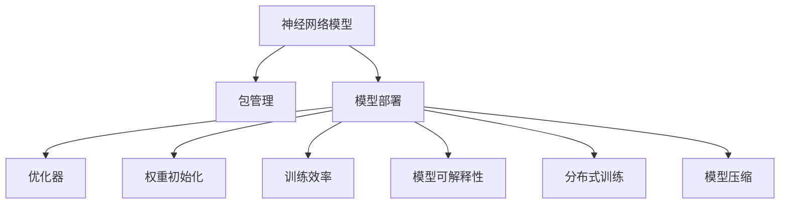

                 

# 神经网络模型的包管理和部署新挑战

> 关键词：神经网络模型,包管理,模型部署,优化器,权重初始化,训练效率,模型可解释性,分布式训练,模型压缩

## 1. 背景介绍

### 1.1 问题由来

在人工智能的飞速发展中，神经网络模型成为核心引擎，它们在图像识别、语音处理、自然语言处理等领域实现了令人瞩目的成果。然而，在实际应用中，神经网络模型的包管理和部署往往面临诸多挑战。这些问题不仅涉及模型性能的优化，还包括资源管理和模型可用性的保障。解决这些问题，将极大推动人工智能技术在各行业的应用落地。

### 1.2 问题核心关键点

- **模型复杂性**：现代神经网络模型往往参数繁多、结构复杂，如何管理和优化这些模型是首要问题。
- **训练效率**：在数据量增大、模型规模扩大的背景下，如何提高训练效率成为关键。
- **模型可解释性**：对于需要解释其决策过程的模型，如何提升其可解释性是重要课题。
- **分布式训练**：随着模型规模的扩大，分布式训练已成为必然趋势，如何高效利用分布式资源成为热点。
- **模型压缩**：模型压缩技术能够优化模型，但如何平衡性能和效率成为难点。

## 2. 核心概念与联系

### 2.1 核心概念概述

为更好地理解神经网络模型的包管理和部署挑战，本节将介绍几个密切相关的核心概念：

- **神经网络模型**：如卷积神经网络(CNN)、循环神经网络(RNN)、深度神经网络(DNN)等，是人工智能中的核心工具，能够处理复杂的数据和模式。

- **包管理**：指在软件发布过程中，通过特定的工具和方法，管理和维护软件包的版本、依赖关系和安装过程，以确保软件的一致性和稳定性。

- **模型部署**：指将训练好的神经网络模型应用到实际问题中，集成到应用程序或服务中，使其能够处理新数据的过程。

- **优化器**：如SGD、Adam、Adagrad等，通过优化算法来最小化损失函数，使模型参数更新更有效。

- **权重初始化**：模型参数的初始值设置，对模型的训练效率和性能有重要影响。

- **训练效率**：指模型在训练时的速度和资源消耗情况，是模型优化和部署的重要考量因素。

- **模型可解释性**：指模型决策过程的可理解性和透明性，对于需要解释输出的应用场景至关重要。

- **分布式训练**：利用多台计算机或服务器并行处理模型训练任务，提高训练效率，处理大规模数据集和复杂模型。

- **模型压缩**：通过剪枝、量化、蒸馏等方法，减小模型规模，提高计算效率，同时保持或提升模型性能。

这些核心概念之间的逻辑关系可以通过以下Mermaid流程图来展示：



这个流程图展示了神经网络模型的核心概念及其之间的关系：

1. 神经网络模型通过包管理发布和部署。
2. 模型部署涉及优化器、权重初始化、训练效率、模型可解释性、分布式训练和模型压缩等多方面优化。
3. 这些优化措施共同作用，提升模型的实际应用效果。

## 3. 核心算法原理 & 具体操作步骤
### 3.1 算法原理概述

神经网络模型的包管理和部署是一个复杂的多学科交叉问题，涉及软件工程、计算机体系结构、优化算法等多个领域。其核心思想是：通过系统化的方法和工具，高效管理模型的生命周期，从开发、训练到部署，确保模型能够以最佳状态投入实际应用。

### 3.2 算法步骤详解

神经网络模型的包管理和部署一般包括以下几个关键步骤：

**Step 1: 准备模型与数据**
- 选择合适的深度学习框架(如TensorFlow、PyTorch)，编写模型代码。
- 准备模型训练所需的数据集，并进行必要的预处理和划分。

**Step 2: 设置模型参数与超参数**
- 根据任务需求，设计模型的结构和参数，包括层数、节点数、激活函数等。
- 确定训练过程中的超参数，如学习率、批量大小、迭代轮数等。

**Step 3: 初始化权重**
- 选择合适的权重初始化方法(如Xavier、He等)，对模型参数进行初始化。

**Step 4: 选择优化器**
- 根据模型复杂度和训练数据量，选择合适的优化器(如SGD、Adam、Adagrad等)。

**Step 5: 编写训练脚本**
- 使用训练框架(如Keras、PyTorch等)，编写模型训练脚本，包括前向传播、损失计算、反向传播等步骤。

**Step 6: 执行模型训练**
- 使用分布式训练框架(如Horovod、Pyro等)，在多台机器上并行训练模型。

**Step 7: 模型评估与调优**
- 在验证集上评估模型性能，根据评估结果调整模型结构和超参数。

**Step 8: 模型压缩与优化**
- 使用剪枝、量化等技术，减小模型规模，提升模型效率。

**Step 9: 模型部署与集成**
- 将训练好的模型保存为特定格式(如ONNX、TensorFlow Lite等)，集成到应用系统中。

**Step 10: 监控与维护**
- 部署模型后，持续监控模型性能和应用效果，及时进行维护和优化。

以上是神经网络模型包管理和部署的一般流程。在实际应用中，还需要根据具体任务和环境，对每个步骤进行优化设计，以确保模型能够高效稳定地运行。

### 3.3 算法优缺点

神经网络模型的包管理和部署方法具有以下优点：

- **可复用性**：通过包管理和部署，模型可以被多个项目重复使用，减少开发时间。
- **效率提升**：通过分布式训练和模型优化，可以显著提升模型训练和推理效率。
- **易维护性**：统一的包管理和部署流程，使得模型维护和更新变得更加便捷。

同时，该方法也存在一定的局限性：

- **模型复杂性**：对于复杂的神经网络模型，管理和部署难度较大。
- **资源消耗**：大规模模型的训练和推理需要大量计算资源和存储空间。
- **可解释性不足**：深度学习模型的“黑盒”特性，使其决策过程难以解释和调试。
- **模型鲁棒性**：模型在面对新数据和新场景时，可能出现泛化能力不足的问题。

尽管存在这些局限性，但神经网络模型的包管理和部署已成为现代AI技术落地的关键环节。通过不断优化和创新，相关技术的成熟度将不断提升，未来将发挥更加重要的作用。

### 3.4 算法应用领域

神经网络模型的包管理和部署技术，在多个领域得到了广泛的应用：

- **计算机视觉**：用于图像分类、目标检测、人脸识别等任务，提升图像处理能力和识别准确率。
- **自然语言处理**：用于文本分类、情感分析、机器翻译等任务，提高文本处理和语义理解能力。
- **语音识别**：用于语音转文本、说话人识别、语音合成等任务，增强语音交互和处理能力。
- **推荐系统**：用于用户兴趣预测、商品推荐、广告投放等任务，提升个性化推荐效果。
- **金融风控**：用于信用评分、欺诈检测、风险预警等任务，增强金融系统的决策能力。

此外，在智能家居、自动驾驶、工业控制等众多领域，基于神经网络模型的包管理和部署技术也在逐步推广和应用，为各行业带来新的技术突破和业务增值。

## 4. 数学模型和公式 & 详细讲解 & 举例说明
### 4.1 数学模型构建

本节将使用数学语言对神经网络模型的包管理和部署过程进行更加严格的刻画。

记神经网络模型为 $M_{\theta}$，其中 $\theta$ 为模型参数。假设模型在数据集 $D=\{(x_i,y_i)\}_{i=1}^N$ 上的损失函数为 $\mathcal{L}(M_{\theta},D)$，目标是最小化损失函数：

$$
\mathop{\min}_{\theta} \mathcal{L}(M_{\theta},D)
$$

### 4.2 公式推导过程

以一个简单的线性回归模型为例，其损失函数为均方误差：

$$
\mathcal{L}(\theta) = \frac{1}{2N} \sum_{i=1}^N (y_i - M_{\theta}(x_i))^2
$$

根据梯度下降算法，模型参数 $\theta$ 的更新公式为：

$$
\theta \leftarrow \theta - \eta \nabla_{\theta}\mathcal{L}(\theta)
$$

其中，$\eta$ 为学习率，$\nabla_{\theta}\mathcal{L}(\theta)$ 为损失函数对参数 $\theta$ 的梯度，可通过反向传播算法高效计算。

在实际应用中，为了提高训练效率和模型可解释性，还会使用其他优化算法和技术，如AdamW、L2正则、Dropout等。这些优化算法和技术在数学上都有明确的推导过程，并可以应用于复杂的神经网络模型。

### 4.3 案例分析与讲解

考虑一个文本分类任务，假设模型为 $M_{\theta}$，输入为文本向量 $x$，输出为分类概率 $P(y|x)$。模型结构为多层感知机(Multilayer Perceptron, MLP)，参数为 $\theta$，损失函数为交叉熵损失：

$$
\mathcal{L}(\theta) = -\frac{1}{N}\sum_{i=1}^N [y_i\log P(y_i|x_i)+(1-y_i)\log(1-P(y_i|x_i))]
$$

通过梯度下降算法，模型参数 $\theta$ 的更新公式为：

$$
\theta \leftarrow \theta - \eta \nabla_{\theta}\mathcal{L}(\theta)
$$

在实际应用中，为了提升模型性能，还会进行以下操作：

- **权重初始化**：如Xavier初始化，设置合理权重初值，减少梯度爆炸和消失问题。
- **正则化**：如L2正则，避免过拟合，保持模型泛化能力。
- **Dropout**：随机丢弃部分神经元，减少过拟合风险。

通过这些优化措施，可以在保证模型性能的同时，提升训练效率和模型可解释性。

## 5. 项目实践：代码实例和详细解释说明
### 5.1 开发环境搭建

在进行神经网络模型的包管理和部署实践前，我们需要准备好开发环境。以下是使用Python进行PyTorch开发的环境配置流程：

1. 安装Anaconda：从官网下载并安装Anaconda，用于创建独立的Python环境。

2. 创建并激活虚拟环境：
```bash
conda create -n pytorch-env python=3.8 
conda activate pytorch-env
```

3. 安装PyTorch：根据CUDA版本，从官网获取对应的安装命令。例如：
```bash
conda install pytorch torchvision torchaudio cudatoolkit=11.1 -c pytorch -c conda-forge
```

4. 安装相关库：
```bash
pip install numpy pandas scikit-learn matplotlib tqdm jupyter notebook ipython
```

完成上述步骤后，即可在`pytorch-env`环境中开始包管理和部署实践。

### 5.2 源代码详细实现

这里我们以一个简单的线性回归模型为例，展示如何使用PyTorch进行模型的包管理和部署。

首先，定义模型类：

```python
import torch
import torch.nn as nn
import torch.optim as optim

class LinearRegression(nn.Module):
    def __init__(self, input_size, output_size):
        super(LinearRegression, self).__init__()
        self.linear = nn.Linear(input_size, output_size)

    def forward(self, x):
        return self.linear(x)
```

然后，准备数据集和加载数据：

```python
import numpy as np

# 准备训练数据
X = np.random.rand(100, 10)
y = np.dot(X, np.random.rand(10, 1)) + np.random.rand(100, 1)

# 定义数据集类
class MyDataset(torch.utils.data.Dataset):
    def __init__(self, X, y):
        self.X = X
        self.y = y

    def __len__(self):
        return len(self.X)

    def __getitem__(self, idx):
        return torch.from_numpy(self.X[idx]), torch.from_numpy(self.y[idx])
```

接着，设置模型、优化器和学习率：

```python
# 创建模型实例
model = LinearRegression(input_size=10, output_size=1)

# 创建优化器
optimizer = optim.Adam(model.parameters(), lr=0.01)

# 定义损失函数
criterion = nn.MSELoss()
```

然后，执行模型训练和评估：

```python
# 训练模型
for epoch in range(1000):
    model.train()
    optimizer.zero_grad()
    outputs = model(X)
    loss = criterion(outputs, y)
    loss.backward()
    optimizer.step()
    if epoch % 100 == 0:
        print('Epoch [{}/{}], Loss: {:.4f}'.format(epoch+1, 1000, loss.item()))

# 评估模型
model.eval()
with torch.no_grad():
    outputs = model(X)
    loss = criterion(outputs, y)
    print('Test Loss: {:.4f}'.format(loss.item()))
```

最后，保存模型和评估模型性能：

```python
# 保存模型
torch.save(model.state_dict(), 'model.pth')

# 加载模型
model.load_state_dict(torch.load('model.pth'))

# 评估模型性能
model.eval()
with torch.no_grad():
    outputs = model(X)
    loss = criterion(outputs, y)
    print('Test Loss: {:.4f}'.format(loss.item()))
```

以上就是使用PyTorch进行神经网络模型包管理和部署的完整代码实现。可以看到，通过定义模型类、加载数据、设置优化器、执行训练和评估等步骤，即可方便地构建和部署神经网络模型。

### 5.3 代码解读与分析

让我们再详细解读一下关键代码的实现细节：

**LinearRegression类**：
- `__init__`方法：初始化模型参数，定义线性层。
- `forward`方法：定义前向传播过程，返回模型输出。

**MyDataset类**：
- `__init__`方法：初始化数据集。
- `__len__`方法：返回数据集大小。
- `__getitem__`方法：返回单个样本。

**训练过程**：
- `for`循环：对数据集进行迭代训练，更新模型参数。
- `optimizer.zero_grad()`：清空优化器梯度。
- `model.train()`：设置模型为训练模式。
- `model.eval()`：设置模型为评估模式。

**模型保存与加载**：
- `torch.save(model.state_dict(), 'model.pth')`：将模型参数保存到文件。
- `model.load_state_dict(torch.load('model.pth'))`：从文件中加载模型参数。

通过这些代码，可以看出PyTorch在模型管理和部署上的简便性和灵活性。合理利用这些工具，可以显著提升神经网络模型的开发和部署效率。

## 6. 实际应用场景

### 6.1 智能推荐系统

神经网络模型的包管理和部署技术在智能推荐系统中得到广泛应用。传统推荐系统依赖用户历史行为数据，难以捕捉用户潜在兴趣和偏好。通过学习用户行为与产品特征之间的非线性关系，神经网络模型能够更准确地预测用户兴趣，实现个性化推荐。

在实践中，可以构建用户行为与产品特征的神经网络模型，并通过训练数据进行模型优化。优化后的模型可以实时处理用户行为数据，动态生成个性化推荐列表。智能推荐系统通过持续学习和适应用户行为变化，能够提升推荐效果，增强用户体验。

### 6.2 金融风控

神经网络模型在金融风控领域具有重要应用价值。金融风险预测和欺诈检测是金融业的关键任务，通过学习历史交易数据，神经网络模型能够识别异常交易模式，预测金融风险，及时预警和应对潜在风险。

在实际应用中，可以构建神经网络模型，用于预测贷款违约概率、识别信用卡欺诈行为等。通过不断训练和优化模型，金融系统能够实现实时风险评估和预警，保障金融安全和稳定。

### 6.3 医学影像诊断

神经网络模型的包管理和部署技术在医学影像诊断中也有重要应用。传统医学影像诊断依赖医生的经验和判断，容易出现误诊和漏诊。通过学习大量医学影像数据，神经网络模型能够自动进行图像分类、病变检测等任务，提高诊断准确率和效率。

在实践中，可以构建卷积神经网络(CNN)模型，用于图像分类、病变检测等任务。通过不断优化和更新模型，医学影像诊断系统能够实现快速准确的诊断结果，提高医疗服务水平。

### 6.4 未来应用展望

随着神经网络模型的不断进步，其包管理和部署技术将迎来更多应用场景：

- **自动驾驶**：通过学习道路环境和交通规则，神经网络模型能够实现自动驾驶和路径规划，提升驾驶安全和效率。
- **智能家居**：通过学习用户行为和环境数据，神经网络模型能够实现智能家居控制和场景生成，提升生活便利性。
- **工业控制**：通过学习设备运行数据和工艺参数，神经网络模型能够实现故障预测和设备优化，提高生产效率和安全性。
- **智能客服**：通过学习客户咨询历史和语义理解能力，神经网络模型能够实现自然对话和智能问答，提升客户服务质量。

神经网络模型的包管理和部署技术将为更多领域带来新的技术突破和应用可能性，推动人工智能技术的广泛应用。

## 7. 工具和资源推荐
### 7.1 学习资源推荐

为了帮助开发者系统掌握神经网络模型的包管理和部署的理论基础和实践技巧，这里推荐一些优质的学习资源：

1. **TensorFlow官方文档**：提供完整的TensorFlow库介绍和API文档，详细说明了神经网络模型的构建和部署过程。
2. **PyTorch官方文档**：提供完整的PyTorch库介绍和API文档，详细说明了神经网络模型的构建和部署过程。
3. **Deep Learning with PyTorch**：一本基于PyTorch的深度学习入门书籍，适合初学者学习。
4. **Hands-On Machine Learning with Scikit-Learn, Keras, and TensorFlow**：一本介绍机器学习、深度学习及其在实际应用中的书籍，适合进阶学习者。
5. **Kaggle**：一个数据科学和机器学习的竞赛平台，提供大量数据集和模型竞赛，适合实践和验证。

通过对这些资源的学习实践，相信你一定能够快速掌握神经网络模型的包管理和部署的精髓，并用于解决实际的AI问题。

### 7.2 开发工具推荐

高效的开发离不开优秀的工具支持。以下是几款用于神经网络模型包管理和部署开发的常用工具：

1. **TensorFlow**：由Google主导开发的深度学习框架，生产部署方便，适合大规模工程应用。
2. **PyTorch**：由Facebook主导开发的深度学习框架，灵活动态的计算图，适合快速迭代研究。
3. **Keras**：基于TensorFlow和Theano的高级神经网络库，适合快速搭建和调试模型。
4. **TensorBoard**：TensorFlow配套的可视化工具，可实时监测模型训练状态，提供丰富的图表呈现方式。
5. **Weights & Biases**：模型训练的实验跟踪工具，可以记录和可视化模型训练过程中的各项指标，方便对比和调优。

合理利用这些工具，可以显著提升神经网络模型包管理和部署的开发效率，加快创新迭代的步伐。

### 7.3 相关论文推荐

神经网络模型的包管理和部署技术的发展源于学界的持续研究。以下是几篇奠基性的相关论文，推荐阅读：

1. **Efficient Backprop**：Seppo Linnainmaa，1970。首次提出反向传播算法，奠定了深度学习的基础。
2. **Distributed Deep Learning with TensorFlow**：Martin Görner et al.，2017。探讨了TensorFlow在分布式深度学习中的应用。
3. **Training Deep Neural Networks on Mobile and Edge Devices**：Mohamed El-Khamy et al.，2017。讨论了深度学习模型在移动和边缘设备上的优化和部署。
4. **Practical Large-Scale Distributed Deep Learning**：Kenton Lee et al.，2017。介绍了TensorFlow在分布式深度学习中的应用和优化。
5. **Quantization and Quantization-Aware Training**：Stuart J. Redmon et al.，2016。探讨了深度学习模型的量化技术。

这些论文代表了大规模深度学习模型包管理和部署技术的发展脉络。通过学习这些前沿成果，可以帮助研究者把握学科前进方向，激发更多的创新灵感。

## 8. 总结：未来发展趋势与挑战

### 8.1 总结

本文对神经网络模型的包管理和部署方法进行了全面系统的介绍。首先阐述了神经网络模型的背景和意义，明确了包管理和部署在模型生命周期管理中的重要性。其次，从原理到实践，详细讲解了模型包管理和部署的数学原理和关键步骤，给出了完整的代码实例。同时，本文还广泛探讨了模型在多个领域的应用前景，展示了其巨大的潜力。此外，本文精选了模型管理的各类学习资源，力求为读者提供全方位的技术指引。

通过本文的系统梳理，可以看到，神经网络模型的包管理和部署技术在AI技术落地应用中发挥了重要作用。得益于模型的训练效率提升、模型压缩优化、模型可解释性增强等改进，神经网络模型正在成为各行各业的核心引擎。未来，伴随模型管理技术的持续演进，相关技术的成熟度将不断提升，为人工智能技术在更多领域的推广应用提供坚实保障。

### 8.2 未来发展趋势

展望未来，神经网络模型的包管理和部署技术将呈现以下几个发展趋势：

1. **更高效的分发和部署**：随着模型规模的不断增大，模型的分发和部署将面临更大的挑战。未来的模型管理技术将更加注重模型的轻量化和高效分发，提升模型的部署效率和用户体验。
2. **更强的鲁棒性和可解释性**：未来的模型管理技术将进一步提升模型的鲁棒性和可解释性，使模型能够更好地适应不同环境和任务，提供更透明的决策过程。
3. **更灵活的分布式训练**：分布式训练技术将继续发展，实现更高效的资源利用和更广泛的场景支持，提升模型的训练效率和性能。
4. **更深入的模型压缩和优化**：随着模型压缩技术的不断进步，未来的模型管理技术将能够实现更高效的模型优化和压缩，提升模型的计算效率和存储效率。

以上趋势凸显了神经网络模型包管理和部署技术的广阔前景。这些方向的探索发展，将进一步提升神经网络模型的性能和应用范围，为人工智能技术在各行业的落地应用提供坚实保障。

### 8.3 面临的挑战

尽管神经网络模型的包管理和部署技术已经取得了显著成果，但在迈向更加智能化、普适化应用的过程中，仍然面临诸多挑战：

1. **资源消耗**：大规模模型的训练和推理需要大量计算资源和存储空间，如何在资源受限的情况下高效管理模型，是一个重要课题。
2. **模型可解释性**：深度学习模型的“黑盒”特性，使其决策过程难以解释和调试，如何在保证模型性能的同时，提升模型的可解释性，仍然是一个难题。
3. **模型鲁棒性**：模型在面对新数据和新场景时，可能出现泛化能力不足的问题，如何增强模型的鲁棒性，是一个需要长期探索的问题。
4. **分布式训练的复杂性**：分布式训练技术虽然能够提升训练效率，但系统的复杂性和调优难度也随之增加，如何实现高效和稳定的分布式训练，仍然是一个挑战。

尽管存在这些挑战，但神经网络模型的包管理和部署技术仍然有着广阔的应用前景。通过不断优化和创新，相关技术将能够更好地适应未来AI技术的发展需求。

### 8.4 研究展望

面对神经网络模型包管理和部署技术面临的挑战，未来的研究需要在以下几个方面寻求新的突破：

1. **更高效的模型压缩和量化**：开发更加高效的模型压缩技术，如剪枝、量化、蒸馏等，在保持模型性能的同时，减小模型规模，提高计算效率。
2. **更强的模型鲁棒性和可解释性**：通过引入符号化的先验知识，如知识图谱、逻辑规则等，与神经网络模型进行巧妙融合，引导模型学习更准确、合理的语言模型，并提高模型的鲁棒性和可解释性。
3. **更灵活的分布式训练技术**：引入更加灵活和高效的分布式训练算法，如联邦学习、分布式优化等，实现更高效的资源利用和更广泛的场景支持。
4. **更全面的模型评估和监控**：建立全面的模型评估和监控机制，实时监测模型性能和应用效果，及时进行维护和优化，确保模型的稳定性和可靠性。

这些研究方向的探索，必将引领神经网络模型包管理和部署技术迈向更高的台阶，为构建智能、高效、可靠的AI系统提供坚实保障。面向未来，神经网络模型的包管理和部署技术需要与其他人工智能技术进行更深入的融合，如知识表示、因果推理、强化学习等，多路径协同发力，共同推动人工智能技术的进步。只有勇于创新、敢于突破，才能不断拓展神经网络模型的边界，让智能技术更好地造福人类社会。

## 9. 附录：常见问题与解答

**Q1：如何选择合适的深度学习框架？**

A: 选择合适的深度学习框架需要考虑多个因素，包括项目需求、团队技能、硬件资源等。常见的深度学习框架包括TensorFlow、PyTorch、Keras等，各框架各有优缺点。TensorFlow适合大规模工程应用，PyTorch适合快速迭代研究，Keras适合快速搭建和调试模型。需要根据具体需求进行选择。

**Q2：分布式训练中如何避免通信开销？**

A: 分布式训练中的通信开销是影响性能的重要因素。常见的优化方法包括：
1. 使用更高效的通信协议，如NCCL、MPI等。
2. 减少通信频率，如使用参数服务器、增量同步等。
3. 使用模型并行技术，减少通信量和数据传输量。

**Q3：神经网络模型如何实现高效压缩？**

A: 神经网络模型的高效压缩可以通过以下方法实现：
1. 剪枝：去除冗余参数和连接，减小模型规模。
2. 量化：将浮点参数转换为定点参数，减小存储空间和计算量。
3. 蒸馏：将复杂模型压缩为轻量模型，提高计算效率。
4. 结构化压缩：将模型参数进行稀疏化处理，减小存储空间。

**Q4：神经网络模型如何实现高效训练？**

A: 神经网络模型的高效训练可以通过以下方法实现：
1. 使用更高效的优化算法，如Adam、Adagrad等。
2. 引入正则化技术，如L2正则、Dropout等，避免过拟合。
3. 使用分布式训练，提升训练效率。
4. 优化模型结构，减少计算量和内存消耗。

**Q5：神经网络模型如何实现高效推理？**

A: 神经网络模型的高效推理可以通过以下方法实现：
1. 使用量化技术，减小计算量。
2. 使用剪枝技术，减小模型规模。
3. 使用硬件加速，如GPU、TPU等。
4. 优化模型结构，减少计算量和内存消耗。

通过这些优化措施，可以在保证模型性能的同时，提升训练和推理效率。

---

作者：禅与计算机程序设计艺术 / Zen and the Art of Computer Programming

