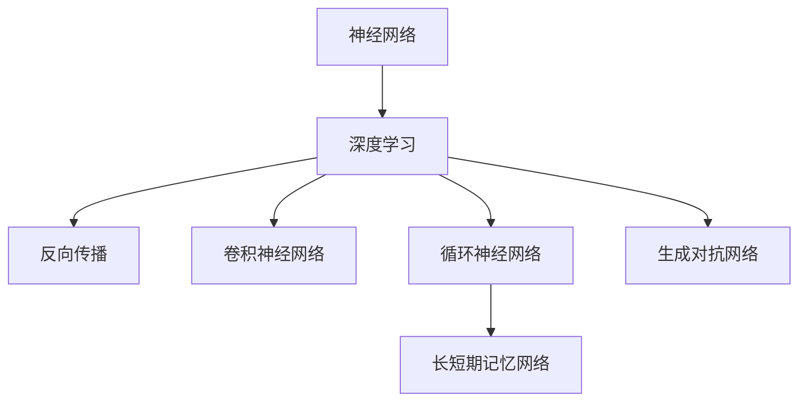

                 

# 神经网络：人类智慧的解放

> 关键词：神经网络,人工智能,机器学习,深度学习,脑科学,计算力,创新驱动

## 1. 背景介绍

### 1.1 问题由来
在人类文明进化的漫长历史中，智慧的积累和传播始终是一个关键难题。语言、文字的发明，数学、科学的方法论，均极大拓展了人类思考和表达的范围。而当下，数字时代的技术革命正在将这一过程推向新的高潮。

近年来，人工智能(AI)技术尤其是深度学习（Deep Learning）和神经网络（Neural Networks）的迅猛发展，正逐步改变人类的认知方式和生产生活方式。借助机器学习（Machine Learning）和深度学习的强大能力，人类智慧的解放成为了可能。神经网络，作为这一技术进步的核心引擎，正在为人类智慧的全新形式开辟广阔天地。

### 1.2 问题核心关键点
神经网络技术的发展，伴随着对“人类智慧”这一概念的深入理解。这一技术不仅能够模拟和扩展人类智能，还能以全新的方式解读、创造、应用知识，极大地拓展了人类思维的边界。

神经网络的核心思想是通过层次化的神经元连接，模拟人脑的神经信号传递机制，从而实现复杂模式的学习和提取。这种“自下而上”的学习方式，不仅能够处理高维、非线性、大规模的数据，还能通过不断反馈和调整，实现知识的更新和进化。

神经网络技术不仅在图像识别、语音识别、自然语言处理等领域取得了突破性进展，还在医疗、金融、教育、交通等诸多传统行业展现出了巨大的应用潜力。它通过模拟人脑的认知过程，将复杂的逻辑推理、模式识别、决策判断等功能转化为可编程的算法，极大地提高了人类生产力和思维效率。

### 1.3 问题研究意义
研究神经网络技术，对于拓展人类智慧的应用边界，提升各行业的效率和智能化水平，具有重要的意义：

1. **生产效率提升**：通过自动化和智能化的生产流程，神经网络能够在短时间内处理海量数据，大幅提升行业生产效率。
2. **决策辅助**：基于历史数据的深度学习模型，能够辅助决策者进行精准判断，减少人为错误，提高决策质量。
3. **知识创新**：神经网络通过大规模数据的学习，不断发现新的知识模式和规律，为科学研究和技术创新提供新的思路。
4. **社会治理优化**：在公共安全、环境保护、交通管理等领域，神经网络能够辅助进行更精准、高效的治理。
5. **个性化服务**：在教育、娱乐、医疗等领域，神经网络能够提供个性化的服务和推荐，提升用户体验。
6. **伦理挑战**：神经网络的发展也带来了数据隐私、算法偏见、决策透明性等伦理问题，需要在技术应用中加以慎重考虑。

神经网络技术正处于快速发展阶段，其广泛的应用前景和潜在的伦理问题，使得这一领域的研究和实践变得愈发重要。

## 2. 核心概念与联系

### 2.1 核心概念概述

为更好地理解神经网络技术的核心原理和应用，本节将介绍几个关键概念：

- **神经网络（Neural Network, NN）**：基于人工神经元（Artificial Neuron）和连接权重（Connection Weights）构成的网络结构，用于模拟人类神经系统的工作方式。
- **深度学习（Deep Learning, DL）**：通过多层神经网络的堆叠（Stacking），增强模型的复杂度和表达能力，适用于处理非线性、高维度的数据。
- **反向传播（Backpropagation）**：深度学习模型的训练算法，通过链式法则计算梯度，更新模型参数，实现模型优化。
- **卷积神经网络（Convolutional Neural Network, CNN）**：一种特殊的神经网络结构，适用于图像处理、信号分析等领域，通过卷积和池化操作提取局部特征。
- **循环神经网络（Recurrent Neural Network, RNN）**：适用于序列数据处理，能够捕捉时间序列上的动态变化和依赖关系。
- **长短期记忆网络（Long Short-Term Memory, LSTM）**：一种RNN的变种，通过门控机制解决传统RNN的梯度消失问题，适用于时间序列预测。
- **生成对抗网络（Generative Adversarial Network, GAN）**：由生成器和判别器构成的对抗式训练框架，能够生成高质量的合成数据。

这些核心概念之间的逻辑关系可以通过以下Mermaid流程图来展示：



这个流程图展示了几类关键神经网络技术之间的关联：

1. 神经网络是深度学习的基础，通过多层网络结构实现复杂模式的学习。
2. 深度学习通过反向传播算法优化模型参数，提升学习效率和效果。
3. 卷积神经网络、循环神经网络等特定架构，适用于不同类型的数据处理任务。
4. LSTM作为RNN的改进，解决了传统RNN的梯度消失问题，增强了时间序列数据的处理能力。
5. GAN通过对抗训练，生成高质量的合成数据，为数据增强和图像生成提供了新的思路。

## 3. 核心算法原理 & 具体操作步骤
### 3.1 算法原理概述

神经网络技术的核心在于其强大的表示学习和模式识别能力。神经网络通过多层次的神经元连接，从输入数据中自动提取特征，并通过不断调整连接权重和激活函数，实现对复杂模式的理解和学习。

以典型的全连接神经网络为例，假设输入层有 $n$ 个神经元，输出层有 $m$ 个神经元，隐藏层有 $h$ 个神经元。网络结构如图：

```mermaid
graph TB
    A[输入层] -- B[隐藏层] -- C[输出层]
    B(隐藏层) -- D[权重] -- E[激活函数]
```

其中，权重 $w$ 和偏置 $b$ 用于调整信号的传递路径，激活函数 $f$ 用于增强非线性表达能力。通过链式法则，神经网络可以自动学习输入与输出之间的映射关系。

### 3.2 算法步骤详解

神经网络模型的训练过程主要包括以下几个关键步骤：

**Step 1: 数据准备**
- 收集数据集 $D=\{(x_i,y_i)\}_{i=1}^N$，其中 $x_i$ 为输入样本，$y_i$ 为对应的标签。
- 数据预处理，包括归一化、标准化、数据增强等操作，以提高模型泛化能力。

**Step 2: 模型初始化**
- 随机初始化神经网络各层参数 $w$ 和 $b$。
- 设置学习率 $\eta$ 和其他超参数。

**Step 3: 前向传播**
- 将输入样本 $x$ 逐层传递，计算每个神经元的输出 $h_l$，最终得到输出 $y'$。
- 使用损失函数 $L(y',y)$ 计算预测结果与真实标签之间的误差。

**Step 4: 反向传播**
- 使用链式法则计算梯度 $\nabla_w L$ 和 $\nabla_b L$。
- 通过优化算法（如梯度下降）更新模型参数，最小化损失函数 $L$。

**Step 5: 模型评估与调整**
- 在验证集上评估模型性能，使用准确率、F1-score等指标衡量模型效果。
- 根据评估结果调整模型结构、超参数和学习率，以获得更好的性能。

**Step 6: 模型应用**
- 在测试集上评估模型效果，确保模型泛化能力。
- 将模型应用到实际问题中，进行推理和预测。

### 3.3 算法优缺点

神经网络技术的优点包括：
1. **高表达能力**：通过多层次的连接和激活函数，神经网络可以捕捉复杂的非线性模式，适用于高维、非结构化数据的处理。
2. **自适应学习**：通过反向传播算法和梯度更新，神经网络能够自动调整参数，适应新的数据分布。
3. **鲁棒性强**：通过深度学习模型的复杂结构，神经网络具有较强的泛化能力和鲁棒性，能够抵抗噪声和干扰。

然而，神经网络技术也存在一些缺点：
1. **模型复杂度高**：神经网络模型的参数量巨大，训练和推理需要大量计算资源。
2. **过拟合风险**：模型容易过度拟合训练数据，泛化能力有限。
3. **数据依赖性强**：神经网络模型的效果高度依赖于数据的质量和分布，获取高质量标注数据成本高。
4. **可解释性差**：神经网络的决策过程通常是“黑盒”模型，难以解释其内部机制和逻辑。

尽管如此，神经网络技术在处理复杂问题方面表现优异，尤其在图像识别、语音识别、自然语言处理等领域已经取得了突破性进展，成为当前人工智能领域的重要方向。

### 3.4 算法应用领域

神经网络技术在诸多领域展现了广阔的应用前景：

- **计算机视觉**：用于图像分类、物体检测、人脸识别、图像生成等。神经网络通过卷积和池化操作，从图像中提取局部特征，实现复杂的模式识别。
- **语音识别**：用于语音转文本、语音合成、说话人识别等。神经网络通过递归神经网络和卷积神经网络，能够处理时间序列数据，实现语音信号的分析和处理。
- **自然语言处理**：用于机器翻译、情感分析、文本生成等。神经网络通过循环神经网络和注意力机制，能够处理序列数据，实现文本信息的理解和生成。
- **推荐系统**：用于商品推荐、内容推荐、广告推荐等。神经网络通过协同过滤和深度学习模型，能够学习用户行为模式，实现精准推荐。
- **医疗诊断**：用于疾病预测、影像诊断、基因分析等。神经网络通过分析医学影像和生物信息，能够辅助医生进行精准诊断和治疗。
- **金融预测**：用于股票预测、信用评估、风险管理等。神经网络通过时间序列数据的学习，能够进行金融市场的分析和预测。

此外，神经网络技术还在自动驾驶、智能制造、智能家居等领域展现出巨大的应用潜力，成为推动未来科技发展的重要力量。

## 4. 数学模型和公式 & 详细讲解  
### 4.1 数学模型构建

本节将使用数学语言对神经网络技术的核心原理进行严格刻画。

假设神经网络模型为 $f: \mathcal{X} \rightarrow \mathcal{Y}$，其中 $\mathcal{X}$ 为输入空间，$\mathcal{Y}$ 为输出空间，$w$ 为权重，$b$ 为偏置，$\sigma$ 为激活函数。模型的前向传播过程可表示为：

$$
y = f(x;w,b) = \sigma(\sum_{i=1}^n w_i x_i + b)
$$

其中，$\sigma$ 为激活函数，$x$ 为输入样本，$w$ 和 $b$ 为神经元连接权重和偏置。假设模型输出为 $y'$，则损失函数 $L(y',y)$ 可以表示为：

$$
L(y',y) = \frac{1}{N}\sum_{i=1}^N ||y_i - y_i'||^2
$$

通过反向传播算法计算梯度，更新模型参数：

$$
\frac{\partial L}{\partial w_i} = \frac{1}{N} \sum_{j=1}^n \delta_j x_i
$$

其中，$\delta_j = \frac{\partial L}{\partial y_j} \sigma'(\sum_{k=1}^m w_{jk} y_k + b_k)$。

### 4.2 公式推导过程

以二分类问题为例，假设模型输出为概率 $p$，则损失函数可以表示为交叉熵损失函数：

$$
L(p,y) = -\frac{1}{N} \sum_{i=1}^N y_i \log p_i + (1-y_i) \log (1-p_i)
$$

根据链式法则，计算梯度：

$$
\frac{\partial L}{\partial w_i} = \frac{1}{N} \sum_{j=1}^n \frac{p_j - y_j}{p_j(1-p_j)} x_i
$$

其中，$p_j = \sigma(\sum_{k=1}^m w_{jk} y_k + b_k)$。

通过反向传播算法，不断更新权重 $w$ 和偏置 $b$，直至损失函数 $L$ 最小化，得到最优模型参数 $\hat{w}$ 和 $\hat{b}$。

### 4.3 案例分析与讲解

以图像分类为例，假设输入为一张彩色图片，输出为图片所属类别。使用卷积神经网络（CNN）进行图像分类。

**Step 1: 数据准备**
- 收集并标注训练集和测试集。
- 对图像进行归一化、裁剪、旋转等预处理操作。

**Step 2: 模型初始化**
- 使用随机初始化权重 $w$ 和偏置 $b$。
- 设置学习率 $\eta$ 和优化算法。

**Step 3: 前向传播**
- 使用卷积层和池化层提取图像特征。
- 使用全连接层进行分类，得到概率 $p$。

**Step 4: 反向传播**
- 计算损失函数 $L$。
- 计算梯度 $\nabla_w L$ 和 $\nabla_b L$。
- 使用优化算法（如Adam）更新权重和偏置。

**Step 5: 模型评估与调整**
- 在验证集上评估模型性能。
- 根据评估结果调整模型结构和超参数。

**Step 6: 模型应用**
- 在测试集上评估模型性能。
- 将模型应用到实际图像分类任务中，进行推理预测。

通过CNN模型，神经网络能够自动提取图像的局部特征，并利用全连接层进行分类。在实际应用中，神经网络技术不断演进，出现了更高效的卷积和池化操作、更复杂的神经网络架构、更先进的优化算法，使得图像分类任务的效果显著提升。

## 5. 项目实践：代码实例和详细解释说明
### 5.1 开发环境搭建

在进行神经网络模型的实践时，需要准备好开发环境。以下是使用Python进行PyTorch开发的环境配置流程：

1. 安装Anaconda：从官网下载并安装Anaconda，用于创建独立的Python环境。

2. 创建并激活虚拟环境：
```bash
conda create -n pytorch-env python=3.8 
conda activate pytorch-env
```

3. 安装PyTorch：根据CUDA版本，从官网获取对应的安装命令。例如：
```bash
conda install pytorch torchvision torchaudio cudatoolkit=11.1 -c pytorch -c conda-forge
```

4. 安装TensorFlow：
```bash
conda install tensorflow
```

5. 安装各类工具包：
```bash
pip install numpy pandas scikit-learn matplotlib tqdm jupyter notebook ipython
```

完成上述步骤后，即可在`pytorch-env`环境中开始神经网络模型的开发实践。

### 5.2 源代码详细实现

这里我们以图像分类为例，给出使用PyTorch进行卷积神经网络训练的PyTorch代码实现。

首先，定义卷积神经网络模型：

```python
import torch.nn as nn
import torch.nn.functional as F

class CNNModel(nn.Module):
    def __init__(self):
        super(CNNModel, self).__init__()
        self.conv1 = nn.Conv2d(3, 32, kernel_size=3, stride=1, padding=1)
        self.pool1 = nn.MaxPool2d(kernel_size=2, stride=2)
        self.conv2 = nn.Conv2d(32, 64, kernel_size=3, stride=1, padding=1)
        self.pool2 = nn.MaxPool2d(kernel_size=2, stride=2)
        self.fc1 = nn.Linear(64 * 8 * 8, 512)
        self.fc2 = nn.Linear(512, 10)
    
    def forward(self, x):
        x = F.relu(self.conv1(x))
        x = self.pool1(x)
        x = F.relu(self.conv2(x))
        x = self.pool2(x)
        x = x.view(-1, 64 * 8 * 8)
        x = F.relu(self.fc1(x))
        x = self.fc2(x)
        return x
```

然后，定义训练函数：

```python
from torch.utils.data import DataLoader
from torchvision import datasets, transforms
from tqdm import tqdm
import torch.optim as optim

batch_size = 64
learning_rate = 0.001
momentum = 0.9
device = torch.device('cuda' if torch.cuda.is_available() else 'cpu')

def train_cnn(model, train_loader, optimizer, epoch):
    model.train()
    for i, (features, labels) in tqdm(enumerate(train_loader), desc='Epoch {}:'.format(epoch+1)):
        features, labels = features.to(device), labels.to(device)
        optimizer.zero_grad()
        outputs = model(features)
        loss = F.cross_entropy(outputs, labels)
        loss.backward()
        optimizer.step()
```

接着，定义测试函数：

```python
def evaluate_cnn(model, test_loader):
    model.eval()
    correct = 0
    total = 0
    with torch.no_grad():
        for features, labels in test_loader:
            features, labels = features.to(device), labels.to(device)
            outputs = model(features)
            _, predicted = torch.max(outputs.data, 1)
            total += labels.size(0)
            correct += (predicted == labels).sum().item()
    print('Accuracy: {:.2f}%'.format(100 * correct / total))
```

最后，启动训练流程并在测试集上评估：

```python
train_dataset = datasets.CIFAR10(root='./data', train=True, download=True, transform=transforms.ToTensor())
train_loader = DataLoader(train_dataset, batch_size=batch_size, shuffle=True)

test_dataset = datasets.CIFAR10(root='./data', train=False, download=True, transform=transforms.ToTensor())
test_loader = DataLoader(test_dataset, batch_size=batch_size, shuffle=False)

model = CNNModel().to(device)
optimizer = optim.Adam(model.parameters(), lr=learning_rate, betas=(momentum, 0.999))
train_cnn(model, train_loader, optimizer, epochs=10)

evaluate_cnn(model, test_loader)
```

以上就是使用PyTorch对卷积神经网络进行图像分类任务训练的完整代码实现。可以看到，借助PyTorch强大的工具包，神经网络的模型定义、训练、评估变得相对简洁高效。

### 5.3 代码解读与分析

让我们再详细解读一下关键代码的实现细节：

**CNNModel类**：
- `__init__`方法：初始化卷积层、池化层、全连接层等关键组件。
- `forward`方法：定义模型的前向传播过程，逐层计算输出。

**train_cnn函数**：
- 定义训练过程，包括模型前向传播、计算损失、反向传播和参数更新。

**evaluate_cnn函数**：
- 定义评估过程，计算准确率等指标。

**训练流程**：
- 定义训练集和测试集数据集。
- 定义训练和评估函数。
- 定义神经网络模型和优化器。
- 开始循环训练，并记录训练过程中的各项指标。
- 训练完成后，在测试集上评估模型效果。

可以看到，PyTorch配合TensorFlow等深度学习框架，使得神经网络的模型开发、训练、评估变得简洁高效。开发者可以将更多精力放在模型结构设计、数据处理、超参数优化等核心环节上，而不必过多关注底层实现细节。

当然，工业级的系统实现还需考虑更多因素，如模型的保存和部署、超参数的自动搜索、更灵活的网络架构等。但核心的训练和评估流程基本与此类似。

## 6. 实际应用场景
### 6.1 智能医疗诊断

神经网络技术在医疗领域的应用，极大提升了疾病诊断的精准度和效率。通过分析医学影像、基因数据、临床记录等多模态数据，神经网络能够辅助医生进行精准诊断和治疗。

以肺部CT图像的自动检测为例，通过训练一个基于卷积神经网络的图像分类模型，可以对CT图像中的肿瘤、结节等病灶进行自动识别和分类。这不仅减少了医生的工作量，提高了诊断效率，还降低了人为误诊的风险。

### 6.2 自动驾驶系统

自动驾驶技术是神经网络技术的重要应用领域之一。通过分析摄像头、雷达、GPS等多源数据，神经网络能够实现对交通环境的感知、理解和决策。

以自动驾驶中的目标检测为例，通过训练一个基于卷积神经网络的物体检测模型，能够实时识别路面上行人、车辆、障碍物等目标，并输出位置、速度等关键信息，为车辆决策提供依据。这不仅提高了自动驾驶的安全性和稳定性，还促进了自动驾驶技术的商业化应用。

### 6.3 工业智能制造

神经网络技术在工业智能制造中的应用，主要体现在生产流程优化和设备故障预测等方面。通过分析生产数据和设备状态数据，神经网络能够实现对生产线的实时监控和优化。

以生产过程中的质量检测为例，通过训练一个基于卷积神经网络的图像识别模型，能够对产品表面进行自动化检测，识别出缺陷和瑕疵，并给出检测结果。这不仅提高了生产效率，还降低了人工检测的成本和误差。

### 6.4 未来应用展望

神经网络技术的应用前景广阔，未来将在更多领域展现其潜力。

- **教育**：通过分析学生的学习行为数据，神经网络能够辅助教育系统进行个性化教学和智能评估。
- **金融**：通过分析市场数据和用户行为，神经网络能够进行股票预测、风险评估和客户分类。
- **智慧城市**：通过分析城市运行数据，神经网络能够实现交通管理、环境监测、应急响应等智能应用。
- **能源管理**：通过分析能源使用数据，神经网络能够实现能源消耗预测、智能调度和优化。
- **环境保护**：通过分析环境数据，神经网络能够实现污染预测、生态监测、灾害预警等应用。

随着神经网络技术的不断进步，其应用领域将更加广泛，为人类社会带来更高效、更智能、更安全的新生活方式。

## 7. 工具和资源推荐
### 7.1 学习资源推荐

为了帮助开发者系统掌握神经网络技术，这里推荐一些优质的学习资源：

1. 《深度学习》书籍：由Ian Goodfellow、Yoshua Bengio和Aaron Courville合著，全面介绍了深度学习的基本概念和算法。
2. 《神经网络与深度学习》书籍：由Michael Nielsen撰写，介绍了神经网络的原理和实现。
3. Coursera《深度学习》课程：由Andrew Ng主讲的深度学习课程，系统讲解了深度学习的基本概念和应用。
4. DeepLearning.AI《深度学习》课程：由Andrew Ng主讲的深度学习课程，内容涵盖深度学习的基本概念、算法和应用。
5. Kaggle深度学习竞赛：通过参加深度学习竞赛，能够实战练习，积累经验。
6. Arxiv论文库：深度学习领域的最新研究成果，提供丰富的学习资源和前沿动态。

通过对这些资源的学习实践，相信你一定能够快速掌握神经网络技术的精髓，并用于解决实际的AI问题。

### 7.2 开发工具推荐

高效的开发离不开优秀的工具支持。以下是几款用于神经网络技术开发的常用工具：

1. PyTorch：基于Python的开源深度学习框架，灵活动态的计算图，适合快速迭代研究。大部分深度学习模型都有PyTorch版本的实现。
2. TensorFlow：由Google主导开发的开源深度学习框架，生产部署方便，适合大规模工程应用。同样有丰富的深度学习模型资源。
3. Keras：高级深度学习框架，提供了简单易用的API，适合快速原型开发和实验。
4. Caffe：由Berkeley Vision and Learning Center开发的深度学习框架，适用于图像识别、视频分析等领域。
5. Theano：由蒙特利尔大学开发的深度学习框架，支持GPU加速，适合研究和学术应用。
6. MXNet：由Apache开发的深度学习框架，支持分布式训练和多种编程语言。
7. PyTorch Lightning：基于PyTorch的快速模型训练框架，提供了丰富的训练、评估、调参等功能。

合理利用这些工具，可以显著提升神经网络技术的开发效率，加快创新迭代的步伐。

### 7.3 相关论文推荐

神经网络技术的发展源于学界的持续研究。以下是几篇奠基性的相关论文，推荐阅读：

1. Rectified Linear Units Improve Restricted Boltzmann Machines：提出了ReLU激活函数，极大提高了神经网络模型的表达能力和训练速度。
2. ImageNet Classification with Deep Convolutional Neural Networks：通过在大规模数据集ImageNet上进行训练，展示了卷积神经网络的强大分类能力。
3. Efficient Backprop：提出了反向传播算法，使得神经网络模型能够高效训练和优化。
4. Batch Normalization：通过批量归一化技术，加速了神经网络模型的训练过程，提高了模型的稳定性和泛化能力。
5. Convolutional Neural Networks for Human Activity Recognition：展示了卷积神经网络在人类活动识别中的应用，取得了显著效果。
6. Attention is All You Need：提出了Transformer结构，极大提升了自然语言处理任务的效果。
7. Generative Adversarial Nets：提出了生成对抗网络（GAN），为数据增强和生成任务提供了新的思路。

这些论文代表了大神经网络技术的演进脉络。通过学习这些前沿成果，可以帮助研究者把握学科前进方向，激发更多的创新灵感。

## 8. 总结：未来发展趋势与挑战
### 8.1 总结

本文对神经网络技术进行了全面系统的介绍。首先阐述了神经网络技术的背景和发展历程，明确了其在人工智能领域的重要地位。其次，从原理到实践，详细讲解了神经网络的核心算法和操作步骤，给出了神经网络模型的完整代码实例。同时，本文还广泛探讨了神经网络技术在智能医疗、自动驾驶、工业智能制造等多个领域的应用前景，展示了其广阔的应用潜力。此外，本文精选了神经网络技术的各类学习资源，力求为读者提供全方位的技术指引。

通过本文的系统梳理，可以看到，神经网络技术正在成为人工智能技术的重要支柱，极大地拓展了人类的认知边界。其高表达能力、自适应学习和鲁棒性，使其在处理复杂问题方面表现优异。未来，随着神经网络技术的不断演进和应用实践的深入，其影响力将进一步扩大，成为推动人类社会进步的重要力量。

### 8.2 未来发展趋势

展望未来，神经网络技术将呈现以下几个发展趋势：

1. **模型规模扩大**：神经网络模型的参数量将进一步增长，模型结构将更加复杂和深层次。超大规模的神经网络模型将具备更强的表达能力和泛化能力。
2. **算法优化和创新**：新的算法和技术不断涌现，如对抗训练、强化学习、生成对抗网络等，将进一步提升神经网络模型的性能和应用效果。
3. **跨领域融合**：神经网络技术与脑科学、认知科学等领域的深度融合，将带来新的研究思路和方法。
4. **多模态数据处理**：神经网络技术能够处理图像、语音、文本等多种模态数据，未来将广泛应用于多模态信息融合和处理。
5. **个性化和智能化**：神经网络技术将更深入地应用于个性化推荐、智能交互等领域，提升用户体验。
6. **实时性和高效性**：通过模型裁剪、量化加速、混合精度训练等技术，神经网络模型的推理速度和资源占用将进一步优化。

这些趋势凸显了神经网络技术的广阔前景。其不断进步将为人工智能技术带来新的突破，推动人类社会的全面进步。

### 8.3 面临的挑战

尽管神经网络技术在诸多领域展现出巨大潜力，但在应用过程中仍面临诸多挑战：

1. **数据依赖性**：神经网络模型的效果高度依赖于数据的质量和分布，获取高质量标注数据成本高。
2. **过拟合风险**：模型容易过度拟合训练数据，泛化能力有限。
3. **可解释性差**：神经网络模型的决策过程通常是“黑盒”模型，难以解释其内部机制和逻辑。
4. **计算资源需求高**：神经网络模型的参数量巨大，训练和推理需要大量计算资源。
5. **伦理和安全问题**：神经网络模型可能学习到有偏见、有害的信息，带来伦理和安全问题。

尽管如此，神经网络技术在处理复杂问题方面表现优异，尤其在图像识别、语音识别、自然语言处理等领域已经取得了突破性进展，成为当前人工智能领域的重要方向。

### 8.4 研究展望

面对神经网络技术所面临的挑战，未来的研究需要在以下几个方面寻求新的突破：

1. **数据高效利用**：通过迁移学习、自监督学习、主动学习等方法，减少对标注数据的依赖。
2. **模型可解释性**：引入可解释性技术，如模型压缩、特征可视化等，增强神经网络模型的可解释性和透明性。
3. **计算资源优化**：通过模型裁剪、量化加速、分布式训练等技术，降低神经网络模型的计算资源需求。
4. **鲁棒性和泛化性**：引入对抗训练、正则化等技术，提高神经网络模型的鲁棒性和泛化能力。
5. **跨领域应用**：通过跨学科研究，将神经网络技术与脑科学、认知科学等领域的知识相结合，拓展应用领域。
6. **伦理和安全保障**：引入伦理和安全性约束，确保神经网络模型在应用中的公平性、透明性和安全性。

这些研究方向的探索，必将引领神经网络技术迈向更高的台阶，为构建安全、可靠、可解释、可控的智能系统铺平道路。面向未来，神经网络技术还需要与其他人工智能技术进行更深入的融合，如知识表示、因果推理、强化学习等，多路径协同发力，共同推动人工智能技术的进步。

## 9. 附录：常见问题与解答

**Q1：神经网络模型为什么需要反向传播算法？**

A: 反向传播算法是神经网络模型训练的核心，用于计算梯度并更新模型参数。神经网络模型通过多层次的连接和激活函数，从输入数据中自动提取特征，并通过不断调整连接权重和激活函数，实现对复杂模式的理解和学习。反向传播算法通过链式法则，自动计算梯度，更新模型参数，使得模型能够自适应地学习数据分布，提高模型效果。

**Q2：如何避免神经网络模型的过拟合？**

A: 避免过拟合是神经网络模型训练的关键。常见的方法包括：
1. 数据增强：通过旋转、翻转、裁剪等操作扩充训练集，提高模型泛化能力。
2. 正则化：使用L1/L2正则化、Dropout等方法，减少模型复杂度，防止过拟合。
3. 早停策略：在验证集上监测模型性能，一旦性能不再提升，立即停止训练，避免过拟合。
4. 模型简化：通过网络剪枝、参数共享等方法，减小模型规模，降低过拟合风险。

**Q3：神经网络模型的训练速度如何提升？**

A: 提升神经网络模型的训练速度，可以通过以下方法：
1. 硬件优化：使用GPU、TPU等高性能硬件设备，提高计算速度。
2. 数据并行：通过多卡并行、分布式训练等方法，提高数据处理速度。
3. 模型优化：通过网络简化、量化加速、混合精度训练等技术，减小模型规模和计算需求。
4. 算法改进：使用更快的优化算法，如AdamW、Adafactor等，提高训练速度。

**Q4：神经网络模型如何进行迁移学习？**

A: 迁移学习是指将在一个领域学到的知识迁移到另一个领域。对于神经网络模型，迁移学习主要通过预训练和微调两个步骤实现：
1. 预训练：在大规模数据集上进行无监督学习，学习通用的特征表示。
2. 微调：在新领域数据集上，通过有监督学习优化模型，适应新领域任务。

**Q5：神经网络模型如何进行跨领域应用？**

A: 跨领域应用主要通过以下几个步骤实现：
1. 领域对齐：将不同领域的特征映射到相同的表示空间。
2. 共享表示：在不同领域之间共享低层次特征，提高模型的泛化能力。
3. 任务融合：将不同领域的任务进行融合，训练多任务的联合模型。

通过这些方法，神经网络模型能够更好地适应不同领域的任务，提高其在复杂场景下的应用效果。

---

作者：禅与计算机程序设计艺术 / Zen and the Art of Computer Programming

