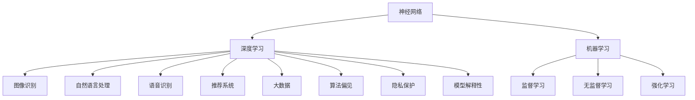

                 

# 神经网络：推动社会进步的力量

> 关键词：神经网络,深度学习,人工智能,社会进步,机器学习,大数据,创新,技术发展

## 1. 背景介绍

### 1.1 问题由来

人工智能（AI）和深度学习（DL）技术的发展，极大地推动了科技与社会的进步。作为深度学习的核心组件之一，神经网络（Neural Network）在图像识别、自然语言处理、语音识别、推荐系统等多个领域展示了强大的应用潜力。神经网络作为实现复杂计算任务和决策的模型，已经被广泛应用于各种行业，包括医疗、金融、制造、教育、交通等，极大地提升了数据处理能力、决策速度和精度，同时也带来了新的商业模式、经济价值和社会变革。

### 1.2 问题核心关键点

神经网络的核心在于其能够模拟人脑的计算方式，通过多层神经元的交互，从数据中学习复杂的特征和模式，并在此基础上做出预测或决策。神经网络的研究与实践，为社会进步提供了新的动力。然而，随之而来的问题也逐渐凸显，例如算法偏见、隐私保护、模型解释性不足等。

### 1.3 问题研究意义

了解神经网络的发展历程、原理与技术，有助于我们更好地认识其对社会进步的推动作用。此外，研究和解决其面临的挑战，是推动神经网络技术健康发展、促进AI应用广泛且负责任的关键。

## 2. 核心概念与联系

### 2.1 核心概念概述

1. **神经网络**：由一系列人工神经元组成的网络，通过模拟人脑的计算过程，从数据中学习特征，并进行模式识别或决策。常见的神经网络包括多层感知机（MLP）、卷积神经网络（CNN）、循环神经网络（RNN）、生成对抗网络（GAN）等。
2. **深度学习**：基于神经网络，通过多个层次的特征提取和抽象，实现对复杂数据的处理与分析。深度学习广泛应用于图像识别、语音识别、自然语言处理、推荐系统等领域。
3. **机器学习**：指让计算机通过数据学习并改进算法，以提高其在特定任务上的性能。机器学习是实现人工智能的重要手段，包括监督学习、无监督学习和强化学习等多种方法。
4. **大数据**：指规模巨大、类型多样、实时动态的数据集合，是机器学习与深度学习的重要数据基础。
5. **算法偏见**：指在模型训练中，由于训练数据的不公平或特征选择不当，导致模型对某些特定群体或特征的偏见。
6. **隐私保护**：在数据处理与模型训练中，保护用户隐私，确保数据安全。
7. **模型解释性**：指模型能够提供明确的决策依据和推理过程，便于理解和解释。

这些概念通过以下Mermaid流程图展现其联系：



## 3. 核心算法原理 & 具体操作步骤

### 3.1 算法原理概述

神经网络的计算过程可以分为前向传播和反向传播两个阶段。在前向传播中，输入数据经过每一层神经元，生成输出结果。在反向传播中，根据输出结果与真实标签的误差，通过链式法则计算每一层神经元的梯度，从而更新模型参数。

神经网络的核心原理是通过大量的训练数据，调整模型参数，使得模型能够准确地预测未知数据。在训练过程中，神经网络不断调整权重，优化损失函数，以达到最佳性能。神经网络的架构和参数初始化、激活函数选择、损失函数设计等都会影响其性能和泛化能力。

### 3.2 算法步骤详解

#### 3.2.1 数据准备
神经网络的应用首先需要进行数据准备，包括数据清洗、标注、划分训练集、验证集和测试集等步骤。数据集应尽可能多样化和代表性，以避免模型对特定数据集的过拟合。

#### 3.2.2 模型搭建
选择合适的神经网络架构和激活函数。例如，卷积神经网络（CNN）适用于图像处理，循环神经网络（RNN）适用于序列数据，生成对抗网络（GAN）适用于生成新数据等。

#### 3.2.3 模型训练
利用训练集数据，通过前向传播和反向传播不断调整模型参数，最小化损失函数。常用的优化算法包括梯度下降（GD）、随机梯度下降（SGD）、Adam等。

#### 3.2.4 模型评估
使用验证集和测试集评估模型性能。常用的评估指标包括准确率、召回率、F1分数等。

#### 3.2.5 模型优化
根据评估结果，调整模型参数，如学习率、批量大小、正则化等，以提高模型性能。

### 3.3 算法优缺点

神经网络具有以下优点：
1. 能够处理复杂、高维数据。
2. 通过多层抽象，发现数据中的高级特征。
3. 在特定任务上具有较高的准确性和泛化能力。

同时，神经网络也存在以下缺点：
1. 需要大量标注数据，数据获取成本高。
2. 模型复杂度高，训练和推理速度较慢。
3. 容易过拟合，需要有效的正则化技术。
4. 解释性不足，难以解释决策依据。
5. 存在算法偏见，需要警惕。

### 3.4 算法应用领域

神经网络的应用领域非常广泛，包括但不限于：
1. **计算机视觉**：如图像分类、物体检测、图像生成等。
2. **自然语言处理**：如文本分类、机器翻译、情感分析、聊天机器人等。
3. **语音识别**：如语音转文本、语音合成等。
4. **推荐系统**：如电商推荐、新闻推荐等。
5. **医疗诊断**：如疾病预测、影像诊断等。
6. **金融风控**：如信用评估、风险预测等。
7. **交通管理**：如交通预测、智能驾驶等。

## 4. 数学模型和公式 & 详细讲解 & 举例说明

### 4.1 数学模型构建

神经网络的数学模型主要由以下几个部分组成：
1. 输入层：表示原始数据。
2. 隐藏层：进行特征提取和抽象。
3. 输出层：生成模型预测结果。

以多层感知机（MLP）为例，其数学模型如下：

$$
y = W_h \sigma(z_h) + b_h \\
z_h = W_x \sigma(x) + b_x
$$

其中，$x$ 表示输入数据，$y$ 表示输出结果，$z_h$ 表示隐藏层中间变量，$\sigma$ 表示激活函数（如ReLU、Sigmoid等），$W_h$、$W_x$ 和 $b_h$ 表示权重和偏置。

### 4.2 公式推导过程

神经网络的反向传播算法基于链式法则，计算每一层神经元的梯度。以MLP为例，其反向传播算法推导如下：

1. 前向传播：
$$
y = W_h \sigma(z_h) + b_h \\
z_h = W_x \sigma(x) + b_x
$$

2. 计算输出层的损失函数：
$$
L = \frac{1}{2}(y - \hat{y})^2
$$

3. 计算输出层的梯度：
$$
\frac{\partial L}{\partial y} = \frac{\partial L}{\partial z_h} \frac{\partial z_h}{\partial y} = \frac{\partial L}{\partial z_h} \sigma'(z_h)
$$

4. 计算隐藏层的梯度：
$$
\frac{\partial L}{\partial z_h} = \frac{\partial L}{\partial y} \frac{\partial y}{\partial z_h} = \frac{\partial L}{\partial y} W_h \sigma'(z_h)
$$

5. 计算输入层的梯度：
$$
\frac{\partial L}{\partial x} = \frac{\partial L}{\partial z_h} \frac{\partial z_h}{\partial x} = \frac{\partial L}{\partial z_h} W_x \sigma'(x)
$$

通过上述推导，可以看出反向传播算法的核心是链式法则的应用。

### 4.3 案例分析与讲解

以图像分类任务为例，使用CNN模型进行训练和评估：
1. 数据准备：收集大量标注好的图像数据，将其分为训练集、验证集和测试集。
2. 模型搭建：选择适当的卷积层、池化层和全连接层，设计CNN架构。
3. 模型训练：使用训练集数据进行前向传播和反向传播，不断调整模型参数。
4. 模型评估：使用验证集评估模型性能，根据评估结果调整模型参数。
5. 模型优化：根据测试集评估结果，进一步优化模型参数和架构。

## 5. 项目实践：代码实例和详细解释说明

### 5.1 开发环境搭建

1. 安装Python和相关库：
```
pip install tensorflow numpy matplotlib pandas scikit-learn
```

2. 安装TensorFlow：
```
pip install tensorflow
```

3. 安装相关依赖：
```
pip install scikit-learn torch scipy
```

### 5.2 源代码详细实现

```python
import tensorflow as tf
from tensorflow.keras import layers, models

# 定义CNN模型
model = models.Sequential([
    layers.Conv2D(32, (3,3), activation='relu', input_shape=(28,28,1)),
    layers.MaxPooling2D((2,2)),
    layers.Conv2D(64, (3,3), activation='relu'),
    layers.MaxPooling2D((2,2)),
    layers.Conv2D(64, (3,3), activation='relu'),
    layers.Flatten(),
    layers.Dense(64, activation='relu'),
    layers.Dense(10, activation='softmax')
])

# 编译模型
model.compile(optimizer='adam',
              loss='categorical_crossentropy',
              metrics=['accuracy'])

# 加载数据集
(x_train, y_train), (x_test, y_test) = tf.keras.datasets.mnist.load_data()

# 数据预处理
x_train = x_train.reshape((60000, 28, 28, 1)) / 255.0
x_test = x_test.reshape((10000, 28, 28, 1)) / 255.0

# 训练模型
model.fit(x_train, y_train, epochs=5, batch_size=32, validation_data=(x_test, y_test))
```

### 5.3 代码解读与分析

1. 搭建CNN模型：使用卷积层和全连接层，构建一个简单的CNN模型。
2. 编译模型：选择Adam优化器，交叉熵损失函数，准确率评估指标。
3. 加载数据集：使用TensorFlow内置的MNIST数据集。
4. 数据预处理：将图像数据归一化，并调整数据形状。
5. 训练模型：使用训练集数据进行模型训练，验证集评估模型性能。

## 6. 实际应用场景

### 6.1 计算机视觉

神经网络在计算机视觉领域展示了强大的应用潜力。例如，CNN模型在图像分类、物体检测、图像生成等方面取得了显著成效。医疗影像分析、自动驾驶、安防监控等领域也广泛应用了神经网络技术，提升了数据处理速度和准确性。

### 6.2 自然语言处理

自然语言处理（NLP）是神经网络应用的另一重要领域。神经网络能够处理复杂的文本数据，实现文本分类、机器翻译、情感分析等任务。聊天机器人、智能客服、智能写作等应用也展示了神经网络在NLP领域的应用前景。

### 6.3 金融风控

在金融风控领域，神经网络能够通过分析历史数据，预测用户信用风险。风险评估、欺诈检测、贷款审批等应用，通过神经网络模型实现了精准和高效的决策。

### 6.4 医疗诊断

在医疗诊断领域，神经网络能够通过分析医学影像和病历数据，辅助医生进行疾病预测和影像诊断。早期癌症筛查、智能辅助诊断、疾病预测等应用，通过神经网络技术提升了医疗服务的精准性和效率。

### 6.5 推荐系统

推荐系统是神经网络应用的典型场景之一。电商推荐、新闻推荐、音乐推荐等应用，通过神经网络模型实现了个性化的推荐服务，提升了用户体验和业务转化率。

### 6.6 自动驾驶

自动驾驶是神经网络应用的重要领域。通过深度学习技术，车辆能够实现自动驾驶、车道保持、障碍物检测等功能。神经网络技术为自动驾驶的发展提供了重要的技术支持。

### 6.7 社交网络

社交网络分析是神经网络应用的另一重要领域。通过分析社交网络数据，神经网络能够识别用户关系、情感分析、社区发现等。社交网络分析技术为社会研究、舆情分析、市场营销等领域提供了新的视角和方法。

## 7. 工具和资源推荐

### 7.1 学习资源推荐

1. **《深度学习》课程**：由Coursera开设的深度学习课程，系统讲解深度学习的基本概念和算法，适合初学者学习。
2. **《神经网络与深度学习》书籍**：Ian Goodfellow等所著的神经网络与深度学习经典教材，详细介绍了深度学习的基本原理和应用。
3. **TensorFlow官方文档**：TensorFlow官方文档提供了丰富的代码示例和教程，适合快速上手深度学习应用开发。
4. **Keras官方文档**：Keras官方文档提供了简洁易用的API，适合快速搭建深度学习模型。
5. **PyTorch官方文档**：PyTorch官方文档提供了强大的计算图和动态图功能，适合深入研究和实验深度学习算法。

### 7.2 开发工具推荐

1. **Jupyter Notebook**：Jupyter Notebook提供了丰富的代码编写和数据可视化功能，适合数据科学家进行深度学习研究和实验。
2. **Google Colab**：Google Colab提供了免费的GPU算力，支持Python和R语言，适合快速实验深度学习算法。
3. **TensorBoard**：TensorBoard提供了丰富的可视化工具，能够实时监控模型训练过程，适合调试和优化深度学习模型。
4. **Weights & Biases**：Weights & Biases提供了实验跟踪和分析工具，能够记录和比较模型训练结果，适合研究深度学习算法和优化模型。
5. **TorchVision**：TorchVision提供了丰富的计算机视觉工具和模型，适合快速搭建计算机视觉应用。

### 7.3 相关论文推荐

1. **《ImageNet Classification with Deep Convolutional Neural Networks》**：Alex Krizhevsky等所著的论文，详细介绍了CNN在图像分类任务中的应用。
2. **《Neural Machine Translation by Jointly Learning to Align and Translate》**：Ilya Sutskever等所著的论文，详细介绍了神经网络在机器翻译任务中的应用。
3. **《Attention Is All You Need》**：Ashish Vaswani等所著的论文，详细介绍了Transformer模型在自然语言处理任务中的应用。
4. **《Generative Adversarial Nets》**：Ian Goodfellow等所著的论文，详细介绍了GAN模型在生成新数据中的应用。

## 8. 总结：未来发展趋势与挑战

### 8.1 研究成果总结

神经网络技术在多个领域展示了强大的应用潜力，推动了社会进步和经济发展。未来的研究应关注以下几个方面：
1. 优化算法：开发高效、快速的优化算法，提升模型训练和推理效率。
2. 数据隐私：保护数据隐私，确保数据安全。
3. 模型解释性：提高模型解释性，使其可解释、可解释。
4. 公平性：减少模型偏见，确保公平性。
5. 跨领域应用：推动神经网络技术在更多领域的应用。

### 8.2 未来发展趋势

1. **边缘计算**：随着物联网的普及，边缘计算将成为神经网络应用的重要方向。
2. **联邦学习**：联邦学习能够在保护用户隐私的前提下，实现模型训练和优化。
3. **自监督学习**：自监督学习能够在无标签数据上训练神经网络，提升模型泛化能力。
4. **跨模态学习**：跨模态学习能够在不同模态数据之间进行联合学习，提升模型性能。
5. **无监督学习**：无监督学习能够在无标签数据上进行特征学习，减少标注数据需求。

### 8.3 面临的挑战

神经网络技术在应用过程中面临以下挑战：
1. 数据隐私：保护数据隐私，确保数据安全。
2. 公平性：减少模型偏见，确保公平性。
3. 可解释性：提高模型解释性，使其可解释、可解释。
4. 算力成本：神经网络模型需要大量算力进行训练和推理，成本较高。
5. 数据标注：神经网络模型需要大量标注数据进行训练，数据标注成本较高。

### 8.4 研究展望

未来的研究应在以下几个方面寻求突破：
1. 优化算法：开发高效、快速的优化算法，提升模型训练和推理效率。
2. 数据隐私：保护数据隐私，确保数据安全。
3. 模型解释性：提高模型解释性，使其可解释、可解释。
4. 公平性：减少模型偏见，确保公平性。
5. 跨领域应用：推动神经网络技术在更多领域的应用。

## 9. 附录：常见问题与解答

### Q1：什么是神经网络？

A：神经网络是一种通过多层神经元模拟人脑计算过程的模型。其核心在于通过前向传播和反向传播算法，从数据中学习特征，并进行模式识别或决策。

### Q2：神经网络有哪些应用领域？

A：神经网络在计算机视觉、自然语言处理、语音识别、推荐系统、医疗诊断、金融风控等领域展示了强大的应用潜力，推动了多个行业的创新和发展。

### Q3：神经网络面临哪些挑战？

A：神经网络面临数据隐私、公平性、可解释性等挑战，需要进一步优化算法和改进模型设计。

### Q4：如何使用神经网络进行图像分类？

A：使用CNN模型进行图像分类，首先将图像数据转换为模型输入，然后通过前向传播和反向传播不断调整模型参数，最小化损失函数，最终得到分类结果。

### Q5：如何保护数据隐私？

A：使用联邦学习、差分隐私等技术，保护数据隐私，确保数据安全。

---

作者：禅与计算机程序设计艺术 / Zen and the Art of Computer Programming

