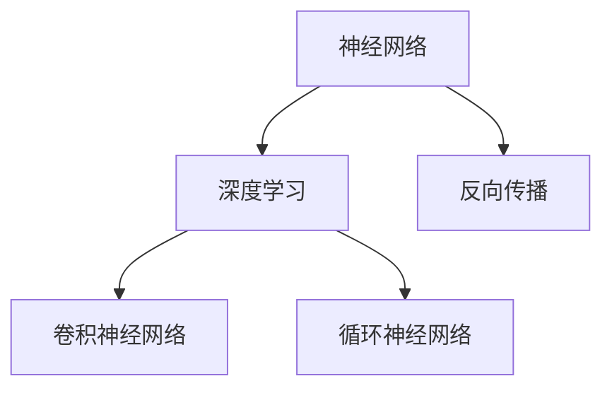

                 

# 神经网络：推动社会进步的力量

> 关键词：神经网络,深度学习,人工智能,社会进步,计算力,自动化,医疗,教育,交通

## 1. 背景介绍

### 1.1 问题由来
人工智能(AI)技术正以前所未有的速度改变着我们生活的方方面面。从日常生活的智能助手，到复杂领域的深度学习和机器学习，AI的影响力日益显著。在众多AI技术中，神经网络(神经网络, Neural Network)凭借其强大的计算能力和广泛的应用场景，成为了推动社会进步的重要力量。

神经网络作为一种模拟人脑神经元间连接和信息传递机制的计算模型，在图像识别、语音处理、自然语言处理等领域取得了突破性的进展。本文将深入探讨神经网络的原理、应用和发展，揭示其对社会进步的深远影响。

### 1.2 问题核心关键点
神经网络的核心在于其独特的结构设计和计算方式，通过模拟人脑神经元的工作机制，实现了高度复杂的模式识别和预测能力。其基本单元是人工神经元，通过层层叠加形成网络结构，并通过反向传播算法进行参数优化。

神经网络的发展经历了多个阶段，从最初的感知器、多层感知器到深度学习、卷积神经网络、循环神经网络等，不断突破传统计算框架的限制，逐步实现了在多领域、大规模数据集上的高效计算和应用。

本文将从神经网络的基本原理、核心算法、操作步骤等方面进行详细阐述，并结合实际应用案例，探讨神经网络在未来社会中的进步潜力。

## 2. 核心概念与联系

### 2.1 核心概念概述

为更好地理解神经网络的原理和应用，本节将介绍几个关键概念：

- 神经网络(Neural Network)：一种模仿人脑神经元结构和信息传递机制的计算模型，由大量人工神经元通过连接形成的网络结构。
- 深度学习(Deep Learning)：一种基于神经网络的大规模学习范式，通过多层非线性映射实现复杂模式的识别和预测。
- 反向传播(Backpropagation)：一种参数优化算法，通过计算预测结果与实际标签的误差，反向传播误差，更新神经网络参数。
- 卷积神经网络(CNN)：一种针对图像识别、视频处理等任务设计的神经网络结构，通过卷积操作提取特征。
- 循环神经网络(RNN)：一种针对序列数据处理设计的神经网络结构，通过循环神经元实现序列信息的处理和预测。

这些核心概念之间的逻辑关系可以通过以下Mermaid流程图来展示：



这个流程图展示了大语言模型的核心概念及其之间的关系：

1. 神经网络是深度学习和反向传播的基本架构。
2. 卷积神经网络和循环神经网络是神经网络的两种重要变体，分别针对图像和序列数据。
3. 深度学习利用神经网络的计算能力，实现了复杂模式的识别和预测。

## 3. 核心算法原理 & 具体操作步骤

### 3.1 算法原理概述

神经网络的核心在于其通过多层非线性映射，实现对输入数据的复杂模式识别和预测。其基本组成包括输入层、隐藏层和输出层。其中隐藏层通常通过非线性激活函数进行激活，通过反向传播算法不断优化模型参数，以最小化预测误差。

以一个简单的二分类任务为例，神经网络的输入为 $x \in \mathbb{R}^n$，输出为 $y \in \{0,1\}$。神经网络的目标是通过学习数据集 $\{(x_i, y_i)\}_{i=1}^N$ 上的训练，优化参数 $\theta$，使得预测值 $\hat{y}$ 尽可能接近真实标签 $y$。数学上，神经网络的预测函数为：

$$
\hat{y} = f(\theta^T \cdot x)
$$

其中 $f$ 为激活函数，通常选择 ReLU、Sigmoid、Tanh 等非线性函数。神经网络的损失函数为交叉熵损失函数，定义如下：

$$
\mathcal{L}(\theta) = -\frac{1}{N} \sum_{i=1}^N y_i \log(\hat{y_i}) + (1-y_i) \log(1-\hat{y_i})
$$

在反向传播算法中，首先计算预测值 $\hat{y}$ 与真实标签 $y$ 的误差 $e$，然后反向传播误差 $e$ 通过链式法则，计算每个神经元的误差贡献，并根据误差贡献更新权重 $\theta$。具体的反向传播过程如下：

1. 前向传播：将输入 $x$ 通过神经网络，得到预测值 $\hat{y}$。
2. 计算误差：计算 $\hat{y}$ 与 $y$ 的误差 $e$。
3. 反向传播误差：通过链式法则，反向传播误差 $e$ 到每个神经元，计算其误差贡献 $\delta$。
4. 更新权重：根据误差贡献 $\delta$ 和梯度下降策略，更新权重 $\theta$。

### 3.2 算法步骤详解

神经网络的训练通常分为以下几个步骤：

**Step 1: 准备数据集**
- 收集训练数据集 $D=\{(x_i, y_i)\}_{i=1}^N$，其中 $x_i$ 为输入，$y_i$ 为标签。
- 将数据集划分为训练集、验证集和测试集，以便评估模型的性能。

**Step 2: 定义网络结构**
- 确定神经网络的网络结构，包括输入层、隐藏层和输出层。
- 选择激活函数，如 ReLU、Sigmoid、Tanh 等。
- 确定每层神经元的数量和连接方式。

**Step 3: 设置超参数**
- 设置学习率 $\eta$、批大小 $batch\_size$、迭代轮数 $epoch$ 等超参数。
- 选择合适的优化器，如 SGD、Adam 等。

**Step 4: 前向传播和反向传播**
- 将训练集数据分批次输入模型，前向传播计算预测值 $\hat{y}$。
- 计算预测值与真实标签的误差 $e$，反向传播误差 $e$ 并更新模型参数。

**Step 5: 验证和测试**
- 在验证集上评估模型性能，调整超参数以避免过拟合。
- 在测试集上测试模型性能，记录最终结果。

### 3.3 算法优缺点

神经网络在数据驱动的学习过程中，具有以下优点：

- 强大的数据表示能力：神经网络通过多层非线性映射，能够学习数据的复杂表示，实现高度抽象的特征提取。
- 高泛化能力：神经网络通过反向传播算法不断优化参数，能够适应不同的数据分布，具有良好的泛化能力。
- 广泛应用场景：神经网络已广泛应用于图像识别、语音处理、自然语言处理等领域，成为推动技术进步的重要手段。

然而，神经网络也存在一些局限性：

- 计算资源需求高：神经网络的计算复杂度高，需要大量的计算资源进行训练和推理。
- 过拟合风险：神经网络容易发生过拟合，特别是在数据量较小的情况下。
- 可解释性不足：神经网络的内部结构复杂，难以解释其决策过程，影响模型的可信度和可解释性。
- 训练复杂度高：神经网络的训练过程往往需要大量的迭代次数，训练时间较长。

尽管存在这些局限性，但就目前而言，神经网络仍是实现复杂模式识别和预测的重要工具。未来相关研究的重点在于如何进一步优化神经网络的计算效率，提高模型的可解释性和泛化能力，以及如何在特定领域内优化神经网络的结构。

### 3.4 算法应用领域

神经网络在众多领域中得到了广泛应用，以下是几个主要应用场景：

- 计算机视觉：神经网络在图像分类、目标检测、图像分割等任务中表现优异，推动了自动驾驶、医疗影像分析等领域的发展。
- 自然语言处理：神经网络在文本分类、机器翻译、对话系统等任务中取得了突破性进展，提升了人机交互的自然性。
- 语音处理：神经网络在语音识别、语音合成、情感识别等任务中展现了强大的能力，推动了智能客服、智能家居等领域的发展。
- 医疗领域：神经网络在病理图像分析、疾病预测、药物研发等任务中表现出色，为医疗诊断和治疗提供了新手段。
- 交通领域：神经网络在交通流量预测、事故预警、智能交通管理等任务中，提升了交通系统的智能化水平。

## 4. 数学模型和公式 & 详细讲解 & 举例说明

### 4.1 数学模型构建

神经网络的数学模型可以形式化地表示为：

$$
\hat{y} = f(W_2 \cdot f(W_1 \cdot x + b_1) + b_2)
$$

其中 $W_1$ 和 $W_2$ 为权重矩阵，$b_1$ 和 $b_2$ 为偏置向量，$f$ 为激活函数。

### 4.2 公式推导过程

以一个简单的二分类任务为例，推导神经网络的预测函数和损失函数。

**预测函数：**

$$
\hat{y} = \sigma(W_2 \cdot \sigma(W_1 \cdot x + b_1) + b_2)
$$

其中 $\sigma$ 为 sigmoid 函数，$W_1$ 和 $W_2$ 为权重矩阵，$b_1$ 和 $b_2$ 为偏置向量。

**损失函数：**

$$
\mathcal{L}(\theta) = -\frac{1}{N} \sum_{i=1}^N y_i \log(\hat{y_i}) + (1-y_i) \log(1-\hat{y_i})
$$

其中 $\hat{y_i}$ 为预测值，$y_i$ 为真实标签。

### 4.3 案例分析与讲解

以图像分类任务为例，介绍神经网络的训练过程。

1. **数据准备**：准备图像分类数据集，如 MNIST 手写数字识别数据集。
2. **网络结构**：定义一个包含两个隐藏层和一个输出层的神经网络结构。
3. **设置超参数**：设置学习率 $\eta$、批大小 $batch\_size$、迭代轮数 $epoch$。
4. **前向传播**：将图像输入神经网络，计算预测值 $\hat{y}$。
5. **计算误差**：计算预测值与真实标签的误差 $e$。
6. **反向传播**：反向传播误差 $e$，计算每个神经元的误差贡献 $\delta$。
7. **更新权重**：根据误差贡献 $\delta$ 和梯度下降策略，更新权重 $\theta$。
8. **验证和测试**：在验证集和测试集上评估模型性能，调整超参数以避免过拟合。

## 5. 项目实践：代码实例和详细解释说明

### 5.1 开发环境搭建

在进行神经网络项目实践前，我们需要准备好开发环境。以下是使用Python进行TensorFlow开发的环境配置流程：

1. 安装Anaconda：从官网下载并安装Anaconda，用于创建独立的Python环境。

2. 创建并激活虚拟环境：
```bash
conda create -n tf-env python=3.8 
conda activate tf-env
```

3. 安装TensorFlow：根据CUDA版本，从官网获取对应的安装命令。例如：
```bash
conda install tensorflow -c conda-forge
```

4. 安装各类工具包：
```bash
pip install numpy pandas scikit-learn matplotlib tqdm jupyter notebook ipython
```

完成上述步骤后，即可在`tf-env`环境中开始神经网络实践。

### 5.2 源代码详细实现

这里我们以图像分类任务为例，给出使用TensorFlow对神经网络进行训练的Python代码实现。

```python
import tensorflow as tf
from tensorflow.keras.datasets import mnist
from tensorflow.keras.models import Sequential
from tensorflow.keras.layers import Dense, Dropout, Flatten
from tensorflow.keras.layers import Conv2D, MaxPooling2D

# 加载数据集
(x_train, y_train), (x_test, y_test) = mnist.load_data()

# 数据预处理
x_train = x_train.reshape(x_train.shape[0], 28, 28, 1)
x_test = x_test.reshape(x_test.shape[0], 28, 28, 1)
x_train = x_train / 255.0
x_test = x_test / 255.0

# 定义神经网络模型
model = Sequential()
model.add(Conv2D(32, kernel_size=(3, 3), activation='relu', input_shape=(28, 28, 1)))
model.add(Conv2D(64, kernel_size=(3, 3), activation='relu'))
model.add(MaxPooling2D(pool_size=(2, 2)))
model.add(Dropout(0.25))
model.add(Flatten())
model.add(Dense(128, activation='relu'))
model.add(Dropout(0.5))
model.add(Dense(10, activation='softmax'))

# 编译模型
model.compile(optimizer='adam', loss='sparse_categorical_crossentropy', metrics=['accuracy'])

# 训练模型
model.fit(x_train, y_train, epochs=10, batch_size=128, validation_data=(x_test, y_test))

# 评估模型
test_loss, test_acc = model.evaluate(x_test, y_test)
print('Test accuracy:', test_acc)
```

以上代码实现了使用TensorFlow进行图像分类任务神经网络训练的完整过程。代码中使用了卷积层和池化层提取特征，使用全连接层进行分类预测，并在训练过程中使用了Dropout等正则化技术避免过拟合。

### 5.3 代码解读与分析

让我们再详细解读一下关键代码的实现细节：

**数据准备**：
- 使用TensorFlow自带的MNIST数据集，加载手写数字图像数据。
- 将图像数据转化为4维张量，并进行归一化处理。

**模型定义**：
- 定义一个包含两个卷积层、池化层、全连接层的神经网络模型。
- 在全连接层前使用Dropout技术减少过拟合。

**模型编译**：
- 使用Adam优化器和交叉熵损失函数编译模型。
- 设置训练过程中的评价指标为准确率。

**模型训练**：
- 在训练集上使用指定批大小和迭代轮数进行训练。
- 在验证集上进行验证，防止过拟合。

**模型评估**：
- 在测试集上评估模型的准确率，输出最终结果。

## 6. 实际应用场景

### 6.1 医疗影像分析

神经网络在医疗影像分析中具有广泛的应用，特别是在病理图像分类、肿瘤检测等任务中表现出色。通过训练神经网络对医疗影像进行自动标注，可以有效减轻医生工作负担，提高诊断效率和准确性。

具体而言，可以收集大量的病理图像数据，并对其进行标注。在此基础上对神经网络进行微调，使其能够自动识别图像中的病灶区域。然后将微调后的神经网络应用于实际医疗影像中，可以快速识别肿瘤、感染等异常区域，辅助医生进行诊断和治疗。

### 6.2 智能交通系统

神经网络在智能交通系统中也有着重要的应用。通过训练神经网络对交通流量数据进行预测和分析，可以实现交通流量监控、事故预警等智能功能，提升交通系统的智能化水平。

具体而言，可以收集历史交通流量数据，并对其进行标注。在此基础上对神经网络进行训练，使其能够对未来的交通流量进行预测。然后将训练好的神经网络应用于实际交通系统中，可以实时监控交通流量，预测潜在的交通拥堵点，及时采取措施，优化交通流，提高道路利用率。

### 6.3 自动驾驶

自动驾驶是神经网络在计算机视觉和控制领域的重要应用。通过训练神经网络对摄像头和激光雷达数据进行处理，可以实现车辆周围环境的感知和分析，进而实现自动驾驶功能。

具体而言，可以收集大量的驾驶数据，并对其进行标注。在此基础上对神经网络进行训练，使其能够识别路标、行人、车辆等道路要素，并根据这些信息进行路径规划和驾驶决策。然后将训练好的神经网络应用于自动驾驶系统中，可以实现车辆的自动导航、自动避障等功能。

### 6.4 未来应用展望

随着神经网络技术的不断进步，其在未来社会中的应用前景将更加广阔。

- **智慧医疗**：神经网络在医疗影像分析和诊断中的应用将大幅提升医疗服务的智能化水平，提高医疗效率和诊断准确性。
- **智能交通**：神经网络在交通流量预测和智能交通管理中的应用将优化交通资源配置，提升道路利用率，缓解交通拥堵。
- **自动驾驶**：神经网络在自动驾驶中的应用将大幅提高车辆的智能化水平，实现自动导航、避障等功能，提升交通安全性和便捷性。
- **工业制造**：神经网络在工业制造中的应用将实现设备的预测性维护、质量检测等功能，提升生产效率和产品质量。
- **金融分析**：神经网络在金融数据分析中的应用将实现风险评估、投资组合优化等功能，提升金融决策的科学性和精准性。

未来，神经网络技术将深入渗透到各个领域，成为推动社会进步的重要力量。

## 7. 工具和资源推荐

### 7.1 学习资源推荐

为了帮助开发者系统掌握神经网络的原理和实践技巧，这里推荐一些优质的学习资源：

1. 《深度学习》（Ian Goodfellow著）：深度学习领域的经典教材，系统介绍了神经网络的基本原理和应用。
2. CS231n《卷积神经网络》课程：斯坦福大学开设的计算机视觉课程，详细讲解了卷积神经网络的设计和优化方法。
3. CS224n《自然语言处理与深度学习》课程：斯坦福大学开设的自然语言处理课程，涵盖了神经网络在自然语言处理中的应用。
4. TensorFlow官方文档：TensorFlow的官方文档，提供了丰富的神经网络模型和教程，是入门和进阶的重要资料。
5. PyTorch官方文档：PyTorch的官方文档，提供了全面的深度学习框架介绍和代码示例，适合快速上手。

通过对这些资源的学习实践，相信你一定能够快速掌握神经网络的基本原理和应用技巧，并用于解决实际的NLP问题。

### 7.2 开发工具推荐

高效的开发离不开优秀的工具支持。以下是几款用于神经网络开发和训练的常用工具：

1. TensorFlow：由Google主导开发的深度学习框架，支持多种硬件平台和优化器，适用于大规模工程应用。
2. PyTorch：由Facebook主导开发的深度学习框架，灵活动态的计算图，适合快速迭代研究。
3. Keras：高层次的深度学习框架，封装了TensorFlow和Theano等底层框架，适合快速原型设计和实验。
4. Weights & Biases：模型训练的实验跟踪工具，可以记录和可视化模型训练过程中的各项指标，方便对比和调优。
5. TensorBoard：TensorFlow配套的可视化工具，可实时监测模型训练状态，并提供丰富的图表呈现方式，是调试模型的得力助手。

合理利用这些工具，可以显著提升神经网络项目开发的效率和效果。

### 7.3 相关论文推荐

神经网络技术的发展得益于学界的持续研究。以下是几篇奠基性的相关论文，推荐阅读：

1. LeCun et al., "Gradient-based learning applied to document recognition"（1990）：提出了BP算法和多层感知器，奠定了深度学习的基础。
2. He et al., "Delving deep into rectifiers: Surpassing human-level performance on ImageNet classification"（2015）：提出ReLU激活函数，加速了深度神经网络的发展。
3. Krizhevsky et al., "ImageNet classification with deep convolutional neural networks"（2012）：提出了卷积神经网络，在图像分类任务上取得了突破性进展。
4. Sutskever et al., "On the importance of initialization and momentum in deep learning"（2013）：提出Momentum优化算法，提高了神经网络的训练效率。
5. Goodfellow et al., "Generative adversarial nets"（2014）：提出了生成对抗网络，推动了生成模型和图像生成技术的发展。

这些论文代表了大神经网络技术的发展脉络。通过学习这些前沿成果，可以帮助研究者把握学科前进方向，激发更多的创新灵感。

## 8. 总结：未来发展趋势与挑战

### 8.1 总结

本文对神经网络的基本原理、核心算法、操作步骤等方面进行了详细阐述，并结合实际应用案例，探讨了神经网络在未来社会中的进步潜力。

神经网络作为一种强大的计算模型，已经在计算机视觉、自然语言处理、语音处理等领域取得了显著成果，推动了技术的进步和产业的发展。其高效的数据表示能力和泛化能力，使其成为推动社会进步的重要力量。

### 8.2 未来发展趋势

展望未来，神经网络技术将呈现以下几个发展趋势：

1. **计算力提升**：随着计算硬件的进步，神经网络的计算效率将不断提升，推动其在更复杂任务中的应用。
2. **模型结构优化**：神经网络结构将更加多样化，如卷积神经网络、循环神经网络、注意力机制等，拓展其应用范围。
3. **模型可解释性增强**：通过模型压缩、可视化等技术，提高神经网络的可解释性，增强其可信度和可靠性。
4. **跨模态融合**：将视觉、语音、文本等多种模态数据融合，提升神经网络的综合感知能力。
5. **跨领域应用**：神经网络将在更多领域得到应用，如医疗、金融、教育等，推动各行业的智能化转型。
6. **边缘计算优化**：将神经网络模型部署到边缘设备，实现快速推理和低延迟响应。

### 8.3 面临的挑战

尽管神经网络技术已经取得了显著进展，但在应用过程中仍面临诸多挑战：

1. **计算资源瓶颈**：神经网络的计算复杂度高，需要大量的计算资源进行训练和推理。
2. **过拟合问题**：神经网络容易发生过拟合，特别是在数据量较小的情况下。
3. **模型可解释性不足**：神经网络的内部结构复杂，难以解释其决策过程，影响模型的可信度和可解释性。
4. **数据标注成本高**：神经网络需要大量的标注数据进行训练，数据标注成本较高。
5. **模型鲁棒性不足**：神经网络面对域外数据时，泛化性能往往大打折扣。
6. **安全性和伦理问题**：神经网络容易学习到有害信息和偏见，给实际应用带来安全隐患。

### 8.4 研究展望

面对神经网络面临的诸多挑战，未来的研究需要在以下几个方面寻求新的突破：

1. **计算资源优化**：开发更高效、更轻量级的神经网络模型，减少计算资源消耗。
2. **模型结构改进**：引入更灵活、更高效的结构，如注意力机制、稀疏连接等，提升模型的计算效率和泛化能力。
3. **模型可解释性增强**：通过模型可视化、解释性工具等技术，增强模型的可解释性，提高其可信度。
4. **跨领域应用拓展**：将神经网络技术推广到更多领域，如医疗、金融、教育等，推动各行业的智能化转型。
5. **安全性提升**：开发安全、鲁棒的神经网络模型，确保其输出符合人类价值观和伦理道德。
6. **伦理道德约束**：在模型训练目标中引入伦理导向的评估指标，过滤和惩罚有害输出。

这些研究方向的探索，必将引领神经网络技术迈向更高的台阶，为构建智能社会提供更加强大的技术支持。

## 9. 附录：常见问题与解答

**Q1：神经网络是否适用于所有NLP任务？**

A: 神经网络在大多数NLP任务上都能取得不错的效果，特别是对于数据量较大的任务。但对于一些特定领域的任务，如医疗、法律等，仅仅依靠通用语料预训练的模型可能难以很好地适应。此时需要在特定领域语料上进一步预训练，再进行微调，才能获得理想效果。

**Q2：神经网络在训练过程中如何避免过拟合？**

A: 避免过拟合是神经网络训练过程中的重要问题。常见的缓解策略包括：
1. 数据增强：通过回译、近义替换等方式扩充训练集。
2. 正则化：使用L2正则、Dropout、Early Stopping等避免过拟合。
3. 对抗训练：引入对抗样本，提高模型鲁棒性。
4. 模型集成：训练多个神经网络，取平均输出，抑制过拟合。

这些策略往往需要根据具体任务和数据特点进行灵活组合。只有在数据、模型、训练、推理等各环节进行全面优化，才能最大限度地发挥神经网络的潜力。

**Q3：神经网络在落地部署时需要注意哪些问题？**

A: 将神经网络模型转化为实际应用，还需要考虑以下因素：
1. 模型裁剪：去除不必要的层和参数，减小模型尺寸，加快推理速度。
2. 量化加速：将浮点模型转为定点模型，压缩存储空间，提高计算效率。
3. 服务化封装：将模型封装为标准化服务接口，便于集成调用。
4. 弹性伸缩：根据请求流量动态调整资源配置，平衡服务质量和成本。
5. 监控告警：实时采集系统指标，设置异常告警阈值，确保服务稳定性。
6. 安全防护：采用访问鉴权、数据脱敏等措施，保障数据和模型安全。

合理利用这些工具，可以显著提升神经网络模型在实际应用中的性能和稳定性。

**Q4：神经网络在未来社会中的潜力有多大？**

A: 神经网络技术在未来的社会中将具有巨大的潜力，将在各个领域推动技术的进步和产业的发展。
1. 医疗领域：神经网络在医疗影像分析和诊断中的应用将大幅提升医疗服务的智能化水平，提高医疗效率和诊断准确性。
2. 智能交通：神经网络在交通流量预测和智能交通管理中的应用将优化交通资源配置，提升道路利用率，缓解交通拥堵。
3. 自动驾驶：神经网络在自动驾驶中的应用将大幅提高车辆的智能化水平，实现自动导航、自动避障等功能，提升交通安全性和便捷性。
4. 工业制造：神经网络在工业制造中的应用将实现设备的预测性维护、质量检测等功能，提升生产效率和产品质量。
5. 金融分析：神经网络在金融数据分析中的应用将实现风险评估、投资组合优化等功能，提升金融决策的科学性和精准性。

未来，神经网络技术将深入渗透到各个领域，成为推动社会进步的重要力量。

**Q5：神经网络在训练过程中如何选择合适的学习率？**

A: 学习率的选择对神经网络的训练效果有很大影响。通常，初始学习率可以从0.1开始，逐步减小到0.001，以避免过拟合。此外，可以使用学习率调度策略，如Cyclical Learning Rate、ReduceLROnPlateau等，动态调整学习率。

以上是神经网络技术的基本原理、核心算法、操作步骤等方面的详细阐述，并通过实际应用案例展示了神经网络在未来社会中的进步潜力。希望本文对你深入理解神经网络技术有所帮助，并能够激发更多的创新灵感。

---

作者：禅与计算机程序设计艺术 / Zen and the Art of Computer Programming

