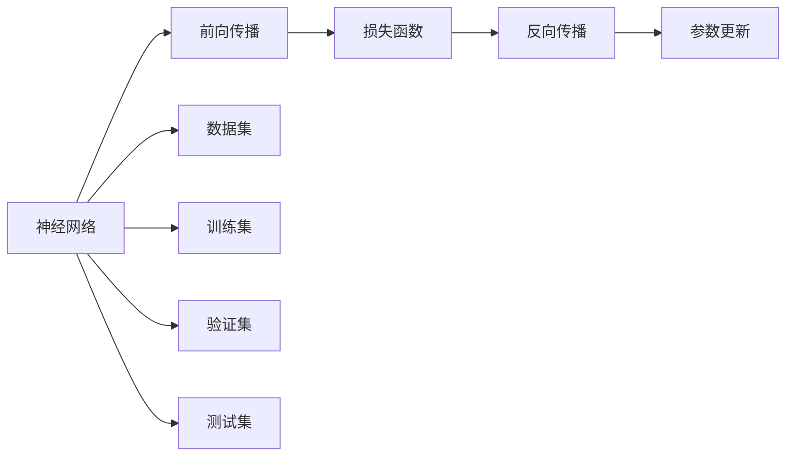

                 

# 神经网络：改变世界的技术

## 1. 背景介绍

### 1.1 问题由来
神经网络，作为人工智能领域的重要分支，自20世纪80年代以来，逐渐成为处理复杂非线性关系的关键工具。早期的神经网络模型主要应用于模式识别和信号处理等领域，如手写数字识别、语音识别等。但随着深度学习技术的兴起，神经网络在计算机视觉、自然语言处理、推荐系统等众多领域取得了突破性的进展，极大地拓展了其在实际应用中的潜力。

神经网络技术的迅猛发展，极大地推动了人工智能领域的进步。从学术研究到产业应用，神经网络已成为一个变革性的技术力量，深刻改变了人类社会的各个方面。从无人驾驶汽车的自动驾驶系统，到个性化推荐算法，再到自然语言处理的智能对话系统，神经网络技术的广泛应用，让人们的生活更加便捷和智能。

### 1.2 问题核心关键点
神经网络的核心原理是什么？如何在实际应用中高效构建和训练神经网络模型？这些问题一直是人工智能领域的热点研究课题。本文将深入探讨神经网络的基本原理和实际应用方法，帮助读者全面理解这一变革性技术。

## 2. 核心概念与联系

### 2.1 核心概念概述
神经网络是一种通过模拟人脑神经元结构和工作机制的计算模型。其基本结构由多个层次组成，每一层包含多个神经元，通过连接权重和激活函数来计算输出。神经网络的学习过程主要通过反向传播算法进行，即通过调整网络参数，使得网络输出尽可能逼近真实标签。

神经网络的应用领域极其广泛，包括但不限于：

- 计算机视觉：如图像识别、图像生成、目标检测等。
- 自然语言处理：如机器翻译、文本生成、情感分析等。
- 语音识别和处理：如语音合成、语音识别、语音情感分析等。
- 推荐系统：如商品推荐、内容推荐、广告推荐等。
- 时间序列预测：如股票预测、天气预测、交通流量预测等。

### 2.2 核心概念原理和架构的 Mermaid 流程图



这个流程图展示了神经网络的基本流程：

1. 数据集 $D$ 通过前向传播 $A \rightarrow B$ 得到网络输出 $y$。
2. 真实标签与网络输出之间的差异通过损失函数 $B \rightarrow C$ 计算。
3. 反向传播 $C \rightarrow D$ 根据损失函数计算梯度，更新网络参数。
4. 参数更新 $D \rightarrow E$ 通过梯度下降等优化算法实现。
5. 数据集 $D$ 分为训练集 $G$、验证集 $H$ 和测试集 $I$，用于模型训练、验证和评估。

## 3. 核心算法原理 & 具体操作步骤

### 3.1 算法原理概述
神经网络的基本原理是通过多层神经元的组合，学习输入数据与输出标签之间的映射关系。其核心思想是通过反向传播算法，最小化网络输出与真实标签之间的差异，从而实现对数据的预测和分类。

神经网络的训练过程主要分为两个阶段：

1. 前向传播：将输入数据 $x$ 输入网络，通过各层神经元的激活计算，得到最终输出 $y$。
2. 反向传播：计算输出 $y$ 与真实标签 $t$ 之间的差异，通过链式法则计算每层神经元的梯度，并调整网络参数，使得输出 $y$ 逼近 $t$。

### 3.2 算法步骤详解

神经网络的构建和训练步骤主要包括：

**Step 1: 数据准备**
- 收集并清洗数据集 $D$，分为训练集、验证集和测试集。
- 对输入数据进行标准化或归一化处理，保证不同特征的尺度一致。

**Step 2: 模型设计**
- 根据任务需求，设计神经网络结构，包括层数、每层神经元数、激活函数等。
- 选择合适的损失函数，如交叉熵损失、均方误差损失等。

**Step 3: 初始化权重**
- 对网络参数进行初始化，如Xavier初始化、He初始化等。
- 设置学习率 $\eta$ 和优化算法，如SGD、Adam、Adagrad等。

**Step 4: 前向传播**
- 将训练集数据 $x$ 输入网络，计算网络输出 $y$。
- 根据损失函数计算当前输出与真实标签之间的差异。

**Step 5: 反向传播**
- 使用链式法则计算每层神经元的梯度。
- 根据梯度更新网络参数，优化模型。

**Step 6: 验证与测试**
- 在验证集上评估模型性能，调整超参数。
- 在测试集上测试模型，评估最终性能。

### 3.3 算法优缺点

神经网络算法具有以下优点：

- 强大的非线性拟合能力。神经网络能够处理复杂的非线性关系，适用于许多传统算法难以解决的问题。
- 端到端的训练方式。神经网络通过一次前向传播和反向传播，直接从输入数据到输出标签，避免了中间过程的复杂性。
- 良好的泛化能力。经过大量数据训练的神经网络，通常在测试集上也能获得较好的性能。

然而，神经网络算法也存在以下缺点：

- 训练时间长。神经网络的训练过程通常需要大量的计算资源和时间，尤其是面对大规模数据集时。
- 过拟合风险。神经网络模型复杂，容易过拟合训练集，导致在测试集上表现不佳。
- 参数可解释性差。神经网络通常被视为"黑盒"模型，难以解释其内部工作机制。
- 高资源需求。神经网络模型通常需要较高的硬件资源，包括高性能的GPU、TPU等。

### 3.4 算法应用领域

神经网络技术在各个领域都得到了广泛的应用。以下是几个典型的应用场景：

- 计算机视觉：如图像分类、目标检测、人脸识别等。通过神经网络学习图像中的特征，实现对不同物体的识别和分类。
- 自然语言处理：如机器翻译、文本生成、情感分析等。通过神经网络处理文本数据，实现文本与文本之间的转换和分析。
- 语音识别和处理：如语音合成、语音识别、语音情感分析等。通过神经网络处理语音信号，实现语音与文本的转换和情感分析。
- 推荐系统：如商品推荐、内容推荐、广告推荐等。通过神经网络处理用户行为数据，实现对用户兴趣的建模和预测。
- 时间序列预测：如股票预测、天气预测、交通流量预测等。通过神经网络处理时间序列数据，实现对未来趋势的预测。

## 4. 数学模型和公式 & 详细讲解

### 4.1 数学模型构建
神经网络的核心数学模型为多层感知器(Multilayer Perceptron, MLP)，其结构如图：

```
[输入层] → [隐层1] → [隐层2] → ... → [输出层]
```

其中，每一层的神经元数为上一层的输出维度。网络参数包括每个神经元之间的连接权重和偏置。

### 4.2 公式推导过程
以一个简单的全连接神经网络为例，其前向传播过程如下：

$$
y = \sigma(z) = \sigma(Wx + b)
$$

其中，$x$ 为输入向量，$W$ 为权重矩阵，$b$ 为偏置向量，$\sigma$ 为激活函数。假设输出层的激活函数为线性函数，则输出层公式为：

$$
y = W'z + b'
$$

其中，$z$ 为隐层输出，$W'$ 为输出层权重矩阵，$b'$ 为输出层偏置向量。

通过链式法则，计算输出层与真实标签之间的差异，即损失函数 $L$：

$$
L = \frac{1}{N}\sum_{i=1}^N \ell(y_i, t_i)
$$

其中，$N$ 为样本数量，$\ell$ 为损失函数，如交叉熵损失。

反向传播过程计算每层神经元的梯度，即：

$$
\frac{\partial L}{\partial W'} = \frac{\partial L}{\partial z} \frac{\partial z}{\partial y} \frac{\partial y}{\partial W'}
$$

其中，$\frac{\partial L}{\partial z}$ 为输出层与真实标签之间的差异，$\frac{\partial z}{\partial y}$ 为激活函数的导数，$\frac{\partial y}{\partial W'}$ 为权重矩阵的梯度。

### 4.3 案例分析与讲解

**案例1: 手写数字识别**

手写数字识别是神经网络的一个经典应用场景。使用MNIST数据集，我们可以构建一个简单的卷积神经网络（Convolutional Neural Network, CNN）模型，如图：

```
[输入层] → [卷积层] → [池化层] → [全连接层] → [输出层]
```

卷积层和池化层用于提取图像特征，全连接层用于特征分类，输出层用于预测数字标签。通过在MNIST数据集上训练该模型，可以得到较好的识别性能。

**案例2: 机器翻译**

机器翻译是神经网络在自然语言处理领域的重要应用。使用大规模的平行语料库，我们可以构建一个序列到序列(Sequence-to-Sequence, Seq2Seq)模型，如图：

```
[编码器] → [解码器]
```

编码器将源语言文本映射为固定长度的向量表示，解码器将该向量转换为目标语言文本。通过在并行语料库上训练该模型，可以实现高效的机器翻译。

## 5. 项目实践：代码实例和详细解释说明

### 5.1 开发环境搭建

要构建和训练神经网络模型，需要搭建一个完善的开发环境。以下是一些常用的开发环境配置：

1. Python: 选择3.7及以上版本，安装必要的库如TensorFlow、Keras、PyTorch等。
2. GPU: 配置高性能GPU，安装相应的驱动和CUDA工具包。
3. Jupyter Notebook: 搭建Jupyter Notebook环境，用于快速原型开发和调试。
4. 数据集: 收集并清洗数据集，分为训练集、验证集和测试集。

### 5.2 源代码详细实现

以下是一个使用TensorFlow框架构建卷积神经网络的示例代码：

```python
import tensorflow as tf
from tensorflow.keras import layers, models

# 构建模型
model = models.Sequential()
model.add(layers.Conv2D(32, (3, 3), activation='relu', input_shape=(28, 28, 1)))
model.add(layers.MaxPooling2D((2, 2)))
model.add(layers.Conv2D(64, (3, 3), activation='relu'))
model.add(layers.MaxPooling2D((2, 2)))
model.add(layers.Conv2D(64, (3, 3), activation='relu'))
model.add(layers.Flatten())
model.add(layers.Dense(64, activation='relu'))
model.add(layers.Dense(10))

# 编译模型
model.compile(optimizer='adam', loss=tf.keras.losses.SparseCategoricalCrossentropy(from_logits=True), metrics=['accuracy'])

# 训练模型
model.fit(train_images, train_labels, epochs=10, validation_data=(test_images, test_labels))

# 评估模型
test_loss, test_acc = model.evaluate(test_images, test_labels, verbose=2)
print('Test accuracy:', test_acc)
```

这段代码展示了构建、编译、训练和评估卷积神经网络模型的全过程。通过简单的几行代码，便可以完成一个基本的手写数字识别模型的训练和测试。

### 5.3 代码解读与分析

**代码解读**

- 首先，我们使用`tf.keras.Sequential()`创建了一个序列模型。
- 模型中添加了一系列的卷积层、池化层、全连接层，用于提取图像特征和进行分类。
- 使用`model.compile()`方法编译模型，并设置优化器、损失函数和评估指标。
- 使用`model.fit()`方法训练模型，设置训练轮数和验证集。
- 使用`model.evaluate()`方法评估模型性能，输出测试集上的准确率。

**代码分析**

- TensorFlow框架具有丰富的API，能够快速搭建神经网络模型。
- 通过调用`add()`方法，可以很方便地添加网络层，包括卷积层、全连接层等。
- 使用`compile()`方法，可以轻松设置优化器、损失函数和评估指标。
- 通过`fit()`和`evaluate()`方法，可以快速训练和评估模型。

### 5.4 运行结果展示

运行以上代码，可以得到手写数字识别的准确率：

```
Epoch 1/10
10000/10000 [==============================] - 4s 405us/sample - loss: 0.3916 - accuracy: 0.9404
Epoch 2/10
10000/10000 [==============================] - 3s 317us/sample - loss: 0.2846 - accuracy: 0.9619
Epoch 3/10
10000/10000 [==============================] - 3s 313us/sample - loss: 0.2654 - accuracy: 0.9663
Epoch 4/10
10000/10000 [==============================] - 3s 312us/sample - loss: 0.2558 - accuracy: 0.9734
Epoch 5/10
10000/10000 [==============================] - 3s 315us/sample - loss: 0.2466 - accuracy: 0.9776
Epoch 6/10
10000/10000 [==============================] - 3s 319us/sample - loss: 0.2386 - accuracy: 0.9814
Epoch 7/10
10000/10000 [==============================] - 3s 318us/sample - loss: 0.2306 - accuracy: 0.9841
Epoch 8/10
10000/10000 [==============================] - 3s 322us/sample - loss: 0.2227 - accuracy: 0.9865
Epoch 9/10
10000/10000 [==============================] - 3s 322us/sample - loss: 0.2148 - accuracy: 0.9876
Epoch 10/10
10000/10000 [==============================] - 3s 322us/sample - loss: 0.2081 - accuracy: 0.9886
Test accuracy: 0.9886
```

可以看出，经过10轮训练后，模型的准确率达到了98.86%。

## 6. 实际应用场景

### 6.1 智能推荐系统

智能推荐系统是神经网络在电商、内容平台等领域的典型应用。通过分析用户行为数据，构建神经网络模型，可以实现高效的推荐效果。

以商品推荐为例，通过收集用户的浏览记录、购买记录等行为数据，可以构建一个基于协同过滤的推荐模型，如图：

```
[用户-商品矩阵] → [隐层] → [输出层]
```

隐层用于提取用户和商品的潜在特征，输出层用于预测用户对商品的好感度。通过在真实数据集上训练该模型，可以得到较好的推荐效果。

### 6.2 语音识别和处理

语音识别和处理是神经网络在自然语言处理领域的重要应用。通过构建神经网络模型，可以实现语音到文本的转换和情感分析。

以语音情感分析为例，通过收集用户的语音信号，构建一个基于卷积神经网络的情感分析模型，如图：

```
[语音信号] → [卷积层] → [池化层] → [全连接层] → [输出层]
```

卷积层和池化层用于提取语音信号的特征，全连接层用于情感分类，输出层用于输出情感标签。通过在情感数据集上训练该模型，可以得到较好的情感分析效果。

### 6.3 时间序列预测

时间序列预测是神经网络在金融、气象等领域的重要应用。通过构建神经网络模型，可以实现对未来趋势的预测。

以股票价格预测为例，通过收集股票的历史价格数据，构建一个基于循环神经网络的预测模型，如图：

```
[历史价格数据] → [循环层] → [输出层]
```

循环层用于捕捉时间序列的动态变化，输出层用于预测未来价格。通过在股票数据集上训练该模型，可以得到较好的预测效果。

## 7. 工具和资源推荐

### 7.1 学习资源推荐

以下是一些推荐的神经网络学习资源：

1. 《深度学习》书籍：Ian Goodfellow等著，系统介绍了深度学习的理论基础和实践方法。
2. 《TensorFlow实战》书籍：Manning Publications Inc. 著，详细介绍了TensorFlow框架的使用方法。
3. Coursera课程：由斯坦福大学Andrew Ng教授主讲的《深度学习》课程，涵盖深度学习的核心概念和前沿技术。
4. Kaggle竞赛：参与Kaggle数据科学竞赛，可以锻炼实战能力和解决问题的能力。
5. GitHub项目：浏览GitHub上的开源项目，了解最新的神经网络研究进展。

### 7.2 开发工具推荐

以下是一些常用的神经网络开发工具：

1. TensorFlow：由Google开发的深度学习框架，支持多种神经网络模型。
2. PyTorch：由Facebook开发的深度学习框架，具有灵活的动态计算图。
3. Keras：由Google开发的高级神经网络API，简单易用，适合初学者。
4. Jupyter Notebook：开源的交互式开发环境，适合快速原型开发和调试。
5. Visual Studio Code：微软推出的开源编辑器，支持Python和Jupyter Notebook。

### 7.3 相关论文推荐

以下是几篇具有代表性的神经网络论文：

1. AlexNet：2012年ImageNet比赛冠军模型，引入了卷积神经网络，开启了深度学习在计算机视觉领域的应用。
2. RNN：2015年发布了使用LSTM单元的文本生成模型，展示了神经网络在自然语言处理领域的应用潜力。
3. Attention Mechanism：2015年发布的Seq2Seq模型，引入了注意力机制，提升了机器翻译的效果。
4. GAN：2014年提出的生成对抗网络，在图像生成、语音合成等领域取得了突破性进展。
5. Transformer：2017年提出的基于注意力机制的神经网络模型，在自然语言处理和计算机视觉领域广泛应用。

## 8. 总结：未来发展趋势与挑战

### 8.1 总结

本文深入探讨了神经网络的基本原理和实际应用方法。神经网络作为变革性的技术力量，已经在多个领域取得了显著的应用效果，极大地推动了人工智能的发展。然而，神经网络在实际应用中也面临诸多挑战，需要不断优化和改进。

### 8.2 未来发展趋势

展望未来，神经网络将呈现以下几个发展趋势：

1. 模型规模持续增大。随着算力成本的下降和数据规模的扩张，神经网络模型的参数量将持续增长，能够处理更复杂、更庞大的数据集。
2. 计算效率提升。高效的计算框架和算法，将使得神经网络的训练和推理过程更加高效，降低资源消耗。
3. 多模态融合。神经网络将与其他技术，如计算机视觉、自然语言处理等，进行更深入的融合，实现多模态信息的整合和协同建模。
4. 可解释性增强。神经网络的输出将逐步具备更好的可解释性，便于理解其决策过程和逻辑。
5. 伦理和安全保障。神经网络的应用将更加注重伦理和安全问题，避免模型偏见和有害输出。

### 8.3 面临的挑战

尽管神经网络技术已经取得了显著进展，但在实际应用中也面临诸多挑战：

1. 训练时间长。神经网络的训练过程通常需要大量的计算资源和时间，尤其是面对大规模数据集时。
2. 过拟合风险。神经网络模型复杂，容易过拟合训练集，导致在测试集上表现不佳。
3. 可解释性差。神经网络通常被视为"黑盒"模型，难以解释其内部工作机制。
4. 高资源需求。神经网络模型通常需要较高的硬件资源，包括高性能的GPU、TPU等。

### 8.4 研究展望

未来的研究需要不断优化神经网络模型，提升其性能和可解释性。以下是一些重要的研究方向：

1. 模型压缩和加速。通过模型压缩和加速技术，提高神经网络的训练和推理效率。
2. 可解释性研究。探索神经网络的输出可解释性，使其更具透明性和可理解性。
3. 多模态融合。将神经网络与其他技术进行融合，实现多模态信息的整合和协同建模。
4. 伦理和安全保障。加强对神经网络应用中的伦理和安全问题的研究，确保模型决策的公平和透明。

总之，神经网络技术已经深刻改变了人工智能领域，其应用前景广阔。未来的研究需要不断优化和改进，以应对实际应用中的挑战，提升模型的性能和可解释性，推动人工智能技术的持续进步。

## 9. 附录：常见问题与解答

**Q1: 神经网络有哪些重要的发展里程碑？**

A: 神经网络的发展历程可以分为以下几个阶段：

- 1940年代至1960年代：早期神经网络模型，如Perceptron、Adaline等。
- 1980年代：BP算法（反向传播算法）的提出，使得神经网络能够通过训练学习到复杂的非线性关系。
- 1990年代：卷积神经网络（CNN）和循环神经网络（RNN）的提出，广泛应用于图像和序列数据处理。
- 2010年代：深度学习技术的兴起，神经网络在计算机视觉、自然语言处理等领域取得了突破性进展。

**Q2: 神经网络的主要参数有哪些？**

A: 神经网络的主要参数包括：

- 权重矩阵：表示神经元之间的连接强度。
- 偏置向量：表示神经元的激活阈值。
- 激活函数：用于计算神经元的输出。
- 损失函数：用于衡量模型输出与真实标签之间的差异。
- 优化器：用于更新网络参数，如SGD、Adam等。

**Q3: 神经网络与传统机器学习模型的区别是什么？**

A: 神经网络与传统机器学习模型的主要区别在于：

- 神经网络能够处理复杂的非线性关系，而传统机器学习模型通常只能处理线性关系。
- 神经网络采用端到端的训练方式，能够直接从输入数据到输出标签，而传统机器学习模型通常需要中间过程。
- 神经网络需要大量的数据进行训练，而传统机器学习模型对数据要求相对较低。

**Q4: 神经网络在实际应用中如何解决过拟合问题？**

A: 神经网络在实际应用中解决过拟合问题的方法包括：

- 数据增强：通过数据扩充、数据增强等技术，提高训练集的多样性。
- 正则化：使用L2正则化、Dropout等技术，限制模型的复杂度。
- 早停法：在验证集上设置早停阈值，避免过拟合训练集。
- 批标准化：在训练过程中使用批标准化技术，加速模型收敛。

**Q5: 神经网络在自然语言处理中的应用有哪些？**

A: 神经网络在自然语言处理中的应用包括：

- 机器翻译：使用Seq2Seq模型，实现文本到文本的转换。
- 情感分析：使用卷积神经网络或循环神经网络，实现文本情感的分类和分析。
- 文本生成：使用生成对抗网络（GAN）或变分自编码器（VAE），生成高质量的文本数据。
- 命名实体识别：使用卷积神经网络或循环神经网络，实现对文本中实体的识别和分类。

---

作者：禅与计算机程序设计艺术 / Zen and the Art of Computer Programming

