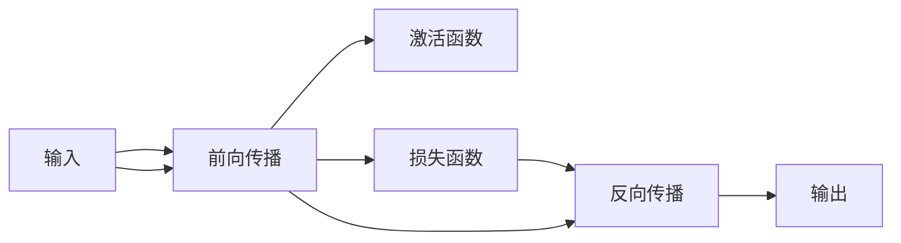

                 

# 神经网络：改变世界的技术

> 关键词：神经网络,深度学习,人工智能,计算机视觉,自然语言处理,图像识别,自动驾驶

## 1. 背景介绍

### 1.1 问题由来

过去几十年，人工智能（AI）和机器学习（ML）技术在各个领域中取得了巨大的进展。特别是神经网络（Neural Network, NN）的提出和发展，使得机器能够模仿人脑神经元的工作机制，进行复杂模式识别和处理。神经网络技术的突破性进展，使机器能够自动地进行学习和决策，实现前所未有的应用，改变了世界的生产、生活和技术格局。

本文将系统地介绍神经网络及其相关技术，包括深度学习（Deep Learning）的基础理论和应用实践。我们期望通过本文的阐述，帮助读者理解神经网络的核心概念、关键算法及其应用领域，以便能够更好地应用这一强大的技术解决实际问题。

### 1.2 问题核心关键点

神经网络及其相关技术，主要涉及以下几个关键点：

1. **神经网络结构与算法**：理解不同神经网络结构（如前馈神经网络、卷积神经网络、循环神经网络等）和关键算法（如反向传播、梯度下降、激活函数等）。
2. **深度学习框架与实现**：掌握常用的深度学习框架（如TensorFlow、PyTorch、Keras等），并学会应用这些框架实现神经网络模型。
3. **典型应用领域**：了解神经网络在计算机视觉、自然语言处理、语音识别、图像识别、自动驾驶等领域的广泛应用。
4. **伦理与安全问题**：认识神经网络技术在带来便利的同时，也引发了数据隐私、算法偏见、安全性等问题，并探讨解决这些问题的策略。

## 2. 核心概念与联系

### 2.1 核心概念概述

神经网络作为深度学习技术的基础，是模拟人脑神经元网络的计算模型。其核心概念包括：

- **神经元（Neuron）**：神经网络的基本单位，类似人脑中的神经元，能够接收输入、处理信息并输出结果。
- **层（Layer）**：神经网络由多个神经元组成的层组成，每一层处理特定的任务，如特征提取、特征映射等。
- **激活函数（Activation Function）**：用于控制神经元输出，增加模型的非线性能力。
- **损失函数（Loss Function）**：衡量模型预测与实际标签之间的差距，用于优化模型参数。
- **优化算法（Optimizer）**：如梯度下降（Gradient Descent）、Adam等，用于最小化损失函数，更新模型参数。
- **反向传播（Backpropagation）**：通过链式法则计算损失函数对模型参数的梯度，用于优化模型。

这些概念通过以下Mermaid流程图展示，体现了神经网络的基本架构和工作原理：



### 2.2 核心概念联系

神经网络各概念间具有紧密的联系：

- **神经元**构成网络的基本计算单元，接收输入、处理信息并输出结果。
- **层**通过多个神经元组成，实现信息的逐层传递和处理，增加模型的复杂度。
- **激活函数**通过引入非线性变换，使模型能够学习复杂的非线性关系，增强模型的表达能力。
- **损失函数**用于度量模型的预测误差，指导模型的优化过程。
- **优化算法**通过调整模型参数，使损失函数最小化，优化模型的预测效果。
- **反向传播**实现链式法则的计算，将梯度信息传递到网络各层，更新模型参数。

这些概念共同构成了神经网络的核心算法框架，使模型能够进行高效的计算和优化，实现复杂的模式识别和处理任务。

## 3. 核心算法原理 & 具体操作步骤

### 3.1 算法原理概述

神经网络的基本算法包括前向传播、反向传播、损失函数计算和优化算法等。以下详细介绍这些关键算法的原理和操作步骤：

#### 3.1.1 前向传播（Forward Propagation）

前向传播是指将输入数据依次通过网络各层，计算出最终输出结果的过程。其基本步骤包括：

1. **输入数据标准化**：将输入数据进行归一化处理，使数据分布更加集中。
2. **计算各层输出**：通过神经元对输入进行加权求和和激活函数计算，得到各层输出。
3. **输出结果**：最终得到网络的输出结果。

#### 3.1.2 反向传播（Backpropagation）

反向传播是指通过链式法则计算损失函数对模型参数的梯度，并更新参数的过程。其基本步骤包括：

1. **计算损失梯度**：通过链式法则计算损失函数对输出结果的梯度，传递到各层。
2. **计算参数梯度**：通过激活函数和权重矩阵计算各层参数的梯度。
3. **参数更新**：使用优化算法（如梯度下降）更新模型参数。

#### 3.1.3 损失函数（Loss Function）

损失函数用于度量模型预测与实际标签之间的差距，常见损失函数包括均方误差（MSE）、交叉熵（Cross-Entropy）等。其基本步骤包括：

1. **计算预测结果**：通过神经网络计算模型的预测结果。
2. **计算预测误差**：通过损失函数计算预测结果与实际标签之间的误差。
3. **更新模型参数**：使用优化算法最小化损失函数，更新模型参数。

#### 3.1.4 优化算法（Optimizer）

优化算法用于更新模型参数，使损失函数最小化。常见优化算法包括梯度下降（GD）、Adam、Adagrad等。其基本步骤包括：

1. **计算梯度**：通过反向传播计算损失函数对模型参数的梯度。
2. **更新参数**：使用优化算法（如梯度下降）更新模型参数。
3. **控制学习率**：根据学习率调整参数更新的幅度，避免过拟合或欠拟合。

### 3.2 算法步骤详解

以下详细介绍深度学习中神经网络的完整训练流程：

1. **数据准备**：收集并预处理训练数据，分为训练集、验证集和测试集。
2. **模型选择**：选择合适的神经网络模型（如卷积神经网络、循环神经网络等）作为初始化参数。
3. **参数初始化**：初始化模型参数，使用随机数生成器生成随机权重。
4. **前向传播**：将训练数据输入神经网络，计算输出结果。
5. **计算损失**：通过损失函数计算模型的预测误差。
6. **反向传播**：通过链式法则计算损失函数对模型参数的梯度。
7. **参数更新**：使用优化算法（如Adam）更新模型参数。
8. **验证集评估**：在验证集上评估模型性能，防止过拟合。
9. **测试集评估**：在测试集上评估模型性能，给出最终结果。

### 3.3 算法优缺点

神经网络及其相关技术具有以下优点：

1. **强大的表达能力**：通过多层结构，神经网络能够处理复杂的非线性关系，适应各种任务。
2. **高效自动学习**：通过反向传播和优化算法，神经网络能够自动学习特征，避免手动特征工程。
3. **泛化能力强**：经过充分训练的神经网络，能够适应新数据和新任务，具有较强的泛化能力。

同时，神经网络也存在以下缺点：

1. **数据依赖性强**：需要大量标注数据进行训练，数据质量直接影响模型性能。
2. **计算资源需求高**：神经网络模型参数量巨大，计算和存储资源需求高。
3. **训练时间长**：神经网络模型训练时间较长，需要进行大量迭代。
4. **模型复杂度高**：神经网络结构复杂，调试和优化难度较大。
5. **可解释性不足**：神经网络模型通常被视为黑盒系统，难以解释其内部工作机制。

### 3.4 算法应用领域

神经网络及其相关技术在多个领域中得到了广泛应用，以下是几个典型的应用领域：

1. **计算机视觉**：如图像识别、物体检测、人脸识别、自动驾驶等。
2. **自然语言处理**：如语言翻译、情感分析、文本分类、对话系统等。
3. **语音识别**：如语音识别、语音合成、说话人识别等。
4. **医学影像分析**：如图像分割、病变检测、手术辅助等。
5. **金融分析**：如信用评估、股票预测、欺诈检测等。

## 4. 数学模型和公式 & 详细讲解 & 举例说明

### 4.1 数学模型构建

神经网络的基本数学模型包括输入输出、权重和偏置、激活函数等。以下详细介绍这些关键模型的构建过程：

设神经网络的输入为 $x$，输出为 $y$，权重矩阵为 $W$，偏置向量为 $b$，激活函数为 $f$。其基本模型可以表示为：

$$
y = f(xW + b)
$$

其中，$W$ 和 $b$ 为模型的可学习参数，$x$ 为输入数据，$y$ 为输出结果。

### 4.2 公式推导过程

以二分类任务为例，推导神经网络的损失函数和优化算法。

1. **损失函数**：假设模型的输出为 $y$，实际标签为 $t$。常用的损失函数为二元交叉熵（Binary Cross-Entropy）：

$$
L(y, t) = -(t\log y + (1-t)\log(1-y))
$$

其中，$t$ 为二元标签（0或1），$y$ 为模型预测结果。

2. **优化算法**：使用梯度下降算法更新模型参数 $W$ 和 $b$，以最小化损失函数 $L$。其基本公式为：

$$
W \leftarrow W - \eta \nabla_L(y, t)
$$

其中，$\eta$ 为学习率，$\nabla_L(y, t)$ 为损失函数对权重 $W$ 的梯度。

### 4.3 案例分析与讲解

以手写数字识别为例，解释神经网络模型在实际中的应用。

1. **数据准备**：收集手写数字图片，进行预处理（如归一化、灰度化）。
2. **模型选择**：选择卷积神经网络（CNN）作为初始化参数。
3. **模型训练**：将训练数据输入神经网络，计算损失函数，使用梯度下降算法更新模型参数。
4. **模型评估**：在测试集上评估模型性能，计算准确率、召回率等指标。
5. **模型应用**：将训练好的模型应用于新图像识别任务，输出识别结果。

## 5. 项目实践：代码实例和详细解释说明

### 5.1 开发环境搭建

在使用神经网络进行项目开发前，需要准备好开发环境。以下是使用Python进行TensorFlow开发的环境配置流程：

1. 安装Anaconda：从官网下载并安装Anaconda，用于创建独立的Python环境。
2. 创建并激活虚拟环境：
```bash
conda create -n tf-env python=3.8 
conda activate tf-env
```

3. 安装TensorFlow：根据CUDA版本，从官网获取对应的安装命令。例如：
```bash
conda install tensorflow -c conda-forge -c pytorch
```

4. 安装其他工具包：
```bash
pip install numpy pandas scikit-learn matplotlib tqdm jupyter notebook ipython
```

完成上述步骤后，即可在`tf-env`环境中开始神经网络项目的开发。

### 5.2 源代码详细实现

下面以手写数字识别为例，给出使用TensorFlow进行卷积神经网络（CNN）的实现。

首先，定义数据预处理函数：

```python
import tensorflow as tf

def preprocess_data(data_path):
    image_files = tf.io.gfile.glob(data_path + '/*.png')
    images = []
    labels = []
    for file in image_files:
        image = tf.io.read_file(file)
        image = tf.image.decode_png(image, channels=1)
        image = tf.image.convert_image_dtype(image, tf.float32) / 255.0
        image = tf.image.resize(image, [28, 28])
        label = tf.cast(tf.io.basename(file)[-2], tf.int32)
        images.append(image)
        labels.append(label)
    return images, labels
```

然后，定义神经网络模型：

```python
def build_cnn_model(input_shape):
    model = tf.keras.Sequential([
        tf.keras.layers.Conv2D(32, (3, 3), activation='relu', input_shape=input_shape),
        tf.keras.layers.MaxPooling2D((2, 2)),
        tf.keras.layers.Conv2D(64, (3, 3), activation='relu'),
        tf.keras.layers.MaxPooling2D((2, 2)),
        tf.keras.layers.Flatten(),
        tf.keras.layers.Dense(64, activation='relu'),
        tf.keras.layers.Dense(10, activation='softmax')
    ])
    return model
```

接着，定义训练和评估函数：

```python
def train_cnn_model(model, train_data, val_data, batch_size, epochs, learning_rate):
    model.compile(optimizer=tf.keras.optimizers.Adam(learning_rate), loss='sparse_categorical_crossentropy', metrics=['accuracy'])
    model.fit(train_data, epochs=epochs, validation_data=val_data, batch_size=batch_size)

def evaluate_cnn_model(model, test_data, batch_size):
    model.evaluate(test_data, batch_size=batch_size)
```

最后，启动训练流程：

```python
input_shape = [28, 28, 1]

train_images, train_labels = preprocess_data(train_data_path)
val_images, val_labels = preprocess_data(val_data_path)
test_images, test_labels = preprocess_data(test_data_path)

model = build_cnn_model(input_shape)

train_cnn_model(model, train_images, val_images, batch_size=64, epochs=10, learning_rate=0.001)

evaluate_cnn_model(model, test_images, batch_size=64)
```

以上就是使用TensorFlow实现卷积神经网络进行手写数字识别的完整代码实现。可以看到，使用TensorFlow实现神经网络模型非常简单，只需要定义模型结构，配置训练参数，即可快速训练和评估模型。

### 5.3 代码解读与分析

让我们再详细解读一下关键代码的实现细节：

**preprocess_data函数**：
- 读取图片文件路径。
- 对每张图片进行预处理，包括灰度化、归一化、大小调整为28x28。
- 对标签进行编码，转换为0-9的数字标签。

**build_cnn_model函数**：
- 使用Sequential模型定义神经网络结构，包括卷积层、池化层、全连接层等。
- 使用softmax激活函数输出10个分类的概率分布。

**train_cnn_model函数**：
- 编译模型，指定优化器、损失函数和评估指标。
- 使用fit方法训练模型，指定训练集、验证集、批次大小和迭代轮数。

**evaluate_cnn_model函数**：
- 使用evaluate方法评估模型在测试集上的性能，输出准确率。

**训练流程**：
- 定义输入形状，进行数据预处理。
- 定义模型，进行模型训练。
- 在测试集上评估模型性能，给出最终结果。

可以看到，使用TensorFlow进行神经网络开发非常便捷高效，适合快速迭代研究。

## 6. 实际应用场景

### 6.1 计算机视觉

神经网络在计算机视觉领域具有广泛的应用，如图像识别、物体检测、人脸识别等。以图像识别为例，神经网络通过多层卷积和池化操作，提取图像特征，进行分类和识别。常见的应用包括：

1. **数字识别**：手写数字、车牌号码等字符识别。
2. **物体识别**：识别物体种类和位置，如自动驾驶中的交通标志识别。
3. **人脸识别**：识别人脸图像，进行身份验证和监控。

### 6.2 自然语言处理

神经网络在自然语言处理（NLP）领域也得到了广泛应用，如语言翻译、情感分析、文本分类等。以语言翻译为例，神经网络通过编码器-解码器结构，将源语言转化为目标语言。常见的应用包括：

1. **机器翻译**：将文本从一种语言翻译成另一种语言。
2. **情感分析**：分析文本情感倾向，判断情感极性。
3. **文本分类**：将文本分类到预定义的类别中，如新闻分类、垃圾邮件过滤等。

### 6.3 语音识别

神经网络在语音识别领域也有重要的应用，如语音识别、语音合成等。以语音识别为例，神经网络通过声学模型和语言模型，将音频信号转化为文本。常见的应用包括：

1. **语音识别**：将语音信号转化为文本，进行语音交互和自动化处理。
2. **语音合成**：将文本转化为语音，进行语音生成和语音助手等。

### 6.4 未来应用展望

随着神经网络技术的不断发展和应用领域的拓展，未来将有更多创新应用出现。以下是几个典型的未来应用方向：

1. **自动驾驶**：通过神经网络处理图像和传感器数据，实现自动驾驶和智能交通。
2. **医疗影像分析**：通过神经网络处理医疗影像，进行疾病诊断和病变检测。
3. **金融分析**：通过神经网络处理金融数据，进行股票预测和风险评估。
4. **智能家居**：通过神经网络处理家庭环境数据，实现智能控制和个性化服务。

## 7. 工具和资源推荐

### 7.1 学习资源推荐

为了帮助开发者系统掌握神经网络的基础理论和实践技巧，这里推荐一些优质的学习资源：

1. **《深度学习》书籍**：Ian Goodfellow等人所著，全面介绍了深度学习的基础理论和算法。
2. **Deep Learning Specialization课程**：由Andrew Ng教授开设，包含多个视频课程和实践项目。
3. **CS231n《卷积神经网络》课程**：斯坦福大学开设的深度学习课程，重点介绍计算机视觉领域的应用。
4. **CS224n《自然语言处理》课程**：斯坦福大学开设的深度学习课程，涵盖自然语言处理的基础理论和算法。
5. **PyTorch官方文档**：详细介绍了PyTorch库的使用方法和实践技巧。
6. **TensorFlow官方文档**：详细介绍了TensorFlow库的使用方法和实践技巧。

通过对这些资源的学习实践，相信你一定能够快速掌握神经网络的核心概念和应用技巧，并用于解决实际的计算机视觉、自然语言处理和语音识别等任务。

### 7.2 开发工具推荐

高效的开发离不开优秀的工具支持。以下是几款用于神经网络开发常用的工具：

1. **PyTorch**：由Facebook开发的深度学习框架，支持动态图和静态图，适合快速迭代研究。
2. **TensorFlow**：由Google主导开发的深度学习框架，生产部署方便，适合大规模工程应用。
3. **Keras**：基于TensorFlow和Theano等后端实现的高级API，使用便捷，适合快速开发原型。
4. **MXNet**：由亚马逊开发的深度学习框架，支持多种编程语言，适合分布式训练和推理。
5. **JAX**：由Google开发的自动微分库，支持高效的向量运算和分布式训练，适合学术研究和工程应用。
6. **PyTorch Lightning**：基于PyTorch的模型训练框架，支持模型部署、超参数搜索等功能，适合快速开发模型。

合理利用这些工具，可以显著提升神经网络开发和研究的效率，加速创新迭代的步伐。

### 7.3 相关论文推荐

神经网络及其相关技术的发展源于学界的持续研究。以下是几篇奠基性的相关论文，推荐阅读：

1. **AlexNet论文**：提出卷积神经网络（CNN）模型，引入ReLU激活函数和Dropout技术，刷新了ImageNet分类任务的SOTA。
2. **RNN论文**：提出循环神经网络（RNN）模型，用于处理序列数据，应用于语音识别、机器翻译等领域。
3. **GAN论文**：提出生成对抗网络（GAN）模型，用于生成高质量的图像和音频等。
4. **BERT论文**：提出BERT模型，引入预训练任务和双向语言模型，刷新了多项NLP任务的SOTA。
5. **YOLO论文**：提出YOLO模型，用于实时目标检测，提升了检测速度和准确率。

这些论文代表了大神经网络及其相关技术的发展脉络。通过学习这些前沿成果，可以帮助研究者把握学科前进方向，激发更多的创新灵感。

## 8. 总结：未来发展趋势与挑战

### 8.1 总结

本文对神经网络及其相关技术进行了全面系统的介绍。首先阐述了神经网络的基本原理和关键算法，包括前向传播、反向传播、损失函数和优化算法等。其次，详细介绍了神经网络在计算机视觉、自然语言处理和语音识别等领域的广泛应用。最后，探讨了神经网络未来发展的趋势和面临的挑战，提出了应对策略。

通过本文的系统梳理，可以看到，神经网络作为深度学习技术的基础，正在各个领域中发挥重要作用，并不断拓展其应用边界。未来，伴随神经网络技术的持续演进，将有更多创新应用出现，为人工智能技术的发展注入新的活力。

### 8.2 未来发展趋势

展望未来，神经网络及其相关技术将呈现以下几个发展趋势：

1. **模型规模不断增大**：随着算力成本的下降和数据规模的扩张，神经网络模型的参数量还将持续增长，超大规模神经网络模型将逐渐普及。
2. **模型结构更加复杂**：深度神经网络模型结构将变得更加复杂，如自注意力机制、Transformer等，增强模型的表达能力和泛化能力。
3. **多模态融合**：神经网络将与其他模态（如视觉、语音、文本等）进行融合，提升跨模态信息的处理能力。
4. **自监督学习**：神经网络将更多地采用自监督学习范式，减少对标注数据的需求，提高模型的通用性和鲁棒性。
5. **联邦学习**：神经网络将采用联邦学习范式，实现分布式训练和隐私保护，提升模型在分布式环境下的性能。
6. **推理优化**：神经网络将采用推理优化技术，如量化加速、模型压缩等，提升模型的实时性和效率。

### 8.3 面临的挑战

尽管神经网络及其相关技术已经取得了巨大成功，但在迈向更加智能化、普适化应用的过程中，仍面临诸多挑战：

1. **数据依赖性**：神经网络依赖大量的标注数据进行训练，数据质量和数量直接影响模型性能。
2. **计算资源需求高**：神经网络模型参数量巨大，计算和存储资源需求高，大规模训练和推理面临计算瓶颈。
3. **可解释性不足**：神经网络模型通常被视为黑盒系统，难以解释其内部工作机制和决策逻辑，对高风险应用带来挑战。
4. **数据隐私和安全性**：神经网络模型在处理敏感数据时，存在数据隐私泄露和安全性问题，需要加强数据保护和模型审查。
5. **算法偏见**：神经网络模型容易学习到有偏见的数据，产生歧视性输出，需要加强数据和模型的偏见消除。

### 8.4 研究展望

面对神经网络及其相关技术所面临的挑战，未来的研究需要在以下几个方面寻求新的突破：

1. **自监督学习**：通过自监督学习范式，减少对标注数据的需求，提升模型的通用性和鲁棒性。
2. **模型压缩和优化**：采用模型压缩和优化技术，提升模型的实时性和效率，降低计算和存储资源需求。
3. **可解释性和透明度**：采用可解释性和透明度技术，增强神经网络模型的解释能力和可视化能力，提高模型的信任度。
4. **数据隐私和安全**：采用数据隐私和安全技术，保护用户数据隐私和模型安全性，确保应用的可信度和可靠性。
5. **模型偏见消除**：采用模型偏见消除技术，减少模型中的有偏见输出，提升模型的公平性和可信度。

这些研究方向的探索，必将引领神经网络技术迈向更高的台阶，为构建安全、可靠、可解释、可控的智能系统铺平道路。面向未来，神经网络及其相关技术需要与其他人工智能技术进行更深入的融合，如知识表示、因果推理、强化学习等，多路径协同发力，共同推动人工智能技术的发展。

## 9. 附录：常见问题与解答

**Q1：神经网络与传统机器学习模型的区别是什么？**

A: 神经网络与传统机器学习模型的主要区别在于其结构和训练方式。神经网络通过多层结构，能够处理复杂的非线性关系，进行自动特征学习，而传统机器学习模型需要手动特征工程，计算能力有限。此外，神经网络使用反向传播和优化算法进行训练，能够自动调整模型参数，适应复杂任务。

**Q2：神经网络在训练过程中如何进行参数更新？**

A: 神经网络在训练过程中，使用反向传播算法计算损失函数对模型参数的梯度，然后使用优化算法（如梯度下降）更新模型参数。优化算法通过调整参数的幅度和方向，最小化损失函数，使模型输出逼近真实标签。

**Q3：神经网络在实际应用中需要注意哪些问题？**

A: 神经网络在实际应用中需要注意以下问题：
1. **数据质量**：高质量的数据是训练神经网络的基础，需要处理数据标注、噪声等。
2. **计算资源**：神经网络模型参数量大，计算和存储资源需求高，需要优化模型结构，采用分布式训练等技术。
3. **模型偏见**：神经网络容易学习到有偏见的数据，产生歧视性输出，需要加强数据和模型的偏见消除。
4. **可解释性**：神经网络模型通常被视为黑盒系统，难以解释其内部工作机制和决策逻辑，对高风险应用带来挑战。
5. **数据隐私和安全性**：神经网络在处理敏感数据时，存在数据隐私泄露和安全性问题，需要加强数据保护和模型审查。

**Q4：神经网络在实际应用中如何避免过拟合？**

A: 神经网络在实际应用中，可以通过以下方法避免过拟合：
1. **数据增强**：通过数据增强技术，扩充训练集，增加数据多样性，防止模型过拟合。
2. **正则化**：使用L2正则、Dropout等技术，控制模型复杂度，防止模型过拟合。
3. **早停策略**：在验证集上监测模型性能，达到预设阈值时停止训练，防止模型过拟合。
4. **模型压缩**：采用模型压缩技术，减小模型参数量，提高模型泛化能力，防止模型过拟合。
5. **迁移学习**：通过迁移学习技术，利用预训练模型的知识，提升模型泛化能力，防止模型过拟合。

**Q5：神经网络在实际应用中如何进行模型优化？**

A: 神经网络在实际应用中，可以通过以下方法进行模型优化：
1. **优化算法**：选择合适的优化算法，如Adam、Adagrad等，控制参数更新的幅度和方向，提高模型收敛速度和精度。
2. **超参数调优**：调整学习率、批次大小等超参数，优化模型训练过程，提高模型性能。
3. **模型压缩**：采用模型压缩技术，如量化加速、模型剪枝等，减小模型参数量，提高模型效率和泛化能力。
4. **知识蒸馏**：通过知识蒸馏技术，将大模型知识迁移到小模型，提高小模型性能。
5. **模型融合**：采用模型融合技术，如集成学习、模型融合等，提高模型泛化能力和鲁棒性。

这些方法可以在模型训练和推理过程中进行优化，提升神经网络的性能和应用效果。

---

作者：禅与计算机程序设计艺术 / Zen and the Art of Computer Programming

