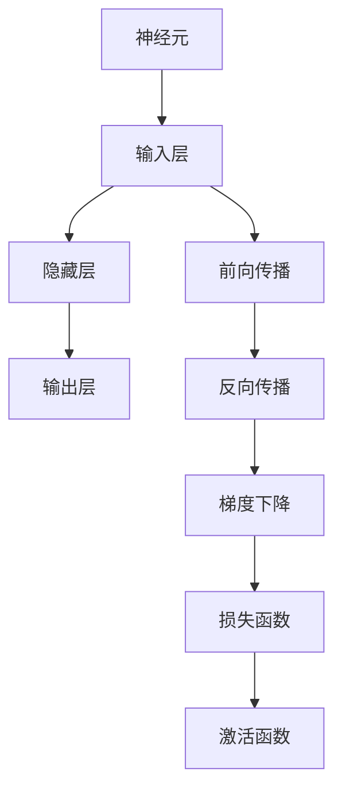

                 

# 神经网络：机器学习工具箱中的新宠

> 关键词：神经网络,机器学习,深度学习,模型构建,前向传播,反向传播,优化算法,激活函数,卷积神经网络(CNN),循环神经网络(RNN),长短期记忆网络(LSTM),卷积核,神经元,输入层,隐藏层,输出层,神经网络体系结构,反向传播算法,梯度下降,反向传播

## 1. 背景介绍

### 1.1 问题由来
神经网络（Neural Networks, NN）是机器学习领域最具代表性的工具之一，其核心思想是模拟人脑的神经元工作方式，通过多层非线性变换，实现复杂数据的建模与预测。自20世纪80年代以来，神经网络在图像识别、语音识别、自然语言处理、游戏AI等领域取得了诸多突破。近年来，随着深度学习技术的蓬勃发展，神经网络的应用范围进一步拓展，成为了人工智能的“新宠”。

神经网络之所以受到广泛关注，主要原因有以下几点：
1. 强大的非线性建模能力：神经网络能够处理非线性、高维度的数据，从中学习复杂模式和特征。
2. 端到端的自动化学习：神经网络能够通过大量标注数据进行自动学习，避免了手工特征工程的繁琐工作。
3. 泛化能力优秀：经过充分的训练，神经网络在实际应用中表现优异，具有较好的泛化能力。
4. 适应性强：神经网络可以适应各种应用场景，从图像识别到自然语言处理，甚至游戏AI，都有广泛应用。

### 1.2 问题核心关键点
神经网络的核心技术包括模型构建、前向传播、反向传播、优化算法、激活函数等。理解这些核心概念，是掌握神经网络技术的第一步。

1. **模型构建**：神经网络通常由输入层、隐藏层和输出层构成。输入层接收原始数据，隐藏层进行特征提取和信息传递，输出层输出最终预测结果。
2. **前向传播**：输入数据通过网络逐层传递，每个神经元根据权重和激活函数计算输出。前向传播的目标是计算模型对数据的预测值。
3. **反向传播**：通过计算预测值与实际标签的误差，反向传播误差信号，更新网络参数。反向传播是神经网络训练的核心。
4. **优化算法**：常用的优化算法包括梯度下降、Adam、Adagrad等，用于更新模型参数，最小化损失函数。
5. **激活函数**：常用的激活函数包括ReLU、Sigmoid、Tanh等，用于引入非线性特性，增强模型表达能力。

神经网络之所以能够取得巨大成功，正是得益于这些核心技术的协同工作。理解这些技术原理和实现细节，将有助于我们更好地掌握神经网络。

## 2. 核心概念与联系

### 2.1 核心概念概述

为更好地理解神经网络的基本原理和工作流程，本节将介绍几个密切相关的核心概念：

- **神经元**：神经网络的基本计算单元，通常包含权重、偏置和激活函数，用于计算输入数据的加权和。
- **输入层**：接收原始数据，传递到隐藏层进行处理。
- **隐藏层**：用于特征提取和信息传递，包含多个神经元层。
- **输出层**：输出最终预测结果，通常为线性回归、二分类、多分类等形式。
- **神经网络体系结构**：由输入层、隐藏层和输出层组成，各层之间通过连接权重传递信息。
- **前向传播**：数据从输入层开始，逐层传递，最终得到输出结果。
- **反向传播**：利用预测结果与实际标签的误差，反向计算梯度，更新网络参数。
- **梯度下降**：常用的优化算法，通过梯度方向调整参数，最小化损失函数。
- **损失函数**：用于衡量模型预测结果与实际标签的差异，常见的有均方误差、交叉熵等。
- **激活函数**：用于引入非线性特性，增强模型表达能力。

这些核心概念之间的逻辑关系可以通过以下Mermaid流程图来展示：



这个流程图展示了神经网络的基本工作流程：输入数据经过前向传播得到预测结果，通过反向传播计算误差，利用梯度下降更新网络参数，同时利用激活函数增强模型表达能力。

## 3. 核心算法原理 & 具体操作步骤
### 3.1 算法原理概述

神经网络的核心思想是通过多层非线性变换，从输入数据中学习特征表示，并利用这些特征进行预测。其基本原理可以归纳为以下几个方面：

1. **前向传播**：将输入数据通过网络逐层传递，计算每个神经元的加权和，并应用激活函数得到输出。前向传播的目标是计算模型对数据的预测值。

2. **损失函数**：计算预测结果与实际标签之间的差异，常用的损失函数包括均方误差、交叉熵等。

3. **反向传播**：通过预测值与实际标签的误差，反向计算梯度，更新网络参数。反向传播是神经网络训练的核心，其目标是最小化损失函数。

4. **优化算法**：常用的优化算法包括梯度下降、Adam、Adagrad等，用于更新模型参数，最小化损失函数。

### 3.2 算法步骤详解

神经网络的训练通常分为以下几个步骤：

**Step 1: 模型构建**
- 选择合适的神经网络体系结构，如全连接神经网络、卷积神经网络（CNN）、循环神经网络（RNN）等。
- 确定输入层、隐藏层和输出层的神经元数，并设置激活函数。
- 初始化网络参数，如权重和偏置。

**Step 2: 前向传播**
- 将输入数据逐层传递，计算每个神经元的加权和，并应用激活函数得到输出。
- 前向传播过程中，记录每个神经元的激活值，供反向传播使用。

**Step 3: 计算损失**
- 计算预测结果与实际标签之间的差异，使用损失函数衡量模型的误差。
- 反向传播过程中，利用损失函数的梯度，更新每个神经元的权重和偏置。

**Step 4: 优化算法**
- 根据损失函数的梯度，使用优化算法（如梯度下降）更新网络参数，最小化损失函数。
- 循环执行前向传播、损失计算和参数更新，直至损失函数收敛。

**Step 5: 测试和部署**
- 使用测试集评估模型性能，确保模型泛化能力强。
- 将训练好的模型部署到实际应用中，进行数据预测。

### 3.3 算法优缺点

神经网络具有以下优点：
1. 强大的非线性建模能力：神经网络能够处理非线性、高维度的数据，从中学习复杂模式和特征。
2. 端到端的自动化学习：神经网络能够通过大量标注数据进行自动学习，避免了手工特征工程的繁琐工作。
3. 泛化能力优秀：经过充分的训练，神经网络在实际应用中表现优异，具有较好的泛化能力。
4. 适应性强：神经网络可以适应各种应用场景，从图像识别到自然语言处理，甚至游戏AI，都有广泛应用。

同时，神经网络也存在以下缺点：
1. 模型复杂度较高：神经网络通常包含大量参数，训练复杂度高。
2. 需要大量标注数据：神经网络的训练需要大量的标注数据，成本较高。
3. 局部极小值问题：由于非凸的损失函数，神经网络可能陷入局部最优解，难以找到全局最优解。
4. 过拟合风险：神经网络容易过拟合，特别是在数据量不足的情况下。

### 3.4 算法应用领域

神经网络已经在诸多领域得到了广泛的应用，如计算机视觉、自然语言处理、语音识别、游戏AI等。以下是几个典型的应用场景：

1. **计算机视觉**：神经网络在图像识别、物体检测、人脸识别等领域取得了显著成果。常用的模型包括卷积神经网络（CNN）、ResNet、VGGNet等。

2. **自然语言处理**：神经网络在机器翻译、文本分类、情感分析、问答系统等领域应用广泛。常用的模型包括循环神经网络（RNN）、长短期记忆网络（LSTM）、Transformer等。

3. **语音识别**：神经网络在语音识别、语音合成、语音增强等领域有重要应用。常用的模型包括卷积神经网络（CNN）、循环神经网络（RNN）、序列到序列（Seq2Seq）等。

4. **游戏AI**：神经网络在强化学习、游戏策略、自适应控制等领域有重要应用。常用的模型包括深度Q网络（DQN）、策略梯度（PG）、蒙特卡洛树搜索（MCTS）等。

## 4. 数学模型和公式 & 详细讲解 & 举例说明
### 4.1 数学模型构建

神经网络的形式化描述通常包括输入层、隐藏层和输出层，以及它们的权重和偏置。

假设输入数据为 $x \in \mathbb{R}^n$，隐藏层神经元数为 $m$，输出层神经元数为 $k$。设神经网络的结构如下：

$$
\begin{aligned}
    h_1 &= W_1x + b_1 \\
    h_2 &= W_2h_1 + b_2 \\
    &\vdots \\
    h_k &= W_kh_{k-1} + b_k \\
    y &= W_yh_k + b_y
\end{aligned}
$$

其中 $W$ 和 $b$ 分别表示权重和偏置。每个神经元的输出 $h$ 通过加权和 $W \cdot x + b$ 计算得到，并应用激活函数 $f$ 得到最终输出。

### 4.2 公式推导过程

以最简单的全连接神经网络为例，推导其前向传播和反向传播过程。

**前向传播**：
设输入层有 $n$ 个神经元，隐藏层有 $m$ 个神经元，输出层有 $k$ 个神经元。神经网络的输出 $y$ 可以表示为：

$$
y = W_yh_k + b_y
$$

其中 $h_k$ 为隐藏层输出，可以进一步展开为：

$$
h_k = \sigma(W_kh_{k-1} + b_k)
$$

同理，$h_{k-1}$ 可以表示为：

$$
h_{k-1} = \sigma(W_{k-1}h_{k-2} + b_{k-1})
$$

以此类推，直到输入层：

$$
h_1 = \sigma(W_1x + b_1)
$$

最终输出 $y$ 可以表示为：

$$
y = W_y\sigma(W_k\sigma(\ldots\sigma(W_1x + b_1)\ldots + b_k) + b_y
$$

**反向传播**：
神经网络的损失函数通常表示为预测值 $y$ 与实际值 $y^*$ 之间的差异：

$$
L = \frac{1}{2}(y - y^*)^2
$$

为了最小化损失函数，需要反向传播误差信号，更新网络参数。假设隐藏层第 $j$ 个神经元的输出为 $h_j$，激活函数为 $f$，则误差信号 $\Delta_j$ 可以表示为：

$$
\Delta_j = \frac{\partial L}{\partial h_j}
$$

对于输出层，误差信号可以直接计算得到：

$$
\Delta_k = \frac{\partial L}{\partial y}
$$

对于隐藏层，误差信号需要根据激活函数的导数计算：

$$
\Delta_j = f'(h_j) \cdot \sum_{i=1}^{k} \frac{\partial L}{\partial h_i} \cdot W_i^T
$$

以此类推，可以递归计算每一层的误差信号。根据误差信号，可以计算每一层的权重和偏置的梯度：

$$
\frac{\partial L}{\partial W_i} = \Delta_ih_{i-1}^T
$$

$$
\frac{\partial L}{\partial b_i} = \Delta_i
$$

最终，使用梯度下降等优化算法，更新网络参数，最小化损失函数。

### 4.3 案例分析与讲解

以手写数字识别为例，展示如何使用神经网络进行图像分类。

1. **数据准备**：使用MNIST数据集，将手写数字图像转化为像素向量，作为输入数据。

2. **模型构建**：使用一个包含一个隐藏层的三层神经网络，输入层有784个神经元，隐藏层有64个神经元，输出层有10个神经元，分别对应10个数字类别。

3. **前向传播**：将输入数据逐层传递，计算每个神经元的加权和，并应用激活函数得到输出。

4. **损失计算**：计算预测结果与实际标签之间的交叉熵损失。

5. **反向传播**：利用损失函数的梯度，反向计算梯度，更新网络参数。

6. **优化算法**：使用Adam优化算法，更新网络参数，最小化损失函数。

通过不断迭代前向传播、损失计算和参数更新，直到损失函数收敛。最终模型可以用于新的手写数字图像分类。

## 5. 项目实践：代码实例和详细解释说明
### 5.1 开发环境搭建

在进行神经网络开发前，我们需要准备好开发环境。以下是使用Python进行PyTorch开发的环境配置流程：

1. 安装Anaconda：从官网下载并安装Anaconda，用于创建独立的Python环境。

2. 创建并激活虚拟环境：
```bash
conda create -n pytorch-env python=3.8 
conda activate pytorch-env
```

3. 安装PyTorch：根据CUDA版本，从官网获取对应的安装命令。例如：
```bash
conda install pytorch torchvision torchaudio cudatoolkit=11.1 -c pytorch -c conda-forge
```

4. 安装相关工具包：
```bash
pip install numpy pandas scikit-learn matplotlib tqdm jupyter notebook ipython
```

完成上述步骤后，即可在`pytorch-env`环境中开始神经网络开发。

### 5.2 源代码详细实现

下面我以手写数字识别（MNIST数据集）为例，展示使用PyTorch进行神经网络开发的完整代码实现。

```python
import torch
import torch.nn as nn
import torch.optim as optim
import torchvision.transforms as transforms
from torch.utils.data import DataLoader
from torchvision.datasets import MNIST

class Net(nn.Module):
    def __init__(self):
        super(Net, self).__init__()
        self.fc1 = nn.Linear(784, 64)
        self.fc2 = nn.Linear(64, 10)

    def forward(self, x):
        x = x.view(-1, 784)
        x = nn.functional.relu(self.fc1(x))
        x = nn.functional.log_softmax(self.fc2(x), dim=1)
        return x

net = Net()

criterion = nn.CrossEntropyLoss()
optimizer = optim.Adam(net.parameters(), lr=0.001)

train_loader = DataLoader(MNIST(root='./data', train=True, transform=transforms.ToTensor(), batch_size=64, shuffle=True), collate_fn=collate_fn)
test_loader = DataLoader(MNIST(root='./data', train=False, transform=transforms.ToTensor(), batch_size=64, shuffle=False), collate_fn=collate_fn)

def train(net, train_loader, criterion, optimizer, num_epochs):
    net.train()
    for epoch in range(num_epochs):
        train_loss = 0
        correct = 0
        total = 0
        for images, labels in train_loader:
            images = images.view(-1, 28*28)
            optimizer.zero_grad()
            output = net(images)
            loss = criterion(output, labels)
            loss.backward()
            optimizer.step()
            train_loss += loss.item()
            _, predicted = output.max(1)
            total += labels.size(0)
            correct += predicted.eq(labels).sum().item()
        print(f'Epoch {epoch+1}, Train Loss: {train_loss/len(train_loader):.4f}, Accuracy: {(100 * correct / total):.2f}%')

def test(net, test_loader, criterion):
    net.eval()
    test_loss = 0
    correct = 0
    total = 0
    with torch.no_grad():
        for images, labels in test_loader:
            images = images.view(-1, 28*28)
            output = net(images)
            test_loss += criterion(output, labels).item()
            _, predicted = output.max(1)
            total += labels.size(0)
            correct += predicted.eq(labels).sum().item()
    print(f'Test Loss: {test_loss/len(test_loader):.4f}, Accuracy: {(100 * correct / total):.2f}%')

num_epochs = 10
train(net, train_loader, criterion, optimizer, num_epochs)
test(net, test_loader, criterion)
```

### 5.3 代码解读与分析

让我们再详细解读一下关键代码的实现细节：

**Net类**：
- `__init__`方法：初始化神经网络的参数，如权重和偏置。
- `forward`方法：定义前向传播过程，计算输出。

**train和test函数**：
- `train`函数：用于训练模型，循环迭代训练集，计算损失和准确率。
- `test`函数：用于测试模型，计算模型在测试集上的损失和准确率。

**训练流程**：
- 定义总的训练轮数（epochs），开始循环迭代。
- 每个epoch内，使用训练集进行训练，输出损失和准确率。
- 在测试集上进行测试，输出测试结果。
- 所有epoch结束后，测试集上的结果作为最终评估。

可以看到，PyTorch框架使得神经网络的开发变得简洁高效。开发者可以将更多精力放在模型优化、数据处理等高层逻辑上，而不必过多关注底层的实现细节。

当然，工业级的系统实现还需考虑更多因素，如模型的保存和部署、超参数的自动搜索、更灵活的任务适配层等。但核心的神经网络开发流程基本与此类似。

## 6. 实际应用场景
### 6.1 计算机视觉

神经网络在计算机视觉领域的应用非常广泛，包括图像分类、物体检测、人脸识别、图像生成等。这些任务通过神经网络可以从原始图像中学习到丰富的特征表示，并进行高效分类和识别。

**图像分类**：使用卷积神经网络（CNN）对图像进行分类，如CIFAR-10、ImageNet等数据集上的实验，展示了神经网络在图像分类上的强大能力。

**物体检测**：使用区域卷积神经网络（R-CNN）、Fast R-CNN、Faster R-CNN等结构，通过候选框的特征提取和分类，实现物体检测和分割。

**人脸识别**：使用卷积神经网络（CNN）和相关算法，对人脸图像进行特征提取和比对，实现高效的人脸识别和验证。

### 6.2 自然语言处理

神经网络在自然语言处理（NLP）领域也有广泛应用，包括文本分类、情感分析、机器翻译、问答系统等。这些任务通过神经网络可以从文本中学习到丰富的语义信息，并进行高效分类和生成。

**文本分类**：使用循环神经网络（RNN）、长短期记忆网络（LSTM）、Transformer等结构，对文本进行分类，如IMDB电影评论分类、Yelp餐厅评论分类等。

**情感分析**：使用情感分类器对文本进行情感倾向判断，如Twitter情感分析、豆瓣电影评论情感分析等。

**机器翻译**：使用序列到序列（Seq2Seq）模型和注意力机制，实现高效的机器翻译，如Google Translate、百度翻译等。

**问答系统**：使用序列到序列（Seq2Seq）模型和注意力机制，实现高效的问答系统，如谷歌知识图谱、IBM Watson等。

### 6.3 语音识别

神经网络在语音识别领域也有广泛应用，包括语音识别、语音合成、语音增强等。这些任务通过神经网络可以从语音信号中学习到丰富的特征表示，并进行高效识别和生成。

**语音识别**：使用卷积神经网络（CNN）和循环神经网络（RNN），对语音信号进行特征提取和分类，实现高效的语音识别。

**语音合成**：使用生成对抗网络（GAN）和变分自编码器（VAE）等结构，生成逼真的语音信号，实现语音合成。

**语音增强**：使用卷积神经网络（CNN）和循环神经网络（RNN），对有噪声的语音信号进行降噪和增强，提高语音识别的准确率。

## 7. 工具和资源推荐
### 7.1 学习资源推荐

为了帮助开发者系统掌握神经网络的理论基础和实践技巧，这里推荐一些优质的学习资源：

1. 《深度学习》（Ian Goodfellow, Yoshua Bengio, Aaron Courville著）：深度学习的经典教材，全面介绍了神经网络、深度学习的基本原理和实践方法。

2. CS231n《卷积神经网络》课程：斯坦福大学开设的计算机视觉课程，涵盖了卷积神经网络的基本原理和应用实践。

3. CS224n《序列建模》课程：斯坦福大学开设的自然语言处理课程，涵盖了序列建模的基本原理和应用实践。

4. DeepLearning.AI深度学习课程：由Andrew Ng教授领衔的深度学习课程，涵盖了神经网络、深度学习的基本原理和应用实践。

5. 《动手学深度学习》（李沐等著）：由MIT等大学教授联合编写的深度学习教材，结合Jupyter Notebook和TensorFlow实践，帮助读者掌握深度学习的理论基础和实践方法。

通过对这些资源的学习实践，相信你一定能够快速掌握神经网络技术的精髓，并用于解决实际的NLP问题。
### 7.2 开发工具推荐

高效的开发离不开优秀的工具支持。以下是几款用于神经网络开发的常用工具：

1. PyTorch：基于Python的开源深度学习框架，灵活动态的计算图，适合快速迭代研究。PyTorch支持动态图和静态图两种模式，具有优秀的自动微分和可视化功能。

2. TensorFlow：由Google主导开发的开源深度学习框架，生产部署方便，适合大规模工程应用。TensorFlow支持动态图和静态图两种模式，具有优秀的并行计算和分布式训练功能。

3. Keras：基于TensorFlow和Theano的高层深度学习框架，具有简洁易用的API，适合快速原型开发和实验验证。

4. MXNet：由亚马逊开发的深度学习框架，支持多种编程语言，具有优秀的分布式计算和资源优化功能。

5. Caffe：由加州大学伯克利分校开发的深度学习框架，适用于图像处理和计算机视觉任务，具有优秀的性能和资源优化功能。

6. PyTorch Lightning：基于PyTorch的轻量级深度学习框架，具有自动超参数优化和分布式训练功能，适合快速原型开发和实验验证。

合理利用这些工具，可以显著提升神经网络开发和实验的效率，加速创新迭代的步伐。

### 7.3 相关论文推荐

神经网络的研究源于学界的持续探索。以下是几篇奠基性的相关论文，推荐阅读：

1. Deep Learning：Ian Goodfellow, Yoshua Bengio, Aaron Courville著。全面介绍了深度学习的基本原理和应用实践。

2. ImageNet Classification with Deep Convolutional Neural Networks：Alex Krizhevsky, Ilya Sutskever, Geoffrey Hinton著。展示了卷积神经网络在图像分类上的强大能力。

3. Sequence to Sequence Learning with Neural Networks：Ilya Sutskever, Oriol Vinyals, Quoc V. Le著。展示了序列到序列（Seq2Seq）模型在机器翻译和问答系统上的应用。

4. Learning Phrase Representations using RNN Encoder-Decoder for Statistical Machine Translation：Ilya Sutskever, Oriol Vinyals, Quoc V. Le著。展示了循环神经网络（RNN）在机器翻译上的应用。

5. Attention is All You Need：Ashish Vaswani, Noam Shazeer, Niki Parmar等著。展示了Transformer模型在机器翻译和自然语言处理上的突破性表现。

这些论文代表了大神经网络技术的发展脉络。通过学习这些前沿成果，可以帮助研究者把握学科前进方向，激发更多的创新灵感。

## 8. 总结：未来发展趋势与挑战
### 8.1 研究成果总结

神经网络作为机器学习领域的重要工具，在计算机视觉、自然语言处理、语音识别等领域取得了巨大的成功。通过前向传播、反向传播、优化算法等核心技术的协同工作，神经网络能够从原始数据中学习到丰富的特征表示，并进行高效分类、生成和预测。这些技术在图像识别、语音识别、自然语言处理等诸多领域得到了广泛应用，提升了各领域的自动化水平和智能化程度。

### 8.2 未来发展趋势

展望未来，神经网络将呈现以下几个发展趋势：

1. 模型规模持续增大。随着算力成本的下降和数据规模的扩张，神经网络的参数量还将持续增长。超大模型能够学习到更加丰富的特征表示，从而提升模型性能。

2. 模型结构不断优化。未来神经网络将采用更加高效的模型结构，如卷积神经网络（CNN）、残差网络（ResNet）、Transformer等。这些模型在保持高表达能力的同时，具有更低的计算复杂度和更好的性能。

3. 自监督学习得到更多应用。自监督学习能够利用无标签数据进行预训练，从而避免大量标注数据的成本和复杂性。未来神经网络将更多地采用自监督学习范式，提升模型的泛化能力。

4. 迁移学习成为常态。迁移学习能够利用已有知识进行模型迁移，避免从头训练。未来神经网络将更多地采用迁移学习范式，提升模型在新任务上的性能。

5. 强化学习与神经网络的结合。强化学习能够与神经网络结合，实现更加智能的决策和控制。未来神经网络将更多地应用于强化学习领域，提升模型的智能化水平。

6. 模型的可解释性得到重视。随着模型的复杂度不断增加，模型的可解释性问题逐渐凸显。未来神经网络将更多地采用可解释性较强的模型结构，如LSTM、Transformer等，并引入可解释性分析工具，增强模型的透明性和可信度。

### 8.3 面临的挑战

尽管神经网络在许多领域取得了巨大成功，但仍然面临诸多挑战：

1. 模型复杂度仍较高。神经网络通常包含大量参数，训练复杂度高。未来需要进一步优化模型结构，降低计算复杂度。

2. 数据需求量依然较大。神经网络的训练需要大量的标注数据，成本较高。未来需要探索更多数据增强和自监督学习方法，降低数据需求。

3. 训练时间较长。神经网络的训练时间较长，难以快速迭代。未来需要进一步优化训练算法，提升训练速度。

4. 模型泛化能力不足。神经网络容易过拟合，泛化能力不足。未来需要进一步优化模型结构，提高模型的泛化能力。

5. 模型可解释性不足。神经网络模型通常被视为“黑盒”系统，难以解释其内部工作机制。未来需要引入更多可解释性分析工具，增强模型的透明性和可信度。

### 8.4 研究展望

面对神经网络面临的挑战，未来的研究需要在以下几个方面寻求新的突破：

1. 探索更高效的模型结构。未来需要进一步优化模型结构，降低计算复杂度，提高模型的泛化能力和训练速度。

2. 引入更多自监督学习方法。未来需要探索更多自监督学习方法，利用无标签数据进行预训练，避免大量标注数据的成本和复杂性。

3. 增强模型的可解释性。未来需要引入更多可解释性分析工具，增强模型的透明性和可信度，提升模型的可解释性。

4. 优化训练算法。未来需要进一步优化训练算法，提升训练速度，缩短训练时间，提高模型的泛化能力。

5. 结合其他人工智能技术。未来需要进一步结合其他人工智能技术，如知识图谱、因果推理、强化学习等，提升模型的智能化水平。

这些研究方向的探索，必将引领神经网络技术迈向更高的台阶，为人工智能的进一步发展提供坚实的基础。面向未来，神经网络技术还需要与其他人工智能技术进行更深入的融合，多路径协同发力，共同推动人工智能技术的进步。只有勇于创新、敢于突破，才能不断拓展神经网络的边界，让人工智能技术更好地服务于人类社会。

## 9. 附录：常见问题与解答

**Q1：神经网络中常用的激活函数有哪些？**

A: 神经网络中常用的激活函数包括ReLU、Sigmoid、Tanh等。ReLU是最常用的激活函数，能够增强模型的表达能力，加速训练过程。Sigmoid和Tanh常用于输出层，能够将输出映射到0到1之间，适合二分类和多分类任务。

**Q2：什么是前向传播和反向传播？**

A: 前向传播是神经网络计算预测值的过程，从输入数据开始，逐层传递，计算每个神经元的加权和，并应用激活函数得到输出。反向传播是神经网络计算误差信号，更新网络参数的过程，通过预测值与实际标签的误差，反向计算梯度，更新网络参数。

**Q3：神经网络的优化算法有哪些？**

A: 神经网络的优化算法包括梯度下降、Adam、Adagrad等。梯度下降是最常用的优化算法，通过梯度方向调整参数，最小化损失函数。Adam是一种自适应学习率优化算法，能够自动调整学习率，加速收敛。Adagrad是一种自适应学习率优化算法，能够自动调整每个参数的学习率，适用于稀疏数据。

**Q4：什么是卷积神经网络（CNN）？**

A: 卷积神经网络（CNN）是一种特殊的神经网络结构，用于处理图像和视频数据。CNN通过卷积核对输入数据进行卷积操作，提取局部特征，并通过池化层进行降维。CNN广泛应用于图像识别、物体检测等计算机视觉任务。

**Q5：什么是循环神经网络（RNN）？**

A: 循环神经网络（RNN）是一种特殊的神经网络结构，用于处理序列数据，如文本、语音等。RNN通过循环结构，在每一步计算中都使用上一时刻的输出作为输入，能够捕捉序列数据的依赖关系。RNN广泛应用于机器翻译、自然语言处理等任务。

通过对这些资源的学习实践，相信你一定能够快速掌握神经网络技术的精髓，并用于解决实际的NLP问题。

