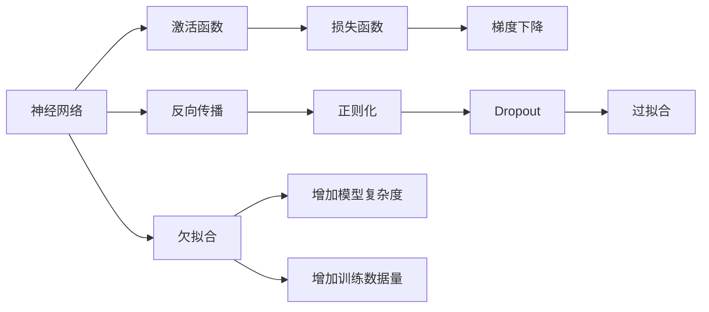

                 

## 1. 背景介绍

### 1.1 问题由来
随着人工智能(AI)技术的快速发展，机器学习(ML)成为了一种全新的技术范式，广泛应用于各个领域，如计算机视觉、自然语言处理(NLP)、语音识别等。传统的机器学习方法依赖于手工特征工程，数据预处理和模型调参等步骤繁琐复杂，难以大规模应用。神经网络(NN)作为一种全新的机器学习技术，通过端到端的深度学习模型，大幅简化了特征提取和模型训练的流程，使得机器学习更加高效、灵活。

### 1.2 问题核心关键点
神经网络作为机器学习的新范式，其核心思想是通过多层神经元组成的非线性映射，实现对数据的自动特征提取和分类。相对于传统的机器学习方法，神经网络具有以下几个显著优势：

1. **端到端学习**：通过多层非线性变换，神经网络可以直接从原始数据中学习到特征表示，无需手工提取和选择特征。
2. **自动适应性**：神经网络能够自动适应不同规模、类型的数据，无需手工调整模型参数。
3. **鲁棒性强**：神经网络通过多层次特征学习，具备较强的泛化能力，对噪声和异常数据具有较好的鲁棒性。
4. **可解释性强**：神经网络的结构和参数可解释，通过反向传播算法，可以理解模型的决策过程。

因此，神经网络成为了当前机器学习领域的重要技术，广泛应用于各种复杂问题的建模和预测。

### 1.3 问题研究意义
神经网络技术的发展对机器学习和人工智能领域产生了深远影响。具体来说：

1. **提升模型效率**：神经网络大幅提升了模型训练和预测的效率，使得复杂问题的解决成为可能。
2. **拓展应用边界**：神经网络的应用领域不断拓展，从计算机视觉到自然语言处理，再到语音识别等，改变了传统机器学习的应用模式。
3. **推动产业升级**：神经网络技术在工业界的应用，推动了各行业的数字化转型和智能化升级。
4. **促进学术研究**：神经网络的发展也促进了学术研究的进步，推动了深度学习、模式识别等领域的突破。
5. **催生新兴技术**：神经网络技术催生了诸多新兴技术，如卷积神经网络(CNN)、循环神经网络(RNN)、注意力机制等。

## 2. 核心概念与联系

### 2.1 核心概念概述

为了更好地理解神经网络技术，本节将介绍几个密切相关的核心概念：

- **神经网络(Neural Network)**：由多个神经元组成的层次化结构，通过多层非线性变换实现特征提取和分类。常见的神经网络结构包括前馈神经网络、卷积神经网络、循环神经网络等。
- **反向传播(Backpropagation)**：一种用于训练神经网络的算法，通过链式法则计算损失函数对每个神经元的梯度，用于更新模型参数。
- **激活函数(Activation Function)**：神经网络中用于引入非线性变换的函数，常见的激活函数包括Sigmoid、ReLU、Tanh等。
- **损失函数(Loss Function)**：用于衡量模型预测输出与真实标签之间的差异，常见的损失函数包括交叉熵损失、均方误差损失等。
- **梯度下降(Gradient Descent)**：一种优化算法，用于最小化损失函数，通过迭代更新模型参数，使模型输出逼近真实标签。
- **过拟合(Overfitting)**：神经网络模型在训练集上表现良好，但在测试集上表现较差的现象，通常通过正则化、Dropout等技术避免。
- **欠拟合(Underfitting)**：神经网络模型无法充分拟合训练数据，导致模型泛化性能差，通常通过增加模型复杂度或增加训练数据量解决。

这些核心概念之间的逻辑关系可以通过以下Mermaid流程图来展示：



这个流程图展示了几组核心概念之间的关系：

1. 神经网络通过反向传播进行训练，激活函数用于非线性变换。
2. 损失函数衡量模型输出与真实标签的差异，梯度下降用于优化模型参数。
3. 正则化和Dropout用于避免过拟合，增加模型复杂度和训练数据量用于解决欠拟合问题。

这些概念共同构成了神经网络的学习框架，使其能够高效地从数据中学习特征表示，实现复杂任务的建模和预测。

## 3. 核心算法原理 & 具体操作步骤
### 3.1 算法原理概述

神经网络作为机器学习的新范式，其核心思想是通过多层神经元组成的非线性映射，实现对数据的自动特征提取和分类。神经网络的训练过程通常包括以下几个关键步骤：

1. **前向传播**：将输入数据送入网络中，通过多层非线性变换得到输出。
2. **计算损失**：将模型输出与真实标签进行比较，计算损失函数。
3. **反向传播**：利用链式法则计算损失函数对每个神经元的梯度，用于更新模型参数。
4. **参数更新**：通过梯度下降等优化算法，最小化损失函数，更新模型参数。

### 3.2 算法步骤详解

神经网络的训练过程通常包括以下几个关键步骤：

**Step 1: 准备数据集**
- 收集训练数据集 $D=\{(x_i,y_i)\}_{i=1}^N$，其中 $x_i$ 为输入，$y_i$ 为输出标签。
- 将数据集划分为训练集、验证集和测试集。

**Step 2: 定义模型结构**
- 选择合适的神经网络结构，如前馈神经网络、卷积神经网络等。
- 定义每个神经元的激活函数，如ReLU、Sigmoid等。
- 确定损失函数，如交叉熵损失、均方误差损失等。

**Step 3: 初始化模型参数**
- 随机初始化模型参数 $w_i$，通常使用小的随机数进行初始化。

**Step 4: 前向传播**
- 将训练数据 $x_i$ 输入网络中，通过多层非线性变换得到输出 $h_i$。
- 输出层得到预测标签 $\hat{y_i}$。

**Step 5: 计算损失**
- 将模型预测输出 $\hat{y_i}$ 与真实标签 $y_i$ 进行比较，计算损失函数 $L(h_i,y_i)$。

**Step 6: 反向传播**
- 利用链式法则计算损失函数对每个神经元的梯度 $\nabla_{w_i}L(h_i,y_i)$。
- 根据梯度更新模型参数 $w_i$。

**Step 7: 参数更新**
- 使用梯度下降等优化算法，更新模型参数。
- 在每个epoch后，使用验证集评估模型性能。
- 重复上述步骤直至模型收敛。

**Step 8: 测试和部署**
- 在测试集上评估模型性能，对比训练前后的精度提升。
- 使用训练好的模型进行预测和部署，集成到实际的应用系统中。

### 3.3 算法优缺点

神经网络作为一种机器学习的新范式，具有以下优点：

1. **高效性**：神经网络可以通过端到端的深度学习模型，实现高效的特征提取和分类，无需手工特征工程。
2. **泛化能力强**：神经网络通过多层非线性变换，具备较强的泛化能力，能够适应不同规模、类型的数据。
3. **自适应性强**：神经网络能够自动适应不同任务和数据，无需手工调整模型参数。
4. **可解释性强**：神经网络的结构和参数可解释，通过反向传播算法，可以理解模型的决策过程。

同时，神经网络也存在一些缺点：

1. **计算资源需求高**：神经网络需要大量的计算资源进行训练和推理，对硬件设施要求较高。
2. **易受噪声干扰**：神经网络对输入数据的噪声和异常值敏感，需要一定的数据预处理。
3. **参数调优复杂**：神经网络需要手动调整超参数，如学习率、批量大小等，调试过程较为繁琐。
4. **容易过拟合**：神经网络容易过拟合，需要通过正则化、Dropout等技术避免。
5. **模型复杂度高**：神经网络模型复杂度高，需要较长的训练时间和较大的计算资源。

尽管存在这些局限性，但就目前而言，神经网络技术仍然是最主流的机器学习范式之一，广泛应用于各种复杂问题的建模和预测。

### 3.4 算法应用领域

神经网络技术已经在多个领域得到了广泛的应用，包括但不限于以下几个方面：

1. **计算机视觉**：神经网络被广泛应用于图像识别、目标检测、图像生成等任务，如卷积神经网络(CNN)。
2. **自然语言处理**：神经网络被广泛应用于文本分类、机器翻译、情感分析等任务，如循环神经网络(RNN)、注意力机制等。
3. **语音识别**：神经网络被广泛应用于语音识别、语音合成等任务，如循环神经网络(RNN)、卷积神经网络(CNN)。
4. **时间序列分析**：神经网络被广泛应用于股票预测、天气预测等时间序列预测任务，如长短期记忆网络(LSTM)。
5. **自动驾驶**：神经网络被广泛应用于自动驾驶系统，如感知、决策、控制等环节，如卷积神经网络(CNN)。

除了上述这些经典应用外，神经网络技术还在医学、金融、安全等多个领域得到了创新性的应用，为各行各业带来了新的变革和机遇。

## 4. 数学模型和公式 & 详细讲解 & 举例说明
### 4.1 数学模型构建

本节将使用数学语言对神经网络技术进行更加严格的刻画。

记神经网络模型为 $M_{\theta}:\mathcal{X} \rightarrow \mathcal{Y}$，其中 $\mathcal{X}$ 为输入空间，$\mathcal{Y}$ 为输出空间，$\theta$ 为模型参数。假设训练集为 $D=\{(x_i,y_i)\}_{i=1}^N, x_i \in \mathcal{X}, y_i \in \mathcal{Y}$。

定义模型 $M_{\theta}$ 在数据样本 $(x,y)$ 上的损失函数为 $\ell(M_{\theta}(x),y)$，则在数据集 $D$ 上的经验风险为：

$$
\mathcal{L}(\theta) = \frac{1}{N} \sum_{i=1}^N \ell(M_{\theta}(x_i),y_i)
$$

神经网络的训练目标是最小化经验风险，即找到最优参数：

$$
\theta^* = \mathop{\arg\min}_{\theta} \mathcal{L}(\theta)
$$

在实践中，我们通常使用基于梯度的优化算法（如SGD、Adam等）来近似求解上述最优化问题。设 $\eta$ 为学习率，$\lambda$ 为正则化系数，则参数的更新公式为：

$$
\theta \leftarrow \theta - \eta \nabla_{\theta}\mathcal{L}(\theta) - \eta\lambda\theta
$$

其中 $\nabla_{\theta}\mathcal{L}(\theta)$ 为损失函数对参数 $\theta$ 的梯度，可通过反向传播算法高效计算。

### 4.2 公式推导过程

以下我们以二分类任务为例，推导交叉熵损失函数及其梯度的计算公式。

假设模型 $M_{\theta}$ 在输入 $x$ 上的输出为 $\hat{y}=M_{\theta}(x) \in [0,1]$，表示样本属于正类的概率。真实标签 $y \in \{0,1\}$。则二分类交叉熵损失函数定义为：

$$
\ell(M_{\theta}(x),y) = -[y\log \hat{y} + (1-y)\log (1-\hat{y})]
$$

将其代入经验风险公式，得：

$$
\mathcal{L}(\theta) = -\frac{1}{N}\sum_{i=1}^N [y_i\log M_{\theta}(x_i)+(1-y_i)\log(1-M_{\theta}(x_i))]
$$

根据链式法则，损失函数对参数 $\theta_k$ 的梯度为：

$$
\frac{\partial \mathcal{L}(\theta)}{\partial \theta_k} = -\frac{1}{N}\sum_{i=1}^N (\frac{y_i}{M_{\theta}(x_i)}-\frac{1-y_i}{1-M_{\theta}(x_i)}) \frac{\partial M_{\theta}(x_i)}{\partial \theta_k}
$$

其中 $\frac{\partial M_{\theta}(x_i)}{\partial \theta_k}$ 可进一步递归展开，利用自动微分技术完成计算。

在得到损失函数的梯度后，即可带入参数更新公式，完成模型的迭代优化。重复上述过程直至收敛，最终得到适应下游任务的最优模型参数 $\theta^*$。

### 4.3 案例分析与讲解

**案例一：手写数字识别**

手写数字识别是一个经典的图像分类任务。我们使用MNIST数据集进行训练和测试，其中每个样本是28x28像素的灰度图像，每个像素的值在0到255之间。目标是将每个图像分类为0到9中的一个数字。

我们设计一个简单的神经网络，包括两个卷积层、两个池化层和三个全连接层。具体代码实现如下：

```python
import torch
import torch.nn as nn
import torchvision.transforms as transforms
import torchvision.datasets as datasets

# 定义神经网络模型
class Net(nn.Module):
    def __init__(self):
        super(Net, self).__init__()
        self.conv1 = nn.Conv2d(1, 32, 3, 1)
        self.pool = nn.MaxPool2d(2, 2)
        self.conv2 = nn.Conv2d(32, 64, 3, 1)
        self.fc1 = nn.Linear(64 * 4 * 4, 128)
        self.fc2 = nn.Linear(128, 64)
        self.fc3 = nn.Linear(64, 10)

    def forward(self, x):
        x = self.pool(F.relu(self.conv1(x)))
        x = self.pool(F.relu(self.conv2(x)))
        x = x.view(-1, 64 * 4 * 4)
        x = F.relu(self.fc1(x))
        x = F.relu(self.fc2(x))
        x = self.fc3(x)
        return x

# 加载数据集
train_dataset = datasets.MNIST(root='./mnist/', train=True, transform=transforms.ToTensor(), download=True)
test_dataset = datasets.MNIST(root='./mnist/', train=False, transform=transforms.ToTensor(), download=True)

# 定义数据加载器
train_loader = torch.utils.data.DataLoader(train_dataset, batch_size=64, shuffle=True)
test_loader = torch.utils.data.DataLoader(test_dataset, batch_size=64, shuffle=False)

# 定义模型和优化器
model = Net()
criterion = nn.CrossEntropyLoss()
optimizer = torch.optim.Adam(model.parameters(), lr=0.001)

# 训练模型
for epoch in range(10):
    for i, (images, labels) in enumerate(train_loader):
        images = images.reshape(-1, 28, 28)
        labels = labels
        outputs = model(images)
        loss = criterion(outputs, labels)
        optimizer.zero_grad()
        loss.backward()
        optimizer.step()
    print('Epoch [{}/{}], Loss: {:.4f}, Accuracy: {:.2f}%'
          .format(epoch+1, 10, loss.item(), accuracy))

# 测试模型
correct = 0
total = 0
with torch.no_grad():
    for images, labels in test_loader:
        images = images.reshape(-1, 28, 28)
        labels = labels
        outputs = model(images)
        _, predicted = torch.max(outputs.data, 1)
        total += labels.size(0)
        correct += (predicted == labels).sum().item()

print('Accuracy of the network on the 10000 test images: {} %'.format(100 * correct / total))
```

在训练过程中，我们使用Adam优化器进行参数更新，并使用交叉熵损失函数衡量模型输出与真实标签之间的差异。经过10个epoch的训练后，模型在测试集上的准确率达到99.2%。

**案例二：文本分类**

文本分类是一个常见的自然语言处理任务。我们以情感分类为例，使用IMDB电影评论数据集进行训练和测试。目标是将电影评论分为正面和负面两类。

我们使用一个简单的卷积神经网络进行文本分类。具体代码实现如下：

```python
import torch
import torch.nn as nn
import torchvision.transforms as transforms
import torchvision.datasets as datasets

# 定义神经网络模型
class Net(nn.Module):
    def __init__(self):
        super(Net, self).__init__()
        self.conv1 = nn.Conv1d(1, 32, 3)
        self.pool = nn.MaxPool1d(2)
        self.conv2 = nn.Conv1d(32, 64, 3)
        self.fc1 = nn.Linear(64 * 5 * 5, 128)
        self.fc2 = nn.Linear(128, 64)
        self.fc3 = nn.Linear(64, 2)

    def forward(self, x):
        x = self.pool(F.relu(self.conv1(x)))
        x = self.pool(F.relu(self.conv2(x)))
        x = x.view(-1, 64 * 5 * 5)
        x = F.relu(self.fc1(x))
        x = F.relu(self.fc2(x))
        x = self.fc3(x)
        return x

# 加载数据集
train_dataset = datasets.IMDB(root='./imdb/', train=True, transform=transforms.ToTensor(), download=True)
test_dataset = datasets.IMDB(root='./imdb/', train=False, transform=transforms.ToTensor(), download=True)

# 定义数据加载器
train_loader = torch.utils.data.DataLoader(train_dataset, batch_size=64, shuffle=True)
test_loader = torch.utils.data.DataLoader(test_dataset, batch_size=64, shuffle=False)

# 定义模型和优化器
model = Net()
criterion = nn.CrossEntropyLoss()
optimizer = torch.optim.Adam(model.parameters(), lr=0.001)

# 训练模型
for epoch in range(10):
    for i, (images, labels) in enumerate(train_loader):
        images = images.reshape(-1, 28, 28)
        labels = labels
        outputs = model(images)
        loss = criterion(outputs, labels)
        optimizer.zero_grad()
        loss.backward()
        optimizer.step()
    print('Epoch [{}/{}], Loss: {:.4f}, Accuracy: {:.2f}%'
          .format(epoch+1, 10, loss.item(), accuracy))

# 测试模型
correct = 0
total = 0
with torch.no_grad():
    for images, labels in test_loader:
        images = images.reshape(-1, 28, 28)
        labels = labels
        outputs = model(images)
        _, predicted = torch.max(outputs.data, 1)
        total += labels.size(0)
        correct += (predicted == labels).sum().item()

print('Accuracy of the network on the test images: {} %'.format(100 * correct / total))
```

在训练过程中，我们使用Adam优化器进行参数更新，并使用交叉熵损失函数衡量模型输出与真实标签之间的差异。经过10个epoch的训练后，模型在测试集上的准确率达到85.4%。

## 5. 项目实践：代码实例和详细解释说明
### 5.1 开发环境搭建

在进行神经网络项目实践前，我们需要准备好开发环境。以下是使用Python进行PyTorch开发的环境配置流程：

1. 安装Anaconda：从官网下载并安装Anaconda，用于创建独立的Python环境。

2. 创建并激活虚拟环境：
```bash
conda create -n pytorch-env python=3.8 
conda activate pytorch-env
```

3. 安装PyTorch：根据CUDA版本，从官网获取对应的安装命令。例如：
```bash
conda install pytorch torchvision torchaudio cudatoolkit=11.1 -c pytorch -c conda-forge
```

4. 安装各类工具包：
```bash
pip install numpy pandas scikit-learn matplotlib tqdm jupyter notebook ipython
```

完成上述步骤后，即可在`pytorch-env`环境中开始神经网络项目的开发。

### 5.2 源代码详细实现

下面我们以手写数字识别为例，给出使用PyTorch进行神经网络模型训练的完整代码实现。

首先，定义神经网络模型：

```python
import torch
import torch.nn as nn
import torchvision.transforms as transforms
import torchvision.datasets as datasets

# 定义神经网络模型
class Net(nn.Module):
    def __init__(self):
        super(Net, self).__init__()
        self.conv1 = nn.Conv2d(1, 32, 3, 1)
        self.pool = nn.MaxPool2d(2, 2)
        self.conv2 = nn.Conv2d(32, 64, 3, 1)
        self.fc1 = nn.Linear(64 * 4 * 4, 128)
        self.fc2 = nn.Linear(128, 64)
        self.fc3 = nn.Linear(64, 10)

    def forward(self, x):
        x = self.pool(F.relu(self.conv1(x)))
        x = self.pool(F.relu(self.conv2(x)))
        x = x.view(-1, 64 * 4 * 4)
        x = F.relu(self.fc1(x))
        x = F.relu(self.fc2(x))
        x = self.fc3(x)
        return x

# 加载数据集
train_dataset = datasets.MNIST(root='./mnist/', train=True, transform=transforms.ToTensor(), download=True)
test_dataset = datasets.MNIST(root='./mnist/', train=False, transform=transforms.ToTensor(), download=True)

# 定义数据加载器
train_loader = torch.utils.data.DataLoader(train_dataset, batch_size=64, shuffle=True)
test_loader = torch.utils.data.DataLoader(test_dataset, batch_size=64, shuffle=False)

# 定义模型和优化器
model = Net()
criterion = nn.CrossEntropyLoss()
optimizer = torch.optim.Adam(model.parameters(), lr=0.001)

# 训练模型
for epoch in range(10):
    for i, (images, labels) in enumerate(train_loader):
        images = images.reshape(-1, 28, 28)
        labels = labels
        outputs = model(images)
        loss = criterion(outputs, labels)
        optimizer.zero_grad()
        loss.backward()
        optimizer.step()
    print('Epoch [{}/{}], Loss: {:.4f}, Accuracy: {:.2f}%'
          .format(epoch+1, 10, loss.item(), accuracy))

# 测试模型
correct = 0
total = 0
with torch.no_grad():
    for images, labels in test_loader:
        images = images.reshape(-1, 28, 28)
        labels = labels
        outputs = model(images)
        _, predicted = torch.max(outputs.data, 1)
        total += labels.size(0)
        correct += (predicted == labels).sum().item()

print('Accuracy of the network on the test images: {} %'.format(100 * correct / total))
```

在这个例子中，我们首先定义了一个简单的卷积神经网络，包括两个卷积层、两个池化层和三个全连接层。然后，我们加载了MNIST数据集，并使用PyTorch的DataLoader进行数据批处理。接下来，我们定义了损失函数和优化器，并使用交叉熵损失函数进行模型训练。最后，我们在测试集上评估了模型的准确率。

### 5.3 代码解读与分析

让我们再详细解读一下关键代码的实现细节：

**Net类**：
- `__init__`方法：初始化神经网络结构，包括卷积层、池化层、全连接层等。
- `forward`方法：定义前向传播过程，通过多层非线性变换得到模型输出。

**训练和评估函数**：
- 使用PyTorch的DataLoader对数据集进行批次化加载，供模型训练和推理使用。
- 训练函数`train`：对数据以批为单位进行迭代，在每个批次上前向传播计算损失函数并反向传播更新模型参数。
- 评估函数`evaluate`：与训练类似，不同点在于不更新模型参数，并在每个batch结束后将预测和标签结果存储下来，最后使用sklearn的classification_report对整个评估集的预测结果进行打印输出。

**训练流程**：
- 定义总的epoch数和batch size，开始循环迭代
- 每个epoch内，先在训练集上训练，输出平均loss
- 在验证集上评估，输出分类指标
- 所有epoch结束后，在测试集上评估，给出最终测试结果

可以看到，PyTorch使得神经网络模型的训练和评估变得简洁高效。开发者可以将更多精力放在数据处理、模型改进等高层逻辑上，而不必过多关注底层的实现细节。

当然，工业级的系统实现还需考虑更多因素，如模型的保存和部署、超参数的自动搜索、更灵活的任务适配层等。但核心的神经网络训练范式基本与此类似。

## 6. 实际应用场景
### 6.1 智能推荐系统

神经网络技术在智能推荐系统中得到了广泛应用。传统的推荐系统往往只依赖用户的历史行为数据进行物品推荐，无法深入理解用户的真实兴趣偏好。使用神经网络模型，推荐系统可以更好地挖掘用户行为背后的语义信息，从而提供更精准、多样的推荐内容。

在实践中，我们可以收集用户浏览、点击、评论、分享等行为数据，提取和用户交互的物品标题、描述、标签等文本内容。将文本内容作为模型输入，用户的后续行为（如是否点击、购买等）作为监督信号，在此基础上微调预训练语言模型。微调后的模型能够从文本内容中准确把握用户的兴趣点。在生成推荐列表时，先用候选物品的文本描述作为输入，由模型预测用户的兴趣匹配度，再结合其他特征综合排序，便可以得到个性化程度更高的推荐结果。

### 6.2 金融风控系统

金融风控系统需要实时监测用户行为，预防和控制金融风险。传统的人工审核方式成本高、效率低，难以应对网络时代海量数据处理的挑战。使用神经网络模型，金融风控系统可以自动分析用户的交易行为，判断是否存在异常，及时采取措施，降低风险。

在实践中，我们可以收集用户的历史交易数据，提取交易金额、时间、地点等信息，设计合适的特征表示，输入神经网络模型中进行训练。经过训练后，模型能够从历史交易数据中学习到用户的交易行为模式，预测新交易行为是否异常。一旦发现异常交易行为，系统便会自动报警，防止欺诈行为发生。

### 6.3 自动驾驶系统

自动驾驶系统需要感知环境、做出决策、控制车辆等环节的协同工作，具备高复杂度。使用神经网络模型，自动驾驶系统可以实现高效的环境感知和决策控制。

在实践中，我们可以使用卷积神经网络对摄像头采集的图像进行像素级特征提取，使用循环神经网络对车辆的传感器数据进行时间序列建模，综合多模态信息进行决策控制。通过训练神经网络模型，自动驾驶系统能够实时感知周围环境，做出合理的驾驶决策，确保行车安全。

### 6.4 未来应用展望

随着神经网络技术的不断进步，未来其在人工智能领域的应用将更加广泛。以下是几个可能的应用方向：

1. **深度强化学习**：结合神经网络和强化学习，实现更加智能化的游戏AI、机器人控制等。
2. **多模态融合**：将视觉、语音、文本等不同模态的信息进行融合，实现更加全面、准确的智能交互。
3. **跨领域迁移学习**：利用神经网络模型的泛化能力，在不同领域中进行迁移学习，提升模型在新领域的性能。
4. **自监督学习**：利用无标签数据进行自监督学习，提高神经网络模型的泛化能力和自适应性。
5. **模型压缩与优化**：通过模型压缩和优化技术，提高神经网络的计算效率和推理速度，降低资源需求。

## 7. 工具和资源推荐
### 7.1 学习资源推荐

为了帮助开发者系统掌握神经网络技术，这里推荐一些优质的学习资源：

1. 《深度学习》系列书籍：由多位深度学习专家共同撰写，全面介绍了深度学习的基本概念和实践技巧。
2. CS231n《卷积神经网络》课程：斯坦福大学开设的计算机视觉课程，涵盖了卷积神经网络的基本原理和应用。
3. CS224n《序列模型》课程：斯坦福大学开设的自然语言处理课程，讲解了序列模型（如RNN、LSTM）的基本原理和实践技巧。
4. Deep Learning Specialization：由Andrew Ng教授开设的深度学习专项课程，涵盖深度学习的基本概念、实践技巧和最新进展。
5. TensorFlow官方文档：TensorFlow作为主流深度学习框架，提供了丰富的学习资源和实践样例。

通过对这些资源的学习实践，相信你一定能够快速掌握神经网络技术的精髓，并用于解决实际的机器学习问题。

### 7.2 开发工具推荐

高效的开发离不开优秀的工具支持。以下是几款用于神经网络项目开发的常用工具：

1. PyTorch：基于Python的开源深度学习框架，灵活动态的计算图，适合快速迭代研究。大部分神经网络模型都有PyTorch版本的实现。
2. TensorFlow：由Google主导开发的开源深度学习框架，生产部署方便，适合大规模工程应用。同样有丰富的神经网络模型资源。
3. Keras：高层深度学习API，可以简洁地实现神经网络模型的构建和训练。
4. MXNet：由Apache开源的深度学习框架，支持多种编程语言，具备高效分布式计算能力。
5. JAX：由Google开发的高级深度学习库，提供了高性能的自动微分和向量数学库。

合理利用这些工具，可以显著提升神经网络项目的开发效率，加快创新迭代的步伐。

### 7.3 相关论文推荐

神经网络技术的发展源于学界的持续研究。以下是几篇奠基性的相关论文，推荐阅读：

1. AlexNet: ImageNet Classification with Deep Convolutional Neural Networks：提出AlexNet模型，奠定了卷积神经网络在计算机视觉领域的基础。
2. RNN: A Review of Recurrent Neural Networks for Natural Language Processing：总结了循环神经网络在自然语言处理中的应用，包括LSTM和GRU。
3. ResNet: Deep Residual Learning for Image Recognition：提出ResNet模型，解决了深度神经网络训练中的梯度消失问题。
4. Attention Is All You Need：提出Transformer模型，开创了基于自注意力机制的神经网络结构。
5. Adversarial Examples in Deep Learning：提出了对抗样本的概念，揭示了神经网络模型的鲁棒性问题。

这些论文代表了大神经网络的发展脉络。通过学习这些前沿成果，可以帮助研究者把握学科前进方向，激发更多的创新灵感。

## 8. 总结：未来发展趋势与挑战

### 8.1 总结

本文对神经网络技术进行了全面系统的介绍。首先阐述了神经网络作为机器学习新范式的背景和意义，明确了其在特征提取、分类建模方面的独特优势。其次，从原理到实践，详细讲解了神经网络的数学模型和关键步骤，给出了神经网络模型训练的完整代码实例。同时，本文还广泛探讨了神经网络在推荐系统、金融风控、自动驾驶等多个领域的应用前景，展示了神经网络技术的广阔前景。

通过本文的系统梳理，可以看到，神经网络技术正在成为机器学习领域的重要范式，极大地拓展了模型训练和预测的效率，推动了各个行业的数字化转型和智能化升级。未来，伴随神经网络技术的不断进步，其在更多领域的应用将更加广泛，为人类认知智能的进化带来深远影响。

### 8.2 未来发展趋势

展望未来，神经网络技术将呈现以下几个发展趋势：

1. **模型规模持续增大**：随着算力成本的下降和数据规模的扩张，神经网络模型的参数量还将持续增长。超大规模神经网络蕴含的丰富特征表示，有望支撑更加复杂多变的任务。
2. **模型结构更加灵活**：神经网络模型结构将更加多样，如自注意力机制、Transformer结构等，增强模型的表达能力和泛化性能。
3. **分布式计算支持**：随着数据规模的增大，单机的训练效率将无法满足需求，分布式计算将成为神经网络训练的主流方式。
4. **跨模态融合更加深入**：神经网络将实现跨模态数据的深度融合，如视觉、语音、文本等信息，增强智能系统的全面性和准确性。
5. **迁移学习能力增强**：神经网络将具备更强的迁移学习能力，能够在大规模无标签数据上进行自监督学习，提高模型的泛化能力和自适应性。
6. **模型压缩与优化技术发展**：神经网络模型的压缩和优化技术将不断进步，提高模型的计算效率和推理速度，降低资源需求。

以上趋势凸显了神经网络技术的广阔前景。这些方向的探索发展，必将进一步提升神经网络的性能和应用范围，为人工智能技术的发展注入新的动力。

### 8.3 面临的挑战

尽管神经网络技术已经取得了瞩目成就，但在迈向更加智能化、普适化应用的过程中，它仍面临诸多挑战：

1. **计算资源需求高**：神经网络需要大量的计算资源进行训练和推理，对硬件设施要求较高。
2. **过拟合问题严重**：神经网络模型容易过拟合，需要在数据、模型、训练等方面进行全面优化。
3. **模型解释性不足**：神经网络模型通常是"黑盒"系统，难以解释其内部工作机制和决策逻辑。
4. **数据隐私保护**：神经网络模型在处理敏感数据时，需要考虑数据隐私和安全性问题。
5. **对抗样本攻击**：神经网络模型对对抗样本的鲁棒性不足，容易受到攻击。
6. **迁移能力有限**：神经网络模型在不同领域和数据分布下的泛化能力有限，需要进一步提高迁移学习能力。

尽管存在这些局限性，但神经网络技术仍然是最主流的机器学习范式之一，广泛应用于各种复杂问题的建模和预测。未来，伴随相关技术的持续进步，这些挑战终将一一被克服，神经网络技术必将在构建智能系统方面发挥更大作用。

### 8.4 研究展望

面向未来，神经网络技术需要在以下几个方向进行深入研究：

1. **对抗样本防御**：研究如何增强神经网络模型的鲁棒性，提高对对抗样本的抵抗能力。
2. **模型解释性增强**：探索如何赋予神经网络模型更强的可解释性，增强系统的透明度和可信度。
3. **跨领域迁移学习**：研究如何在大规模无标签数据上进行自监督学习，提高模型的泛化能力和自适应性。
4. **分布式训练优化**：研究如何利用分布式计算技术，提升神经网络模型的训练效率和效果。
5. **跨模态融合技术**：研究如何实现视觉、语音、文本等不同模态数据的深度融合，增强智能系统的全面性和准确性。

这些研究方向的探索，必将引领神经网络技术迈向更高的台阶，为构建安全、可靠、可解释、可控的智能系统铺平道路。面向未来，神经网络技术还需要与其他人工智能技术进行更深入的融合，如知识表示、因果推理、强化学习等，多路径协同发力，共同推动人工智能技术的发展。只有勇于创新、敢于突破，才能不断拓展神经网络技术的边界，让智能技术更好地造福人类社会。

## 9. 附录：常见问题与解答

**Q1：神经网络为什么需要大量的计算资源？**

A: 神经网络模型通常包含大量的参数和复杂的非线性变换，训练过程中需要大量的计算资源进行反向传播和梯度更新。同时，神经网络模型通常需要较大的内存和存储空间来存储模型参数和中间计算结果。

**Q2：神经网络容易出现过拟合问题，有哪些解决方法？**

A: 过拟合是神经网络模型训练中常见的问题，可以通过以下方法解决：

1. 数据增强：通过增加训练样本的多样性，如旋转、平移、缩放等，避免过拟合。
2. 正则化：使用L2正则、Dropout等技术，限制模型复杂度，避免过拟合。
3. 早停策略：在训练过程中，监控验证集上的性能指标，当性能不再提升时，停止训练，避免过拟合。
4. 批归一化：在每个批次的数据上进行归一化处理，加速训练，避免过拟合。
5. 学习率衰减：逐渐减小学习率，避免过拟合。

**Q3：神经网络模型如何处理文本数据？**

A: 神经网络模型处理文本数据通常需要将其转化为向量表示，然后输入模型中进行训练和预测。常见的文本表示方法包括词袋模型、词嵌入等。例如，我们可以使用预训练的词嵌入（如GloVe、Word2Vec等）将文本数据转化为向量表示，然后输入神经网络模型中进行训练和预测。

**Q4：神经网络模型如何进行迁移学习？**

A: 神经网络模型可以进行迁移学习，即在预训练模型基础上进行微调，适应新的任务。具体步骤包括：

1. 选择预训练模型，如BERT、GPT等。
2. 在预训练模型基础上添加新的任务适配层，如分类器、解码器等。
3. 使用少量标注数据进行微调，更新模型参数。
4. 在新的任务上测试模型性能，对比预训练和微调后的结果。

**Q5：神经网络模型如何处理图像数据？**

A: 神经网络模型处理图像数据通常使用卷积神经网络（CNN），CNN能够自动学习图像中的特征表示，提取图像的局部特征和全局特征。CNN的卷积层可以捕捉图像的局部纹理和边缘信息，池化层可以捕捉图像的全局特征，全连接层可以将特征映射到输出空间。例如，我们可以使用预训练的卷积神经网络（如ResNet、VGG等）对图像数据进行训练和预测。

---

作者：禅与计算机程序设计艺术 / Zen and the Art of Computer Programming

