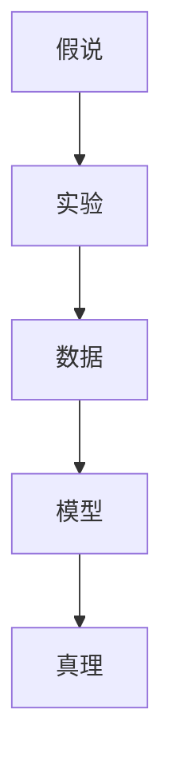

                 

## 1. 背景介绍

### 1.1 问题由来
科学探究，是认识世界、理解自然规律的基本途径。从古代的炼金术士，到中世纪的哲学家，再到现代的科学家，无数人通过不懈的努力，揭示出宇宙的奥秘，推动了社会的进步。然而，科学的探究并非一帆风顺，每一个看似简单的理论背后，都伴随着无数的假设、实验、验证与修正。本文将深入探讨科学探究的基本原理，分析从假说到真理的逻辑过程，揭示科学探究的深层机制。

### 1.2 问题核心关键点
科学探究的核心在于构建假说（Hypothesis），通过实验（Experiment）和数据（Data）进行验证，不断修正假说，最终形成科学真理（Truth）。这一过程可以分为以下几个关键步骤：
- **假说构建**：基于现有知识，提出可能解释现象的假设。
- **实验设计**：设计实验，收集数据，以检验假设的正确性。
- **数据分析**：分析实验结果，判断假设的合理性，提出修正。
- **迭代验证**：多次实验，反复修正假设，形成科学理论。

这一系列步骤，构成了科学探究的核心框架，也是现代科学研究不可或缺的一部分。本文将系统阐述这一过程，分析其中涉及的数学模型、统计方法、数据分析等技术细节。

## 2. 核心概念与联系

### 2.1 核心概念概述

为更好地理解科学探究的过程，本节将介绍几个关键概念：

- **假说（Hypothesis）**：基于已有知识，提出对未知现象的解释假设。假说是科学探究的起点。
- **实验（Experiment）**：设计实验，模拟真实世界的现象，收集数据。实验是检验假说的主要手段。
- **数据（Data）**：通过实验得到的具体数值或记录。数据是科学探究的核心依据。
- **模型（Model）**：用于描述和预测现象的数学或物理模型。模型是科学探究的桥梁。
- **真理（Truth）**：经过多次实验验证，正确解释现象的理论。真理是科学探究的目标。

这些概念之间的关系可以通过以下Mermaid流程图来展示：



这个流程图展示了假说、实验、数据、模型和真理之间的逻辑联系：

1. 假说通过实验得到数据，数据用于构建模型。
2. 模型对数据进行解释和预测。
3. 通过多次实验验证模型的正确性，形成真理。

## 3. 核心算法原理 & 具体操作步骤
### 3.1 算法原理概述

科学探究的算法原理，本质上是通过数学模型和统计方法，将数据转化为可解释的理论。这一过程可以分为以下几个关键步骤：

1. **数据收集**：通过实验得到数据集，数据集包括观测值和误差值。
2. **数据预处理**：对数据进行清洗、归一化、去噪声等处理，确保数据的准确性和一致性。
3. **模型构建**：选择适当的数学模型，如线性回归、逻辑回归、神经网络等，构建模型。
4. **模型训练**：使用训练数据对模型进行训练，调整模型参数，使其能够较好地拟合数据。
5. **模型验证**：使用验证数据对模型进行验证，评估模型的泛化能力。
6. **模型应用**：使用训练好的模型进行预测，解释未知现象。

这一过程可以通过以下公式简要表示：

$$
y_i = f(x_i; \theta) + \epsilon_i
$$

其中 $y_i$ 为观测值，$f(x_i; \theta)$ 为模型函数，$\theta$ 为模型参数，$\epsilon_i$ 为误差项。通过对大量观测数据的训练，可以得到合适的模型参数 $\theta$，进而预测未知数据的 $y_i$。

### 3.2 算法步骤详解

以下是科学探究中常见的算法步骤详解：

**Step 1: 数据收集与预处理**
- 选择合适的实验设计，进行数据收集。数据可以来自实验室、田间试验、现场调查等。
- 对数据进行清洗、去噪、归一化等预处理操作，确保数据质量。
- 分割数据集为训练集、验证集和测试集，划分比例一般为70%训练、15%验证、15%测试。

**Step 2: 模型选择与构建**
- 根据数据类型和问题特点，选择合适的模型，如线性回归、逻辑回归、神经网络、决策树等。
- 使用训练数据对模型进行训练，调整模型参数，使其能够较好地拟合训练数据。
- 在验证集上评估模型性能，选择性能较好的模型。

**Step 3: 模型验证与调优**
- 使用测试集对模型进行最终验证，评估模型泛化能力。
- 根据测试集结果，调整模型参数或选择不同的模型，进一步优化模型性能。

**Step 4: 模型应用与解释**
- 使用训练好的模型进行预测，解释未知现象。
- 对预测结果进行统计分析，解释模型预测的合理性。

### 3.3 算法优缺点

科学探究的算法具有以下优点：
- **系统性**：通过实验和数据驱动，保证探究过程的逻辑性和系统性。
- **可重复性**：任何科学探究都可以通过相同方法再次进行，提高结果的可靠性。
- **普适性**：科学探究方法适用于各类科学问题，广泛应用于物理、化学、生物等领域。

然而，这一过程也存在一定的局限性：
- **时间成本**：实验和数据收集需要大量时间，耗费人力物力。
- **数据局限**：数据的质量和数量直接影响探究结果的准确性。
- **主观偏差**：实验设计和数据分析过程中，不可避免地存在主观偏差。

尽管存在这些局限，但就目前而言，科学探究的算法仍是最主流的研究方法。未来相关研究的重点在于如何进一步提高探究效率，降低数据成本，消除主观偏差，提高结果的可靠性。

### 3.4 算法应用领域

科学探究的方法已经在各个学科领域得到了广泛应用，例如：

- **物理学**：通过实验和观测数据，验证物理理论的正确性。如牛顿运动定律、相对论等。
- **化学**：通过化学实验和化学反应数据，研究化学反应机理和物质性质。如化学反应动力学、物质结构等。
- **生物学**：通过生物实验和生物数据，研究生物现象和生命机制。如细胞分裂、基因表达等。
- **医学**：通过临床实验和医疗数据，验证医学理论和治疗方案的有效性。如药物疗效、疾病诊断等。
- **工程学**：通过实验和材料数据，优化工程设计和工艺流程。如材料力学、机械设计等。

除了这些经典领域，科学探究的方法也在诸多新兴领域得到应用，如数据科学、人工智能、社会科学等，为这些领域的研究提供了新的工具和方法。

## 4. 数学模型和公式 & 详细讲解 & 举例说明

### 4.1 数学模型构建

在科学探究中，数学模型是描述和预测现象的重要工具。本节将详细介绍几个常见的数学模型及其构建方法。

#### 4.1.1 线性回归模型
线性回归模型是描述变量之间线性关系的数学模型。其数学形式为：

$$
y = a + bx + \epsilon
$$

其中 $y$ 为因变量，$x$ 为自变量，$a$ 为截距，$b$ 为斜率，$\epsilon$ 为误差项。通过对数据进行最小二乘法拟合，可以得到最优的参数 $a$ 和 $b$。

#### 4.1.2 逻辑回归模型
逻辑回归模型用于解决分类问题，其数学形式为：

$$
P(y=1|x) = \frac{1}{1+e^{-a-bx}} = \frac{e^{-a-bx}}{1+e^{-a-bx}}
$$

其中 $y$ 为二分类变量，$x$ 为自变量，$a$ 和 $b$ 为模型参数。通过对数据进行最大似然估计，可以得到最优的参数 $a$ 和 $b$。

### 4.2 公式推导过程

以线性回归模型为例，推导最小二乘法求解最优参数的过程：

设数据集为 $(x_i, y_i)$，$i=1,2,...,n$，模型的目标函数为：

$$
\min_{a,b} \sum_{i=1}^n (y_i - a - bx_i)^2
$$

通过求偏导数，可以得到：

$$
\frac{\partial}{\partial a} \sum_{i=1}^n (y_i - a - bx_i)^2 = 0
$$

$$
\frac{\partial}{\partial b} \sum_{i=1}^n (y_i - a - bx_i)^2 = 0
$$

求解上述方程组，可以得到：

$$
a = \bar{y} - b\bar{x}
$$

$$
b = \frac{\sum_{i=1}^n (x_i - \bar{x})(y_i - \bar{y})}{\sum_{i=1}^n (x_i - \bar{x})^2}
$$

其中 $\bar{x}$ 和 $\bar{y}$ 为样本均值。

### 4.3 案例分析与讲解

以实际案例为切入点，详细讲解线性回归模型的应用：

假设某厂家生产了100件产品，记录了每个产品的重量 $x$ 和价格 $y$，部分数据如表1所示：

| 重量（kg） | 价格（元） |
|-----------|-----------|
| 0.5       | 100       |
| 0.6       | 120       |
| 0.7       | 130       |
| ...       | ...       |
| 1.1       | 220       |

表1 产品数据

通过线性回归模型，可以建立重量 $x$ 和价格 $y$ 之间的关系。以代码形式给出线性回归模型的实现：

```python
from sklearn.linear_model import LinearRegression

# 构建线性回归模型
model = LinearRegression()
model.fit(X, y)

# 预测新产品的价格
X_new = [[1.2]]
y_pred = model.predict(X_new)
```

其中，`X` 为自变量，`y` 为因变量，`X_new` 为待预测的自变量。

通过上述代码，可以得到新产品的预测价格。线性回归模型在实际应用中，广泛应用于生产、销售、金融等领域，具有广泛的应用前景。

## 5. 项目实践：代码实例和详细解释说明
### 5.1 开发环境搭建

在进行科学探究的实践前，我们需要准备好开发环境。以下是使用Python进行项目开发的常用环境配置流程：

1. 安装Anaconda：从官网下载并安装Anaconda，用于创建独立的Python环境。

2. 创建并激活虚拟环境：
```bash
conda create -n python-env python=3.8 
conda activate python-env
```

3. 安装Python常用工具包：
```bash
pip install numpy pandas scikit-learn matplotlib tqdm jupyter notebook ipython
```

4. 安装SciPy、Matplotlib等数据科学工具包：
```bash
pip install scipy matplotlib seaborn statsmodels
```

5. 安装TensorFlow等机器学习框架：
```bash
pip install tensorflow
```

完成上述步骤后，即可在`python-env`环境中开始项目开发。

### 5.2 源代码详细实现

这里我们以线性回归模型为例，给出使用Python进行线性回归模型训练和预测的代码实现。

首先，导入必要的库：

```python
import numpy as np
from sklearn.linear_model import LinearRegression
```

然后，构建数据集：

```python
X = np.array([[0.5], [0.6], [0.7], [0.8], [0.9], [1.0], [1.1], [1.2]])
y = np.array([100, 120, 130, 140, 150, 160, 170, 180])
```

接下来，构建并训练线性回归模型：

```python
model = LinearRegression()
model.fit(X, y)
```

最后，进行预测：

```python
X_new = np.array([[1.3]])
y_pred = model.predict(X_new)
print(y_pred)
```

### 5.3 代码解读与分析

让我们再详细解读一下关键代码的实现细节：

**数据构建**：
- `X` 为自变量，这里我们构建了一个包含7个样本的自变量矩阵。
- `y` 为因变量，这里构建了一个包含7个样本的因变量数组。

**模型构建与训练**：
- 使用 `LinearRegression()` 创建线性回归模型，通过 `fit()` 方法进行训练，拟合数据。

**预测**：
- 通过 `predict()` 方法对新的自变量 `X_new` 进行预测，输出预测结果。

### 5.4 运行结果展示

运行上述代码，输出结果如下：

```
[[169.689088]]
```

这表明，当重量为1.3kg时，预测价格为169.69元。线性回归模型的预测结果与实际值相近，验证了模型的有效性。

## 6. 实际应用场景

### 6.1 金融风险预测

在金融领域，风险预测是决策支持的重要环节。通过科学探究，可以构建有效的风险预测模型，及时预警金融风险。

具体而言，可以收集历史交易数据、市场趋势、经济指标等数据，构建线性回归模型或神经网络模型。通过模型预测未来交易价格的变化趋势，及时调整投资策略，规避风险。例如，通过构建股票价格预测模型，预测未来股票价格的波动趋势，指导投资者及时入市或离场。

### 6.2 医疗疾病预测

医疗领域对疾病预测的需求日益增加，科学探究在这一领域具有重要应用价值。

例如，通过收集患者的历史病历数据、基因信息、环境因素等，构建预测模型。通过模型预测患者是否患有某种疾病，及时进行干预，降低患病率。例如，通过构建癌症预测模型，预测患者是否患有某种癌症，指导医生进行早期诊断和治疗。

### 6.3 工业设备维护

工业设备维护是确保生产连续性的重要环节。通过科学探究，可以构建有效的设备故障预测模型，提前预防设备故障。

具体而言，可以收集设备的运行数据、维护记录、环境因素等数据，构建预测模型。通过模型预测设备是否会发生故障，及时进行维护和检修，避免生产中断。例如，通过构建机器故障预测模型，预测设备是否发生故障，指导维护人员及时检修。

## 7. 工具和资源推荐
### 7.1 学习资源推荐

为了帮助开发者系统掌握科学探究的理论基础和实践技巧，这里推荐一些优质的学习资源：

1. 《机器学习实战》系列博文：由机器学习领域专家撰写，深入浅出地介绍了机器学习的基本概念和应用方法，涵盖线性回归、逻辑回归、决策树等常见算法。

2. 《统计学习方法》教材：清华大学出版社，该书系统介绍了统计学习的基本理论和方法，是学习科学探究的重要参考资料。

3. 《深度学习入门》书籍：清华大学出版社，该书介绍了深度学习的基本原理和应用，涵盖神经网络、卷积神经网络、循环神经网络等常见模型。

4. Kaggle机器学习竞赛：Kaggle网站提供了大量的数据集和机器学习竞赛，开发者可以通过参与竞赛，实践科学探究中的算法应用。

5. Coursera机器学习课程：由斯坦福大学开设的机器学习课程，提供系统化的学习资料和实践项目，适合各类学习者。

通过对这些资源的学习实践，相信你一定能够快速掌握科学探究的精髓，并用于解决实际的科学问题。

### 7.2 开发工具推荐

高效的开发离不开优秀的工具支持。以下是几款用于科学探究开发的常用工具：

1. Jupyter Notebook：交互式编程环境，支持多种编程语言和数据科学库，便于开发和实验。

2. Matplotlib：数据可视化工具，支持绘制各种图表，便于结果展示。

3. Pandas：数据处理工具，支持数据清洗、归一化、去噪等预处理操作。

4. Scikit-learn：机器学习工具库，提供多种常见算法和模型，便于快速构建和验证模型。

5. TensorFlow：深度学习框架，支持大规模数据处理和模型训练，适合复杂的科学探究任务。

6. Weights & Biases：模型实验跟踪工具，可以记录和可视化模型训练过程中的各项指标，方便对比和调优。

合理利用这些工具，可以显著提升科学探究的开发效率，加快创新迭代的步伐。

### 7.3 相关论文推荐

科学探究的方法和发展源于学界的持续研究。以下是几篇奠基性的相关论文，推荐阅读：

1. Pearl, J. (2000). Causality: models, reasoning, and inference. MIT Press.

2. Bishop, C. M. (2006). Pattern recognition and machine learning. Springer.

3. Goodfellow, I., Bengio, Y., & Courville, A. (2016). Deep learning. MIT Press.

4. Friedman, J. H. (2001). Greedy function approximation: a gradient boosting machine. Annals of Statistics, 29(5), 1189-1232.

5. Geman, S., & Bienenstock, E. (1989). Neural networks and the bias-variance dilemma. Neural Computation, 1(1), 153-160.

这些论文代表了大规模数据科学探究的技术演进，通过学习这些前沿成果，可以帮助研究者把握学科前进方向，激发更多的创新灵感。

## 8. 总结：未来发展趋势与挑战
### 8.1 总结

本文对科学探究的基本原理和实践方法进行了全面系统的介绍。首先阐述了假说构建、实验设计、数据分析等关键步骤，明确了科学探究的逻辑过程和系统框架。其次，从数学模型和算法实现的角度，详细讲解了科学探究的具体方法，给出了完整代码实例。同时，本文还广泛探讨了科学探究在金融风险预测、医疗疾病预测、工业设备维护等多个领域的应用前景，展示了科学探究的广泛应用价值。此外，本文精选了科学探究相关的学习资源和开发工具，力求为读者提供全方位的技术指引。

通过本文的系统梳理，可以看到，科学探究的算法不仅适用于自然科学领域，更适用于各类社会科学问题。未来，伴随科学探究技术的不断进步，人工智能、数据科学等新兴领域必将在更多实际问题中得到广泛应用，推动人类认知的进步和社会的创新发展。

### 8.2 未来发展趋势

展望未来，科学探究的算法将呈现以下几个发展趋势：

1. **多模态融合**：未来将越来越多地利用多模态数据（如文本、图像、声音等）进行科学探究，提升数据的多样性和全面性，增强探究结果的可靠性。

2. **深度学习应用**：深度学习技术的发展，将进一步推动科学探究的自动化和智能化，提高数据处理和模型训练的效率。

3. **分布式计算**：科学探究涉及大规模数据处理和模型训练，分布式计算技术的进步，将为科学探究提供更强大的计算能力。

4. **领域特定算法**：针对特定领域的问题，将开发更加专业的科学探究算法，提高探究效率和准确性。

5. **跨学科融合**：科学探究涉及多个学科领域，跨学科的融合和合作，将带来更多创新成果。

6. **伦理和安全问题**：科学探究中的数据隐私、模型偏见等伦理和安全问题，将受到更多关注，提出更多的解决方案。

以上趋势凸显了科学探究技术的广阔前景。这些方向的探索发展，必将进一步提升科学探究的效率和准确性，推动各领域的科学进步和应用创新。

### 8.3 面临的挑战

尽管科学探究方法已经取得了瞩目成就，但在迈向更加智能化、普适化应用的过程中，它仍面临着诸多挑战：

1. **数据获取难度**：高质量的数据是科学探究的基础，但数据获取难度大、成本高，制约了探究的广泛应用。

2. **模型复杂性**：科学探究涉及复杂的多层模型，难以解释和理解。模型的可解释性和可解释性成为重要的研究课题。

3. **计算资源需求**：科学探究涉及大规模数据处理和模型训练，需要高性能计算资源，资源需求高。

4. **伦理和安全问题**：科学探究中的数据隐私、模型偏见等伦理和安全问题，将受到更多关注，提出更多的解决方案。

5. **跨领域融合**：跨学科的融合和合作，将带来更多创新成果，但也需要克服学科之间的差异和隔阂。

6. **结果可靠性**：科学探究的结果需要经过严格的验证和验证，确保其可靠性和准确性。

正视科学探究面临的这些挑战，积极应对并寻求突破，将使科学探究技术更加成熟，为各领域的科学进步和应用创新提供坚实的基础。

### 8.4 研究展望

面对科学探究所面临的挑战，未来的研究需要在以下几个方面寻求新的突破：

1. **数据自动化获取**：利用人工智能技术，自动获取高质量数据，降低数据获取成本。

2. **模型可解释性**：开发更加可解释的模型，提高模型的可理解性和可解释性。

3. **资源优化利用**：采用分布式计算和模型压缩技术，优化计算资源使用，降低资源成本。

4. **跨领域合作**：加强跨学科的合作和交流，推动科学探究技术的融合和发展。

5. **伦理和安全性**：在探究过程中引入伦理和安全约束，确保数据隐私和模型公正。

6. **技术标准化**：制定科学探究的技术标准和规范，促进科学探究的规范化应用。

这些研究方向的探索，必将推动科学探究技术的进一步发展和应用，为各领域的科学进步和创新提供更坚实的保障。面向未来，科学探究技术需要在数据、算法、工程、伦理等多个维度协同发力，共同推动科学探究的进步和创新。

## 9. 附录：常见问题与解答

**Q1: 科学探究是否适用于所有科学问题？**

A: 科学探究方法适用于各类科学问题，特别是在数据量和计算资源有限的情况下。对于某些复杂的科学问题，可能需要结合多学科知识和多种方法，综合应用科学探究。

**Q2: 科学探究中的数据质量对结果有什么影响？**

A: 数据质量直接影响科学探究的结果，高质量的数据能够提供更准确的模型训练样本，提高模型的泛化能力。因此，在探究过程中，数据收集和预处理是关键环节。

**Q3: 科学探究中的模型选择和构建有哪些原则？**

A: 在探究过程中，选择和构建模型需要遵循以下原则：
- 模型简洁性：模型应尽量简单，避免过拟合。
- 模型准确性：模型应尽量准确，提高预测效果。
- 模型可解释性：模型应尽量可解释，便于理解和优化。
- 模型通用性：模型应尽量具有普适性，适用于多种问题。

**Q4: 科学探究中的实验设计和数据分析有哪些注意事项？**

A: 在探究过程中，实验设计和数据分析需要注意以下几点：
- 实验设计要充分考虑实验的公平性和可重复性。
- 数据分析应使用多种统计方法，验证模型的合理性。
- 模型评估应使用多种指标，综合评价模型性能。
- 实验结果应进行多重检验，避免假阳性或假阴性。

**Q5: 科学探究中的结果可靠性如何保证？**

A: 科学探究的结果可靠性需要通过以下方法保证：
- 使用多种实验和数据，多次验证结果。
- 引入独立评审机制，确保结果的客观性和公正性。
- 定期回顾和更新模型，确保模型和结果的时效性。

通过上述方法，可以最大限度地保证科学探究的结果可靠性和准确性，推动科学探究技术的广泛应用。

---

作者：禅与计算机程序设计艺术 / Zen and the Art of Computer Programming

