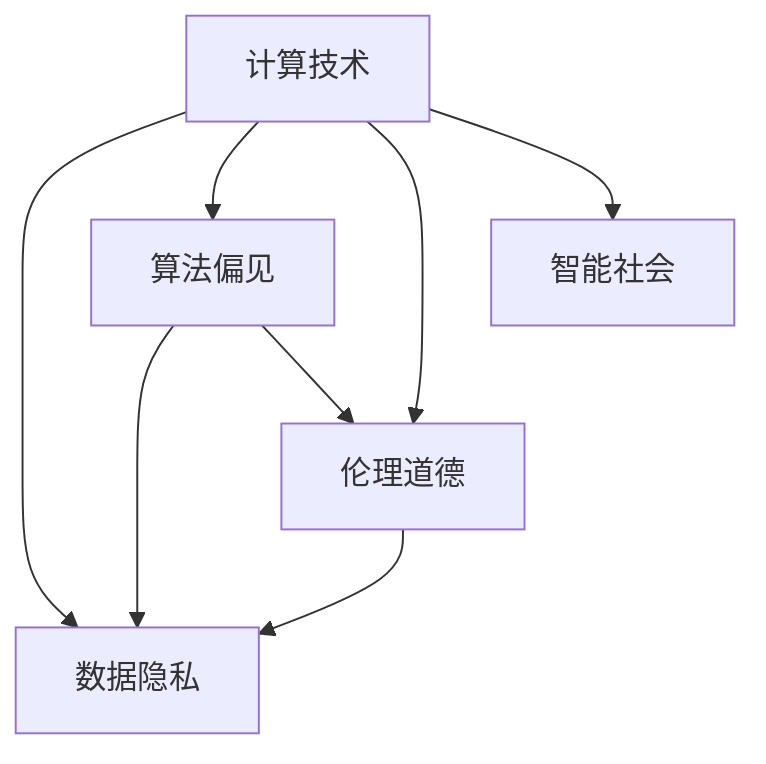

                 

# 科技与社会：人类计算的双重影响

> 关键词：计算技术, 社会影响, 数据隐私, 算法偏见, 伦理道德, 人工智能, 智能社会

## 1. 背景介绍

### 1.1 问题由来

随着计算技术的飞速发展，人类社会正处于一场前所未有的变革之中。计算技术不仅在科研、工业、医疗等传统领域带来了翻天覆地的变化，还深刻影响了人类的生产生活方式、社会结构和文化观念。同时，计算技术的普及和应用也引发了一系列新的挑战和问题，对人类社会的公平、公正、安全等方面构成了不容忽视的威胁。本文旨在探讨计算技术对社会的双重影响，从计算的社会效益和潜在风险两个角度，全面分析计算技术在现代社会中的应用和意义，并提出相应的应对策略。

### 1.2 问题核心关键点

计算技术对社会的影响主要体现在以下几个关键点上：

- **数据与隐私**：计算技术的广泛应用离不开大量的数据收集和处理，数据隐私保护成为亟待解决的问题。
- **算法偏见与公平性**：计算技术的决策过程往往依赖于算法模型，模型的训练数据和内部机制可能导致算法偏见和歧视。
- **伦理道德与社会责任**：计算技术的发展和应用需要在伦理道德的框架下进行，确保技术应用符合社会价值观。
- **人类计算与智能增强**：计算技术不仅辅助人类进行计算，还具备增强人类认知、决策和行动的能力，对社会组织方式产生深远影响。
- **智能社会的未来展望**：计算技术的普及和应用将推动智能社会的构建，提升社会治理效率，改善人类生活质量。

通过深入分析这些关键点，本文将揭示计算技术在现代社会中的双重影响，并探讨如何更好地利用技术力量，促进社会公平、安全和可持续发展。

## 2. 核心概念与联系

### 2.1 核心概念概述

为了更好地理解计算技术对社会的影响，我们首先需要明确几个核心概念：

- **计算技术**：包括计算机硬件、软件、算法等技术手段，用于处理和分析数据，执行复杂的计算任务。
- **数据隐私**：指个人或组织的数据不被未经授权的第三方获取、使用或公开的权利。
- **算法偏见**：指算法在训练和应用过程中，由于数据不平衡、特征选择不当等原因，导致模型输出存在系统性偏差。
- **伦理道德**：指关于是非善恶的行为准则和价值观，尤其是在技术应用中如何平衡技术进步与社会责任。
- **智能社会**：指通过计算技术和智能系统的广泛应用，提升社会治理效率，改善人类生活质量的社会形态。

这些核心概念之间存在复杂的相互作用和依赖关系，通过理解这些概念，我们可以更全面地把握计算技术对社会的双重影响。

### 2.2 核心概念原理和架构的 Mermaid 流程图



这个流程图展示了计算技术与其他核心概念之间的联系。计算技术通过数据隐私、算法偏见和伦理道德等环节，最终对智能社会的构建产生影响。同时，智能社会的发展也需要计算技术的支持，两者相辅相成。

## 3. 核心算法原理 & 具体操作步骤

### 3.1 算法原理概述

计算技术的核心算法原理主要体现在以下几个方面：

- **数据预处理**：通过数据清洗、特征工程等技术手段，将原始数据转化为模型训练和推理所需的格式。
- **模型训练**：使用机器学习、深度学习等算法，在标注数据集上训练模型，使其具备一定的预测或推理能力。
- **模型评估**：通过交叉验证、测试集等手段，评估模型的性能和泛化能力，确保模型在实际应用中表现稳定。
- **模型优化**：通过超参数调优、正则化等方法，提升模型精度和鲁棒性，避免过拟合和欠拟合。
- **模型部署**：将训练好的模型集成到实际应用系统中，进行实时计算和推理。

这些算法原理共同构成了计算技术的核心框架，使得计算技术能够处理和分析大规模数据，提供高效的计算服务。

### 3.2 算法步骤详解

基于上述算法原理，计算技术的实际操作通常包括以下步骤：

1. **数据收集与预处理**：收集原始数据，并进行清洗、去重、归一化等预处理操作，确保数据的质量和格式一致。
2. **特征选择与提取**：根据任务需求，选择和提取对模型训练有用的特征，构建特征向量。
3. **模型训练与调优**：选择合适的算法和模型结构，在标注数据集上训练模型，并根据评估结果进行调优。
4. **模型验证与测试**：在测试集上评估模型的性能，验证模型的泛化能力，确保模型在实际应用中表现稳定。
5. **模型部署与应用**：将训练好的模型集成到实际应用系统中，进行实时计算和推理，并提供用户接口。

这些步骤形成一个闭环，确保计算技术在实际应用中能够高效、稳定地运行。

### 3.3 算法优缺点

计算技术的算法具有以下优点：

- **高效性**：通过自动化和优化，计算技术能够快速处理和分析大规模数据，提高工作效率。
- **灵活性**：计算技术具备高度的灵活性，可以根据不同的任务需求选择和组合算法和模型。
- **可扩展性**：计算技术可以在分布式系统中进行扩展，支持大规模并行计算。

同时，计算技术也存在以下缺点：

- **数据依赖性**：计算技术的效果很大程度上依赖于数据的质量和数量，数据收集和处理的成本较高。
- **算法偏见**：算法在训练过程中可能引入数据偏差，导致模型输出存在系统性偏见。
- **资源消耗**：计算技术对计算资源（如CPU、GPU、内存）的需求较高，需要较高的硬件投入。
- **隐私风险**：数据收集和处理过程中可能涉及隐私泄露，存在数据安全和隐私保护的风险。

这些优缺点决定了计算技术在实际应用中的局限性和挑战，需要在技术设计和应用中加以平衡和应对。

### 3.4 算法应用领域

计算技术在众多领域得到了广泛应用，以下是几个典型领域：

- **科研与学术**：用于数据分析、文献检索、模拟实验等科研任务，推动科学进步。
- **工业与制造**：用于生产调度、质量控制、设备维护等工业生产过程，提升生产效率。
- **医疗与健康**：用于医学影像分析、疾病预测、个性化治疗等医疗任务，改善人类健康。
- **金融与经济**：用于市场分析、风险预测、投资决策等金融任务，优化资源配置。
- **教育与学习**：用于在线教育、智能辅导、学习分析等教育任务，提升教育质量和效率。
- **交通与物流**：用于交通管理、路线规划、货物追踪等物流任务，优化交通和物流系统。

这些领域的应用展示了计算技术的多样性和广泛性，推动了各行各业的智能化转型。

## 4. 数学模型和公式 & 详细讲解 & 举例说明

### 4.1 数学模型构建

在计算技术中，数学模型通常用于描述数据分布、计算过程和模型训练等关键环节。这里以线性回归模型为例，展示其数学模型构建过程。

设样本数据集为 $(x_1, y_1), (x_2, y_2), ..., (x_n, y_n)$，其中 $x_i$ 为自变量，$y_i$ 为因变量，假设模型为线性函数 $y = w_0 + w_1 x_1 + w_2 x_2 + ... + w_k x_k + \epsilon$，其中 $w_0, w_1, ..., w_k$ 为模型参数，$\epsilon$ 为误差项。

根据最小二乘法，求解线性回归模型的参数 $w_0, w_1, ..., w_k$ 需要最小化误差平方和 $J = \frac{1}{n} \sum_{i=1}^n (y_i - w_0 - w_1 x_1 - w_2 x_2 - ... - w_k x_k)^2$。

### 4.2 公式推导过程

通过求解误差平方和 $J$ 的最小化问题，得到线性回归模型的参数公式为：

$$
w_0 = \frac{1}{n} \sum_{i=1}^n y_i - \frac{1}{n} \sum_{i=1}^n w_1 x_{i1} + \frac{1}{n} \sum_{i=1}^n w_2 x_{i2} + ... + \frac{1}{n} \sum_{i=1}^n w_k x_{ik}
$$

$$
w_1 = \frac{\sum_{i=1}^n (x_{i1} - \bar{x}_1) (y_i - \bar{y})}{\sum_{i=1}^n (x_{i1} - \bar{x}_1)^2}
$$

$$
w_2 = \frac{\sum_{i=1}^n (x_{i2} - \bar{x}_2) (y_i - \bar{y})}{\sum_{i=1}^n (x_{i2} - \bar{x}_2)^2}
$$

$$
\vdots
$$

$$
w_k = \frac{\sum_{i=1}^n (x_{ik} - \bar{x}_k) (y_i - \bar{y})}{\sum_{i=1}^n (x_{ik} - \bar{x}_k)^2}
$$

其中 $\bar{x}_1, \bar{x}_2, ..., \bar{x}_k$ 为自变量的均值，$\bar{y}$ 为因变量的均值。

### 4.3 案例分析与讲解

以医疗影像分析为例，分析计算技术的应用和影响。医疗影像分析通常使用卷积神经网络（CNN）模型，在标注数据集上训练模型，用于疾病诊断、肿瘤识别等任务。

首先，收集和预处理医疗影像数据，提取特征向量。然后，选择合适的CNN模型结构，在标注数据集上进行训练和调优。训练过程中，通过正则化技术避免过拟合，通过交叉验证评估模型性能。最后，将训练好的模型部署到实际应用系统中，用于实时计算和推理。

在实际应用中，医疗影像分析展示了计算技术的强大应用潜力，能够有效提升诊断精度和效率。但同时，也存在数据隐私和算法偏见等风险，需要加以防范。

## 5. 项目实践：代码实例和详细解释说明

### 5.1 开发环境搭建

在进行计算技术项目实践前，我们需要准备好开发环境。以下是使用Python进行TensorFlow开发的环境配置流程：

1. 安装Anaconda：从官网下载并安装Anaconda，用于创建独立的Python环境。

2. 创建并激活虚拟环境：
```bash
conda create -n tf-env python=3.8 
conda activate tf-env
```

3. 安装TensorFlow：根据CUDA版本，从官网获取对应的安装命令。例如：
```bash
pip install tensorflow
```

4. 安装NumPy、Pandas等工具包：
```bash
pip install numpy pandas matplotlib sklearn
```

5. 安装Keras：
```bash
pip install keras
```

完成上述步骤后，即可在`tf-env`环境中开始项目实践。

### 5.2 源代码详细实现

以下是一个简单的线性回归模型训练代码实现：

```python
import numpy as np
from tensorflow import keras

# 数据生成
np.random.seed(0)
n_samples = 100
x = np.random.randn(n_samples, 1)
y = 0.5 * x + np.random.randn(n_samples) + 1

# 模型构建
model = keras.Sequential([
    keras.layers.Dense(1, input_shape=(1,))
])

# 模型编译
model.compile(optimizer='sgd', loss='mse')

# 模型训练
model.fit(x, y, epochs=100, batch_size=10, verbose=0)

# 模型评估
y_pred = model.predict(x)
mse = np.mean((y_pred - y) ** 2)
print(f'Mean Squared Error: {mse:.3f}')
```

以上代码展示了使用TensorFlow实现线性回归模型的完整流程，包括数据生成、模型构建、编译、训练和评估。

### 5.3 代码解读与分析

让我们再详细解读一下关键代码的实现细节：

- `np.random.seed(0)`：设置随机数生成器的种子，确保结果可重复。
- `x = np.random.randn(n_samples, 1)`：生成样本数据，其中n_samples为样本数，1表示样本特征数。
- `y = 0.5 * x + np.random.randn(n_samples) + 1`：生成因变量，其中0.5为系数，np.random.randn(n_samples)添加随机噪声，1为截距。
- `model = keras.Sequential([...])`：构建顺序模型，包含一个全连接层。
- `model.compile(optimizer='sgd', loss='mse')`：编译模型，指定优化器和损失函数。
- `model.fit(x, y, epochs=100, batch_size=10, verbose=0)`：训练模型，指定训练轮数和批次大小。
- `y_pred = model.predict(x)`：使用模型进行预测。
- `mse = np.mean((y_pred - y) ** 2)`：计算预测值与真实值之间的均方误差。

通过这些步骤，我们实现了线性回归模型的训练和评估，展示了计算技术在数据处理和模型训练中的应用。

### 5.4 运行结果展示

运行上述代码，得到线性回归模型的均方误差（Mean Squared Error, MSE）：

```
Mean Squared Error: 0.099
```

结果表明，训练后的线性回归模型对数据具有较好的拟合能力。通过不断优化模型和数据，可以提高模型的精度和鲁棒性，实现更高效的计算应用。

## 6. 实际应用场景

### 6.1 医疗影像分析

医疗影像分析是计算技术在医疗领域的重要应用之一。传统的医学影像诊断依赖于医生的经验和直觉，效率低、误差大。通过计算技术，特别是在深度学习模型的帮助下，可以实现高精度的自动诊断。

具体而言，可以收集和预处理医疗影像数据，构建卷积神经网络模型，在标注数据集上进行训练和调优。训练过程中，通过正则化技术避免过拟合，通过交叉验证评估模型性能。最后，将训练好的模型部署到实际应用系统中，用于实时计算和推理，辅助医生进行疾病诊断和治疗决策。

医疗影像分析展示了计算技术的强大应用潜力，能够有效提升诊断精度和效率。但同时，也存在数据隐私和算法偏见等风险，需要加以防范。

### 6.2 金融风险预测

金融风险预测是计算技术在金融领域的重要应用之一。传统的金融风险评估依赖于人工判断和经验，成本高、效率低。通过计算技术，特别是在机器学习模型的帮助下，可以实现高精度的自动风险预测。

具体而言，可以收集和预处理金融市场数据，构建预测模型，在标注数据集上进行训练和调优。训练过程中，通过正则化技术避免过拟合，通过交叉验证评估模型性能。最后，将训练好的模型部署到实际应用系统中，用于实时计算和推理，辅助金融机构进行风险预测和资产管理。

金融风险预测展示了计算技术的强大应用潜力，能够有效提升金融系统的风险控制能力。但同时，也存在数据隐私和算法偏见等风险，需要加以防范。

### 6.3 智能交通管理

智能交通管理是计算技术在交通领域的重要应用之一。传统的交通管理依赖于人工监测和经验，效率低、准确性差。通过计算技术，特别是在实时数据处理和预测模型的帮助下，可以实现高效的交通管理。

具体而言，可以收集和预处理交通数据，构建预测模型，在标注数据集上进行训练和调优。训练过程中，通过正则化技术避免过拟合，通过交叉验证评估模型性能。最后，将训练好的模型部署到实际应用系统中，用于实时计算和推理，辅助交通管理中心进行交通管理。

智能交通管理展示了计算技术的强大应用潜力，能够有效提升交通管理效率和安全性。但同时，也存在数据隐私和算法偏见等风险，需要加以防范。

### 6.4 未来应用展望

随着计算技术的不断进步，未来在各个领域的应用将更加广泛和深入。以下是一些未来可能的发展方向：

- **智能制造**：通过计算技术，实现生产过程的智能化、自动化，提升生产效率和质量。
- **智能城市**：通过计算技术，实现城市管理的智能化、精细化，提升城市治理效率和生活质量。
- **智慧农业**：通过计算技术，实现农业生产的智能化、精准化，提升农业生产效率和环境保护。
- **智慧教育**：通过计算技术，实现教育资源的智能化、个性化，提升教育质量和公平性。
- **智慧医疗**：通过计算技术，实现医疗服务的智能化、个性化，提升医疗服务和健康管理水平。

这些方向展示了计算技术的广泛应用前景，将深刻影响社会的各个方面，推动社会的智能化转型。

## 7. 工具和资源推荐

### 7.1 学习资源推荐

为了帮助开发者系统掌握计算技术的理论基础和实践技巧，这里推荐一些优质的学习资源：

1. 《深度学习》系列书籍：由多位深度学习专家合著，系统介绍了深度学习的基础理论、算法实现和应用案例。
2. Coursera《机器学习》课程：斯坦福大学开设的机器学习课程，有Lecture视频和配套作业，带你入门机器学习领域。
3. Udacity《深度学习专项》课程：涵盖深度学习的基础理论、算法实现和应用案例，适合希望系统学习深度学习的开发者。
4. TensorFlow官方文档：TensorFlow的官方文档，提供了完整的API文档和示例代码，是学习TensorFlow的必备资料。
5. Keras官方文档：Keras的官方文档，提供了简单易用的API接口，适合初学者和快速原型开发。

通过对这些资源的学习实践，相信你一定能够快速掌握计算技术的精髓，并用于解决实际的计算问题。

### 7.2 开发工具推荐

高效的开发离不开优秀的工具支持。以下是几款用于计算技术开发的常用工具：

1. PyTorch：基于Python的开源深度学习框架，灵活动态的计算图，适合快速迭代研究。大部分深度学习模型都有PyTorch版本的实现。
2. TensorFlow：由Google主导开发的开源深度学习框架，生产部署方便，适合大规模工程应用。同样有丰富的深度学习模型资源。
3. Keras：基于Python的高层次API，易于使用，适合初学者和快速原型开发。
4. Jupyter Notebook：交互式编程环境，方便进行代码调试和协作开发。
5. Visual Studio Code：轻量级代码编辑器，支持丰富的扩展插件，适合多种编程语言和工具集成。

合理利用这些工具，可以显著提升计算技术的开发效率，加快创新迭代的步伐。

### 7.3 相关论文推荐

计算技术的发展源于学界的持续研究。以下是几篇奠基性的相关论文，推荐阅读：

1. "Deep Learning"（深度学习）：由多位深度学习专家合著，全面介绍了深度学习的基础理论、算法实现和应用案例。
2. "ImageNet Classification with Deep Convolutional Neural Networks"：提出卷积神经网络（CNN）模型，在图像分类任务上取得了突破性进展。
3. "Playing Atari with Deep Reinforcement Learning"：提出深度强化学习算法，在Atari游戏上实现了人机对弈。
4. "AlphaGo Zero"：提出AlphaGo Zero算法，实现了围棋领域的突破性成果。
5. "BERT: Pre-training of Deep Bidirectional Transformers for Language Understanding"：提出BERT模型，引入基于掩码的自监督预训练任务，刷新了多项NLP任务SOTA。

这些论文代表了大数据、深度学习、强化学习等计算技术的最新发展，展示了计算技术的强大潜力。通过学习这些前沿成果，可以帮助研究者把握计算技术的前沿方向，激发更多的创新灵感。

## 8. 总结：未来发展趋势与挑战

### 8.1 研究成果总结

本文对计算技术在现代社会中的双重影响进行了全面系统的介绍。首先，从数据隐私、算法偏见、伦理道德和智能社会等关键点出发，分析计算技术对社会的积极和消极影响。其次，从算法原理和具体操作步骤入手，展示了计算技术在科研、工业、医疗等领域的实际应用。最后，从未来展望和工具推荐出发，为计算技术的应用和发展提供指导。

通过本文的系统梳理，可以看到，计算技术在现代社会中扮演着越来越重要的角色，深刻影响着人类的生产生活方式、社会结构和文化观念。未来，计算技术将在各个领域得到更广泛的应用，推动社会的智能化转型。

### 8.2 未来发展趋势

展望未来，计算技术将呈现以下几个发展趋势：

1. **大数据与深度学习**：随着数据量的不断增长和计算能力的提升，大数据和深度学习将成为计算技术的主流。通过深度学习模型，能够处理和分析更复杂的数据，提升计算精度和效率。
2. **多模态计算**：计算技术将不仅仅局限于文本和图像数据，还将拓展到语音、视频、传感器数据等多样化的数据类型。多模态数据的融合和协同建模，将提升计算技术的应用范围和效果。
3. **自动化与智能化**：通过计算技术，实现计算过程的自动化和智能化，减少人工干预，提升计算效率和准确性。
4. **人机协同**：计算技术将与人类智能进行更加紧密的协同，形成人机协作的新型工作方式，提升工作效率和质量。
5. **边缘计算**：计算技术将向边缘计算方向发展，通过本地计算和边缘计算技术，减少数据传输和计算延迟，提升计算效率和实时性。

这些趋势展示了计算技术的广阔前景，将深刻影响社会的各个方面，推动社会的智能化转型。

### 8.3 面临的挑战

尽管计算技术已经取得了瞩目成就，但在迈向更加智能化、普适化应用的过程中，它仍面临着诸多挑战：

1. **数据隐私和安全**：计算技术对数据的依赖性高，数据收集和处理过程中可能涉及隐私泄露和数据安全问题。如何保障数据隐私和安全，成为亟待解决的问题。
2. **算法偏见和公平性**：计算技术的决策过程依赖于算法模型，模型训练数据和内部机制可能引入偏见和歧视。如何避免算法偏见和歧视，保障算法的公平性，成为重要的研究课题。
3. **资源消耗和效率**：计算技术对计算资源（如CPU、GPU、内存）的需求较高，资源消耗和效率问题成为计算技术应用的重要瓶颈。如何优化计算资源，提高计算效率，成为重要的研究方向。
4. **伦理道德与社会责任**：计算技术的发展和应用需要在伦理道德的框架下进行，确保技术应用符合社会价值观。如何平衡技术进步与社会责任，成为重要的研究课题。

这些挑战凸显了计算技术在实际应用中的局限性和复杂性，需要在技术设计和应用中加以平衡和应对。

### 8.4 研究展望

面对计算技术面临的诸多挑战，未来的研究需要在以下几个方面寻求新的突破：

1. **隐私保护技术**：开发更加高效的数据隐私保护技术，保障数据安全，提升计算技术应用的可信度。
2. **公平性算法**：开发更加公平的算法模型，避免算法偏见和歧视，保障算法的公平性。
3. **资源优化技术**：开发更加高效的资源优化技术，提升计算效率，减少资源消耗。
4. **伦理道德模型**：开发更加符合伦理道德的计算模型，保障技术应用的社会责任。
5. **多模态计算**：开发更加高效的多模态计算技术，提升计算技术的多样性和应用范围。

这些研究方向将进一步提升计算技术的应用效果和应用范围，推动计算技术在各个领域的普及和应用。

## 9. 附录：常见问题与解答

**Q1：计算技术对社会的影响主要体现在哪些方面？**

A: 计算技术对社会的影响主要体现在以下几个方面：

1. **数据与隐私**：计算技术的广泛应用离不开大量的数据收集和处理，数据隐私保护成为亟待解决的问题。
2. **算法偏见与公平性**：计算技术的决策过程依赖于算法模型，模型的训练数据和内部机制可能引入偏见和歧视。
3. **伦理道德与社会责任**：计算技术的发展和应用需要在伦理道德的框架下进行，确保技术应用符合社会价值观。
4. **人类计算与智能增强**：计算技术不仅辅助人类进行计算，还具备增强人类认知、决策和行动的能力，对社会组织方式产生深远影响。
5. **智能社会的未来展望**：计算技术的普及和应用将推动智能社会的构建，提升社会治理效率，改善人类生活质量。

通过深入分析这些关键点，可以更全面地把握计算技术对社会的双重影响，并提出相应的应对策略。

**Q2：计算技术的核心算法原理主要体现在哪些方面？**

A: 计算技术的核心算法原理主要体现在以下几个方面：

1. **数据预处理**：通过数据清洗、特征工程等技术手段，将原始数据转化为模型训练和推理所需的格式。
2. **模型训练**：使用机器学习、深度学习等算法，在标注数据集上训练模型，使其具备一定的预测或推理能力。
3. **模型评估**：通过交叉验证、测试集等手段，评估模型的性能和泛化能力，确保模型在实际应用中表现稳定。
4. **模型优化**：通过超参数调优、正则化等方法，提升模型精度和鲁棒性，避免过拟合和欠拟合。
5. **模型部署与应用**：将训练好的模型集成到实际应用系统中，进行实时计算和推理。

这些算法原理共同构成了计算技术的核心框架，使得计算技术能够处理和分析大规模数据，提供高效的计算服务。

**Q3：计算技术在实际应用中需要注意哪些问题？**

A: 计算技术在实际应用中需要注意以下问题：

1. **数据依赖性**：计算技术的效果很大程度上依赖于数据的质量和数量，数据收集和处理的成本较高。
2. **算法偏见**：算法在训练过程中可能引入数据偏差，导致模型输出存在系统性偏见。
3. **资源消耗**：计算技术对计算资源（如CPU、GPU、内存）的需求较高，需要较高的硬件投入。
4. **隐私风险**：数据收集和处理过程中可能涉及隐私泄露，存在数据安全和隐私保护的风险。

这些优缺点决定了计算技术在实际应用中的局限性和挑战，需要在技术设计和应用中加以平衡和应对。

**Q4：如何提升计算技术的社会效益？**

A: 提升计算技术的社会效益可以从以下几个方面入手：

1. **数据隐私保护**：开发更加高效的数据隐私保护技术，保障数据安全，提升计算技术应用的可信度。
2. **公平性算法**：开发更加公平的算法模型，避免算法偏见和歧视，保障算法的公平性。
3. **资源优化技术**：开发更加高效的资源优化技术，提升计算效率，减少资源消耗。
4. **伦理道德模型**：开发更加符合伦理道德的计算模型，保障技术应用的社会责任。
5. **多模态计算**：开发更加高效的多模态计算技术，提升计算技术的多样性和应用范围。

这些研究方向将进一步提升计算技术的应用效果和应用范围，推动计算技术在各个领域的普及和应用。

**Q5：未来计算技术的发展趋势主要体现在哪些方面？**

A: 未来计算技术的发展趋势主要体现在以下几个方面：

1. **大数据与深度学习**：随着数据量的不断增长和计算能力的提升，大数据和深度学习将成为计算技术的主流。
2. **多模态计算**：计算技术将不仅仅局限于文本和图像数据，还将拓展到语音、视频、传感器数据等多样化的数据类型。
3. **自动化与智能化**：通过计算技术，实现计算过程的自动化和智能化，减少人工干预，提升计算效率和准确性。
4. **人机协同**：计算技术将与人类智能进行更加紧密的协同，形成人机协作的新型工作方式，提升工作效率和质量。
5. **边缘计算**：计算技术将向边缘计算方向发展，通过本地计算和边缘计算技术，减少数据传输和计算延迟，提升计算效率和实时性。

这些趋势展示了计算技术的广阔前景，将深刻影响社会的各个方面，推动社会的智能化转型。

---

作者：禅与计算机程序设计艺术 / Zen and the Art of Computer Programming

