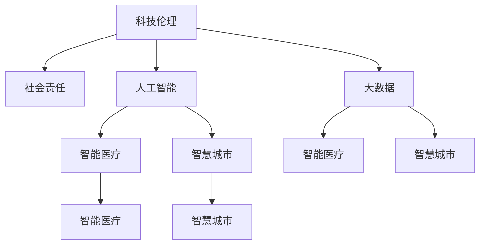

                 

# 科技向善：用科技的力量解决社会问题

> 关键词：科技伦理,社会责任,人工智能,大数据,智能医疗,环境保护,智慧城市,人机协作

## 1. 背景介绍

### 1.1 问题由来
随着科技进步的快速推进，科技在各个领域的应用越来越广泛，从医疗健康到环境保护，从智慧城市到智能制造，科技正以其强大的力量改变着人们的生活和工作方式。然而，科技进步的背后，也伴随着一系列的社会问题和伦理挑战。

近年来，人工智能(AI)、大数据(Big Data)、物联网(IoT)等技术在社会各领域的应用，让人们感受到了科技带来的便利与效率，但同时也引发了关于隐私保护、算法偏见、数据安全等诸多问题。这些问题不仅影响着科技的可持续发展，更关系到社会的公平正义。

科技的进步是人类社会进步的重要推动力，但科技的滥用也会对社会带来负面影响。如何在享受科技带来的便利的同时，尽可能地减少科技带来的负面影响，是科技工作者和社会各界需要共同思考的问题。

### 1.2 问题核心关键点
科技向善的理念，要求科技工作者在技术开发和应用过程中，以社会责任为导向，将社会价值融入技术研发和产品设计之中，避免技术滥用带来的负面影响。以下是科技向善的核心关键点：

- 数据隐私：保护用户数据隐私，确保数据采集、处理、存储的合法性和安全性。
- 算法透明：保证算法的透明度和可解释性，让用户能够理解算法的决策过程。
- 社会公平：确保技术应用不会加剧社会不平等，避免算法偏见和歧视。
- 环境保护：利用科技力量减少环境污染，保护生态环境。
- 智能治理：利用智能技术优化社会治理，提升社会管理效率。

这些关键点贯穿了科技向善的全过程，是技术开发者和社会各界的共同目标。

## 2. 核心概念与联系

### 2.1 核心概念概述

为了更好地理解科技向善的理念和实现路径，本节将介绍几个核心概念：

- 科技伦理：科技工作者在技术开发和应用过程中所遵循的道德规范和伦理准则，旨在平衡技术进步与社会责任。
- 社会责任：科技工作者在技术应用中应承担的社会义务，包括但不限于保护隐私、促进公平、保护环境等。
- 人工智能(AI)：一种模拟人类智能行为的技术，涵盖了机器学习、自然语言处理、计算机视觉等多个领域。
- 大数据(Big Data)：通过数据分析、挖掘和可视化技术，从大规模数据中提取有价值的信息。
- 智能医疗：利用AI和大数据技术，提升医疗诊断、治疗、管理等方面的效率和准确性。
- 智慧城市：通过信息感知、数据整合、智能决策等技术手段，提升城市管理和服务水平。

这些核心概念之间的联系和相互影响，可以通过以下Mermaid流程图来展示：



这个流程图展示了科技伦理、社会责任、人工智能和大数据四者之间的关系及其对智能医疗和智慧城市的影响。

## 3. 核心算法原理 & 具体操作步骤
### 3.1 算法原理概述

科技向善的核心算法原理，主要体现在数据隐私保护、算法透明和公平性保证等方面。以下是一些关键算法的概述：

- **差分隐私(Differential Privacy)**：通过添加噪声扰动数据，确保单个数据点的修改不会显著影响全局结果，从而保护数据隐私。
- **可解释性模型(Explainable AI, XAI)**：通过模型解释技术，使算法的决策过程透明，便于用户理解和信任。
- **公平学习(Fair Learning)**：通过调整算法参数，减少数据偏见，确保模型对不同群体公平对待。

这些算法在实际应用中需要根据具体情境进行设计和实现。

### 3.2 算法步骤详解

以下是科技向善中几种核心算法的详细步骤：

#### 差分隐私

1. **数据采集**：从多个来源收集数据。
2. **噪声添加**：对数据添加噪声，确保单个数据点的修改不会显著影响全局结果。
3. **结果计算**：在噪声添加后，计算最终结果。
4. **结果发布**：仅发布统计结果，不公开具体数据。

#### 可解释性模型

1. **模型选择**：选择合适的可解释性模型，如决策树、规则系统等。
2. **解释工具**：使用工具生成模型的解释，如LIME、SHAP等。
3. **结果展示**：将解释结果与原始数据结合，提供用户易于理解的输出。

#### 公平学习

1. **数据预处理**：对数据进行去偏、标准化等预处理。
2. **模型训练**：训练公平性保证的模型，如使用Debiasing技术减少偏见。
3. **结果验证**：对模型进行公平性评估，确保不同群体间的公平性。

### 3.3 算法优缺点

这些算法在实现科技向善理念时，各有优缺点：

- **差分隐私**
  - **优点**：保护数据隐私，适用于大规模数据集。
  - **缺点**：引入噪声可能影响结果的准确性，计算复杂度较高。
  
- **可解释性模型**
  - **优点**：提高模型的透明度和用户信任度。
  - **缺点**：解释模型的准确性可能受到模型复杂度和解释方法的影响。
  
- **公平学习**
  - **优点**：减少算法偏见，提升模型公平性。
  - **缺点**：公平性保证可能需要在模型设计时进行特殊处理，计算复杂度较高。

### 3.4 算法应用领域

这些算法在不同领域的应用，具体如下：

- **差分隐私**：适用于数据隐私保护、医疗数据共享等场景。
- **可解释性模型**：适用于金融风控、智能客服等需要用户信任的领域。
- **公平学习**：适用于招聘、信贷等需要避免歧视的领域。

## 4. 数学模型和公式 & 详细讲解  
### 4.1 数学模型构建

差分隐私的数学模型如下：

设 $\mathcal{D}$ 为数据集，$f$ 为计算函数，$\epsilon$ 为隐私参数，$\nu$ 为噪声分布，$\delta$ 为差分隐私的隐私保护参数。

差分隐私的目标是找到一个机制 $\mathcal{L}$，使得对任意 $\mathcal{D} \in \mathcal{D}$ 和任意 $x \in \mathcal{D}$，都有：

$$
\begin{aligned}
\Pr[f(\mathcal{L}(\mathcal{D})) = f(x)] &\leq \exp\left(\frac{-\epsilon}{2\sigma^2}\right) \\
\Pr[\exists \mathcal{D}' \in \mathcal{D} \text{ s.t. } f(\mathcal{L}(\mathcal{D})) = f(x) \text{ and } x \in \mathcal{D}' &\leq \delta
\end{aligned}
$$

其中 $\sigma$ 为噪声强度。

#### 公式推导过程

差分隐私的推导过程较为复杂，涉及拉普拉斯机制、高斯机制等噪声添加方式，以及隐私参数的选择。推导过程需要深入学习概率论和信息论的知识。

#### 案例分析与讲解

在实际应用中，差分隐私常用于医疗数据保护。例如，某医院收集患者健康数据，希望在不泄露患者隐私的前提下，进行数据分析和研究。可以通过差分隐私机制，将患者数据匿名化，并添加噪声，确保单个患者数据的修改不会显著影响整体结果，从而保护患者隐私。

## 5. 项目实践：代码实例和详细解释说明
### 5.1 开发环境搭建

为了进行差分隐私和可解释性模型的实践，需要搭建以下开发环境：

1. 安装Python：从官网下载并安装Python，建议使用3.x版本。
2. 安装必要的库：
   - 差分隐私：`diffprivpy`、`pytorch-differential-privacy` 等库。
   - 可解释性模型：`LIME`、`SHAP` 等库。
3. 搭建虚拟环境：使用 `conda` 或 `virtualenv` 搭建虚拟环境，以避免不同项目之间的依赖冲突。

### 5.2 源代码详细实现

以下是差分隐私和可解释性模型的Python代码实现：

#### 差分隐私

```python
import torch
import torch.nn as nn
from torch.differential_privacy import PrivacyEngine, LaplaceMechanism

class DPModel(nn.Module):
    def __init__(self):
        super(DPModel, self).__init__()
        self.fc1 = nn.Linear(784, 256)
        self.fc2 = nn.Linear(256, 10)
    
    def forward(self, x):
        x = x.view(-1, 784)
        x = torch.relu(self.fc1(x))
        x = self.fc2(x)
        return x

# 定义隐私参数
epsilon = 1.0
delta = 1e-5

# 创建隐私保护引擎
engine = PrivacyEngine.create_laplace(epsilon, delta)

# 训练模型
model = DPModel()
criterion = nn.CrossEntropyLoss()
optimizer = torch.optim.SGD(model.parameters(), lr=0.01)

# 训练循环
for epoch in range(10):
    engine.setup(model)
    engine.train()
    optimizer.zero_grad()
    inputs, labels = ...
    outputs = model(inputs)
    loss = criterion(outputs, labels)
    loss.backward()
    optimizer.step()
```

#### 可解释性模型

```python
import torch
import torch.nn as nn
from torch.utils.data import TensorDataset, DataLoader
import lime
from lime import lime_tabular
from sklearn.metrics import accuracy_score

class ExplainableModel(nn.Module):
    def __init__(self):
        super(ExplainableModel, self).__init__()
        self.fc1 = nn.Linear(784, 256)
        self.fc2 = nn.Linear(256, 10)
    
    def forward(self, x):
        x = x.view(-1, 784)
        x = torch.relu(self.fc1(x))
        x = self.fc2(x)
        return x

# 加载数据
train_data = TensorDataset(torch.randn(1000, 784), torch.randint(10, (1000,)))
test_data = TensorDataset(torch.randn(100, 784), torch.randint(10, (100,)))
model = ExplainableModel()
criterion = nn.CrossEntropyLoss()
optimizer = torch.optim.SGD(model.parameters(), lr=0.01)

# 训练模型
for epoch in range(10):
    optimizer.zero_grad()
    inputs, labels = train_data
    outputs = model(inputs)
    loss = criterion(outputs, labels)
    loss.backward()
    optimizer.step()

# 生成解释
explainer = lime_tabular.LimeTabularExplainer(train_data.tensors[0])
for i in range(100):
    _, _, idx = explainer.explain_instance(train_data[i][0], model, num_features=10)
    print(explainer.explain_instance_idxs(idx))
```

### 5.3 代码解读与分析

**差分隐私代码解读**：

- 首先定义了一个简单的神经网络模型 `DPModel`，包含两个全连接层。
- 在模型训练时，使用差分隐私引擎 `PrivacyEngine` 对模型进行隐私保护，其中 `LaplaceMechanism` 用于添加拉普拉斯噪声。
- 在训练循环中，使用隐私保护引擎进行模型训练，以确保隐私保护。

**可解释性模型代码解读**：

- 同样定义了一个简单的神经网络模型 `ExplainableModel`，包含两个全连接层。
- 加载数据集 `TensorDataset`，并使用 `LimeTabularExplainer` 生成可解释性结果。
- 在生成解释时，使用 `explain_instance_idxs` 方法获取模型的解释实例。

## 6. 实际应用场景

### 6.1 智能医疗

智能医疗是科技向善的重要应用场景之一。通过人工智能和大数据技术，可以实现疾病预测、诊断和治疗优化等。例如，某医院利用差分隐私保护患者电子病历数据，使得医生能够安全地进行数据分析和研究，提升医疗诊断和治疗水平。

### 6.2 金融风控

在金融领域，可解释性模型和公平学习技术可以用于风险评估和信贷审批。例如，银行利用可解释性模型生成风险评估报告，帮助审批人员理解模型的决策过程，从而减少主观偏见，提升审批准确性。

### 6.3 智慧城市

智慧城市是科技向善的另一个重要应用场景。通过智能技术，可以实现交通管理、能源优化、环境监测等。例如，城市交通系统利用AI技术分析交通流量数据，优化交通信号灯控制，提高交通效率，减少拥堵。

### 6.4 未来应用展望

未来，随着技术的不断发展，科技向善的理念将更加深入人心，应用领域也将更加广泛。以下是一些未来应用展望：

- **智能制造**：利用AI和物联网技术，实现智能制造、智能物流等，提升制造业的效率和安全性。
- **环境保护**：通过大数据和AI技术，实现环境监测、污染预测和治理，保护生态环境。
- **社会治理**：利用AI技术优化公共服务，提升社会管理效率，促进社会公平正义。
- **健康医疗**：利用AI技术提升医疗诊断和治疗水平，推动健康医疗事业的发展。

## 7. 工具和资源推荐

### 7.1 学习资源推荐

为了帮助开发者掌握科技向善的理念和实现方法，以下是一些推荐的学习资源：

1. **《科技向善：人工智能与社会责任》**：深入探讨科技向善的原理和实现方法，涵盖隐私保护、公平性保证、可解释性等多个方面。
2. **Coursera《人工智能伦理》课程**：斯坦福大学开设的课程，介绍人工智能伦理的基本概念和案例分析。
3. **《数据科学伦理》书籍**：详细介绍数据科学中的伦理问题，涵盖数据隐私、算法偏见等。
4. **LIME官方文档**：LIME库的官方文档，提供详细的使用指南和案例分析。
5. **diffprivpy官方文档**：diffprivpy库的官方文档，提供差分隐私的实现方法和案例分析。

### 7.2 开发工具推荐

为了实现科技向善的理念，以下是一些推荐的开发工具：

1. **Jupyter Notebook**：支持Python代码的交互式编写和执行，便于调试和共享代码。
2. **TensorFlow**：开源深度学习框架，支持差分隐私和可解释性模型的实现。
3. **PyTorch**：开源深度学习框架，支持差分隐私和可解释性模型的实现。
4. **LIME**：生成可解释性模型的工具，支持多种模型和解释方法。
5. **diffprivpy**：实现差分隐私的Python库，支持多种隐私保护机制。

### 7.3 相关论文推荐

以下是一些推荐的科技向善相关论文：

1. **《Differential Privacy》**：差分隐私的奠基性论文，介绍差分隐私的基本概念和应用。
2. **《Explainable AI》**：可解释性AI的综述性论文，介绍多种可解释性模型和解释方法。
3. **《Fair Learning》**：公平学习的基本概念和实现方法，涵盖多种公平性保证技术。

## 8. 总结：未来发展趋势与挑战

### 8.1 研究成果总结

科技向善的理念和实现方法，已经在多个领域得到了应用，取得了显著的效果。差分隐私和可解释性模型等技术，不仅提高了数据隐私保护和算法透明性，还减少了算法偏见，提升了模型的公平性和可信度。

### 8.2 未来发展趋势

未来，科技向善的理念将进一步深化，技术应用也将更加广泛。以下是一些未来发展趋势：

- **隐私保护技术**：差分隐私和联邦学习等隐私保护技术将更加成熟，支持大规模数据的隐私保护。
- **可解释性模型**：可解释性模型将更加多样化和精确，帮助用户理解模型的决策过程。
- **公平学习**：公平学习技术将更加普及，减少算法偏见，提升模型的公平性。
- **智能治理**：利用AI技术优化社会治理，提升公共服务的效率和公平性。

### 8.3 面临的挑战

尽管科技向善的理念和技术在不断进步，但仍然面临一些挑战：

- **数据隐私**：数据隐私保护需要平衡数据开放和隐私保护，难以找到一个平衡点。
- **算法偏见**：如何消除算法偏见，提升模型的公平性，仍然是一个难题。
- **模型可解释性**：可解释性模型的准确性和用户理解度需要进一步提升。
- **技术普及**：科技向善的理念和技术需要进一步普及，让更多人理解和应用。

### 8.4 研究展望

未来，需要在以下几个方面进行更多的研究：

- **隐私保护**：探索新的隐私保护技术和方法，如联邦学习、多方安全计算等。
- **公平性保证**：研究新的公平性保证方法和技术，如对抗学习、公平生成等。
- **可解释性模型**：开发更加精确和可解释的模型，如基于符号逻辑的解释方法。
- **社会责任**：研究科技伦理和社会责任的结合，提升技术应用的社会价值。

## 9. 附录：常见问题与解答

### Q1：差分隐私的实现需要注意哪些关键点？

A: 差分隐私的实现需要注意以下关键点：

- **隐私参数的选择**：选择合适的隐私参数 $\epsilon$ 和 $\delta$，平衡隐私保护和计算开销。
- **噪声添加方式**：选择合适的噪声添加方式，如拉普拉斯机制、高斯机制等。
- **数据敏感性分析**：在模型训练前进行数据敏感性分析，确保模型对敏感数据的影响较小。

### Q2：可解释性模型如何评估其效果？

A: 可解释性模型的评估可以通过以下几个方面：

- **模型准确性**：评估模型在特定任务上的准确性，确保模型具有实际应用价值。
- **解释清晰度**：评估解释结果的清晰度，确保用户能够理解模型的决策过程。
- **解释覆盖度**：评估解释结果的覆盖度，确保解释结果覆盖所有输入样本。

### Q3：公平学习在应用中需要注意哪些问题？

A: 公平学习在应用中需要注意以下问题：

- **数据偏见**：确保训练数据集的多样性和代表性，避免数据偏见。
- **算法调整**：根据任务特点，调整算法参数，减少偏见。
- **公平性评估**：对模型进行公平性评估，确保不同群体间的公平性。

### Q4：智能医疗中差分隐私的应用需要注意哪些问题？

A: 智能医疗中差分隐私的应用需要注意以下问题：

- **隐私保护**：确保患者电子病历等敏感数据得到充分保护。
- **数据可用性**：确保数据在使用过程中仍然具有实际应用价值。
- **隐私合规**：确保差分隐私技术符合相关法律法规的要求。

### Q5：智慧城市中可解释性模型如何提升城市管理水平？

A: 智慧城市中可解释性模型可以通过以下方式提升城市管理水平：

- **交通管理**：利用可解释性模型分析交通流量数据，优化交通信号灯控制，提升交通效率。
- **环境监测**：利用可解释性模型分析环境数据，预测污染趋势，优化环境治理措施。
- **公共服务**：利用可解释性模型分析用户行为数据，优化公共服务，提升用户体验。

---

作者：禅与计算机程序设计艺术 / Zen and the Art of Computer Programming

