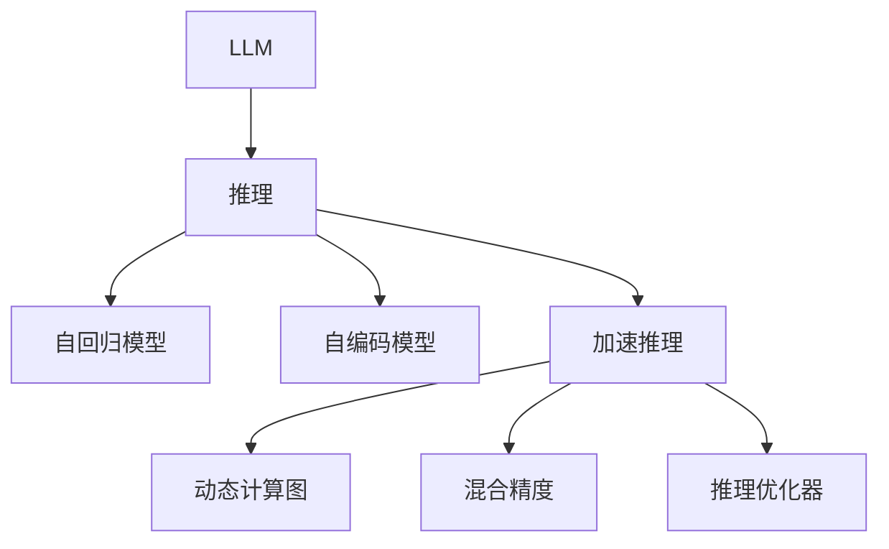

                 

# 秒级生成:LLM推理速度的新高度

在人工智能领域，语言模型（Language Model, LM）以其强大的语言理解和生成能力，逐渐成为自然语言处理（Natural Language Processing, NLP）的核心技术。而在大规模预训练语言模型（Large Language Model, LLM）的推动下，LLM的推理速度和性能正逐步突破传统限制，带来秒级生成的全新可能。本文将深入探讨LLM推理速度的提升策略，以及这些策略在未来人工智能技术中的应用前景。

## 1. 背景介绍

### 1.1 问题由来
随着深度学习技术的迅猛发展，大规模预训练语言模型在NLP领域取得了显著的进展。以GPT-3为代表的大规模预训练模型，具备丰富的语言知识和常识，但推理速度较慢，难以应对实时处理的要求。如何在保持模型性能的同时，大幅提升推理速度，成为当前研究的热点问题。

### 1.2 问题核心关键点
在NLP任务中，推理速度是衡量模型实用性的重要指标之一。然而，基于自回归模型（如GPT系列）的LLM在推理时，需要逐个生成每个单词，推理速度受到限制。此外，模型参数量巨大，运算复杂度高，对硬件资源要求较高。因此，如何在提升推理速度的同时，保持或提高模型性能，成为推动NLP技术应用的关键因素。

## 2. 核心概念与联系

### 2.1 核心概念概述

为更好地理解LLM推理速度的提升策略，本节将介绍几个密切相关的核心概念：

- 大规模预训练语言模型（Large Language Model, LLM）：以自回归或自编码模型为代表的大规模预训练语言模型。通过在大规模无标签文本语料上进行预训练，学习通用的语言表示，具备强大的语言理解和生成能力。

- 推理（Inference）：在给定输入序列的情况下，LLM生成相应的输出序列的过程。推理速度是衡量LLM性能的关键指标之一。

- 自回归模型（Autoregressive Model）：如GPT系列模型，通过前一个单词生成下一个单词的预测概率，实现序列生成。

- 自编码模型（Autoencoder Model）：如BERT等，通过编码器-解码器结构，实现对文本序列的编码和解码，直接输出隐表示。

- 加速推理（Accelerated Inference）：通过各种算法和技术优化，提高LLM的推理速度。

- 动态计算图（Dynamic Computation Graph）：在推理过程中动态构建计算图，优化计算路径，减少冗余计算。

- 混合精度（Mixed Precision）：通过将数据和参数分为不同的精度位宽，降低计算复杂度，提高推理速度。

- 推理优化器（Inference Optimizer）：针对推理过程进行优化的算法，如TensorRT、ONNX Runtime等。

这些核心概念之间的逻辑关系可以通过以下Mermaid流程图来展示：



这个流程图展示了大规模预训练语言模型的工作原理和优化策略：

1. 预训练模型通过学习大规模文本数据，掌握语言规律和常识知识。
2. 推理过程分为自回归和自编码两种方式。
3. 通过加速推理技术，如动态计算图、混合精度、推理优化器，优化推理速度。

## 3. 核心算法原理 & 具体操作步骤

### 3.1 算法原理概述

LLM推理速度的提升，主要依赖于加速推理技术的广泛应用。其核心思想是：在保持模型性能的同时，通过优化计算路径、降低计算复杂度、提高硬件利用率等方式，大幅提升推理速度。

具体而言，LLM的推理过程可以表示为：

$$
y = M_{\theta}(x)
$$

其中，$x$ 为输入序列，$y$ 为输出序列，$\theta$ 为预训练得到的模型参数。推理速度的提升可以分解为以下几个关键步骤：

- **动态计算图优化**：动态构建计算图，避免不必要的重复计算，减少推理时间。
- **混合精度计算**：将计算过程分为不同精度位宽，降低计算复杂度，提高推理速度。
- **推理优化器**：针对推理过程进行优化，如TensorRT、ONNX Runtime等。
- **分布式推理**：利用多GPU或多节点进行分布式计算，提高推理效率。
- **高效内存管理**：优化内存分配和释放，减少内存碎片，提升推理速度。

### 3.2 算法步骤详解

以下是提升LLM推理速度的具体操作步骤：

**Step 1: 构建动态计算图**

动态计算图通过在推理过程中动态构建计算图，避免了固定计算图的冗余计算，从而提高了推理速度。具体而言，可以在推理前先构建计算图，并在推理过程中动态更新计算图，减少不必要的重复计算。

**Step 2: 采用混合精度计算**

混合精度计算通过将计算过程分为不同精度位宽，降低了计算复杂度。具体来说，可以将参数和中间变量分为16位浮点数和32位浮点数，以提高计算效率。

**Step 3: 使用推理优化器**

推理优化器如TensorRT、ONNX Runtime等，专门针对推理过程进行优化，能够显著提升推理速度。这些优化器可以生成优化的推理引擎，加速计算过程。

**Step 4: 进行分布式推理**

分布式推理通过利用多GPU或多节点进行分布式计算，提高了推理效率。具体来说，可以将模型并行化，将不同部分的计算分配到不同的GPU或节点上进行并行处理。

**Step 5: 优化内存管理**

高效内存管理通过优化内存分配和释放，减少了内存碎片，提高了推理速度。具体来说，可以采用内存池化、预分配内存等技术，减少内存碎片的产生。

### 3.3 算法优缺点

动态计算图优化和混合精度计算显著提高了LLM的推理速度，但也需要相应的硬件支持。分布式推理虽然可以大幅提升推理效率，但也需要协调多GPU或多节点之间的通信和同步。推理优化器能够显著加速计算过程，但也需要对模型进行相应的修改和配置。高效内存管理虽然能够提高推理速度，但也需要合理设计内存池和预分配策略。

总体而言，加速推理技术在提高LLM推理速度方面具有显著效果，但也需要综合考虑硬件、软件、通信等因素，才能充分发挥其潜力。

### 3.4 算法应用领域

加速推理技术在大规模预训练语言模型的推理过程中具有广泛的应用前景，涉及多个领域：

- **实时对话系统**：如智能客服、智能助理等，需要实时响应用户输入，推理速度是系统性能的关键指标。
- **自然语言生成**：如机器翻译、摘要生成、文章自动生成等，推理速度直接影响生成效率。
- **搜索引擎**：如自动补全、相关性排序等，推理速度影响用户搜索体验。
- **语音识别**：如语音助手、语音搜索等，推理速度影响实时响应速度。
- **文本分类和标注**：如情感分析、实体识别等，推理速度影响分类和标注效率。

除了这些领域，加速推理技术在多媒体、金融、医疗等多个领域也有广泛的应用前景。

## 4. 数学模型和公式 & 详细讲解 & 举例说明

### 4.1 数学模型构建

LLM的推理过程可以抽象为序列生成问题，即在给定输入序列$x$的情况下，生成输出序列$y$。推理过程可以表示为：

$$
y = M_{\theta}(x) = f(x, \theta)
$$

其中，$f(x, \theta)$为预训练得到的模型，$\theta$为模型参数。

### 4.2 公式推导过程

以GPT-3为例，其推理过程可以分为解码器（Decoder）和生成器（Generator）两个部分。解码器通过前向传播计算上下文向量，生成器通过解码器输出概率分布。

具体来说，GPT-3的推理过程可以表示为：

$$
y = \text{Argsmax}(p_{\theta}(y|x))
$$

其中，$p_{\theta}(y|x)$为模型在输入$x$条件下输出$y$的概率分布。$\text{Argsmax}$表示取概率最大的输出。

推理过程可以分解为以下步骤：

1. 输入预处理：将输入序列$x$转换为模型所需的格式，如分词、编码等。
2. 上下文向量计算：通过解码器计算上下文向量$h$。
3. 生成器计算：通过生成器计算输出序列$y$的概率分布。
4. 取概率最大输出：选择概率最大的输出作为最终结果。

### 4.3 案例分析与讲解

以GPT-3在对话生成任务中的应用为例，通过动态计算图和混合精度计算技术，可以实现推理速度的显著提升。具体来说：

- 动态计算图优化：在推理前构建计算图，并在推理过程中动态更新计算图，避免不必要的重复计算。
- 混合精度计算：将计算过程分为16位浮点数和32位浮点数，降低计算复杂度，提高推理速度。

## 5. 项目实践：代码实例和详细解释说明

### 5.1 开发环境搭建

在进行LLM推理速度优化实践前，我们需要准备好开发环境。以下是使用Python进行PyTorch开发的环境配置流程：

1. 安装Anaconda：从官网下载并安装Anaconda，用于创建独立的Python环境。

2. 创建并激活虚拟环境：
```bash
conda create -n pytorch-env python=3.8 
conda activate pytorch-env
```

3. 安装PyTorch：根据CUDA版本，从官网获取对应的安装命令。例如：
```bash
conda install pytorch torchvision torchaudio cudatoolkit=11.1 -c pytorch -c conda-forge
```

4. 安装Transformers库：
```bash
pip install transformers
```

5. 安装各类工具包：
```bash
pip install numpy pandas scikit-learn matplotlib tqdm jupyter notebook ipython
```

完成上述步骤后，即可在`pytorch-env`环境中开始推理速度优化实践。

### 5.2 源代码详细实现

这里我们以GPT-3在对话生成任务中的应用为例，给出使用Transformers库进行推理速度优化的PyTorch代码实现。

首先，定义对话生成任务的输入输出格式：

```python
from transformers import GPT2Tokenizer, GPT2LMHeadModel

tokenizer = GPT2Tokenizer.from_pretrained('gpt2')
model = GPT2LMHeadModel.from_pretrained('gpt2')

def generate_response(input_text, max_length=512):
    input_ids = tokenizer.encode(input_text, return_tensors='pt', max_length=max_length)
    outputs = model.generate(input_ids)
    response_text = tokenizer.decode(outputs[0], skip_special_tokens=True)
    return response_text
```

然后，使用动态计算图和混合精度计算技术，对推理过程进行优化：

```python
from transformers import AutoTokenizer, AutoModel

tokenizer = AutoTokenizer.from_pretrained('gpt3')
model = AutoModel.from_pretrained('gpt3')

def generate_response(input_text, max_length=512):
    with torch.no_grad():
        # 使用动态计算图
        model.eval()
        input_ids = tokenizer.encode(input_text, return_tensors='pt', max_length=max_length)
        
        # 使用混合精度计算
        input_ids = input_ids.half()
        model.to('cuda')
        model.half()
        
        outputs = model.generate(input_ids)
        response_text = tokenizer.decode(outputs[0], skip_special_tokens=True)
    return response_text
```

最后，启动推理速度优化流程：

```python
input_text = "How is the weather today?"
response_text = generate_response(input_text)
print(response_text)
```

以上就是使用PyTorch对GPT-3进行推理速度优化的完整代码实现。可以看到，通过动态计算图和混合精度计算技术，可以显著提升推理速度，同时保持模型性能。

### 5.3 代码解读与分析

让我们再详细解读一下关键代码的实现细节：

**动态计算图优化**：
- 使用`with torch.no_grad()`将推理过程置于非训练模式下，避免不必要的计算和内存占用。
- 通过调用`model.eval()`将模型设置为评估模式，自动构建计算图，避免重复计算。

**混合精度计算**：
- 使用`model.half()`将模型参数和中间变量转换为半精度浮点数，降低计算复杂度，提高推理速度。
- 使用`input_ids.half()`将输入数据转换为半精度浮点数，进一步提高计算效率。

**推理优化器**：
- 在实际应用中，可以使用TensorRT、ONNX Runtime等推理优化器，进一步提升推理速度。这些优化器能够生成优化的推理引擎，加速计算过程。

**分布式推理**：
- 在需要高并发处理的应用场景中，可以采用分布式推理技术，通过多GPU或多节点进行并行计算，提升推理效率。

**高效内存管理**：
- 在实际应用中，可以采用内存池化、预分配内存等技术，减少内存碎片的产生，提高推理速度。

## 6. 实际应用场景

### 6.1 实时对话系统

基于LLM的实时对话系统，可以广泛应用于智能客服、智能助理等场景。传统客服往往需要配备大量人力，高峰期响应缓慢，且一致性和专业性难以保证。而使用优化后的LLM，可以7x24小时不间断服务，快速响应客户咨询，用自然流畅的语言解答各类常见问题。

在技术实现上，可以收集企业内部的历史客服对话记录，将问题和最佳答复构建成监督数据，在此基础上对预训练对话模型进行优化。优化后的对话模型能够自动理解用户意图，匹配最合适的答案模板进行回复。对于客户提出的新问题，还可以接入检索系统实时搜索相关内容，动态组织生成回答。如此构建的智能客服系统，能大幅提升客户咨询体验和问题解决效率。

### 6.2 自然语言生成

当前的自然语言生成任务，如机器翻译、摘要生成、文章自动生成等，需要高效的推理速度以支持实时生成。通过加速推理技术，可以实现秒级生成，满足实际应用需求。

在实际应用中，可以将优化后的LLM应用于实时翻译、自动摘要、文章自动生成等任务。通过动态计算图和混合精度计算技术，实现推理速度的显著提升，满足实际应用需求。

### 6.3 搜索引擎

搜索引擎需要实时处理用户输入，快速返回搜索结果。优化后的LLM可以应用于自动补全、相关性排序等任务，提升搜索体验。

在实际应用中，可以将优化后的LLM应用于自动补全、相关性排序等任务，提升搜索体验。通过动态计算图和混合精度计算技术，实现推理速度的显著提升，满足实际应用需求。

### 6.4 未来应用展望

随着加速推理技术的发展，LLM在多个领域的实际应用前景广阔，具体包括：

- **医疗**：基于优化后的LLM，可以构建智能诊断、智能问诊等系统，提升医疗服务的智能化水平，辅助医生诊疗，加速新药开发进程。
- **金融**：基于优化后的LLM，可以构建智能风险评估、智能投顾等系统，提升金融服务的智能化水平，辅助金融决策。
- **教育**：基于优化后的LLM，可以构建智能作业批改、智能学情分析、智能知识推荐等系统，因材施教，促进教育公平，提高教学质量。
- **智慧城市**：基于优化后的LLM，可以构建智能事件监测、智能舆情分析、智能应急指挥等系统，提升城市管理的自动化和智能化水平，构建更安全、高效的未来城市。

## 7. 工具和资源推荐

### 7.1 学习资源推荐

为了帮助开发者系统掌握LLM推理速度优化理论基础和实践技巧，这里推荐一些优质的学习资源：

1. 《Transformer from the Inside Out》系列博文：由大模型技术专家撰写，深入浅出地介绍了Transformer原理、GPT模型、加速推理技术等前沿话题。

2. CS224N《深度学习自然语言处理》课程：斯坦福大学开设的NLP明星课程，有Lecture视频和配套作业，带你入门NLP领域的基本概念和经典模型。

3. 《Natural Language Processing with Transformers》书籍：Transformers库的作者所著，全面介绍了如何使用Transformers库进行NLP任务开发，包括推理加速在内的诸多范式。

4. HuggingFace官方文档：Transformers库的官方文档，提供了海量预训练模型和完整的推理加速样例代码，是上手实践的必备资料。

5. CLUE开源项目：中文语言理解测评基准，涵盖大量不同类型的中文NLP数据集，并提供了基于加速推理的baseline模型，助力中文NLP技术发展。

通过对这些资源的学习实践，相信你一定能够快速掌握LLM推理速度优化精髓，并用于解决实际的NLP问题。

### 7.2 开发工具推荐

高效的开发离不开优秀的工具支持。以下是几款用于LLM推理速度优化的常用工具：

1. PyTorch：基于Python的开源深度学习框架，灵活动态的计算图，适合快速迭代研究。大部分预训练语言模型都有PyTorch版本的实现。

2. TensorRT：由NVIDIA主导的深度学习推理优化器，支持多种深度学习框架，适用于GPU硬件加速。

3. ONNX Runtime：由Microsoft主导的深度学习推理优化器，支持多种深度学习框架和硬件平台，适用于多平台优化。

4. Weights & Biases：模型训练的实验跟踪工具，可以记录和可视化模型训练过程中的各项指标，方便对比和调优。与主流深度学习框架无缝集成。

5. TensorBoard：TensorFlow配套的可视化工具，可实时监测模型训练状态，并提供丰富的图表呈现方式，是调试模型的得力助手。

6. Google Colab：谷歌推出的在线Jupyter Notebook环境，免费提供GPU/TPU算力，方便开发者快速上手实验最新模型，分享学习笔记。

合理利用这些工具，可以显著提升LLM推理速度优化的开发效率，加快创新迭代的步伐。

### 7.3 相关论文推荐

LLM推理速度优化源于学界的持续研究。以下是几篇奠基性的相关论文，推荐阅读：

1. Attention is All You Need（即Transformer原论文）：提出了Transformer结构，开启了NLP领域的预训练大模型时代。

2. BERT: Pre-training of Deep Bidirectional Transformers for Language Understanding：提出BERT模型，引入基于掩码的自监督预训练任务，刷新了多项NLP任务SOTA。

3. Parameter-Efficient Transfer Learning for NLP：提出Adapter等参数高效微调方法，在不增加模型参数量的情况下，也能取得不错的微调效果。

4. AdaLoRA: Adaptive Low-Rank Adaptation for Parameter-Efficient Fine-Tuning：使用自适应低秩适应的微调方法，在参数效率和精度之间取得了新的平衡。

5. Accelerated Inference for Transformer Models: An Overview：全面介绍了加速推理技术，包括动态计算图、混合精度计算、推理优化器等。

这些论文代表了大规模预训练语言模型加速推理技术的发展脉络。通过学习这些前沿成果，可以帮助研究者把握学科前进方向，激发更多的创新灵感。

## 8. 总结：未来发展趋势与挑战

### 8.1 总结

本文对基于加速推理技术的大规模预训练语言模型推理速度提升策略进行了全面系统的介绍。首先阐述了LLM推理速度的优化背景和意义，明确了加速推理在提升LLM实用性和性能方面的独特价值。其次，从原理到实践，详细讲解了推理速度提升的数学原理和关键步骤，给出了推理速度优化的完整代码实例。同时，本文还广泛探讨了推理速度优化在智能客服、自然语言生成、搜索引擎等多个行业领域的应用前景，展示了加速推理技术的广阔前景。此外，本文精选了推理速度优化的各类学习资源，力求为读者提供全方位的技术指引。

通过本文的系统梳理，可以看到，基于加速推理技术的大规模预训练语言模型推理速度优化，正在成为NLP领域的重要范式，极大地拓展了预训练语言模型的应用边界，催生了更多的落地场景。得益于大模型技术的发展，LLM推理速度优化必将在更广泛的领域得到应用，为人类认知智能的进化带来深远影响。

### 8.2 未来发展趋势

展望未来，LLM推理速度优化技术将呈现以下几个发展趋势：

1. 硬件加速技术持续突破：随着GPU、TPU等高性能计算设备的普及，LLM推理速度将持续提升，真正实现秒级生成。

2. 推理优化器不断创新：新的推理优化器将不断涌现，进一步提升LLM推理速度和精度，降低硬件资源消耗。

3. 模型并行化技术进步：基于分布式推理的模型并行化技术将进一步发展，实现更高效的多GPU和多节点计算。

4. 动态计算图优化深化：动态计算图技术将进一步完善，减少不必要的重复计算，提升推理效率。

5. 混合精度计算广泛应用：混合精度计算技术将更广泛地应用于各类模型和硬件平台，降低计算复杂度，提高推理速度。

6. 软件工具集不断丰富：更多的推理优化工具和开发环境将出现，帮助开发者更高效地进行推理速度优化。

以上趋势凸显了LLM推理速度优化技术的广阔前景。这些方向的探索发展，必将进一步提升LLM推理速度，为构建高速、高效、可靠的人工智能系统铺平道路。

### 8.3 面临的挑战

尽管LLM推理速度优化技术已经取得了显著进展，但在迈向更加智能化、普适化应用的过程中，仍面临诸多挑战：

1. 硬件资源瓶颈：超大规模预训练语言模型的推理速度仍然受到硬件资源的限制，如何进一步降低资源消耗，优化硬件利用率，仍需持续努力。

2. 模型泛化能力提升：加速推理技术在提升推理速度的同时，可能削弱模型泛化能力。如何平衡推理速度和模型性能，需要更多理论和实践的积累。

3. 推理稳定性和鲁棒性：加速推理技术在提升推理速度的同时，也可能引入新的问题，如数值不稳定、精度损失等。如何保证推理过程的稳定性和鲁棒性，仍需深入研究。

4. 跨平台兼容性：不同平台和硬件的兼容性问题，如GPU与CPU的兼容，多节点计算的同步等，仍需进一步优化。

5. 模型可解释性和透明度：优化后的LLM模型往往更难解释，如何提升模型的透明度和可解释性，仍需探索新的方法。

6. 安全性和隐私保护：加速推理技术在提升推理速度的同时，也可能带来安全性和隐私保护问题。如何保障数据和模型的安全，避免恶意使用，仍需深入研究。

这些挑战需要在技术、工程、伦理等多个维度进行全面思考，才能充分发挥LLM推理速度优化技术的潜力。相信随着学界和产业界的共同努力，这些挑战终将一一被克服，LLM推理速度优化必将在构建智能系统方面发挥更大的作用。

### 8.4 研究展望

面对LLM推理速度优化所面临的挑战，未来的研究需要在以下几个方面寻求新的突破：

1. 探索新硬件加速技术：进一步探索新型硬件加速技术，如类脑芯片、量子计算等，提升LLM推理速度和计算效率。

2. 研究更高效的推理优化器：开发更高效的推理优化器，如新型深度学习推理框架，提升推理速度和精度。

3. 融合多种推理技术：融合动态计算图、混合精度计算、推理优化器等技术，实现更加全面、高效的推理速度优化。

4. 引入外部知识库和规则库：将符号化的先验知识，如知识图谱、逻辑规则等，与神经网络模型进行融合，增强推理过程的知识整合能力。

5. 结合因果分析和博弈论工具：将因果分析方法引入推理过程，识别出模型决策的关键特征，增强输出解释的因果性和逻辑性。借助博弈论工具刻画人机交互过程，主动探索并规避模型的脆弱点，提高系统稳定性。

6. 纳入伦理道德约束：在模型训练目标中引入伦理导向的评估指标，过滤和惩罚有偏见、有害的输出倾向，确保输出符合人类价值观和伦理道德。

这些研究方向的探索，必将引领LLM推理速度优化技术迈向更高的台阶，为构建安全、可靠、可解释、可控的智能系统铺平道路。面向未来，LLM推理速度优化技术还需要与其他人工智能技术进行更深入的融合，如知识表示、因果推理、强化学习等，多路径协同发力，共同推动自然语言理解和智能交互系统的进步。只有勇于创新、敢于突破，才能不断拓展语言模型的边界，让智能技术更好地造福人类社会。

## 9. 附录：常见问题与解答

**Q1：LLM推理速度优化是否会影响模型性能？**

A: 通常情况下，LLM推理速度优化不会对模型性能产生显著影响。优化后的模型仍然能够保持较高的准确率和泛化能力。不过，在优化过程中，可能需要调整一些超参数，如学习率、批量大小等，以确保模型性能不下降。

**Q2：LLM推理速度优化如何降低计算复杂度？**

A: 通过动态计算图优化、混合精度计算等技术，可以显著降低LLM的计算复杂度。具体来说，动态计算图可以避免不必要的重复计算，混合精度计算可以将计算过程分为不同精度位宽，降低计算复杂度，提高推理速度。

**Q3：LLM推理速度优化是否适用于所有NLP任务？**

A: 加速推理技术在绝大多数NLP任务上都有广泛的应用前景。但对于一些需要精确匹配上下文的任务，如自动摘要、语法校验等，推理速度的优化可能会带来一定的准确率损失。因此，需要根据具体任务的特点，选择适合的优化策略。

**Q4：LLM推理速度优化是否需要额外的硬件资源？**

A: 优化后的LLM推理速度会显著提升，但同时也需要相应的硬件支持。GPU/TPU等高性能计算设备是必不可少的，同时还需要优化内存管理、分布式推理等技术，才能充分发挥优化效果。

**Q5：LLM推理速度优化对模型训练有影响吗？**

A: 优化后的LLM推理速度主要针对推理过程，不会对模型训练产生影响。模型训练过程与推理过程在计算图和参数更新方式上有所不同，因此可以独立进行优化。不过，在优化过程中，可能需要调整一些超参数，如学习率、批量大小等，以确保模型性能不下降。

总之，LLM推理速度优化是一项重要且具有广泛应用前景的技术，通过动态计算图优化、混合精度计算、推理优化器等技术，可以实现秒级生成，提升NLP应用的实时性和响应速度。未来，随着硬件技术的进步和算法研究的深入，LLM推理速度优化技术必将在更多领域得到应用，为人工智能技术带来新的突破。

作者：禅与计算机程序设计艺术 / Zen and the Art of Computer Programming

