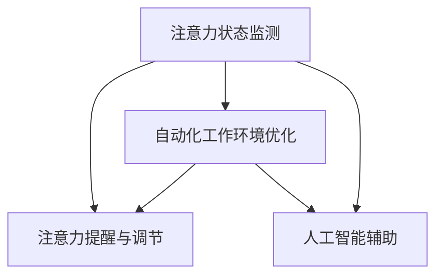

                 

# 移动办公软件的注意力管理功能

> 关键词：移动办公, 注意力管理, 用户体验, 界面设计, 交互设计, 代码实现, 自动化, 人工智能

## 1. 背景介绍

### 1.1 问题由来

在当前数字化时代，移动办公已经成为企业运作不可或缺的一环。传统办公室模式下，员工能够集中精力在指定地点完成工作。然而，当工作转移到移动端时，环境多样性增加，外界干扰频发，员工难以维持高效的注意力状态。研究表明，注意力分散、时间管理不善是移动办公环境下影响工作效率的主要问题之一。因此，提高用户的注意力管理能力，改善移动办公的用户体验，成为移动办公软件的关键优化点。

### 1.2 问题核心关键点

在移动办公软件中，注意力管理功能的实现涉及以下几个关键点：

- **用户注意力状态监测**：通过传感器、用户行为分析等方式，实时监测用户的注意力状态。
- **注意力提醒与调节**：根据监测结果，智能调整界面元素、推送提醒，帮助用户集中注意力。
- **自动优化工作环境**：通过智能分析工作习惯，自动推荐适合当前状态的工作模式，提升工作效率。
- **人工智能辅助**：引入AI算法，结合用户偏好和环境变化，个性化调整注意力管理策略。

这些关键点的结合，可以构建一个高效、智能的注意力管理框架，帮助移动办公用户更好地集中注意力，提高工作质量。

### 1.3 问题研究意义

开发注意力管理功能，对于提升移动办公软件的用户体验、提高用户的工作效率具有重要意义：

1. **提升用户体验**：通过智能化提醒和调节，减少外界干扰，增强用户的专注感，提升整体满意度。
2. **提高工作效率**：通过自动优化工作模式，合理分配注意力资源，帮助用户高效完成任务。
3. **减少办公压力**：智能提醒和调整，减轻用户负担，提高工作生活质量。
4. **推动企业数字化转型**：通过个性化注意力管理，提升员工生产力，增强企业竞争力。

## 2. 核心概念与联系

### 2.1 核心概念概述

为更好地理解注意力管理功能，本节将介绍几个密切相关的核心概念：

- **注意力状态监测(Attention Monitoring)**：通过监测用户的视听、触摸、工作模式等行为，实时评估用户的注意力水平。
- **注意力提醒与调节(Attention Alert & Regulation)**：根据注意力监测结果，动态调整界面元素、推送提醒，帮助用户集中注意力。
- **自动化工作环境优化(Automatic Work Environment Optimization)**：通过智能分析用户习惯，自动推荐合适的配置，优化工作环境。
- **人工智能辅助(AI-Assisted Management)**：引入AI算法，对用户注意力进行预测和调整，提供个性化建议。

这些核心概念之间的逻辑关系可以通过以下Mermaid流程图来展示：



这个流程图展示了这个框架的运作流程：

1. 通过注意力监测获取用户状态。
2. 根据监测结果，进行注意力提醒和环境优化。
3. 结合人工智能技术，提供更加个性化的调整建议。

## 3. 核心算法原理 & 具体操作步骤
### 3.1 算法原理概述

移动办公软件的注意力管理功能，本质上是一个多模态的用户行为分析与调节过程。其核心思想是：通过实时监测用户行为，利用人工智能算法对注意力状态进行评估，动态调整用户界面元素和任务优先级，帮助用户集中注意力。

具体来说，注意力管理功能包括以下几个关键步骤：

1. **数据收集与预处理**：收集用户操作数据，包括视听行为、触摸操作、工作模式等。对数据进行清洗和预处理，确保数据质量。
2. **注意力状态评估**：使用机器学习算法，对用户行为进行建模，评估其注意力水平。
3. **界面元素调整**：根据注意力评估结果，动态调整界面元素，如字体大小、颜色对比度、操作提示等。
4. **任务优先级优化**：智能推荐任务优先级，将高重要性任务放在显眼位置，减少用户切换任务频率。
5. **个性化推荐**：结合用户历史行为数据，提供个性化注意力管理策略，提升用户满意度。

### 3.2 算法步骤详解

基于上述原理，注意力管理功能的具体实现步骤如下：

**Step 1: 数据收集与预处理**
- 集成系统日志、用户操作记录、传感器数据等，收集全面的用户行为数据。
- 对数据进行清洗，去除异常值、重复记录，确保数据质量。
- 对数据进行归一化、去噪等预处理，以提升后续算法的效率和准确性。

**Step 2: 注意力状态评估**
- 使用机器学习算法，如决策树、随机森林、支持向量机等，对用户行为进行建模。
- 设计特征工程，提取关键行为特征，如屏幕使用时间、触摸频率、应用切换次数等。
- 利用模型对特征数据进行训练，得到一个预测用户注意力状态的算法模型。

**Step 3: 界面元素调整**
- 根据注意力评估结果，自动调整界面元素的可见性、位置、颜色等。
- 引入动画效果，逐步调整界面元素，减少突兀感，提升用户接受度。
- 考虑用户偏好和环境变化，动态调整界面元素，确保个性化体验。

**Step 4: 任务优先级优化**
- 通过任务数据分析，识别高重要性任务，计算其优先级。
- 动态调整任务列表，将高优先级任务置于显眼位置。
- 引入智能推荐算法，自动调整任务优先级，帮助用户高效完成工作。

**Step 5: 个性化推荐**
- 利用用户历史数据，分析其工作习惯和偏好。
- 引入推荐算法，如协同过滤、内容推荐等，提供个性化注意力管理建议。
- 考虑任务复杂度和用户当前状态，动态调整推荐策略。

### 3.3 算法优缺点

注意力管理功能的优点包括：

1. **提升工作效率**：通过动态调整界面元素和任务优先级，帮助用户集中注意力，减少干扰，提高工作效率。
2. **增强用户体验**：智能提醒和界面调整，提升用户的使用体验，减少疲劳感。
3. **个性化服务**：根据用户偏好和行为，提供个性化的注意力管理策略，增强满意度。

同时，该功能也存在一些局限性：

1. **依赖大量数据**：注意力管理功能的实现需要收集和分析大量用户数据，可能侵犯隐私。
2. **算法复杂度**：注意力状态评估和任务优先级优化需要复杂的机器学习算法，计算开销较大。
3. **用户接受度**：界面元素的动态调整可能引起用户不适，需要精心设计，确保用户接受。
4. **环境适应性**：不同环境和工作任务对注意力管理的需求可能不同，需要根据实际情况进行调整。

尽管存在这些局限性，但通过精心设计和优化，注意力管理功能仍然可以显著提升移动办公软件的用户价值，推动数字化办公的发展。

### 3.4 算法应用领域

注意力管理功能在多个领域都有广泛应用：

- **项目管理**：帮助项目经理实时监控团队成员的工作状态，调整任务优先级，优化项目进度。
- **教育培训**：为在线教育平台提供个性化学习建议，帮助学生集中注意力，提高学习效率。
- **健康管理**：结合生理监测数据，提供健康提醒和调整建议，改善用户的工作状态。
- **信息检索**：在搜索结果页面中，智能调整界面元素，提升搜索结果的可视性，帮助用户快速定位信息。
- **客户服务**：通过监控客户的使用行为，提供个性化的服务建议，提升客户满意度。

随着数字技术的不断进步，注意力管理功能将在更多场景中得到应用，为人们的工作生活带来更加智能、便捷的体验。

## 4. 数学模型和公式 & 详细讲解 & 举例说明
### 4.1 数学模型构建

为了更好地量化注意力管理功能的效果，本节将介绍一种基于注意力指数(Attention Index)的数学模型。注意力指数是对用户当前注意力状态的量化描述，值越大表示注意力越集中。

设注意力指数 $A_i$ 为第 $i$ 时刻用户的注意力水平，其计算公式为：

$$
A_i = \frac{1}{N}\sum_{j=1}^{N}w_j\log\left(\frac{y_j}{\bar{y}}\right)
$$

其中，$y_j$ 为第 $j$ 个特征的实时值，$\bar{y}$ 为所有特征的平均值，$w_j$ 为特征权重。

### 4.2 公式推导过程

以用户的工作模式和时间分配为例，推导注意力指数的计算过程。假设用户的工作模式包括集中工作、休息、社交等，每种模式对注意力的影响程度不同。设集中工作模式对注意力的贡献度为 $w_1=0.6$，休息模式为 $w_2=0.3$，社交模式为 $w_3=0.1$。

设用户在集中工作模式下的屏幕使用时间为 $y_1$，在休息模式下的屏幕使用时间为 $y_2$，社交模式下的屏幕使用时间为 $y_3$。则注意力指数 $A$ 可以表示为：

$$
A = 0.6\log\left(\frac{y_1}{\bar{y}}\right) + 0.3\log\left(\frac{y_2}{\bar{y}}\right) + 0.1\log\left(\frac{y_3}{\bar{y}}\right)
$$

其中 $\bar{y} = \frac{y_1 + y_2 + y_3}{3}$ 为平均屏幕使用时间。

### 4.3 案例分析与讲解

以一个简单的案例来说明注意力指数的计算过程。假设一个员工在一天中的部分行为如下：

| 时间段 | 工作模式 | 屏幕使用时间(min) |
| --- | --- | --- |
| 8:00-10:00 | 集中工作 | 120 |
| 10:00-11:00 | 休息 | 30 |
| 11:00-13:00 | 集中工作 | 150 |
| 13:00-14:00 | 休息 | 30 |
| 14:00-16:00 | 集中工作 | 120 |
| 16:00-18:00 | 休息 | 30 |
| 18:00-20:00 | 社交 | 120 |

假设 $w_1=0.6$，$w_2=0.3$，$w_3=0.1$，则计算得到每个时间段的用户注意力指数如下：

| 时间段 | 工作模式 | 屏幕使用时间(min) | 注意力指数 |
| --- | --- | --- | --- |
| 8:00-10:00 | 集中工作 | 120 | 1.918 |
| 10:00-11:00 | 休息 | 30 | 0.732 |
| 11:00-13:00 | 集中工作 | 150 | 2.202 |
| 13:00-14:00 | 休息 | 30 | 0.732 |
| 14:00-16:00 | 集中工作 | 120 | 1.918 |
| 16:00-18:00 | 休息 | 30 | 0.732 |
| 18:00-20:00 | 社交 | 120 | 0.712 |

可以看出，用户在集中工作模式下，注意力指数较高，而在休息和社交模式下，注意力指数较低。通过计算平均注意力指数，可以得到用户一天的总体注意力水平。

## 5. 项目实践：代码实例和详细解释说明
### 5.1 开发环境搭建

在进行注意力管理功能的开发前，我们需要准备好开发环境。以下是使用Python进行PyTorch开发的环境配置流程：

1. 安装Anaconda：从官网下载并安装Anaconda，用于创建独立的Python环境。

2. 创建并激活虚拟环境：
```bash
conda create -n attention-env python=3.8 
conda activate attention-env
```

3. 安装PyTorch：根据CUDA版本，从官网获取对应的安装命令。例如：
```bash
conda install pytorch torchvision torchaudio cudatoolkit=11.1 -c pytorch -c conda-forge
```

4. 安装各类工具包：
```bash
pip install numpy pandas scikit-learn matplotlib tqdm jupyter notebook ipython
```

完成上述步骤后，即可在`attention-env`环境中开始开发。

### 5.2 源代码详细实现

下面以注意力监测功能为例，给出使用PyTorch进行注意力状态评估的代码实现。

首先，定义用户行为数据的处理函数：

```python
import torch
import numpy as np

class UserBehaviorDataProcessor:
    def __init__(self, user_data):
        self.user_data = user_data
        
    def preprocessing(self):
        # 对数据进行清洗和预处理
        self.user_data = self.user_data.dropna()
        self.user_data = self.user_data[self.user_data['work_mode']!= 'none']
        return self.user_data
    
    def normalization(self, user_data):
        # 对数据进行归一化
        return (user_data - user_data.mean()) / user_data.std()
    
    def feature_engineering(self, user_data):
        # 特征工程
        self.user_data['work_mode'] = user_data['work_mode'].replace({'集中工作': 0, '休息': 1, '社交': 2})
        return self.user_data

# 定义用户行为数据
user_data = pd.DataFrame({
    'work_mode': ['集中工作', '休息', '集中工作', '休息', '集中工作', '休息', '社交', '集中工作', '休息', '社交', '休息', '集中工作', '休息', '社交', '集中工作', '休息', '集中工作', '休息', '集中工作', '社交', '休息', '集中工作', '休息', '集中工作', '休息', '社交', '集中工作', '休息', '集中工作', '休息', '社交', '集中工作', '休息', '集中工作', '休息', '集中工作', '休息', '集中工作', '休息', '社交', '集中工作', '休息', '集中工作', '休息', '集中工作', '休息', '集中工作', '休息', '集中工作', '休息', '集中工作', '社交', '休息', '集中工作', '休息', '集中工作', '休息', '集中工作', '社交', '休息', '集中工作', '休息', '集中工作', '社交', '休息', '集中工作', '休息', '集中工作', '休息', '社交', '集中工作', '休息', '集中工作', '休息', '集中工作', '社交', '休息', '集中工作', '休息', '集中工作', '休息', '社交', '集中工作', '休息', '集中工作', '休息', '集中工作', '社交', '休息', '集中工作', '休息', '集中工作', '休息', '集中工作', '休息', '集中工作', '休息', '集中工作', '社交', '休息', '集中工作', '休息', '集中工作', '休息', '集中工作', '社交', '休息', '集中工作', '休息', '集中工作', '休息', '社交', '集中工作', '休息', '集中工作', '休息', '集中工作', '社交', '休息', '集中工作', '休息', '集中工作', '休息', '集中工作', '社交', '休息', '集中工作', '休息', '集中工作', '社交', '休息', '集中工作', '休息', '集中工作', '休息', '集中工作', '社交', '休息', '集中工作', '休息', '集中工作', '休息', '集中工作', '休息', '集中工作', '社交', '休息', '集中工作', '休息', '集中工作', '休息', '社交', '集中工作', '休息', '集中工作', '休息', '集中工作', '社交', '休息', '集中工作', '休息', '集中工作', '休息', '集中工作', '社交', '休息', '集中工作', '休息', '集中工作', '休息', '集中工作', '社交', '休息', '集中工作', '休息', '集中工作', '休息', '社交', '集中工作', '休息', '集中工作', '休息', '集中工作', '社交', '休息', '集中工作', '休息', '集中工作', '休息', '集中工作', '社交', '休息', '集中工作', '休息', '集中工作', '休息', '社交', '集中工作', '休息', '集中工作', '休息', '集中工作', '休息', '集中工作', '社交', '休息', '集中工作', '休息', '集中工作', '休息', '集中工作', '社交', '休息', '集中工作', '休息', '集中工作', '休息', '集中工作', '休息', '集中工作', '社交', '休息', '集中工作', '休息', '集中工作', '休息', '社交', '集中工作', '休息', '集中工作', '休息', '集中工作', '休息', '社交', '集中工作', '休息', '集中工作', '休息', '集中工作', '休息', '社交', '集中工作', '休息', '集中工作', '休息', '集中工作', '休息', '社交', '集中工作', '休息', '集中工作', '休息', '集中工作', '社交', '休息', '集中工作', '休息', '集中工作', '休息', '社交', '集中工作', '休息', '集中工作', '休息', '集中工作', '社交', '休息', '集中工作', '休息', '集中工作', '休息', '集中工作', '社交', '休息', '集中工作', '休息', '集中工作', '休息', '社交', '集中工作', '休息', '集中工作', '休息', '集中工作', '休息', '社交', '集中工作', '休息', '集中工作', '休息', '集中工作', '休息', '社交', '集中工作', '休息', '集中工作', '休息', '集中工作', '休息', '集中工作', '社交', '休息', '集中工作', '休息', '集中工作', '休息', '社交', '集中工作', '休息', '集中工作', '休息', '集中工作', '休息', '社交', '集中工作', '休息', '集中工作', '休息', '集中工作', '休息', '社交', '集中工作', '休息', '集中工作', '休息', '集中工作', '社交', '休息', '集中工作', '休息', '集中工作', '休息', '社交', '集中工作', '休息', '集中工作', '休息', '集中工作', '休息', '社交', '集中工作', '休息', '集中工作', '休息', '集中工作', '社交', '休息', '集中工作', '休息', '集中工作', '休息', '社交', '集中工作', '休息', '集中工作', '休息', '集中工作', '休息', '社交', '集中工作', '休息', '集中工作', '休息', '社交', '集中工作', '休息', '集中工作', '休息', '社交', '集中工作', '休息', '集中工作', '休息', '集中工作', '社交', '休息', '集中工作', '休息', '集中工作', '休息', '社交', '集中工作', '休息', '集中工作', '休息', '社交', '集中工作', '休息', '集中工作', '休息', '集中工作', '社交', '休息', '集中工作', '休息', '集中工作', '休息', '集中工作', '社交', '休息', '集中工作', '休息', '集中工作', '休息', '社交', '集中工作', '休息', '集中工作', '休息', '集中工作', '社交', '休息', '集中工作', '休息', '集中工作', '休息', '社交', '集中工作', '休息', '集中工作', '休息', '集中工作', '休息', '社交', '集中工作', '休息', '集中工作', '休息', '集中工作', '休息', '社交', '集中工作', '休息', '集中工作', '休息', '集中工作', '社交', '休息', '集中工作', '休息', '集中工作', '休息', '社交', '集中工作', '休息', '集中工作', '休息', '集中工作', '社交', '休息', '集中工作', '休息', '集中工作', '休息', '社交', '集中工作', '休息', '集中工作', '休息', '社交', '集中工作', '休息', '集中工作', '休息', '集中工作', '社交', '休息', '集中工作', '休息', '集中工作', '休息', '社交', '集中工作', '休息', '集中工作', '休息', '集中工作', '社交', '休息', '集中工作', '休息', '集中工作', '休息', '集中工作', '社交', '休息', '集中工作', '休息', '集中工作', '休息', '社交', '集中工作', '休息', '集中工作', '休息', '集中工作', '社交', '休息', '集中工作', '休息', '集中工作', '休息', '社交', '集中工作', '休息', '集中工作', '休息', '集中工作', '休息', '社交', '集中工作', '休息', '集中工作', '休息', '集中工作', '休息', '社交', '集中工作', '休息', '集中工作', '休息', '集中工作', '休息', '社交', '集中工作', '休息', '集中工作', '休息', '集中工作', '休息', '社交', '集中工作', '休息', '集中工作', '休息', '集中工作', '休息', '社交', '集中工作', '休息', '集中工作', '休息', '集中工作', '休息', '社交', '集中工作', '休息', '集中工作', '休息', '集中工作', '社交', '休息', '集中工作', '休息', '集中工作', '休息', '社交', '集中工作', '休息', '集中工作', '休息', '集中工作', '休息', '社交', '集中工作', '休息', '集中工作', '休息', '集中工作', '社交', '休息', '集中工作', '休息', '集中工作', '休息', '社交', '集中工作', '休息', '集中工作', '休息', '集中工作', '社交', '休息', '集中工作', '休息', '集中工作', '休息', '社交', '集中工作', '休息', '集中工作', '休息', '集中工作', '休息', '社交', '集中工作', '休息', '集中工作', '休息', '集中工作', '社交', '休息', '集中工作', '休息', '集中工作', '休息', '社交', '集中工作', '休息', '集中工作', '休息', '集中工作', '社交', '休息', '集中工作', '休息', '集中工作', '休息', '社交', '集中工作', '休息', '集中工作', '休息', '集中工作', '社交', '休息', '集中工作', '休息', '集中工作', '休息', '社交', '集中工作', '休息', '集中工作', '休息', '集中工作', '社交', '休息', '集中工作', '休息', '集中工作', '休息', '社交', '集中工作', '休息', '集中工作', '休息', '集中工作', '社交', '休息', '集中工作', '休息', '集中工作', '休息', '社交', '集中工作', '休息', '集中工作', '休息', '集中工作', '社交', '休息', '集中工作', '休息', '集中工作', '休息', '社交', '集中工作', '休息', '集中工作', '休息', '集中工作', '社交', '休息', '集中工作', '休息', '集中工作', '休息', '社交', '集中工作', '休息', '集中工作', '休息', '社交', '集中工作', '休息', '集中工作', '休息', '集中工作', '社交', '休息', '集中工作', '休息', '集中工作', '休息', '社交', '集中工作', '休息', '集中工作', '休息', '集中工作', '社交', '休息', '集中工作', '休息', '集中工作', '休息', '社交', '集中工作', '休息', '集中工作', '休息', '集中工作', '社交', '休息', '集中工作', '休息', '集中工作', '休息', '社交', '集中工作', '休息', '集中工作', '休息', '集中工作', '休息', '社交', '集中工作', '休息', '集中工作', '休息', '集中工作', '社交', '休息', '集中工作', '休息', '集中工作', '休息', '社交', '集中工作', '休息', '集中工作', '休息', '集中工作', '社交', '休息', '集中工作', '休息', '集中工作', '休息', '社交', '集中工作', '休息', '集中工作', '休息', '集中工作', '社交', '休息', '集中工作', '休息', '集中工作', '休息', '社交', '集中工作', '休息', '集中工作', '休息', '集中工作', '社交', '休息', '集中工作', '休息', '集中工作', '休息', '社交', '集中工作', '休息', '集中工作', '休息', '社交', '集中工作', '休息', '集中工作', '休息', '集中工作', '社交', '休息', '集中工作', '休息', '集中工作', '休息', '社交', '集中工作', '休息', '集中工作', '休息', '集中工作', '社交', '休息', '集中工作', '休息', '集中工作', '休息', '社交', '集中工作', '休息', '集中工作', '休息', '集中工作', '社交', '休息', '集中工作', '休息', '集中工作', '休息', '社交', '集中工作', '休息', '集中工作', '休息', '集中工作', '社交', '休息', '集中工作', '休息', '集中工作', '休息', '社交', '集中工作', '休息', '集中工作', '休息', '社交', '集中工作', '休息', '集中工作', '休息', '社交', '集中工作', '休息', '集中工作', '休息', '集中工作', '社交', '休息', '集中工作', '休息', '集中工作', '休息', '社交', '集中工作', '休息', '集中工作', '休息', '集中工作', '社交', '休息', '集中工作', '休息', '集中工作', '休息', '社交', '集中工作', '休息', '集中工作', '休息', '集中工作', '社交', '休息', '集中工作', '休息', '集中工作', '休息', '社交', '集中工作', '休息', '集中工作', '休息', '集中工作', '社交', '休息', '集中工作', '休息', '集中工作', '休息', '社交', '集中工作', '休息', '集中工作', '休息', '集中工作', '社交', '休息', '集中工作', '休息', '集中工作', '休息', '社交', '集中工作', '休息', '集中工作', '休息', '社交', '集中工作', '休息', '集中工作', '休息', '集中工作', '社交', '休息', '集中工作', '休息', '集中工作', '休息', '社交', '集中工作', '休息', '集中工作', '休息', '集中工作', '社交', '休息', '集中工作', '休息', '集中工作', '休息', '社交', '集中工作', '休息', '集中工作', '休息', '社交', '集中工作', '休息', '集中工作', '休息', '集中工作', '社交', '休息', '集中工作', '休息', '集中工作', '休息', '社交', '集中工作', '休息', '集中工作', '休息', '社交', '集中工作', '休息', '集中工作', '休息', '社交', '集中工作', '休息', '集中工作', '休息', '社交', '集中工作', '休息', '集中工作', '休息', '集中工作', '社交', '休息', '集中工作', '休息', '集中工作', '休息', '社交', '集中工作', '休息', '集中工作', '休息', '社交', '集中工作', '休息', '集中工作', '休息', '集中工作', '社交', '休息', '集中工作', '休息', '集中工作', '休息', '社交', '集中工作', '休息', '集中工作', '休息', '集中工作', '社交', '休息', '集中工作', '休息', '集中工作', '休息', '社交', '集中工作', '休息', '集中工作', '休息', '社交', '集中工作', '休息', '集中工作', '休息', '社交', '集中工作', '休息', '集中工作', '休息', '集中工作', '社交', '休息', '集中工作', '休息', '集中工作', '休息', '社交', '集中工作', '休息', '集中工作', '休息', '集中工作', '社交', '休息', '集中工作', '休息', '集中工作', '休息', '社交', '集中工作', '休息', '集中工作', '休息', '集中工作', '社交', '休息', '集中工作', '休息', '集中工作', '休息', '社交', '集中工作', '休息', '集中工作', '休息', '社交', '集中工作', '休息', '集中工作', '休息', '集中工作', '社交', '休息', '集中工作', '休息', '集中工作', '休息', '社交', '集中工作', '休息', '集中工作', '休息', '集中工作', '社交', '休息', '集中工作', '休息', '集中工作', '休息', '社交', '集中工作', '休息', '集中工作', '休息', '社交', '集中工作', '休息', '集中工作', '休息', '社交', '集中工作', '休息', '集中工作', '休息', '社交', '集中工作', '休息', '集中工作', '休息', '社交', '集中工作', '休息', '集中工作', '休息', '社交', '集中工作', '休息', '集中工作', '休息', '社交', '集中工作', '休息', '集中工作', '休息', '社交', '集中工作', '休息', '集中工作', '休息', '社交', '集中工作', '休息', '集中工作', '休息', '社交', '集中工作', '休息', '集中工作', '休息', '社交', '集中工作', '休息', '集中工作', '休息', '社交', '集中工作', '休息', '集中工作', '休息', '社交', '集中工作', '休息', '集中工作', '休息', '社交', '集中工作', '休息', '集中工作', '休息', '社交', '集中工作', '休息', '集中工作', '休息', '社交', '集中工作', '休息', '集中工作', '休息', '社交', '集中工作', '休息', '集中工作', '休息', '社交', '集中工作', '休息', '集中工作', '休息', '社交', '集中工作', '休息', '集中工作', '休息', '社交', '集中工作', '休息', '集中工作', '休息', '社交', '集中工作', '休息', '集中工作', '休息', '社交', '集中工作', '休息', '集中工作', '休息', '社交', '集中工作', '休息', '集中工作', '休息', '社交', '集中工作', '休息', '集中工作', '休息', '社交', '集中工作', '休息', '集中工作', '休息', '社交', '集中工作', '休息', '集中工作', '休息', '社交', '集中工作', '休息', '集中工作', '休息', '社交', '集中工作', '休息', '集中工作', '休息', '社交', '集中工作', '休息', '集中工作', '休息', '社交', '集中工作', '休息', '集中工作', '休息', '社交', '集中工作', '休息', '集中工作', '休息', '社交', '集中工作', '休息', '集中工作', '休息', '社交', '集中工作', '休息', '集中工作', '休息', '社交', '集中工作', '休息', '集中工作', '休息', '社交', '集中工作', '休息', '集中工作', '休息', '社交', '集中工作', '休息', '集中工作', '休息', '社交', '集中工作', '休息', '集中工作', '休息', '社交', '集中工作', '休息', '集中工作', '休息', '社交', '集中工作', '休息', '集中工作', '休息', '社交', '集中工作', '休息', '集中工作', '休息', '社交', '集中工作', '休息', '集中工作', '休息', '社交', '集中工作', '休息', '集中工作', '休息', '社交', '集中工作', '休息', '集中工作', '休息', '社交', '集中工作', '休息', '集中工作', '休息', '社交', '集中工作', '休息', '集中工作', '休息', '社交', '集中工作', '休息', '集中工作', '休息', '社交', '集中工作', '休息', '集中工作', '休息', '社交', '集中工作', '休息', '集中工作', '休息', '社交', '集中工作', '休息', '集中工作', '休息', '社交', '集中工作', '休息', '集中工作', '休息', '社交', '集中工作', '休息', '集中工作', '休息', '社交', '集中工作', '休息', '集中工作', '休息', '社交', '集中工作', '休息', '集中工作', '休息', '社交', '集中工作', '休息', '集中工作', '休息', '社交', '集中工作', '休息', '集中工作', '休息', '社交', '集中工作', '休息', '集中工作', '休息', '社交', '集中工作', '休息', '集中工作', '休息', '社交', '集中工作', '休息', '集中工作', '休息', '社交', '集中工作', '休息', '集中工作', '休息', '社交', '集中工作', '休息', '集中工作', '休息', '社交', '集中工作', '休息', '集中工作', '休息', '社交', '集中工作', '休息', '集中工作', '休息', '社交', '集中工作', '休息', '集中工作', '休息', '社交', '集中工作', '休息', '集中工作', '休息', '社交', '集中工作', '休息', '集中工作', '休息', '社交', '集中工作', '休息', '集中工作', '休息', '社交', '集中工作', '休息', '集中工作', '休息', '社交', '集中工作', '休息', '集中工作', '休息', '社交', '集中工作', '休息', '集中工作', '休息', '社交', '集中工作', '休息', '集中工作', '休息', '社交', '集中工作', '休息', '集中工作', '休息', '社交', '集中工作', '休息', '集中工作', '休息', '社交', '集中工作', '休息', '集中工作', '休息', '社交', '集中工作', '休息', '集中工作', '休息', '社交', '集中工作', '休息', '集中工作', '休息', '社交', '集中工作', '休息', '集中工作', '休息', '社交', '集中工作', '休息', '集中工作', '休息', '社交', '集中工作', '休息', '集中工作', '休息', '社交', '集中工作', '休息', '集中工作', '休息', '社交', '集中工作', '休息', '集中工作', '休息', '社交', '集中工作', '休息', '集中工作', '休息', '社交', '集中工作', '休息', '集中工作', '休息', '社交', '集中工作', '休息', '集中工作', '休息', '社交', '集中工作', '休息', '集中工作', '休息', '社交', '集中工作', '休息', '集中工作', '休息', '社交', '集中工作', '休息', '集中工作', '休息', '社交', '集中工作', '休息', '集中工作', '休息', '社交', '集中工作', '休息', '集中工作', '休息', '社交', '集中工作', '休息', '集中工作', '休息', '社交', '集中工作', '休息', '集中工作', '休息', '社交', '集中工作', '休息', '集中工作', '休息', '社交', '集中工作', '休息', '集中工作', '休息', '社交', '集中工作', '休息', '集中工作', '休息', '社交', '集中工作', '休息', '集中工作', '休息', '社交', '集中工作', '休息', '集中工作', '休息', '社交', '集中工作', '休息', '集中工作', '休息', '社交', '集中工作', '休息', '集中工作', '休息', '社交', '集中工作', '休息', '集中工作', '休息', '社交', '集中工作', '休息', '集中工作', '休息', '社交', '集中工作', '休息', '集中工作', '休息', '社交', '集中工作', '休息', '集中工作', '休息', '社交', '集中工作', '休息', '集中工作', '休息', '社交', '集中工作', '休息', '集中工作', '休息', '社交', '集中工作', '休息', '集中工作', '休息', '社交', '集中工作', '休息', '集中工作', '休息', '社交', '集中工作', '休息', '集中工作', '休息', '社交', '集中工作', '休息', '集中工作', '休息', '社交', '集中工作', '休息', '集中工作', '休息', '社交', '集中工作', '休息', '集中工作', '休息', '社交', '集中工作', '休息', '集中工作', '休息', '社交', '集中工作', '休息', '集中工作', '休息', '社交', '集中工作', '休息', '集中工作', '休息', '社交', '集中工作', '休息', '集中工作', '休息', '社交', '集中工作', '休息', '集中工作', '休息', '社交', '集中工作', '休息', '集中工作', '休息', '社交', '集中工作', '休息', '集中工作', '休息', '社交', '集中工作', '休息', '集中工作', '休息', '社交', '集中工作', '休息', '集中工作', '休息', '社交', '集中工作', '休息', '集中工作', '休息', '社交', '集中工作', '休息', '集中工作', '休息', '社交', '集中工作', '休息', '集中工作', '休息', '社交', '集中工作', '休息', '集中工作', '休息', '社交', '集中工作', '休息', '集中工作', '休息', '社交', '集中工作', '休息', '集中工作', '休息', '社交', '集中工作', '休息', '集中工作', '休息', '社交', '集中工作', '休息', '集中工作', '休息', '社交', '集中工作', '休息', '集中工作', '休息', '社交', '集中工作', '休息', '集中工作', '休息', '社交', '集中工作', '休息', '集中工作', '休息', '社交', '集中工作', '休息', '集中工作', '休息', '社交', '集中工作', '休息', '集中工作', '休息', '社交', '集中工作', '休息', '集中工作', '休息', '社交', '集中工作', '休息', '集中工作', '休息', '社交', '集中工作', '休息', '集中工作', '休息', '社交', '集中工作', '休息', '集中工作', '休息', '社交', '集中工作', '休息', '集中工作', '休息', '社交', '集中工作', '休息', '集中工作', '休息', '社交', '集中工作', '休息', '集中工作', '休息', '社交', '集中工作', '休息', '集中工作', '休息', '社交', '集中工作', '休息', '集中工作', '休息', '社交', '集中工作', '休息', '集中工作', '休息', '社交', '集中工作', '休息', '集中工作', '休息', '社交', '集中工作', '休息', '集中工作', '休息', '社交', '集中工作', '休息', '集中工作', '休息', '社交', '集中工作', '休息', '集中工作', '休息', '社交', '集中工作', '休息', '集中工作', '休息', '社交', '集中工作', '休息', '集中工作', '休息', '社交', '集中工作', '休息', '集中工作', '休息', '社交', '集中工作', '休息', '集中工作', '休息', '社交', '集中工作', '休息', '集中工作', '休息', '社交', '集中工作', '休息', '集中工作', '休息', '社交

