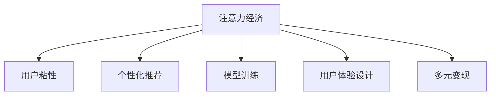

                 

# 移动直播平台的注意力经济运营策略

## 1. 背景介绍

### 1.1 问题由来
在移动互联网时代，直播平台成为吸引用户注意力、创造用户价值的重要阵地。随着短视频、短视频直播等形式不断涌现，各大直播平台竞相布局，用户注意力逐渐分散，竞争日趋激烈。如何在流量红利渐失、广告主预算有限的情况下，精准运营，实现用户价值的最大化，是移动直播平台面临的核心问题。

### 1.2 问题核心关键点
移动直播平台的注意力经济运营，关键在于通过数据分析、算法优化、用户体验设计等手段，将用户注意力高效转化为平台价值。具体而言，包括以下几个关键点：

- **数据驱动**：利用平台用户行为数据，挖掘用户兴趣和消费偏好，实现精准推荐。
- **算法优化**：通过模型训练和优化，提升推荐效果，提高用户粘性。
- **用户体验**：优化界面设计、交互流程、直播内容等，提升用户满意度和使用时长。
- **多元变现**：通过广告、会员、打赏等多种形式，最大化平台收益。

### 1.3 问题研究意义
通过系统的运营策略分析，帮助直播平台理解用户需求，优化资源配置，实现用户价值和平台收益的双重提升。这对于推动移动直播平台向精细化、差异化、可持续化方向发展具有重要意义。

## 2. 核心概念与联系

### 2.1 核心概念概述

为更好地理解移动直播平台的注意力经济运营策略，本节将介绍几个关键概念：

- **注意力经济**：以用户注意力为商品，通过吸引和保持用户注意力来创造经济价值。
- **用户粘性**：用户对平台的依赖程度和停留时间，是衡量平台竞争力的重要指标。
- **个性化推荐**：根据用户历史行为和兴趣偏好，推荐符合用户需求的内容或商品。
- **模型训练**：通过算法训练模型，提高推荐精准度和效率。
- **用户体验设计**：提升界面设计、交互流程、内容推荐等，满足用户期望，增强用户粘性。
- **多元变现**：通过广告、会员、打赏等多种渠道实现平台收益最大化。

这些核心概念之间的逻辑关系可以通过以下Mermaid流程图来展示：



这个流程图展示了这个框架中各个概念的关联关系：

1. 注意力经济以用户粘性为核心，通过个性化推荐、模型训练、用户体验设计等手段，最大化平台收益。
2. 个性化推荐利用用户数据和算法模型，提高内容或商品推荐的精准度。
3. 模型训练通过算法优化，提高推荐模型的效果。
4. 用户体验设计通过界面优化、交互设计等手段，提升用户满意度和使用时长。
5. 多元变现通过广告、会员、打赏等渠道，实现平台收益的多元化。

## 3. 核心算法原理 & 具体操作步骤
### 3.1 算法原理概述

移动直播平台的注意力经济运营策略，基于对用户注意力数据的分析和挖掘。其核心思想是通过对用户历史行为数据的学习，预测用户的未来行为，从而制定个性化的推荐策略，提高用户粘性和平台收益。

具体而言，包括以下几个关键步骤：

1. **数据收集与预处理**：收集平台用户的行为数据，如浏览、互动、消费等，进行清洗、归一化等预处理操作。
2. **特征工程**：从用户数据中提取有意义的特征，如兴趣标签、行为时间、消费金额等。
3. **模型训练**：利用机器学习算法训练模型，预测用户行为，如点击、购买等。
4. **推荐系统**：根据用户行为预测结果，生成个性化推荐，如视频、商品等。
5. **优化与迭代**：不断优化推荐算法和模型，提升推荐效果和用户体验。

### 3.2 算法步骤详解

以视频推荐系统为例，详细介绍基于深度学习的推荐算法步骤：

**Step 1: 数据收集与预处理**
- 收集平台用户的行为数据，包括观看视频的行为记录，如视频ID、观看时间、互动操作等。
- 对数据进行清洗、去重、归一化等操作，去除异常值和噪声，确保数据质量。

**Step 2: 特征工程**
- 从视频数据中提取关键特征，如视频ID、时长、类型、标签等。
- 从用户数据中提取关键特征，如用户ID、观看历史、互动行为、消费记录等。
- 对视频和用户特征进行组合和编码，生成输入向量。

**Step 3: 模型训练**
- 选择合适的深度学习模型，如基于CNN、RNN、LSTM等的视频推荐模型。
- 划分训练集、验证集和测试集，使用交叉验证等方法优化模型。
- 调整模型参数，如学习率、正则化系数、批次大小等，使用Adam等优化器。
- 在验证集上调整模型，避免过拟合，使用Early Stopping等技术。

**Step 4: 推荐系统生成**
- 将输入向量输入训练好的推荐模型，得到每个用户对每个视频的推荐分数。
- 利用分数计算推荐排序，生成个性化推荐视频列表。
- 将推荐结果推送到前端界面，供用户浏览和选择。

**Step 5: 优化与迭代**
- 收集用户对推荐结果的反馈数据，如点击率、观看时间等。
- 对模型进行迭代优化，调整特征提取方式、模型结构等。
- 不断改进推荐算法，引入对抗训练、数据增强等技术，提升推荐效果。

### 3.3 算法优缺点

基于深度学习的推荐算法具有以下优点：

- **高精度**：深度学习模型能够捕捉复杂的非线性关系，提升推荐精准度。
- **可扩展性**：通过增加模型层数和参数，可以处理更多维度的特征数据。
- **实时性**：基于深度学习的推荐模型能够实时处理用户行为数据，快速生成推荐结果。

然而，该算法也存在以下缺点：

- **高成本**：深度学习模型需要大量的标注数据和计算资源，构建和维护成本较高。
- **复杂性**：模型参数较多，容易过拟合，需要大量的超参数调优。
- **解释性不足**：深度学习模型黑盒特性，难以解释推荐结果的逻辑。

### 3.4 算法应用领域

基于深度学习的推荐算法，广泛应用于各类互联网平台，如电商平台、视频平台、社交平台等。在移动直播平台中，其可以应用于以下场景：

- **视频播放推荐**：根据用户观看历史和行为数据，推荐相关的视频内容。
- **主播推荐**：根据用户互动行为和偏好，推荐适合的直播主播。
- **互动内容推荐**：根据用户互动操作，推荐有趣的互动活动或话题。
- **广告推荐**：根据用户兴趣和行为，推荐适合的广告内容。

这些应用场景不仅提升了用户体验，还为平台带来了丰富的商业价值。

## 4. 数学模型和公式 & 详细讲解  
### 4.1 数学模型构建

本节将使用数学语言对基于深度学习的推荐系统进行更加严格的刻画。

记用户行为数据为 $\mathcal{X}$，视频特征为 $\mathcal{Y}$。设用户对视频的评分函数为 $f: \mathcal{X} \times \mathcal{Y} \rightarrow [0,1]$。推荐系统目标是最大化用户满意度，即最大化期望评分函数：

$$
\max_{f} \mathbb{E}_{x,y}[f(x,y)]
$$

在实践中，一般通过历史行为数据对模型进行训练，使用均方误差损失函数来最小化实际评分与期望评分之间的差异：

$$
\min_{f} \frac{1}{N}\sum_{i=1}^N (y_i - f(x_i))^2
$$

其中 $(x_i, y_i)$ 表示第 $i$ 个用户行为数据和对应的评分。

### 4.2 公式推导过程

考虑使用基于深度神经网络的推荐模型，其输入为 $x \in \mathcal{X}$，输出为 $y \in \mathcal{Y}$。假设模型参数为 $\theta$，则推荐函数 $f(x,y)$ 可以表示为：

$$
f(x,y; \theta) = \sigma(\theta \cdot \phi(x) \cdot \phi(y))
$$

其中 $\phi: \mathcal{X} \rightarrow \mathbb{R}^d$ 和 $\phi: \mathcal{Y} \rightarrow \mathbb{R}^d$ 为特征映射，$\sigma: \mathbb{R} \rightarrow [0,1]$ 为激活函数。

对于用户 $x$ 和视频 $y$，其推荐分数 $f(x,y)$ 可以表示为：

$$
f(x,y) = \sigma(\theta^T \phi(x) \cdot \phi(y))
$$

其中 $\theta$ 为模型参数。

将上述推荐函数代入损失函数，得到：

$$
\mathcal{L}(\theta) = \frac{1}{N}\sum_{i=1}^N (y_i - f(x_i,y_i))^2
$$

优化目标为最小化损失函数，即：

$$
\theta^* = \mathop{\arg\min}_{\theta} \mathcal{L}(\theta)
$$

在优化过程中，一般使用梯度下降算法，更新参数 $\theta$：

$$
\theta \leftarrow \theta - \eta \nabla_{\theta}\mathcal{L}(\theta)
$$

其中 $\eta$ 为学习率。

### 4.3 案例分析与讲解

以推荐模型中的常见模型为例，介绍其核心思路和应用。

**基于矩阵分解的推荐模型**

矩阵分解推荐模型利用用户行为数据 $X$ 和商品特征矩阵 $Y$，通过低秩矩阵分解来预测用户对商品的评分。

设 $X \in \mathbb{R}^{N \times D}$ 为用户行为矩阵，$Y \in \mathbb{R}^{D \times K}$ 为商品特征矩阵，$Z \in \mathbb{R}^{N \times K}$ 为推荐矩阵。推荐模型的优化目标为：

$$
\min_{Z} \frac{1}{N}\sum_{i=1}^N (y_i - Zx_i)^2
$$

其中 $y_i$ 为用户对商品的实际评分，$x_i$ 为用户行为特征向量。

**基于深度神经网络的推荐模型**

基于深度神经网络的推荐模型利用用户行为数据 $X$ 和商品特征矩阵 $Y$，通过深度神经网络模型来预测用户对商品的评分。

设 $X \in \mathbb{R}^{N \times D}$ 为用户行为矩阵，$Y \in \mathbb{R}^{D \times K}$ 为商品特征矩阵，$Z \in \mathbb{R}^{N \times K}$ 为推荐矩阵。推荐模型的优化目标为：

$$
\min_{Z} \frac{1}{N}\sum_{i=1}^N (y_i - f(x_i,y_i))^2
$$

其中 $y_i$ 为用户对商品的实际评分，$x_i$ 为用户行为特征向量，$f(x_i,y_i)$ 为推荐模型预测评分函数。

## 5. 项目实践：代码实例和详细解释说明
### 5.1 开发环境搭建

在进行推荐系统开发前，我们需要准备好开发环境。以下是使用Python进行PyTorch开发的环境配置流程：

1. 安装Anaconda：从官网下载并安装Anaconda，用于创建独立的Python环境。

2. 创建并激活虚拟环境：
```bash
conda create -n recsys-env python=3.8 
conda activate recsys-env
```

3. 安装PyTorch：根据CUDA版本，从官网获取对应的安装命令。例如：
```bash
conda install pytorch torchvision torchaudio cudatoolkit=11.1 -c pytorch -c conda-forge
```

4. 安装TensorFlow：由Google主导开发的开源深度学习框架，生产部署方便，适合大规模工程应用。同样有丰富的预训练语言模型资源。

5. 安装各类工具包：
```bash
pip install numpy pandas scikit-learn matplotlib tqdm jupyter notebook ipython
```

完成上述步骤后，即可在`recsys-env`环境中开始推荐系统开发。

### 5.2 源代码详细实现

这里我们以基于深度学习的推荐模型为例，给出使用PyTorch进行视频推荐系统的PyTorch代码实现。

首先，定义推荐系统的核心函数：

```python
from torch import nn, nn.functional as F
from torch.utils.data import DataLoader
import torch

class Recommender(nn.Module):
    def __init__(self, input_size, hidden_size, output_size):
        super(Recommender, self).__init__()
        self.hidden = nn.Sequential(
            nn.Linear(input_size, hidden_size),
            nn.ReLU(),
            nn.Linear(hidden_size, hidden_size),
            nn.ReLU(),
            nn.Linear(hidden_size, output_size)
        )
    
    def forward(self, x):
        return self.hidden(x)

# 定义模型超参数
input_size = 100
hidden_size = 256
output_size = 1

# 创建模型
model = Recommender(input_size, hidden_size, output_size)

# 定义损失函数
criterion = nn.MSELoss()

# 定义优化器
optimizer = torch.optim.Adam(model.parameters(), lr=0.001)

# 定义数据集
X_train = torch.randn(1000, input_size)
y_train = torch.randn(1000, output_size)
X_val = torch.randn(200, input_size)
y_val = torch.randn(200, output_size)

# 训练模型
def train_epoch(model, data_loader, optimizer, criterion):
    model.train()
    for batch in data_loader:
        inputs, labels = batch
        optimizer.zero_grad()
        outputs = model(inputs)
        loss = criterion(outputs, labels)
        loss.backward()
        optimizer.step()

    return loss.item()

# 测试模型
def test_epoch(model, data_loader, criterion):
    model.eval()
    total_loss = 0
    with torch.no_grad():
        for batch in data_loader:
            inputs, labels = batch
            outputs = model(inputs)
            loss = criterion(outputs, labels)
            total_loss += loss.item()
    return total_loss / len(data_loader)

# 训练模型
epochs = 10
batch_size = 64

for epoch in range(epochs):
    loss = train_epoch(model, data_loader_train, optimizer, criterion)
    print(f"Epoch {epoch+1}, train loss: {loss:.3f}")
    
    val_loss = test_epoch(model, data_loader_val, criterion)
    print(f"Epoch {epoch+1}, val loss: {val_loss:.3f}")

print("Model training finished.")
```

这里定义了一个简单的推荐模型，包括两个全连接层和一个ReLU激活函数。在训练过程中，使用了MSELoss作为损失函数，Adam作为优化器。训练完成后，模型可以用于生成推荐结果。

### 5.3 代码解读与分析

让我们再详细解读一下关键代码的实现细节：

**Recommender类**：
- `__init__`方法：初始化模型，包括两个全连接层和ReLU激活函数。
- `forward`方法：前向传播计算输出。

**训练函数train_epoch**：
- 将数据集进行批次化加载，供模型训练使用。
- 在每个批次上，前向传播计算输出，计算损失函数，反向传播更新模型参数。
- 返回该批次的平均损失值。

**测试函数test_epoch**：
- 与训练类似，不同点在于模型不在训练模式下，不更新模型参数。
- 返回测试集上的平均损失值。

**训练流程**：
- 定义总的epoch数和batch size，开始循环迭代
- 每个epoch内，先在训练集上训练，输出平均损失值
- 在验证集上评估，输出验证集上的平均损失值
- 所有epoch结束后，输出训练和验证的平均损失值

可以看到，PyTorch配合TensorFlow使得推荐系统代码实现变得简洁高效。开发者可以将更多精力放在数据处理、模型改进等高层逻辑上，而不必过多关注底层的实现细节。

当然，工业级的系统实现还需考虑更多因素，如模型的保存和部署、超参数的自动搜索、更灵活的任务适配层等。但核心的推荐范式基本与此类似。

## 6. 实际应用场景
### 6.1 智能客服系统

智能客服系统可以广泛应用于电商平台、视频平台等场景，帮助用户解决常见问题，提升用户满意度和平台粘性。

在技术实现上，可以收集用户的历史行为数据，如浏览、购买、互动等，提取用户兴趣和偏好，使用推荐模型生成个性化推荐视频或商品。通过优化推荐算法和用户体验，提升用户的使用体验和满意度，同时为平台带来更多的广告和打赏收益。

### 6.2 金融理财平台

金融理财平台需要为用户推荐个性化的金融产品和服务，提高用户满意度和平台粘性。

在推荐系统中，可以根据用户的历史行为和金融需求，使用推荐模型生成个性化推荐。如理财产品、基金、保险等，通过优化模型参数和推荐算法，提高推荐精准度，增加用户购买转化率。同时，平台可以通过会员服务、广告、打赏等多种方式，实现多元化的收益。

### 6.3 在线教育平台

在线教育平台需要为用户推荐个性化的课程和学习内容，提升用户学习效果和平台粘性。

在推荐系统中，可以根据用户的学习行为和偏好，使用推荐模型生成个性化推荐课程。通过优化推荐算法和模型参数，提高推荐精准度，增加用户的课程选择和购买率。同时，平台可以通过会员服务、广告、打赏等多种方式，实现多元化的收益。

### 6.4 未来应用展望

随着推荐系统的不断发展，基于深度学习的推荐算法将在更多领域得到应用，为各类平台带来更多的用户价值和商业收益。

在智慧医疗领域，推荐系统可以用于推荐个性化的医疗信息和健康管理方案，提高用户的健康意识和治疗效果。

在智慧教育领域，推荐系统可以用于推荐个性化的学习资源和教育服务，提高用户的教育效果和学习效率。

在智能交通领域，推荐系统可以用于推荐个性化的出行路线和交通信息，提高用户的出行体验和满意度。

此外，在广告、影视、旅游等多个领域，推荐系统也将发挥重要作用，为各类平台带来更多的用户价值和商业收益。

## 7. 工具和资源推荐
### 7.1 学习资源推荐

为了帮助开发者系统掌握推荐系统的理论基础和实践技巧，这里推荐一些优质的学习资源：

1. 《推荐系统实战》系列博文：由大模型技术专家撰写，深入浅出地介绍了推荐系统的工作原理、算法实现和优化技巧。

2. CS231n《深度学习在计算机视觉中的应用》课程：斯坦福大学开设的深度学习课程，涵盖推荐系统、图像识别等众多主题。

3. 《推荐系统基础与实践》书籍：经典推荐系统教材，全面介绍了推荐系统的发展历史、核心算法和应用场景。

4. HuggingFace官方文档：深度学习库Transformer的官方文档，提供了丰富的推荐系统样例代码，是上手实践的必备资料。

5. Kaggle推荐系统竞赛：Kaggle平台上众多的推荐系统竞赛，提供丰富的数据集和算法实现，是推荐系统开发的实战练习平台。

通过对这些资源的学习实践，相信你一定能够快速掌握推荐系统的精髓，并用于解决实际的推荐问题。

### 7.2 开发工具推荐

高效的开发离不开优秀的工具支持。以下是几款用于推荐系统开发的常用工具：

1. PyTorch：基于Python的开源深度学习框架，灵活动态的计算图，适合快速迭代研究。

2. TensorFlow：由Google主导开发的开源深度学习框架，生产部署方便，适合大规模工程应用。

3. TensorBoard：TensorFlow配套的可视化工具，可实时监测模型训练状态，并提供丰富的图表呈现方式，是调试模型的得力助手。

4. Weights & Biases：模型训练的实验跟踪工具，可以记录和可视化模型训练过程中的各项指标，方便对比和调优。

5. Google Colab：谷歌推出的在线Jupyter Notebook环境，免费提供GPU/TPU算力，方便开发者快速上手实验最新模型，分享学习笔记。

合理利用这些工具，可以显著提升推荐系统的开发效率，加快创新迭代的步伐。

### 7.3 相关论文推荐

推荐系统的发展源于学界的持续研究。以下是几篇奠基性的相关论文，推荐阅读：

1. Matrix Factorization Techniques for Recommender Systems：矩阵分解推荐算法的经典论文，详细介绍了矩阵分解的原理和应用。

2. Deep Recommendation Model：深度学习推荐算法的开创性论文，首次提出基于深度神经网络的推荐模型。

3. Parameter-Efficient Matrix Factorization for Recommender Systems：参数高效矩阵分解推荐算法，在不增加模型参数量的情况下，提升推荐效果。

4. Neural Collaborative Filtering：基于神经网络的协同过滤推荐算法，具有高效、可解释等优点。

5. Attention-Based Recommender System：基于注意力机制的推荐系统，利用用户行为数据和商品特征，生成个性化推荐。

这些论文代表了大数据推荐系统的发展脉络。通过学习这些前沿成果，可以帮助研究者把握学科前进方向，激发更多的创新灵感。

## 8. 总结：未来发展趋势与挑战

### 8.1 总结

本文对基于深度学习的推荐系统进行了全面系统的介绍。首先阐述了推荐系统的工作原理和核心算法，介绍了在移动直播平台中的应用场景，并给出了具体的代码实现。最后，对推荐系统的发展趋势和面临的挑战进行了分析，提出未来研究的方向。

通过本文的系统梳理，可以看到，基于深度学习的推荐系统具有高效、个性化、实时等优点，已经在电商、金融、教育等多个领域得到了广泛应用。随着深度学习技术的发展，推荐系统在未来还将迎来更多的创新和突破，为各行业带来更多的用户价值和商业收益。

### 8.2 未来发展趋势

推荐系统的未来发展趋势包括：

1. **模型多样化**：除了基于深度学习的推荐模型，未来还将涌现更多高效的推荐算法，如基于图神经网络的推荐模型、基于多任务学习的推荐模型等。

2. **数据实时化**：推荐系统将更加注重实时数据的利用，结合用户的实时行为数据，生成动态推荐，提升推荐效果和用户体验。

3. **算法自动化**：推荐算法将逐渐向自动化、自适应方向发展，利用AI技术自动调优模型参数和推荐策略，提升推荐精准度和效率。

4. **模型可解释性**：推荐模型的可解释性将成为重要的研究方向，帮助用户理解推荐逻辑，提升用户信任和满意度。

5. **多模态推荐**：推荐系统将结合多种模态数据，如文本、图像、音频等，实现更加全面、准确的内容推荐。

这些趋势凸显了推荐系统的广阔前景，未来将为各行各业带来更多的创新和突破。

### 8.3 面临的挑战

尽管推荐系统已经取得了显著成效，但在向更高效、更精准、更个性化方向发展的过程中，仍面临诸多挑战：

1. **数据隐私和安全**：推荐系统需要大量用户数据，如何在保护用户隐私的同时，保证数据质量和推荐效果，是一个重要的课题。

2. **冷启动问题**：对于新用户或新商品，推荐系统难以快速生成推荐，需要在算法中引入冷启动策略，提高系统鲁棒性。

3. **数据偏见和公平性**：推荐系统容易受到数据偏见的影响，产生歧视性推荐，如何在算法中引入公平性约束，避免偏见问题，是一个重要的研究方向。

4. **计算资源消耗**：深度学习推荐模型计算量较大，如何优化模型结构，减少计算资源消耗，是推荐系统优化的关键。

5. **用户行为预测**：推荐系统需要精准预测用户行为，但在用户行为变化较大的情况下，预测效果可能不佳，需要结合外部数据和实时数据，提高预测精准度。

这些挑战需要研究者不断探索和创新，才能推动推荐系统技术的不断进步。

### 8.4 研究展望

面向未来，推荐系统的研究需要在以下几个方向寻求新的突破：

1. **数据高效利用**：结合更多维度的数据源，如外部知识库、社交网络等，提升推荐模型的数据利用效率。

2. **模型融合与协同**：将推荐模型与其他AI技术进行融合，如因果推理、强化学习等，提升推荐系统的性能和鲁棒性。

3. **多目标优化**：结合用户满意度、广告点击率、转化率等多目标，优化推荐策略，提升整体收益。

4. **动态推荐**：结合实时数据和用户行为变化，动态调整推荐策略，提高推荐精准度和用户体验。

5. **公平性和可解释性**：引入公平性和可解释性约束，提升推荐系统的可信度和用户信任。

这些研究方向将引领推荐系统技术迈向更高的台阶，为构建智能推荐系统铺平道路。面向未来，推荐系统需要与其他AI技术进行更深入的融合，共同推动智能技术的发展。

## 9. 附录：常见问题与解答

**Q1：推荐系统如何实现个性化推荐？**

A: 推荐系统通过分析用户的历史行为数据和兴趣标签，构建用户画像。然后，基于用户画像和商品特征，使用深度学习模型预测用户对商品的评分或概率，生成个性化推荐。具体而言，推荐系统包括以下几个关键步骤：

1. 数据收集与预处理：收集用户的行为数据，如浏览、购买、互动等，并进行清洗、归一化等预处理操作。
2. 特征工程：从用户数据中提取有意义的特征，如兴趣标签、行为时间、消费金额等。
3. 模型训练：利用机器学习算法训练模型，预测用户行为，如点击、购买等。
4. 推荐系统生成：根据用户行为预测结果，生成个性化推荐。

**Q2：推荐系统如何应对冷启动问题？**

A: 冷启动问题是指对于新用户或新商品，推荐系统难以快速生成推荐。为了应对这一问题，推荐系统可以采用以下几种策略：

1. 利用相似用户推荐：根据新用户的历史行为，找到与其兴趣相近的用户，利用相似用户的推荐结果生成新用户的推荐。
2. 利用协同过滤：利用用户的历史行为数据和商品特征矩阵，预测新用户对新商品的评分，生成推荐。
3. 引入先验知识：结合外部知识库和专家规则，生成推荐。
4. 结合实时数据：利用新用户的行为数据，动态调整推荐策略，提高推荐精准度。

**Q3：推荐系统如何保证推荐结果的公平性？**

A: 推荐系统可能受到数据偏见的影响，产生歧视性推荐。为了保证推荐结果的公平性，推荐系统可以采用以下几种策略：

1. 数据清洗：去除含有偏见的数据，保证数据质量。
2. 算法优化：引入公平性约束，优化推荐算法。
3. 人工干预：利用人工审核和反馈机制，修正不公平的推荐结果。
4. 多目标优化：结合用户满意度、广告点击率、转化率等多目标，优化推荐策略，提升整体公平性。

**Q4：推荐系统如何优化计算资源消耗？**

A: 推荐系统计算量较大，需要优化模型结构，减少计算资源消耗。具体而言，可以采用以下几种策略：

1. 模型压缩：使用剪枝、量化等技术，减小模型尺寸，减少计算资源消耗。
2. 分布式训练：利用多机多核并行训练，加速模型训练过程。
3. 模型并行：利用模型并行技术，如数据并行、模型并行等，提升训练效率。
4. 优化器选择：选择合适的优化器，如Adam、SGD等，提升训练速度。

**Q5：推荐系统如何提高推荐精准度？**

A: 推荐系统精准度的提高，需要从数据、算法、模型等多个维度进行优化。具体而言，可以采用以下几种策略：

1. 数据增强：通过回译、近义替换等方式扩充训练集，增加模型泛化能力。
2. 正则化：使用L2正则、Dropout、Early Stopping等避免过拟合。
3. 特征工程：提取更多维度的特征，提升模型效果。
4. 模型优化：引入对抗训练、数据增强等技术，提升模型泛化能力和鲁棒性。
5. 模型融合：结合多种推荐模型，提升推荐精准度。

通过这些优化策略，可以显著提高推荐系统的精准度，提升用户体验和平台收益。

---

作者：禅与计算机程序设计艺术 / Zen and the Art of Computer Programming

