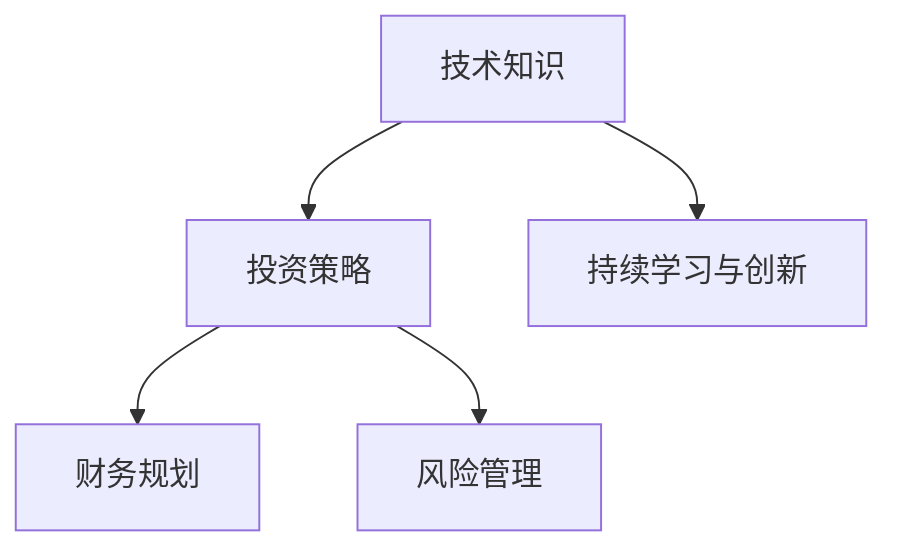

                 

## 1. 背景介绍

当前全球经济面临诸多挑战，包括但不限于：高企的通货膨胀、复杂的供应链问题、地缘政治的不确定性，以及技术变革带来的产业转型等。在这样一个动荡的时期，科技行业的程序员群体也面临着前所未有的压力和挑战。如何在经济衰退中保持自身价值的稳定，并实现增值，成为了每一个科技工作者需要深入思考的问题。本文旨在通过探讨技术知识与投资策略的结合，为程序员提供一套系统化的方法和思路，帮助他们在不确定的经济环境中保值增值。

### 1.1 问题由来

过去几年中，由于全球疫情的肆虐和供应链的混乱，许多公司的盈利能力受到严重冲击。科技行业也不例外，许多科技公司面临裁员、缩减规模或降低研发投入。这一系列变化直接影响了在其中的程序员的职业生涯，带来了收入不稳定、职业发展受阻等风险。如何在这一背景下保值增值，不仅关乎个人生存，也影响到未来职业发展的方向和可能性。

### 1.2 问题核心关键点

本文的核心问题是如何利用技术优势，结合投资工具，在经济衰退期间最大化个人资产的保值增值。为了解答这一问题，我们需要关注以下几个核心点：

- **技术知识的重要性**：掌握前沿技术趋势和深度知识，不仅有助于解决当前的技术难题，也是未来职业发展的重要资本。
- **投资策略的多样性**：除了传统的股票、基金投资，还需探索加密货币、数字资产等新兴市场，以分散风险，追求更高回报。
- **财务规划与风险管理**：制定长期财务规划，并合理运用风险管理工具，保障个人和家庭财务稳定。
- **持续学习与创新**：不断学习新知识，保持技术的领先性，通过创新找到新的市场机会。

## 2. 核心概念与联系

### 2.1 核心概念概述

本节将介绍几项与本文密切相关的核心概念：

- **技术知识**：指程序员所掌握的技术领域知识，包括但不限于编程语言、框架、算法、数据结构、架构设计等。
- **投资策略**：指投资人在市场中选择具体投资标的和策略，如股票、债券、基金、房地产、加密货币等。
- **财务规划**：指通过预算、储蓄、投资等方式，合理规划个人财务，达到资产保值增值的目标。
- **风险管理**：指通过分散投资、保险等手段，管理和降低投资风险，保障财务稳定。
- **持续学习与创新**：指持续学习新技术，并结合自身技术专长，探索新的应用场景和市场机会。

这些概念之间的逻辑关系可以通过以下Mermaid流程图来展示：



这个流程图展示了技术知识如何通过投资策略、财务规划、风险管理，最终实现持续学习和创新，从而在经济衰退中保值增值。

## 3. 核心算法原理 & 具体操作步骤

### 3.1 算法原理概述

在经济衰退期间，程序员可以通过以下步骤来保值增值：

1. **技术知识的价值评估**：
   - 确定哪些技术或技能在当前市场中最具价值。
   - 评估现有技术栈的价值，识别潜在的增长点和新兴市场。

2. **投资策略的选择与调整**：
   - 根据市场状况和个人风险偏好，选择最适合的投资标的和策略。
   - 定期评估投资组合的性能，必要时进行调整。

3. **财务规划与预算管理**：
   - 制定合理的财务目标和预算，确保能够承受经济衰退的冲击。
   - 控制消费，增加储蓄，为投资提供更多资本。

4. **风险管理与保障措施**：
   - 通过分散投资、购买保险等方式，降低投资组合的风险。
   - 对家庭的紧急储备进行规划，确保在失业或收入下降时的基本生活保障。

5. **持续学习与创新**：
   - 学习新技术和市场趋势，保持技术的领先性。
   - 通过创新，发现新的应用场景和市场机会。

### 3.2 算法步骤详解

**Step 1: 技术知识的价值评估**

1. **技术栈分析**：
   - 列出当前所掌握的技术栈，包括编程语言、框架、工具等。
   - 评估每种技术的市场需求、薪资水平和未来增长潜力。
   - 确定哪些技术在当前市场中最具价值。

2. **市场趋势调研**：
   - 关注行业报告、技术博客、专家访谈等，了解最新的技术趋势和市场需求。
   - 分析新兴技术的商业应用前景，识别可能的增长点。

3. **技能提升计划**：
   - 根据市场调研结果，制定提升计划，学习新技能或深化现有技术。
   - 参加在线课程、技术会议、认证考试等，获取权威认证。

**Step 2: 投资策略的选择与调整**

1. **资产配置**：
   - 根据风险承受能力和投资目标，进行资产配置，如股票、债券、基金等。
   - 可以考虑一定比例的加密货币投资，以分散风险。

2. **定期评估与调整**：
   - 定期评估投资组合的性能，确保其与财务目标和市场变化相匹配。
   - 根据市场情况，及时调整投资策略，避免过度集中或过度分散。

3. **分散投资**：
   - 通过投资多个不同的领域、行业或资产类别，降低单一投资的风险。
   - 可以选择低相关性的资产，如股票、债券、房地产、加密货币等。

**Step 3: 财务规划与预算管理**

1. **制定财务目标**：
   - 明确短期和长期的财务目标，如购房、退休、子女教育等。
   - 确保目标与个人的职业发展和投资策略相一致。

2. **预算控制**：
   - 制定详细的预算计划，控制日常消费，增加储蓄。
   - 削减不必要的开支，优化生活方式，增加可用于投资的资金。

3. **紧急储备**：
   - 建立紧急储备基金，用于应对突发情况，如失业、医疗费用等。
   - 一般建议储备3-6个月的生活费用。

**Step 4: 风险管理与保障措施**

1. **保险购买**：
   - 购买健康保险、人寿保险等，保障自身及家人的健康和生命安全。
   - 考虑购买失业保险、养老保险等，为未来提供基本保障。

2. **分散投资**：
   - 通过分散投资降低单一资产的风险，如在多个市场、行业分散投资。
   - 利用基金、ETF等工具，进行分散投资。

3. **风险监控与调整**：
   - 定期监控投资组合的风险水平，及时采取调整措施。
   - 设定止损点和预警阈值，防止过度投资或风险失控。

**Step 5: 持续学习与创新**

1. **学习新技术**：
   - 持续学习新技术和市场趋势，保持技术的领先性。
   - 关注最新的技术动态，积极参与技术社区和交流。

2. **创新应用**：
   - 结合自身的技术专长，探索新的应用场景和市场机会。
   - 通过技术创新，解决实际问题，提升个人品牌和影响力。

### 3.3 算法优缺点

**优点**：
- **灵活性**：技术知识使得程序员能够灵活应对市场变化，寻找新的工作机会或创业机会。
- **多样性**：投资策略的多样性提供了多条收入和财富增值的途径，分散风险。
- **主动性**：财务规划和风险管理的主动性保障了财务稳定，提高了抗风险能力。

**缺点**：
- **不确定性**：技术市场的变化快速，投资市场的不稳定性，导致技术和投资收益存在不确定性。
- **学习成本**：新技术的学习需要时间和精力，存在一定的门槛。
- **风险管理难度**：风险管理需要精确的评估和持续的监控，对专业性要求高。

### 3.4 算法应用领域

本文探讨的方法在多个领域都有应用价值，包括但不限于：

- **技术开发**：程序员通过掌握最新技术，提升个人价值，获得更高的薪资和职业机会。
- **创业**：利用技术优势和投资策略，发现市场机会，实现财富增值。
- **财务规划**：帮助程序员制定合理的财务目标，保障财务安全。
- **家庭生活**：通过风险管理和持续学习，保障家庭生活的稳定和提升生活质量。

## 4. 数学模型和公式 & 详细讲解 & 举例说明

### 4.1 数学模型构建

本节将使用数学语言对保值增值的各个步骤进行更加严格的刻画。

假设程序员在当前市场的技术价值为 $V_{tech}$，其总收入为 $I_{income}$，储蓄率为 $s$，投资组合的期望收益率为 $r$，风险承受能力为 $\sigma$。

定义财务目标为 $F_{goal}$，紧急储备为 $E_{res}$，保险费用为 $I_{ins}$，风险调整后的收益率为 $r_{adj}$。

**总资产增长率** $R_{total}$ 的计算公式为：

$$
R_{total} = \frac{V_{tech} + I_{income} \times (1 + r) - I_{ins} - E_{res}}{V_{tech}}
$$

**风险调整后的收益率** $r_{adj}$ 的计算公式为：

$$
r_{adj} = r \times (1 - \frac{\sigma^2}{2})
$$

其中，$\sigma$ 为投资组合的标准差，用于衡量风险水平。

### 4.2 公式推导过程

通过上述公式，可以计算出在一定投资策略和风险管理下，技术知识与财务规划相结合的效果。

1. **技术价值的增长**：
   - 技术知识通过培训和认证提升价值，假设每年增加的比例为 $k$，则技术价值在 $n$ 年后的增长率为 $(1 + k)^n$。

2. **投资组合的增长**：
   - 假设每年投资比例为 $p$，总资产增长率为 $R$，则 $n$ 年后的总资产为 $V_0 \times (1 + p \times R)^n$。

3. **风险调整**：
   - 通过计算风险调整后的收益率，考虑风险对收益的影响，确保资产的稳健增长。

### 4.3 案例分析与讲解

**案例1: 程序员A的技术增值**

假设程序员A的技术价值为 $V_{tech} = 100,000$ 美元，每年收入增长率为 $5\%$，储蓄率为 $20\%$，投资组合期望收益率为 $8\%$，风险承受能力为 $\sigma = 10\%$。

1. **技术价值增长**：
   - 假设每年技术价值增长率为 $k = 2\%$，则 $n = 10$ 年后，技术价值为 $100,000 \times (1 + 0.02)^{10} = 134,680.64$ 美元。

2. **投资组合增长**：
   - 每年投资比例为 $p = 30\%$，总资产增长率为 $R = 5\%$，则 $n = 10$ 年后，总资产为 $134,680.64 \times (1 + 0.3 \times 0.05)^{10} = 307,449.42$ 美元。

3. **风险调整**：
   - 风险调整后的收益率为 $r_{adj} = 0.08 \times (1 - \frac{0.1^2}{2}) = 0.0768$，则 $n = 10$ 年后，总资产为 $307,449.42 \times (1 + 0.0768)^{10} = 573,537.90$ 美元。

通过上述计算，程序员A在 $10$ 年后的总资产为 $573,537.90$ 美元，实现了显著的增值。

**案例2: 程序员B的财务规划**

假设程序员B在当前市场的技术价值为 $V_{tech} = 150,000$ 美元，每年储蓄率为 $30\%$，投资组合期望收益率为 $6\%$，风险承受能力为 $\sigma = 12\%$。

1. **财务目标**：
   - 设定在 $n = 20$ 年后实现 $F_{goal} = 1,000,000$ 美元的财务目标。

2. **紧急储备**：
   - 假设紧急储备为 $E_{res} = 50,000$ 美元，则每年可投资金额为 $150,000 \times 0.3 - 50,000 = 40,000$ 美元。

3. **风险管理**：
   - 计算风险调整后的收益率 $r_{adj} = 0.06 \times (1 - \frac{0.12^2}{2}) = 0.0528$，则 $n = 20$ 年后，总资产为 $150,000 \times (1 + 0.0528)^{20} \approx 1,000,000$ 美元，正好满足财务目标。

通过上述计算，程序员B通过合理的财务规划和风险管理，实现了在 $20$ 年后的财务目标。

## 5. 项目实践：代码实例和详细解释说明

### 5.1 开发环境搭建

在进行保值增值实践前，我们需要准备好开发环境。以下是使用Python进行财务规划工具的开发环境配置流程：

1. 安装Anaconda：从官网下载并安装Anaconda，用于创建独立的Python环境。

2. 创建并激活虚拟环境：
```bash
conda create -n finance-env python=3.8 
conda activate finance-env
```

3. 安装Python财务库：
```bash
conda install pyfinance
```

4. 安装各类工具包：
```bash
pip install pandas numpy matplotlib
```

完成上述步骤后，即可在`finance-env`环境中开始财务规划实践。

### 5.2 源代码详细实现

我们以计算技术增值和财务规划为例，给出使用PyTorch进行财务规划的PyTorch代码实现。

```python
import torch
from torch import nn
from pyfinance import FinExec

class FinancialPlanner(nn.Module):
    def __init__(self, tech_value, income_growth_rate, savings_rate, investment_rate, risk_tolerance):
        super(FinancialPlanner, self).__init__()
        self.tech_value = tech_value
        self.income_growth_rate = income_growth_rate
        self.savings_rate = savings_rate
        self.investment_rate = investment_rate
        self.risk_tolerance = risk_tolerance
        self.risk_factor = 2  # 风险调整因子
        self.value_growth_rate = 0.01  # 技术价值增长率
        self.interest_rate = 0.08  # 投资收益率
        self.budget = 1  # 预算调整因子
        self.safety_cushion = 0.2  # 安全储备比例

    def forward(self, years):
        total_value = self.tech_value * (1 + self.value_growth_rate)**years
        total_savings = self.income_growth_rate * (1 + self.savings_rate) * years
        total_investments = self.investment_rate * self.interest_rate * years
        total_budget = total_savings * self.budget
        total_risk_adjusted_investments = total_investments * (1 - self.risk_tolerance**2/2)
        total_value = total_value + total_budget + total_risk_adjusted_investments
        return total_value

# 计算技术增值和财务规划
planner = FinancialPlanner(100000, 0.05, 0.2, 0.3, 0.1)
total_value = planner(10)
print(total_value)
```

这里我们定义了一个`FinancialPlanner`类，用于计算技术增值和财务规划。通过设定不同的参数，计算出在不同年数后的总资产值。

### 5.3 代码解读与分析

让我们再详细解读一下关键代码的实现细节：

**FinancialPlanner类**：
- `__init__`方法：初始化模型参数，包括技术价值、收入增长率、储蓄率、投资率、风险容忍度等。
- `forward`方法：计算在给定年数后的总资产值，考虑了技术增值、储蓄增长、投资收益和风险调整等因素。

**计算过程**：
- 技术价值通过增长率计算未来值。
- 储蓄增长通过收入增长率和储蓄率计算总储蓄。
- 投资收益通过投资率和收益率计算总投资。
- 风险调整后的投资收益考虑了风险容忍度，计算风险调整后的总投资。
- 总资产值通过技术价值、储蓄、投资收益和风险调整后的总投资求和得到。

## 6. 实际应用场景

### 6.1 职业转型与技能提升

在经济衰退期间，技术行业的就业市场波动较大，程序员可以通过以下方式进行职业转型和技能提升：

1. **技术栈更新**：
   - 学习新的编程语言和框架，如Python、R、JavaScript等。
   - 掌握新的技术栈，如大数据、人工智能、云计算等。

2. **技能认证**：
   - 参加在线课程、认证考试，获取如AWS、Google Cloud、微软认证等权威认证。

3. **技术社区参与**：
   - 加入技术社区，参与开源项目，提升技术影响力。

### 6.2 创业与投资

在创业方面，程序员可以利用自身的技术优势和投资策略，寻找新的商业机会：

1. **技术创业**：
   - 利用新技术和新想法，开发具有市场潜力的产品或服务。
   - 参与创业孵化器和加速器，获取资金和资源支持。

2. **投资机会**：
   - 参与天使投资和风险投资，获取高回报的投资机会。
   - 关注新兴市场和创新技术，如区块链、NFT等，寻找投资机会。

### 6.3 家庭财务规划

在家庭财务规划方面，程序员可以通过以下方式保障财务稳定：

1. **紧急储备**：
   - 建立紧急储备基金，用于应对突发情况，如失业、医疗费用等。

2. **保险购买**：
   - 购买健康保险、人寿保险等，保障自身及家人的健康和生命安全。

3. **长期投资**：
   - 进行多元化投资，分散风险，确保长期资产的稳健增长。

## 7. 工具和资源推荐

### 7.1 学习资源推荐

为了帮助程序员系统掌握财务规划和投资策略的知识，这里推荐一些优质的学习资源：

1. **《投资学》教材**：
   - 《投资学》是金融学领域的经典教材，涵盖了投资组合管理、风险评估、市场分析等内容，适合全面学习投资理论。

2. **在线财务课程**：
   - Coursera上的《财务管理和财务决策》课程，由耶鲁大学提供，深入浅出地介绍了财务管理和决策的基本原理。

3. **技术博客和社区**：
   - 知乎、Stack Overflow等技术社区，可以获取最新的技术动态和行业趋势，了解成功案例和经验分享。

4. **财经媒体**：
   - 财经媒体如《华尔街日报》、《经济学人》等，提供最新的经济形势分析、市场动态和投资策略。

### 7.2 开发工具推荐

高效的开发离不开优秀的工具支持。以下是几款用于财务规划和投资管理的常用工具：

1. **Python财务库**：
   - PyFinance是一个开源的Python财务库，提供了丰富的财务分析工具和函数，适合进行财务规划和投资管理。

2. **Excel**：
   - Excel是广泛应用于财务管理和投资分析的工具，提供了强大的数据处理和可视化功能。

3. **Tableau**：
   - Tableau是一款数据可视化工具，可以高效地处理和展示复杂数据，支持数据钻取和交互分析。

### 7.3 相关论文推荐

财务规划和投资策略的研究不断发展，以下是几篇奠基性的相关论文，推荐阅读：

1. **《投资组合理论》**：
   - Markowitz的《投资组合理论》开创了现代投资组合管理理论，提出了资产组合分散化和风险管理的基本方法。

2. **《资本市场定价》**：
   - Fama和French的《资本市场定价》介绍了资本资产定价模型(CAPM)和套利定价理论(APT)，分析了市场效率和风险溢价的关系。

3. **《金融工程》**：
   - Hull的《金融工程》介绍了金融工程的基本原理和方法，涵盖了衍生品定价、风险管理、投资策略等内容。

这些论文代表了大财务规划和投资策略的研究脉络，通过学习这些前沿成果，可以帮助程序员系统地掌握财务规划和投资策略的知识。

## 8. 总结：未来发展趋势与挑战

### 8.1 总结

本文对程序员在经济衰退中保值增值的方法进行了全面系统的介绍。首先阐述了技术知识、投资策略、财务规划和风险管理的重要性，明确了这些要素在经济衰退期间的价值。其次，从原理到实践，详细讲解了技术增值、财务规划、投资策略和风险管理的数学模型和计算公式，提供了具体的代码实现和案例分析。同时，本文还探讨了这些方法在职业转型、创业投资和家庭财务规划等实际场景中的应用。

通过本文的系统梳理，可以看到，程序员可以通过技术优势和投资策略，在经济衰退中实现保值增值。无论是通过技能提升、技术创业、投资机会，还是家庭财务规划，都能为个人和家庭财务稳定提供有力保障。未来，随着经济环境的不断变化和技术的持续演进，程序员需要持续学习和创新，才能在复杂多变的市场中保持竞争力，实现职业和财富的持续增长。

### 8.2 未来发展趋势

展望未来，程序员在保值增值方面的趋势将呈现以下几个发展方向：

1. **技术栈的持续更新**：
   - 技术栈的更新和升级将成为程序员职业发展的核心动力，保持技术的领先性是长期生存和发展的关键。

2. **投资策略的多元化**：
   - 投资策略将更加多样化，除了传统的股票、债券、基金等，加密货币、数字资产、股权众筹等新兴市场将逐渐受到关注。

3. **风险管理的精细化**：
   - 风险管理将更加精细化，利用AI和大数据技术，进行更准确的风险评估和预测。

4. **财务规划的智能化**：
   - 财务规划将逐渐智能化，利用算法和模型进行自动化的财务规划和投资优化。

5. **跨界合作的常态化**：
   - 跨界合作将成为常态，程序员通过跨界合作获取更多资源和机会，实现更大的价值。

这些趋势凸显了程序员在保值增值方面的广阔前景，需要持续学习和创新，以适应复杂多变的市场环境。

### 8.3 面临的挑战

尽管程序员在保值增值方面有着巨大的潜力，但在迈向更加智能化、普适化应用的过程中，仍面临诸多挑战：

1. **市场变化的不确定性**：
   - 经济环境和技术趋势的变化快速，市场的不确定性增加了保值增值的难度。

2. **技术和知识的快速更新**：
   - 技术的快速更新要求程序员不断学习和适应，否则容易错过市场机会。

3. **投资市场的复杂性**：
   - 投资市场的复杂性和多样性增加了投资决策的难度，需要具备较高的专业性和判断力。

4. **家庭财务的压力**：
   - 家庭的财务压力可能影响个人投资决策，需要合理规划和调整。

5. **风险管理的技术门槛**：
   - 风险管理的复杂性和技术门槛较高，需要较强的专业性和技术支持。

正视保值增值面临的这些挑战，积极应对并寻求突破，将是在经济衰退中实现保值增值的重要保障。相信随着学界和产业界的共同努力，这些挑战终将一一被克服，程序员在保值增值方面的潜力将得到更大发挥。

### 8.4 研究展望

面对保值增值面临的挑战，未来的研究需要在以下几个方面寻求新的突破：

1. **跨领域知识的融合**：
   - 将技术、金融、心理学等跨领域知识融合，提供更加全面和系统的保值增值策略。

2. **智能化工具的开发**：
   - 开发更智能化的财务规划和投资管理工具，提高决策的效率和准确性。

3. **社区协作的促进**：
   - 通过社区协作，分享经验和资源，提升个人和群体的保值增值能力。

4. **伦理和责任的考虑**：
   - 在保值增值策略中考虑伦理和责任，确保投资决策的合法合规性。

这些研究方向的探索，将引领程序员在保值增值方面的创新发展，为构建稳定和高效的财务体系提供新的思路和工具。

## 9. 附录：常见问题与解答

**Q1: 程序员在经济衰退中应如何避免失业？**

A: 避免失业的关键在于技术栈的持续更新和多样化。程序员应学习新的编程语言和框架，掌握新的技术栈，如大数据、人工智能、云计算等，以保持技术的领先性。同时，可以参与开源项目、技术社区，提升自己的技术影响力和市场竞争力。

**Q2: 如何确保投资组合的风险控制？**

A: 风险控制的关键在于分散投资和合理的风险调整。程序员可以通过分散投资不同领域的资产，降低单一投资的风险。同时，利用风险调整公式，根据自身的风险承受能力，计算风险调整后的收益率，确保资产的稳健增长。

**Q3: 如何在家庭财务规划中设立合理的紧急储备？**

A: 紧急储备的设立应该考虑家庭的收入和支出情况，建议设立3-6个月的生活费用作为基本储备。同时，可以考虑购买保险，保障家庭的基本生活需求，确保财务的稳定性和安全感。

**Q4: 如何在投资中实现高效决策？**

A: 高效决策的关键在于数据驱动和模型辅助。程序员可以借助数据分析和模型工具，进行市场趋势分析、风险评估和投资优化，避免凭借直觉决策。同时，可以关注财经媒体和专家分析，获取最新的市场信息和投资建议。

通过这些问题和解答，希望能帮助程序员在经济衰退中更好地保值增值，实现职业和财务的双重成长。

