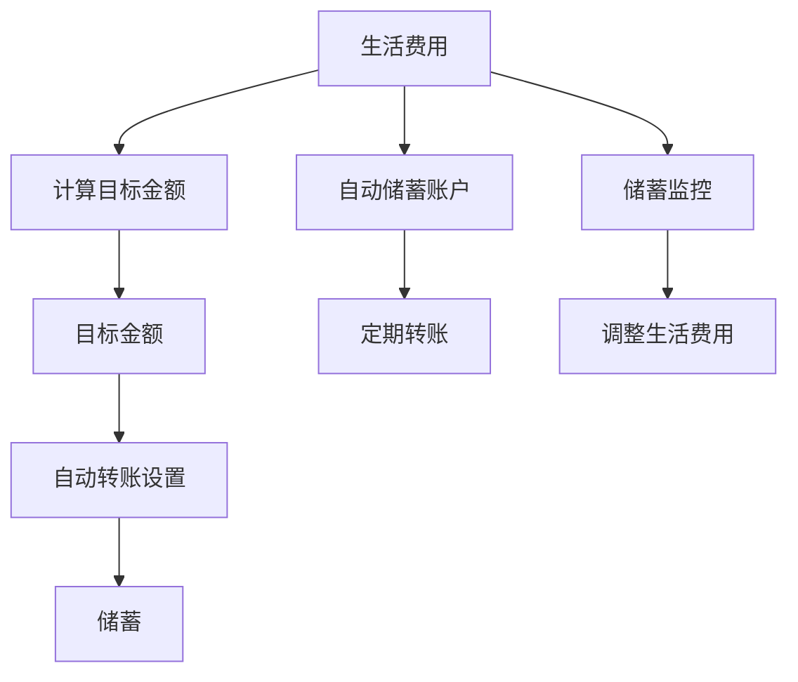

                 

# 程序员如何建立紧急基金

## 1. 背景介绍

在现代社会的快节奏生活压力下，程序员这一职业因其高强度、高风险和持续学习的需求，使得建立紧急基金变得尤为重要。紧急基金，也叫紧急储备金或应急基金，通常指用于应对突发事件（如意外医疗费用、失业、紧急旅行等）的储备资金。建立紧急基金不仅能减少财务风险，还能提高生活质量，让人们在面对突发状况时保持平稳和自信。对于程序员来说，建立紧急基金不仅是财务管理的必备技能，也是保障生活质量的关键一环。

## 2. 核心概念与联系

### 2.1 核心概念概述

- **紧急基金（Emergency Fund）**：为了应对突发事件而预留的资金，通常建议储备3-6个月的生活费用。
- **自动储蓄账户（Automatic Savings Account）**：一种专为储蓄而设计，自动将一部分收入转入储蓄的银行账户。
- **生活费用（Living Expenses）**：维持基本生活的必要开支，包括房租、食品、水电费等。
- **目标金额（Target Amount）**：计算紧急基金所需储备的总金额，通常基于3-6个月的生活费用。
- **自动转账（Automatic Transfer）**：利用银行的自动转账功能，将一部分收入定期转入储蓄账户，减少手动储蓄的麻烦。

这些概念之间存在密切的联系，生活费用决定了紧急基金的目标金额，而自动储蓄和自动转账则提供了有效的储蓄手段。通过合理地将生活费用转化为目标金额，并利用自动转账功能，可以高效、稳定地建立和维护紧急基金。

### 2.2 核心概念原理和架构的 Mermaid 流程图



这个流程图展示了从生活费用到目标金额的计算流程，以及如何通过自动转账和定期储蓄来实现目标。

## 3. 核心算法原理 & 具体操作步骤

### 3.1 算法原理概述

建立紧急基金的算法原理简单，主要基于以下步骤：

1. **计算目标金额**：根据个人的月平均生活费用，计算出紧急基金的目标金额，建议目标金额为3-6个月的生活费用。
2. **自动储蓄设置**：在银行设置自动储蓄账户，并配置自动转账功能，将一部分收入自动转入该账户。
3. **定期转账和监控**：定期监控储蓄账户，确保自动转账正常执行，并根据需要调整储蓄金额和目标金额。

### 3.2 算法步骤详解

#### 3.2.1 计算目标金额

$$
\text{目标金额} = \text{月平均生活费用} \times (\text{月数})
$$

其中，月平均生活费用应包括房租、食品、水电费等必要开支。计算出的目标金额应为3-6个月的生活费用，根据个人情况可适当调整。

#### 3.2.2 设置自动储蓄账户

1. 选择一家提供自动储蓄功能的银行，开设自动储蓄账户。
2. 登录网上银行，设置自动转账功能。
3. 设定每月自动转账的金额和时间，确保每月有固定金额转入储蓄账户。

#### 3.2.3 定期转账和监控

1. 定期检查储蓄账户余额，确保自动转账正常执行。
2. 根据生活费用变化和收入水平调整每月自动转账金额。
3. 监控储蓄账户余额，确保不会过度支出，影响紧急基金的建立和维护。

### 3.3 算法优缺点

#### 3.3.1 优点

- **自动化**：自动储蓄和转账功能简化了储蓄过程，减少了手动储蓄的麻烦。
- **稳定性**：定期转账确保了储蓄的稳定性和持续性，减少了因突发事件导致的储蓄中断。
- **可控性**：通过定期监控和调整，可以灵活调整紧急基金的目标金额和生活费用，适应生活变化。

#### 3.3.2 缺点

- **初始成本**：建立自动储蓄账户可能需要支付一定的开户费用。
- **调整复杂**：如果生活费用发生较大变化，调整自动转账金额需要重新设置。
- **依赖银行**：自动储蓄和转账功能依赖于银行系统的稳定性和安全性，可能面临系统故障或网络中断的风险。

### 3.4 算法应用领域

紧急基金的建立和维护方法不仅适用于程序员，对于任何需要应对突发事件的人来说都是有效的财务策略。它适用于以下领域：

- **家庭财务规划**：帮助家庭应对突发医疗费用、失业等紧急情况，保障家庭财务安全。
- **企业财务管理**：帮助企业应对突发事件，如供应商问题、市场变化等，保障企业运营稳定。
- **个人财务管理**：帮助个人应对突发事件，如交通事故、健康问题等，保障个人生活安全。

## 4. 数学模型和公式 & 详细讲解

### 4.1 数学模型构建

建立紧急基金的过程可以通过数学模型进行建模，模型包括以下要素：

- $x$：每月平均生活费用。
- $n$：紧急基金目标金额对应的月数，建议为3-6个月。
- $G$：自动储蓄账户每月自动转账的金额。
- $A$：紧急基金目标金额。

### 4.2 公式推导过程

$$
A = x \times n
$$

$$
G = \frac{A}{n \times \text{月数}}
$$

其中，$G$ 应根据每月的生活费用调整，确保每月有固定的金额自动转入储蓄账户。

### 4.3 案例分析与讲解

假设小明每月的平均生活费用为5000元，希望建立6个月的紧急基金。

1. 计算目标金额：
$$
A = 5000 \times 6 = 30000
$$

2. 设置自动转账金额：
$$
G = \frac{30000}{6 \times 12} = 208.33
$$

3. 每月自动转账208.33元，持续12个月，即可建立目标金额为30000元的紧急基金。

## 5. 项目实践：代码实例和详细解释说明

### 5.1 开发环境搭建

#### 5.1.1 配置自动储蓄账户

1. 选择支持自动储蓄的银行，如工行、建行等。
2. 网上银行登录并开设自动储蓄账户。
3. 配置自动转账功能，设置每月转账金额和时间。

#### 5.1.2 定期监控储蓄账户

1. 登录网上银行，查看储蓄账户余额。
2. 根据生活费用变化调整自动转账金额。
3. 确保每月有固定的金额自动转入储蓄账户。

### 5.2 源代码详细实现

以下是一个简化的Python脚本，用于计算紧急基金的目标金额和自动转账金额，并模拟储蓄过程。

```python
def calculate_emergency_fund(x, n):
    A = x * n
    G = A / (n * 12)
    return A, G

# 示例
x = 5000  # 每月平均生活费用
n = 6     # 目标月数
A, G = calculate_emergency_fund(x, n)
print(f"目标金额为：{A}元")
print(f"每月自动转账金额为：{G}元")
```

### 5.3 代码解读与分析

- **函数`calculate_emergency_fund`**：计算目标金额和自动转账金额。
- **变量`x`和`n`**：分别为每月平均生活费用和目标月数。
- **变量`A`**：目标金额。
- **变量`G`**：每月自动转账金额。
- **输出**：目标金额和每月自动转账金额。

### 5.4 运行结果展示

运行上述代码，将输出目标金额和每月自动转账金额，如下所示：

```
目标金额为：30000元
每月自动转账金额为：208.33元
```

## 6. 实际应用场景

### 6.1 突发医疗费用

小李在工作中突然患上急性阑尾炎，需要立即手术。通过紧急基金支付医疗费用，避免了因无法支付医疗费用而引发的经济压力。

### 6.2 意外失业

小王由于公司裁员意外失业，通过紧急基金支付了几个月的房租和生活费用，顺利渡过了经济难关。

### 6.3 紧急旅行

小张因工作需要突然出差到另一个城市，紧急基金支付了交通和住宿费用，确保了旅行的顺利进行。

### 6.4 未来应用展望

未来，随着金融科技的发展，自动储蓄和转账功能将更加便捷和智能化，无需手动设置和调整。通过与物联网的结合，紧急基金管理将更加智能化和自动化，进一步提升财务管理效率和应急能力。

## 7. 工具和资源推荐

### 7.1 学习资源推荐

1. **《理财新手指南》**：介绍了紧急基金的建立和管理方法，适合理财初学者阅读。
2. **《财富管理实战》**：详细讲解了紧急基金在实际财务管理中的应用案例，适合有一定财务基础的读者。
3. **在线课程**：如Coursera上的《个人理财基础》课程，提供系统的紧急基金管理知识。

### 7.2 开发工具推荐

1. **银行网上银行**：提供自动储蓄和转账功能的银行系统，如工行、建行等。
2. **财务软件**：如QuickBooks、Mint等，帮助用户管理和监控财务状况。
3. **Python脚本**：如上述示例代码，方便用户自行计算和管理紧急基金。

### 7.3 相关论文推荐

1. **《应急基金的构建与维护》**：详细介绍了应急基金的理论基础和实际操作。
2. **《自动储蓄和自动转账功能的研究》**：探讨了自动储蓄和转账功能的实现方式和应用效果。
3. **《数字经济时代的财务管理》**：讨论了数字技术对财务管理的影响和应对措施。

## 8. 总结：未来发展趋势与挑战

### 8.1 研究成果总结

本文介绍了建立紧急基金的核心概念、算法原理和具体操作步骤，通过数学模型和Python代码展示了具体的计算过程。同时，讨论了紧急基金在不同应用场景中的实际作用，并提出了未来的发展趋势。

### 8.2 未来发展趋势

1. **智能化**：未来的自动储蓄和转账功能将更加智能化，通过人工智能和大数据分析，帮助用户更智能地管理紧急基金。
2. **全球化**：随着国际合作的加深，紧急基金的跨国管理将成为趋势，通过全球化金融系统实现更高效的资金管理。
3. **区块链应用**：区块链技术将为紧急基金管理提供更高的安全性和透明度，保障资金的安全和可追溯性。

### 8.3 面临的挑战

1. **技术挑战**：自动化和智能化功能的实现需要克服技术难题，如系统稳定性和安全性问题。
2. **法律法规**：不同国家和地区的法律法规可能对紧急基金的管理方式和用途有不同的要求。
3. **用户接受度**：用户对于自动储蓄和转账功能的接受度和使用习惯需要时间和教育来改变。

### 8.4 研究展望

未来的研究将集中在以下方面：

1. **跨领域研究**：结合金融科技、人工智能和区块链技术，推动紧急基金管理的创新和优化。
2. **用户行为研究**：通过行为经济学和心理学研究，深入了解用户的行为特征和心理需求，提供更加个性化和人性化的服务。
3. **伦理和道德研究**：探讨紧急基金管理中的伦理和道德问题，确保资金的透明和公正使用。

## 9. 附录：常见问题与解答

**Q1：如何选择合适的自动储蓄账户？**

A：选择具有自动储蓄和转账功能的银行账户，并根据银行的利率、费用和服务质量进行比较。

**Q2：每月自动转账金额应如何设定？**

A：根据个人生活费用和收入水平设定每月自动转账金额，确保金额稳定，同时不影响生活质量。

**Q3：如何监控储蓄账户余额？**

A：定期登录网上银行查看账户余额，确保自动转账正常执行，并根据生活费用变化调整转账金额。

**Q4：紧急基金是否需要持续储蓄？**

A：紧急基金需要持续储蓄，以应对未来可能的突发事件。如果生活费用和收入发生变化，应相应调整储蓄金额。

**Q5：紧急基金是否需要定期调整？**

A：紧急基金的目标金额应根据生活费用和收入变化进行调整，确保其能够应对可能出现的突发事件。

---

作者：禅与计算机程序设计艺术 / Zen and the Art of Computer Programming

