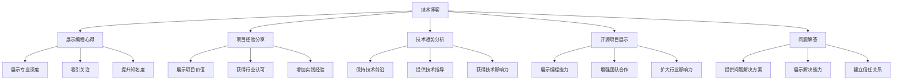

                 

## 1. 背景介绍

在当今这个信息爆炸的时代，个人品牌（Personal Brand）的建立成为了众多程序员提升自身影响力、获取职业发展机会的重要手段。但如何有效塑造和推广个人品牌，却是一个挑战性的问题。本文旨在为程序员提供一套全面的个人品牌打造指南，涵盖从个人品牌定位到品牌传播的各个环节。

### 1.1 问题由来

随着互联网技术的快速发展，编程不再是一个孤立的技能，而是与职业发展、人脉资源、市场竞争等方面紧密相关。个人品牌不仅影响着程序员的职业路径，也关系到他们的职业前景和收入水平。然而，由于许多程序员缺乏品牌意识，导致他们在职业道路上错失了很多机会。

### 1.2 问题核心关键点

个人品牌的打造核心关键点包括：

- **定位明确**：识别自身优势和兴趣，明确个人品牌定位。
- **内容输出**：通过博客、视频、开源项目等形式，持续输出有价值的内容。
- **社交网络**：积极参与专业社区，扩大影响力。
- **个人网站**：建立个人网站，集中展示个人品牌。
- **个人IP**：形成具有鲜明特色的个人品牌形象，提升行业影响力。

本文将围绕这些关键点，为程序员提供详细指南，帮助他们成功打造个人品牌IP。

## 2. 核心概念与联系

### 2.1 核心概念概述

为了更好地理解如何打造个人品牌，我们需要了解几个关键概念及其相互关系：

- **个人品牌**：指个体在特定行业或领域内形成的独特形象和声誉。它由专业知识、技能、态度和行为等多个维度组成。

- **技术博客**：通过博客形式，记录和分享编程心得、项目经验、技术趋势等内容，建立专业权威的形象。

- **开源项目**：通过开源项目展示编程能力和团队协作能力，扩大影响力。

- **社交网络**：在LinkedIn、GitHub、Twitter等平台活跃，建立广泛的人脉资源。

- **个人网站**：集中展示个人品牌、技术博客、开源项目、个人简历等，增强专业形象。

### 2.2 核心概念原理和架构的 Mermaid 流程图



该流程图展示了技术博客、开源项目等关键工具如何通过不同的维度来支持个人品牌的塑造，进而扩大影响力。

## 3. 核心算法原理 & 具体操作步骤

### 3.1 算法原理概述

个人品牌的塑造是一个持续的过程，涉及到多个维度的协调和优化。其核心算法原理包括：

1. **数据收集与分析**：通过收集和分析社交网络数据、博客点击量、开源项目贡献等数据，了解自身在行业中的影响力。
2. **内容创建与优化**：根据分析结果，调整博客内容、项目选择，以提升品牌效应。
3. **品牌传播与互动**：在社交网络上积极互动，增强品牌知名度和信任度。
4. **反馈与迭代**：持续收集反馈，迭代优化个人品牌策略。

### 3.2 算法步骤详解

以下是个人品牌塑造的详细步骤：

#### 第一步：自我评估与定位
1. **识别优势与兴趣**：评估自己的技术水平、编程习惯、兴趣爱好，识别出自己的核心优势和兴趣点。
2. **确定品牌定位**：根据优势与兴趣，确定个人品牌在特定技术领域或项目中的定位，例如，成为某项技术的专家或某类项目的领导者。

#### 第二步：内容输出与品牌塑造
1. **博客与技术文章**：创建并维护一个技术博客，定期发布高质量的技术文章，覆盖编程心得、项目经验、技术趋势等主题。
2. **开源项目贡献**：选择与个人品牌定位相关的开源项目，积极贡献代码和文档，展示技术能力。
3. **社交网络活跃**：在LinkedIn、GitHub、Twitter等平台保持活跃，分享技术见解，参与技术讨论，建立专业网络。

#### 第三步：品牌传播与反馈
1. **品牌展示**：建立个人网站，集中展示技术博客、开源项目、个人简历等，形成统一的品牌形象。
2. **用户互动**：在社交网络上积极互动，回复评论、参与讨论，增强用户粘性。
3. **反馈收集**：通过社交网络平台收集用户反馈，调整个人品牌策略。

#### 第四步：品牌优化与持续迭代
1. **品牌优化**：根据反馈，优化博客内容、开源项目选择和社交网络互动策略。
2. **持续迭代**：定期回顾个人品牌发展进程，调整策略，保持品牌的新鲜度和吸引力。

### 3.3 算法优缺点

#### 优点
1. **提升职业前景**：通过个人品牌塑造，程序员可以在招聘市场中脱颖而出，获得更好的职业机会。
2. **增加影响力**：高质量的内容输出和积极的网络互动，可以显著提升程序员在行业内的知名度和影响力。
3. **拓展人脉资源**：通过社交网络的活跃，程序员可以结识更多的同行和专家，拓展职业人脉。

#### 缺点
1. **时间成本高**：个人品牌塑造需要持续投入时间和精力，可能影响日常工作。
2. **内容创作难度**：高质量的内容创作需要深厚的技术积累和写作能力，对程序员提出较高要求。
3. **市场变化风险**：技术发展迅速，个人品牌需不断调整，以保持竞争力。

### 3.4 算法应用领域

个人品牌塑造的应用领域广泛，主要集中在以下方面：

1. **技术领域专家**：通过专业博客和开源项目展示技术深度和广度，成为特定技术领域的专家。
2. **项目领导者**：通过高效的项目管理和贡献，成为项目团队的领导者。
3. **职业转型**：通过个人品牌塑造，获得新的职业机会，实现职业转型。
4. **学术研究**：通过学术文章和技术博客，提升学术影响力，获得研究经费和合作机会。

## 4. 数学模型和公式 & 详细讲解 & 举例说明

### 4.1 数学模型构建

个人品牌塑造的数学模型涉及多个维度的数据，包括技术博客点击量、开源项目贡献度、社交网络互动等。构建模型时，可以采用加权平均的方法，对各维度进行综合评估。

设 $X$ 为博客点击量，$Y$ 为开源项目贡献度，$Z$ 为社交网络互动数，则模型如下：

$$ \text{品牌指数} = \alpha X + \beta Y + \gamma Z $$

其中，$\alpha$、$\beta$、$\gamma$ 为各维度的权重系数，需要通过实际数据和经验进行调整。

### 4.2 公式推导过程

以博客点击量 $X$ 为例，推导其对品牌指数的贡献权重。

设 $X_{i}$ 为第 $i$ 篇博客的点击量，总点击量为 $X_{\text{total}} = \sum_{i=1}^{N} X_{i}$，其中 $N$ 为博客总数。设 $\alpha$ 为博客点击量的权重，则品牌指数 $I$ 可以表示为：

$$ I = \alpha X_{\text{total}} + \beta Y + \gamma Z $$

通过实际数据，可以计算 $\alpha$ 的值：

$$ \alpha = \frac{\text{品牌指数} - \beta Y - \gamma Z}{X_{\text{total}}} $$

类似地，可以计算出 $Y$ 和 $Z$ 的权重 $\beta$ 和 $\gamma$。

### 4.3 案例分析与讲解

假设某程序员在一年内的品牌指数为 50，其博客点击量为 50000，开源项目贡献度为 1000，社交网络互动数为 200。假设 $\alpha = 0.6$，$\beta = 0.3$，$\gamma = 0.1$，则其品牌指数可以表示为：

$$ I = 0.6 \times 50000 + 0.3 \times 1000 + 0.1 \times 200 = 50000 + 300 + 20 = 50500 $$

通过这个简单的案例，我们可以看到，博客点击量在个人品牌塑造中起到了重要作用。

## 5. 项目实践：代码实例和详细解释说明

### 5.1 开发环境搭建

要实现个人品牌的塑造，首先需要搭建一个开发环境，用于技术博客的创建、开源项目的开发和社交网络的互动。

1. **技术博客**：选择 WordPress、Jekyll 或 GitHub Pages 等平台创建博客，安装必要的插件或模板，如 Markdown 支持、代码高亮等。
2. **开源项目**：使用 GitHub 等平台创建个人仓库，选择合适的开源项目进行贡献，如 TensorFlow、PyTorch 等。
3. **社交网络**：在 LinkedIn、Twitter、GitHub 等平台上注册账号，设置个人资料，并保持活跃。

### 5.2 源代码详细实现

以下是一个简单的技术博客框架，用于展示编程心得和项目经验：

```python
# blog.py

class Blog:
    def __init__(self, blog_title, blog_content):
        self.title = blog_title
        self.content = blog_content

    def publish(self):
        print(f"Published blog: {self.title}")

# main.py

blog1 = Blog("My First Blog", "This is my first blog post.")
blog1.publish()

blog2 = Blog("My Second Blog", "This is my second blog post.")
blog2.publish()
```

在上述代码中，`Blog` 类表示博客，包含博客标题和内容，`publish` 方法用于发布博客。通过这个简单的框架，可以快速实现博客的发布和内容更新。

### 5.3 代码解读与分析

在实现技术博客时，需要注意以下几个方面：

1. **博客架构**：选择一个合适的博客架构，如 WordPress、Jekyll 或 GitHub Pages，并根据需要进行自定义。
2. **内容管理**：通过 Markdown 或 HTML 格式进行内容编辑，保证博客的可读性和易维护性。
3. **代码高亮**：使用 Python、JavaScript 等语言的代码高亮功能，展示编程实例。

### 5.4 运行结果展示

通过上述代码，可以发布两篇博客，分别是 "My First Blog" 和 "My Second Blog"，展示个人编程心得和项目经验。

## 6. 实际应用场景

### 6.1 软件开发公司

在软件开发公司中，个人品牌塑造对于程序员的职业发展至关重要。通过技术博客、开源项目和社交网络，程序员可以展示自己的技术能力和项目经验，获得更多的工作机会和升职机会。

### 6.2 自由职业者

对于自由职业者，个人品牌不仅决定了他们的客户来源，还直接影响他们的收费标准。通过个人品牌塑造，自由职业者可以吸引更多高端客户，提升收入水平。

### 6.3 学术界

在学术界，个人品牌塑造有助于获得研究经费和合作机会，提升学术影响力。通过技术博客、论文发表和学术会议参与，学术研究者可以展示自己的研究成果，获得同行认可。

### 6.4 未来应用展望

未来，个人品牌塑造将进一步普及和深入，成为程序员职业发展的必备技能。随着技术的发展，更多的工具和平台将支持个人品牌塑造，提供更加便捷、高效的操作方式。

## 7. 工具和资源推荐

### 7.1 学习资源推荐

1. **《程序员的个人品牌建设指南》**：详细介绍了个人品牌塑造的具体步骤和方法，提供实用的案例和实践建议。
2. **LinkedIn Learning**：提供大量个人品牌塑造和职业发展的课程，涵盖博客创建、社交网络互动等方面。
3. **Coursera**：提供多个关于职业发展、个人品牌塑造的在线课程，帮助程序员系统学习相关知识。

### 7.2 开发工具推荐

1. **GitHub**：用于存储和分享开源项目，展示编程能力和团队合作精神。
2. **WordPress**：用于创建和维护技术博客，展示技术心得和项目经验。
3. **LinkedIn**：用于拓展职业人脉，展示个人品牌和职业成就。

### 7.3 相关论文推荐

1. **《社会网络分析在个人品牌塑造中的应用》**：探讨社交网络在个人品牌塑造中的作用，提出相关数据模型和方法。
2. **《开源项目对程序员职业发展的影响》**：研究开源项目对程序员职业发展的具体影响，提供数据和案例支持。
3. **《技术博客对个人品牌塑造的作用》**：分析技术博客对个人品牌的影响，提出相关策略和建议。

## 8. 总结：未来发展趋势与挑战

### 8.1 研究成果总结

本文从个人品牌定位、内容输出、品牌传播和品牌优化四个方面，详细介绍了程序员如何打造个人品牌。通过技术博客、开源项目和社交网络等多种手段，程序员可以展示自己的技术能力和项目经验，获得更多的职业机会和发展空间。

### 8.2 未来发展趋势

未来，个人品牌塑造将进一步普及和深入，成为程序员职业发展的必备技能。随着技术的发展，更多的工具和平台将支持个人品牌塑造，提供更加便捷、高效的操作方式。

### 8.3 面临的挑战

尽管个人品牌塑造带来了诸多好处，但在实际操作中仍面临以下挑战：

1. **时间管理**：个人品牌塑造需要持续投入时间和精力，可能影响日常工作。
2. **内容创作**：高质量的内容创作需要深厚的技术积累和写作能力，对程序员提出较高要求。
3. **市场变化**：技术发展迅速，个人品牌需不断调整，以保持竞争力。

### 8.4 研究展望

未来，个人品牌塑造的研究将继续深化，涉及更多维度和技术手段。例如：

1. **自动化工具**：开发自动化工具，帮助程序员更快、更高效地创建和管理个人品牌。
2. **数据分析**：利用大数据和机器学习技术，分析个人品牌的影响因素，提供更加精准的策略建议。
3. **跨平台集成**：实现跨平台集成，让不同平台间的个人品牌展示更加统一和连贯。

通过这些研究方向和实践探索，个人品牌塑造将更加系统和全面，帮助程序员在职业发展中占据有利地位。

## 9. 附录：常见问题与解答

**Q1：个人品牌塑造是否需要大量时间投入？**

A: 是的，个人品牌塑造需要持续的时间投入，包括内容创作、社交网络互动、博客维护等。但通过高效的规划和管理，可以在不影响日常工作的情况下，逐步提升个人品牌。

**Q2：如何提升博客点击量？**

A: 提升博客点击量需要多方面的努力：

1. **内容质量**：创作高质量、有价值的内容，吸引读者阅读。
2. **SEO优化**：通过SEO优化，提高博客在搜索引擎中的排名。
3. **推广策略**：通过社交网络、邮件列表等渠道推广博客，增加曝光率。

**Q3：开源项目如何选择合适的方向？**

A: 选择合适的开源项目方向，需要考虑以下因素：

1. **技术兴趣**：选择与个人兴趣和专业领域相关的项目。
2. **社区活跃度**：选择社区活跃、资源丰富的项目，便于交流和学习。
3. **项目需求**：选择有实际需求的项目，便于展示技术能力。

**Q4：社交网络如何保持活跃？**

A: 保持社交网络活跃，需要以下策略：

1. **定期更新**：定期分享技术见解、项目进展，保持关注度。
2. **积极互动**：积极回复评论、参与讨论，建立良好的人脉关系。
3. **跨平台联动**：将社交网络账号与博客、GitHub 等平台联动，增加曝光机会。

**Q5：如何收集反馈并优化个人品牌策略？**

A: 收集反馈并优化个人品牌策略，需要以下步骤：

1. **收集反馈**：通过社交网络、评论区、邮件等渠道收集读者反馈。
2. **分析反馈**：对反馈进行分类和分析，识别问题和改进点。
3. **迭代优化**：根据反馈，调整博客内容、开源项目选择和社交网络互动策略，不断优化个人品牌。

---

作者：禅与计算机程序设计艺术 / Zen and the Art of Computer Programming

