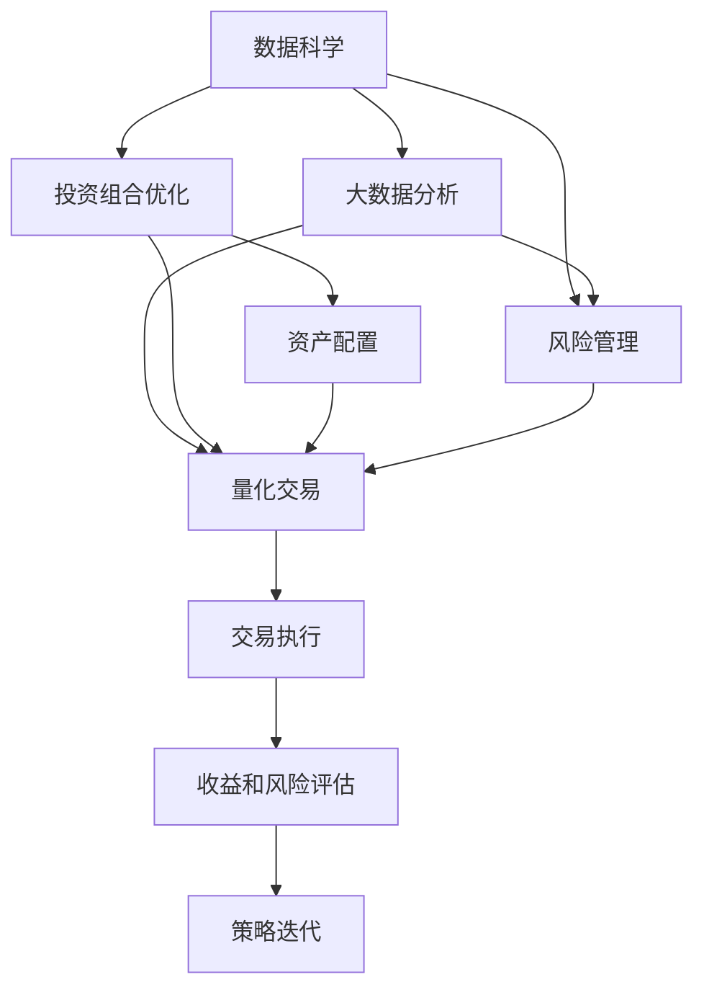

                 

# 程序员如何构建百万美元资产组合

在当今瞬息万变的科技和金融市场中，技术驱动下的创新和投资策略正逐渐成为创建“百万美元资产组合”的关键。对于程序员来说，这不仅意味着在代码编写和算法设计中追求卓越，更需要在构建资产组合时，利用数据科学、金融工程和投资策略的智慧，实现财富的指数级增长。本文将深入探讨程序员构建百万美元资产组合的策略，结合核心概念、算法原理和实际应用，提供系统性的指导。

## 1. 背景介绍

在过去的几十年中，科技的飞速发展和金融市场的全球化推动了资产组合管理的不断演进。如今，程序员在其中的角色愈发重要，他们能够将编程技能和数据分析能力转化为投资策略，打造出高效的资产组合。

### 1.1 问题的由来

随着大数据、人工智能和机器学习的兴起，程序员有了前所未有的机会，可以从数据中挖掘出价值，构建出创新的投资模型。传统资产组合管理依赖于专家经验和手动分析，而新兴的数据驱动方法则提供了更为精确、高效和自动化的解决方案。程序员可以将传统金融与现代科技的结合，创造出新的资产管理策略，如量化交易、大数据投资和人工智能投顾等。

### 1.2 问题核心关键点

构建百万美元资产组合的核心在于选择合适的资产，制定有效的投资策略，并通过编程实现这些策略。具体而言，需要关注以下几个关键点：

- **数据科学**：利用大数据和机器学习技术，对历史和实时市场数据进行深度分析，预测市场趋势。
- **量化投资**：通过构建数学模型和算法，自动化交易决策，优化投资组合的性能。
- **多资产配置**：根据风险偏好和市场环境，合理配置股票、债券、商品、加密货币等多种资产，分散风险。
- **策略迭代**：根据市场反馈和实际表现，不断调整优化投资策略，保持资产组合的动态平衡。

## 2. 核心概念与联系

### 2.1 核心概念概述

构建百万美元资产组合涉及多个核心概念，包括：

- **资产配置**：根据投资目标和风险偏好，分配投资资金到不同种类的资产上。
- **投资组合优化**：通过数学模型，确定最优的资产配置比例，最大化收益并最小化风险。
- **风险管理**：识别、测量和控制投资组合面临的市场风险和非市场风险。
- **量化交易**：利用算法和模型自动化交易决策，提高交易效率和准确性。
- **大数据分析**：从海量市场数据中提取有价值的信息，指导投资决策。

这些概念相互关联，共同构成了构建高效资产组合的基础。

### 2.2 核心概念原理和架构的 Mermaid 流程图



这个流程图展示了核心概念之间的联系：

1. 数据科学通过大数据分析获取市场数据。
2. 投资组合优化基于市场数据，计算最优配置比例。
3. 风险管理评估投资组合的风险水平。
4. 量化交易利用优化结果进行自动化交易。
5. 交易执行后，收益和风险评估模型对策略进行反馈，指导策略迭代。

## 3. 核心算法原理 & 具体操作步骤

### 3.1 算法原理概述

构建资产组合的算法原理基于以下几个核心模型：

- **均值-方差模型**：通过计算资产的期望收益和波动率，构建投资组合的优化目标函数。
- **马科维茨资产配置模型**：利用线性规划求解最优资产配置，实现风险最小化和收益最大化。
- **贝叶斯方法**：通过贝叶斯定理更新市场预测，提高投资决策的准确性。
- **机器学习模型**：利用监督学习和无监督学习算法，预测市场趋势和资产价格。
- **强化学习模型**：通过模拟交易环境，训练最优交易策略，实现动态优化。

### 3.2 算法步骤详解

构建资产组合的算法步骤包括：

1. **数据准备**：收集历史市场数据和实时数据，清洗和处理数据，准备用于模型训练。
2. **模型构建**：选择合适的模型和算法，构建投资组合优化模型。
3. **参数调优**：根据市场情况和投资目标，调整模型参数，优化模型表现。
4. **模拟交易**：使用优化后的模型进行模拟交易，测试投资策略的有效性。
5. **回测分析**：对模拟交易结果进行分析，评估策略的长期表现和风险管理能力。
6. **策略迭代**：根据回测结果和市场变化，不断调整优化投资策略。

### 3.3 算法优缺点

构建资产组合的算法具有以下优点：

- **高效性**：自动化交易和模型优化提高了交易效率和决策速度。
- **精度高**：利用数据驱动的方法，提供精确的市场预测和投资建议。
- **可扩展性**：算法易于扩展和定制，可以根据具体需求进行调整。

但同时也有以下缺点：

- **数据依赖**：模型的准确性高度依赖于数据质量，数据的缺失或不准确会导致预测误差。
- **复杂度**：模型构建和参数调优过程复杂，需要专业知识和技能。
- **计算成本**：模型训练和优化过程计算量大，对计算资源要求高。

### 3.4 算法应用领域

构建资产组合的算法在金融、量化交易、投资咨询等多个领域都有广泛应用。

- **量化交易**：通过自动化算法执行交易决策，提高交易效率和准确性。
- **投资咨询**：利用数据分析和机器学习模型，为客户提供个性化的投资建议。
- **风险管理**：通过风险模型评估投资组合风险，制定相应的风险控制策略。
- **资产管理**：构建和优化投资组合，实现资产的多元化和长期增值。

## 4. 数学模型和公式 & 详细讲解 & 举例说明

### 4.1 数学模型构建

资产配置的核心数学模型包括均值-方差模型和马科维茨资产配置模型。

- **均值-方差模型**：目标函数为最大化投资组合的期望收益，约束条件为投资组合的波动率不超过预设水平。数学表达式为：

$$
\max \sum_{i=1}^n x_i r_i - \frac{1}{2} \sum_{i=1}^n \sum_{j=1}^n x_i x_j \sigma_{ij}
$$

其中，$x_i$ 为资产 $i$ 的权重，$r_i$ 为资产 $i$ 的期望收益率，$\sigma_{ij}$ 为资产 $i$ 和 $j$ 的协方差。

- **马科维茨资产配置模型**：利用线性规划求解均值-方差模型中的最优权重向量 $x$。数学表达式为：

$$
\begin{aligned}
& \min_{x} \frac{1}{2} x^T \Sigma x - x^T \mu \\
& \text{s.t.} \quad A x = b \\
& \quad 0 \leq x \leq U
\end{aligned}
$$

其中，$\Sigma$ 为协方差矩阵，$\mu$ 为期望收益率向量，$A$ 和 $b$ 为线性约束条件，$U$ 为权重上限。

### 4.2 公式推导过程

**均值-方差模型推导**：
- 目标函数：期望收益最大化，即 $\sum_{i=1}^n x_i r_i$。
- 约束条件：波动率限制，即 $\sum_{i=1}^n x_i^2 \sigma_i^2 \leq \sigma^2$。

**马科维茨资产配置模型推导**：
- 通过拉格朗日乘子法和KKT条件，求解线性约束下的最优权重向量 $x$。

### 4.3 案例分析与讲解

假设市场中有两种资产 $A$ 和 $B$，其期望收益和波动率分别为 $r_A = 0.08, r_B = 0.12$，$\sigma_A = 0.2, \sigma_B = 0.3$。投资者希望构建一个投资组合，其期望收益为 $0.10$，波动率不超过 $0.15$。

**构建均值-方差模型**：
- 构建目标函数：$\max 0.08x_A + 0.12x_B - \frac{1}{2}(0.2^2x_A^2 + 0.3^2x_B^2 + 2(0.2)(0.3)x_Ax_B)$。
- 设置波动率约束：$0.2^2x_A^2 + 0.3^2x_B^2 \leq 0.15^2$。

**求解马科维茨模型**：
- 通过线性规划求解最优权重向量 $x$。

## 5. 项目实践：代码实例和详细解释说明

### 5.1 开发环境搭建

构建资产组合项目需要搭建合适的开发环境，以下是具体步骤：

1. **安装Python**：确保Python 3.6及以上版本已安装。
2. **安装必要的库**：
   - NumPy：用于数学计算和数组操作。
   - pandas：用于数据处理和分析。
   - SciPy：用于科学计算和优化算法。
   - scikit-learn：用于机器学习和模型评估。
3. **配置环境**：
   - 使用虚拟环境（如virtualenv）隔离项目依赖。
   - 安装金融库（如QuantLib）和量化交易库（如Zipline）。

### 5.2 源代码详细实现

以下是一个基于Python和pandas库构建资产配置模型的示例代码：

```python
import pandas as pd
import numpy as np
from scipy.optimize import linprog

# 假设数据
r = np.array([0.08, 0.12])  # 期望收益
sigma = np.array([[0.2**2, 0.3*0.2], [0.3*0.2, 0.3**2]])  # 协方差矩阵
b = np.array([0.10])  # 期望收益目标
A = np.array([[1, 1]])  # 约束条件
U = np.array([1, 1])  # 权重上限

# 构建线性规划问题
c = np.array([0.08, 0.12])
A_ub = np.array([[1, 1]])
b_ub = np.array([0.15**2])
c_ub = np.array([0.2**2, 0.3**2])

# 求解最优权重
x0 = linprog(c, A_ub=A_ub, b_ub=b_ub, bounds=(0, U))

# 输出最优权重和组合收益
print(f"最优权重: {x0.x}")
print(f"组合收益: {np.dot(x0.x, r)}")
```

### 5.3 代码解读与分析

- **数据准备**：使用numpy数组表示期望收益和协方差矩阵。
- **模型构建**：定义目标函数、约束条件和权重上限。
- **求解线性规划**：利用scipy的linprog函数求解最优权重向量。
- **输出结果**：打印最优权重和组合收益。

## 6. 实际应用场景

### 6.1 量化交易系统

量化交易系统利用算法和模型进行自动交易，提高交易效率和准确性。通过构建和优化投资组合，量化交易系统可以在短时间内实现高收益。

**应用示例**：
- 利用历史数据训练机器学习模型，预测市场趋势。
- 根据模型输出和市场条件，构建最优资产配置。
- 自动化执行交易决策，动态调整投资组合。

### 6.2 投资咨询平台

投资咨询平台通过数据分析和模型评估，为客户提供个性化的投资建议。通过构建资产组合，平台可以更好地满足客户的多样化需求。

**应用示例**：
- 收集和分析用户风险偏好和历史投资数据。
- 构建多资产配置模型，评估不同资产组合的风险和收益。
- 利用AI技术提供动态调整的投资建议。

### 6.3 风险管理工具

风险管理工具通过量化分析和模型构建，评估投资组合的风险水平，制定相应的风险控制策略。

**应用示例**：
- 使用均值-方差模型和马科维茨模型，计算投资组合的波动率和风险敞口。
- 实时监测市场变化，调整投资组合的风险水平。
- 根据风险评估结果，制定动态调整策略。

## 7. 工具和资源推荐

### 7.1 学习资源推荐

构建资产组合需要掌握金融工程、数据科学和编程技能，以下是一些推荐的资源：

- **金融工程**：
  - 书籍：《金融工程导论》（John Hull）
  - 课程：Coursera的《金融市场与投资组合》

- **数据科学**：
  - 书籍：《Python数据科学手册》（Jake VanderPlas）
  - 课程：edX的《数据科学微专业》

- **编程技能**：
  - 书籍：《Python编程：从入门到实践》（Eric Matthes）
  - 课程：Udemy的《Python数据科学完整路》

### 7.2 开发工具推荐

构建资产组合的项目开发需要依赖多种工具，以下是一些推荐的工具：

- **编程语言**：Python，R，C++等。
- **数据处理**：pandas，NumPy，SciPy等。
- **机器学习**：scikit-learn，TensorFlow，Keras等。
- **量化交易**：Zipline，QuantLib等。

### 7.3 相关论文推荐

构建资产组合的理论与实践涉及多个学科，以下是一些推荐的论文：

- **金融工程**：
  - Markowitz, H. (1952). Portfolio Selection: Efficient Diversification of Investments. The Journal of Finance.
  - Black, F., & Scholes, M. (1973). The Pricing of Options and Corporate Liabilities. Journal of Political Economy.

- **数据科学**：
  - Hastie, T., Tibshirani, R., & Friedman, J. (2009). The Elements of Statistical Learning: Data Mining, Inference, and Prediction. Springer New York.
  - Abadie, A., & Ciliberto, C. (2015). Comparative Study of Methods for the Convergence Rate of Stochastic Gradient Descent. arXiv preprint arXiv:1502.03167.

- **量化交易**：
  - Moskowitz, T. J., Grinblatt, M., & Kara, A. (2006). The Determinants of Mutual Fund Performance. Journal of Financial Economics.
  - Ritter, G. (1993). The Stock Market in Focus: An Empirical Analysis of Continuous-Time Models. Springer.

## 8. 总结：未来发展趋势与挑战

### 8.1 研究成果总结

构建资产组合的研究成果主要集中在以下几个方面：

- **算法创新**：提出新的数学模型和算法，优化投资组合的性能。
- **大数据分析**：利用大数据技术提升市场预测的准确性。
- **策略迭代**：通过不断的策略优化，提高资产组合的适应性和收益。

### 8.2 未来发展趋势

构建资产组合的未来发展趋势包括：

- **模型复杂化**：引入更多高级数学和统计模型，提高投资决策的精确度。
- **自动化程度提升**：利用AI和机器学习，实现更高效率的策略优化和动态调整。
- **多资产配置**：拓展资产种类，构建更加多元化的投资组合。
- **实时化处理**：实时分析市场数据，动态调整投资策略，应对市场波动。

### 8.3 面临的挑战

构建资产组合面临的挑战包括：

- **数据质量**：数据缺失或不准确会导致模型预测误差。
- **模型复杂性**：高阶数学模型和算法增加了开发和优化的难度。
- **计算资源**：模型训练和优化对计算资源要求高。
- **市场风险**：市场波动可能导致投资策略失效。

### 8.4 研究展望

未来的研究应在以下几个方向进行深入探索：

- **模型可解释性**：提高投资策略的可解释性，增强决策透明度。
- **策略稳健性**：开发稳健的投资策略，降低市场波动风险。
- **多资产协同**：实现不同资产之间的协同效应，提高组合收益。
- **动态风险管理**：引入实时风险监控和动态调整机制，提升风险控制能力。

## 9. 附录：常见问题与解答

**Q1: 构建资产组合时，如何选择最优的资产配置？**

A: 选择最优的资产配置需要考虑多个因素，包括期望收益、波动率、风险偏好等。通常使用均值-方差模型或马科维茨资产配置模型进行求解，通过数学优化算法找到最优配置。同时，需要考虑市场的实际环境和投资者的风险承受能力。

**Q2: 量化交易系统如何提高交易效率和准确性？**

A: 量化交易系统通过算法和模型自动执行交易决策，避免了人为操作带来的误差和迟延。通过历史数据的训练和回测，量化系统能够更准确地预测市场趋势和交易时机，提高交易的准确性和收益。

**Q3: 构建资产组合时，如何处理数据缺失或不准确问题？**

A: 数据缺失或不准确是构建资产组合面临的常见问题，可以通过以下方法处理：
- 数据清洗：去除异常值和缺失值。
- 数据插补：使用统计方法或机器学习模型填补缺失值。
- 数据验证：通过交叉验证和回测验证模型的准确性。

**Q4: 构建资产组合时，如何控制投资风险？**

A: 控制投资风险需要综合考虑市场风险和非市场风险。市场风险可以通过分散投资和风险管理工具进行控制，如使用期权和期货进行对冲。非市场风险可以通过优化模型和调整资产配置进行控制，如使用风险调整后的夏普比率（SAR）进行评估。

**Q5: 量化交易系统如何应对市场波动？**

A: 量化交易系统通常通过动态调整策略和优化模型，应对市场波动。例如，引入多资产配置和风险管理策略，动态调整仓位和交易频率。同时，通过回测和压力测试，评估模型在不同市场环境下的表现，进行优化和调整。

---

作者：禅与计算机程序设计艺术 / Zen and the Art of Computer Programming

