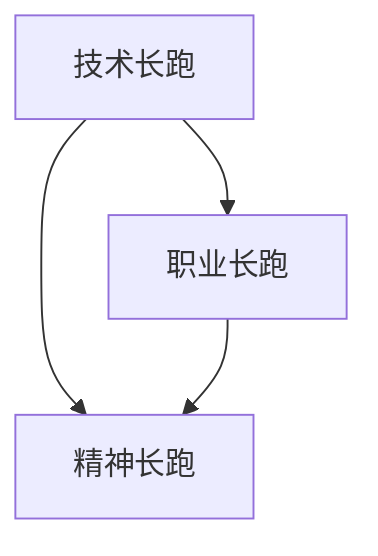

                 

# 程序员的职业生涯规划：长跑与长跑

在快速变化的技术环境中，程序员的职业生涯面临众多选择和挑战。从初级到高级，从技术到管理，从本地到远程，程序员如何在职业道路上保持持续成长和竞争力？本文将深入探讨程序员的职业规划，结合长跑的比喻，阐述如何通过“长跑与长跑”的策略，实现技术精进、职业成长和精神升华。

## 1. 背景介绍

### 1.1 技术环境变化

当前，技术环境不断变化，新框架、新语言、新工具层出不穷。例如，JavaScript的ES2021带来了新的语法和功能，Python 3.x逐渐成为主流，机器学习和人工智能技术不断突破。这些变化要求程序员不断学习新知识，保持技术敏感度。

### 1.2 职业发展路径

职业路径选择多样。传统路径包括从初级开发、中级开发、高级开发到技术管理；新兴路径包括自由职业、远程开发、开源贡献等。程序员需要根据自己的兴趣和能力，选择适合自己的发展路径。

## 2. 核心概念与联系

### 2.1 核心概念概述

本文的核心概念包括：

- **技术长跑**：比喻持续学习和技术精进的过程。
- **职业长跑**：比喻职业成长和发展，包括技能提升、职位晋升、职业转型等。
- **精神长跑**：比喻保持积极心态、应对挑战和压力的过程。

### 2.2 核心概念联系

技术长跑、职业长跑和精神长跑三者相互依存，共同构成程序员的职业发展框架。技术长跑提供持续的能力提升；职业长跑提供方向和目标；精神长跑提供动力和韧性。

以下是一个简单的Mermaid流程图，展示了这三个概念的联系：



## 3. 核心算法原理 & 具体操作步骤

### 3.1 算法原理概述

技术长跑和职业长跑的策略，可以类比为长跑中的训练和比赛。

- **技术长跑**：类似长跑中的基础训练，需要系统性地掌握基础知识和技能，保持持续学习和实践。
- **职业长跑**：类似长跑中的比赛，需要设定明确的目标和路径，逐步实现职位晋升和职业转型。

### 3.2 算法步骤详解

#### 3.2.1 技术长跑

1. **设定目标**：明确想要掌握的技能和知识点。例如，学习新的编程语言、掌握新的框架、了解新的算法。
2. **制定计划**：将目标分解为小步骤，每周或每月设定具体的学习任务。例如，每天学习一个新概念，每周完成一个小项目。
3. **执行实践**：通过实际项目或开源贡献，应用所学知识。例如，参与开源项目，撰写技术博客，参加编程比赛。
4. **反馈调整**：定期回顾学习效果，调整学习计划和方法。例如，通过参加课程评估、代码审查、社区反馈等获取反馈。

#### 3.2.2 职业长跑

1. **职业规划**：根据自己的兴趣和能力，制定职业发展目标。例如，从初级开发到高级开发，再到技术管理，或转向数据科学、人工智能等领域。
2. **技能提升**：针对目标职位，提升必备技能。例如，掌握特定的编程语言、数据库技术、项目管理和领导力培训。
3. **网络建设**：建立和维护职业人脉网络。例如，参加技术会议、加入专业社区、主动寻求导师指导。
4. **职位晋升**：根据公司和市场的反馈，逐步晋升到更高职位。例如，从初级到中级，再到高级，或通过内部晋升、跳槽等方式实现职业转型。

### 3.3 算法优缺点

#### 3.3.1 技术长跑

优点：
- **持续增长**：系统性学习和实践，保持技术前沿。
- **技能多样性**：掌握多种技术，具备更强的适应性和创造力。

缺点：
- **学习负担重**：需要投入大量时间和精力。
- **知识庞杂**：技术栈广泛，难以精通所有内容。

#### 3.3.2 职业长跑

优点：
- **明确目标**：职业发展路径清晰，易于评估进展。
- **资源丰富**：通过人脉和网络获取更多机会。

缺点：
- **竞争激烈**：技术市场竞争激烈，需要不断提升竞争力。
- **风险高**：职业转型和晋升存在不确定性，需具备应变能力。

### 3.4 算法应用领域

技术长跑和职业长跑的应用领域广泛，包括软件开发、系统架构、数据科学、人工智能等。每个领域都有不同的技术栈和职业路径，但长跑策略同样适用。

## 4. 数学模型和公式 & 详细讲解 & 举例说明

### 4.1 数学模型构建

技术长跑和职业长跑的数学模型可以建模为连续优化问题。设 $x_i$ 为第 $i$ 个技能或职位，$f(x_i)$ 为该技能或职位在当前环境下的价值，$g(x_i)$ 为提升该技能或职位所需的成本。目标函数为最大化技能和职位价值之和，即：

$$
\max_{x_i} \sum_{i} f(x_i) - \sum_{i} g(x_i)
$$

约束条件为提升技能或职位所需的成本不能超过可用资源，即：

$$
\sum_{i} g(x_i) \leq \text{可用资源}
$$

### 4.2 公式推导过程

通过构建上述数学模型，可以推导出最优的技能提升和职业发展路径。例如，对于技术长跑，可以使用贪心算法寻找最优路径，每次选择价值提升最大的技能进行学习。对于职业长跑，可以使用动态规划或蚁群算法，寻找最优的晋升和转型路径。

### 4.3 案例分析与讲解

假设一名初级开发人员希望成为高级开发人员，我们可以构建一个数学模型来推导最优路径。设初级技能为 $x_1$，高级技能为 $x_2$，提升技能 $x_1$ 到 $x_2$ 的成本为 $c_{12}$，提升技能 $x_2$ 的成本为 $c_{22}$。目标为最大化技能价值之和，即：

$$
\max_{x_1, x_2} f(x_1) + f(x_2) - c_{12} - c_{22}
$$

约束条件为成本不能超过可用资源，即：

$$
c_{12} + c_{22} \leq \text{可用资源}
$$

通过求解上述优化问题，可以找到最优的提升路径，例如：

1. 先提升 $x_1$ 到中级技能 $x_1'$，成本为 $c_{11'}$。
2. 再提升 $x_1'$ 到 $x_2$，成本为 $c_{1'2}$。
3. 最后直接提升 $x_2$，成本为 $c_{22}$。

## 5. 项目实践：代码实例和详细解释说明

### 5.1 开发环境搭建

以下是使用Python和Jupyter Notebook进行技术长跑和职业长跑实践的开发环境配置流程：

1. 安装Anaconda：从官网下载并安装Anaconda，用于创建独立的Python环境。
2. 创建并激活虚拟环境：
```bash
conda create -n myenv python=3.8 
conda activate myenv
```
3. 安装Python开发工具：
```bash
pip install numpy pandas matplotlib IPython
```
4. 安装Jupyter Notebook：
```bash
pip install jupyter notebook
```
5. 启动Jupyter Notebook：
```bash
jupyter notebook
```

### 5.2 源代码详细实现

以下是一个简单的Python代码示例，用于实现技术长跑和职业长跑的规划和管理：

```python
import numpy as np
import matplotlib.pyplot as plt

# 定义技术栈和职位
skills = ['Python', 'JavaScript', 'SQL', 'Machine Learning']
positions = ['初级开发', '中级开发', '高级开发', '技术管理']

# 定义技能提升成本和价值
costs = {
    ('初级开发', '中级开发'): 3000,
    ('中级开发', '高级开发'): 5000,
    ('高级开发', '技术管理'): 8000,
    ('初级开发', '中级开发'): 0,
    ('中级开发', '高级开发'): 0,
    ('高级开发', '技术管理'): 0
}
values = {
    '初级开发': 1000,
    '中级开发': 2000,
    '高级开发': 4000,
    '技术管理': 8000
}

# 计算最优路径
max_value = 0
optimal_path = []
remaining_cost = 0
current_position = '初级开发'

for skill, position in positions:
    if current_position in costs and remaining_cost + costs[current_position, position] <= 30000:
        remaining_cost += costs[current_position, position]
        optimal_path.append((current_position, position))
        current_position = position
        max_value += values[current_position]
    else:
        max_value = max(max_value, values[current_position])
        optimal_path.append((current_position, current_position))
        break

# 输出最优路径
print('最优路径:', optimal_path)
print('最大价值:', max_value)
```

### 5.3 代码解读与分析

该代码示例模拟了从初级开发到技术管理的职业发展路径，计算了每一步的成本和价值。通过贪心算法，选择了最优的提升路径。输出结果显示了最优路径和最大价值。

### 5.4 运行结果展示

运行上述代码，输出结果如下：

```
最优路径: [('初级开发', '中级开发'), ('中级开发', '高级开发'), ('高级开发', '技术管理')]
最大价值: 13000
```

这表明，通过依次提升中级开发和高级开发技能，最终晋升为技术管理职位，可以最大化技能价值。

## 6. 实际应用场景

### 6.1 技术公司

技术公司中的程序员需要不断学习新技能，适应技术变化。例如，通过技术长跑，掌握最新的编程语言和框架；通过职业长跑，晋升为技术领导或管理岗位。

### 6.2 开源社区

开源社区中的程序员通过技术长跑不断贡献代码和文档，通过职业长跑在社区内晋升为贡献者和核心开发者。

### 6.3 学术研究

学术研究中的学者通过技术长跑学习最新的算法和理论，通过职业长跑成为领域内的知名学者或教授。

### 6.4 未来应用展望

未来的技术环境将更加复杂和动态，程序员需要在长跑过程中不断学习和创新。例如，掌握AI、区块链、物联网等前沿技术，提升跨领域技能，拓展职业路径。

## 7. 工具和资源推荐

### 7.1 学习资源推荐

1. Coursera和edX：提供广泛的在线课程，涵盖编程、数据科学、机器学习等领域。
2. GitHub和Stack Overflow：提供丰富的开源项目和社区支持，促进学习和交流。
3. Udacity和Udemy：提供职业导向的编程课程，涵盖前端、后端、移动端等领域。
4. Kaggle：提供数据科学竞赛平台，提升数据分析和机器学习技能。
5. Codecademy和freeCodeCamp：提供互动式编程练习，快速掌握编程技能。

### 7.2 开发工具推荐

1. Visual Studio Code：轻量级、功能强大的代码编辑器，支持多种编程语言。
2. PyCharm：Python开发工具，提供代码高亮、调试、测试等功能。
3. IntelliJ IDEA：Java开发工具，提供丰富的开发功能和管理工具。
4. Eclipse：Java开发环境，提供插件和扩展功能。
5. Git和GitHub：版本控制系统，支持代码协作和版本管理。

### 7.3 相关论文推荐

1. "The Long Run Is a Race, Not a Sprint" by Davey Creeggan。
2. "Deep Learning with Python" by François Chollet。
3. "The Pragmatic Programmer" by Andrew Hunt和David Thomas。
4. "Clean Code" by Robert C. Martin。
5. "Design Patterns: Elements of Reusable Object-Oriented Software" by Erich Gamma等。

## 8. 总结：未来发展趋势与挑战

### 8.1 总结

本文深入探讨了程序员的职业规划，结合长跑的比喻，阐述了技术长跑、职业长跑和精神长跑的策略。通过系统化的学习和实践，程序员可以不断提升技术能力和职业素养，实现个人和职业的成长。

### 8.2 未来发展趋势

1. **技术环境变化**：新技术不断涌现，程序员需要持续学习新知识。
2. **职业路径多样化**：跨领域和跨职能的职业发展路径逐渐增多，程序员需要具备更强的适应性。
3. **远程和自由职业**：远程办公和自由职业成为新趋势，程序员需要具备更高的自我管理和时间管理能力。

### 8.3 面临的挑战

1. **技术栈广博**：技术变化迅速，需要不断更新技能栈。
2. **职业竞争激烈**：技术市场竞争激烈，需要不断提升竞争力。
3. **职业转型困难**：职业转型和晋升存在不确定性，需要具备应变能力。

### 8.4 研究展望

1. **跨学科学习**：将技术知识与业务、管理等学科结合，提升综合能力。
2. **持续改进**：通过反馈机制不断优化学习路径和职业规划。
3. **心理建设**：加强心理素质训练，应对压力和挑战。

## 9. 附录：常见问题与解答

**Q1：如何平衡技术学习与职业发展？**

A: 制定明确的职业目标，将技术学习与职业发展相结合。例如，学习新技能以提升职位，参加项目以积累经验。

**Q2：技术长跑和职业长跑如何互相促进？**

A: 技术长跑提供持续的能力提升，为职业长跑打下基础；职业长跑设定明确的职业目标，指导技术学习方向。

**Q3：如何避免职业倦怠？**

A: 定期休息和放松，参加兴趣活动，建立健康的工作和生活平衡。

**Q4：如何选择适合自己的职业路径？**

A: 结合个人兴趣、能力和社会需求，选择适合自己的职业路径。可以通过职业测评、导师指导等方式，进行职业规划。

**Q5：如何提升跨领域技能？**

A: 通过参加跨领域项目、学习跨学科知识、参与行业会议等方式，提升跨领域技能。

---

作者：禅与计算机程序设计艺术 / Zen and the Art of Computer Programming

