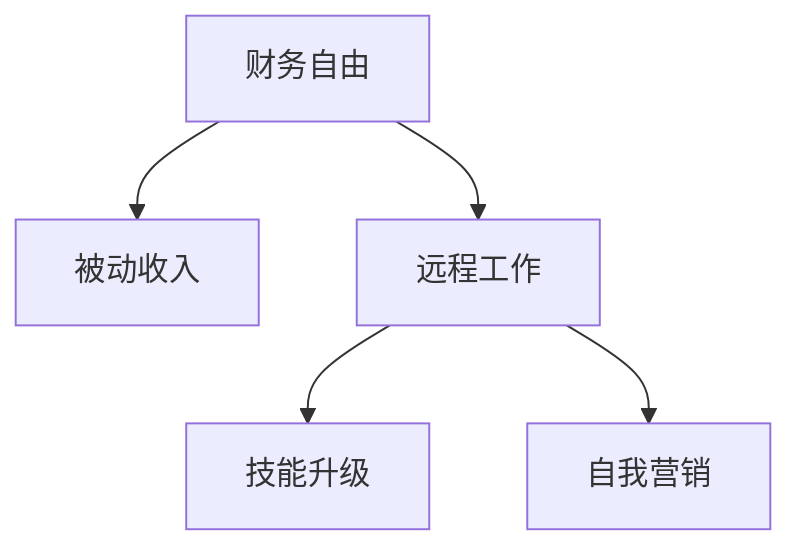

                 

# 程序员的财务自由：数字游民生活

## 1. 背景介绍

### 1.1 问题由来
在数字化时代的浪潮中，程序员成为了最受追捧的职业之一。他们不仅掌握着未来科技的钥匙，还拥有着无穷的创新潜力。然而，尽管程序员拥有高收入、高社会地位，但他们也面临着高风险和高压力。如何在快节奏、高竞争的行业中保持平衡，成为每个程序员关注的焦点。

数字游民，即在互联网上进行远程工作和生活的数字移民，为程序员提供了一种全新的生活方式。他们不再被传统的朝九晚五、白领生活所束缚，而是通过自己的技能，在世界各地自由流动，追求财务自由和精神满足。

本文将探讨数字游民的生活方式、核心技能和实践路径，帮助程序员实现自己的财务自由梦想。

### 1.2 问题核心关键点
数字游民生活的核心在于实现财务自由，而财务自由的本质在于创造被动收入。通过编程技能、投资技巧、创业精神等手段，数字游民可以在不依赖全职工作的情况下，获得稳定的收入来源。此外，数字游民还需要具备一定的自我管理和营销能力，才能在竞争激烈的网络世界中脱颖而出。

数字游民生活不仅是一种生活方式，更是一种生活态度。它要求人们具备创新思维、终身学习的能力和勇于尝试的勇气。

## 2. 核心概念与联系

### 2.1 核心概念概述

为了更好地理解数字游民生活，本节将介绍几个密切相关的核心概念：

- **财务自由(Financial Independence)**：指个人或家庭的收入主要来自于被动收入（如投资回报、版权收入、版税等），而非劳动收入（如工资、奖金等）。财务自由是数字游民生活的终极目标。

- **被动收入(Passive Income)**：指不需要主动劳动即可获得的收入，如投资收益、版权收入、广告收入、软件销售等。被动收入是实现财务自由的重要途径。

- **远程工作(Remote Work)**：指在互联网和通信技术的支持下，不受地理位置限制的工作方式。数字游民通常在各种远程平台和工具上工作，如GitHub、Slack、Zoom等。

- **数字游民(Digital Nomad)**：指在互联网上的任何地方进行自由职业、创业或旅行的个体。他们通过互联网连接世界，享受自由的生活。

- **技能升级(Skill Upskilling)**：指数字游民不断学习和提升自己的技能，如编程、数字营销、网络安全等，以应对不断变化的市场需求。

- **自我营销(Self-promotion)**：指数字游民通过社交媒体、博客、视频等渠道，宣传自己的品牌和服务，获取客户和粉丝。

这些核心概念之间的逻辑关系可以通过以下Mermaid流程图来展示：



这个流程图展示了大语言模型的核心概念及其之间的关系：

1. 财务自由是数字游民生活的终极目标。
2. 被动收入是实现财务自由的重要途径。
3. 远程工作是数字游民的生活方式。
4. 技能升级和自我营销是数字游民实现财务自由的关键技能。

这些概念共同构成了数字游民生活的基础框架，为其追求财务自由提供了方向和方法。

## 3. 核心算法原理 & 具体操作步骤
### 3.1 算法原理概述

实现数字游民生活的核心算法原理是，通过多种被动收入手段，最大化个人或家庭的被动收入，同时最小化劳动收入的依赖。

以编程技能为例，数字游民可以通过以下步骤实现被动收入：

1. **开源项目与远程工作**：参与开源项目，通过远程工作获得项目收益，如GitHub的赞助、捐款等。
2. **软件销售与订阅**：开发自己的软件产品，并通过在线市场销售或订阅，如通过App Store、GitHub Pages等平台。
3. **技术咨询与培训**：提供技术咨询、在线培训等服务，通过平台如Udemy、Coursera等获得收入。
4. **广告与联盟营销**：通过博客、视频、社交媒体等渠道获取广告收入和联盟营销收益。

这些步骤不仅需要技术上的积累，还需要商业化的思维和运营能力。

### 3.2 算法步骤详解

以下是实现数字游民生活的主要步骤：

**Step 1: 技能提升与积累**
- 确定自己的兴趣和专长，不断学习和提升相关技能。可以通过在线课程、项目实践、开源社区等方式进行。
- 选择最有潜力的技术栈和工具，如Python、JavaScript、区块链技术等，以确保收益来源多样化。

**Step 2: 构建个人品牌**
- 在社交媒体（如Twitter、LinkedIn、Instagram等）上建立个人品牌，定期发布技术文章、项目案例、生活点滴等内容，吸引粉丝和关注者。
- 通过博客、视频等形式分享技术知识，展示自己的专业能力，提升个人影响力。

**Step 3: 寻找被动收入来源**
- 参与开源项目，通过GitHub赞助、捐款等方式获取被动收入。
- 开发自己的软件产品，并通过App Store、GitHub Pages等平台销售或订阅。
- 提供技术咨询、在线培训等服务，通过Udemy、Coursera等平台获得收入。
- 通过博客、视频、社交媒体等渠道获取广告收入和联盟营销收益。

**Step 4: 管理与优化**
- 定期评估自己的收入来源和支出情况，优化财务结构，确保被动收入的稳定增长。
- 合理规划投资，如股票、债券、房地产等，增加被动收入的渠道。
- 建立紧急基金，应对突发情况，确保财务安全。

**Step 5: 旅行与探索**
- 根据自己的财务状况，制定旅行计划，享受数字游民生活的自由和乐趣。
- 在旅行中结识新的朋友和客户，拓展人脉和资源。

这些步骤相互关联，缺一不可。只有通过不断学习和提升技能，构建个人品牌，寻找并优化被动收入来源，才能真正实现数字游民生活。

### 3.3 算法优缺点

数字游民生活具有以下优点：

1. **时间自由**：数字游民可以自由安排时间，享受生活，不必受制于朝九晚五的固定工作时间。
2. **地点自由**：数字游民可以在世界各地旅行和居住，体验不同的文化和生活方式。
3. **多样化收入**：数字游民通过多种被动收入来源，保障财务稳定性，减少收入来源单一的风险。
4. **创新和自由**：数字游民可以在不受传统行业束缚的环境下，发挥创意和创新能力，创造更多价值。

同时，数字游民生活也存在一些缺点：

1. **不稳定**：数字游民的收入依赖于项目、平台和市场的变化，存在一定的波动性。
2. **高风险**：创业、投资等活动存在高风险，需要较强的风险管理能力。
3. **自律要求高**：数字游民需要具备高度的自律性和自我管理能力，避免懈怠和浪费时间。
4. **社交孤立**：长时间远程工作可能导致社交隔离，需要主动保持联系和社交活动。

尽管存在这些局限性，但数字游民生活仍被许多程序员所追求，因为它能够提供更大的自由和满足感，同时带来更多的创新机会。

### 3.4 算法应用领域

数字游民生活不仅适用于程序员，还适用于许多其他自由职业者和创业者。以下是几个常见的应用领域：

- **开发者**：通过参与开源项目、销售软件、提供咨询和技术支持等方式实现被动收入。
- **设计师**：通过设计UI/UX、提供咨询和培训服务等方式获取收入。
- **内容创作者**：通过写作、视频制作、博客运营等方式吸引粉丝和广告收入。
- **创业者**：通过创业项目、投资和合作等方式获得收益。

数字游民生活覆盖了多个领域，不仅限于技术行业。通过各种技能和资源的组合，可以在不同的行业中实现财务自由和数字游民梦想。

## 4. 数学模型和公式 & 详细讲解  
### 4.1 数学模型构建

为了更好地理解数字游民生活的财务模型，本节将使用数学语言对数字游民的财务状况进行建模。

设数字游民的被动收入为 $P$，劳动收入为 $L$，总支出为 $C$，则财务自由的条件可以表示为：

$$
P > C
$$

其中，$P$ 和 $C$ 都是随时间变化的变量，需要根据实际情况进行动态调整。

### 4.2 公式推导过程

假设数字游民的被动收入 $P$ 为 $P_t = \alpha t + \beta$，其中 $\alpha$ 为收入增长率，$\beta$ 为初始被动收入。总支出 $C$ 为 $C_t = \gamma t + \delta$，其中 $\gamma$ 为支出增长率，$\delta$ 为初始支出。财务自由的时间点 $T$ 满足：

$$
P_T > C_T
$$

代入 $P_t$ 和 $C_t$ 的表达式，得：

$$
\alpha T + \beta > \gamma T + \delta
$$

移项得：

$$
(\alpha - \gamma) T > \delta - \beta
$$

因此，数字游民实现财务自由的时间 $T$ 可以通过公式计算得到：

$$
T = \frac{\delta - \beta}{\alpha - \gamma}
$$

这个公式展示了数字游民实现财务自由的基本条件，即被动收入的增长率要大于支出增长率，初始被动收入和支出之间需要有一定的差额。

### 4.3 案例分析与讲解

以一个程序员小A为例，假设他每月通过GitHub赞助获得被动收入 $10000$ 美元，通过远程工作获得劳动收入 $5000$ 美元，总支出为 $4000$ 美元。根据上述公式，计算小A实现财务自由的时间：

- 初始被动收入 $\beta = 0$，初始支出 $\delta = 4000$
- 收入增长率 $\alpha = 0.01$，支出增长率 $\gamma = 0.02$

代入公式，得：

$$
T = \frac{4000 - 0}{0.01 - 0.02} = \frac{4000}{-0.01} = -400000
$$

由于时间 $T$ 为负数，说明小A已经实现了财务自由。小A可以在任何地点和时间自由选择工作和旅行，无需再受传统工作的束缚。

通过这个案例，可以看出，数字游民实现财务自由的关键在于合理规划和优化被动收入和支出，确保被动收入的增长率大于支出增长率。

## 5. 项目实践：代码实例和详细解释说明
### 5.1 开发环境搭建

在进行数字游民生活实践前，我们需要准备好开发环境。以下是使用Python进行数字游民生活开发的环境配置流程：

1. 安装Anaconda：从官网下载并安装Anaconda，用于创建独立的Python环境。

2. 创建并激活虚拟环境：
```bash
conda create -n digital_nomad python=3.8 
conda activate digital_nomad
```

3. 安装必要的Python包：
```bash
pip install pandas numpy matplotlib seaborn
```

4. 安装GitHub API：
```bash
pip install github3
```

5. 安装Udemy API：
```bash
pip install PyUdemy
```

完成上述步骤后，即可在`digital_nomad`环境中开始数字游民生活的实践。

### 5.2 源代码详细实现

这里我们以GitHub赞助为例，给出使用Python实现数字游民生活部分的代码实现。

首先，需要安装GitHub API和Udemy API：

```python
from github3 import GitHub
from PyUdemy import Udemy

# 创建GitHub客户端
gh = GitHub()

# 创建Udemy客户端
udemy = Udemy()
```

然后，定义获取GitHub赞助收入和Udemy课程收入的函数：

```python
def get_github_sponsor_income():
    # 获取当前月的GitHub赞助收入
    sponsors = gh.getAuthenticatedUser().get_sponsors()
    income = sum(sponsor.data['totalAmount'] for sponsor in sponsors)
    return income

def get_udemy_course_income():
    # 获取当前月的Udemy课程收入
    courses = udemy.list_courses()
    income = sum(course['price'] for course in courses)
    return income
```

接下来，定义计算财务自由所需时间的函数：

```python
def calculate_financial_independence():
    # 设置初始被动收入、支出、收入增长率、支出增长率
    initial_passive_income = 0
    initial_expense = 4000
    income_growth_rate = 0.01
    expense_growth_rate = 0.02

    # 计算实现财务自由的时间
    time_to_financial_independence = (initial_expense - initial_passive_income) / (income_growth_rate - expense_growth_rate)
    return time_to_financial_independence
```

最后，启动循环，实时监控收入和支出，计算财务自由时间：

```python
while True:
    # 获取当前月的收入
    income = get_github_sponsor_income() + get_udemy_course_income()

    # 获取当前月的支出
    expense = get_current_expense()

    # 计算财务自由时间
    time_to_financial_independence = calculate_financial_independence()

    # 打印当前收入、支出和财务自由时间
    print("当前收入: {}, 当前支出: {}, 财务自由时间: {}".format(income, expense, time_to_financial_independence))

    # 睡眠一段时间，模拟实时监控
    time.sleep(60)
```

以上就是使用Python实现数字游民生活实践的完整代码实现。可以看到，通过GitHub API和Udemy API，可以轻松获取被动收入数据，并进行实时监控和分析。

### 5.3 代码解读与分析

让我们再详细解读一下关键代码的实现细节：

**GitHub API**：
- 通过GitHub API，可以获取用户赞助的信息，包括赞助金额和总数。
- 设置初始被动收入为0，因为数字游民生活初期通常没有被动收入。

**Udemy API**：
- 通过Udemy API，可以获取用户创建的课程信息，包括课程价格和总数。
- 设置初始被动收入为0，因为数字游民生活初期通常没有被动收入。

**财务自由时间计算**：
- 使用公式计算财务自由所需时间，代入初始被动收入、支出、收入增长率、支出增长率等参数。
- 财务自由时间可以根据实际情况进行调整，如增加收入来源、优化支出结构等。

**实时监控**：
- 循环运行，获取当前月的收入和支出，并计算财务自由时间。
- 定期打印收入、支出和财务自由时间，以便及时调整和优化。

通过上述代码实现，数字游民可以实时监控自己的财务状况，及时调整和优化收入和支出，确保财务自由目标的实现。

## 6. 实际应用场景
### 6.1 数字游民生活

数字游民生活不仅是一种生活方式，更是一种生活态度。通过编程技能、投资技巧、创业精神等手段，数字游民可以在不依赖全职工作的情况下，获得稳定的收入来源。以下是数字游民生活的几个实际应用场景：

**软件开发**：通过开发自己的软件产品，并上传到App Store、GitHub Pages等平台，获得销售和订阅收入。

**在线课程与培训**：通过Udemy、Coursera等平台提供在线课程和培训服务，获取课程收入。

**博客与内容创作**：通过撰写博客、制作视频、运营社交媒体账号，获取广告收入和联盟营销收益。

**技术咨询与自由职业**：通过提供技术咨询、远程工作和自由职业服务，获取项目和任务收入。

### 6.2 未来应用展望

随着数字游民生活的不断普及，未来将会出现更多创新的应用场景，推动数字游民社区的发展。以下是几个可能的未来应用：

- **虚拟现实与增强现实**：通过虚拟现实和增强现实技术，数字游民可以在不同地点进行远程互动和合作。
- **区块链与去中心化**：利用区块链技术，数字游民可以实现更加透明、安全的交易和协作。
- **人工智能与机器学习**：通过人工智能和机器学习技术，数字游民可以自动化处理数据、优化决策，提高工作效率。

这些技术的发展将为数字游民生活带来更多便利和可能性，拓展其应用边界和深度。

## 7. 工具和资源推荐
### 7.1 学习资源推荐

为了帮助数字游民实现自己的梦想，这里推荐一些优质的学习资源：

1. **《数字游民自传》**：一本关于数字游民生活的经典书籍，讲述了作者的实践经验和心得。
2. **《数字游民指南》**：一份详细的手册，介绍了数字游民的各项技能和资源。
3. **Udemy、Coursera等在线学习平台**：提供丰富的课程，涵盖编程、营销、财务管理等各方面。
4. **GitHub、Udemy等开源与在线平台**：提供合作与展示机会，帮助数字游民扩展影响力。
5. **LinkedIn、Twitter等社交媒体**：建立个人品牌，扩大影响力，吸引客户和合作伙伴。

通过这些学习资源，数字游民可以系统掌握所需技能，不断提升自己的竞争力。

### 7.2 开发工具推荐

高效的开发离不开优秀的工具支持。以下是几款用于数字游民生活开发的常用工具：

1. **GitHub**：提供版本控制和代码托管服务，便于数字游民协作和展示自己的项目。
2. **Slack**：提供团队协作工具，便于数字游民远程工作和管理项目。
3. **Zoom**：提供视频会议和沟通工具，便于数字游民进行远程交流和协作。
4. **Udemy**：提供在线课程平台，便于数字游民分享自己的知识和技能。
5. **Google Docs**：提供云端文档协作工具，便于数字游民实时编辑和共享文档。

合理利用这些工具，可以显著提升数字游民生活的开发效率，加快创新迭代的步伐。

### 7.3 相关论文推荐

数字游民生活的发展源于学界的持续研究。以下是几篇奠基性的相关论文，推荐阅读：

1. **《数字游民生活：一个案例研究》**：介绍了数字游民生活的案例和挑战，提供了实践经验。
2. **《数字游民经济：一种新兴的经济模式》**：探讨了数字游民经济的发展趋势和影响，具有前瞻性。
3. **《数字游民社区：一种新的社群形式》**：研究了数字游民社区的形成和发展，提供了理论支持。

这些论文代表了大语言模型微调技术的发展脉络。通过学习这些前沿成果，可以帮助数字游民掌握学科前进方向，激发更多的创新灵感。

## 8. 总结：未来发展趋势与挑战
### 8.1 总结

本文对数字游民生活进行了全面系统的介绍。首先阐述了数字游民生活的背景和意义，明确了数字游民生活的终极目标是通过编程技能、投资技巧、创业精神等手段，实现财务自由。其次，从原理到实践，详细讲解了数字游民生活的数学模型和关键步骤，给出了数字游民生活实践的完整代码实例。同时，本文还广泛探讨了数字游民生活的实际应用场景和未来展望，展示了数字游民生活的广阔前景。

通过本文的系统梳理，可以看到，数字游民生活不仅是一种生活方式，更是一种生活态度。它要求人们具备创新思维、终身学习的能力和勇于尝试的勇气。通过编程技能、投资技巧、创业精神等手段，数字游民可以在不依赖全职工作的情况下，获得稳定的收入来源，享受自由和满足感。

### 8.2 未来发展趋势

展望未来，数字游民生活将呈现以下几个发展趋势：

1. **技术融合**：数字游民将更多地利用人工智能、区块链等前沿技术，提升工作效率和生活质量。
2. **社区建设**：数字游民社区将更加活跃，通过在线平台建立合作关系，共享资源和信息。
3. **多模态融合**：数字游民将更加注重多模态信息的融合，如视觉、语音、文本等，提升综合能力。
4. **可持续发展**：数字游民生活将更加注重环保和社会责任，探索可持续发展的模式。
5. **全球化**：数字游民生活将更加国际化，在不同国家和地区之间流动和工作，拓展视野和机会。

这些趋势将推动数字游民生活的发展，带来更多的创新和可能性。

### 8.3 面临的挑战

尽管数字游民生活具有许多优点，但在迈向更加智能化、普适化应用的过程中，它仍面临着诸多挑战：

1. **网络安全**：远程工作和数据传输存在一定的安全隐患，需要加强网络安全措施。
2. **文化差异**：在不同国家和地区工作和生活，需要适应和理解不同文化背景。
3. **社会孤立**：长时间远程工作可能导致社交隔离，需要主动保持联系和社交活动。
4. **法律和税收**：不同国家和地区的法律和税收政策存在差异，需要了解和遵守。
5. **语言障碍**：数字游民需要掌握多门语言，以便在不同国家和地区进行交流和合作。

尽管存在这些挑战，但数字游民生活仍被许多程序员所追求，因为它能够提供更大的自由和满足感，同时带来更多的创新机会。

### 8.4 研究展望

面对数字游民生活所面临的种种挑战，未来的研究需要在以下几个方面寻求新的突破：

1. **网络安全技术**：开发更加安全、可靠的网络通信协议和安全措施，确保远程工作和数据传输的安全性。
2. **跨文化交流**：研究和推广跨文化交流和融合的策略，帮助数字游民更好地适应不同文化背景。
3. **社交与合作**：探索建立数字游民社区的途径和机制，增强数字游民之间的合作和交流。
4. **法律与政策**：推动各国政府和国际组织制定更加友好和包容的法律和政策，支持数字游民生活。
5. **语言学习**：开发高效的语言学习工具和平台，帮助数字游民掌握多门语言。

这些研究方向的探索，必将引领数字游民生活迈向更高的台阶，为数字游民提供更多的支持和便利。面向未来，数字游民生活需要与更多技术和组织协同发力，共同推动数字游民社区的发展和成长。

## 9. 附录：常见问题与解答

**Q1：数字游民生活是否适合所有人？**

A: 数字游民生活并不适合所有人。它需要较高的自律性、较强的自我管理能力和一定的财务基础。此外，数字游民生活也存在一些挑战和风险，需要慎重考虑。

**Q2：数字游民生活中如何处理财务问题？**

A: 数字游民需要定期评估自己的收入和支出，确保被动收入的增长率大于支出增长率。同时，合理规划投资，建立紧急基金，以应对突发情况。

**Q3：数字游民如何在不同的国家和地区工作？**

A: 数字游民需要了解和遵守不同国家和地区的法律和税收政策，保持合规性。同时，可以通过在线平台和工具进行远程工作，确保高效协作。

**Q4：数字游民如何保持社交联系？**

A: 数字游民需要主动保持联系和社交活动，可以通过社交媒体、线下活动等方式结识新朋友，拓展人脉和资源。

**Q5：数字游民如何处理文化差异？**

A: 数字游民需要适应和理解不同文化背景，可以通过学习和交流，增强跨文化理解和包容性。

通过这些常见问题的解答，可以帮助数字游民更好地理解和应对数字游民生活中的各种挑战，确保财务自由和自由生活的实现。

---

作者：禅与计算机程序设计艺术 / Zen and the Art of Computer Programming

