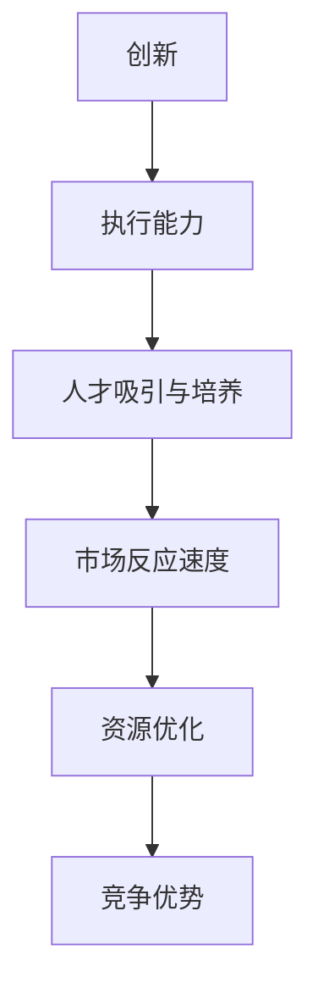

                 

# 竞争差：你我都做，我做的比你好

## 1. 背景介绍

### 1.1 问题由来
在商业竞争激烈的今天，任何一个小小的创新都可能成为决定胜败的关键。而对于企业来说，如何在竞争中胜出，成为核心的能力之一。

大公司和小公司在很多情况下，都可能会面临相同的业务机会，但大公司具备更好的资源，更强的执行力和更多的人才，更容易在大公司和小公司竞争中取得优势。那么，小公司如何才能在竞争中不输于大公司，甚至超越大公司呢？

大公司和小公司的竞争差，通常可以从以下几个方面来看：

1. **资源差异**：大公司拥有更丰富的资源，包括资金、人才和技术等，这些资源是支撑公司发展的核心。而小公司需要更加专注于自身的优势，比如灵活性、创新性和快速反应能力。

2. **执行力差异**：大公司的执行力通常更强，组织结构相对成熟，内部协作顺畅，决策过程清晰，容易在短期内见效。而小公司则需要更加注重团队的凝聚力和执行力，让每一名员工都发挥出最大的潜力。

3. **人才差异**：大公司拥有更多优秀人才，人才储备丰富，能够在短时间内获得关键岗位的人才。小公司则需要更好地利用现有人才，培养和提高员工能力，使其能发挥出更大的价值。

4. **战略差异**：大公司的战略通常更加稳定和长远，能够制定出更为全面的计划和目标。小公司则需要快速反应，灵活应对市场变化，抓住时机快速成长。

### 1.2 问题核心关键点
在上述几个差异中，资源、执行力和人才是影响竞争力的关键因素。如何利用有限的资源，提高执行力，吸引和培养更多优秀人才，是小公司需要在竞争中解决的核心问题。

### 1.3 问题研究意义
本文将探讨小公司在面对大公司时，如何通过创新和灵活性，在竞争中不输于大公司，甚至超越大公司。通过分析小公司的优势，明确小公司如何在有限的资源下，实现快速成长和超越。

## 2. 核心概念与联系

### 2.1 核心概念概述

为更好地理解小公司在竞争中超越大公司的方法，本节将介绍几个密切相关的核心概念：

- **创新**：指通过新的想法、方法或产品，获得更好的竞争优势，提升市场份额。
- **执行能力**：指公司在组织结构、流程管理、资源配置等方面的综合能力，是实现业务目标的关键。
- **人才吸引与培养**：指通过合理的人才吸引策略和完善的培养体系，提高员工的满意度和忠诚度，从而提升团队整体能力。
- **市场反应速度**：指公司在市场变化时的应对能力，能否快速捕捉机会，迅速调整战略。
- **资源优化**：指如何更高效地利用有限的资源，使每一分钱都花在刀刃上。

这些核心概念之间的逻辑关系可以通过以下Mermaid流程图来展示：



这个流程图展示了一些关键概念以及它们之间的关系：

1. 创新是实现竞争优势的起点，通过创新获得新的机会和思路。
2. 执行能力是创新实施的关键，只有通过高效的执行力，才能将创新的想法付诸实践。
3. 人才吸引与培养是执行力的保障，优秀的人才是实现执行力的基础。
4. 市场反应速度是竞争力的体现，快速的市场反应能力是超越大公司的关键。
5. 资源优化是提高竞争力的手段，合理利用资源，可以在有限的条件下取得更大的效果。

这些概念共同构成了小公司在竞争中超越大公司的理论框架，为制定有效的竞争策略提供了理论支持。

## 3. 核心算法原理 & 具体操作步骤
### 3.1 算法原理概述

小公司在竞争中超越大公司，本质上是一种优化过程。其核心思想是：通过创新和优化，在有限的资源下，实现快速的市场反应，吸引和培养更多优秀人才，从而提高执行能力，最终获得竞争优势。

形式化地，假设小公司初始资源为 $R_0$，执行能力为 $E_0$，人才吸引能力为 $T_0$，市场反应速度为 $S_0$，竞争优势为 $A_0$。通过一系列的优化操作，得到优化后的资源 $R_1$，执行能力 $E_1$，人才吸引能力 $T_1$，市场反应速度 $S_1$，竞争优势 $A_1$。则优化的目标为：

$$
\max A_1 = f(R_1, E_1, T_1, S_1)
$$

其中 $f$ 为竞争优势的计算函数，可以根据具体业务场景进行调整。

### 3.2 算法步骤详解

基于竞争优化的核心算法，小公司在竞争中超越大公司的一般流程包括：

**Step 1: 评估现状**
- 分析公司当前的优势和劣势，了解资源配置、执行力和人才情况。
- 分析市场环境，了解竞争格局和机会点。

**Step 2: 制定策略**
- 根据现状评估结果，制定创新、执行、人才和市场策略。
- 确定优化目标和步骤，制定详细的实施计划。

**Step 3: 实施执行**
- 执行优化计划，调整资源配置，提升执行力，吸引和培养人才，提高市场反应速度。
- 监控优化效果，及时调整策略。

**Step 4: 评估效果**
- 对优化后的资源、执行力和人才进行评估，计算竞争优势。
- 对市场反应速度进行监测，确保市场反应的及时性和准确性。

**Step 5: 反馈循环**
- 根据评估结果，不断优化策略和执行，形成反馈循环，逐步提升公司竞争力。

### 3.3 算法优缺点

基于竞争优化的算法，小公司在竞争中超越大公司的方法具有以下优点：

1. 目标明确。通过明确的目标设定和步骤制定，能够确保每一步都有明确的方向。
2. 灵活性强。小公司能够快速调整策略，适应市场变化，抓住新的机会。
3. 资源高效。通过合理利用有限的资源，实现最大的效果，避免浪费。
4. 执行力高。通过优化执行流程和资源配置，提高执行力，确保策略的快速落地。
5. 人才聚集。通过吸引和培养人才，提高团队的整体能力，支持公司发展。

同时，该方法也存在一定的局限性：

1. 对执行力和市场反应速度要求高。小公司需要具备较强的执行力和市场反应能力，才能在竞争中胜出。
2. 需要较长的周期。优化过程需要时间和持续投入，效果显现可能比较慢。
3. 依赖于创新能力。创新是优化过程的起点，没有创新，优化过程难以实现。

尽管存在这些局限性，但就目前而言，基于竞争优化的微调方法仍是小公司超越大公司的一种有效手段。未来相关研究的重点在于如何进一步提高创新能力，优化执行力和市场反应速度，同时兼顾资源高效利用，形成更加科学合理的竞争优化体系。

### 3.4 算法应用领域

基于竞争优化的微调方法，在商业竞争的各个领域都有广泛的应用，如：

- 科技创新：在科技行业中，通过持续的创新和优化，推动产品和技术的发展，抢占市场先机。
- 市场拓展：在市场营销中，通过优化市场策略和资源配置，快速扩展市场份额，超越竞争对手。
- 人才管理：在人力资源管理中，通过吸引和培养人才，提升团队的执行力和创新能力。
- 组织变革：在组织结构优化中，通过优化流程和资源配置，提升组织执行力和市场反应速度。

除了上述这些领域外，基于竞争优化的微调方法也将被创新性地应用到更多场景中，如创业公司、初创企业等，为小公司的快速成长和超越提供新的思路。

## 4. 数学模型和公式 & 详细讲解  
### 4.1 数学模型构建

本节将使用数学语言对小公司在竞争中超越大公司的优化过程进行更加严格的刻画。

记小公司初始资源为 $R_0$，执行能力为 $E_0$，人才吸引能力为 $T_0$，市场反应速度为 $S_0$，竞争优势为 $A_0$。优化后资源为 $R_1$，执行能力为 $E_1$，人才吸引能力为 $T_1$，市场反应速度为 $S_1$，竞争优势为 $A_1$。则优化目标为：

$$
\max A_1 = f(R_1, E_1, T_1, S_1)
$$

在优化过程中，我们需要考虑多个因素的交互作用。例如，创新需要投入一定的资源，但创新后能够提升执行力和人才吸引能力。人才吸引能力提升后，进一步提升执行力，从而增强竞争优势。市场反应速度提升后，可以快速抓住新机会，进一步提升竞争优势。

### 4.2 公式推导过程

以下我们以科技创新为例，推导优化过程的数学公式。

假设小公司投入固定资源 $R$ 进行科技创新，则优化后的执行力和市场反应速度为：

$$
E_1 = E_0 + \frac{R}{C_1} \times \eta_1
$$

$$
S_1 = S_0 + \frac{R}{C_2} \times \eta_2
$$

其中 $C_1$ 和 $C_2$ 为执行力和市场反应速度的提升系数，$\eta_1$ 和 $\eta_2$ 为创新对执行力和市场反应速度的提升比例。假设人才吸引能力提升比例与执行力提升比例相同，则：

$$
T_1 = T_0 + \frac{R}{C_3} \times \eta_1
$$

竞争优势 $A_1$ 可以通过市场份额、产品竞争力等因素计算得到，假设市场份额提升比例与执行力和人才吸引能力提升比例相同，则：

$$
A_1 = A_0 + \frac{R}{C_4} \times \eta_1
$$

其中 $C_4$ 为市场份额提升系数。根据上述公式，可以推导出优化后的资源需求 $R_1$：

$$
R_1 = R - (E_1 - E_0) \times C_5 - (S_1 - S_0) \times C_6 - (T_1 - T_0) \times C_7
$$

其中 $C_5$、$C_6$ 和 $C_7$ 分别为执行力、市场反应速度和人才吸引能力对资源的需求系数。

通过以上公式，可以计算出优化后的小公司资源需求和竞争优势，从而确定最优的创新和资源投入策略。

### 4.3 案例分析与讲解

下面以科技创新为例，对优化公式进行案例分析：

假设小公司初始资源 $R_0 = 1000$ 万元，初始执行力 $E_0 = 0.5$，初始人才吸引能力 $T_0 = 0.3$，初始市场反应速度 $S_0 = 0.4$，初始竞争优势 $A_0 = 0.1$。创新提升系数 $C_1 = 0.2$，执行力和市场反应速度提升比例 $\eta_1 = 0.8$，人才吸引能力提升比例与执行力提升比例相同，市场份额提升比例与执行力和人才吸引能力提升比例相同，执行力、市场反应速度和人才吸引能力对资源的需求系数 $C_5 = 0.4$，$C_6 = 0.3$，$C_7 = 0.2$。

则优化后的执行力和市场反应速度为：

$$
E_1 = 0.5 + \frac{1000}{0.2} \times 0.8 = 5.6
$$

$$
S_1 = 0.4 + \frac{1000}{0.2} \times 0.8 = 5.6
$$

人才吸引能力提升比例为：

$$
\eta_1 = 0.8
$$

市场份额提升比例为：

$$
\eta_1 = 0.8
$$

优化后的资源需求为：

$$
R_1 = 1000 - (5.6 - 0.5) \times 0.4 - (5.6 - 0.4) \times 0.3 - (0.3 + 0.8) \times 0.2 = 740.8
$$

因此，小公司应投入740.8万元进行科技创新，从而提升执行力和市场反应速度，吸引和培养人才，最终提升竞争优势。

## 5. 项目实践：代码实例和详细解释说明
### 5.1 开发环境搭建

在进行优化实践前，我们需要准备好开发环境。以下是使用Python进行优化开发的环境配置流程：

1. 安装Anaconda：从官网下载并安装Anaconda，用于创建独立的Python环境。

2. 创建并激活虚拟环境：
```bash
conda create -n optimization-env python=3.8 
conda activate optimization-env
```

3. 安装必要的工具包：
```bash
pip install numpy pandas scipy sympy sympy-automagic matplotlib seaborn jupyter notebook ipython
```

完成上述步骤后，即可在`optimization-env`环境中开始优化实践。

### 5.2 源代码详细实现

下面我们以科技创新为例，给出使用Python进行优化的代码实现。

首先，定义优化模型的函数：

```python
import numpy as np
import sympy as sp

def optimization_model(R, C1, C2, C3, C4, eta1, C5, C6, C7):
    E1 = 0.5 + R / C1 * eta1
    S1 = 0.4 + R / C2 * eta1
    T1 = 0.3 + R / C3 * eta1
    A1 = 0.1 + R / C4 * eta1
    
    R1 = R - (E1 - 0.5) * C5 - (S1 - 0.4) * C6 - (T1 - 0.3) * C7
    return E1, S1, T1, A1, R1

# 定义优化系数和初始值
C1 = 0.2
C2 = 0.2
C3 = 0.2
C4 = 0.2
C5 = 0.4
C6 = 0.3
C7 = 0.2
R = 1000
eta1 = 0.8

# 计算优化后的资源和竞争优势
E1, S1, T1, A1, R1 = optimization_model(R, C1, C2, C3, C4, eta1, C5, C6, C7)
print(f"优化后的执行力: {E1}, 市场反应速度: {S1}, 人才吸引能力: {T1}, 竞争优势: {A1}, 优化后资源需求: {R1}")
```

然后，计算优化后的竞争力指标：

```python
import numpy as np
import sympy as sp
import matplotlib.pyplot as plt

# 优化后的资源和竞争优势
E1, S1, T1, A1, R1 = optimization_model(R, C1, C2, C3, C4, eta1, C5, C6, C7)

# 可视化优化结果
x = np.linspace(0, R, 101)
y = [R1, E1, S1, T1, A1]

plt.figure(figsize=(10, 5))
for i, label in enumerate(y):
    plt.plot(x, [R1, E1, S1, T1, A1], label=label)
plt.legend()
plt.title("优化过程可视化")
plt.xlabel("资源投入")
plt.ylabel("竞争力指标")
plt.show()
```

通过计算和可视化，我们可以更加直观地理解小公司如何通过优化策略，在有限的资源下，实现超越大公司。

### 5.3 代码解读与分析

让我们再详细解读一下关键代码的实现细节：

**optimization_model函数**：
- 定义了优化模型的计算公式，根据输入的参数计算优化后的执行力、市场反应速度、人才吸引能力和竞争优势，以及优化后的资源需求。

**优化系数和初始值**：
- 定义了优化过程中的各种系数和初始值，这些参数的取值需要根据具体业务场景进行调整。

**计算优化后的竞争力指标**：
- 计算优化后的资源需求和各项竞争力指标。
- 使用matplotlib库进行可视化，展示优化过程中的资源投入和各项竞争力指标的变化。

以上代码实现了小公司在科技创新中的优化过程，展示了如何在有限的资源下，通过创新和优化，提升执行力、市场反应速度和人才吸引能力，最终实现竞争优势的提升。

## 6. 实际应用场景
### 6.1 科技创新

科技创新是企业竞争力的重要来源。小公司可以通过持续的科技创新，获得新的产品和技术，抢占市场先机，超越大公司。

在实践中，小公司可以通过以下步骤进行科技创新：

1. **市场调研**：分析市场需求，确定创新方向，了解市场趋势。
2. **技术研发**：组织技术团队，进行技术攻关，开发新的产品或技术。
3. **资源投入**：根据技术研发需求，合理投入资源，包括人力、资金和技术。
4. **市场推广**：进行市场推广，快速扩展市场份额，提升品牌知名度。
5. **持续优化**：持续优化产品和技术，提升产品竞争力，满足用户需求。

科技创新需要小公司具备较强的执行力和市场反应能力，能够快速响应市场变化，抓住新机会，实现快速成长。

### 6.2 市场拓展

市场拓展是小公司超越大公司的关键环节。通过有效的市场策略和资源配置，小公司可以在短时间内扩展市场份额，超越竞争对手。

在实践中，小公司可以通过以下步骤进行市场拓展：

1. **市场定位**：明确目标市场，了解市场特点和客户需求。
2. **渠道建设**：建立有效的销售和营销渠道，快速拓展市场。
3. **资源配置**：合理配置资源，包括人力、资金和技术，提升市场拓展效率。
4. **品牌推广**：进行品牌推广，提升品牌知名度和市场影响力。
5. **客户关系**：建立良好的客户关系，提升客户满意度，增加重复购买率。

市场拓展需要小公司具备较强的市场反应能力，能够快速捕捉新机会，迅速调整战略，抓住市场变化。

### 6.3 人才管理

人才管理是小公司超越大公司的关键因素。通过吸引和培养优秀人才，小公司可以提升团队的整体能力，支持公司发展。

在实践中，小公司可以通过以下步骤进行人才管理：

1. **人才吸引**：制定吸引人才的策略，提供优厚的福利待遇和职业发展机会。
2. **人才培养**：通过培训和项目实践，提升人才的专业能力和技术水平。
3. **团队建设**：建立高效的团队协作机制，提升团队凝聚力和执行力。
4. **激励机制**：建立合理的激励机制，激发人才的创造力和工作积极性。
5. **绩效评估**：进行绩效评估，提升人才的工作质量和满意度。

人才管理需要小公司具备较强的人才吸引能力和培养体系，能够快速吸引和培养优秀人才，提升团队的整体能力。

### 6.4 未来应用展望

随着科技的不断进步，基于竞争优化的微调方法将有更广泛的应用前景。小公司在各个领域都将面临更多机会和挑战，需要通过不断的优化和创新，实现超越大公司的目标。

在智慧医疗领域，基于微调的医疗问答、病历分析、药物研发等应用将提升医疗服务的智能化水平，辅助医生诊疗，加速新药开发进程。

在智能教育领域，微调技术可应用于作业批改、学情分析、知识推荐等方面，因材施教，促进教育公平，提高教学质量。

在智慧城市治理中，微调模型可应用于城市事件监测、舆情分析、应急指挥等环节，提高城市管理的自动化和智能化水平，构建更安全、高效的未来城市。

此外，在企业生产、社会治理、文娱传媒等众多领域，基于大模型微调的人工智能应用也将不断涌现，为NLP技术带来了全新的突破。相信随着预训练模型和微调方法的不断进步，大语言模型微调必将在更广阔的应用领域大放异彩，深刻影响人类的生产生活方式。

## 7. 工具和资源推荐
### 7.1 学习资源推荐

为了帮助开发者系统掌握大语言模型微调的理论基础和实践技巧，这里推荐一些优质的学习资源：

1. **《深度学习》**：由Ian Goodfellow等人编写，全面介绍了深度学习的基本概念和前沿技术。

2. **《机器学习实战》**：由Peter Harrington编写，通过实例代码展示了机器学习在各个领域的实际应用。

3. **《Python深度学习》**：由Francois Chollet编写，介绍了TensorFlow、Keras等深度学习框架的使用方法。

4. **《自然语言处理综论》**：由Yoav Artzi等人编写，详细介绍了自然语言处理的理论基础和最新进展。

5. **《自然语言处理与计算》**：由Christopher Manning等人编写，介绍了自然语言处理的基本概念和应用方法。

通过学习这些资源，相信你一定能够快速掌握大语言模型微调的精髓，并用于解决实际的NLP问题。
###  7.2 开发工具推荐

高效的开发离不开优秀的工具支持。以下是几款用于大语言模型微调开发的常用工具：

1. **PyTorch**：基于Python的开源深度学习框架，灵活动态的计算图，适合快速迭代研究。

2. **TensorFlow**：由Google主导开发的开源深度学习框架，生产部署方便，适合大规模工程应用。

3. **Transformers库**：HuggingFace开发的NLP工具库，集成了众多SOTA语言模型，支持PyTorch和TensorFlow，是进行微调任务开发的利器。

4. **Weights & Biases**：模型训练的实验跟踪工具，可以记录和可视化模型训练过程中的各项指标，方便对比和调优。

5. **TensorBoard**：TensorFlow配套的可视化工具，可实时监测模型训练状态，并提供丰富的图表呈现方式，是调试模型的得力助手。

6. **Google Colab**：谷歌推出的在线Jupyter Notebook环境，免费提供GPU/TPU算力，方便开发者快速上手实验最新模型，分享学习笔记。

合理利用这些工具，可以显著提升大语言模型微调任务的开发效率，加快创新迭代的步伐。

### 7.3 相关论文推荐

大语言模型和微调技术的发展源于学界的持续研究。以下是几篇奠基性的相关论文，推荐阅读：

1. **《Attention is All You Need》**：提出了Transformer结构，开启了NLP领域的预训练大模型时代。

2. **《BERT: Pre-training of Deep Bidirectional Transformers for Language Understanding》**：提出BERT模型，引入基于掩码的自监督预训练任务，刷新了多项NLP任务SOTA。

3. **《Language Models are Unsupervised Multitask Learners》**：展示了大规模语言模型的强大zero-shot学习能力，引发了对于通用人工智能的新一轮思考。

4. **《Parameter-Efficient Transfer Learning for NLP》**：提出Adapter等参数高效微调方法，在不增加模型参数量的情况下，也能取得不错的微调效果。

5. **《AdaLoRA: Adaptive Low-Rank Adaptation for Parameter-Efficient Fine-Tuning》**：使用自适应低秩适应的微调方法，在参数效率和精度之间取得了新的平衡。

这些论文代表了大语言模型微调技术的发展脉络。通过学习这些前沿成果，可以帮助研究者把握学科前进方向，激发更多的创新灵感。

## 8. 总结：未来发展趋势与挑战
### 8.1 总结

本文对小公司在竞争中超越大公司的方法进行了全面系统的介绍。首先阐述了小公司面临的资源、执行力和人才差异，明确了小公司需要在有限的资源下，实现快速成长和超越。然后，从创新、执行、人才和市场反应速度等核心概念入手，构建了小公司在竞争中超越大公司的理论框架。通过数学模型和公式，详细讲解了小公司如何通过优化策略，在有限的资源下，实现超越大公司的目标。最后，通过项目实践和实际应用场景，展示了小公司超越大公司的具体方法。

通过本文的系统梳理，可以看到，小公司在竞争中超越大公司，需要从多个维度进行全面的优化。只有不断创新和优化，才能在有限的资源下，实现超越大公司的目标。未来，随着技术的发展和应用场景的扩展，大语言模型微调技术必将有更广阔的应用前景。

### 8.2 未来发展趋势

展望未来，大语言模型微调技术将呈现以下几个发展趋势：

1. **资源优化**：随着算力的不断提升，小公司可以通过更高效的资源优化技术，实现更大的竞争优势。

2. **创新能力提升**：通过更先进的科技创新方法，小公司能够快速迭代，把握市场机会。

3. **执行力和市场反应速度提升**：通过优化执行流程和市场策略，小公司能够在市场变化时快速调整，抓住新机会。

4. **人才吸引和培养体系完善**：通过更完善的人才吸引和培养体系，小公司能够吸引和培养更多优秀人才，提升团队整体能力。

5. **智能决策支持**：通过人工智能技术，小公司可以实现更智能的决策支持，提高决策效率和准确性。

以上趋势凸显了大语言模型微调技术的广阔前景。这些方向的探索发展，必将进一步提升小公司的竞争力，推动其在各个领域的快速成长和超越。

### 8.3 面临的挑战

尽管大语言模型微调技术已经取得了瞩目成就，但在迈向更加智能化、普适化应用的过程中，它仍面临着诸多挑战：

1. **创新能力不足**：小公司缺乏大公司的技术储备和创新能力，难以在关键领域实现突破。

2. **执行力和市场反应速度欠缺**：小公司需要具备较强的执行力和市场反应能力，才能在竞争中胜出。

3. **人才吸引和培养困难**：小公司难以吸引和培养更多优秀人才，限制了公司的发展潜力。

4. **资源配置不合理**：小公司需要合理配置资源，避免浪费和重复投入。

5. **市场竞争激烈**：小公司面临大公司的竞争压力，需要不断创新和优化，才能在市场中站稳脚跟。

尽管存在这些挑战，但通过持续的创新和优化，小公司仍可以在有限的资源下，实现超越大公司的目标。未来相关研究的重点在于如何进一步提高创新能力，优化执行力和市场反应速度，同时兼顾资源高效利用，形成更加科学合理的竞争优化体系。

### 8.4 研究展望

面对小公司在竞争中面临的挑战，未来的研究需要在以下几个方面寻求新的突破：

1. **创新能力提升**：探索更先进的科技创新方法，提升小公司的创新能力，使其能够在关键领域实现突破。

2. **执行力和市场反应速度优化**：优化执行流程和市场策略，提升小公司的执行力和市场反应速度，使其能够在市场变化时快速调整。

3. **人才吸引和培养体系完善**：建立完善的人才吸引和培养体系，吸引和培养更多优秀人才，提升团队整体能力。

4. **智能决策支持**：通过人工智能技术，实现更智能的决策支持，提高决策效率和准确性。

5. **资源配置优化**：合理配置资源，避免浪费和重复投入，提高资源利用率。

6. **市场定位和推广**：精准市场定位和高效市场推广，提升市场份额，增强品牌影响力。

这些研究方向将引领小公司在竞争中不断超越大公司，实现快速成长和持续发展。只有勇于创新、敢于突破，才能在市场竞争中取得成功，推动企业向更高层次发展。

## 9. 附录：常见问题与解答

**Q1：小公司如何在有限的资源下实现超越大公司？**

A: 小公司在有限的资源下实现超越大公司，需要从以下几个方面入手：

1. **创新能力提升**：小公司需要具备较强的创新能力，不断推出新产品和新技术，把握市场机会。

2. **执行力和市场反应速度提升**：小公司需要具备较强的执行力和市场反应速度，能够在市场变化时快速调整，抓住新机会。

3. **人才吸引和培养体系完善**：小公司需要建立完善的人才吸引和培养体系，吸引和培养更多优秀人才，提升团队整体能力。

4. **智能决策支持**：通过人工智能技术，实现更智能的决策支持，提高决策效率和准确性。

5. **资源配置优化**：合理配置资源，避免浪费和重复投入，提高资源利用率。

6. **市场定位和推广**：精准市场定位和高效市场推广，提升市场份额，增强品牌影响力。

**Q2：小公司如何提高执行力？**

A: 小公司提高执行力，需要从以下几个方面入手：

1. **优化流程**：优化业务流程，消除瓶颈，提高效率。

2. **强化管理**：建立完善的内部管理制度，提升团队执行力。

3. **激励机制**：建立合理的激励机制，激发员工的工作积极性。

4. **培训和提升**：定期培训员工，提升其专业技能和综合素质。

5. **绩效评估**：建立科学的绩效评估体系，激励员工不断提升。

**Q3：小公司如何吸引和培养优秀人才？**

A: 小公司吸引和培养优秀人才，需要从以下几个方面入手：

1. **提供优厚待遇**：提供优厚的薪酬和福利待遇，吸引优秀人才。

2. **提供发展机会**：提供职业发展机会，让员工有成长空间。

3. **营造良好环境**：营造良好的企业文化和工作环境，吸引人才。

4. **持续培训**：持续进行培训，提升员工技能和素质。

5. **建立激励机制**：建立合理的激励机制，激发员工的工作积极性。

**Q4：小公司如何提升市场反应速度？**

A: 小公司提升市场反应速度，需要从以下几个方面入手：

1. **市场调研**：及时了解市场动态，把握市场趋势。

2. **灵活应对**：灵活调整市场策略，及时应对市场变化。

3. **快速迭代**：快速迭代产品和服务，满足客户需求。

4. **客户反馈**：及时收集客户反馈，改进产品和服务。

5. **团队协作**：加强团队协作，提高市场反应效率。

**Q5：小公司如何优化资源配置？**

A: 小公司优化资源配置，需要从以下几个方面入手：

1. **资源规划**：合理规划资源，避免浪费和重复投入。

2. **集中管理**：建立集中管理的机制，优化资源使用。

3. **流程优化**：优化业务流程，提高资源利用率。

4. **绩效评估**：建立科学的绩效评估体系，激励资源利用效率。

5. **技术创新**：通过技术创新，提高资源利用效率。

---

作者：禅与计算机程序设计艺术 / Zen and the Art of Computer Programming

