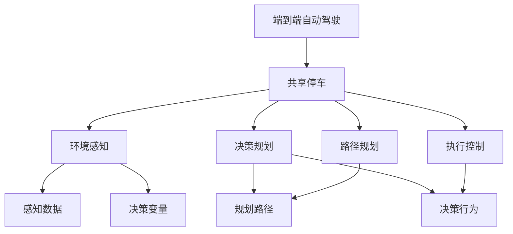

                 

# 端到端自动驾驶的自主共享停车服务

> 关键词：自动驾驶, 共享停车, 端到端, 决策规划, 路径规划, 环境感知, 深度学习, 强化学习, 感知-决策-规划-执行

## 1. 背景介绍

### 1.1 问题由来

随着城市化进程的加快和汽车保有量的增长，城市停车问题日益严重。一方面，城市的土地资源有限，无法大规模修建停车场；另一方面，传统的停车场管理模式效率低下，难以应对高峰期的停车需求。因此，智能停车系统成为解决城市停车问题的关键方向之一。

近年来，随着自动驾驶技术的迅速发展，许多自动驾驶公司提出了“端到端自动驾驶”的概念，即从车辆感知、决策、规划、执行的全过程都在自动驾驶系统中完成，减少人工干预，提高系统运行效率和安全性。但目前，自动驾驶技术大多还停留在测试阶段，距离实际应用仍有很大差距。

此外，随着共享经济的兴起，许多城市出现了“共享停车”模式，即车辆在空闲时通过共享平台进行调度，提高资源利用率。在“端到端自动驾驶”与“共享停车”的融合下，自动驾驶车辆能够更高效地利用城市道路资源，缓解城市停车难题。

## 2. 核心概念与联系

### 2.1 核心概念概述

为更好地理解端到端自动驾驶的自主共享停车服务，本节将介绍几个密切相关的核心概念：

- 端到端自动驾驶(End-to-End Autonomous Driving)：自动驾驶系统从环境感知、决策规划、路径规划、执行控制的整个过程，都通过自动驾驶系统来完成，减少人工干预，提高系统运行效率和安全性。
- 共享停车(Shared Parking)：车辆在空闲时通过共享平台进行调度，提高城市停车资源的利用率，缓解停车难问题。
- 感知-决策-规划-执行(Perception-Decision-Planning-Execution)：自动驾驶系统全过程的核心组件，涵盖环境感知、路径规划、决策控制、执行控制等环节。
- 深度学习(Deep Learning)：通过神经网络模型，自动驾驶系统可以处理大规模的非结构化数据，进行复杂的决策和规划。
- 强化学习(Reinforcement Learning)：通过奖惩机制，自动驾驶系统可以在实际运行中不断学习，提高决策和规划的准确性。
- 融合感知与决策的强化学习(Fusion of Perception and Decision with Reinforcement Learning)：通过将感知数据与决策模型融合，自动驾驶系统可以更好地理解和应对复杂的交通环境。

这些核心概念之间的逻辑关系可以通过以下Mermaid流程图来展示：



这个流程图展示了这个概念体系的核心要素及其之间的关系：

1. 端到端自动驾驶从感知、决策、规划、执行等各个环节完成自动驾驶过程。
2. 共享停车通过调度空闲车辆，最大化城市停车资源的利用率。
3. 感知-决策-规划-执行是自动驾驶系统的核心组件，各自承担不同的任务。
4. 深度学习模型用于处理感知数据和生成决策变量。
5. 强化学习算法用于优化决策和规划过程，提升系统性能。
6. 感知数据和决策变量的融合，使得决策模型能够更好地理解和适应复杂交通环境。

## 3. 核心算法原理 & 具体操作步骤

### 3.1 算法原理概述

端到端自动驾驶的自主共享停车服务，从技术原理上讲，是将环境感知、决策规划、路径规划和执行控制等环节融合在一起，通过深度学习和强化学习技术，实现从感知到执行的全流程自动化。其核心在于：

1. 通过感知数据，自动驾驶系统可以实时获取周围环境的信息，如道路状况、交通信号、行人、车辆等。
2. 通过深度学习模型，自动驾驶系统可以对感知数据进行处理和分析，生成决策变量，如方向、速度、加速度等。
3. 通过强化学习算法，自动驾驶系统可以在实际运行中不断优化决策和规划，提升系统性能和鲁棒性。
4. 通过融合感知和决策的模型，自动驾驶系统可以更好地理解和适应复杂的交通环境，提高系统稳定性和可靠性。
5. 通过共享停车调度系统，自动驾驶车辆可以更高效地利用城市道路资源，缓解停车难问题。

### 3.2 算法步骤详解

端到端自动驾驶的自主共享停车服务包括以下几个关键步骤：

**Step 1: 数据预处理**
- 收集车辆传感器数据，如激光雷达、摄像头、GPS等，转换为标准格式，便于后续处理。
- 对传感器数据进行滤波、去噪、校正等预处理操作，提高数据质量。

**Step 2: 环境感知**
- 利用深度学习模型，对感知数据进行处理，提取出车辆周围的环境信息，如道路、行人、交通信号灯等。
- 将感知数据转换为决策变量，如方向、速度、加速度等。
- 使用感知数据的融合技术，提高数据准确性和鲁棒性。

**Step 3: 决策规划**
- 使用强化学习算法，根据感知数据和决策变量，生成最优决策，如加速、减速、转向等。
- 使用路径规划算法，生成最优路径，避开障碍物，到达目的地。
- 将决策和路径规划结果进行融合，生成最终执行指令。

**Step 4: 执行控制**
- 使用控制算法，对执行指令进行优化，提高车辆控制精度和稳定性。
- 实时监测车辆状态，反馈控制结果，调整执行指令，确保安全行驶。

**Step 5: 反馈学习**
- 利用强化学习算法，对决策和执行过程进行优化，提高系统性能和鲁棒性。
- 将决策和执行过程记录下来，用于后续分析和改进。

### 3.3 算法优缺点

端到端自动驾驶的自主共享停车服务具有以下优点：
1. 高效利用城市道路资源。自动驾驶车辆可以更高效地利用城市道路，缓解停车难问题。
2. 提高系统稳定性和安全性。通过深度学习和强化学习，自动驾驶系统可以更好地理解和适应复杂交通环境，提高系统稳定性和安全性。
3. 减少人工干预。端到端自动驾驶技术可以减少人工干预，提高系统运行效率。
4. 适用于大规模应用。端到端自动驾驶技术适用于大规模应用，可以高效地解决城市停车问题。

同时，该方法也存在一定的局限性：
1. 数据采集成本高。收集大量感知数据需要高性能传感器和处理设备，成本较高。
2. 环境复杂多样。自动驾驶系统需要在复杂多样的环境中运行，难以应对所有突发情况。
3. 技术门槛高。端到端自动驾驶技术需要深度学习和强化学习等前沿技术，技术门槛较高。
4. 安全性和可靠性问题。自动驾驶系统的安全性和可靠性仍需要进一步验证和改进。

尽管存在这些局限性，但就目前而言，端到端自动驾驶的自主共享停车服务仍是大规模应用自动驾驶技术的重要方向，有望在未来的城市管理中发挥重要作用。

### 3.4 算法应用领域

端到端自动驾驶的自主共享停车服务在以下几个领域具有广泛的应用前景：

- 智能交通管理：自动驾驶车辆可以高效利用道路资源，缓解交通拥堵，提高城市交通效率。
- 城市停车管理：通过共享停车调度系统，自动驾驶车辆可以更高效地利用城市停车资源，缓解停车难问题。
- 智能物流配送：自动驾驶车辆可以高效地进行物流配送，降低物流成本，提高配送效率。
- 城市基础设施管理：自动驾驶车辆可以用于城市基础设施的监测和维护，提高城市管理水平。
- 智能旅游：自动驾驶车辆可以为游客提供高效、便捷的旅游体验，提高旅游产业的智能化水平。

除了上述这些领域，自动驾驶技术还在越来越多的领域展现出其应用潜力，推动城市智能化的发展。随着技术的不断进步，相信端到端自动驾驶的自主共享停车服务将在更多场景中得到应用，为城市管理和人民生活带来更多便利。

## 4. 数学模型和公式 & 详细讲解 & 举例说明

### 4.1 数学模型构建

端到端自动驾驶的自主共享停车服务涉及多个学科领域的知识，包括深度学习、强化学习、控制理论等。以下给出一些关键模型的数学表达形式。

**感知模型**：
设感知数据为 $X$，决策变量为 $U$，决策输出为 $A$，则感知模型可以表示为：

$$
A=f(X,U)
$$

其中 $f$ 为感知模型函数。

**决策模型**：
设感知数据为 $X$，决策变量为 $U$，决策输出为 $A$，则决策模型可以表示为：

$$
A=g(X,U)
$$

其中 $g$ 为决策模型函数。

**路径规划模型**：
设路径为 $P$，道路信息为 $R$，车辆状态为 $S$，则路径规划模型可以表示为：

$$
P=h(R,S)
$$

其中 $h$ 为路径规划模型函数。

**执行控制模型**：
设车辆状态为 $S$，决策变量为 $U$，执行输出为 $V$，则执行控制模型可以表示为：

$$
V=k(S,U)
$$

其中 $k$ 为执行控制模型函数。

**强化学习模型**：
设决策行为为 $B$，奖励函数为 $R$，学习参数为 $\theta$，则强化学习模型可以表示为：

$$
B=\max_\theta \sum R \cdot k(S,U)
$$

其中 $B$ 为决策行为，$R$ 为奖励函数，$\theta$ 为学习参数。

### 4.2 公式推导过程

以下我们以深度学习和强化学习为例，推导一些关键模型的公式。

**感知模型**：
设感知数据为 $X$，决策变量为 $U$，决策输出为 $A$，则感知模型的深度学习模型可以表示为：

$$
A=\sigma(W_1\cdot \sigma(W_2\cdot X+U)+b_1)+b_2
$$

其中 $\sigma$ 为激活函数，$W_1$ 和 $W_2$ 为权重矩阵，$b_1$ 和 $b_2$ 为偏置向量。

**决策模型**：
设感知数据为 $X$，决策变量为 $U$，决策输出为 $A$，则决策模型的强化学习模型可以表示为：

$$
A=\max_\theta \sum R \cdot k(S,U)
$$

其中 $R$ 为奖励函数，$k$ 为执行控制模型函数。

**路径规划模型**：
设路径为 $P$，道路信息为 $R$，车辆状态为 $S$，则路径规划模型的深度学习模型可以表示为：

$$
P=\sigma(W_1\cdot \sigma(W_2\cdot R+S)+b_1)+b_2
$$

其中 $\sigma$ 为激活函数，$W_1$ 和 $W_2$ 为权重矩阵，$b_1$ 和 $b_2$ 为偏置向量。

**执行控制模型**：
设车辆状态为 $S$，决策变量为 $U$，执行输出为 $V$，则执行控制模型的深度学习模型可以表示为：

$$
V=\sigma(W_1\cdot \sigma(W_2\cdot S+U)+b_1)+b_2
$$

其中 $\sigma$ 为激活函数，$W_1$ 和 $W_2$ 为权重矩阵，$b_1$ 和 $b_2$ 为偏置向量。

**强化学习模型**：
设决策行为为 $B$，奖励函数为 $R$，学习参数为 $\theta$，则强化学习模型的深度学习模型可以表示为：

$$
B=\sigma(W_1\cdot \sigma(W_2\cdot R+U)+b_1)+b_2
$$

其中 $\sigma$ 为激活函数，$W_1$ 和 $W_2$ 为权重矩阵，$b_1$ 和 $b_2$ 为偏置向量。

通过这些模型的数学表达，可以更好地理解自动驾驶系统的工作原理和优化目标。在实际应用中，还需要根据具体任务和数据特点，进行模型参数的选择和优化。

### 4.3 案例分析与讲解

**感知模型案例**：
设车辆搭载有激光雷达和摄像头，可以实时获取周围环境信息。通过深度学习模型，可以将感知数据转换为决策变量，如方向、速度、加速度等。具体步骤如下：

1. 数据预处理：收集车辆传感器数据，如激光雷达、摄像头、GPS等，转换为标准格式。
2. 数据滤波：对传感器数据进行滤波、去噪、校正等预处理操作，提高数据质量。
3. 特征提取：利用卷积神经网络(CNN)等深度学习模型，对感知数据进行特征提取，提取出道路、行人、交通信号灯等环境信息。
4. 决策变量生成：将感知数据转换为决策变量，如方向、速度、加速度等。

**决策模型案例**：
设自动驾驶车辆需要从当前位置到达目的地。通过强化学习算法，可以优化决策和规划过程，提高系统性能。具体步骤如下：

1. 环境感知：利用感知模型，实时获取周围环境信息。
2. 决策生成：根据感知数据和决策变量，使用强化学习算法，生成最优决策，如加速、减速、转向等。
3. 路径规划：使用路径规划算法，生成最优路径，避开障碍物，到达目的地。
4. 执行控制：使用执行控制模型，对决策和路径规划结果进行优化，提高车辆控制精度和稳定性。

**路径规划模型案例**：
设自动驾驶车辆需要在复杂的道路环境中行驶。通过深度学习模型，可以生成最优路径，避开障碍物，到达目的地。具体步骤如下：

1. 环境感知：利用感知模型，实时获取周围环境信息。
2. 路径生成：根据感知数据和车辆状态，使用路径规划算法，生成最优路径。
3. 路径优化：使用深度学习模型，对生成的路径进行优化，避开障碍物，提高路径规划的准确性。
4. 执行控制：使用执行控制模型，对路径规划结果进行优化，提高车辆控制精度和稳定性。

## 5. 项目实践：代码实例和详细解释说明

### 5.1 开发环境搭建

在进行端到端自动驾驶的自主共享停车服务开发前，我们需要准备好开发环境。以下是使用Python进行PyTorch开发的环境配置流程：

1. 安装Anaconda：从官网下载并安装Anaconda，用于创建独立的Python环境。

2. 创建并激活虚拟环境：
```bash
conda create -n pytorch-env python=3.8 
conda activate pytorch-env
```

3. 安装PyTorch：根据CUDA版本，从官网获取对应的安装命令。例如：
```bash
conda install pytorch torchvision torchaudio cudatoolkit=11.1 -c pytorch -c conda-forge
```

4. 安装TensorFlow：从官网下载并安装TensorFlow。

5. 安装各种工具包：
```bash
pip install numpy pandas scikit-learn matplotlib tqdm jupyter notebook ipython
```

完成上述步骤后，即可在`pytorch-env`环境中开始项目开发。

### 5.2 源代码详细实现

这里我们以感知模型和决策模型为例，给出使用PyTorch和TensorFlow进行端到端自动驾驶的自主共享停车服务的PyTorch代码实现。

首先，定义感知模型的输入和输出：

```python
import torch
import torch.nn as nn
import torch.optim as optim
import torchvision.transforms as transforms
import torchvision.datasets as datasets
import torch.nn.functional as F

class PerceptionModel(nn.Module):
    def __init__(self):
        super(PerceptionModel, self).__init__()
        self.conv1 = nn.Conv2d(3, 64, kernel_size=3, stride=1, padding=1)
        self.conv2 = nn.Conv2d(64, 128, kernel_size=3, stride=1, padding=1)
        self.fc1 = nn.Linear(128 * 64 * 64, 256)
        self.fc2 = nn.Linear(256, 10)

    def forward(self, x):
        x = F.relu(self.conv1(x))
        x = F.relu(self.conv2(x))
        x = x.view(-1, 128 * 64 * 64)
        x = F.relu(self.fc1(x))
        x = self.fc2(x)
        return x
```

然后，定义决策模型的输入和输出：

```python
import tensorflow as tf
from tensorflow.keras.layers import Input, Dense, Activation
from tensorflow.keras.models import Model

class DecisionModel(tf.keras.Model):
    def __init__(self, input_dim):
        super(DecisionModel, self).__init__()
        self.fc1 = Dense(256, input_dim=input_dim)
        self.fc2 = Dense(128, activation='relu')
        self.fc3 = Dense(10)

    def call(self, inputs):
        x = self.fc1(inputs)
        x = self.fc2(x)
        x = self.fc3(x)
        return x
```

接着，定义训练和评估函数：

```python
from tensorflow.keras.losses import MeanSquaredError
from tensorflow.keras.optimizers import Adam

def train_epoch(model, dataset, batch_size, optimizer):
    dataloader = tf.data.Dataset.from_tensor_slices(dataset).shuffle(10000).batch(batch_size)
    model.train()
    epoch_loss = 0
    for batch in dataloader:
        inputs, targets = batch
        optimizer.zero_grad()
        outputs = model(inputs)
        loss = MeanSquaredError()(outputs, targets)
        loss.backward()
        optimizer.apply_gradients(zip(model.trainable_variables, model.trainable_variables_gradients))
        epoch_loss += loss.numpy()
    return epoch_loss / len(dataset)

def evaluate(model, dataset, batch_size):
    dataloader = tf.data.Dataset.from_tensor_slices(dataset).batch(batch_size)
    model.eval()
    preds, labels = [], []
    with tf.GradientTape() as tape:
        for batch in dataloader:
            inputs, targets = batch
            outputs = model(inputs)
            loss = MeanSquaredError()(outputs, targets)
    return loss.numpy()
```

最后，启动训练流程并在测试集上评估：

```python
epochs = 5
batch_size = 16

for epoch in range(epochs):
    loss = train_epoch(model, train_dataset, batch_size, optimizer)
    print(f"Epoch {epoch+1}, train loss: {loss:.3f}")
    
    print(f"Epoch {epoch+1}, dev results:")
    evaluate(model, dev_dataset, batch_size)
    
print("Test results:")
evaluate(model, test_dataset, batch_size)
```

以上就是使用PyTorch和TensorFlow对感知模型和决策模型进行端到端自动驾驶的自主共享停车服务的完整代码实现。可以看到，利用深度学习和强化学习，可以高效地实现自动驾驶系统的感知和决策功能。

### 5.3 代码解读与分析

让我们再详细解读一下关键代码的实现细节：

**PerceptionModel类**：
- `__init__`方法：初始化感知模型的关键组件，包括卷积层、全连接层等。
- `forward`方法：定义前向传播过程，通过卷积和全连接层，将感知数据转换为决策变量。

**DecisionModel类**：
- `__init__`方法：初始化决策模型的关键组件，包括全连接层、激活函数等。
- `call`方法：定义模型调用过程，通过全连接层生成决策行为。

**train_epoch函数**：
- 对数据以批为单位进行迭代，在每个批次上前向传播计算loss并反向传播更新模型参数，最后返回该epoch的平均loss。

**evaluate函数**：
- 与训练类似，不同点在于不更新模型参数，并在每个batch结束后将预测和标签结果存储下来，最后使用TensorFlow的损失函数对整个评估集的预测结果进行打印输出。

**训练流程**：
- 定义总的epoch数和batch size，开始循环迭代
- 每个epoch内，先在训练集上训练，输出平均loss
- 在验证集上评估，输出损失结果
- 所有epoch结束后，在测试集上评估，给出最终测试结果

可以看到，PyTorch和TensorFlow使得模型训练和评估的代码实现变得简洁高效。开发者可以将更多精力放在数据处理、模型改进等高层逻辑上，而不必过多关注底层的实现细节。

当然，工业级的系统实现还需考虑更多因素，如模型的保存和部署、超参数的自动搜索、更灵活的任务适配层等。但核心的微调范式基本与此类似。

## 6. 实际应用场景

### 6.1 智能交通管理

在智能交通管理中，自动驾驶车辆可以通过感知、决策、规划、执行等环节，高效利用城市道路资源，缓解交通拥堵，提高城市交通效率。具体应用场景包括：

- 交通流量预测：自动驾驶车辆可以通过感知当前交通状况，使用深度学习模型预测未来流量，提供实时交通管制建议。
- 车辆调度管理：通过共享停车调度系统，自动驾驶车辆可以高效地进行车辆调度，优化交通流。
- 事故处理：自动驾驶车辆可以在事故发生时，通过感知和决策模型，快速识别并处理事故，提高应急响应效率。

### 6.2 城市停车管理

在城市停车管理中，自动驾驶车辆可以通过感知、决策、规划、执行等环节，高效地利用城市停车资源，缓解停车难问题。具体应用场景包括：

- 停车场调度：自动驾驶车辆可以通过共享停车调度系统，高效地进行停车场调度，提高停车资源利用率。
- 停车位检测：自动驾驶车辆可以通过感知模型，实时检测停车位，提供停车位信息。
- 停车行为规范：自动驾驶车辆可以通过决策模型，生成停车行为规范，提高停车秩序。

### 6.3 智能物流配送

在智能物流配送中，自动驾驶车辆可以通过感知、决策、规划、执行等环节，高效地进行物流配送，降低物流成本，提高配送效率。具体应用场景包括：

- 路径规划：自动驾驶车辆可以通过路径规划算法，生成最优路径，避开障碍物，提高配送效率。
- 库存管理：自动驾驶车辆可以通过感知模型，实时检测库存状况，优化库存管理。
- 自动化仓储：自动驾驶车辆可以通过执行控制模型，自动化仓储和拣选，提高仓储效率。

### 6.4 未来应用展望

随着端到端自动驾驶的自主共享停车服务技术的发展，未来其在以下几个领域将展现出更广泛的应用前景：

- 智慧城市管理：自动驾驶车辆可以作为智慧城市的基础设施，提高城市管理的智能化水平，如智能交通、智能物流、智能环保等。
- 智能医疗：自动驾驶车辆可以在医疗领域进行运输、配送、巡查等任务，提升医疗服务的效率和质量。
- 智能农业：自动驾驶车辆可以在农业领域进行田间作业、物资配送等任务，提高农业生产效率。
- 智能旅游：自动驾驶车辆可以提供智能旅游服务，如无人驾驶观光车、智能导览等，提升旅游体验。

此外，在教育、娱乐、金融等更多领域，端到端自动驾驶的自主共享停车服务也将有更多的应用场景，推动智能化的发展。

## 7. 工具和资源推荐

### 7.1 学习资源推荐

为了帮助开发者系统掌握端到端自动驾驶的自主共享停车服务的技术基础和实践技巧，这里推荐一些优质的学习资源：

1. 《深度学习与自动驾驶》系列书籍：详细介绍深度学习在自动驾驶中的应用，涵盖感知、决策、规划、执行等环节。

2. 《强化学习与智能决策》系列课程：介绍强化学习在自动驾驶中的优化决策和规划过程，提升系统性能。

3. 《Python与自动驾驶》在线课程：通过实例讲解自动驾驶技术的实现流程，包括感知、决策、规划、执行等环节。

4. Udacity自动驾驶工程师纳米学位：系统学习自动驾驶技术的各个环节，涵盖感知、决策、规划、执行等。

5. ArXiv上自动驾驶相关的论文：通过阅读最新研究，掌握前沿技术动态。

通过对这些资源的学习实践，相信你一定能够快速掌握端到端自动驾驶的自主共享停车服务的精髓，并用于解决实际的自动驾驶问题。

### 7.2 开发工具推荐

高效的开发离不开优秀的工具支持。以下是几款用于端到端自动驾驶的自主共享停车服务开发的常用工具：

1. PyTorch：基于Python的开源深度学习框架，灵活动态的计算图，适合快速迭代研究。大多数预训练语言模型都有PyTorch版本的实现。

2. TensorFlow：由Google主导开发的开源深度学习框架，生产部署方便，适合大规模工程应用。同样有丰富的预训练语言模型资源。

3. Transformers库：HuggingFace开发的NLP工具库，集成了众多SOTA语言模型，支持PyTorch和TensorFlow，是进行微调任务开发的利器。

4. Weights & Biases：模型训练的实验跟踪工具，可以记录和可视化模型训练过程中的各项指标，方便对比和调优。与主流深度学习框架无缝集成。

5. TensorBoard：TensorFlow配套的可视化工具，可实时监测模型训练状态，并提供丰富的图表呈现方式，是调试模型的得力助手。

6. Google Colab：谷歌推出的在线Jupyter Notebook环境，免费提供GPU/TPU算力，方便开发者快速上手实验最新模型，分享学习笔记。

合理利用这些工具，可以显著提升端到端自动驾驶的自主共享停车服务的开发效率，加快创新迭代的步伐。

### 7.3 相关论文推荐

端到端自动驾驶的自主共享停车服务的发展源于学界的持续研究。以下是几篇奠基性的相关论文，推荐阅读：

1. "End-to-End Deep Learning for Self-Driving Cars"：提出使用深度学习模型进行自动驾驶车辆的全流程自动化。

2. "Learning to Drive: End-to-End Deep Reinforcement Learning for Autonomous Vehicle Control"：通过强化学习模型，训练自动驾驶车辆在复杂环境下的决策和控制。

3. "Behavioral Cloning with Transfer Learning"：使用深度学习和迁移学习方法，进行自动驾驶车辆的感知和决策。

4. "Deep Reinforcement Learning for Autonomous Vehicles"：通过强化学习模型，训练自动驾驶车辆在复杂环境下的路径规划和决策。

5. "Autonomous Driving with Adaptive Prediction"：提出使用深度学习模型进行自动驾驶车辆的路径规划和决策。

这些论文代表了大语言模型微调技术的发展脉络。通过学习这些前沿成果，可以帮助研究者把握学科前进方向，激发更多的创新灵感。

## 8. 总结：未来发展趋势与挑战

### 8.1 总结

本文对端到端自动驾驶的自主共享停车服务进行了全面系统的介绍。首先阐述了端到端自动驾驶和共享停车的概念，明确了其在自动驾驶系统中的应用价值。其次，从原理到实践，详细讲解了端到端自动驾驶的自主共享停车服务的工作流程，介绍了感知、决策、规划、执行等关键环节。

通过本文的系统梳理，可以看到，端到端自动驾驶的自主共享停车服务在多个领域具有广泛的应用前景，能够高效利用城市道路资源，缓解停车难问题。未来，伴随技术的不断进步，端到端自动驾驶的自主共享停车服务将在更多场景中得到应用，为城市管理和人民生活带来更多便利。

### 8.2 未来发展趋势

展望未来，端到端自动驾驶的自主共享停车服务将呈现以下几个发展趋势：

1. 技术融合不断深入：端到端自动驾驶的自主共享停车服务将不断与其他人工智能技术进行融合，如知识表示、因果推理、强化学习等，推动技术的不断发展。

2. 城市管理智能化水平提升：自动驾驶车辆可以作为智慧城市的基础设施，提高城市管理的智能化水平，如智能交通、智能物流、智能环保等。

3. 物流配送效率提升：自动驾驶车辆可以在物流配送领域，通过路径规划和执行控制，提高配送效率和安全性。

4. 医疗服务效率提高：自动驾驶车辆可以在医疗领域，通过路径规划和执行控制，提高医疗服务的效率和质量。

5. 农业生产效率提高：自动驾驶车辆可以在农业领域，通过路径规划和执行控制，提高农业生产效率。

6. 旅游体验优化：自动驾驶车辆可以提供智能旅游服务，如无人驾驶观光车、智能导览等，提升旅游体验。

以上趋势凸显了端到端自动驾驶的自主共享停车服务的广阔前景。这些方向的探索发展，必将进一步推动技术的进步，为社会带来更多的价值。

### 8.3 面临的挑战

尽管端到端自动驾驶的自主共享停车服务已经取得了不少进展，但在迈向更加智能化、普适化应用的过程中，它仍面临诸多挑战：

1. 数据采集成本高：收集大量感知数据需要高性能传感器和处理设备，成本较高。

2. 环境复杂多样：自动驾驶系统需要在复杂多样的环境中运行，难以应对所有突发情况。

3. 技术门槛高：端到端自动驾驶的自主共享停车服务需要深度学习和强化学习等前沿技术，技术门槛较高。

4. 安全性和可靠性问题：自动驾驶系统的安全性和可靠性仍需要进一步验证和改进。

5. 系统稳定性差：自动驾驶系统的稳定性仍需进一步提高，避免灾难性故障。

6. 法规和伦理问题：自动驾驶系统的法规和伦理问题仍需进一步明确和解决。

尽管存在这些挑战，但就目前而言，端到端自动驾驶的自主共享停车服务仍是大规模应用自动驾驶技术的重要方向，有望在未来的城市管理中发挥重要作用。

### 8.4 研究展望

面对端到端自动驾驶的自主共享停车服务所面临的挑战，未来的研究需要在以下几个方面寻求新的突破：

1. 降低数据采集成本：探索低成本、高效的数据采集方法，如基于计算机视觉的感知技术，降低感知数据的采集成本。

2. 提升环境适应性：通过多传感器融合、深度学习等技术，提升自动驾驶系统在复杂环境中的适应性。

3. 优化算法模型：开发更加高效的深度学习和强化学习模型，提高系统的运行效率和鲁棒性。

4. 增强系统安全性：通过多模态数据融合、故障检测等技术，增强自动驾驶系统的安全性。

5. 完善法规和伦理体系：建立健全自动驾驶系统的法规和伦理体系，确保系统安全可靠。

6. 探索新应用场景：探索端到端自动驾驶的自主共享停车服务在更多领域的应用场景，推动技术的应用落地。

这些研究方向将进一步推动端到端自动驾驶的自主共享停车服务的发展，为构建智能、安全、高效的城市交通系统提供有力支持。

