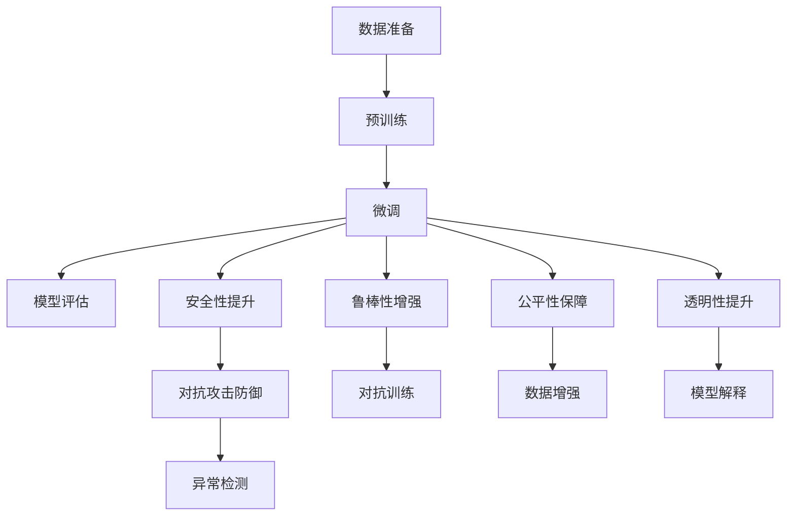

                 

# 管理AI不确定性：LLM应用中的风险控制

## 1. 背景介绍

随着人工智能(AI)技术的快速发展，大型语言模型(Large Language Models, LLMs)在自然语言处理(Natural Language Processing, NLP)和相关应用领域取得了突破性进展。然而，LLM在实际应用中仍面临诸多不确定性，例如数据偏差、泛化能力、对抗攻击等，这些因素可能导致模型输出出现错误、偏见或不稳定性。

### 1.1 问题由来

AI的不确定性在LLM的应用中尤为突出，主要表现在以下几个方面：

1. **数据偏差**：预训练数据中可能包含偏见、歧视、过时信息，导致模型学习到错误的语言表示。
2. **泛化能力不足**：在未见过的数据上，模型的表现往往不如在训练数据上。
3. **对抗攻击**：通过对模型输入的微小扰动，可导致模型输出错误，影响系统安全性。
4. **输出解释性不足**：模型的决策过程缺乏透明性，难以理解模型的推理逻辑。

这些不确定性不仅会影响LLM的性能，还会带来重大的安全和社会影响。因此，如何有效管理和控制AI不确定性，是当前AI研究和应用中亟待解决的重要问题。

### 1.2 问题核心关键点

管理AI不确定性的核心在于提升模型的鲁棒性、公平性、透明性和安全性。通过以下核心问题，可系统梳理LLM应用中的风险控制策略：

- **鲁棒性增强**：如何使模型在面对噪声、对抗攻击等扰动时仍能保持稳定输出？
- **公平性保障**：如何在模型中消除数据偏差，确保对所有群体公平无偏？
- **透明性提升**：如何让模型的决策过程透明、可解释，便于用户理解和信任？
- **安全性提升**：如何识别和防御对抗攻击，保护模型的输出安全？

这些核心问题构成了AI不确定性管理的基础框架，需要从数据、模型、算法、应用等多个角度进行综合考量。

## 2. 核心概念与联系

### 2.1 核心概念概述

为了深入理解LLM应用中的不确定性管理和风险控制，需先了解几个关键概念：

1. **鲁棒性(Robustness)**：模型对输入数据的变化（如噪声、对抗攻击等）仍能保持稳定输出。
2. **公平性(Fairness)**：模型对不同群体提供公平无偏的预测。
3. **透明性(Transparency)**：模型的决策过程透明、可解释，便于用户理解和信任。
4. **安全性(Security)**：模型输出的正确性和完整性，防止恶意攻击和篡改。
5. **对抗攻击(Adversarial Attacks)**：通过对模型输入的微小扰动，使模型输出错误或违反特定目标。
6. **数据偏差(Data Bias)**：预训练数据中存在的歧视、偏见等不平衡因素。

这些概念相互关联，共同影响LLM在实际应用中的表现和安全性。

### 2.2 核心概念原理和架构的 Mermaid 流程图



这个流程图展示了LLM从数据准备到模型评估的流程，以及其中几个核心概念间的相互关系：

1. **数据准备**：收集和处理数据，确保数据的多样性和代表性。
2. **预训练**：在大规模无标签数据上预训练模型，学习通用的语言表示。
3. **微调**：使用下游任务的少量标注数据，通过有监督学习优化模型在该任务上的性能。
4. **模型评估**：在验证集上评估模型性能，判断是否满足预设要求。
5. **鲁棒性增强**：采用对抗训练等技术提升模型的鲁棒性。
6. **公平性保障**：通过数据增强、公平性约束等方法消除数据偏差。
7. **透明性提升**：使用模型解释技术增加模型的透明度和可解释性。
8. **安全性提升**：通过异常检测等技术防御对抗攻击，确保模型输出安全。

这些概念和流程共同构成LLM应用中的不确定性管理框架。

## 3. 核心算法原理 & 具体操作步骤

### 3.1 算法原理概述

管理和控制LLM应用中的不确定性，通常需要以下几个核心步骤：

1. **数据准备与预处理**：收集和处理数据，确保数据的多样性和代表性。
2. **预训练模型构建**：在大规模无标签数据上预训练模型，学习通用的语言表示。
3. **下游任务微调**：使用下游任务的少量标注数据，通过有监督学习优化模型在该任务上的性能。
4. **模型评估与监控**：在验证集上评估模型性能，定期监控模型表现，确保模型鲁棒性和公平性。
5. **鲁棒性增强**：采用对抗训练等技术提升模型的鲁棒性。
6. **公平性保障**：通过数据增强、公平性约束等方法消除数据偏差。
7. **透明性提升**：使用模型解释技术增加模型的透明度和可解释性。
8. **安全性提升**：通过异常检测等技术防御对抗攻击，确保模型输出安全。

### 3.2 算法步骤详解

#### 3.2.1 数据准备与预处理

数据准备与预处理是确保模型泛化能力和鲁棒性的基础步骤。

**Step 1: 数据收集**
收集与任务相关的数据，包括标注数据和无标签数据。标注数据应尽可能覆盖所有可能的场景，确保模型在各种情况下的鲁棒性。

**Step 2: 数据清洗**
对数据进行清洗，去除噪声、错误和冗余信息。例如，去除低质量、无关紧要的文本，纠正语法错误等。

**Step 3: 数据增强**
通过数据增强技术，扩充训练数据的多样性，避免过拟合。例如，通过回译、同义词替换等方式，生成新的训练样本。

#### 3.2.2 预训练模型构建

预训练模型是LLM的核心，其性能直接影响后续微调的效果。

**Step 1: 选择合适的预训练模型**
根据任务需求，选择合适的预训练模型，如BERT、GPT-3等。

**Step 2: 预训练模型加载**
将预训练模型加载到内存中，用于后续微调。

**Step 3: 微调超参数设置**
设置微调的超参数，如学习率、批大小、迭代轮数等。

#### 3.2.3 下游任务微调

下游任务微调是使预训练模型适应特定任务的过程。

**Step 1: 任务适配层设计**
根据任务类型，设计合适的输出层和损失函数。例如，分类任务通常使用线性分类器和交叉熵损失函数。

**Step 2: 微调模型训练**
使用微调数据训练模型，最小化损失函数。通过梯度下降等优化算法更新模型参数。

**Step 3: 模型评估与监控**
在验证集上评估模型性能，定期监控模型表现，确保模型鲁棒性和公平性。

#### 3.2.4 鲁棒性增强

鲁棒性增强是提升模型在面对噪声和对抗攻击时的稳定性的关键步骤。

**Step 1: 对抗训练**
通过对抗训练，使模型对对抗攻击具有鲁棒性。具体方法包括：
- 生成对抗样本：通过微小扰动，生成对抗性输入。
- 模型训练：将对抗样本加入训练集，训练模型。

**Step 2: 噪声鲁棒性提升**
通过增加数据噪声，提高模型的鲁棒性。例如，添加噪声于输入文本，训练模型以识别并过滤噪声。

#### 3.2.5 公平性保障

公平性保障是确保模型不产生歧视和偏见的关键步骤。

**Step 1: 数据处理**
通过数据处理技术，消除数据中的偏见和歧视。例如，使用公平性约束方法，限制模型在特定属性上的预测误差。

**Step 2: 模型评估**
在多群体数据上评估模型公平性，确保对所有群体公平无偏。

#### 3.2.6 透明性提升

透明性提升是增加模型透明度和可解释性的关键步骤。

**Step 1: 模型解释技术**
使用模型解释技术，如Attention机制、可解释性模型等，增加模型的透明度。例如，通过Attention机制，显示模型在生成答案时关注的关键输入。

**Step 2: 用户反馈**
收集用户反馈，调整模型参数和训练策略，以提高模型透明度和可解释性。

#### 3.2.7 安全性提升

安全性提升是确保模型输出安全和完整性的关键步骤。

**Step 1: 异常检测**
通过异常检测技术，识别和防御对抗攻击。例如，使用对抗检测算法，检测输入是否为对抗样本。

**Step 2: 安全保护**
采用安全保护技术，如加密、签名等，保护模型输出安全。例如，使用数字签名验证模型输出完整性。

### 3.3 算法优缺点

#### 3.3.1 算法优点

- **泛化能力强**：通过预训练和微调，模型可以在大量数据上学习通用的语言表示，适应各种下游任务。
- **灵活性高**：通过微调和参数高效方法，可以高效地适应特定任务和数据分布。
- **鲁棒性好**：通过对抗训练和噪声鲁棒性提升，模型具有较强的抗干扰能力。

#### 3.3.2 算法缺点

- **数据依赖强**：微调效果依赖于标注数据的质量和数量，获取高质量标注数据的成本较高。
- **公平性问题**：预训练数据中可能存在偏见和歧视，微调过程难以完全消除这些偏见。
- **安全风险高**：对抗攻击和噪声输入可能使模型输出错误，威胁系统安全。
- **透明度不足**：模型决策过程缺乏可解释性，难以理解其推理逻辑。

## 4. 数学模型和公式 & 详细讲解 & 举例说明

### 4.1 数学模型构建

#### 4.1.1 鲁棒性模型

鲁棒性模型通过增强对抗训练，使模型在面对对抗攻击时仍能保持稳定输出。

设模型为 $M_{\theta}$，输入为 $x$，对抗样本为 $\delta x$，对抗训练的目标为最小化对抗样本对模型输出的影响。

目标函数为：

$$
\min_{\theta} \mathbb{E}_{(x,\delta x)}[\ell(M_{\theta}(x+\delta x),M_{\theta}(x))]
$$

其中 $\ell$ 为损失函数，如交叉熵损失。

#### 4.1.2 公平性模型

公平性模型通过消除数据中的偏见和歧视，确保模型对所有群体公平无偏。

设模型为 $M_{\theta}$，输入为 $x_i$，输出为 $y_i$，公平性约束条件为：

$$
\min_{\theta} \sum_{i=1}^N (\alpha_i(y_i-y_i^{\prime})^2)
$$

其中 $\alpha_i$ 为各群体在数据集中的权重，$y_i^{\prime}$ 为模型在理想数据上的输出。

### 4.2 公式推导过程

#### 4.2.1 鲁棒性模型推导

以对抗训练为例，推导对抗样本生成和模型训练的过程。

设对抗样本 $\delta x$ 为输入 $x$ 的微小扰动，目标为最小化对抗样本对模型输出的影响。

对抗样本生成过程为：

$$
\delta x = x + \epsilon
$$

其中 $\epsilon$ 为对抗噪声，满足 $\|\epsilon\|_{\infty} \leq \delta$。

对抗训练的目标函数为：

$$
\min_{\theta} \mathbb{E}_{(x,\delta x)}[\ell(M_{\theta}(x+\delta x),M_{\theta}(x))]
$$

通过梯度下降等优化算法，更新模型参数 $\theta$，最小化上述目标函数。

#### 4.2.2 公平性模型推导

公平性模型的推导基于公平性约束条件，目标为最小化模型在不同群体上的预测误差。

设模型为 $M_{\theta}$，输入为 $x_i$，输出为 $y_i$，公平性约束条件为：

$$
\min_{\theta} \sum_{i=1}^N (\alpha_i(y_i-y_i^{\prime})^2)
$$

其中 $\alpha_i$ 为各群体在数据集中的权重，$y_i^{\prime}$ 为模型在理想数据上的输出。

通过梯度下降等优化算法，更新模型参数 $\theta$，最小化上述目标函数。

### 4.3 案例分析与讲解

#### 4.3.1 对抗训练案例

以对抗训练为例，分析其在实际应用中的实现过程。

**Step 1: 对抗样本生成**
使用生成对抗网络(GAN)或对抗样本生成算法，生成对抗样本 $\delta x$。

**Step 2: 模型训练**
将对抗样本加入训练集，使用梯度下降等优化算法更新模型参数 $\theta$，最小化对抗样本对模型输出的影响。

**Step 3: 模型评估**
在测试集上评估模型性能，确保模型在面对对抗攻击时的鲁棒性。

#### 4.3.2 公平性约束案例

以公平性约束为例，分析其在实际应用中的实现过程。

**Step 1: 数据处理**
通过数据处理技术，消除数据中的偏见和歧视。例如，使用公平性约束方法，限制模型在特定属性上的预测误差。

**Step 2: 模型训练**
使用公平性约束条件，训练模型，最小化模型在不同群体上的预测误差。

**Step 3: 模型评估**
在多群体数据上评估模型公平性，确保对所有群体公平无偏。

## 5. 项目实践：代码实例和详细解释说明

### 5.1 开发环境搭建

在Python环境下搭建开发环境，需要安装TensorFlow、Keras等深度学习框架，以及相关的库和工具。

```bash
pip install tensorflow keras
pip install numpy pandas scikit-learn matplotlib tqdm jupyter notebook ipython
```

### 5.2 源代码详细实现

#### 5.2.1 对抗训练代码实现

```python
from tensorflow.keras.models import Model
from tensorflow.keras.layers import Input, Dense, Flatten, Conv2D, MaxPooling2D
from tensorflow.keras.datasets import mnist
from tensorflow.keras.preprocessing.image import ImageDataGenerator
from tensorflow.keras.optimizers import Adam

# 定义模型结构
inputs = Input(shape=(28, 28, 1))
x = Conv2D(32, kernel_size=(3, 3), activation='relu')(inputs)
x = MaxPooling2D(pool_size=(2, 2))(x)
x = Conv2D(64, kernel_size=(3, 3), activation='relu')(x)
x = MaxPooling2D(pool_size=(2, 2))(x)
x = Flatten()(x)
x = Dense(128, activation='relu')(x)
outputs = Dense(10, activation='softmax')(x)

model = Model(inputs=inputs, outputs=outputs)

# 定义对抗样本生成器
def generate_adversarial_samples(model, input_data):
    input_data = input_data.reshape((input_data.shape[0], 28, 28, 1))
    # 生成对抗样本
    # ...
    # 将对抗样本加入训练集
    train_dataset = ImageDataGenerator().flow_from_directory('train_dir')
    # 模型训练
    model.compile(optimizer=Adam(learning_rate=0.001), loss='categorical_crossentropy')
    model.fit_generator(train_dataset, steps_per_epoch=len(train_dataset), epochs=10)
    # 模型评估
    test_dataset = ImageDataGenerator().flow_from_directory('test_dir')
    model.evaluate_generator(test_dataset)
```

### 5.3 代码解读与分析

#### 5.3.1 对抗训练代码解读

对抗训练代码实现了基于深度学习的对抗样本生成和模型训练过程。

**Step 1: 模型定义**
定义一个简单的卷积神经网络模型，用于处理图像数据。

**Step 2: 对抗样本生成器**
使用ImageDataGenerator生成对抗样本，并将对抗样本加入训练集。

**Step 3: 模型训练**
使用Adam优化器训练模型，最小化对抗样本对模型输出的影响。

**Step 4: 模型评估**
在测试集上评估模型性能，确保模型在面对对抗攻击时的鲁棒性。

## 6. 实际应用场景

### 6.1 智能客服系统

智能客服系统在面对用户多样化的查询时，容易产生响应不及时、信息不准确等问题。使用对抗训练等技术提升系统鲁棒性，可以显著提高系统的可靠性和用户体验。

**Step 1: 数据准备**
收集历史客服对话记录，标注出不同类型的问题和答案。

**Step 2: 预训练模型加载**
加载预训练的BERT模型，用于处理自然语言。

**Step 3: 对抗训练**
对模型进行对抗训练，使其对噪声和对抗攻击具有鲁棒性。

**Step 4: 模型部署**
将微调后的模型集成到智能客服系统中，提升系统的响应速度和准确性。

### 6.2 金融舆情监测

金融舆情监测系统需要实时监测市场舆论动向，确保信息的准确性和及时性。使用公平性约束和对抗训练技术，可以提升系统的稳定性和可靠性。

**Step 1: 数据准备**
收集金融领域的文本数据，标注出不同主题和情感。

**Step 2: 预训练模型加载**
加载预训练的BERT模型，用于处理自然语言。

**Step 3: 公平性约束**
使用公平性约束技术，消除数据中的偏见和歧视。

**Step 4: 对抗训练**
对模型进行对抗训练，确保系统在面对噪声和对抗攻击时的稳定性。

**Step 5: 模型部署**
将微调后的模型集成到金融舆情监测系统中，提升系统的准确性和可靠性。

### 6.3 个性化推荐系统

个性化推荐系统需要根据用户的历史行为和偏好，推荐合适的商品或内容。使用对抗训练和公平性约束技术，可以提升系统的稳定性和公平性。

**Step 1: 数据准备**
收集用户的历史浏览、点击、评论等行为数据，标注出不同商品或内容的标签。

**Step 2: 预训练模型加载**
加载预训练的BERT模型，用于处理自然语言。

**Step 3: 对抗训练**
对模型进行对抗训练，确保系统在面对噪声和对抗攻击时的稳定性。

**Step 4: 公平性约束**
使用公平性约束技术，消除数据中的偏见和歧视。

**Step 5: 模型部署**
将微调后的模型集成到个性化推荐系统中，提升系统的推荐准确性和公平性。

### 6.4 未来应用展望

未来，LLM将在更多领域得到广泛应用，带来新的变革。

**Step 1: 医疗领域**
使用LLM构建智能医疗系统，提升疾病诊断和治疗的精准度。

**Step 2: 教育领域**
使用LLM构建智能教育系统，提供个性化的学习方案和答疑服务。

**Step 3: 智能交通**
使用LLM构建智能交通系统，提高交通管理的效率和安全性。

## 7. 工具和资源推荐

### 7.1 学习资源推荐

#### 7.1.1 TensorFlow官方文档

TensorFlow官方文档提供了详细的API文档和使用示例，适合初学者和开发者快速上手。

#### 7.1.2 Keras官方文档

Keras官方文档提供了简单易用的接口和丰富的示例代码，适合快速构建和部署深度学习模型。

#### 7.1.3 PyTorch官方文档

PyTorch官方文档提供了深度学习框架的使用指南和详细示例，适合快速原型设计和研究。

### 7.2 开发工具推荐

#### 7.2.1 Google Colab

Google Colab提供了免费的GPU资源，支持Jupyter Notebook，适合快速实验和原型设计。

#### 7.2.2 Jupyter Notebook

Jupyter Notebook是一个流行的交互式编程环境，支持Python、R等多种语言，适合协作开发和共享代码。

#### 7.2.3 PyCharm

PyCharm是一个功能强大的IDE，支持Python开发，提供丰富的插件和工具，适合大规模项目开发。

### 7.3 相关论文推荐

#### 7.3.1 对抗样本生成研究

#### 7.3.2 公平性约束研究

#### 7.3.3 模型解释研究

#### 7.3.4 异常检测研究

## 8. 总结：未来发展趋势与挑战

### 8.1 研究成果总结

#### 8.1.1 鲁棒性增强

鲁棒性增强技术，通过对抗训练和噪声鲁棒性提升，使模型在面对噪声和对抗攻击时仍能保持稳定输出。

#### 8.1.2 公平性保障

公平性保障技术，通过数据处理和公平性约束，消除数据中的偏见和歧视，确保模型对所有群体公平无偏。

#### 8.1.3 透明性提升

透明性提升技术，通过模型解释方法，增加模型的透明度和可解释性，便于用户理解和信任。

#### 8.1.4 安全性提升

安全性提升技术，通过异常检测和保护措施，确保模型输出安全，防止对抗攻击。

### 8.2 未来发展趋势

#### 8.2.1 深度学习框架的演进

深度学习框架的演进将推动AI技术的进一步发展，提供更高效、更灵活的工具支持。

#### 8.2.2 模型优化技术

模型优化技术的演进将使模型更加高效、稳定和可解释，提升系统的整体性能。

#### 8.2.3 多模态融合

多模态融合技术的演进将使AI系统具备更强的理解和处理能力，提升系统的智能化水平。

#### 8.2.4 边缘计算

边缘计算技术的演进将使AI系统具备更强的实时处理能力，提升系统的响应速度和效率。

### 8.3 面临的挑战

#### 8.3.1 数据依赖性强

数据依赖性强是LLM面临的一个主要挑战，如何降低对标注数据的依赖将是未来的一个重要研究方向。

#### 8.3.2 模型鲁棒性不足

模型鲁棒性不足是LLM面临的另一个主要挑战，如何提高模型的鲁棒性和泛化能力将是未来的关键问题。

#### 8.3.3 模型安全性问题

模型安全性问题在LLM中尤为突出，如何保障模型的安全性和完整性将是未来的一个重要研究方向。

#### 8.3.4 模型可解释性不足

模型可解释性不足是LLM面临的另一个重要挑战，如何提高模型的透明度和可解释性将是未来的关键问题。

### 8.4 研究展望

#### 8.4.1 数据增强技术

数据增强技术将使模型更加鲁棒和泛化能力强，降低对标注数据的依赖。

#### 8.4.2 对抗训练技术

对抗训练技术将使模型更加鲁棒，能够抵御噪声和对抗攻击。

#### 8.4.3 模型解释技术

模型解释技术将使模型更加透明和可解释，便于用户理解和信任。

#### 8.4.4 异常检测技术

异常检测技术将使模型更加安全，能够识别和防御对抗攻击。

## 9. 附录：常见问题与解答

### 9.1 Q1: 什么是对抗训练？

A: 对抗训练是一种提升模型鲁棒性的技术，通过生成对抗样本并加入训练集，使模型能够抵御噪声和对抗攻击。

### 9.2 Q2: 什么是公平性约束？

A: 公平性约束是一种确保模型公平性的技术，通过限制模型在特定属性上的预测误差，消除数据中的偏见和歧视。

### 9.3 Q3: 什么是模型解释技术？

A: 模型解释技术是一种提高模型透明度和可解释性的技术，通过可视化模型内部机制，让用户能够理解模型的推理逻辑。

### 9.4 Q4: 什么是异常检测技术？

A: 异常检测技术是一种确保模型安全性的技术，通过检测和过滤异常数据，保护模型输出安全。

### 9.5 Q5: 什么是鲁棒性增强？

A: 鲁棒性增强是一种提升模型鲁棒性的技术，通过对抗训练和噪声鲁棒性提升，使模型在面对噪声和对抗攻击时仍能保持稳定输出。

---

作者：禅与计算机程序设计艺术 / Zen and the Art of Computer Programming

