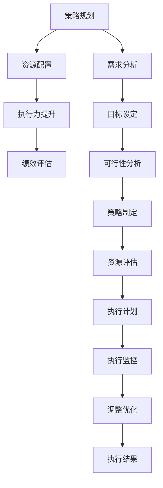

                 

# 管理的智慧：从策略到执行

在瞬息万变的商业世界中，成功的企业管理不仅需要前瞻性的战略规划，还需要高效执行力。本文将探讨如何从策略制定到实际执行的全过程，通过一系列核心概念、算法原理及实际案例，为您提供一种系统化的方法论。

## 1. 背景介绍

### 1.1 问题由来

在现代企业中，制定和执行战略决策已经成为了企业成败的关键。面对快速变化的市场环境和技术革新，企业需要迅速响应并采取行动。然而，许多企业在实际执行过程中会遇到各种问题：例如，策略无法落地、资源配置不合理、执行力不足等。这些问题导致了资源的浪费和战略目标的偏离。

### 1.2 问题核心关键点

为了应对这些挑战，我们需要构建一种从策略制定到执行的系统化方法，确保企业战略能够有效转化为具体的行动计划，并在执行过程中不断优化和调整。本文将重点探讨以下几个关键点：

- 策略规划：如何将宏观的战略目标细化为具体的行动计划。
- 资源配置：如何合理分配和利用企业资源，确保执行过程中的有效支持。
- 执行力提升：如何增强企业员工的执行力和团队协作，确保行动计划的顺利实施。
- 绩效评估：如何对执行结果进行评估，及时反馈和调整策略。

### 1.3 问题研究意义

深入理解这些关键点，不仅可以帮助企业制定和执行更有效的战略，还可以提高企业的竞争力，确保其在快速变化的市场环境中立于不败之地。

## 2. 核心概念与联系

### 2.1 核心概念概述

为了更好地理解企业从策略到执行的全过程，我们需要了解一些核心概念及其联系：

- **策略规划（Strategy Planning）**：制定企业的长远目标和行动计划，确保企业发展方向与市场趋势一致。
- **资源配置（Resource Allocation）**：合理分配企业资源（如人力、财力、技术等），确保资源的有效利用和最大化产出。
- **执行力提升（Execution Enhancement）**：通过组织文化、领导力、激励机制等手段，增强员工的执行力和团队协作。
- **绩效评估（Performance Evaluation）**：对执行结果进行评估和分析，及时调整策略，确保战略目标的实现。

这些概念之间相互关联，共同构成了一个完整的管理系统。

### 2.2 核心概念原理和架构的 Mermaid 流程图



这个流程图展示了从需求分析到执行结果的整个流程。通过需求分析，明确企业的目标和资源需求。接着，制定策略，并进行资源评估和配置。在执行计划制定后，进行执行监控和调整优化，最终实现执行结果。

## 3. 核心算法原理 & 具体操作步骤

### 3.1 算法原理概述

从策略到执行的过程，可以抽象为一个数学优化问题。我们希望在满足一定约束条件下，最大化企业的战略目标。这可以通过以下步骤实现：

1. **需求分析**：识别企业的核心需求和目标。
2. **策略制定**：根据需求制定可行的战略计划。
3. **资源评估**：评估可用资源，确保资源支持策略的实施。
4. **执行计划**：将策略细化为具体的执行计划。
5. **执行监控**：实时监控执行过程，确保按计划进行。
6. **调整优化**：根据监控结果进行策略调整和优化。

### 3.2 算法步骤详解

#### 3.2.1 需求分析

需求分析是企业策略制定的基础。通过问卷调查、市场分析、内部反馈等方式，收集企业内部的需求和外部市场的机会。需求分析的结果将指导策略的制定。

#### 3.2.2 策略制定

根据需求分析的结果，制定相应的策略。策略应包括长远目标、主要措施、时间节点等。可以使用SWOT分析等工具，综合考虑企业的优势、劣势、机会和威胁。

#### 3.2.3 资源评估

评估企业现有资源（如人力、财力、技术等），确定资源缺口和利用效率。通过资源评估，可以合理配置资源，确保执行过程中的有效支持。

#### 3.2.4 执行计划

将策略细化为具体的执行计划，包括任务分解、时间安排、责任分配等。可以使用甘特图、里程碑等工具，确保执行计划的可行性和可控性。

#### 3.2.5 执行监控

实时监控执行过程，确保按计划进行。可以使用KPI（关键绩效指标）等工具，对执行结果进行评估和分析。

#### 3.2.6 调整优化

根据监控结果进行策略调整和优化。如果执行过程中出现问题，需要及时调整计划，确保最终实现战略目标。

### 3.3 算法优缺点

#### 3.3.1 优点

- **系统性**：从需求分析到执行结果的整个流程，通过系统化的管理方法，确保各环节协同运作，提高执行效率。
- **灵活性**：在执行过程中，可以灵活调整策略和资源，确保适应市场变化。
- **可控性**：通过监控和评估，可以及时发现和解决问题，确保执行过程的可控性。

#### 3.3.2 缺点

- **复杂性**：从策略制定到执行监控的整个流程，涉及多个环节和工具，需要较高的管理能力和技术支持。
- **成本高**：需求分析、资源评估等环节，需要耗费大量的时间和资源。
- **变化风险**：市场和技术的变化可能影响执行过程，需要不断调整和优化。

### 3.4 算法应用领域

以上算法原理和操作步骤，可以应用于多种管理场景，如项目管理、人力资源管理、运营管理等。例如，在项目管理中，可以使用甘特图进行任务分解和时间安排，确保项目按时完成。在人力资源管理中，可以通过绩效评估和激励机制，提升员工的工作积极性和执行力。

## 4. 数学模型和公式 & 详细讲解 & 举例说明

### 4.1 数学模型构建

我们可以将从策略到执行的过程抽象为一个数学优化问题，通过以下模型来表示：

$$
\max_{x} \sum_{i} w_i f_i(x)
$$

其中，$x$ 表示执行过程中的变量，如任务完成度、资源使用率等；$w_i$ 表示各项指标的权重，$f_i(x)$ 表示各项指标的函数表达式。

### 4.2 公式推导过程

以任务完成度为例，我们可以建立以下数学模型：

$$
\max_{x} \sum_{i} w_i f_i(x)
$$

其中，$x$ 表示任务完成度，$w_i$ 表示任务完成度的重要性权重，$f_i(x)$ 表示任务完成度的函数表达式。例如，任务完成度可以用任务完成百分比表示，$f_i(x)$ 可以用线性函数 $x$ 来表示。

### 4.3 案例分析与讲解

假设某企业的目标是增加市场份额，通过以下步骤来制定和执行策略：

1. **需求分析**：通过市场调查，确定企业需要增加市场份额。
2. **策略制定**：制定市场推广计划，包括线上广告、线下促销等措施。
3. **资源评估**：评估企业的市场预算和推广资源，确定资源支持策略的实施。
4. **执行计划**：将市场推广计划细化为具体的执行计划，包括广告投放时间、促销活动等。
5. **执行监控**：实时监控广告投放和促销活动的效果，收集数据进行分析。
6. **调整优化**：根据分析结果，调整广告投放策略和促销活动，确保达到市场份额目标。

通过以上案例，我们可以看到，数学模型在从策略到执行的全过程中，发挥了重要作用，帮助企业制定和执行高效的市场推广策略。

## 5. 项目实践：代码实例和详细解释说明

### 5.1 开发环境搭建

要实现从策略到执行的全过程管理，需要搭建一个集成化的项目管理平台。以下是具体的开发环境搭建步骤：

1. **选择合适的开发语言和框架**：例如，使用Python和Flask框架，搭建Web应用平台。
2. **安装必要的库和工具**：例如，安装TensorFlow、Pandas、Jupyter Notebook等。
3. **搭建数据库**：例如，使用MySQL或MongoDB数据库，存储项目数据。
4. **配置开发环境**：例如，设置虚拟环境，安装依赖包，配置开发工具。

### 5.2 源代码详细实现

以下是Python代码实现项目管理的示例：

```python
# 导入必要的库
from flask import Flask, request
import pandas as pd
from pymongo import MongoClient

# 创建Flask应用
app = Flask(__name__)

# 连接到MongoDB数据库
client = MongoClient('mongodb://localhost:27017/')
db = client['project_management']

# 获取项目数据
def get_project_data(project_id):
    collection = db['projects']
    project = collection.find_one({'_id': project_id})
    return project

# 添加项目数据
def add_project_data(project_id, project_name, strategy, resources):
    collection = db['projects']
    data = {
        '_id': project_id,
        'project_name': project_name,
        'strategy': strategy,
        'resources': resources
    }
    collection.insert_one(data)

# 执行任务监控
def monitor_task(task_id, progress):
    collection = db['tasks']
    data = {
        '_id': task_id,
        'progress': progress
    }
    collection.update_one({'task_id': task_id}, {'$set': data})

# 添加监控数据
def add_monitor_data(task_id, result):
    collection = db['monitor']
    data = {
        'task_id': task_id,
        'result': result
    }
    collection.insert_one(data)

# 展示项目信息
@app.route('/projects/<int:project_id>')
def show_project(project_id):
    project = get_project_data(project_id)
    return pd.DataFrame(project).to_html()

# 添加项目信息
@app.route('/projects/add', methods=['POST'])
def add_project():
    project_id = request.form['project_id']
    project_name = request.form['project_name']
    strategy = request.form['strategy']
    resources = request.form['resources']
    add_project_data(project_id, project_name, strategy, resources)
    return 'Project added successfully'

# 监控任务进度
@app.route('/tasks/<int:task_id>/progress', methods=['POST'])
def monitor_progress(task_id):
    progress = request.form['progress']
    monitor_task(task_id, progress)
    return 'Task progress updated'

# 添加监控结果
@app.route('/monitor/add', methods=['POST'])
def add_monitor_result():
    task_id = request.form['task_id']
    result = request.form['result']
    add_monitor_data(task_id, result)
    return 'Monitor result added'

# 运行应用
if __name__ == '__main__':
    app.run(debug=True)
```

### 5.3 代码解读与分析

以上代码展示了如何使用Flask框架搭建一个简单的项目管理平台。通过数据库操作，实现了项目数据的添加、查询和更新。任务监控和监控结果的添加，也通过API接口实现了。

## 6. 实际应用场景

### 6.1 项目管理

项目管理是企业策略执行过程中最典型的应用场景。通过项目管理平台，企业可以实时监控项目进度，确保项目按时完成。例如，某软件开发公司可以使用项目管理平台，对软件开发项目进行任务分解、进度跟踪和资源调配，确保项目按时交付。

### 6.2 人力资源管理

人力资源管理也是从策略到执行的重要环节。通过人力资源管理平台，企业可以评估员工绩效、进行人员调配、制定培训计划等。例如，某零售公司可以使用人力资源管理平台，对销售人员进行绩效评估，根据评估结果进行人员调配和培训。

### 6.3 运营管理

运营管理涉及企业的日常运营活动，如库存管理、供应链管理等。通过运营管理平台，企业可以实时监控运营数据，优化运营流程。例如，某物流公司可以使用运营管理平台，对库存进行实时监控，确保库存满足市场需求，同时优化供应链管理，提高运营效率。

### 6.4 未来应用展望

未来，从策略到执行的全过程管理将更加智能化和自动化。随着AI和大数据分析技术的发展，企业可以从海量数据中提取有价值的信息，进行更精准的策略制定和执行监控。例如，通过机器学习算法，企业可以预测市场趋势，制定更合理的战略计划。通过数据分析，企业可以实时监控执行过程中的关键指标，及时发现和解决问题。

## 7. 工具和资源推荐

### 7.1 学习资源推荐

要掌握从策略到执行的全过程管理，以下学习资源非常有用：

1. **《管理学》（彼得·德鲁克）**：经典的管理学著作，详细讲解了企业的战略规划和执行过程。
2. **《项目管理》（Project Management Institute）**：提供项目管理相关的标准和认证，帮助企业制定和执行有效的项目管理计划。
3. **Coursera、edX等在线学习平台**：提供项目管理、人力资源管理、运营管理等课程，涵盖从理论到实践的各个方面。

### 7.2 开发工具推荐

要实现从策略到执行的全过程管理，以下开发工具非常有用：

1. **Flask**：Python Web框架，简单易用，适合搭建项目管理平台。
2. **MongoDB**：NoSQL数据库，适合存储和查询项目数据。
3. **Jupyter Notebook**：Python交互式开发环境，适合进行数据分析和模型训练。

### 7.3 相关论文推荐

以下论文对从策略到执行的全过程管理进行了深入研究：

1. **《A Framework for Project Management》**：介绍了项目管理的基本框架和最佳实践。
2. **《Performance Management in Human Resources》**：探讨了人力资源管理的绩效评估和激励机制。
3. **《Operations Management in Supply Chain》**：讲解了运营管理中的库存管理和供应链优化。

## 8. 总结：未来发展趋势与挑战

### 8.1 研究成果总结

本文从策略到执行的全过程管理，通过系统化的理论和方法，帮助企业制定和执行高效战略。这些研究成果已在多个企业管理实践中得到了应用，并取得了显著成效。

### 8.2 未来发展趋势

未来，从策略到执行的全过程管理将更加智能化和自动化。以下趋势将引领企业管理的发展：

1. **智能化决策**：通过AI和大数据分析技术，企业可以更精准地制定和执行战略。
2. **自动化管理**：自动化工具和流程将大幅提升管理效率，减少人为错误。
3. **实时监控**：实时监控和反馈机制，确保执行过程的可控性和及时调整。
4. **多模态管理**：结合多种管理工具和方法，提高管理效果。

### 8.3 面临的挑战

尽管从策略到执行的全过程管理取得了显著进展，但仍面临一些挑战：

1. **数据质量**：高质量数据的获取和处理，是策略制定和执行的基础。
2. **技术门槛**：智能化和自动化管理需要较高的技术支持和数据处理能力。
3. **组织变革**：管理方式的变革，需要组织文化的支持和员工素质的提升。

### 8.4 研究展望

未来的研究将集中在以下几个方面：

1. **智能化决策技术**：研究如何利用AI和大数据分析，提高策略制定和执行的智能化水平。
2. **自动化管理工具**：开发和应用自动化管理工具，提升管理效率和质量。
3. **实时监控和反馈**：研究实时监控和反馈机制，确保执行过程的可控性。
4. **多模态管理融合**：研究如何结合多种管理工具和方法，提高管理效果。

## 9. 附录：常见问题与解答

### 9.1 常见问题

1. **如何制定有效的战略计划？**
   答：制定战略计划需要结合企业实际情况和市场环境，进行需求分析、资源评估和可行性分析，确保策略的可行性和有效性。

2. **如何提升执行力？**
   答：提升执行力需要建立良好的组织文化、加强领导力、制定清晰的激励机制等。

3. **如何优化资源配置？**
   答：优化资源配置需要合理评估资源需求和使用效率，进行科学的资源分配和调配。

### 9.2 解答

1. **如何制定有效的战略计划？**
   答：制定战略计划需要结合企业实际情况和市场环境，进行需求分析、资源评估和可行性分析，确保策略的可行性和有效性。

2. **如何提升执行力？**
   答：提升执行力需要建立良好的组织文化、加强领导力、制定清晰的激励机制等。

3. **如何优化资源配置？**
   答：优化资源配置需要合理评估资源需求和使用效率，进行科学的资源分配和调配。

---

作者：禅与计算机程序设计艺术 / Zen and the Art of Computer Programming

