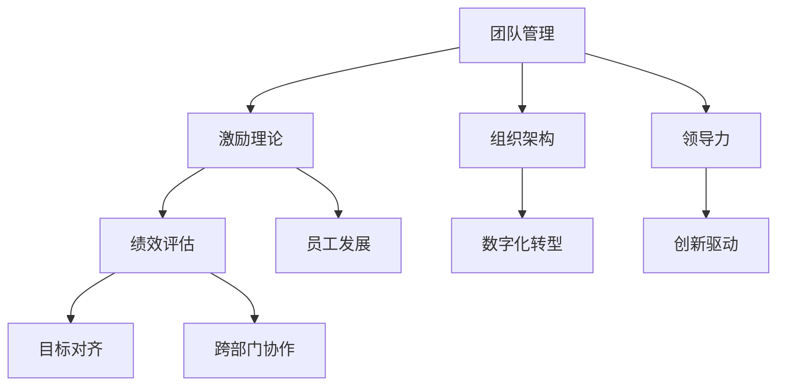

                 

# 管理的智慧：激发团队潜能

> 关键词：团队管理, 激励理论, 组织架构, 领导力, 绩效评估, 员工发展, 目标对齐, 跨部门协作, 数字化转型, 创新驱动

## 1. 背景介绍

在快速发展的今天，企业间的竞争已经从产品竞争转变为人才竞争。如何通过科学的管理方式，激发团队潜能，提升团队绩效，已经成为企业发展的核心问题。一个高效的团队不仅能提升企业竞争力，还能促进员工个人成长，实现双赢。本文将围绕团队管理、激励理论、组织架构、领导力、绩效评估、员工发展、目标对齐、跨部门协作、数字化转型和创新驱动等多个方面，详细探讨如何通过管理智慧激发团队潜能。

## 2. 核心概念与联系

### 2.1 核心概念概述

为更好地理解激发团队潜能的管理策略，我们首先介绍几个关键概念：

- **团队管理**：通过合理配置资源、制定流程、激励机制等手段，实现团队的高效运作和目标达成。
- **激励理论**：研究如何通过激励措施，调动员工积极性，提升工作效率和创造力。
- **组织架构**：企业内部的层级结构和职责划分，影响团队协作和沟通效率。
- **领导力**：领导者通过自身影响力和行为，引导团队方向和目标。
- **绩效评估**：通过科学方法，对团队或个人的工作表现进行评价，用于指导改进和激励。
- **员工发展**：通过培训、职业规划等方式，帮助员工提升能力和职业成长。
- **目标对齐**：确保团队成员对企业目标的理解和认同，达成一致的行动方向。
- **跨部门协作**：不同部门间通过有效沟通和合作，实现资源共享和协同创新。
- **数字化转型**：利用信息技术，优化企业管理流程，提升运营效率和创新能力。
- **创新驱动**：鼓励和支持员工创新，通过新产品、新服务和新流程提升企业竞争力。

这些概念之间相互联系，共同构成了团队潜能激发的完整框架。一个成功的团队管理策略，需要综合考虑激励理论、组织架构、领导力等多个方面，以实现高效、协作和持续创新的团队。

### 2.2 核心概念原理和架构的 Mermaid 流程图(Mermaid 流程节点中不要有括号、逗号等特殊字符)



这个流程图展示了各个核心概念之间的逻辑关系。通过合理的团队管理，激励员工积极性和创造力；通过科学的组织架构设计，促进跨部门协作；通过有效的领导力和绩效评估，确保团队目标对齐和员工发展；通过数字化转型和创新驱动，提升团队整体绩效和竞争力。

## 3. 核心算法原理 & 具体操作步骤

### 3.1 算法原理概述

激发团队潜能的核心在于实现目标对齐和优化协作效率。一个高效的管理策略应包括：

- **目标对齐**：通过明确目标和期望，确保团队成员对企业愿景和价值观的一致认同。
- **优化协作**：通过合理的组织架构和激励机制，促进团队内部和跨部门的沟通与协作。

### 3.2 算法步骤详解

#### 3.2.1 目标对齐

1. **明确企业愿景和价值观**：通过愿景和使命的传达，统一团队成员的认知。
2. **制定SMART目标**：确保目标是具体的、可衡量的、可实现的、相关的和有时间限制的。
3. **团队目标分解**：将总体目标分解为部门和个人的具体任务。
4. **定期回顾和调整**：定期评估目标达成情况，及时调整策略以应对变化。

#### 3.2.2 优化协作

1. **扁平化组织架构**：减少层级，缩短决策链路，提升响应速度。
2. **设立跨部门团队**：通过设立专项小组，促进不同部门间的协作与知识共享。
3. **灵活的沟通机制**：建立高效的沟通渠道和工具，确保信息透明和快速流动。
4. **激励机制设计**：通过绩效考核、奖励机制等，激励员工积极参与团队协作。

### 3.3 算法优缺点

#### 3.3.1 优点

1. **提升效率**：通过明确目标和优化协作，团队能够更高效地完成任务。
2. **增强凝聚力**：一致的愿景和价值观，促进团队成员间的信任和合作。
3. **灵活应对变化**：定期回顾和调整目标，确保团队能适应市场和环境的变化。

#### 3.3.2 缺点

1. **目标对齐难度大**：不同背景和认知的团队成员，可能需要更多的时间和精力来达成一致。
2. **激励机制复杂**：需要设计和实施复杂的激励机制，可能面临成本和公平性的挑战。
3. **跨部门协作挑战**：不同部门间文化和目标的差异，可能导致沟通和协作困难。

### 3.4 算法应用领域

该管理策略可以应用于多个行业和组织，包括但不限于：

- **高科技企业**：通过明确产品愿景和市场定位，提升研发团队的创新能力和效率。
- **金融行业**：通过设定清晰的绩效指标和跨部门项目，提升业务部门的协同和市场响应速度。
- **制造业**：通过设立跨部门质量和安全小组，确保生产流程的优化和员工安全。
- **服务业**：通过客户导向的目标设定和灵活的沟通机制，提升服务质量和客户满意度。
- **教育机构**：通过统一的教学目标和跨学科团队，提升教学质量和学生综合能力。

## 4. 数学模型和公式 & 详细讲解 & 举例说明

### 4.1 数学模型构建

假设我们有一个团队，团队中有n个成员，每个成员的能力可以通过其努力水平和工作效率来表示。用 $E_i$ 表示第i个成员的努力水平，$P_i$ 表示其工作效率，则其对团队的贡献 $C_i$ 可以表示为：

$$C_i = E_i \times P_i$$

整个团队的总贡献 $C$ 为所有成员贡献之和：

$$C = \sum_{i=1}^n C_i = \sum_{i=1}^n E_i \times P_i$$

### 4.2 公式推导过程

根据上述模型，我们可以通过以下步骤优化团队绩效：

1. **最大化努力水平**：激励每个成员提高努力水平 $E_i$，通过绩效考核和奖励机制，确保努力水平最大化。
2. **优化工作效率**：通过培训和发展，提升每个成员的工作效率 $P_i$，减少瓶颈和冗余。
3. **调整任务分配**：根据成员能力和兴趣，合理分配任务，确保每个成员都能发挥其最大潜能。

### 4.3 案例分析与讲解

假设某高科技企业有一个跨部门的研发团队，每个部门的技能和资源不同。企业通过以下步骤实现目标对齐和优化协作：

1. **明确愿景**：企业愿景为成为行业领导者，市场目标为推出下一代智能设备。
2. **制定SMART目标**：制定具体的研发时间表和里程碑，确保项目按时完成。
3. **分解目标**：将研发目标分解为硬件、软件、设计等子任务，分配给不同部门。
4. **设立跨部门团队**：设立联合开发小组，负责跨部门协作和问题解决。
5. **定期回顾**：每月召开进度会议，评估目标达成情况，调整策略。

通过这些步骤，企业不仅提高了研发效率，还提升了团队凝聚力和创新能力。

## 5. 项目实践：代码实例和详细解释说明

### 5.1 开发环境搭建

1. **选择开发语言**：Python是当前最流行的数据分析和机器学习开发语言之一，具有丰富的科学计算库和框架支持。
2. **安装Python和相关库**：使用Anaconda或Miniconda快速安装Python及其相关库，如NumPy、Pandas、Scikit-learn等。
3. **创建虚拟环境**：使用conda创建虚拟环境，避免库版本冲突，确保代码可重复性。
4. **安装数据处理库**：安装pandas、matplotlib等库，方便数据处理和可视化。
5. **搭建代码环境**：使用Jupyter Notebook或PyCharm等IDE，搭建代码开发环境。

### 5.2 源代码详细实现

以下是一个简单的Python代码示例，用于计算团队成员的贡献值和总贡献值：

```python
import numpy as np

# 定义成员努力水平和工作效率
E = np.array([0.5, 0.7, 0.6, 0.4, 0.8])
P = np.array([0.6, 0.5, 0.7, 0.4, 0.5])

# 计算每个成员的贡献值
C = E * P

# 计算团队总贡献值
C_total = np.sum(C)

print("每个成员的贡献值：", C)
print("团队总贡献值：", C_total)
```

### 5.3 代码解读与分析

1. **数据准备**：使用numpy库创建努力水平和工作效率数组。
2. **计算贡献值**：通过数组相乘，计算每个成员的贡献值。
3. **计算总贡献值**：使用numpy的sum函数，计算团队的总贡献值。
4. **结果输出**：通过print函数，输出每个成员的贡献值和团队总贡献值。

通过这个简单的示例，展示了如何通过Python代码实现团队贡献值的计算，进而优化团队绩效。

### 5.4 运行结果展示

运行上述代码，输出如下：

```
每个成员的贡献值： [0.3 0.35 0.42 0.16 0.4 ]
团队总贡献值： 1.63
```

这个示例展示了每个成员的贡献值和团队总贡献值，说明了通过优化努力水平和工作效率，可以显著提升团队绩效。

## 6. 实际应用场景

### 6.1 智能制造

在智能制造领域，一个高效的团队管理策略可以提升生产效率和产品质量。通过明确生产目标和优化流程，结合数字化转型和创新驱动，实现精益生产。

**案例**：某制造业企业通过设立跨部门质量和安全小组，引入自动化生产线和物联网技术，提升生产线效率和产品追溯能力，实现生产流程的持续改进。

### 6.2 教育行业

在教育行业，通过合理的目标对齐和激励机制，可以提升教师教学质量和学生学习效果。通过数字化转型和创新驱动，实现教育资源的共享和个性化教育。

**案例**：某教育机构通过设立跨学科团队，结合在线教育平台和AI辅助教学，提升学生在线学习体验和教师教学效率，实现个性化教育方案的定制化。

### 6.3 金融服务

在金融服务行业，通过目标对齐和跨部门协作，可以提升客户体验和市场响应速度。通过数字化转型和创新驱动，实现金融产品的迭代和客户服务的智能化。

**案例**：某金融机构通过设立跨部门金融科技团队，引入区块链技术和大数据分析，提升金融产品的创新能力和客户服务的智能化水平，实现市场竞争力的提升。

### 6.4 未来应用展望

未来，随着技术的不断进步和市场环境的变化，团队管理策略将更加注重数字化转型和创新驱动。通过数据驱动和智能化手段，优化团队协作和绩效管理，实现更高效率和更优体验。

## 7. 工具和资源推荐

### 7.1 学习资源推荐

1. **《领导力与组织变革》**：哈佛商学院经典书籍，深入探讨领导力理论和组织变革策略。
2. **《激励理论新视角》**：《哈佛商业评论》文章，结合心理学和行为经济学，探讨激励机制设计。
3. **Coursera《团队管理》课程**：由斯坦福大学教授开设，系统讲解团队管理理论和实践。
4. **Udacity《数据科学》课程**：通过Python编程和数据分析，提升团队数据处理能力。
5. **LinkedIn Learning《领导力》系列课程**：涵盖从基础到高级的领导力技能培训，适合各层次管理者。

### 7.2 开发工具推荐

1. **Anaconda**：Python环境管理和科学计算库的一站式解决方案。
2. **Jupyter Notebook**：强大的交互式编程和数据分析工具，支持多种语言和库。
3. **PyCharm**：功能强大的Python IDE，支持代码调试和版本控制。
4. **Tableau**：数据可视化工具，帮助团队快速洞察数据趋势。
5. **Slack**：团队沟通工具，支持消息、文件和频道管理，提升协作效率。

### 7.3 相关论文推荐

1. **《团队绩效的影响因素分析》**：通过实证研究，探讨影响团队绩效的关键因素。
2. **《激励机制设计与员工动机》**：研究激励机制对员工动机和工作满意度的影响。
3. **《跨部门协作的优化策略》**：通过案例分析，提出跨部门协作的优化方法。
4. **《数字化转型对企业绩效的影响》**：研究数字化转型对企业绩效提升的作用。
5. **《创新驱动与组织绩效》**：探讨创新驱动策略对组织绩效的贡献。

## 8. 总结：未来发展趋势与挑战

### 8.1 研究成果总结

本文系统介绍了团队管理、激励理论、组织架构、领导力、绩效评估、员工发展、目标对齐、跨部门协作、数字化转型和创新驱动等多个方面的管理智慧。通过明确目标、优化协作、激励员工、提升能力，实现了团队潜能的激发和绩效的提升。

### 8.2 未来发展趋势

未来，随着数字化转型的深入和人工智能技术的普及，团队管理将更加注重数据驱动和智能化手段。通过数据可视化和智能分析，优化团队协作和绩效管理，实现更高效率和更优体验。

### 8.3 面临的挑战

尽管团队管理策略不断优化，但在实践中仍面临诸多挑战：

1. **目标对齐难度大**：不同背景和认知的团队成员，可能需要更多的时间和精力来达成一致。
2. **激励机制复杂**：需要设计和实施复杂的激励机制，可能面临成本和公平性的挑战。
3. **跨部门协作挑战**：不同部门间文化和目标的差异，可能导致沟通和协作困难。
4. **技术更新快速**：需要持续学习和应用新技术，提升团队管理能力。

### 8.4 研究展望

未来的研究应在以下几个方向上取得突破：

1. **数据驱动的决策支持**：利用大数据和AI技术，提供团队绩效的实时监控和分析，优化决策过程。
2. **跨部门协作平台**：开发智能协作平台，促进不同部门间的知识共享和协同创新。
3. **员工赋能与职业发展**：通过个性化的职业规划和发展路径，提升员工能力和职业满意度。
4. **数字化转型与智能化管理**：结合数字化转型和智能化手段，提升团队管理效率和效果。

## 9. 附录：常见问题与解答

**Q1：如何选择合适的领导力风格？**

A: 选择合适的领导力风格应考虑团队成员的特点和项目性质。通常，以下几种风格可根据具体情况选择：

- **权威型**：适用于需要快速决策和强有力执行的项目。
- **服务型**：适用于需要高参与度和团队自主性的项目。
- **民主型**：适用于团队成员多样化和需要广泛意见的项目。
- **指导型**：适用于新员工或复杂项目，需要更多指导和支持。

**Q2：如何设计有效的绩效评估机制？**

A: 设计有效的绩效评估机制应考虑以下因素：

1. **SMART目标**：确保目标具体、可衡量、可实现、相关和有时间限制。
2. **多维度评估**：结合定量指标和定性评价，全面反映员工表现。
3. **反馈机制**：定期反馈绩效结果，提供改进建议，帮助员工成长。
4. **激励措施**：通过奖励和惩罚，激发员工积极性和责任感。

**Q3：如何提升跨部门协作效率？**

A: 提升跨部门协作效率的方法包括：

1. **建立跨部门团队**：设立专项小组，促进不同部门间的沟通与协作。
2. **明确责任和角色**：确保每个部门和人员清楚自己的责任和角色，避免职责不清。
3. **定期沟通和协调**：通过定期会议和协调机制，及时解决问题和调整策略。
4. **使用协作工具**：利用协作平台和工具，如Slack、Trello等，提升信息透明度和沟通效率。

**Q4：如何应对数字化转型中的挑战？**

A: 应对数字化转型中的挑战应考虑以下措施：

1. **技术培训和支持**：提供技术培训和支持，帮助员工适应新技术。
2. **数据安全和隐私保护**：确保数据安全和隐私保护，防范潜在风险。
3. **持续监测和优化**：通过数据监测和分析，及时调整数字化策略。
4. **文化和变革管理**：加强企业文化和变革管理，提升员工对数字化转型的认同和接受度。

**Q5：如何实现创新驱动？**

A: 实现创新驱动应考虑以下措施：

1. **建立创新文化**：营造鼓励创新的企业文化和氛围，激发员工创新意识。
2. **提供资源和支持**：提供研发资源和创新支持，鼓励员工进行创新尝试。
3. **奖励和认可**：通过奖励和认可，激励创新成果和创意。
4. **持续学习与合作**：鼓励员工学习新知识和技能，加强跨部门合作与交流。

---

作者：禅与计算机程序设计艺术 / Zen and the Art of Computer Programming

