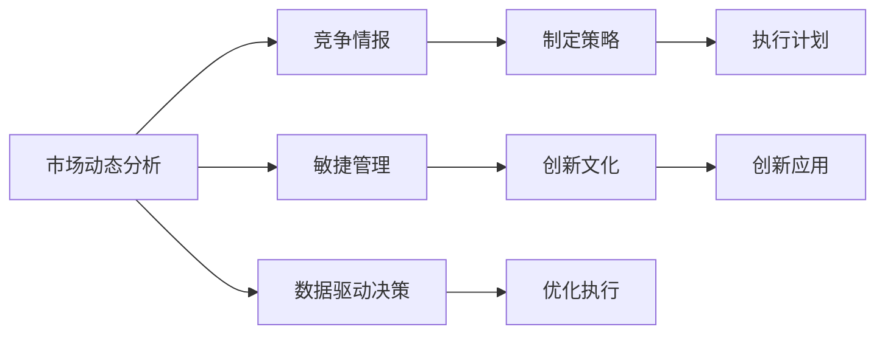

                 

# 管理者如何应对快速变化的商业环境

在当今高速发展的商业环境中，管理者面临着前所未有的挑战。市场趋势瞬息万变，竞争激烈，客户需求不断更新，技术进步日新月异。因此，管理者需要具备敏锐的洞察力、灵活的应变能力以及创新思维，以在快速变化的商业环境中立于不败之地。本文将从多个角度探讨管理者如何应对这些挑战，包括适应变化、利用数据驱动决策、培养创新文化等方面，为管理者提供实用的指导。

## 1. 背景介绍

### 1.1 问题由来
随着全球化和信息化的深入发展，商业环境变得更加复杂多变。消费者的需求日益个性化，市场竞争趋于白热化，企业之间的合作与竞争边界更加模糊。这些变化要求管理者具备更加综合和系统化的思维能力，以应对日益复杂的商业环境。

### 1.2 问题核心关键点
管理者在快速变化的商业环境中需要关注的几个关键点包括：
- **市场动态**：及时了解市场趋势和消费者需求的变化。
- **竞争态势**：分析竞争对手的动态和策略，寻找差异化优势。
- **内部管理**：优化内部流程和组织架构，提升效率和灵活性。
- **技术创新**：紧跟技术发展的步伐，利用新技术提升业务能力。

## 2. 核心概念与联系

### 2.1 核心概念概述

为了更好地理解如何在快速变化的商业环境中应对挑战，首先需要明确几个核心概念：

- **市场动态分析**：通过数据分析和趋势预测，了解市场变化和消费者需求，为决策提供依据。
- **竞争情报**：收集和分析竞争对手的动态，评估自身优势和劣势。
- **敏捷管理**：采用敏捷开发和项目管理方法，提升组织对变化的响应速度和灵活性。
- **数据驱动决策**：利用大数据和人工智能技术，分析海量数据，辅助决策过程。
- **创新文化**：鼓励创新和实验，营造开放包容的企业文化，激发员工的创造力。

这些概念通过以下Mermaid流程图展示它们的相互关系：



此流程图展示了市场动态分析如何通过竞争情报来制定策略，并通过敏捷管理和数据驱动决策优化执行。创新文化则促进了创新应用的产生，并进一步推动了策略的执行和优化。

## 3. 核心算法原理 & 具体操作步骤

### 3.1 算法原理概述

管理者应对快速变化的商业环境，可以借鉴和应用许多现代算法和原理，以下是几种核心算法原理：

- **聚类分析**：通过将数据分组，识别市场中的关键趋势和细分市场，帮助制定有针对性的策略。
- **回归分析**：利用历史数据预测未来趋势，为决策提供科学的依据。
- **神经网络**：通过模拟人脑的神经网络结构，识别数据中的复杂模式和关联，提升预测和决策的准确性。

### 3.2 算法步骤详解

基于上述算法原理，管理者应对快速变化的商业环境可以按照以下步骤操作：

**Step 1: 数据收集与准备**
- 收集市场动态数据，包括消费者行为、竞争对手动向、行业报告等。
- 清理和整理数据，去除噪声和异常值，确保数据质量。

**Step 2: 市场动态分析**
- 应用聚类分析方法，对数据进行分组，识别关键市场趋势和细分市场。
- 利用回归分析模型，预测未来市场变化和消费者需求。

**Step 3: 竞争情报**
- 收集竞争对手的信息，如产品、服务、市场份额等。
- 应用神经网络模型，分析竞争对手的策略和优势，评估自身竞争力。

**Step 4: 敏捷管理**
- 采用敏捷开发方法，如Scrum、Kanban，提高项目管理的灵活性和响应速度。
- 定期回顾和调整项目计划，确保与市场变化同步。

**Step 5: 数据驱动决策**
- 利用数据挖掘技术，分析客户行为和反馈，优化产品和服务。
- 利用机器学习模型，预测市场变化和消费者需求，指导决策。

**Step 6: 创新应用**
- 鼓励员工提出创新建议，构建创新激励机制。
- 利用原型设计和实验，快速验证和迭代创新方案。

### 3.3 算法优缺点

基于算法的商业环境应对方法，具有以下优点：

- **科学决策**：通过数据分析和模型预测，提高了决策的科学性和准确性。
- **快速响应**：敏捷管理方法提高了组织的灵活性和响应速度，能够快速调整策略。
- **创新驱动**：鼓励创新和实验，提升了企业竞争力。

同时，这些方法也存在一些缺点：

- **技术门槛高**：需要一定的数据科学和技术背景，对管理者提出了较高要求。
- **资源投入大**：数据收集、模型训练和实验验证需要大量资源和时间。
- **结果不确定**：算法模型存在不确定性，预测结果可能与实际情况有偏差。

### 3.4 算法应用领域

以上算法原理和操作步骤在多个领域都有广泛应用，如：

- **零售业**：利用聚类分析识别消费者细分市场，通过回归分析预测库存需求，优化供应链管理。
- **制造业**：通过竞争情报分析竞争对手的市场策略，利用神经网络模型优化生产流程和产品质量。
- **金融业**：应用数据驱动决策分析客户行为，预测市场趋势，制定投资策略。
- **服务行业**：利用敏捷管理方法提升服务响应速度，通过创新应用提升客户满意度。

## 4. 数学模型和公式 & 详细讲解 & 举例说明

### 4.1 数学模型构建

为了更好地理解如何应用算法原理，本文将以零售业为例，构建基于回归分析的市场动态分析模型。假设我们有历史销售数据 $y$，包括时间 $t$ 和销售量 $s$。

设回归模型为 $y = \beta_0 + \beta_1 t + \epsilon$，其中 $\beta_0$ 和 $\beta_1$ 为回归系数，$\epsilon$ 为误差项。目标是寻找最优的 $\beta_0$ 和 $\beta_1$，使得模型预测值与实际销售量尽可能接近。

### 4.2 公式推导过程

最小二乘法（Least Squares Method）是常用的回归模型参数估计方法。根据最小二乘法，目标是最小化预测误差平方和：

$$
\min_{\beta_0, \beta_1} \sum_{i=1}^n (y_i - \hat{y}_i)^2
$$

其中 $\hat{y}_i = \beta_0 + \beta_1 t_i$ 为预测值。求解上述优化问题的公式为：

$$
\hat{\beta}_1 = \frac{\sum_{i=1}^n t_i (y_i - \bar{y})}{\sum_{i=1}^n t_i^2 - n \bar{t}^2}
$$

$$
\hat{\beta}_0 = \bar{y} - \hat{\beta}_1 \bar{t}
$$

其中 $\bar{y}$ 和 $\bar{t}$ 分别为 $y$ 和 $t$ 的均值。

### 4.3 案例分析与讲解

假设某零售企业有10年的销售数据，应用上述回归模型进行预测。结果显示，该企业年度销售量与时间呈线性关系，且预测误差较小。这表明模型能够较好地捕捉市场趋势，帮助企业做出科学的决策。

## 5. 项目实践：代码实例和详细解释说明

### 5.1 开发环境搭建

在进行项目实践前，首先需要搭建开发环境。以下是Python环境配置的步骤：

1. 安装Anaconda：从官网下载并安装Anaconda，用于创建独立的Python环境。
2. 创建并激活虚拟环境：
```bash
conda create -n pyenv python=3.8 
conda activate pyenv
```

3. 安装必要的库：
```bash
conda install pandas numpy scikit-learn matplotlib seaborn statsmodels
```

4. 下载并解压数据集。

### 5.2 源代码详细实现

接下来，我们以预测零售业销售数据为例，使用Python实现回归分析模型。

```python
import pandas as pd
import numpy as np
from statsmodels.regression.linear_model import OLS

# 读取数据
df = pd.read_csv('sales_data.csv')

# 数据预处理
X = df[['year']].values
y = df['sales'].values

# 模型拟合
model = OLS(y, X)
results = model.fit()

# 预测
forecast = results.fittedvalues

# 输出预测结果
print(forecast)
```

### 5.3 代码解读与分析

这段代码主要完成了以下步骤：

1. 读取数据集并预处理，将时间作为自变量 $t$，销售量作为因变量 $y$。
2. 使用OLS模型拟合回归方程，得到回归系数 $\beta_0$ 和 $\beta_1$。
3. 使用拟合结果预测未来销售量，并输出预测结果。

## 6. 实际应用场景

### 6.1 零售业

在零售业中，管理者可以利用回归分析预测未来销售趋势，优化库存管理。例如，某零售企业应用回归模型预测下一季度的销售量，发现同比增长10%。于是企业提前增加库存，确保了供应和需求匹配，避免了断货和积压。

### 6.2 制造业

在制造业中，管理者可以利用神经网络模型分析竞争对手的供应链策略，优化自身的生产流程。例如，某汽车制造企业应用神经网络模型分析竞争对手的生产数据，发现竞争对手在某一时间段内大幅增加零部件采购量。企业通过增加该时间段内零部件库存，避免了生产中断，提升了生产效率。

### 6.3 金融业

在金融业中，管理者可以利用数据驱动决策分析客户行为，制定投资策略。例如，某基金管理公司利用数据挖掘技术分析客户的交易记录，发现部分客户在某一时间段内频繁交易某类资产。公司据此推出定制化的投资策略，提高了客户满意度和收益水平。

## 7. 工具和资源推荐

### 7.1 学习资源推荐

为了帮助管理者更好地掌握应对快速变化商业环境的方法，推荐以下学习资源：

1. 《数据科学导论》：一本经典的数据科学入门教材，涵盖数据收集、处理、分析和可视化等内容。
2. 《敏捷项目管理》：介绍敏捷开发和项目管理方法，帮助管理者提升项目管理的灵活性和响应速度。
3. 《机器学习实战》：通过实战案例讲解机器学习算法，适合管理者学习和应用。
4. Coursera《数据科学专项课程》：提供系统的数据科学课程，涵盖数据分析、机器学习、数据可视化等内容。
5. edX《人工智能导论》：由MIT和哈佛大学联合开设的AI课程，涵盖人工智能基础和应用。

通过这些学习资源，管理者可以系统掌握应对快速变化商业环境的方法和工具。

### 7.2 开发工具推荐

以下是几款用于商业环境应对的开发工具：

1. Python：流行的编程语言，拥有丰富的数据科学和机器学习库。
2. R：适合统计分析和数据可视化，广泛应用于商业环境分析。
3. Jupyter Notebook：交互式编程环境，支持代码编写、数据可视化和模型调试。
4. Tableau：数据可视化工具，方便快速生成图表和报告。
5. GitHub：代码托管平台，方便团队协作和版本管理。

### 7.3 相关论文推荐

以下是几篇涉及商业环境应对的经典论文，推荐阅读：

1. "Predicting Future Sales with Time Series Analysis"：介绍如何使用时间序列分析预测销售趋势。
2. "Competitive Intelligence in the Fast-Paced Business Environment"：探讨如何利用竞争情报提升企业竞争力。
3. "Agile Management: A Primer"：介绍敏捷管理方法，帮助管理者提升项目管理灵活性。
4. "Data-Driven Decision Making in Retail Industry"：讨论如何利用数据驱动决策优化零售业运营。
5. "Innovation and Entrepreneurship in the Digital Age"：探讨数字时代下的创新与创业，为管理者提供创新思路。

这些论文代表了大规模数据和算法在商业环境应对中的应用，为管理者提供了深入的理论支持。

## 8. 总结：未来发展趋势与挑战

### 8.1 研究成果总结

本文系统介绍了如何利用数据科学和机器学习技术应对快速变化的商业环境，主要研究成果包括：

- 分析了市场动态、竞争情报、敏捷管理、数据驱动决策和创新文化等核心概念及其相互关系。
- 提出了聚类分析、回归分析和神经网络等算法原理，并详细讲解了其实现步骤。
- 通过项目实践和实际应用案例，展示了这些方法和工具在零售、制造和金融等多个行业中的应用。

### 8.2 未来发展趋势

未来，商业环境应对的方法将呈现以下几个发展趋势：

1. **智能化决策**：随着人工智能技术的发展，智能决策系统将成为商业决策的重要工具，进一步提升决策的科学性和效率。
2. **个性化服务**：利用大数据和机器学习技术，为每个客户定制个性化的服务和产品，提升客户满意度和忠诚度。
3. **跨领域融合**：各行业之间的界限将更加模糊，跨领域融合将成为常态，新的商业模式和业务模式不断涌现。
4. **可持续性管理**：环境保护和可持续发展成为重要课题，管理者需引入绿色管理和可持续发展策略，确保企业的长期发展。

### 8.3 面临的挑战

尽管应对快速变化商业环境的方法取得了一定的进展，但仍面临诸多挑战：

1. **数据质量和隐私**：数据质量和隐私问题依然存在，数据收集和处理需要遵守相关法律法规。
2. **技术复杂性**：商业环境应对的方法和工具需要一定的技术背景，对管理者的要求较高。
3. **人才短缺**：具备数据科学和机器学习背景的专业人才相对较少，人才短缺现象普遍存在。
4. **模型解释性**：许多商业环境应对模型缺乏解释性，难以理解和解释模型决策过程。

### 8.4 研究展望

未来，商业环境应对的研究方向将从以下几个方面进行探索：

1. **多模态数据融合**：将多种类型的数据（如文本、图像、视频等）融合，提升决策的全面性和准确性。
2. **智能系统整合**：将人工智能技术与现有业务系统整合，实现智能化决策和自动化管理。
3. **算法优化**：不断优化算法模型，提高预测和决策的准确性和效率。
4. **模型可解释性**：发展可解释的机器学习模型，提高模型的透明度和可信度。
5. **伦理和合规**：研究伦理和合规问题，确保商业环境应对的公平性和合法性。

## 9. 附录：常见问题与解答

**Q1：商业环境应对是否需要所有管理者都具备数据科学背景？**

A: 并非所有管理者都需要具备数据科学背景。通过培训和学习，管理者可以掌握基本的数据分析技能和方法，提升决策科学性。同时，可以利用工具和技术，如Tableau、Power BI等，快速获取和分析数据，减少对技术背景的依赖。

**Q2：如何平衡商业决策和数据驱动决策？**

A: 数据驱动决策应作为辅助决策的工具，而非决策的唯一依据。管理者应结合自身经验和行业知识，综合考虑数据和模型预测结果，做出科学合理的决策。

**Q3：如何应对数据质量和隐私问题？**

A: 在数据收集和处理过程中，应确保数据来源的合法性和数据处理的合规性，遵守相关法律法规。同时，应采取数据清洗和匿名化措施，保护用户隐私。

**Q4：如何提升团队的创新能力？**

A: 建立开放包容的企业文化，鼓励员工提出创新建议，提供创新激励机制，如创新奖励、项目支持等。建立创新实验室或孵化器，支持员工进行创新实验。

通过以上总结和展望，管理者可以在快速变化的商业环境中，通过科学决策、智能化管理和创新驱动，提升企业的竞争力和可持续发展能力。管理者需要不断学习新知识，掌握新工具，应对新挑战，才能在激烈的市场竞争中立于不败之地。

---

作者：禅与计算机程序设计艺术 / Zen and the Art of Computer Programming

