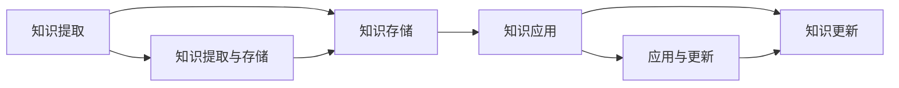

                 

# 管理者如何建立个人知识管理系统

## 1. 背景介绍

在快速变化和信息爆炸的时代，管理者面临着越来越多的挑战和机遇。如何在工作中有效地获取、组织、使用和更新知识，已成为管理者必须掌握的重要技能。个人知识管理系统的建立，不仅可以提升个人的工作效率，还可以为组织的知识共享和创新提供支撑。本文将详细探讨管理者如何构建高效的个人知识管理系统，帮助他们更好地应对挑战，抓住机遇。

## 2. 核心概念与联系

### 2.1 核心概念概述

- **个人知识管理系统(PKMS)**：一种帮助个人有效管理知识的工具，包括知识的获取、组织、应用和更新等环节。PKMS通过自动化和结构化的方式，提升知识管理的效率和效果。

- **知识提取**：从各种来源（如书籍、网络、会议等）中识别并抽取有价值的信息。这需要借助爬虫、OCR、文本分析等技术手段。

- **知识存储**：将抽取的知识进行存储和管理。传统方式如笔记本、文件夹，现在更多使用云笔记、数据库等数字化方式。

- **知识应用**：将存储的知识转化为实际的决策和行动。通过思维导图示意、案例分析、模拟演练等方式，增强知识的实操性和可操作性。

- **知识更新**：定期更新知识库，确保知识的最新性和时效性。可以通过阅读新文献、参与培训、交流研讨等方式进行。

这些核心概念之间相互关联，共同构成了个人知识管理系统的整体架构。下面通过一个简单的Mermaid流程图展示它们的联系：



### 2.2 核心概念原理和架构的 Mermaid 流程图

在上述流程图中，我们可以看到知识提取、存储、应用和更新是一个闭环，持续不断地进行，以支持个人和组织的学习和发展。

## 3. 核心算法原理 & 具体操作步骤

### 3.1 算法原理概述

个人知识管理系统的构建涉及多个算法和工具，以下是一些核心的算法原理：

- **信息检索算法**：用于快速从知识库中检索所需信息。常见的算法包括布尔检索、向量空间模型、主题模型等。
- **文本挖掘算法**：从大量文本数据中提取关键信息和模式。常见的算法包括TF-IDF、LDA、主题模型等。
- **推荐系统算法**：根据用户的历史行为和兴趣，推荐相关的知识和资源。常见的算法包括协同过滤、内容推荐、混合推荐等。
- **自然语言处理(NLP)**：用于文本的分析和理解。常见的算法包括分词、命名实体识别、情感分析等。

### 3.2 算法步骤详解

个人知识管理系统的构建步骤如下：

1. **需求分析**：明确个人知识管理的目标和需求，如快速检索、知识共享、决策支持等。
2. **系统规划**：选择合适的知识管理工具和平台，如Evernote、Notion、MindMeister等。
3. **数据收集**：从各种来源收集和整理知识，如文献、会议记录、工作笔记等。
4. **知识存储**：将收集的知识进行分类和结构化存储。可以使用标签、文件夹、笔记本等方式。
5. **知识应用**：将知识转化为具体的决策和行动，如通过案例分析、思维导图、模拟演练等方式。
6. **知识更新**：定期更新和维护知识库，确保知识的时效性和准确性。

### 3.3 算法优缺点

个人知识管理系统的构建有以下优缺点：

- **优点**：
  - 提升工作效率：快速检索和应用知识，减少重复劳动。
  - 促进知识共享：知识库中的内容可以供团队成员共享，加速知识传播。
  - 增强决策支持：系统中的知识可以作为决策依据，提高决策的科学性和准确性。
  - 个性化定制：根据个人需求和习惯定制知识管理工具和内容。

- **缺点**：
  - 初始成本高：需要投入时间和资源进行需求分析、工具选择、数据整理等。
  - 技术门槛高：需要掌握信息检索、文本挖掘、推荐系统等技术。
  - 依赖工具和平台：知识管理的工具和平台选择不当，会影响系统的效果和用户体验。
  - 数据安全问题：知识库中的敏感信息需要严格保护，避免数据泄露和滥用。

### 3.4 算法应用领域

个人知识管理系统不仅适用于个人管理，还广泛应用于企业、团队和组织的知识管理。在企业中，通过建立团队知识库和协作平台，可以实现知识的共享和积累，提升组织的创新能力和竞争力。

## 4. 数学模型和公式 & 详细讲解 & 举例说明

### 4.1 数学模型构建

个人知识管理系统的数学模型可以简化为以下形式：

$$
\text{PKMS} = \text{KD} + \text{KA} + \text{KU}
$$

其中：
- $\text{KD}$：知识获取与存储
- $\text{KA}$：知识应用
- $\text{KU}$：知识更新

### 4.2 公式推导过程

以知识检索算法中的向量空间模型为例，公式推导如下：

1. **文档向量表示**：将文本转换为向量形式，如TF-IDF向量。
2. **查询向量表示**：将查询条件转换为向量形式。
3. **文档相似度计算**：计算文档向量与查询向量的余弦相似度，找出最相关的文档。

公式为：

$$
\text{Similarity}(\text{doc}, \text{query}) = \cos(\theta) = \frac{\text{vec}(\text{doc}) \cdot \text{vec}(\text{query})}{\|\text{vec}(\text{doc})\|\|\text{vec}(\text{query})\|}
$$

### 4.3 案例分析与讲解

假设一个管理者需要查找“敏捷开发”相关的知识，步骤如下：

1. **文档向量表示**：将“敏捷开发”相关的文献、文章和笔记转换为TF-IDF向量。
2. **查询向量表示**：将“敏捷开发”查询条件转换为向量。
3. **文档相似度计算**：计算所有文档向量与查询向量的余弦相似度，找出最相关的文档。
4. **结果展示**：将最相关的文档展示给管理者，供其决策参考。

## 5. 项目实践：代码实例和详细解释说明

### 5.1 开发环境搭建

在搭建开发环境之前，需要安装Python、Jupyter Notebook等工具。以下是一个简单的Python开发环境搭建过程：

1. **安装Python**：从官网下载Python 3.8版本，安装并添加到系统环境变量中。
2. **安装Jupyter Notebook**：通过pip安装Jupyter Notebook，并启动Jupyter Notebook服务器。
3. **安装Pandas、NumPy等库**：通过pip安装Pandas、NumPy等数据处理库，供数据分析使用。

### 5.2 源代码详细实现

以下是一个简单的Python代码示例，用于实现基本的知识检索功能：

```python
import pandas as pd
from sklearn.feature_extraction.text import TfidfVectorizer
from sklearn.metrics.pairwise import cosine_similarity

# 文档数据
doc_data = pd.read_csv('docs.csv', encoding='utf-8')

# 查询条件
query = '敏捷开发'

# 构建TF-IDF向量
vectorizer = TfidfVectorizer()
doc_tfidf = vectorizer.fit_transform(doc_data['content'])

# 构建查询向量
query_tfidf = vectorizer.transform([query])

# 计算相似度
similarity = cosine_similarity(doc_tfidf, query_tfidf)

# 找到最相关文档
top_docs = doc_data.iloc[similarity.argmax(axis=1)]

# 输出结果
print(top_docs.head(5))
```

### 5.3 代码解读与分析

上述代码中，我们使用了Pandas库进行数据处理，使用Scikit-learn库进行TF-IDF向量和余弦相似度的计算。代码实现了基本的知识检索功能，并输出最相关的文档。

## 6. 实际应用场景

### 6.1 项目管理

个人知识管理系统在项目管理中具有重要应用价值。通过建立项目知识库，可以记录项目的进展、成果、问题等信息，供团队成员共享。管理者可以快速查找相关文档，参考历史项目的经验和教训，提高项目管理的效率和质量。

### 6.2 战略规划

战略规划需要大量的市场、行业、技术等知识。通过构建个人知识管理系统，管理者可以系统地收集和整理这些知识，构建战略框架，制定合理的战略目标和方案。系统还可以根据历史数据和实时信息，提供智能建议和预警，辅助管理者进行决策。

### 6.3 团队协作

个人知识管理系统可以支持团队的协作和交流。团队成员可以共享知识库中的资源，提出问题、分享经验，促进团队的创新和学习。管理者可以通过系统监控团队的学习和进步情况，及时提供指导和支持。

## 7. 工具和资源推荐

### 7.1 学习资源推荐

- **《知识管理的艺术》**：系统介绍了知识管理的原理、方法和工具，适合管理者参考和学习。
- **Coursera《知识管理与组织学习》课程**：通过在线课程学习知识管理的基础知识和技能。
- **Notion官方文档**：详细介绍了Notion的用法和功能，适合使用Notion进行知识管理的管理者参考。

### 7.2 开发工具推荐

- **Evernote**：功能强大的笔记工具，支持多平台同步，适合个人知识管理。
- **Notion**：全功能的协作平台，支持文档、表格、日历等多种类型的知识管理。
- **MindMeister**：思维导图工具，支持多人协作，适合团队知识管理。

### 7.3 相关论文推荐

- **《知识管理：一种理论基础》**：系统介绍了知识管理的理论基础和实践方法。
- **《知识管理系统设计与实现》**：介绍了知识管理系统的设计原则和技术实现。
- **《知识管理系统的综合应用》**：探讨了知识管理系统在实际应用中的综合应用效果和优化建议。

## 8. 总结：未来发展趋势与挑战

### 8.1 研究成果总结

本文详细介绍了个人知识管理系统的构建原理、操作步骤和应用场景，并通过代码示例展示了知识检索的实现过程。管理者可以通过建立个人知识管理系统，提升工作效率、促进知识共享和增强决策支持。

### 8.2 未来发展趋势

未来，个人知识管理系统将朝着以下几个方向发展：

- **智能化**：通过人工智能技术，如自然语言处理、推荐系统等，提升知识管理系统的智能化水平，自动推荐相关知识。
- **协同化**：引入团队协作机制，支持多人协同编辑、讨论和共享，提升团队的知识管理效率。
- **移动化**：支持移动设备和云同步，实现随时随地访问和管理知识库。
- **可视化**：通过图表、思维导图等可视化工具，增强知识的表现力和可操作性。

### 8.3 面临的挑战

尽管个人知识管理系统在发展中取得了一定进展，但仍面临以下挑战：

- **技术门槛**：知识管理系统的设计和实现需要掌握多种技术和工具。
- **数据安全**：知识库中的敏感信息需要严格保护，防止数据泄露和滥用。
- **知识更新**：知识库需要定期更新，确保知识的时效性和准确性。
- **用户接受度**：需要说服管理者接受和应用新的知识管理工具。

### 8.4 研究展望

未来的研究方向包括：

- **多模态知识管理**：结合文本、图像、音频等多种模态，提升知识管理的全面性和深度。
- **社交网络分析**：利用社交网络分析技术，发现知识管理的瓶颈和优化点。
- **智能推荐系统**：开发智能推荐算法，提升知识推荐的精准度和用户体验。

## 9. 附录：常见问题与解答

### 9.1 Q1: 什么是个人知识管理系统？

A: 个人知识管理系统是一种帮助个人有效管理知识的工具，包括知识的获取、组织、应用和更新等环节。

### 9.2 Q2: 如何选择合适的知识管理工具？

A: 选择知识管理工具需要考虑以下几个方面：
1. 功能需求：根据个人和团队的需求，选择支持文档、笔记、标签、表格等功能的工具。
2. 易用性：选择界面友好、操作简便的工具，便于日常使用。
3. 扩展性：选择支持插件和第三方扩展的工具，满足未来的功能需求。
4. 安全性：选择数据加密、权限控制等安全措施完善的工具，确保数据安全。

### 9.3 Q3: 如何管理知识库中的敏感信息？

A: 管理知识库中的敏感信息需要采取以下措施：
1. 加密存储：使用数据加密技术，保护知识库中的敏感信息。
2. 权限控制：设置用户访问权限，限制非授权用户的访问。
3. 审计日志：记录知识库中的访问和操作日志，便于追溯和监控。
4. 定期备份：定期备份知识库，防止数据丢失和损坏。

### 9.4 Q4: 如何保持知识库的时效性？

A: 保持知识库的时效性需要采取以下措施：
1. 定期更新：定期收集和整理新知识，更新知识库。
2. 实时监控：实时监控知识库的使用情况，发现陈旧或失效的知识。
3. 智能推荐：开发智能推荐算法，根据用户的行为和需求，推荐最新的知识。

### 9.5 Q5: 如何提升知识库的协同能力？

A: 提升知识库的协同能力需要采取以下措施：
1. 团队协作工具：选择支持多人协同编辑、讨论和共享的工具，如Notion、Google Docs等。
2. 项目管理工具：使用项目管理工具，记录和跟踪团队的任务和进度。
3. 实时通讯工具：使用即时通讯工具，方便团队成员之间的交流和协作。

作者：禅与计算机程序设计艺术 / Zen and the Art of Computer Programming

