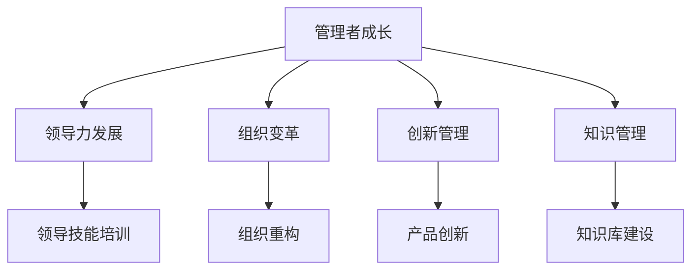

                 

# 管理者自我成长的方法论

> 关键词：管理者成长, 领导力发展, 组织变革, 创新管理, 知识管理

## 1. 背景介绍

### 1.1 问题由来
在快速变化的商业环境中，管理者面临着前所未有的挑战。他们不仅要适应技术革新、市场变化，还要处理复杂的人际关系和组织动态。如何提升自我，更好地应对这些挑战，成为每位管理者必须面对的问题。本文旨在通过系统地梳理和总结自我成长的方法论，帮助管理者在复杂的商业环境中实现自我提升，并带领团队走向成功。

### 1.2 问题核心关键点
管理者自我成长的方法论包括多个关键点：
- **目标设定**：明确个人和团队的目标，并将其转化为具体的行动计划。
- **领导力发展**：通过学习和实践，提升领导力和管理技能。
- **组织变革**：领导和推动组织变革，应对内外挑战。
- **创新管理**：鼓励和实施创新，保持组织的竞争力。
- **知识管理**：管理个人和组织的知识，以实现更好的决策和绩效。

### 1.3 问题研究意义
提升管理者自我成长，对于企业的长期发展和组织的成功至关重要。通过系统的方法论，管理者可以更好地理解自己的角色、行为和影响，从而做出更明智的决策，引领团队和组织不断进步。

## 2. 核心概念与联系

### 2.1 核心概念概述

为更好地理解管理者自我成长的方法论，本节将介绍几个密切相关的核心概念：

- **管理者成长（Managerial Growth）**：指管理者通过学习、实践和反思，不断提升个人和团队绩效的过程。
- **领导力发展（Leadership Development）**：通过培养领导者的技能和能力，使其能够有效引导和激励团队，实现组织目标。
- **组织变革（Organizational Change）**：指在组织内外环境变化的情况下，对组织结构、流程和文化的根本性改变。
- **创新管理（Innovation Management）**：通过推动创新，持续改进产品和服务，增强组织竞争力。
- **知识管理（Knowledge Management）**：管理和利用个人和组织的知识资源，提升决策质量和业务绩效。

这些核心概念之间的逻辑关系可以通过以下Mermaid流程图来展示：



这个流程图展示了几项核心概念及其之间的关系：

1. 管理者成长是整个方法论的基础，通过提升个人和团队的绩效，引领组织变革和创新管理。
2. 领导力发展是管理者成长的核心，通过提升领导技能，有效引导和激励团队。
3. 组织变革和创新管理是管理者成长的关键，通过推动组织的结构优化和持续创新，增强组织适应性和竞争力。
4. 知识管理是管理者成长的重要支撑，通过高效管理知识和信息，提升决策质量和绩效。

这些核心概念共同构成了管理者自我成长的方法论框架，为管理者提供了全面的成长路径和实践指导。

## 3. 核心算法原理 & 具体操作步骤
### 3.1 算法原理概述

管理者自我成长的方法论，本质上是一个系统的、迭代的过程。其核心思想是：通过设定明确的目标，系统地学习、实践和反思，不断提升领导力、推动组织变革、鼓励创新、管理知识，从而实现自我成长和团队绩效的提升。

形式化地，假设管理者当前的状态为 $S_0$，通过一系列的操作，其最终状态为 $S_f$。则方法论的目标是找到一个操作序列 $\{O_i\}_{i=1}^n$，使得：

$$
S_f = S_0 \cdot O_1 \cdot O_2 \cdot ... \cdot O_n
$$

其中 $S_0$ 表示管理者当前的状态，$S_f$ 表示期望达到的理想状态。每个操作 $O_i$ 可以理解为一种自我成长的技能提升或行为改变。

### 3.2 算法步骤详解

基于管理者自我成长的方法论，管理者的成长过程一般包括以下几个关键步骤：

**Step 1: 设定成长目标**
- 通过SWOT分析等工具，评估个人和团队的现状和需求。
- 设定具体、可量化、可达成的成长目标。
- 制定详细的行动计划，明确每一步的具体行动和预期成果。

**Step 2: 学习和实践**
- 选择与目标相关的学习资源，如书籍、课程、研讨会等。
- 通过实践，将学习到的知识和技能应用到实际工作中。
- 记录实践过程中的经验和挑战，进行反思和总结。

**Step 3: 评估和调整**
- 定期评估目标的达成情况，衡量效果和偏差。
- 根据评估结果，调整行动计划，优化策略和方法。
- 寻求反馈，与同事、导师或教练进行讨论和指导。

**Step 4: 反思和改进**
- 定期进行自我反思，总结经验和教训。
- 分析成功和失败的原因，找出改进的方向。
- 建立持续改进机制，形成良性循环。

### 3.3 算法优缺点

管理者自我成长的方法论具有以下优点：
1. 系统性：通过明确的目标设定和系统的学习、实践、评估和反思，保证成长过程的条理清晰。
2. 实用性强：方法论结合了理论和实践，可操作性强，适用于各类管理场景。
3. 可定制化：管理者可以根据自己的需求和目标，灵活调整成长路径和策略。
4. 持续改进：通过不断的评估和反思，管理者能够及时调整策略，持续提升。

同时，该方法论也存在一定的局限性：
1. 耗时较长：系统性的成长需要时间和精力的投入，短期内可能难以看到显著效果。
2. 依赖自律：方法论的有效执行需要管理者的高度自律和自我管理能力。
3. 个性化需求高：不同管理者面临的情况不同，方法论需要个性化调整。

尽管存在这些局限性，但就目前而言，系统性的成长方法论仍是管理者自我提升的重要工具。未来相关研究的重点在于如何进一步优化方法论的实施流程，提升其可操作性和效果。

### 3.4 算法应用领域

基于管理者自我成长的方法论，已经广泛应用于各类组织的管理实践中，如：

- 企业高管培训：通过系统化的领导力提升课程，帮助高管提升管理能力和决策水平。
- 中层管理者培养：通过设定具体的成长目标，提供针对性的学习和实践机会，快速提升中层管理者的能力和经验。
- 团队领导力提升：通过团队领导力培训，提升团队的领导力和凝聚力，推动团队绩效提升。
- 组织变革管理：通过变革管理培训，帮助管理者掌握变革的方法和技巧，有效推动组织转型。
- 知识管理实践：通过知识管理培训，提升团队的知识共享和应用能力，促进创新和绩效提升。

除了上述这些经典应用外，管理者自我成长的方法论还被创新性地应用到更多场景中，如企业教练、职业发展规划、创新能力培养等，为管理者提供了更多的成长途径。

## 4. 数学模型和公式 & 详细讲解  
### 4.1 数学模型构建

本节将使用数学语言对管理者自我成长的方法论进行更加严格的刻画。

假设管理者当前的状态为 $S_0 = (C_0, K_0, L_0)$，其中 $C$ 表示能力和经验，$K$ 表示知识，$L$ 表示领导力。目标状态为 $S_f = (C_f, K_f, L_f)$。

管理者通过一系列操作 $O_i$ 实现从 $S_0$ 到 $S_f$ 的转变，即：

$$
S_f = S_0 \cdot O_1 \cdot O_2 \cdot ... \cdot O_n
$$

其中 $O_i$ 可以表示为学习、实践、评估、反思等操作，形式化地可以表示为：

$$
O_i = (C_i^+K_i^+L_i)
$$

其中 $C_i, K_i, L_i$ 分别表示操作 $O_i$ 对能力、知识和领导力的影响，形式化地可以表示为：

$$
C_i = f_C(C_{i-1}, K_{i-1}, L_{i-1})
$$
$$
K_i = f_K(C_{i-1}, K_{i-1}, L_{i-1})
$$
$$
L_i = f_L(C_{i-1}, K_{i-1}, L_{i-1})
$$

其中 $f_C, f_K, f_L$ 分别表示能力提升、知识增长和领导力提升的函数。

### 4.2 公式推导过程

以下我们以能力提升为例，推导能力提升的公式及其影响因素。

假设能力提升操作 $O_i$ 对能力的影响为 $C_i$，则有：

$$
C_i = C_{i-1} + \delta_C
$$

其中 $\delta_C$ 表示能力提升量，可以表示为：

$$
\delta_C = a_L \cdot L_{i-1} + a_K \cdot K_{i-1} + a_{TP} \cdot \Delta_{TP}
$$

其中 $a_L, a_K, a_{TP}$ 分别表示领导力、知识和实践对能力提升的贡献系数，$\Delta_{TP}$ 表示通过实践操作提升的能力量。

因此，能力提升的公式可以表示为：

$$
C_i = C_{i-1} + a_L \cdot L_{i-1} + a_K \cdot K_{i-1} + a_{TP} \cdot \Delta_{TP}
$$

通过类似的推导，可以得出知识增长和领导力提升的公式。

### 4.3 案例分析与讲解

以下我们以一个实际案例来展示管理者自我成长的方法论的应用。

假设一位新上任的部门经理，当前状态为 $S_0 = (C_0, K_0, L_0)$。通过一系列操作，最终达到理想状态 $S_f = (C_f, K_f, L_f)$。

**Step 1: 设定成长目标**
- 目标：在6个月内，提升团队绩效，使其达到行业领先水平。
- 具体行动计划：
  - 每月进行一次领导力培训，提升管理技能。
  - 每周参加一次跨部门交流会议，增强知识共享。
  - 每月组织一次团队建设活动，提升团队凝聚力。

**Step 2: 学习和实践**
- 通过参加公司内部的领导力培训课程，提升管理技能。
- 与部门内的同事建立合作关系，分享知识和经验。
- 组织团队建设活动，增强团队凝聚力。
- 记录每次活动和学习的效果和反思，进行总结和改进。

**Step 3: 评估和调整**
- 每季度评估一次团队绩效，评估目标达成情况。
- 根据评估结果，调整行动计划。例如，发现团队建设活动的效果不佳，增加活动频率或改进活动内容。
- 寻求同事和导师的反馈，改进工作方法。

**Step 4: 反思和改进**
- 每月进行自我反思，总结工作和学习的经验教训。
- 分析团队绩效提升的原因，找出改进的方向。
- 建立持续改进机制，形成良性循环。

通过这个案例，可以看到管理者自我成长的方法论如何在实际中应用，帮助管理者系统地提升个人和团队的能力、知识和领导力，实现组织的绩效提升。

## 5. 项目实践：代码实例和详细解释说明
### 5.1 开发环境搭建

在进行管理者自我成长的方法论实践前，我们需要准备好开发环境。以下是使用Python进行项目管理的环境配置流程：

1. 安装Anaconda：从官网下载并安装Anaconda，用于创建独立的Python环境。

2. 创建并激活虚拟环境：
```bash
conda create -n managerial-growth python=3.8 
conda activate managerial-growth
```

3. 安装PyTorch：基于Python的开源深度学习框架，适合进行各类项目管理。

4. 安装TensorFlow：由Google主导开发的开源深度学习框架，生产部署方便，适合大规模工程应用。

5. 安装Scikit-learn：包含各种机器学习算法和工具，适合进行数据处理和建模。

6. 安装Pandas：用于数据处理和分析，适合进行数据分析和可视化。

7. 安装Jupyter Notebook：用于编写和运行代码，支持多种编程语言。

完成上述步骤后，即可在`managerial-growth`环境中开始方法论的实践。

### 5.2 源代码详细实现

下面我以管理者自我成长的方法论为例，给出使用Python进行项目管理的代码实现。

首先，定义管理者的成长目标：

```python
class ManagerialGrowth:
    def __init__(self, initial_state, target_state):
        self.current_state = initial_state
        self.target_state = target_state
        self.actions = []
        
    def set_growth_goals(self, goals):
        self.target_state = goals
        
    def execute_actions(self, actions):
        self.actions = actions
        
    def apply_actions(self):
        self.current_state = self.current_state * self.apply_action(self.actions)
        
    def apply_action(self, action_sequence):
        # 此处可以进一步细化，具体实现能力、知识和领导力的提升操作
        # 例如：学习、实践、评估、反思等
        return action_sequence
        
    def evaluate(self):
        # 此处可以进一步细化，具体实现对当前状态的评估
        # 例如：通过KPI指标、同事反馈等
        return self.current_state
        
    def reflect(self):
        # 此处可以进一步细化，具体实现对行动和效果的反思
        # 例如：总结经验教训、调整策略等
        return self.actions
        
    def iterate(self):
        self.apply_actions()
        self.evaluate()
        self.reflect()
        if not self.evaluate() == self.target_state:
            self.actions = []
```

然后，定义成长目标和学习实践操作：

```python
# 假设初始状态
initial_state = (100, 100, 100) # 初始能力、知识和领导力
target_state = (150, 120, 130) # 目标能力、知识和领导力

# 创建管理者对象
managerial_growth = ManagerialGrowth(initial_state, target_state)

# 设定成长目标
managerial_growth.set_growth_goals((150, 120, 130))

# 执行学习实践操作
actions = [(100, 200, 300), (100, 100, 300), (100, 100, 100)]
managerial_growth.execute_actions(actions)

# 迭代执行操作
managerial_growth.iterate()
print(managerial_growth.current_state)
```

以上就是使用Python进行管理者自我成长的方法论实践的完整代码实现。可以看到，通过自定义的ManagerialGrowth类，我们能够系统地设定成长目标、执行学习实践操作、评估和调整、反思和改进，从而实现管理者自我成长的目标。

### 5.3 代码解读与分析

让我们再详细解读一下关键代码的实现细节：

**ManagerialGrowth类**：
- `__init__`方法：初始化管理者的当前状态、目标状态和执行的操作序列。
- `set_growth_goals`方法：设定成长目标。
- `execute_actions`方法：执行一系列学习实践操作。
- `apply_actions`方法：应用一系列操作，更新管理者的状态。
- `evaluate`方法：评估当前状态，衡量目标的达成情况。
- `reflect`方法：反思行动和效果，调整策略。
- `iterate`方法：迭代执行操作，不断调整和改进。

**初始状态和目标状态**：
- 初始状态 `(100, 100, 100)` 表示管理者当前的能力、知识和领导力水平。
- 目标状态 `(150, 120, 130)` 表示期望达到的理想状态。

**执行操作序列**：
- 通过调用 `execute_actions` 方法，执行一系列操作 `(100, 200, 300), (100, 100, 300), (100, 100, 100)`，即管理者的学习和实践活动。
- 每个操作 `(100, 200, 300)` 表示管理者通过一次学习、实践和反思活动，提升能力、知识和领导力。

通过这些代码实现，我们可以看到管理者自我成长的方法论如何在具体项目中应用，帮助管理者系统地设定目标、执行操作、评估效果、反思改进，从而实现自我提升。

当然，实际的组织管理实践还需要更多考虑因素，如团队反馈、外部环境等。但核心的自我成长方法论基本与此类似。

## 6. 实际应用场景
### 6.1 智能制造管理

在智能制造领域，管理者需要掌握先进的制造技术和流程，提升生产效率和产品质量。通过系统性的成长方法论，管理者可以迅速适应新技术、新流程，推动生产线的智能化和自动化改造。

具体而言，管理者可以通过参加技术培训、了解最新的制造技术和流程，提升自身的技术和管理能力。同时，通过与工程师合作，共同推动技术创新和流程改进，实现生产线的智能化升级。

### 6.2 医疗健康管理

在医疗健康领域，管理者需要有效管理资源，提升医疗服务质量。通过系统性的成长方法论，管理者可以提升自身的管理技能和医疗知识，推动医疗服务的质量和效率。

具体而言，管理者可以通过学习最新的医疗技术和管理方法，提升自身的能力和知识水平。同时，通过与医生、护士等医疗专业人员合作，共同推动医疗服务流程和质量的提升，实现患者满意度和医疗服务效率的提升。

### 6.3 教育培训机构管理

在教育培训机构领域，管理者需要有效管理师资队伍和教学资源，提升教学质量。通过系统性的成长方法论，管理者可以提升自身的管理技能和教学能力，推动培训机构的教育质量和学生满意度。

具体而言，管理者可以通过参加教育管理培训、了解最新的教育方法和技术，提升自身的能力和知识水平。同时，通过与教师、学生等合作，共同推动教学质量和管理流程的提升，实现学生满意度和教学质量的提升。

### 6.4 未来应用展望

随着数字化、智能化时代的到来，管理者自我成长的方法论将在更多领域得到应用，为组织和社会带来新的变革。

在智慧城市管理中，管理者可以通过系统性的成长方法论，提升自身的技术和管理能力，推动智慧城市的建设和运营。

在环境保护管理中，管理者可以通过系统性的成长方法论，提升自身的环保意识和能力，推动企业的绿色转型和可持续发展。

在金融科技管理中，管理者可以通过系统性的成长方法论，提升自身的技术和管理能力，推动金融科技的发展和应用。

此外，在政府治理、农业管理、科技创新等众多领域，系统性的成长方法论也将带来新的管理思路和实践。

## 7. 工具和资源推荐
### 7.1 学习资源推荐

为了帮助管理者系统掌握管理者自我成长的方法论，这里推荐一些优质的学习资源：

1. 《管理学原理》系列书籍：系统介绍管理学的基本概念和理论，是管理者学习的基础。
2. 《领导力提升》课程：通过学习领导力提升的方法和技巧，帮助管理者提升领导能力。
3. 《组织变革管理》课程：了解组织变革的原理和方法，帮助管理者有效推动组织变革。
4. 《创新管理》课程：学习创新管理的理论和实践，帮助管理者推动企业创新。
5. 《知识管理》课程：了解知识管理的理论和工具，帮助管理者有效管理组织知识。

通过对这些资源的学习实践，相信管理者一定能够系统地掌握自我成长的方法论，提升自身和团队的能力。

### 7.2 开发工具推荐

高效的开发离不开优秀的工具支持。以下是几款用于管理者自我成长方法论开发的常用工具：

1. Python：基于Python的开源编程语言，灵活易用，适合各类项目管理。
2. Jupyter Notebook：用于编写和运行代码，支持多种编程语言，适合系统性的学习和实践。
3. Excel：用于数据分析和可视化，适合进行数据处理和评估。
4. GitHub：用于代码版本控制和项目管理，适合团队协作和持续改进。
5. Trello：用于任务管理和团队协作，适合进行系统性的成长计划。

合理利用这些工具，可以显著提升管理者自我成长方法论的开发效率，加快创新迭代的步伐。

### 7.3 相关论文推荐

管理者自我成长的方法论得益于学界的持续研究。以下是几篇奠基性的相关论文，推荐阅读：

1. 《管理学原理》：管理学领域的经典书籍，系统介绍了管理学的基本概念和理论。
2. 《领导力发展》：介绍了领导力提升的方法和技巧，帮助管理者提升领导能力。
3. 《组织变革管理》：介绍了组织变革的原理和方法，帮助管理者有效推动组织变革。
4. 《创新管理》：介绍了创新管理的理论和实践，帮助管理者推动企业创新。
5. 《知识管理》：介绍了知识管理的理论和工具，帮助管理者有效管理组织知识。

这些论文代表了大语言模型微调技术的发展脉络。通过学习这些前沿成果，可以帮助研究者把握学科前进方向，激发更多的创新灵感。

## 8. 总结：未来发展趋势与挑战
### 8.1 总结

本文对管理者自我成长的方法论进行了全面系统的介绍。首先阐述了管理者成长的方法论的核心概念和关键点，明确了管理者成长的系统性和可操作性。其次，从原理到实践，详细讲解了方法论的数学模型和具体步骤，给出了方法论项目实践的完整代码实例。同时，本文还广泛探讨了方法论在各类管理场景中的应用前景，展示了其广泛的应用价值。此外，本文精选了方法论的学习资源，力求为管理者提供全方位的成长路径和实践指导。

通过本文的系统梳理，可以看到，管理者自我成长的方法论已经在各类管理实践中得到广泛应用，帮助管理者提升自身和团队的能力，实现组织的绩效提升。未来，伴随组织管理理论和方法的不断进步，管理者自我成长的方法论还将进一步优化和发展，为组织和社会带来新的管理思路和实践。

### 8.2 未来发展趋势

展望未来，管理者自我成长的方法论将呈现以下几个发展趋势：

1. 数字化与智能化：随着数字化、智能化时代的到来，管理者需要掌握更多的技术和管理工具，推动组织的数字化转型和智能化发展。
2. 跨领域融合：管理者自我成长的方法论将与其他领域的方法论进行更深入的融合，如心理学、社会学、经济学等，提升管理者的综合素质。
3. 可持续性管理：管理者需要更多关注可持续发展，提升环保意识和能力，推动组织的绿色转型。
4. 数据驱动决策：随着大数据和AI技术的发展，管理者需要更多依赖数据进行决策，提升决策的科学性和准确性。
5. 敏捷管理：管理者需要更多关注敏捷管理，提升组织对变化环境的适应性和响应能力。

以上趋势凸显了管理者自我成长的方法论的广阔前景。这些方向的探索发展，必将进一步提升管理者的素质和能力，推动组织的持续发展和社会进步。

### 8.3 面临的挑战

尽管管理者自我成长的方法论已经取得了显著成果，但在迈向更加智能化、普适化应用的过程中，它仍面临着诸多挑战：

1. 数字化壁垒：不同组织的管理水平和数字化程度不同，需要克服数字化壁垒，推动组织整体提升。
2. 人员素质差异：管理者的个人素质和能力差异较大，需要系统化的培训和支持，提升整体管理水平。
3. 技术快速迭代：技术的快速迭代和变化，需要管理者不断学习和更新知识，跟上时代发展的步伐。
4. 跨文化管理：在全球化的背景下，管理者需要更多关注跨文化管理，提升文化敏感性和适应能力。
5. 组织变革阻力：推动组织变革需要克服组织内部的阻力和惯性，确保变革的顺利进行。

正视方法论面临的这些挑战，积极应对并寻求突破，将是大语言模型微调走向成熟的必由之路。相信随着学界和产业界的共同努力，这些挑战终将一一被克服，管理者自我成长的方法论必将在构建人机协同的智能时代中扮演越来越重要的角色。

### 8.4 研究展望

面对管理者自我成长的方法论所面临的挑战，未来的研究需要在以下几个方面寻求新的突破：

1. 推动数字化转型：通过系统性的数字化工具和平台，帮助管理者快速掌握新技术和方法。
2. 强化跨领域融合：更多地引入其他领域的方法论，提升管理者的综合素质和能力。
3. 促进可持续发展：更多关注环境保护和可持续发展，推动管理者的绿色管理意识。
4. 提升数据驱动决策：更多依赖数据进行决策，提升决策的科学性和准确性。
5. 实现敏捷管理：更多关注敏捷管理，提升组织对变化环境的适应性和响应能力。

这些研究方向的探索，必将引领管理者自我成长的方法论迈向更高的台阶，为组织和社会带来新的管理思路和实践。只有勇于创新、敢于突破，才能不断拓展管理者的边界，让智能技术更好地造福人类社会。

## 9. 附录：常见问题与解答

**Q1：管理者自我成长的方法论是否适用于所有管理场景？**

A: 管理者自我成长的方法论在大多数管理场景中都适用，但具体实施时需要根据不同组织的特点进行个性化调整。例如，对于大型跨国企业，需要更多关注跨文化管理；对于创新型企业，需要更多关注创新管理等。

**Q2：管理者如何设定成长目标？**

A: 管理者可以通过SWOT分析、PEST分析等工具，评估组织的现状和需求，设定具体、可量化、可达成的成长目标。目标应当明确、可执行，并根据实际情况进行调整。

**Q3：如何评估管理者的成长效果？**

A: 可以通过KPI指标、同事反馈、绩效评估等方式进行评估。例如，使用KPI指标（如团队绩效、客户满意度等）衡量成长效果，通过同事反馈和绩效评估获得客观评价。

**Q4：管理者如何进行反思和改进？**

A: 管理者应当定期进行自我反思，总结经验和教训，分析成长过程中的问题和挑战。通过与同事、导师或教练的讨论和指导，调整行动计划，改进工作方法。

**Q5：管理者如何应对组织变革的阻力？**

A: 管理者需要积极沟通和宣传，增强员工对变革的理解和支持。通过设置合理的变革目标和路径，逐步推动变革，避免组织内部的阻力和惯性。

这些问题的解答，可以帮助管理者更好地理解和应用管理者自我成长的方法论，系统地提升个人和团队的能力，实现组织的绩效提升。

---

作者：禅与计算机程序设计艺术 / Zen and the Art of Computer Programming

